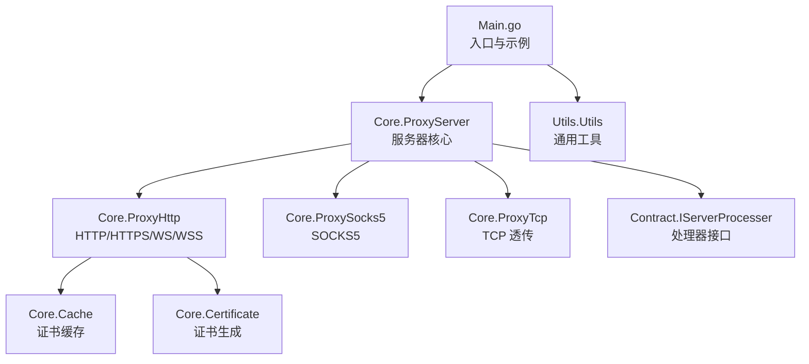
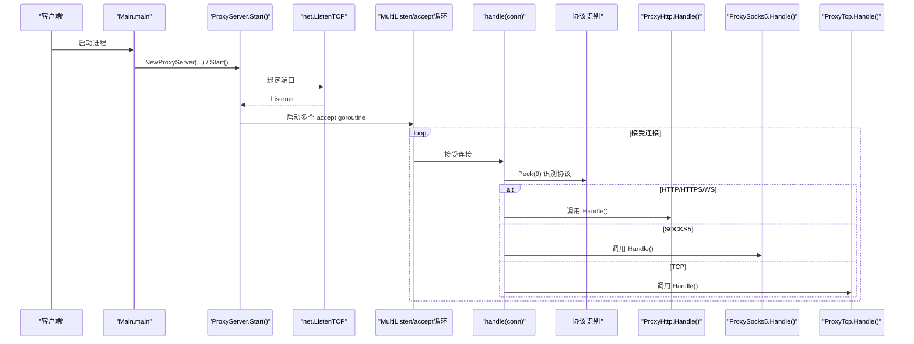
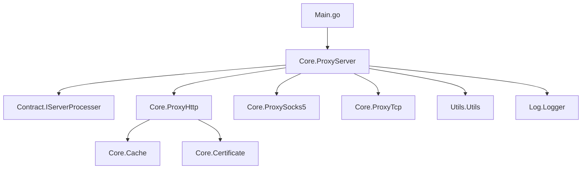

# API 参考

<cite>
**本文引用的文件**
- [Contract/IServerProcesser.go](file://Contract/IServerProcesser.go)
- [Core/ProxyServer.go](file://Core/ProxyServer.go)
- [Core/ProxyHttp.go](file://Core/ProxyHttp.go)
- [Core/ProxySocks5.go](file://Core/ProxySocks5.go)
- [Core/ProxyTcp.go](file://Core/ProxyTcp.go)
- [Main.go](file://Main.go)
- [README.md](file://README.md)
- [CODE-DOC.md](file://CODE-DOC.md)
- [Core/Cache.go](file://Core/Cache.go)
- [Core/Certificate.go](file://Core/Certificate.go)
- [Utils/Utils.go](file://Utils/Utils.go)
</cite>

## 目录
1. [简介](#简介)
2. [项目结构](#项目结构)
3. [核心组件](#核心组件)
4. [架构总览](#架构总览)
5. [详细组件分析](#详细组件分析)
6. [依赖分析](#依赖分析)
7. [性能考虑](#性能考虑)
8. [故障排查指南](#故障排查指南)
9. [结论](#结论)
10. [附录](#附录)

## 简介
本文件为 shermie-proxy 的完整 API 参考，覆盖公共接口、数据结构、事件回调、解析函数、常量与枚举、错误语义及使用示例。重点包括：
- IServerProcesser 接口定义与使用说明
- ProxyServer 类的构造、方法、属性与配置项
- 事件回调函数签名、参数与返回值规范
- ResolveHttpRequest、ResolveHttpResponse、ResolveSocks5、ResolveWs、ResolveTcp 等解析函数的详细说明
- 结构体定义、常量值、枚举类型与错误代码参考
- 每个 API 的使用示例与注意事项

## 项目结构
- 入口与示例：Main.go 提供命令行参数解析与事件回调注册示例
- 核心代理：Core 目录包含 ProxyServer、ProxyHttp、ProxySocks5、ProxyTcp 等
- 接口契约：Contract/IServerProcesser.go 定义协议处理器接口
- 证书与缓存：Core/Certificate.go、Core/Cache.go 提供根证书与证书缓存
- 工具函数：Utils/Utils.go 提供文件检测、端口检测等通用能力
- 文档：README.md 与 CODE-DOC.md 提供使用说明与架构细节

**图表来源**
- [Main.go:24-124](file://Main.go#L24-L124)
- [Core/ProxyServer.go:48-213](file://Core/ProxyServer.go#L48-L213)
- [Core/ProxyHttp.go:29-64](file://Core/ProxyHttp.go#L29-L64)
- [Core/ProxySocks5.go:15-52](file://Core/ProxySocks5.go#L15-L52)
- [Core/ProxyTcp.go:15-66](file://Core/ProxyTcp.go#L15-L66)
- [Contract/IServerProcesser.go:3-5](file://Contract/IServerProcesser.go#L3-L5)
- [Core/Cache.go:10-79](file://Core/Cache.go#L10-L79)
- [Core/Certificate.go:18-67](file://Core/Certificate.go#L18-L67)
- [Utils/Utils.go:13-62](file://Utils/Utils.go#L13-L62)

**章节来源**
- [Main.go:24-124](file://Main.go#L24-L124)
- [README.md:30-163](file://README.md#L30-L163)
- [CODE-DOC.md:30-79](file://CODE-DOC.md#L30-L79)

## 核心组件
- IServerProcesser 接口：所有协议处理器（ProxyHttp、ProxySocks5、ProxyTcp）均实现该接口，提供统一的 Handle() 入口。
- ProxyServer：服务器核心，负责监听、连接接受、协议识别与分发，并提供事件回调注册点。
- 事件回调：涵盖 HTTP、WebSocket、SOCKS5、TCP 的请求/响应与流事件，配合 resolve 函数实现数据拦截与修改。
- 解析函数：ResolveHttpRequest、ResolveHttpResponse、ResolveWs、ResolveSocks5、ResolveTcp，用于在回调中完成默认转发或自定义处理。

**章节来源**
- [Contract/IServerProcesser.go:3-5](file://Contract/IServerProcesser.go#L3-L5)
- [Core/ProxyServer.go:48-213](file://Core/ProxyServer.go#L48-L213)
- [Core/ProxyHttp.go:39-41](file://Core/ProxyHttp.go#L39-L41)
- [Core/ProxySocks5.go:21](file://Core/ProxySocks5.go#L21)
- [Core/ProxyTcp.go:21](file://Core/ProxyTcp.go#L21)

## 架构总览
下图展示服务器启动、连接接受、协议识别与处理器分发的整体流程。

**图表来源**
- [Main.go:24-124](file://Main.go#L24-L124)
- [Core/ProxyServer.go:123-203](file://Core/ProxyServer.go#L123-L203)

## 详细组件分析

### IServerProcesser 接口
- 接口定义
  - 名称：IServerProcesser
  - 方法：Handle()
- 用途：作为所有协议处理器的统一接口，要求实现 Handle() 以处理具体协议的业务逻辑。
- 实现者：ProxyHttp、ProxySocks5、ProxyTcp 均实现该接口。

**章节来源**
- [Contract/IServerProcesser.go:3-5](file://Contract/IServerProcesser.go#L3-L5)
- [Core/ProxyHttp.go:44](file://Core/ProxyHttp.go#L44)
- [Core/ProxySocks5.go:54](file://Core/ProxySocks5.go#L54)
- [Core/ProxyTcp.go:23](file://Core/ProxyTcp.go#L23)

### ProxyServer 类
- 构造函数
  - NewProxyServer(port string, nagle bool, proxy string, to string, network string) *ProxyServer
  - 作用：创建并初始化 ProxyServer 实例，设置端口、Nagle 算法、上级代理、目标 TCP 地址与网络接口。
- 属性
  - port：监听端口
  - nagle：是否启用 Nagle 算法（低延迟模式）
  - proxy：上级代理地址（host:port）
  - to：TCP 透传目标地址（仅 TCP 生效）
  - network：强制出口网卡 IP
  - dns：内置 DNS 缓存（5 分钟 TTL）
  - listener：TCP 监听器
  - 各类事件回调：见“事件回调”小节
- 方法
  - Install()：Windows 平台安装根证书并设置系统代理
  - UnInstall()：Windows 平台清空系统代理
  - Start()：启动监听，内部调用 MultiListen 并阻塞
  - Stop()：停止并卸载代理
  - MultiListen()：启动 5 个 goroutine 并发接受连接
  - handle(conn)：协议识别与处理器分发
  - beforeStart()：打印 Logo，一次性初始化
  - Logo()：打印 ASCII Logo
- 配置要点
  - 多端口：--port 支持逗号分隔多端口，每个端口独立 goroutine
  - 多网卡：--network 与 --port 数量一致，实现按端口绑定不同出口网卡
  - Nagle：--nagle true 表示启用低延迟（SetNoDelay(true)）

**章节来源**
- [Core/ProxyServer.go:68-77](file://Core/ProxyServer.go#L68-L77)
- [Core/ProxyServer.go:48-66](file://Core/ProxyServer.go#L48-L66)
- [Core/ProxyServer.go:79-108](file://Core/ProxyServer.go#L79-L108)
- [Core/ProxyServer.go:123-142](file://Core/ProxyServer.go#L123-L142)
- [Core/ProxyServer.go:156-174](file://Core/ProxyServer.go#L156-L174)
- [Core/ProxyServer.go:176-203](file://Core/ProxyServer.go#L176-L203)
- [Core/ProxyServer.go:110-121](file://Core/ProxyServer.go#L110-L121)
- [Core/ProxyServer.go:144-154](file://Core/ProxyServer.go#L144-L154)
- [Main.go:24-46](file://Main.go#L24-L46)
- [README.md:148-163](file://README.md#L148-L163)

### 事件回调系统
- 回调类型定义（均在 ProxyServer 中声明）
  - HttpRequestEvent：HTTP 请求事件
  - HttpResponseEvent：HTTP 响应事件
  - Socks5RequestEvent / Socks5ResponseEvent：SOCKS5 请求/响应事件
  - WsRequestEvent / WsResponseEvent：WebSocket 请求/响应事件
  - TcpConnectEvent / TcpClosetEvent：TCP 连接建立/关闭事件
  - TcpServerStreamEvent / TcpClientStreamEvent：TCP 服务端/客户端流事件
- Resolve 函数签名
  - ResolveHttpRequest(message []byte, request *http.Request)
  - ResolveHttpResponse(message []byte, response *http.Response)
  - ResolveWs(msgType int, message []byte) error
  - ResolveSocks5(buff []byte) (int, error)
  - ResolveTcp(buff []byte) (int, error)
- 回调触发时机与返回值语义
  - OnTcpConnectEvent / OnTcpCloseEvent：无返回值；OnTcpCloseEvent 在 defer 中触发
  - OnHttpRequestEvent / OnHttpResponseEvent：返回 bool，true 继续默认处理，false 跳过默认写回
  - OnSocks5RequestEvent / OnSocks5ResponseEvent：返回 (int, error)，int 为写入字节数，error 为错误
  - OnWsRequestEvent / OnWsResponseEvent：返回 error
  - OnTcpClientStreamEvent / OnTcpServerStreamEvent：返回 (int, error)
- 使用模式
  - 在回调中调用对应 resolve 函数完成默认转发
  - 若需要自定义处理，可在调用 resolve 前修改数据，或在回调中直接写回 conn 并返回相应语义值

**章节来源**
- [Core/ProxyServer.go:22-34](file://Core/ProxyServer.go#L22-L34)
- [Core/ProxyServer.go:56-65](file://Core/ProxyServer.go#L56-L65)
- [CODE-DOC.md:394-432](file://CODE-DOC.md#L394-L432)
- [CODE-DOC.md:408-416](file://CODE-DOC.md#L408-L416)
- [Main.go:52-121](file://Main.go#L52-L121)

### 解析函数详解
- ResolveHttpRequest
  - 作用：在 HTTP 请求事件中，将修改后的 message 重新注入到 http.Request，并设置 Content-Length
  - 调用时机：OnHttpRequestEvent 中，若用户未直接调用 resolve，则框架会使用内部 resolveRequest 注入
- ResolveHttpResponse
  - 作用：在 HTTP 响应事件中，将修改后的 message 重新注入到 http.Response，并设置 Content-Length
  - 调用时机：OnHttpResponseEvent 中，若用户未直接调用 resolve，则框架会使用内部 resolveResponse 注入
- ResolveWs
  - 作用：在 WebSocket 事件中，将修改后的消息转发至对端
  - 调用时机：OnWsRequestEvent / OnWsResponseEvent 中
- ResolveSocks5
  - 作用：在 SOCKS5 事件中，将修改后的二进制数据写回对端，返回写入字节数与错误
  - 调用时机：OnSocks5RequestEvent / OnSocks5ResponseEvent 中
- ResolveTcp
  - 作用：在 TCP 事件中，将修改后的二进制数据写回对端，返回写入字节数与错误
  - 调用时机：OnTcpClientStreamEvent / OnTcpServerStreamEvent 中

**章节来源**
- [Core/ProxyHttp.go:95-107](file://Core/ProxyHttp.go#L95-L107)
- [Core/ProxyHttp.go:118-129](file://Core/ProxyHttp.go#L118-L129)
- [Core/ProxyHttp.go:39-41](file://Core/ProxyHttp.go#L39-L41)
- [Core/ProxySocks5.go:21](file://Core/ProxySocks5.go#L21)
- [Core/ProxyTcp.go:21](file://Core/ProxyTcp.go#L21)

### HTTP/HTTPS/WS/WSS 处理器（ProxyHttp）
- 结构体
  - 包含 ConnPeer、request、response、upgrade、target、tls、port 等字段
- 关键方法
  - Handle()：解析请求，区分 CONNECT 与普通请求，分别走 handleSslRequest 或 handleRequest
  - handleRequest()：读取请求体、触发 OnHttpRequestEvent、转发、读取响应体、触发 OnHttpResponseEvent、写回客户端
  - ReadRequestBody / ReadResponseBody：读取请求/响应体，自动处理 gzip
  - RemoveHeader：移除 hop-by-hop 头
  - Transport：使用 http.Transport 转发，支持 --proxy 上级代理与 DialContext 拨号
  - DialContext：结合 DNS 缓存、网卡绑定与 Nagle 控制
- 常量
  - ConnectSuccess / ConnectFailed：CONNECT 成功/失败响应
  - SslFileHost：特殊路径 /tls 的主机标识
- 注意事项
  - /tls 路径用于下载根证书
  - gzip 响应体自动解码
  - 证书中间人：通过 Cache.GetCertificate 动态生成子证书

**章节来源**
- [Core/ProxyHttp.go:29-64](file://Core/ProxyHttp.go#L29-L64)
- [Core/ProxyHttp.go:67-132](file://Core/ProxyHttp.go#L67-L132)
- [Core/ProxyHttp.go:135-154](file://Core/ProxyHttp.go#L135-L154)
- [Core/ProxyHttp.go:157-180](file://Core/ProxyHttp.go#L157-L180)
- [Core/ProxyHttp.go:183-200](file://Core/ProxyHttp.go#L183-L200)
- [Core/ProxyHttp.go:25-27](file://Core/ProxyHttp.go#L25-L27)
- [Core/Cache.go:39-64](file://Core/Cache.go#L39-L64)

### SOCKS5 处理器（ProxySocks5）
- 结构体
  - 包含 ConnPeer、target、port
- 关键方法
  - Handle()：完成 SOCKS5 握手，解析命令、目标地址与端口，连接目标，启动双向转发
- 常量与枚举
  - 版本、命令、目标类型、认证方法等常量
  - SocketServer / SocketClient：用于区分数据方向
- 注意事项
  - 支持 IPv4、IPv6、域名目标
  - 端口 443 时使用 TLS 拨号
  - UDP 模式使用 net.DialTimeout

**章节来源**
- [Core/ProxySocks5.go:15-52](file://Core/ProxySocks5.go#L15-L52)
- [Core/ProxySocks5.go:54-200](file://Core/ProxySocks5.go#L54-L200)
- [Core/ProxySocks5.go:23-48](file://Core/ProxySocks5.go#L23-L48)

### TCP 透传处理器（ProxyTcp）
- 结构体
  - 包含 ConnPeer、target、port
- 关键方法
  - Handle()：解析 --to 目标地址，连接目标，可选 TLS 握手，启动双向转发
  - Transport(out chan<- error, originConn, targetConn, role)：按角色触发回调并写回
- 常量
  - TcpServer / TcpClient：用于区分数据方向
- 注意事项
  - Nagle 控制：--nagle false 时启用低延迟
  - 证书：通过 Cache.GetCertificate 获取/生成子证书并进行 TLS 握手

**章节来源**
- [Core/ProxyTcp.go:15-66](file://Core/ProxyTcp.go#L15-L66)
- [Core/ProxyTcp.go:68-112](file://Core/ProxyTcp.go#L68-L112)
- [Core/ProxyTcp.go:12-13](file://Core/ProxyTcp.go#L12-L13)
- [Core/Cache.go:39-64](file://Core/Cache.go#L39-L64)

### 证书系统与缓存
- 证书管理器（Certificate）
  - Init()：初始化根证书，若不存在则生成
  - GeneratePem(host)：为目标 host 生成子证书（PEM）
  - GenerateRootPemFile(host)：生成根证书文件（PEM）
  - GenerateKeyPair()：生成 RSA 2048 密钥对
- 证书缓存（Storage）
  - GetCertificate(hostname, port)：并发安全获取/生成证书，WaitGroup 避免重复生成
  - NewStorage()：创建全局缓存实例
- 常量
  - Cache：全局缓存实例
  - Cert：全局证书实例

**章节来源**
- [Core/Certificate.go:35-67](file://Core/Certificate.go#L35-L67)
- [Core/Certificate.go:69-116](file://Core/Certificate.go#L69-L116)
- [Core/Certificate.go:119-178](file://Core/Certificate.go#L119-L178)
- [Core/Certificate.go:181-188](file://Core/Certificate.go#L181-L188)
- [Core/Cache.go:10-79](file://Core/Cache.go#L10-L79)

### 工具函数
- FileExist(file string) bool：检查文件是否存在
- GetAvailablePort() (int, error)：获取系统分配的可用端口
- IsPortAvailable(port int) bool：判断端口是否可用
- GetLastTimeFrame(conn *tls.Conn, property string) []byte：反射读取 tls.Conn 内部字段（调试用途）

**章节来源**
- [Utils/Utils.go:13-62](file://Utils/Utils.go#L13-L62)

## 依赖分析
- 模块耦合
  - Main.go 依赖 Core.ProxyServer 与日志、证书初始化
  - ProxyServer 依赖 Contract.IServerProcesser、Log、Utils、dnscache
  - ProxyHttp/ProxySocks5/ProxyTcp 均依赖 ConnPeer 与各自解析逻辑
  - 证书系统通过 Cache 与 Certificate 协作
- 外部依赖
  - viki-org/dnscache：DNS 缓存
  - crypto/tls、crypto/x509：证书生成与 TLS 握手
  - net/http：HTTP 请求解析与转发
  - gorilla/websocket（fork）：WebSocket 协议处理

**图表来源**
- [Main.go:9-11](file://Main.go#L9-L11)
- [Core/ProxyServer.go:13-16](file://Core/ProxyServer.go#L13-L16)
- [Core/ProxyHttp.go:20-23](file://Core/ProxyHttp.go#L20-L23)
- [Core/ProxySocks5.go:12](file://Core/ProxySocks5.go#L12)
- [Core/ProxyTcp.go:9](file://Core/ProxyTcp.go#L9)

**章节来源**
- [CODE-DOC.md:65-78](file://CODE-DOC.md#L65-L78)

## 性能考虑
- 多 Accept goroutine：MultiListen 启动 5 个 goroutine 并发接受连接，提升高并发下的连接接受吞吐量
- DNS 缓存：内置 5 分钟 TTL 的 DNS 缓存，减少重复解析开销
- Nagle 控制：--nagle false 时启用 SetNoDelay(false)，降低延迟
- 证书缓存：并发安全的证书生成与复用，避免重复的 RSA 密钥生成开销
- gzip 自动解码：HTTP 响应体自动解码，减少用户侧处理成本

**章节来源**
- [Core/ProxyServer.go:156-174](file://Core/ProxyServer.go#L156-L174)
- [Core/Cache.go:39-64](file://Core/Cache.go#L39-L64)
- [Core/ProxyHttp.go:147-153](file://Core/ProxyHttp.go#L147-L153)

## 故障排查指南
- 无法启动监听
  - 检查 --port 是否为 0；多端口与多网卡数量是否一致
  - 使用 IsPortAvailable 检查端口占用
- 证书相关问题
  - Windows 平台：确认 InstallCert 与 SetSystemProxy 成功；/tls 路径可下载根证书
  - 非 Windows 平台：需手动安装证书并设置代理
- HTTP 请求异常
  - 检查 OnHttpRequestEvent 返回值；若返回 false，需自行写回响应
  - gzip 响应体自动解码，注意 Content-Encoding 处理
- TCP 透传异常
  - 检查 --to 目标地址解析；Nagle 设置与握手失败时的降级处理
- SOCKS5 异常
  - 确认目标地址类型（IPv4/IPv6/域名）与端口解析；UDP 模式超时时间

**章节来源**
- [Main.go:31-41](file://Main.go#L31-L41)
- [Utils/Utils.go:51-61](file://Utils/Utils.go#L51-L61)
- [Core/ProxyHttp.go:100-107](file://Core/ProxyHttp.go#L100-L107)
- [Core/ProxyTcp.go:26-35](file://Core/ProxyTcp.go#L26-L35)
- [Core/ProxySocks5.go:128-179](file://Core/ProxySocks5.go#L128-L179)

## 结论
sheremie-proxy 提供统一的多协议代理入口，通过 IServerProcesser 接口与事件回调系统实现强大的可扩展性。ProxyServer 作为核心控制器，结合 DNS 缓存、证书中间人与多端口多网卡能力，满足复杂网络环境下的代理需求。开发者可通过 Resolve 函数在各协议的关键节点进行数据拦截与修改，实现定制化的代理行为。

## 附录

### API 使用示例与注意事项
- 基本启动与事件注册
  - 参考 Main.go 中的 ListenBranch 示例，注册各类事件回调并在 Start() 后生效
- HTTP 请求/响应拦截
  - 在 OnHttpRequestEvent 中修改 message 并调用 resolve；在 OnHttpResponseEvent 中根据 Content-Type 判断是否输出
- WebSocket 拦截
  - 在 OnWsRequestEvent / OnWsResponseEvent 中修改消息并调用 resolve
- SOCKS5 拦截
  - 在 OnSocks5RequestEvent / OnSocks5ResponseEvent 中修改二进制数据并返回写入字节数
- TCP 流拦截
  - 在 OnTcpClientStreamEvent / OnTcpServerStreamEvent 中修改数据并返回写入字节数
- 注意事项
  - 返回值语义严格遵循回调定义；resolve 必须在默认行为与自定义处理之间正确选择
  - Windows 平台建议使用 Install() 完成证书安装与代理设置

**章节来源**
- [Main.go:52-121](file://Main.go#L52-L121)
- [README.md:30-163](file://README.md#L30-L163)