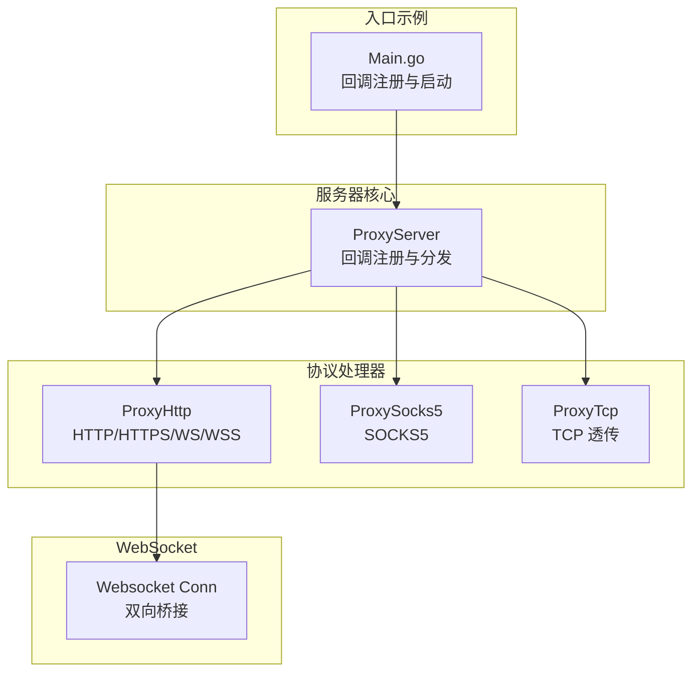
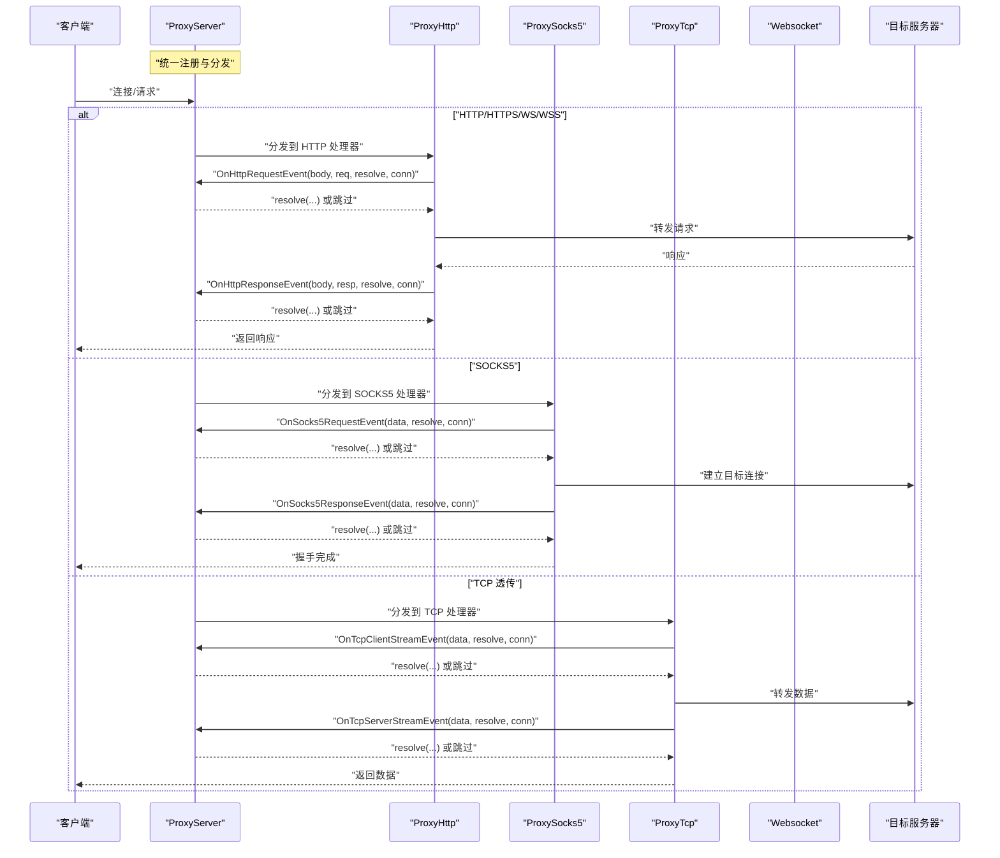
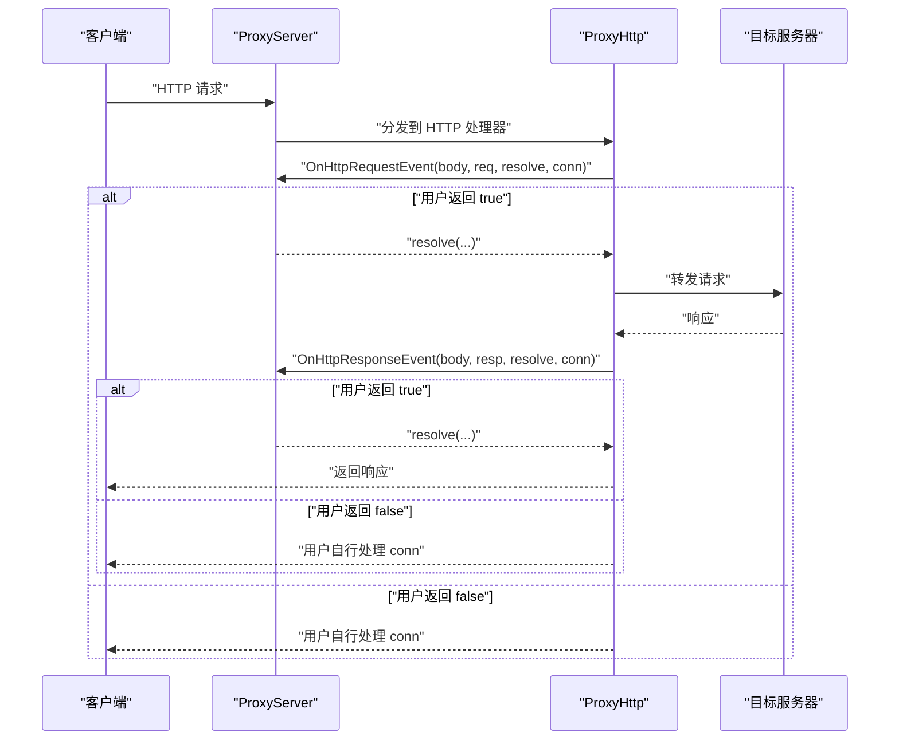
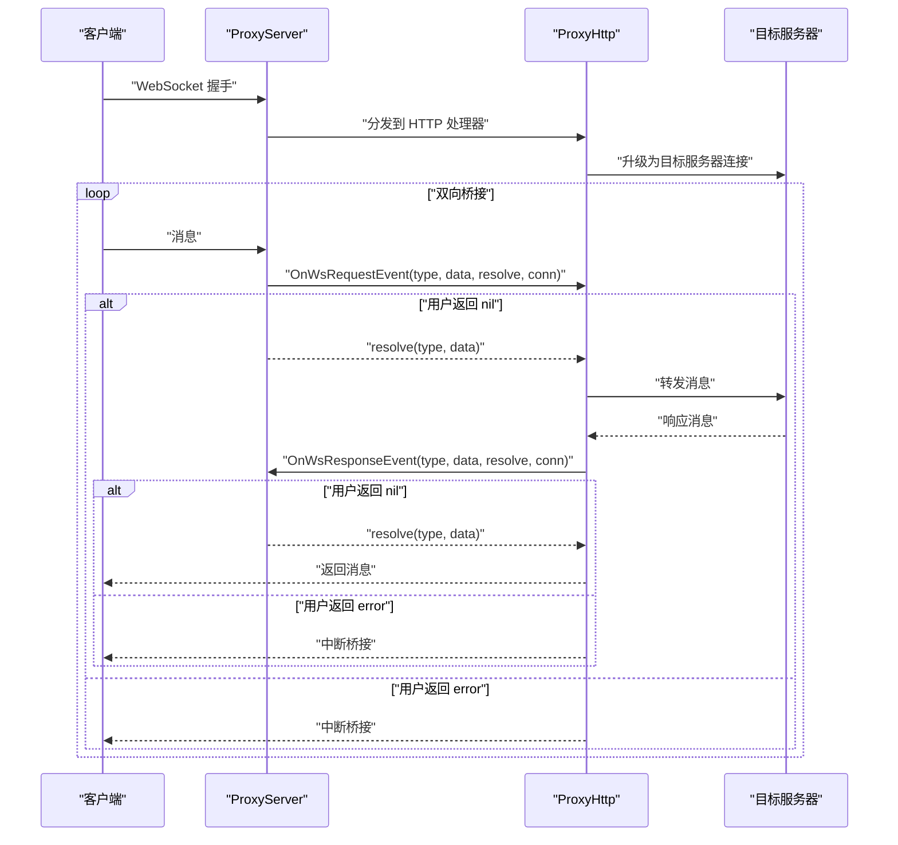
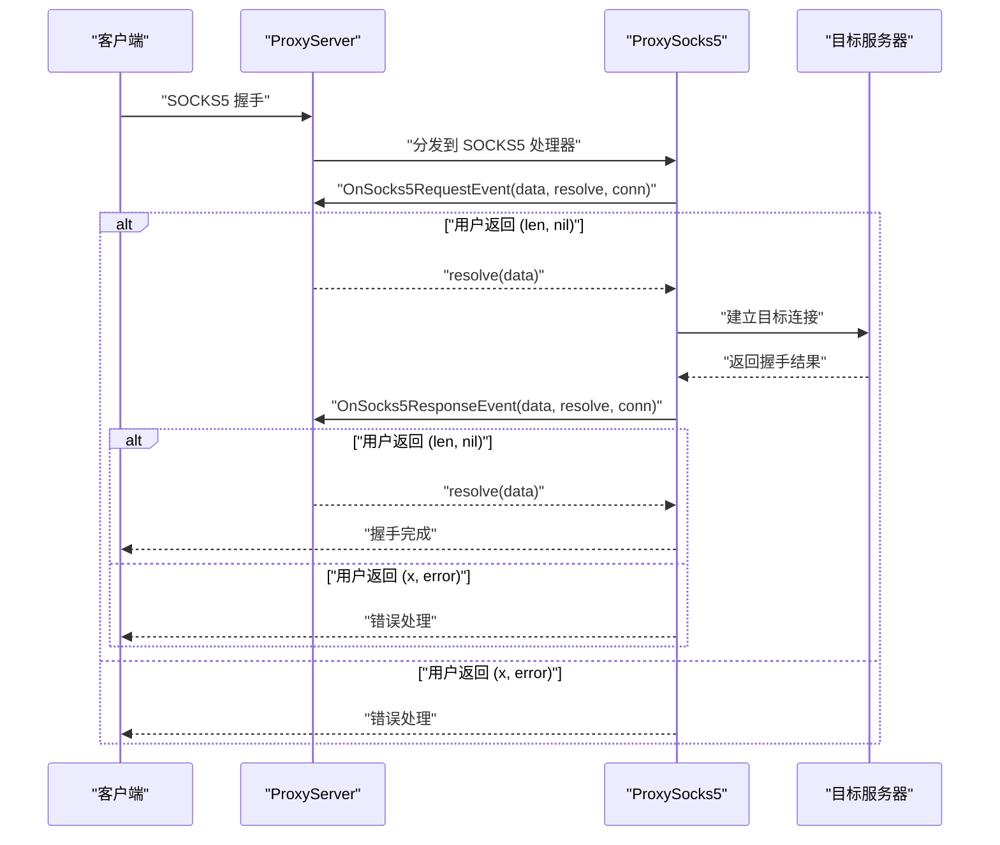
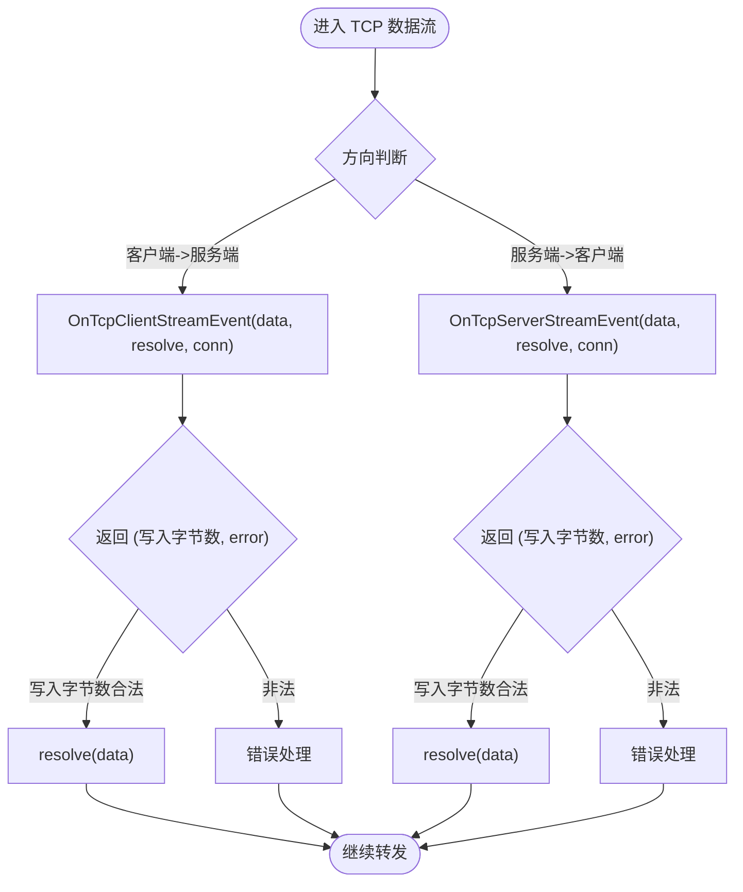
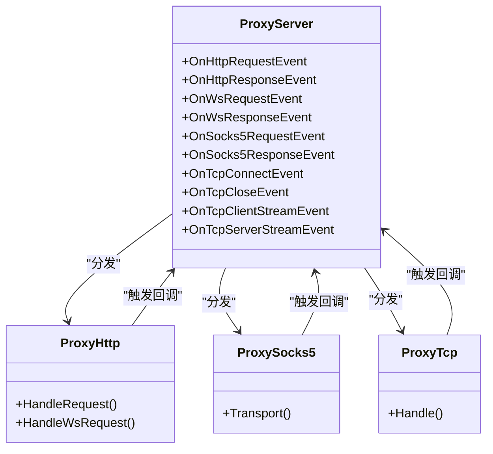

# 事件回调

<cite>
**本文引用的文件**
- [Main.go](file://Main.go)
- [README.md](file://README.md)
- [README-CN.md](file://README-CN.md)
- [CODE-DOC.md](file://CODE-DOC.md)
- [Core/ProxyServer.go](file://Core/ProxyServer.go)
- [Core/ProxyHttp.go](file://Core/ProxyHttp.go)
- [Core/ProxySocks5.go](file://Core/ProxySocks5.go)
- [Core/ProxyTcp.go](file://Core/ProxyTcp.go)
- [Core/Websocket/Conn.go](file://Core/Websocket/Conn.go)
</cite>

## 目录
1. [简介](#简介)
2. [项目结构](#项目结构)
3. [核心组件](#核心组件)
4. [架构总览](#架构总览)
5. [详细组件分析](#详细组件分析)
6. [依赖关系分析](#依赖关系分析)
7. [性能考量](#性能考量)
8. [故障排查指南](#故障排查指南)
9. [结论](#结论)
10. [附录](#附录)

## 简介
本文件为事件回调系统的完整 API 文档，覆盖 HTTP、WebSocket、SOCKS5、TCP 等协议在代理过程中的事件回调机制。文档详细说明各回调函数的签名、参数结构、返回值规范、触发时机与使用场景，并给出执行顺序、错误处理策略与性能建议。同时提供事件数据结构的定义与使用指南，帮助开发者正确接入与扩展代理能力。

## 项目结构
事件回调系统主要由以下模块构成：
- 服务器核心：负责监听、协议分发与回调注册
- 协议处理器：HTTP/HTTPS/WS/WSS、SOCKS5、TCP 透传
- WebSocket 桥接：客户端与目标服务器之间的双向桥接
- 示例入口：提供完整的回调注册与启动流程示例

**图表来源**
- [Core/ProxyServer.go:48-66](file://Core/ProxyServer.go#L48-L66)
- [Core/ProxyHttp.go](file://Core/ProxyHttp.go)
- [Core/ProxySocks5.go:1-299](file://Core/ProxySocks5.go#L1-L299)
- [Core/ProxyTcp.go](file://Core/ProxyTcp.go)
- [Core/Websocket/Conn.go](file://Core/Websocket/Conn.go)

**章节来源**
- [Core/ProxyServer.go:48-66](file://Core/ProxyServer.go#L48-L66)
- [Main.go:61-123](file://Main.go#L61-L123)
- [README.md:38-147](file://README.md#L38-L147)
- [README-CN.md:37-144](file://README-CN.md#L37-L144)

## 核心组件
本系统通过 ProxyServer 统一注册与调度各类事件回调，协议处理器在各自处理流程中按需触发回调。核心组件包括：
- ProxyServer：持有所有回调字段，负责协议分发与生命周期事件
- ProxyHttp：HTTP/HTTPS/WS/WSS 的请求/响应处理与回调触发
- ProxySocks5：SOCKS5 握手与数据传输阶段的请求/响应回调
- ProxyTcp：TCP 透传的客户端/服务端数据流回调
- Websocket：WebSocket 双向桥接的消息回调

**章节来源**
- [Core/ProxyServer.go:48-66](file://Core/ProxyServer.go#L48-L66)
- [Core/ProxyHttp.go](file://Core/ProxyHttp.go)
- [Core/ProxySocks5.go:1-299](file://Core/ProxySocks5.go#L1-L299)
- [Core/ProxyTcp.go](file://Core/ProxyTcp.go)
- [Core/Websocket/Conn.go](file://Core/Websocket/Conn.go)

## 架构总览
下图展示事件回调在不同协议中的触发位置与调用链：

**图表来源**
- [Core/ProxyServer.go:48-66](file://Core/ProxyServer.go#L48-L66)
- [Core/ProxyHttp.go](file://Core/ProxyHttp.go)
- [Core/ProxySocks5.go:242-284](file://Core/ProxySocks5.go#L242-L284)
- [Core/ProxyTcp.go](file://Core/ProxyTcp.go)
- [Core/Websocket/Conn.go](file://Core/Websocket/Conn.go)

## 详细组件分析

### HTTP 事件回调
- OnHttpRequestEvent
  - 触发时机：HTTP 请求到达、转发前
  - 签名：接收请求体字节切片、*http.Request、ResolveHttpRequest、net.Conn；返回 bool
  - 参数说明：
    - body：原始请求体字节切片
    - request：标准库 http.Request 对象
    - resolve：ResolveHttpRequest，用于继续转发或自定义处理
    - conn：当前客户端连接
  - 返回值语义：true 表示继续转发；false 表示跳过转发（常用于自行处理 conn）
  - 使用场景：请求篡改、鉴权、限流、日志记录等
  - 错误处理：若 resolve 未被调用且返回 true，将导致逻辑异常；返回 false 时需确保后续自行处理 conn
  - 性能考虑：避免在回调中进行阻塞 IO；必要时异步处理

- OnHttpResponseEvent
  - 触发时机：HTTP 响应到达、返回客户端前
  - 签名：接收响应体字节切片、*http.Response、ResolveHttpResponse、net.Conn；返回 bool
  - 参数说明：
    - body：原始响应体字节切片
    - response：标准库 http.Response 对象
    - resolve：ResolveHttpResponse，用于继续返回或自定义处理
    - conn：当前客户端连接
  - 返回值语义：true 表示继续返回；false 表示跳过返回（常用于自行处理 conn）
  - 使用场景：响应篡改、内容过滤、压缩解压、日志记录等
  - 错误处理：同上，注意 resolve 的调用与返回值一致性
  - 性能考虑：注意大响应体的内存占用与拷贝成本

**图表来源**
- [Core/ProxyHttp.go](file://Core/ProxyHttp.go)
- [Core/ProxyServer.go:56-57](file://Core/ProxyServer.go#L56-L57)

**章节来源**
- [Core/ProxyServer.go:56-57](file://Core/ProxyServer.go#L56-L57)
- [CODE-DOC.md:211-234](file://CODE-DOC.md#L211-L234)
- [Main.go:61-78](file://Main.go#L61-L78)
- [README.md:84-101](file://README.md#L84-L101)
- [README-CN.md:84-98](file://README-CN.md#L84-L98)

### WebSocket 事件回调
- OnWsRequestEvent
  - 触发时机：WebSocket 客户端发送消息、转发至目标服务器前
  - 签名：接收消息类型、消息体字节切片、ResolveWs、net.Conn；返回 error
  - 参数说明：
    - msgType：消息类型（文本/二进制/控制帧等）
    - message：消息体字节切片
    - resolve：ResolveWs，用于继续转发或自定义处理
    - conn：当前客户端连接
  - 返回值语义：nil 表示继续转发；非 nil 表示中断并返回错误
  - 使用场景：消息过滤、内容替换、鉴权、日志记录等
  - 错误处理：返回 error 会中断桥接；resolve 未调用将导致逻辑异常
  - 性能考虑：避免在回调中进行阻塞 IO；注意消息大小与频率

- OnWsResponseEvent
  - 触发时机：WebSocket 服务端返回消息、返回客户端前
  - 签名：接收消息类型、消息体字节切片、ResolveWs、net.Conn；返回 error
  - 参数说明：同上
  - 返回值语义：nil 表示继续返回；非 nil 表示中断并返回错误
  - 使用场景：响应篡改、内容过滤、日志记录等
  - 错误处理：同上
  - 性能考虑：同上

**图表来源**
- [Core/ProxyHttp.go](file://Core/ProxyHttp.go)
- [Core/Websocket/Conn.go](file://Core/Websocket/Conn.go)

**章节来源**
- [Core/ProxyServer.go:58-59](file://Core/ProxyServer.go#L58-L59)
- [CODE-DOC.md:224-234](file://CODE-DOC.md#L224-L234)
- [Main.go:95-106](file://Main.go#L95-L106)
- [README.md:118-129](file://README.md#L118-L129)
- [README-CN.md:115-126](file://README-CN.md#L115-L126)

### SOCKS5 事件回调
- OnSocks5RequestEvent
  - 触发时机：SOCKS5 客户端发送数据（命令阶段/数据阶段）前
  - 签名：接收数据字节切片、ResolveSocks5、net.Conn；返回 (int, error)
  - 参数说明：
    - message：原始数据字节切片
    - resolve：ResolveSocks5，用于继续转发或自定义处理
    - conn：当前客户端连接
  - 返回值语义：写入字节数与错误；写入字节数小于 0 或与读入不一致将视为错误
  - 使用场景：请求篡改、鉴权、日志记录等
  - 错误处理：严格校验返回值；resolve 未调用将导致逻辑异常
  - 性能考虑：避免在回调中进行阻塞 IO；注意数据完整性校验

- OnSocks5ResponseEvent
  - 触发时机：SOCKS5 服务端返回数据（握手完成/数据阶段）前
  - 签名：接收数据字节切片、ResolveSocks5、net.Conn；返回 (int, error)
  - 参数说明：同上
  - 返回值语义：同上
  - 使用场景：响应篡改、日志记录等
  - 错误处理：同上
  - 性能考虑：同上

**图表来源**
- [Core/ProxySocks5.go:242-284](file://Core/ProxySocks5.go#L242-L284)

**章节来源**
- [Core/ProxyServer.go:60-61](file://Core/ProxyServer.go#L60-L61)
- [Core/ProxySocks5.go:21-284](file://Core/ProxySocks5.go#L21-L284)
- [Main.go:87-92](file://Main.go#L87-L92)
- [README.md:104-115](file://README.md#L104-L115)
- [README-CN.md:101-112](file://README-CN.md#L101-L112)

### TCP 事件回调
- OnTcpConnectEvent
  - 触发时机：新 TCP 连接建立时
  - 签名：接收 net.Conn；无返回值
  - 使用场景：连接统计、黑白名单检查、资源初始化等
  - 错误处理：回调内不应抛出异常；如需终止连接，应在回调外层处理
  - 性能考虑：避免在回调中进行阻塞 IO

- OnTcpCloseEvent
  - 触发时机：TCP 连接关闭时（defer 中触发）
  - 签名：接收 net.Conn；无返回值
  - 使用场景：资源回收、统计上报、日志记录等
  - 错误处理：同上
  - 性能考虑：同上

- OnTcpClientStreamEvent
  - 触发时机：TCP 客户端 -> 服务端方向的数据流
  - 签名：接收数据字节切片、ResolveTcp、net.Conn；返回 (int, error)
  - 参数说明：同 SOCKS5 回调
  - 返回值语义：同 SOCKS5 回调
  - 使用场景：流量审计、内容替换、协议适配等
  - 错误处理：同 SOCKS5 回调
  - 性能考虑：同 SOCKS5 回调

- OnTcpServerStreamEvent
  - 触发时机：TCP 服务端 -> 客户端方向的数据流
  - 签名：接收数据字节切片、ResolveTcp、net.Conn；返回 (int, error)
  - 参数说明：同 SOCKS5 回调
  - 返回值语义：同 SOCKS5 回调
  - 使用场景：响应篡改、内容过滤、日志记录等
  - 错误处理：同 SOCKS5 回调
  - 性能考虑：同 SOCKS5 回调

**图表来源**
- [Core/ProxyServer.go:62-65](file://Core/ProxyServer.go#L62-L65)
- [Core/ProxyTcp.go](file://Core/ProxyTcp.go)

**章节来源**
- [Core/ProxyServer.go:62-65](file://Core/ProxyServer.go#L62-L65)
- [Main.go:76-82](file://Main.go#L76-L82)
- [Main.go:109-120](file://Main.go#L109-L120)
- [README.md:75-82](file://README.md#L75-L82)
- [README.md:132-143](file://README.md#L132-L143)
- [README-CN.md:77-83](file://README-CN.md#L77-L83)
- [README-CN.md:129-140](file://README-CN.md#L129-L140)

## 依赖关系分析
事件回调系统的核心依赖关系如下：
- ProxyServer 持有所有回调字段，是事件的唯一入口
- 协议处理器在各自处理流程中按需触发回调
- ResolveXxx 函数用于继续转发或自定义处理，是回调与转发链路的关键桥梁
- WebSocket 通过 ProxyHttp 实现双向桥接，分别触发请求与响应回调

**图表来源**
- [Core/ProxyServer.go:48-66](file://Core/ProxyServer.go#L48-L66)
- [Core/ProxyHttp.go](file://Core/ProxyHttp.go)
- [Core/ProxySocks5.go:242-284](file://Core/ProxySocks5.go#L242-L284)
- [Core/ProxyTcp.go](file://Core/ProxyTcp.go)

**章节来源**
- [Core/ProxyServer.go:48-66](file://Core/ProxyServer.go#L48-L66)
- [Core/ProxyHttp.go](file://Core/ProxyHttp.go)
- [Core/ProxySocks5.go:242-284](file://Core/ProxySocks5.go#L242-L284)
- [Core/ProxyTcp.go](file://Core/ProxyTcp.go)

## 性能考量
- 回调内避免阻塞 IO：尽量使用非阻塞操作或异步处理
- 控制内存占用：对大对象（如响应体）进行流式处理，避免一次性加载
- 正确使用 resolve：resolve 未调用会导致逻辑异常；返回值与读入长度一致是保证转发正确的前提
- 并发安全：回调可能并发触发，需确保线程安全
- 日志与监控：在回调中添加必要的日志与指标，便于定位性能瓶颈

## 故障排查指南
- 回调未生效
  - 检查是否在启动前正确注册回调
  - 确认协议类型与回调名称匹配
- 转发异常或数据丢失
  - 检查 resolve 是否被调用
  - 校验返回值（写入字节数）与读入长度是否一致
- WebSocket 桥接中断
  - 检查回调返回 error 的情况
  - 确认消息类型与内容格式
- TCP 透传错误
  - 检查 OnTcpClientStreamEvent/OnTcpServerStreamEvent 的返回值
  - 确认连接状态与网络环境

**章节来源**
- [Core/ProxySocks5.go:266-276](file://Core/ProxySocks5.go#L266-L276)
- [Core/ProxyHttp.go](file://Core/ProxyHttp.go)
- [Core/ProxyTcp.go](file://Core/ProxyTcp.go)

## 结论
事件回调系统为 shermie-proxy 提供了强大的可扩展性，允许开发者在关键节点对请求/响应进行拦截、修改与处理。通过合理使用回调与 resolve，可以实现丰富的代理功能。建议在生产环境中遵循性能与安全最佳实践，确保回调的正确性与稳定性。

## 附录

### 回调类型与触发时机一览
- OnTcpConnectEvent：新 TCP 连接建立时
- OnTcpCloseEvent：TCP 连接关闭时（defer 中触发）
- OnHttpRequestEvent：HTTP 请求到达、转发前
- OnHttpResponseEvent：HTTP 响应到达、返回客户端前
- OnSocks5RequestEvent：SOCKS5 客户端发送数据前
- OnSocks5ResponseEvent：SOCKS5 服务端返回数据前
- OnWsRequestEvent：WebSocket 客户端发送消息前
- OnWsResponseEvent：WebSocket 服务端返回消息前
- OnTcpClientStreamEvent：TCP 客户端 -> 服务端方向数据流
- OnTcpServerStreamEvent：TCP 服务端 -> 客户端方向数据流

**章节来源**
- [CODE-DOC.md:418-431](file://CODE-DOC.md#L418-L431)
- [Core/ProxyServer.go:48-66](file://Core/ProxyServer.go#L48-L66)