# 协议解析器

<cite>
**本文档引用的文件**
- [Main.go](file://Main.go)
- [ProxyServer.go](file://Core/ProxyServer.go)
- [ProxyHttp.go](file://Core/ProxyHttp.go)
- [ProxySocks5.go](file://Core/ProxySocks5.go)
- [ProxyTcp.go](file://Core/ProxyTcp.go)
- [ConnPeer.go](file://Core/ConnPeer.go)
- [Cache.go](file://Core/Cache.go)
- [IServerProcesser.go](file://Contract/IServerProcesser.go)
- [README.md](file://README.md)
- [ProxyHttp_test.go](file://Core/ProxyHttp_test.go)
- [ProxySocks5_test.go](file://Core/ProxySocks5_test.go)
</cite>

## 目录
1. [简介](#简介)
2. [项目结构](#项目结构)
3. [核心组件](#核心组件)
4. [架构概览](#架构概览)
5. [详细组件分析](#详细组件分析)
6. [依赖关系分析](#依赖关系分析)
7. [性能考虑](#性能考虑)
8. [故障排除指南](#故障排除指南)
9. [结论](#结论)

## 简介

Shermie-Proxy 是一个功能强大的多协议代理服务器，支持 HTTP、HTTPS、WebSocket、TCP 和 SOCKS5 协议的数据接收和发送。该系统通过单一端口监听所有传入连接，并自动识别协议类型，然后根据识别到的不同协议进行相应的处理。

该项目的核心特性包括：
- 支持多种网络协议的统一代理服务
- 数据拦截和自定义修改能力
- 自动协议识别和处理
- 支持上层 TCP 代理
- 完整的 TLS 证书管理和 WebSocket 协议支持

## 项目结构

项目采用模块化设计，主要分为以下几个核心模块：

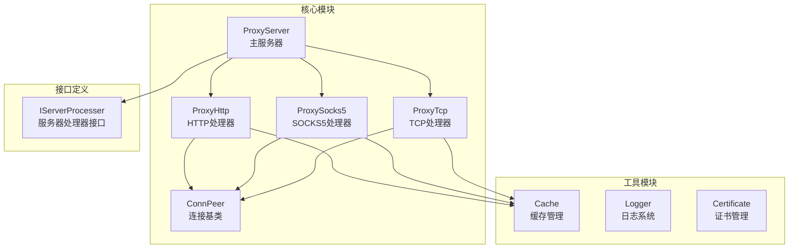

**图表来源**
- [ProxyServer.go:48-66](file://Core/ProxyServer.go#L48-L66)
- [ConnPeer.go:8-13](file://Core/ConnPeer.go#L8-L13)

**章节来源**
- [Main.go:1-124](file://Main.go#L1-L124)
- [ProxyServer.go:1-213](file://Core/ProxyServer.go#L1-L213)

## 核心组件

### 协议解析器类型定义

项目定义了四种主要的协议解析器类型，用于处理不同协议的数据流：

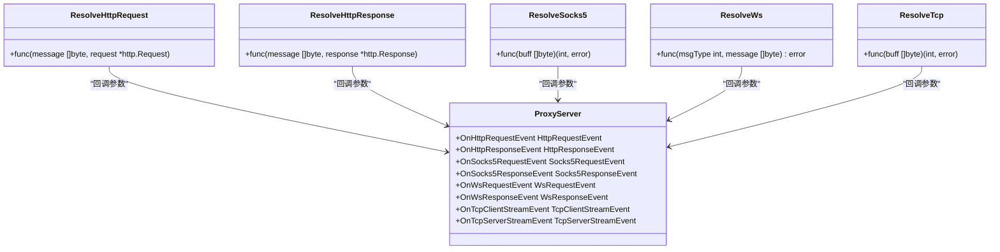

**图表来源**
- [ProxyHttp.go:39-41](file://Core/ProxyHttp.go#L39-L41)
- [ProxyServer.go:22-34](file://Core/ProxyServer.go#L22-L34)

### 服务器处理器接口

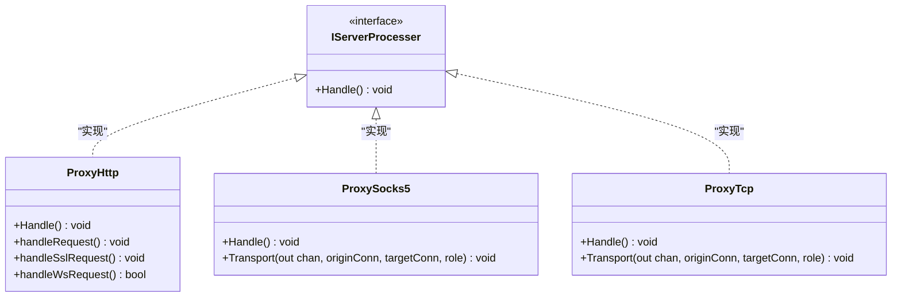

**图表来源**
- [IServerProcesser.go:3-5](file://Contract/IServerProcesser.go#L3-L5)
- [ProxyHttp.go:44-64](file://Core/ProxyHttp.go#L44-L64)
- [ProxySocks5.go:54-240](file://Core/ProxySocks5.go#L54-L240)
- [ProxyTcp.go:23-112](file://Core/ProxyTcp.go#L23-L112)

**章节来源**
- [IServerProcesser.go:1-8](file://Contract/IServerProcesser.go#L1-L8)
- [ProxyHttp.go:29-37](file://Core/ProxyHttp.go#L29-L37)
- [ProxySocks5.go:15-19](file://Core/ProxySocks5.go#L15-L19)
- [ProxyTcp.go:15-19](file://Core/ProxyTcp.go#L15-L19)

## 架构概览

系统采用事件驱动的架构模式，通过统一的服务器入口处理所有类型的连接请求：

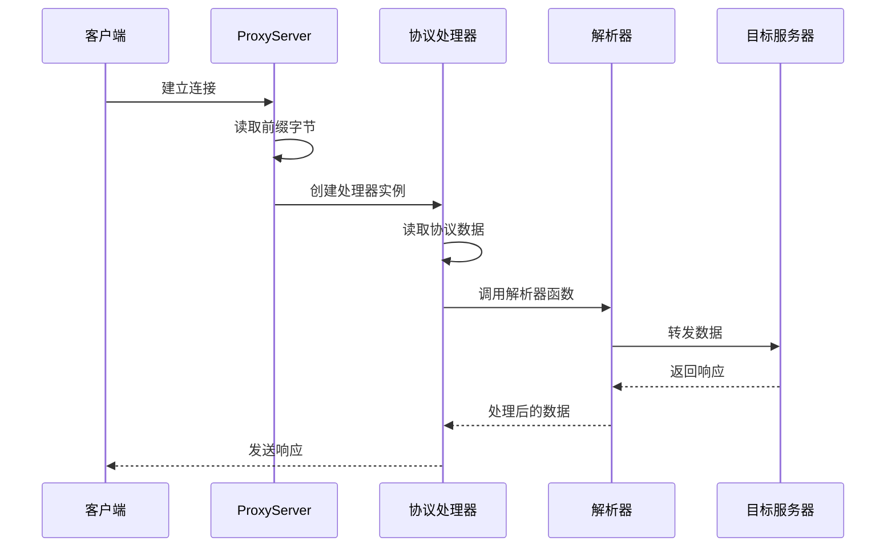

**图表来源**
- [ProxyServer.go:176-203](file://Core/ProxyServer.go#L176-L203)
- [ProxyHttp.go:44-64](file://Core/ProxyHttp.go#L44-L64)
- [ProxySocks5.go:54-240](file://Core/ProxySocks5.go#L54-L240)
- [ProxyTcp.go:23-112](file://Core/ProxyTcp.go#L23-L112)

### 协议识别流程

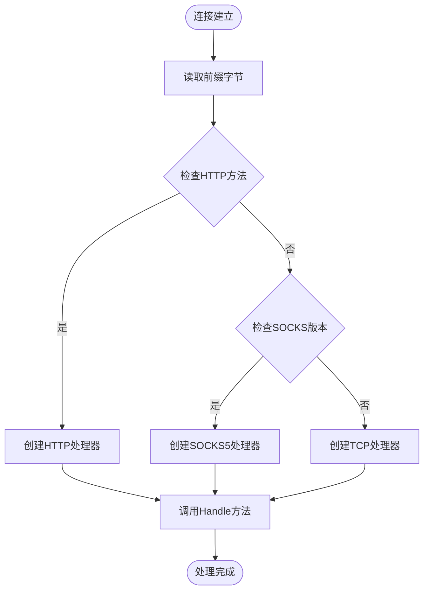

**图表来源**
- [ProxyServer.go:176-203](file://Core/ProxyServer.go#L176-L203)
- [ProxyServer.go:205-212](file://Core/ProxyServer.go#L205-L212)

**章节来源**
- [ProxyServer.go:176-213](file://Core/ProxyServer.go#L176-L213)

## 详细组件分析

### HTTP/HTTPS/WSS 协议解析器

#### ResolveHttpRequest 函数

ResolveHttpRequest 是用于处理 HTTP 请求的解析器函数，其完整定义如下：

**函数签名**: `ResolveHttpRequest func(message []byte, request *http.Request)`

**输入参数**:
- `message []byte`: 经过预处理的请求体数据
- `request *http.Request`: HTTP 请求对象

**处理逻辑**:
1. 将消息体转换为 `io.Reader` 并设置到请求对象中
2. 更新 `Content-Length` 请求头
3. 作为闭包函数传递给事件处理器

**错误处理**:
- 当事件处理器返回 `false` 时，停止进一步处理
- 支持自定义数据修改后重新注入请求

#### ResolveHttpResponse 函数

ResolveHttpResponse 是用于处理 HTTP 响应的解析器函数：

**函数签名**: `ResolveHttpResponse func(message []byte, response *http.Response)`

**输入参数**:
- `message []byte`: 经过预处理的响应体数据
- `response *http.Response`: HTTP 响应对象

**处理逻辑**:
1. 将消息体转换为 `io.Reader` 并设置到响应对象中
2. 更新 `Content-Length` 响应头
3. 作为闭包函数传递给事件处理器

**错误处理**:
- 支持响应数据的自定义修改
- 错误情况下返回原始响应

#### HTTP 请求处理流程

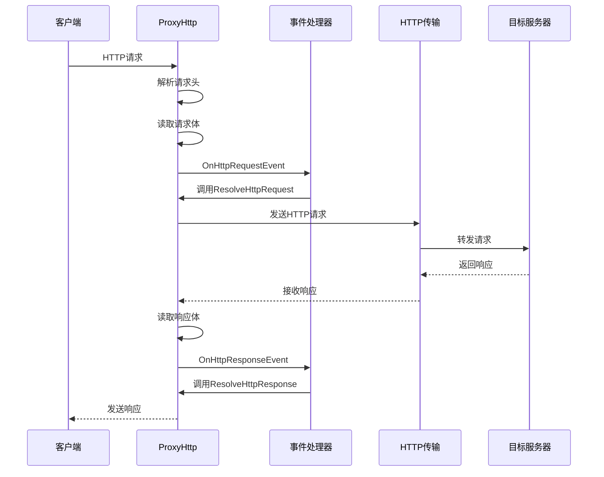

**图表来源**
- [ProxyHttp.go:67-132](file://Core/ProxyHttp.go#L67-L132)
- [ProxyHttp.go:95-130](file://Core/ProxyHttp.go#L95-L130)

**章节来源**
- [ProxyHttp.go:39-41](file://Core/ProxyHttp.go#L39-L41)
- [ProxyHttp.go:95-130](file://Core/ProxyHttp.go#L95-L130)

### SOCKS5 协议解析器

#### ResolveSocks5 函数

ResolveSocks5 是用于处理 SOCKS5 协议数据的解析器函数：

**函数签名**: `ResolveSocks5 func(buff []byte) (int, error)`

**输入参数**:
- `buff []byte`: SOCKS5 协议数据缓冲区

**返回值**:
- `int`: 实际写入的字节数
- `error`: 操作过程中产生的错误

**处理逻辑**:
1. 读取 SOCKS5 握手数据
2. 验证协议版本和方法
3. 建立到目标服务器的连接
4. 执行双向数据转发
5. 支持事件处理器的数据修改

#### SOCKS5 握手流程

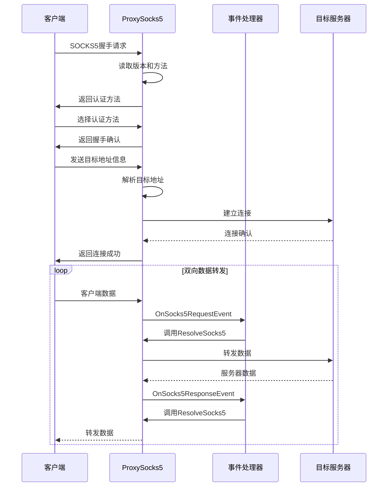

**图表来源**
- [ProxySocks5.go:54-240](file://Core/ProxySocks5.go#L54-L240)
- [ProxySocks5.go:242-284](file://Core/ProxySocks5.go#L242-L284)

**章节来源**
- [ProxySocks5.go:21](file://Core/ProxySocks5.go#L21)
- [ProxySocks5.go:242-284](file://Core/ProxySocks5.go#L242-L284)

### TCP 协议解析器

#### ResolveTcp 函数

ResolveTcp 是用于处理 TCP 协议数据的解析器函数：

**函数签名**: `ResolveTcp func(buff []byte) (int, error)`

**输入参数**:
- `buff []byte`: TCP 协议数据缓冲区

**返回值**:
- `int`: 实际写入的字节数
- `error`: 操作过程中产生的错误

**处理逻辑**:
1. 建立到指定目标服务器的 TCP 连接
2. 执行 TLS 握手（如需要）
3. 支持事件处理器的数据修改
4. 实现双向数据转发

#### TCP 连接处理流程

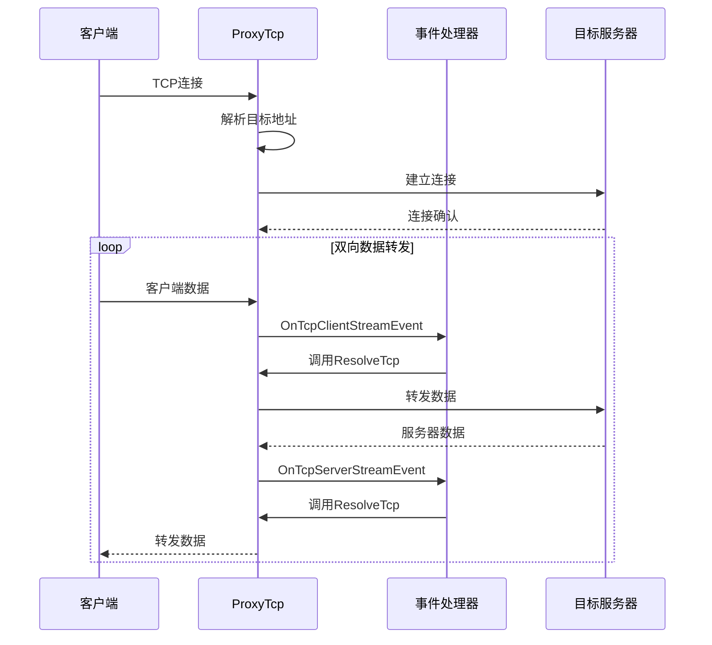

**图表来源**
- [ProxyTcp.go:23-112](file://Core/ProxyTcp.go#L23-L112)
- [ProxyTcp.go:68-111](file://Core/ProxyTcp.go#L68-L111)

**章节来源**
- [ProxyTcp.go:21](file://Core/ProxyTcp.go#L21)
- [ProxyTcp.go:68-111](file://Core/ProxyTcp.go#L68-L111)

### WebSocket 协议集成

系统支持 WebSocket 协议的完整处理流程，包括握手升级和双向通信：

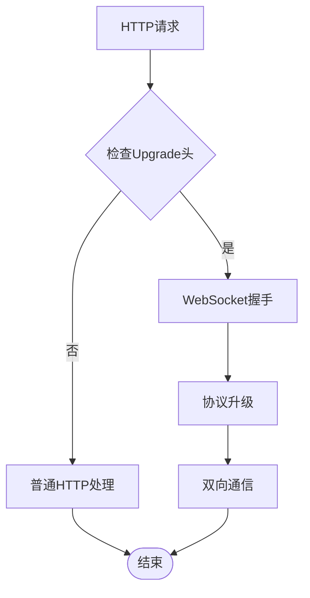

**图表来源**
- [ProxyHttp.go:280-286](file://Core/ProxyHttp.go#L280-L286)
- [ProxyHttp.go:328-434](file://Core/ProxyHttp.go#L328-L434)

**章节来源**
- [ProxyHttp.go:280-434](file://Core/ProxyHttp.go#L280-L434)

## 依赖关系分析

### 核心依赖图

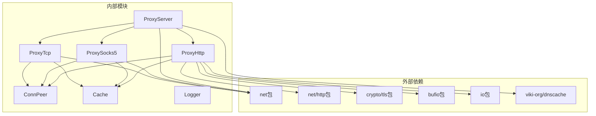

**图表来源**
- [ProxyHttp.go:3-23](file://Core/ProxyHttp.go#L3-L23)
- [ProxySocks5.go:3-13](file://Core/ProxySocks5.go#L3-L13)
- [ProxyTcp.go:3-10](file://Core/ProxyTcp.go#L3-L10)
- [ProxyServer.go:3-17](file://Core/ProxyServer.go#L3-L17)

### 缓存管理系统

```mermaid
classDiagram
class Storage {
-lock Mutex
-mapping map[string]*action
+GetCertificate(hostname, port) (interface{}, error)
}
class action {
-wg WaitGroup
-fn func()
-cert interface{}
-forget bool
-err error
}
class Cache {
<<global>>
+GetCertificate(hostname, port) (interface{}, error)
}
Storage --> action : "管理"
Cache --> Storage : "使用"
```

**图表来源**
- [Cache.go:20-64](file://Core/Cache.go#L20-L64)

**章节来源**
- [Cache.go:1-79](file://Core/Cache.go#L1-L79)

## 性能考虑

### 内存管理策略

1. **缓冲区复用**: 使用固定大小的缓冲区避免频繁分配
2. **连接池**: 利用 HTTP 传输层的连接池机制
3. **证书缓存**: 实现证书生成的并发控制和缓存
4. **资源清理**: 确保所有连接在使用后正确关闭

### 性能优化技巧

1. **Nagle 算法控制**: 通过配置参数控制 Nagle 算法的启用
2. **DNS 缓存**: 实现 5 分钟的 DNS 查询缓存
3. **并发处理**: 使用多个监听线程处理高并发连接
4. **零拷贝优化**: 在可能的情况下减少数据复制操作

### 错误处理和恢复

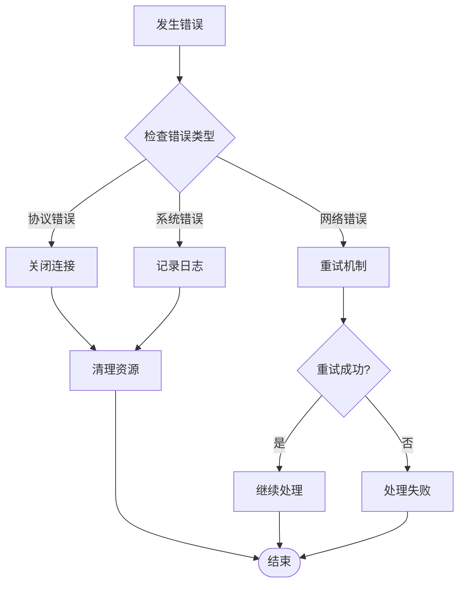

**图表来源**
- [ProxyHttp.go:47-49](file://Core/ProxyHttp.go#L47-L49)
- [ProxySocks5.go:198-203](file://Core/ProxySocks5.go#L198-L203)
- [ProxyTcp.go:91-101](file://Core/ProxyTcp.go#L91-L101)

**章节来源**
- [ProxyHttp.go:47-49](file://Core/ProxyHttp.go#L47-L49)
- [ProxySocks5.go:198-203](file://Core/ProxySocks5.go#L198-L203)
- [ProxyTcp.go:91-101](file://Core/ProxyTcp.go#L91-L101)

## 故障排除指南

### 常见问题诊断

1. **证书相关问题**
   - 确认根证书已正确安装
   - 检查 TLS 握手过程中的证书验证
   - 验证证书缓存系统的正常运行

2. **连接超时问题**
   - 检查 DNS 解析配置
   - 验证网络连接状态
   - 确认目标服务器可达性

3. **协议识别错误**
   - 验证连接前缀字节的正确读取
   - 检查 HTTP 方法的识别逻辑
   - 确认 SOCKS5 版本号的验证

### 调试建议

1. **启用详细日志**: 使用 `Log.Log.Println` 输出调试信息
2. **监控连接状态**: 实现连接事件处理器跟踪连接生命周期
3. **性能监控**: 监控内存使用和连接数变化
4. **错误统计**: 记录各类错误的发生频率和类型

**章节来源**
- [Main.go:61-120](file://Main.go#L61-L120)
- [ProxyServer.go:176-203](file://Core/ProxyServer.go#L176-L203)

## 结论

Shermie-Proxy 提供了一个完整且高效的多协议代理解决方案。通过精心设计的架构和清晰的 API 定义，该系统能够：

1. **统一协议处理**: 通过单一入口处理多种协议类型
2. **灵活的数据修改**: 提供丰富的事件处理器支持数据拦截和修改
3. **高性能实现**: 采用多种优化技术确保系统的高效运行
4. **易于扩展**: 清晰的接口设计便于添加新的协议支持

该系统的成功在于其模块化的架构设计、完善的错误处理机制以及对性能的持续优化。无论是用于开发调试、网络测试还是生产环境部署，Shermie-Proxy 都能提供可靠的服务支持。