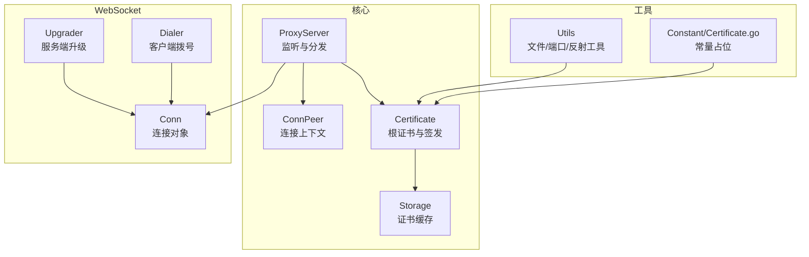
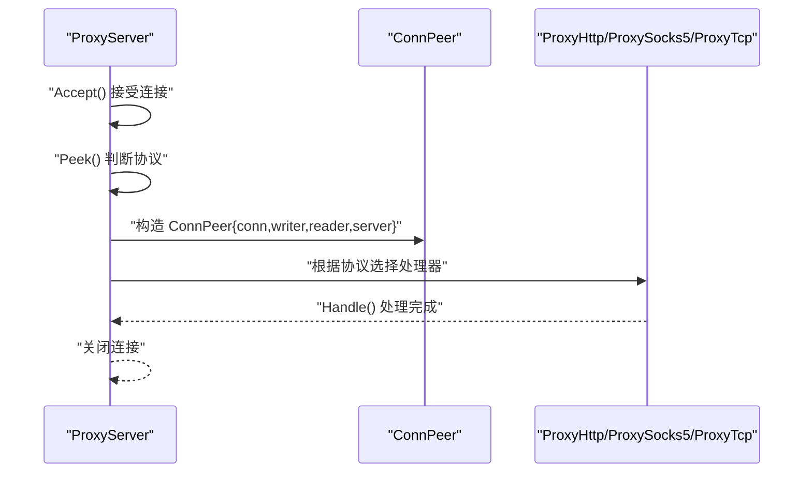
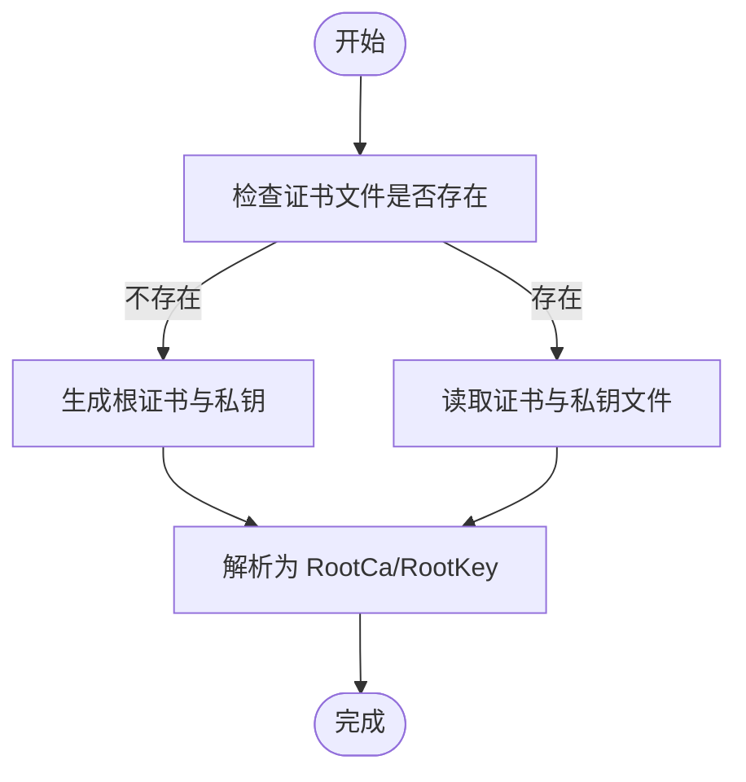
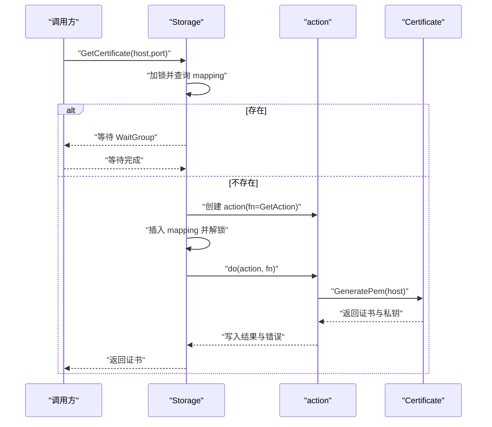
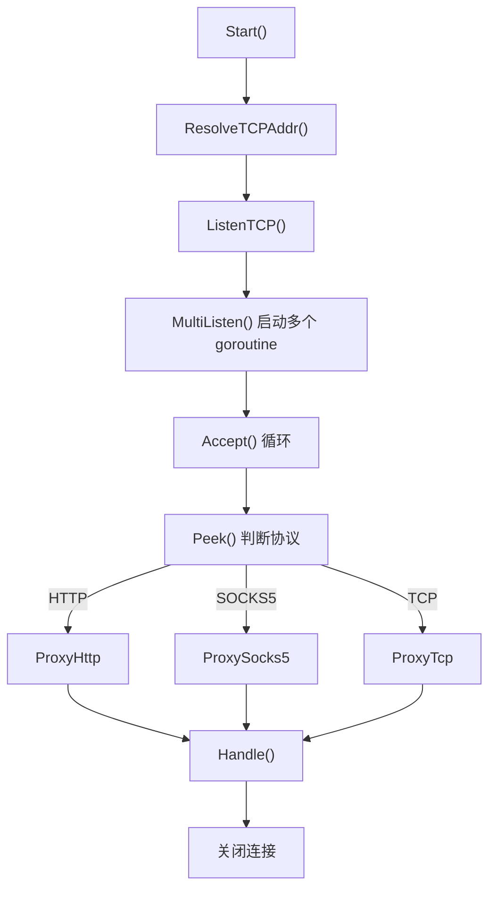
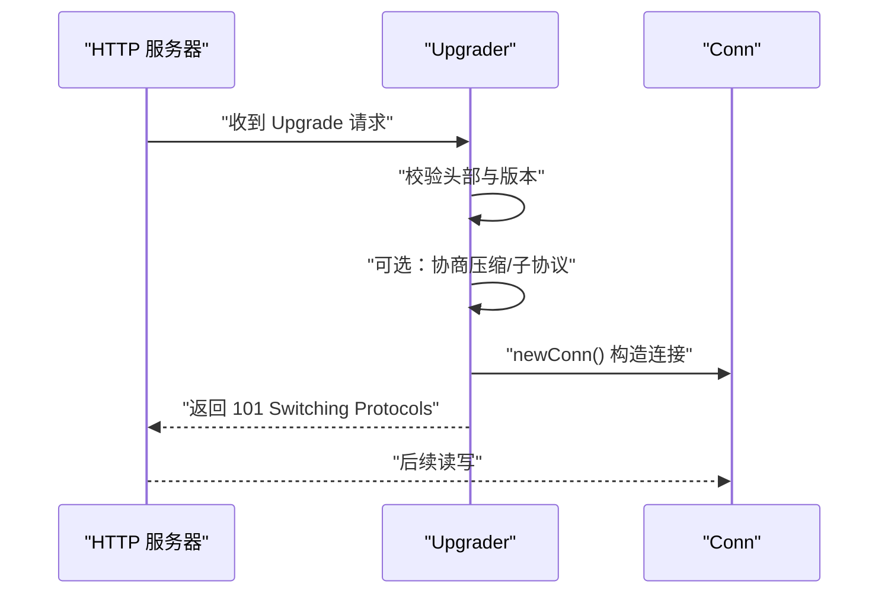
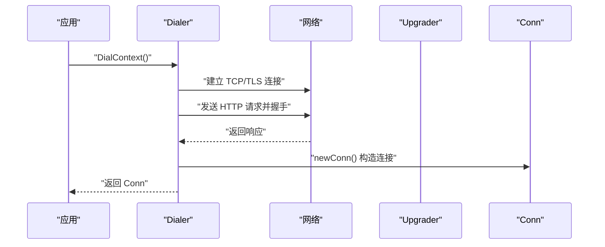
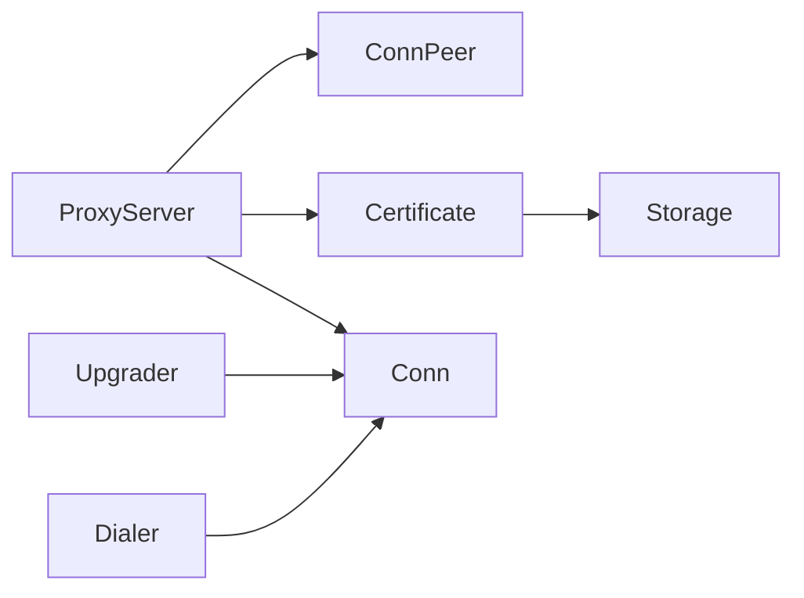

# 数据结构

<cite>
**本文引用的文件**
- [Core/ConnPeer.go](file://Core/ConnPeer.go)
- [Core/Certificate.go](file://Core/Certificate.go)
- [Core/Cache.go](file://Core/Cache.go)
- [Core/ProxyServer.go](file://Core/ProxyServer.go)
- [Core/Websocket/Conn.go](file://Core/Websocket/Conn.go)
- [Core/Websocket/Server.go](file://Core/Websocket/Server.go)
- [Core/Websocket/Client.go](file://Core/Websocket/Client.go)
- [Utils/Utils.go](file://Utils/Utils.go)
- [Constant/Certificate.go](file://Constant/Certificate.go)
</cite>

## 目录
1. [简介](#简介)
2. [项目结构](#项目结构)
3. [核心组件](#核心组件)
4. [架构总览](#架构总览)
5. [详细组件分析](#详细组件分析)
6. [依赖分析](#依赖分析)
7. [性能考量](#性能考量)
8. [故障排查指南](#故障排查指南)
9. [结论](#结论)
10. [附录](#附录)

## 简介
本文件聚焦于本仓库中与“数据结构”直接相关的核心类型，包括但不限于 ConnPeer、Certificate、Storage（即 Cache 中的 Storage 类型）等。文档从字段定义、类型说明、初始化方法、访问器与序列化机制、使用示例与最佳实践、结构体之间的关系与依赖、常量与错误码参考，以及生命周期与内存使用等方面进行系统化梳理，帮助读者快速理解并正确使用这些数据结构。

## 项目结构
围绕数据结构的分析，主要涉及以下模块：
- 核心网络与代理层：ProxyServer、ConnPeer
- 证书与缓存：Certificate、Storage（通过 Cache 单例暴露）
- WebSocket 连接与升级：Conn、Upgrader、Dialer
- 工具与常量：Utils 文件中的工具函数；Constant/Certificate.go 为空包占位



图表来源
- [Core/ProxyServer.go:48-66](file://Core/ProxyServer.go#L48-L66)
- [Core/ConnPeer.go:8-13](file://Core/ConnPeer.go#L8-L13)
- [Core/Certificate.go:20-25](file://Core/Certificate.go#L20-L25)
- [Core/Cache.go:20-23](file://Core/Cache.go#L20-L23)
- [Core/Websocket/Conn.go:240-282](file://Core/Websocket/Conn.go#L240-L282)
- [Core/Websocket/Server.go:25-74](file://Core/Websocket/Server.go#L25-L74)
- [Core/Websocket/Client.go:50-102](file://Core/Websocket/Client.go#L50-L102)
- [Utils/Utils.go:13-48](file://Utils/Utils.go#L13-L48)
- [Constant/Certificate.go:1-3](file://Constant/Certificate.go#L1-L3)

章节来源
- [Core/ProxyServer.go:48-66](file://Core/ProxyServer.go#L48-L66)
- [Core/ConnPeer.go:8-13](file://Core/ConnPeer.go#L8-L13)
- [Core/Certificate.go:20-25](file://Core/Certificate.go#L20-L25)
- [Core/Cache.go:20-23](file://Core/Cache.go#L20-L23)
- [Core/Websocket/Conn.go:240-282](file://Core/Websocket/Conn.go#L240-L282)
- [Core/Websocket/Server.go:25-74](file://Core/Websocket/Server.go#L25-L74)
- [Core/Websocket/Client.go:50-102](file://Core/Websocket/Client.go#L50-L102)
- [Utils/Utils.go:13-48](file://Utils/Utils.go#L13-L48)
- [Constant/Certificate.go:1-3](file://Constant/Certificate.go#L1-L3)

## 核心组件
本节对关键数据结构进行逐项说明，涵盖字段、类型、职责、初始化与使用要点。

- ConnPeer
  - 字段
    - conn: 底层网络连接
    - writer: 出站写入缓冲
    - reader: 入站读取缓冲
    - server: 所属代理服务器实例
  - 用途
    - 作为网络连接的上下文封装，贯穿 HTTP/SOCKS5/TCP 的处理流程
  - 初始化
    - 在 ProxyServer.handle 中由具体处理器构造并传入
  - 访问器
    - 可通过 server 引用访问代理配置与事件回调
  - 序列化
    - 该结构不直接参与序列化；其字段为标准库类型
  - 使用示例路径
    - [Core/ProxyServer.go:194](file://Core/ProxyServer.go#L194)
  - 最佳实践
    - 建议在处理器内部复用 reader/writer，避免重复创建
  - 生命周期
    - 与底层 conn 同生共死，随连接关闭而释放

- Certificate
  - 字段
    - RootKey: 根 RSA 私钥
    - RootCa: 根证书 x509.Certificate
    - RootCaStr、RootKeyStr: PEM 编码的根证书与私钥字节
  - 初始化
    - NewCertificate(): 构造空实例
    - Init(): 加载或生成根证书文件，并解析为 RootCa/RootKey
  - 证书签发
    - GeneratePem(host): 基于根证书签发主机证书
    - GenerateRootPemFile(host): 生成并落盘根证书与私钥
    - GenerateKeyPair(): 生成 2048 位 RSA 密钥对
  - 序列化
    - 通过 x509/pem 编解码实现证书与私钥的持久化与传输
  - 使用示例路径
    - [Core/Certificate.go:27-32](file://Core/Certificate.go#L27-L32)
    - [Core/Certificate.go:35-67](file://Core/Certificate.go#L35-L67)
    - [Core/Certificate.go:69-116](file://Core/Certificate.go#L69-L116)
    - [Core/Certificate.go:119-177](file://Core/Certificate.go#L119-L177)
    - [Core/Certificate.go:181-187](file://Core/Certificate.go#L181-L187)
  - 最佳实践
    - Init() 应在服务启动时调用一次；GeneratePem() 仅在需要时按需签发
    - 根证书文件建议妥善保管，避免泄露
  - 生命周期
    - 作为全局单例使用（变量 Cert），随进程生命周期存在

- Storage（Cache 中的 Storage）
  - 字段
    - lock: 并发互斥锁
    - mapping: 主机名到 action 的映射
  - 初始化
    - NewStorage(): 构造空存储
  - 并发控制
    - GetCertificate(): 对相同主机名的并发请求，仅生成一次证书，其余等待完成
    - GetAction(): 闭包包装证书生成逻辑
  - 序列化
    - 该结构不直接参与序列化；其内部保存证书对象
  - 使用示例路径
    - [Core/Cache.go:25-30](file://Core/Cache.go#L25-L30)
    - [Core/Cache.go:39-64](file://Core/Cache.go#L39-L64)
    - [Core/Cache.go:66-78](file://Core/Cache.go#L66-L78)
  - 最佳实践
    - 使用 WaitGroup 控制并发一致性；注意 mapping 的键拼接格式（含端口）
  - 生命周期
    - 通过全局变量 Cache 暴露，随进程生命周期存在

- ProxyServer
  - 字段
    - nagle、to、proxy、port、network、listener、dns
    - OnHttpRequestEvent、OnHttpResponseEvent、OnWsRequestEvent、OnWsResponseEvent、OnSocks5RequestEvent、OnSocks5ResponseEvent、OnTcpConnectEvent、OnTcpCloseEvent、OnTcpServerStreamEvent、OnTcpClientStreamEvent
  - 初始化
    - NewProxyServer(): 构造并初始化 DNS 解析器
  - 事件回调
    - 提供多类事件回调，用于拦截与处理各类协议流量
  - 使用示例路径
    - [Core/ProxyServer.go:68-77](file://Core/ProxyServer.go#L68-L77)
    - [Core/ProxyServer.go:176-203](file://Core/ProxyServer.go#L176-L203)
  - 最佳实践
    - 在 Start() 前注册所需事件回调；MultiListen() 多协程并发 Accept
  - 生命周期
    - Start() 后阻塞；Stop() 调用后执行清理

- Conn（WebSocket）
  - 字段
    - conn、isServer、subprotocol
    - 写入：mu、writeBuf、writePool、writeBufSize、writeDeadline、writer、isWriting、writeErrMu、writeErr、enableWriteCompression、compressionLevel、newCompressionWriter
    - 读取：reader、readErr、br、readRemaining、readFinal、readLength、readLimit、readMaskPos、readMaskKey、handlePong、handlePing、handleClose、readErrCount、messageReader、readDecompress、newDecompressionReader
  - 初始化
    - newConn(): 构造连接对象，设置默认缓冲与压缩策略
  - 读写
    - NextWriter()/WriteMessage()/WriteControl()/WritePreparedMessage()
    - Read 方法族（内部帧解析与消息组装）
  - 使用示例路径
    - [Core/Websocket/Conn.go:284-323](file://Core/Websocket/Conn.go#L284-L323)
    - [Core/Websocket/Conn.go:511-523](file://Core/Websocket/Conn.go#L511-L523)
    - [Core/Websocket/Conn.go:751-774](file://Core/Websocket/Conn.go#L751-L774)
  - 最佳实践
    - 合理设置 WriteBufferSize/ReadBufferSize；启用压缩时注意上下文接管策略
  - 生命周期
    - 与底层 net.Conn 同步关闭

- Upgrader（WebSocket 服务端升级）
  - 字段
    - HandshakeTimeout、ReadBufferSize、WriteBufferSize、WriteBufferPool、Subprotocols、Error、CheckOrigin、EnableCompression
  - 功能
    - Upgrade(): 完成 HTTP 到 WebSocket 的握手升级
  - 使用示例路径
    - [Core/Websocket/Server.go:124-267](file://Core/Websocket/Server.go#L124-L267)
  - 最佳实践
    - 自定义 CheckOrigin 以防止跨域伪造；合理设置超时与缓冲
  - 生命周期
    - 作为一次性升级器使用，成功后返回 Conn

- Dialer（WebSocket 客户端拨号）
  - 字段
    - NetDial/NetDialContext、Proxy、TLSClientConfig、HandshakeTimeout、ReadBufferSize、WriteBufferSize、WriteBufferPool、Subprotocols、EnableCompression、Jar
  - 功能
    - Dial()/DialContext(): 建立 WebSocket 客户端连接
  - 使用示例路径
    - [Core/Websocket/Client.go:105-107](file://Core/Websocket/Client.go#L105-L107)
    - [Core/Websocket/Client.go:149-383](file://Core/Websocket/Client.go#L149-L383)
  - 最佳实践
    - 设置合理的 HandshakeTimeout；必要时配置代理与 CookieJar
  - 生命周期
    - 成功后返回 Conn，失败返回错误

章节来源
- [Core/ConnPeer.go:8-13](file://Core/ConnPeer.go#L8-L13)
- [Core/Certificate.go:20-25](file://Core/Certificate.go#L20-L25)
- [Core/Certificate.go:27-32](file://Core/Certificate.go#L27-L32)
- [Core/Certificate.go:35-67](file://Core/Certificate.go#L35-L67)
- [Core/Certificate.go:69-116](file://Core/Certificate.go#L69-L116)
- [Core/Certificate.go:119-177](file://Core/Certificate.go#L119-L177)
- [Core/Certificate.go:181-187](file://Core/Certificate.go#L181-L187)
- [Core/Cache.go:20-23](file://Core/Cache.go#L20-L23)
- [Core/Cache.go:25-30](file://Core/Cache.go#L25-L30)
- [Core/Cache.go:39-64](file://Core/Cache.go#L39-L64)
- [Core/Cache.go:66-78](file://Core/Cache.go#L66-L78)
- [Core/ProxyServer.go:48-66](file://Core/ProxyServer.go#L48-L66)
- [Core/ProxyServer.go:68-77](file://Core/ProxyServer.go#L68-L77)
- [Core/ProxyServer.go:176-203](file://Core/ProxyServer.go#L176-L203)
- [Core/Websocket/Conn.go:240-282](file://Core/Websocket/Conn.go#L240-L282)
- [Core/Websocket/Conn.go:284-323](file://Core/Websocket/Conn.go#L284-L323)
- [Core/Websocket/Conn.go:511-523](file://Core/Websocket/Conn.go#L511-L523)
- [Core/Websocket/Conn.go:751-774](file://Core/Websocket/Conn.go#L751-L774)
- [Core/Websocket/Server.go:25-74](file://Core/Websocket/Server.go#L25-L74)
- [Core/Websocket/Server.go:124-267](file://Core/Websocket/Server.go#L124-L267)
- [Core/Websocket/Client.go:50-102](file://Core/Websocket/Client.go#L50-L102)
- [Core/Websocket/Client.go:105-107](file://Core/Websocket/Client.go#L105-L107)
- [Core/Websocket/Client.go:149-383](file://Core/Websocket/Client.go#L149-L383)

## 架构总览
下图展示数据结构之间的关系与交互：

```mermaid
classDiagram
class ProxyServer {
+string port
+bool nagle
+string proxy
+string to
+string network
+DNSResolver dns
+Start() error
+Stop() error
+Install()
+UnInstall()
}
class ConnPeer {
+net.Conn conn
+bufio.Writer writer
+bufio.Reader reader
+ProxyServer server
}
class Certificate {
+rsa.PrivateKey RootKey
+x509.Certificate RootCa
+[]byte RootCaStr
+[]byte RootKeyStr
+Init() error
+GeneratePem(host) ([]byte, []byte, error)
+GenerateRootPemFile(host) (*pem.Block, *pem.Block, error)
+GenerateKeyPair() (*rsa.PrivateKey, error)
}
class Storage {
+Mutex lock
+map~string,*action~ mapping
+GetCertificate(hostname,port) (interface{},error)
}
class Conn {
+net.Conn conn
+bool isServer
+string subprotocol
+NextWriter(messageType) (io.WriteCloser,error)
+WriteMessage(messageType,data) error
+WriteControl(messageType,data,deadline) error
}
ProxyServer --> ConnPeer : "创建并传递"
ProxyServer --> Certificate : "使用"
Certificate --> Storage : "被缓存使用"
ConnPeer --> Conn : "可能升级/使用"
```

图表来源
- [Core/ProxyServer.go:48-66](file://Core/ProxyServer.go#L48-L66)
- [Core/ConnPeer.go:8-13](file://Core/ConnPeer.go#L8-L13)
- [Core/Certificate.go:20-25](file://Core/Certificate.go#L20-L25)
- [Core/Cache.go:20-23](file://Core/Cache.go#L20-L23)
- [Core/Websocket/Conn.go:240-282](file://Core/Websocket/Conn.go#L240-L282)

## 详细组件分析

### ConnPeer 结构分析
- 字段与类型
  - conn: net.Conn
  - writer: *bufio.Writer
  - reader: *bufio.Reader
  - server: *ProxyServer
- 初始化与使用
  - 在 ProxyServer.handle 中根据首包内容选择处理器，并将 ConnPeer 作为参数传入
- 访问器与序列化
  - 无显式访问器；不涉及序列化
- 最佳实践
  - 保持 reader/writer 与 conn 生命周期一致；避免重复创建



图表来源
- [Core/ProxyServer.go:176-203](file://Core/ProxyServer.go#L176-L203)
- [Core/ConnPeer.go:8-13](file://Core/ConnPeer.go#L8-L13)

章节来源
- [Core/ProxyServer.go:176-203](file://Core/ProxyServer.go#L176-L203)
- [Core/ConnPeer.go:8-13](file://Core/ConnPeer.go#L8-L13)

### Certificate 结构分析
- 字段与类型
  - RootKey: *rsa.PrivateKey
  - RootCa: *x509.Certificate
  - RootCaStr、RootKeyStr: []byte
- 初始化与使用
  - NewCertificate(): 创建空实例
  - Init(): 优先加载本地证书文件，否则生成并落盘
  - GeneratePem()/GenerateRootPemFile(): 生成主机证书/根证书
  - GenerateKeyPair(): 生成 2048 位 RSA 密钥
- 访问器与序列化
  - 通过 x509/pem 编解码实现序列化；不提供直接的结构体序列化方法
- 最佳实践
  - Init() 仅调用一次；GeneratePem() 仅在需要时按需签发；妥善管理证书文件权限



图表来源
- [Core/Certificate.go:35-67](file://Core/Certificate.go#L35-L67)
- [Core/Certificate.go:119-177](file://Core/Certificate.go#L119-L177)

章节来源
- [Core/Certificate.go:27-32](file://Core/Certificate.go#L27-L32)
- [Core/Certificate.go:35-67](file://Core/Certificate.go#L35-L67)
- [Core/Certificate.go:69-116](file://Core/Certificate.go#L69-L116)
- [Core/Certificate.go:119-177](file://Core/Certificate.go#L119-L177)
- [Core/Certificate.go:181-187](file://Core/Certificate.go#L181-L187)

### Storage（Cache）结构分析
- 字段与类型
  - lock: *sync.Mutex
  - mapping: map[string]*action
- 初始化与使用
  - NewStorage(): 构造空存储
  - GetCertificate(): 对相同主机名并发请求，仅生成一次证书，其余等待完成
  - GetAction(): 闭包包装证书生成逻辑（调用 Cert.GeneratePem）
- 访问器与序列化
  - 无显式访问器；不涉及序列化
- 最佳实践
  - 键拼接格式应包含端口，避免同主机不同端口误判为相同



图表来源
- [Core/Cache.go:39-64](file://Core/Cache.go#L39-L64)
- [Core/Cache.go:66-78](file://Core/Cache.go#L66-L78)

章节来源
- [Core/Cache.go:20-23](file://Core/Cache.go#L20-L23)
- [Core/Cache.go:25-30](file://Core/Cache.go#L25-L30)
- [Core/Cache.go:39-64](file://Core/Cache.go#L39-L64)
- [Core/Cache.go:66-78](file://Core/Cache.go#L66-L78)

### ProxyServer 结构分析
- 字段与类型
  - 监听与网络：port、network、listener、dns
  - 代理与策略：nagle、to、proxy
  - 事件回调：多种 HttpRequest/Response、Ws、Socks5、Tcp 事件
- 初始化与使用
  - NewProxyServer(): 初始化 DNS 解析器
  - Start(): 绑定端口并多协程并发 Accept
  - MultiListen(): 启动多个 goroutine 接收连接
  - handle(): 根据首包判断协议并交由对应处理器
- 访问器与序列化
  - 无显式访问器；不涉及序列化
- 最佳实践
  - 在 Start() 前注册所需事件回调；注意 Windows 系统代理与证书安装



图表来源
- [Core/ProxyServer.go:123-137](file://Core/ProxyServer.go#L123-L137)
- [Core/ProxyServer.go:156-174](file://Core/ProxyServer.go#L156-L174)
- [Core/ProxyServer.go:176-203](file://Core/ProxyServer.go#L176-L203)

章节来源
- [Core/ProxyServer.go:68-77](file://Core/ProxyServer.go#L68-L77)
- [Core/ProxyServer.go:123-137](file://Core/ProxyServer.go#L123-L137)
- [Core/ProxyServer.go:156-174](file://Core/ProxyServer.go#L156-L174)
- [Core/ProxyServer.go:176-203](file://Core/ProxyServer.go#L176-L203)

### WebSocket Conn/Upgrader/Dialer 结构分析
- Conn
  - 字段：连接状态、读写缓冲、压缩、掩码、消息读写器等
  - 方法：NextWriter/WriteMessage/WriteControl/WritePreparedMessage 等
- Upgrader
  - 字段：握手超时、缓冲大小、压缩、子协议、Origin 校验、错误处理
  - 方法：Upgrade()
- Dialer
  - 字段：拨号器、代理、TLS、超时、缓冲池、子协议、压缩、CookieJar
  - 方法：Dial()/DialContext()



图表来源
- [Core/Websocket/Server.go:124-267](file://Core/Websocket/Server.go#L124-L267)
- [Core/Websocket/Conn.go:284-323](file://Core/Websocket/Conn.go#L284-L323)



图表来源
- [Core/Websocket/Client.go:149-383](file://Core/Websocket/Client.go#L149-L383)
- [Core/Websocket/Server.go:124-267](file://Core/Websocket/Server.go#L124-L267)
- [Core/Websocket/Conn.go:284-323](file://Core/Websocket/Conn.go#L284-L323)

章节来源
- [Core/Websocket/Conn.go:240-282](file://Core/Websocket/Conn.go#L240-L282)
- [Core/Websocket/Conn.go:284-323](file://Core/Websocket/Conn.go#L284-L323)
- [Core/Websocket/Server.go:25-74](file://Core/Websocket/Server.go#L25-L74)
- [Core/Websocket/Server.go:124-267](file://Core/Websocket/Server.go#L124-L267)
- [Core/Websocket/Client.go:50-102](file://Core/Websocket/Client.go#L50-L102)
- [Core/Websocket/Client.go:149-383](file://Core/Websocket/Client.go#L149-L383)

## 依赖分析
- 组件耦合
  - ProxyServer 依赖 ConnPeer 作为连接上下文；依赖 Certificate/Storage 实现 TLS 证书签发与缓存
  - WebSocket 的 Conn 与 Upgrader/Dialer 彼此配合，完成握手与读写
- 外部依赖
  - crypto/x509、crypto/rsa、encoding/pem、net/http、bufio、time、sync 等
- 潜在循环依赖
  - 当前结构未见循环导入；各模块职责清晰



图表来源
- [Core/ProxyServer.go:48-66](file://Core/ProxyServer.go#L48-L66)
- [Core/ConnPeer.go:8-13](file://Core/ConnPeer.go#L8-L13)
- [Core/Certificate.go:20-25](file://Core/Certificate.go#L20-L25)
- [Core/Cache.go:20-23](file://Core/Cache.go#L20-L23)
- [Core/Websocket/Conn.go:240-282](file://Core/Websocket/Conn.go#L240-L282)
- [Core/Websocket/Server.go:25-74](file://Core/Websocket/Server.go#L25-L74)
- [Core/Websocket/Client.go:50-102](file://Core/Websocket/Client.go#L50-L102)

章节来源
- [Core/ProxyServer.go:48-66](file://Core/ProxyServer.go#L48-L66)
- [Core/ConnPeer.go:8-13](file://Core/ConnPeer.go#L8-L13)
- [Core/Certificate.go:20-25](file://Core/Certificate.go#L20-L25)
- [Core/Cache.go:20-23](file://Core/Cache.go#L20-L23)
- [Core/Websocket/Conn.go:240-282](file://Core/Websocket/Conn.go#L240-L282)
- [Core/Websocket/Server.go:25-74](file://Core/Websocket/Server.go#L25-L74)
- [Core/Websocket/Client.go:50-102](file://Core/Websocket/Client.go#L50-L102)

## 性能考量
- 缓冲与池化
  - Conn 支持 WriteBufferPool 与自定义缓冲大小，减少频繁分配
  - Storage 使用 WaitGroup 控制并发一致性，避免重复签发
- 压缩
  - Upgrader/Dialer 支持 permessage-deflate，启用时注意上下文接管策略
- DNS 缓存
  - ProxyServer 内置 dnscache，降低解析开销
- 并发
  - MultiListen() 多协程 Accept，提升吞吐

## 故障排查指南
- 常见错误与定位
  - WebSocket 握手失败：检查 Upgrade/Dial 的头部校验、版本与超时设置
  - 证书加载失败：确认证书文件存在且权限正确；查看 Init() 返回的错误信息
  - 并发签发异常：确认 Storage 的键拼接包含端口；检查 WaitGroup 是否正确等待
- 建议
  - 开启日志输出，定位具体阶段（Accept/Peek/Upgrade/Write）
  - 对证书文件进行最小权限保护

章节来源
- [Core/Websocket/Server.go:124-267](file://Core/Websocket/Server.go#L124-L267)
- [Core/Websocket/Client.go:149-383](file://Core/Websocket/Client.go#L149-L383)
- [Core/Certificate.go:35-67](file://Core/Certificate.go#L35-L67)
- [Core/Cache.go:39-64](file://Core/Cache.go#L39-L64)

## 结论
本文系统梳理了本项目中的核心数据结构：ConnPeer、Certificate、Storage、ProxyServer 以及 WebSocket 的 Conn/Upgrader/Dialer。通过对字段、初始化、访问器、序列化机制、使用示例与最佳实践的说明，帮助开发者在实际开发中正确使用这些结构，并理解它们之间的关系与依赖。同时，结合性能与故障排查建议，提升系统的稳定性与可维护性。

## 附录
- 常量与错误码参考
  - WebSocket 关闭码与消息类型常量位于 WebSocket 模块中，便于在握手与读写过程中使用
  - 证书与密钥生成采用 2048 位 RSA，有效期一年，符合常见安全要求
- 工具函数
  - Utils 提供文件存在性检测、可用端口探测、TLS 最后帧读取等辅助能力

章节来源
- [Core/Websocket/Conn.go:21-82](file://Core/Websocket/Conn.go#L21-L82)
- [Core/Websocket/Conn.go:84-181](file://Core/Websocket/Conn.go#L84-L181)
- [Core/Certificate.go:181-187](file://Core/Certificate.go#L181-L187)
- [Utils/Utils.go:13-48](file://Utils/Utils.go#L13-L48)