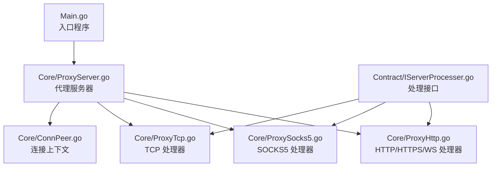
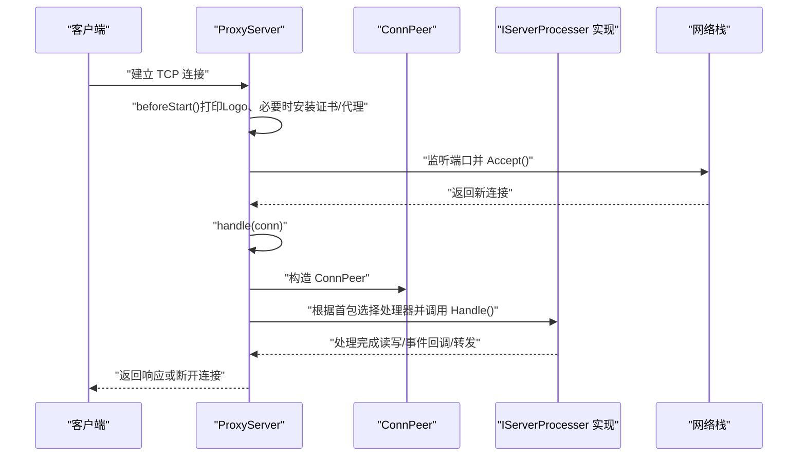
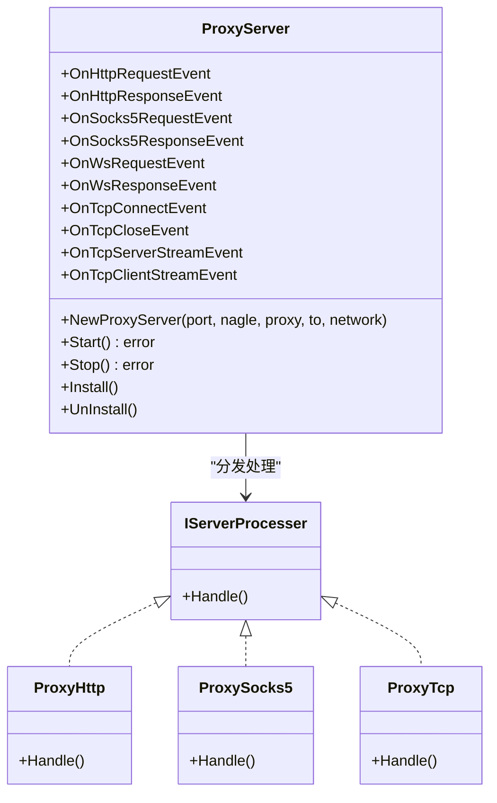
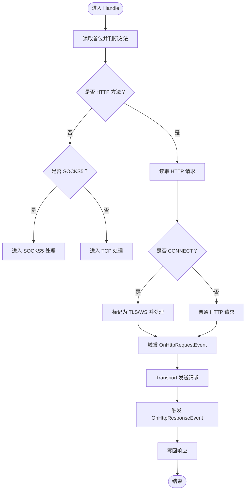
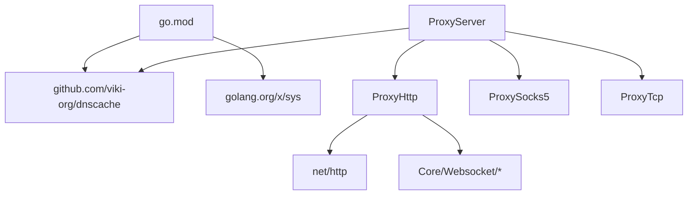

# 核心接口

<cite>
**本文引用的文件**
- [Contract/IServerProcesser.go](file://Contract/IServerProcesser.go)
- [Core/ProxyServer.go](file://Core/ProxyServer.go)
- [Main.go](file://Main.go)
- [Core/ProxyHttp.go](file://Core/ProxyHttp.go)
- [Core/ProxySocks5.go](file://Core/ProxySocks5.go)
- [Core/ProxyTcp.go](file://Core/ProxyTcp.go)
- [Core/ConnPeer.go](file://Core/ConnPeer.go)
- [README.md](file://README.md)
- [go.mod](file://go.mod)
</cite>

## 目录
1. [简介](#简介)
2. [项目结构](#项目结构)
3. [核心组件](#核心组件)
4. [架构总览](#架构总览)
5. [详细组件分析](#详细组件分析)
6. [依赖分析](#依赖分析)
7. [性能考虑](#性能考虑)
8. [故障排查指南](#故障排查指南)
9. [结论](#结论)
10. [附录](#附录)

## 简介
本文件聚焦于核心接口与关键类的 API 文档，重点覆盖以下内容：
- IServerProcesser 接口的完整定义、方法签名、参数类型、返回值规范与实现要求
- ProxyServer 类的生命周期管理、公共方法（Start、Stop、Install、UnInstall 等）与使用方式
- 事件回调接口（OnHttpRequestEvent、OnHttpResponseEvent、OnSocks5RequestEvent、OnSocks5ResponseEvent、OnWsRequestEvent、OnWsResponseEvent、OnTcpConnectEvent、OnTcpCloseEvent、OnTcpServerStreamEvent、OnTcpClientStreamEvent）的职责与调用时机
- 错误处理机制与最佳实践
- 具体实现示例与注意事项

## 项目结构
本项目采用按功能域分层的组织方式：
- Contract：契约与接口定义（如 IServerProcesser）
- Core：核心逻辑与协议处理器（HTTP、HTTPS、WS/WSS、TCP、SOCKS5）
- Log：日志模块
- Utils：平台工具（证书、系统代理等）
- Constant：常量（如证书）
- Root：入口程序 Main.go

图表来源
- [Main.go:24-124](file://Main.go#L24-L124)
- [Core/ProxyServer.go:48-213](file://Core/ProxyServer.go#L48-L213)
- [Core/ProxyHttp.go:29-64](file://Core/ProxyHttp.go#L29-L64)
- [Core/ProxySocks5.go:15-54](file://Core/ProxySocks5.go#L15-L54)
- [Core/ProxyTcp.go:15-66](file://Core/ProxyTcp.go#L15-L66)
- [Core/ConnPeer.go:8-14](file://Core/ConnPeer.go#L8-L14)
- [Contract/IServerProcesser.go:3-5](file://Contract/IServerProcesser.go#L3-L5)

章节来源
- [Main.go:24-124](file://Main.go#L24-L124)
- [Core/ProxyServer.go:48-213](file://Core/ProxyServer.go#L48-L213)
- [Contract/IServerProcesser.go:3-5](file://Contract/IServerProcesser.go#L3-L5)

## 核心组件
本节从接口契约与实现角度，系统梳理核心 API。

- IServerProcesser 接口
  - 定义位置：Contract/IServerProcesser.go
  - 方法定义：
    - Handle()：无参、无返回值
  - 实现要求：
    - 每个具体协议处理器（ProxyHttp、ProxySocks5、ProxyTcp）均需实现该接口
    - 在 Handle 中完成协议识别、数据读取、事件回调、转发与响应写回等流程
  - 关键约束：
    - 不应在接口层面抛出未捕获异常；错误通过返回值或事件回调传递
    - 必须正确处理连接生命周期（建立、读写、关闭）

- ProxyServer 代理服务器
  - 构造函数：NewProxyServer(port, nagle, proxy, to, network)
  - 生命周期方法：
    - Start() error：启动监听、多线程 Accept 并分发至对应处理器
    - Stop() error：清理系统代理（Windows），返回 nil
    - Install()：在 Windows 自动安装根证书并设置系统代理
    - UnInstall()：在 Windows 清除系统代理
  - 事件回调字段（均为可选回调，注册后生效）：
    - OnHttpRequestEvent、OnHttpResponseEvent
    - OnSocks5RequestEvent、OnSocks5ResponseEvent
    - OnWsRequestEvent、OnWsResponseEvent
    - OnTcpConnectEvent、OnTcpCloseEvent
    - OnTcpServerStreamEvent、OnTcpClientStreamEvent
  - 内部处理流程：
    - handle(conn)：根据首包判断协议类型，实例化对应处理器并调用其 Handle()

- 协议处理器（实现 IServerProcesser）
  - ProxyHttp：处理 HTTP/HTTPS/WS/WSS
  - ProxySocks5：处理 SOCKS5
  - ProxyTcp：处理 TCP（含 TLS 握手与证书缓存）

章节来源
- [Contract/IServerProcesser.go:3-5](file://Contract/IServerProcesser.go#L3-L5)
- [Core/ProxyServer.go:68-142](file://Core/ProxyServer.go#L68-L142)
- [Core/ProxyServer.go:176-203](file://Core/ProxyServer.go#L176-L203)
- [Core/ProxyHttp.go:29-64](file://Core/ProxyHttp.go#L29-L64)
- [Core/ProxySocks5.go:15-54](file://Core/ProxySocks5.go#L15-L54)
- [Core/ProxyTcp.go:15-66](file://Core/ProxyTcp.go#L15-L66)

## 架构总览
下图展示从入口到协议处理的整体调用链：

图表来源
- [Core/ProxyServer.go:110-137](file://Core/ProxyServer.go#L110-L137)
- [Core/ProxyServer.go:156-174](file://Core/ProxyServer.go#L156-L174)
- [Core/ProxyServer.go:176-203](file://Core/ProxyServer.go#L176-L203)
- [Core/ConnPeer.go:8-14](file://Core/ConnPeer.go#L8-L14)

## 详细组件分析

### IServerProcesser 接口
- 接口定义
  - 文件：Contract/IServerProcesser.go
  - 方法：Handle()
- 实现模式
  - 每个协议处理器均实现该接口，并在 Handle 中完成：
    - 协议识别与解析
    - 事件回调（若有注册）
    - 数据读取与转发
    - 响应写回或错误处理
- 最佳实践
  - 在 Handle 开始前检查输入有效性
  - 对外仅通过事件回调暴露数据修改点，避免直接阻塞 IO
  - 明确区分“继续处理”和“短路返回”的场景

章节来源
- [Contract/IServerProcesser.go:3-5](file://Contract/IServerProcesser.go#L3-L5)

### ProxyServer 类
- 构造与配置
  - NewProxyServer(port, nagle, proxy, to, network)：初始化端口、Nagle 算法开关、上游代理、目标地址与网络接口
- 生命周期管理
  - Start()：解析地址、启动监听、启动多协程 Accept 循环，阻塞等待
  - Stop()：Windows 下清除系统代理，返回 nil
  - Install()/UnInstall()：Windows 自动安装根证书与设置/清除系统代理
- 事件回调
  - OnHttpRequestEvent(message, request, resolve, conn) bool
  - OnHttpResponseEvent(body, response, resolve, conn) bool
  - OnSocks5RequestEvent(message, resolve, conn) (int, error)
  - OnSocks5ResponseEvent(message, resolve, conn) (int, error)
  - OnWsRequestEvent(msgType, message, resolve, conn) error
  - OnWsResponseEvent(msgType, message, resolve, conn) error
  - OnTcpConnectEvent(conn)、OnTcpCloseEvent(conn)
  - OnTcpServerStreamEvent(message, resolve, conn) (int, error)
  - OnTcpClientStreamEvent(message, resolve, conn) (int, error)
- 处理流程
  - handle(conn)：读取首包，判断 HTTP/SOCKS5/TCP，构造对应处理器并调用其 Handle()

图表来源
- [Contract/IServerProcesser.go:3-5](file://Contract/IServerProcesser.go#L3-L5)
- [Core/ProxyServer.go:48-66](file://Core/ProxyServer.go#L48-L66)
- [Core/ProxyHttp.go:29-44](file://Core/ProxyHttp.go#L29-L44)
- [Core/ProxySocks5.go:15-54](file://Core/ProxySocks5.go#L15-L54)
- [Core/ProxyTcp.go:15-23](file://Core/ProxyTcp.go#L15-L23)

章节来源
- [Core/ProxyServer.go:68-142](file://Core/ProxyServer.go#L68-L142)
- [Core/ProxyServer.go:176-203](file://Core/ProxyServer.go#L176-L203)

### 协议处理器（HTTP/HTTPS/WS）
- 处理入口：ProxyHttp.Handle()
- 关键步骤
  - 读取请求：http.ReadRequest(reader)
  - 判断是否 CONNECT（HTTPS/WS），否则为普通 HTTP 请求
  - 读取请求体/响应体（自动处理 gzip）
  - 触发 OnHttpRequestEvent/OnHttpResponseEvent（若已注册）
  - 通过 Transport 发送请求并接收响应
  - 将响应写回客户端
- 事件回调语义
  - OnHttpRequestEvent：允许修改 message/request，返回 true 表示继续处理，false 表示短路
  - OnHttpResponseEvent：允许修改 body/response，返回 true 表示继续处理，false 表示短路

图表来源
- [Core/ProxyServer.go:176-203](file://Core/ProxyServer.go#L176-L203)
- [Core/ProxyHttp.go:44-132](file://Core/ProxyHttp.go#L44-L132)

章节来源
- [Core/ProxyHttp.go:44-132](file://Core/ProxyHttp.go#L44-L132)

### 协议处理器（SOCKS5）
- 处理入口：ProxySocks5.Handle()
- 关键步骤
  - 版本号与认证方法协商
  - 读取命令、目标类型（IPv4/IPv6/域名）、端口
  - 建立到目标的连接（必要时 TLS）
  - 返回握手结果并进入双向转发
- 事件回调语义
  - OnSocks5RequestEvent/OnSocks5ResponseEvent：允许修改消息并返回写入长度与错误

章节来源
- [Core/ProxySocks5.go:54-200](file://Core/ProxySocks5.go#L54-L200)

### 协议处理器（TCP）
- 处理入口：ProxyTcp.Handle()
- 关键步骤
  - 解析目标地址 server.to
  - 建立到目标的 TCP 连接
  - 获取证书并进行 TLS 握手（若需要）
  - 双向传输：客户端与目标之间互转数据
  - 触发 OnTcpServerStreamEvent/OnTcpClientStreamEvent（若已注册）
- 事件回调语义
  - OnTcpServerStreamEvent/OnTcpClientStreamEvent：允许修改数据并返回写入长度与错误

章节来源
- [Core/ProxyTcp.go:23-112](file://Core/ProxyTcp.go#L23-L112)

### 使用示例与注意事项
- 示例路径（参考主程序）
  - 入口与事件注册：[Main.go:48-124](file://Main.go#L48-L124)
  - README 中的最小示例：[README.md:62-146](file://README.md#L62-L146)
- 注意事项
  - 必须在 main 初始化阶段加载根证书：[Main.go:13-22](file://Main.go#L13-L22)
  - Windows 平台可通过 Install()/UnInstall() 自动设置系统代理与证书
  - 事件回调中若返回短路（false 或错误），需自行负责连接的后续处理
  - Start() 会阻塞，建议在独立 goroutine 中运行

章节来源
- [Main.go:13-22](file://Main.go#L13-L22)
- [Main.go:48-124](file://Main.go#L48-L124)
- [README.md:62-146](file://README.md#L62-L146)

## 依赖分析
- 模块依赖
  - go.mod 指定依赖 dnscache 与 golang.org/x/sys
- 组件耦合
  - ProxyServer 通过 ConnPeer 与各协议处理器解耦
  - IServerProcesser 作为统一处理接口，降低上层对协议细节的感知
- 外部集成点
  - 系统代理（Windows）
  - DNS 缓存（dnscache）
  - TLS 证书（根证书与缓存）

图表来源
- [go.mod:1-9](file://go.mod#L1-L9)
- [Core/ProxyServer.go:3-17](file://Core/ProxyServer.go#L3-L17)
- [Core/ProxyHttp.go:3-23](file://Core/ProxyHttp.go#L3-L23)

章节来源
- [go.mod:1-9](file://go.mod#L1-L9)
- [Core/ProxyServer.go:3-17](file://Core/ProxyServer.go#L3-L17)

## 性能考虑
- 多监听线程：MultiListen 启动多个 goroutine 接受连接，提升并发能力
- Nagle 算法：可通过构造参数 nagle 控制是否启用 Nagle，影响小包延迟与吞吐
- DNS 缓存：内置 dnscache，减少重复解析开销
- 事件回调：尽量避免在回调中执行重 IO 操作，必要时异步处理
- TLS：证书缓存与复用可减少握手成本

章节来源
- [Core/ProxyServer.go:156-174](file://Core/ProxyServer.go#L156-L174)
- [Core/ProxyServer.go:68-77](file://Core/ProxyServer.go#L68-L77)
- [Core/ProxyTcp.go:41-57](file://Core/ProxyTcp.go#L41-L57)

## 故障排查指南
- 启动失败
  - 端口占用：Start() 会返回错误，检查端口是否被占用
  - 权限不足：Windows 需要管理员权限以设置系统代理与安装证书
- 事件回调未生效
  - 确认已在启动前注册相应 OnXxxEvent 回调
  - 短路返回：若回调返回 false 或错误，请确保自行处理连接
- HTTPS/WS 访问异常
  - 根证书未安装：确保在 Windows 上执行 Install() 或手动安装根证书
  - 目标证书问题：查看 TLS 握手日志与缓存状态
- SOCKS5 连接失败
  - 目标地址解析失败：检查域名解析与网络连通性
  - 端口限制：确认目标端口可达且未被防火墙拦截
- TCP 代理异常
  - 目标地址解析：检查 server.to 是否符合格式
  - 写入长度不一致：回调返回的写入长度需与读取长度一致，否则会触发错误

章节来源
- [Core/ProxyServer.go:123-142](file://Core/ProxyServer.go#L123-L142)
- [Core/ProxyHttp.go:95-130](file://Core/ProxyHttp.go#L95-L130)
- [Core/ProxySocks5.go:178-200](file://Core/ProxySocks5.go#L178-L200)
- [Core/ProxyTcp.go:68-111](file://Core/ProxyTcp.go#L68-L111)

## 结论
- IServerProcesser 提供了统一的协议处理抽象，使 ProxyServer 能够按首包自动分发到不同处理器
- ProxyServer 通过事件回调实现了强大的可扩展性，既可用于数据拦截，也可用于自定义修改
- 在 Windows 平台提供了便捷的证书安装与系统代理设置能力
- 建议在生产环境中结合 Nagle、DNS 缓存与 TLS 证书缓存优化性能，并严格遵循事件回调的返回语义

## 附录
- 参数说明（来自 README）
  - --port：监听端口，默认 9090
  - --to：TCP 目标地址（仅 TCP 代理有效）
  - --proxy：上层 TCP 代理
  - --nagle：是否启用 Nagle 算法，默认 true

章节来源
- [README.md:148-163](file://README.md#L148-L163)