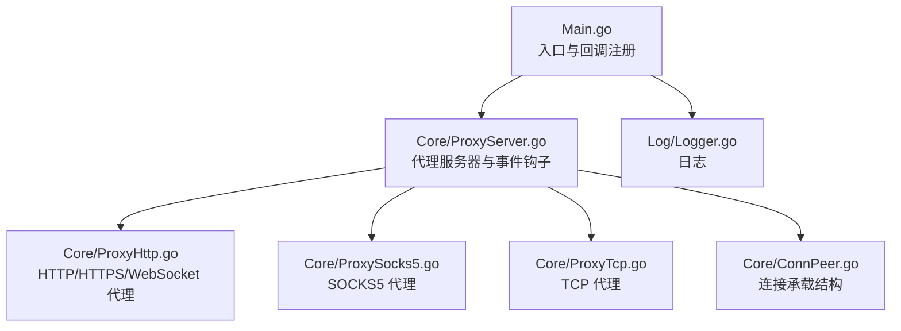
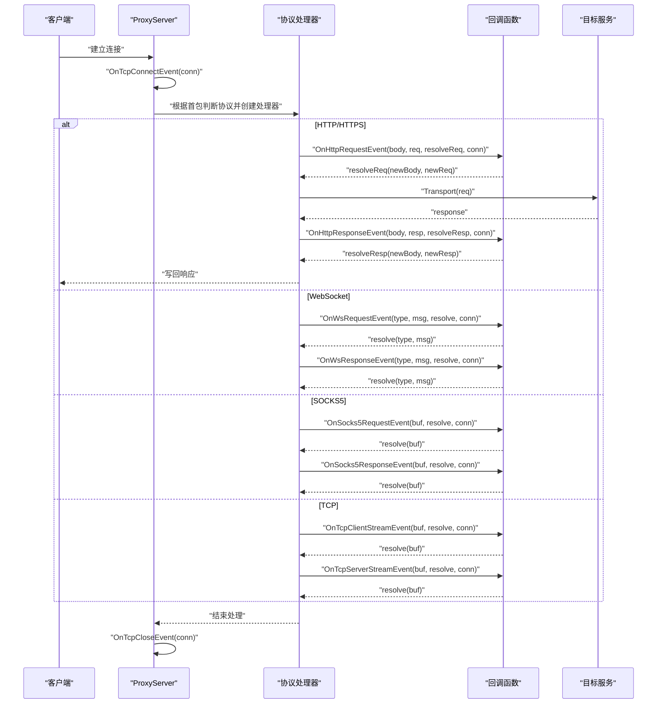
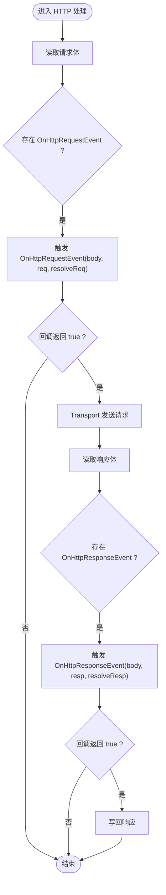
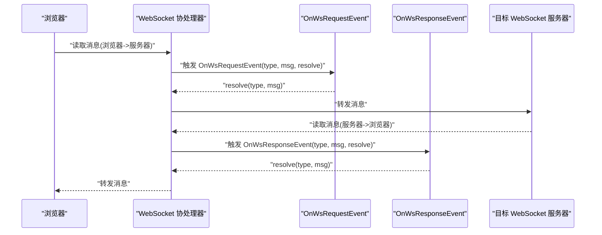
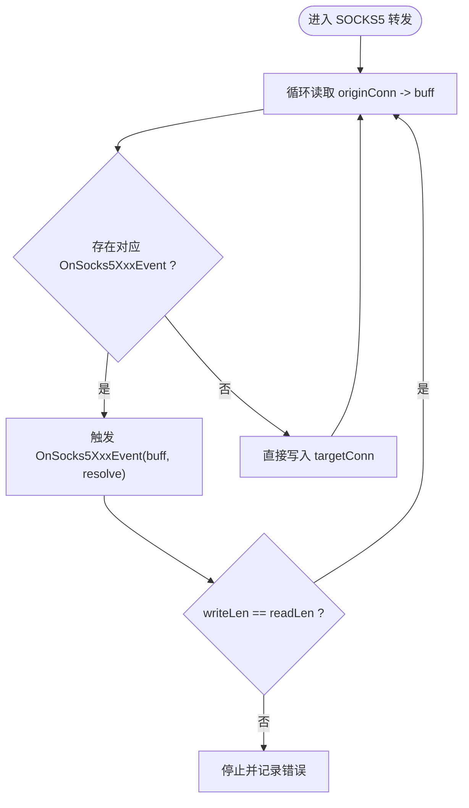
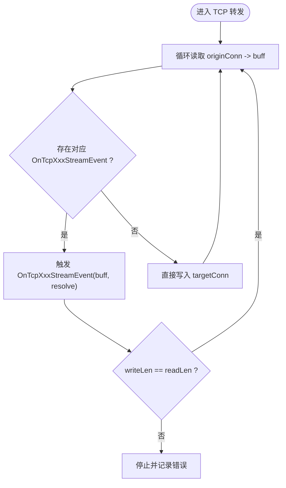
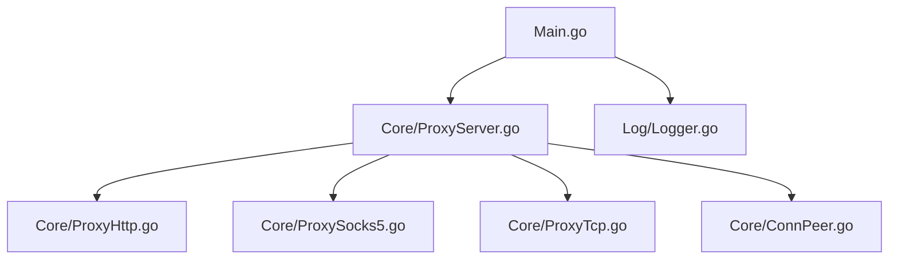

# 事件回调系统

<cite>
**本文引用的文件**
- [Main.go](file://Main.go)
- [ProxyServer.go](file://Core/ProxyServer.go)
- [ProxyHttp.go](file://Core/ProxyHttp.go)
- [ProxySocks5.go](file://Core/ProxySocks5.go)
- [ProxyTcp.go](file://Core/ProxyTcp.go)
- [ConnPeer.go](file://Core/ConnPeer.go)
- [Logger.go](file://Log/Logger.go)
</cite>

## 目录
1. [简介](#简介)
2. [项目结构](#项目结构)
3. [核心组件](#核心组件)
4. [架构总览](#架构总览)
5. [详细组件分析](#详细组件分析)
6. [依赖分析](#依赖分析)
7. [性能考量](#性能考量)
8. [故障排查指南](#故障排查指南)
9. [结论](#结论)
10. [附录](#附录)

## 简介
本文件系统性阐述 shermie-proxy 的事件驱动与回调机制，覆盖 HTTP 请求/响应、WebSocket 消息、SOCKS5 数据、TCP 流数据四类事件的触发时机、处理流程、回调签名与返回语义，并提供常见用例（修改数据、拦截请求、记录日志）与最佳实践（避免阻塞、正确处理异步数据）。读者可据此在回调中实现灵活的中间件式功能。

## 项目结构
- 入口程序负责初始化日志与证书、创建并启动 ProxyServer 实例，并注册各类事件回调。
- 核心代理逻辑位于 Core 包，按协议拆分：HTTP、SOCKS5、TCP，以及公共的连接承载结构 ConnPeer。
- 日志模块提供统一的日志接口。

图表来源
- [Main.go:24-124](file://Main.go#L24-L124)
- [ProxyServer.go:48-77](file://Core/ProxyServer.go#L48-L77)
- [ProxyHttp.go:29-37](file://Core/ProxyHttp.go#L29-L37)
- [ProxySocks5.go:15-19](file://Core/ProxySocks5.go#L15-L19)
- [ProxyTcp.go:15-19](file://Core/ProxyTcp.go#L15-L19)
- [ConnPeer.go:8-13](file://Core/ConnPeer.go#L8-L13)
- [Logger.go:8-19](file://Log/Logger.go#L8-L19)

章节来源
- [Main.go:24-124](file://Main.go#L24-L124)
- [ProxyServer.go:48-77](file://Core/ProxyServer.go#L48-L77)
- [Logger.go:8-19](file://Log/Logger.go#L8-L19)

## 核心组件
- 事件回调类型定义与注册点均在 ProxyServer 结构体上，作为全局事件钩子暴露给上层应用。
- 四类事件回调分别对应不同协议阶段：
  - HTTP 请求/响应：OnHttpRequestEvent、OnHttpResponseEvent
  - WebSocket：OnWsRequestEvent、OnWsResponseEvent
  - SOCKS5：OnSocks5RequestEvent、OnSocks5ResponseEvent
  - TCP 流：OnTcpClientStreamEvent、OnTcpServerStreamEvent
- 连接生命周期事件：OnTcpConnectEvent、OnTcpCloseEvent

章节来源
- [ProxyServer.go:22-34](file://Core/ProxyServer.go#L22-L34)
- [ProxyServer.go:56-65](file://Core/ProxyServer.go#L56-L65)
- [ProxyServer.go:176-186](file://Core/ProxyServer.go#L176-L186)

## 架构总览
下图展示从连接接入到协议处理再到回调触发的整体流程，以及各协议分支的回调位置。

图表来源
- [ProxyServer.go:176-186](file://Core/ProxyServer.go#L176-L186)
- [ProxyHttp.go:95-131](file://Core/ProxyHttp.go#L95-L131)
- [ProxyHttp.go:394-433](file://Core/ProxyHttp.go#L394-L433)
- [ProxySocks5.go:242-284](file://Core/ProxySocks5.go#L242-L284)
- [ProxyTcp.go:68-111](file://Core/ProxyTcp.go#L68-L111)

## 详细组件分析

### HTTP/HTTPS 回调
- 触发时机
  - 请求阶段：解析到 HTTP 请求后，读取请求体，调用 OnHttpRequestEvent；若回调未显式返回“继续”，则可中断后续处理。
  - 响应阶段：收到远端响应并读取响应体后，调用 OnHttpResponseEvent；同样可通过返回值控制是否继续写回客户端。
- 回调签名与参数
  - OnHttpRequestEvent(message []byte, request *http.Request, resolve ResolveHttpRequest, conn net.Conn) bool
    - message：原始请求体字节数组
    - request：标准 http.Request 对象
    - resolve：回调内部可调用以“替换”请求体与 Content-Length
    - 返回值：true 表示继续；false 表示中断（例如自定义处理）
  - OnHttpResponseEvent(message []byte, response *http.Response, resolve ResolveHttpResponse, conn net.Conn) bool
    - message：原始响应体字节数组
    - response：标准 http.Response 对象
    - resolve：回调内部可调用以“替换”响应体与 Content-Length
    - 返回值：true 表示继续；false 表示中断
- 处理流程要点
  - 请求阶段先读取请求体，再触发 OnHttpRequestEvent；若返回 false，则不再继续转发。
  - 响应阶段先读取响应体，再触发 OnHttpResponseEvent；若返回 false，则不再写回客户端。
  - resolve 函数会更新 request/response 的 Body 与 Content-Length，确保下游写回正确。

图表来源
- [ProxyHttp.go:95-131](file://Core/ProxyHttp.go#L95-L131)

章节来源
- [ProxyHttp.go:95-131](file://Core/ProxyHttp.go#L95-L131)

### WebSocket 回调
- 触发时机
  - 握手完成后，进入双向消息通道：浏览器 -> 服务器与服务器 -> 浏览器两条链路各自读取消息。
  - 每当从任一侧读取到消息时，触发对应方向的回调（请求/响应），允许修改消息类型与内容。
- 回调签名与参数
  - OnWsRequestEvent(msgType int, message []byte, resolve ResolveWs, conn net.Conn) error
    - msgType：消息类型（文本/二进制/控制帧）
    - message：消息内容
    - resolve：回调内部可调用以“转发”消息到另一侧
    - 返回值：error，若非空则终止该方向的消息循环
  - OnWsResponseEvent 同理，方向相反
- 处理流程要点
  - 两条协程分别读取浏览器与服务器消息，分别触发回调；回调内可直接调用 resolve 将消息转发至对侧。
  - 若 resolve 返回错误，将导致该方向停止并记录错误。

图表来源
- [ProxyHttp.go:394-433](file://Core/ProxyHttp.go#L394-L433)

章节来源
- [ProxyHttp.go:394-433](file://Core/ProxyHttp.go#L394-L433)

### SOCKS5 回调
- 触发时机
  - 握手完成后，进入双向数据转发：客户端 <-> 目标服务器。
  - 每当从任一侧读取到数据块时，触发对应方向的回调，允许修改数据或直接决定写入长度。
- 回调签名与参数
  - OnSocks5RequestEvent(message []byte, resolve ResolveSocks5, conn net.Conn) (int, error)
  - OnSocks5ResponseEvent(message []byte, resolve ResolveSocks5, conn net.Conn) (int, error)
  - resolve 接收原始缓冲区，返回写入目标连接的字节数与错误
  - 返回值 int：实际写入字节数；error：错误（非空将导致该方向停止）
- 处理流程要点
  - 两条协程分别在两个方向上循环读取与回调，回调可选择完全覆盖写入或按需写入部分数据。
  - 若写入长度小于读取长度或 resolve 返回错误，将视为写入失败并终止该方向。

图表来源
- [ProxySocks5.go:242-284](file://Core/ProxySocks5.go#L242-L284)

章节来源
- [ProxySocks5.go:242-284](file://Core/ProxySocks5.go#L242-L284)

### TCP 流回调
- 触发时机
  - 建立到目标主机的 TLS 连接后，进入双向数据转发。
  - 每当从任一侧读取到数据块时，触发对应方向的回调，允许修改数据或直接决定写入长度。
- 回调签名与参数
  - OnTcpClientStreamEvent / OnTcpServerStreamEvent
  - 签名与 SOCKS5 类似，返回值为 (int, error)，其中 int 为写入字节数。
- 处理流程要点
  - 两条协程分别在两个方向上循环读取与回调，回调可选择完全覆盖写入或按需写入部分数据。
  - 若写入长度小于读取长度或 resolve 返回错误，将视为写入失败并终止该方向。

图表来源
- [ProxyTcp.go:68-111](file://Core/ProxyTcp.go#L68-L111)

章节来源
- [ProxyTcp.go:68-111](file://Core/ProxyTcp.go#L68-L111)

### 连接生命周期回调
- OnTcpConnectEvent(conn net.Conn)：新连接接入时触发
- OnTcpCloseEvent(conn net.Conn)：连接关闭时触发
- 用途：统计、审计、资源清理等

章节来源
- [ProxyServer.go:176-186](file://Core/ProxyServer.go#L176-L186)

## 依赖分析
- 入口 Main.go 仅负责初始化与注册回调，不直接参与协议细节。
- ProxyServer 统一持有所有事件回调，并在 handle 中根据首包识别协议类型，委派到具体处理器。
- 各协议处理器通过 ConnPeer 持有底层连接与读写器，回调在处理器内部触发。
- 日志模块为全局单例，供各组件使用。

图表来源
- [Main.go:24-124](file://Main.go#L24-L124)
- [ProxyServer.go:48-77](file://Core/ProxyServer.go#L48-L77)
- [ProxyHttp.go:29-37](file://Core/ProxyHttp.go#L29-L37)
- [ProxySocks5.go:15-19](file://Core/ProxySocks5.go#L15-L19)
- [ProxyTcp.go:15-19](file://Core/ProxyTcp.go#L15-L19)
- [ConnPeer.go:8-13](file://Core/ConnPeer.go#L8-L13)
- [Logger.go:8-19](file://Log/Logger.go#L8-L19)

章节来源
- [Main.go:24-124](file://Main.go#L24-L124)
- [ProxyServer.go:48-77](file://Core/ProxyServer.go#L48-L77)
- [Logger.go:8-19](file://Log/Logger.go#L8-L19)

## 性能考量
- 回调执行路径均为同步回调，建议避免在回调中执行阻塞操作（如网络 I/O、磁盘 I/O、长耗时计算）。
- 对于需要外部处理的场景，可在回调中快速将任务投递到后台 goroutine 或队列，然后立即调用 resolve 返回，以减少延迟。
- WebSocket 与 SOCKS5/TCP 的双向转发采用独立 goroutine，回调返回前应尽量完成必要的数据转换，避免累积背压。
- 注意回调返回值的语义：HTTP 请求/响应阶段返回 false 可用于“自定义处理”；WS/SOCKS5/TCP 的回调返回错误将导致该方向停止，需谨慎处理。

## 故障排查指南
- 回调未生效
  - 确认已在入口处注册了相应回调（见 Main.go 中的注册示例）。
  - 确认当前连接确实触发了对应协议分支（例如 CONNECT/Upgrade/首包识别）。
- 回调修改无效
  - 对于 HTTP：确保在回调中调用了 resolve 并传入新的 body/request/response。
  - 对于 WS/SOCKS5/TCP：确保 resolve 返回的写入长度与读取长度一致，且返回 error 为 nil。
- 性能问题
  - 避免在回调中进行阻塞操作；必要时异步化。
  - 对大对象（如 gzip 响应）注意内存占用与解压成本。
- 日志定位
  - 使用 Logger 提供的日志接口输出关键信息，便于定位问题。

章节来源
- [Main.go:52-120](file://Main.go#L52-L120)
- [ProxyHttp.go:95-131](file://Core/ProxyHttp.go#L95-L131)
- [ProxyHttp.go:394-433](file://Core/ProxyHttp.go#L394-L433)
- [ProxySocks5.go:242-284](file://Core/ProxySocks5.go#L242-L284)
- [ProxyTcp.go:68-111](file://Core/ProxyTcp.go#L68-L111)
- [Logger.go:8-19](file://Log/Logger.go#L8-L19)

## 结论
sheremie-proxy 的事件回调系统以 ProxyServer 为核心枢纽，围绕 HTTP/HTTPS/WebSocket、SOCKS5、TCP 三大场景提供细粒度的回调钩子。通过回调，用户可以实现请求/响应拦截、内容修改、协议增强与可观测性等功能。遵循“回调内非阻塞、resolve 正确返回”的原则，可获得稳定且高性能的扩展能力。

## 附录

### 回调函数一览与签名摘要
- HTTP 请求回调
  - OnHttpRequestEvent(message []byte, request *http.Request, resolve ResolveHttpRequest, conn net.Conn) bool
- HTTP 响应回调
  - OnHttpResponseEvent(message []byte, response *http.Response, resolve ResolveHttpResponse, conn net.Conn) bool
- WebSocket 请求回调
  - OnWsRequestEvent(msgType int, message []byte, resolve ResolveWs, conn net.Conn) error
- WebSocket 响应回调
  - OnWsResponseEvent(msgType int, message []byte, resolve ResolveWs, conn net.Conn) error
- SOCKS5 请求回调
  - OnSocks5RequestEvent(message []byte, resolve ResolveSocks5, conn net.Conn) (int, error)
- SOCKS5 响应回调
  - OnSocks5ResponseEvent(message []byte, resolve ResolveSocks5, conn net.Conn) (int, error)
- TCP 客户端流回调
  - OnTcpClientStreamEvent(message []byte, resolve ResolveTcp, conn net.Conn) (int, error)
- TCP 服务器流回调
  - OnTcpServerStreamEvent(message []byte, resolve ResolveTcp, conn net.Conn) (int, error)
- 连接生命周期回调
  - OnTcpConnectEvent(conn net.Conn)
  - OnTcpCloseEvent(conn net.Conn)

章节来源
- [ProxyServer.go:22-34](file://Core/ProxyServer.go#L22-L34)
- [ProxyServer.go:56-65](file://Core/ProxyServer.go#L56-L65)
- [ProxyServer.go:176-186](file://Core/ProxyServer.go#L176-L186)