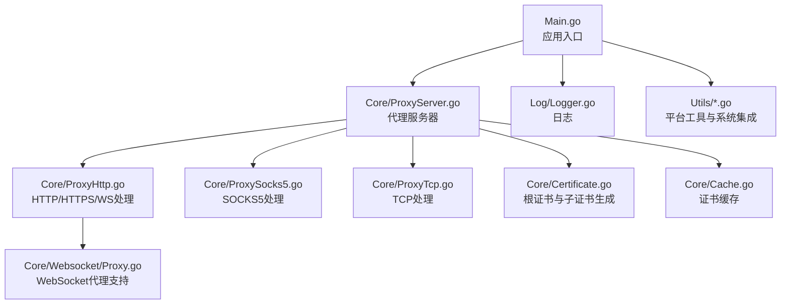
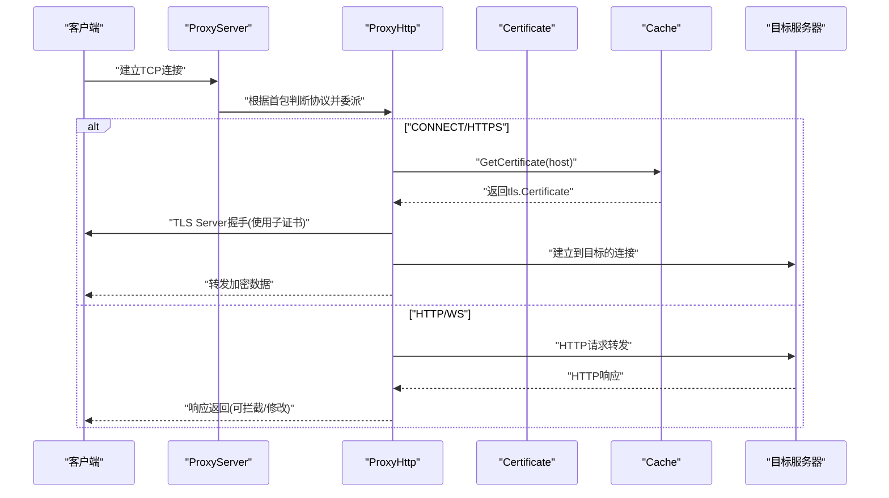
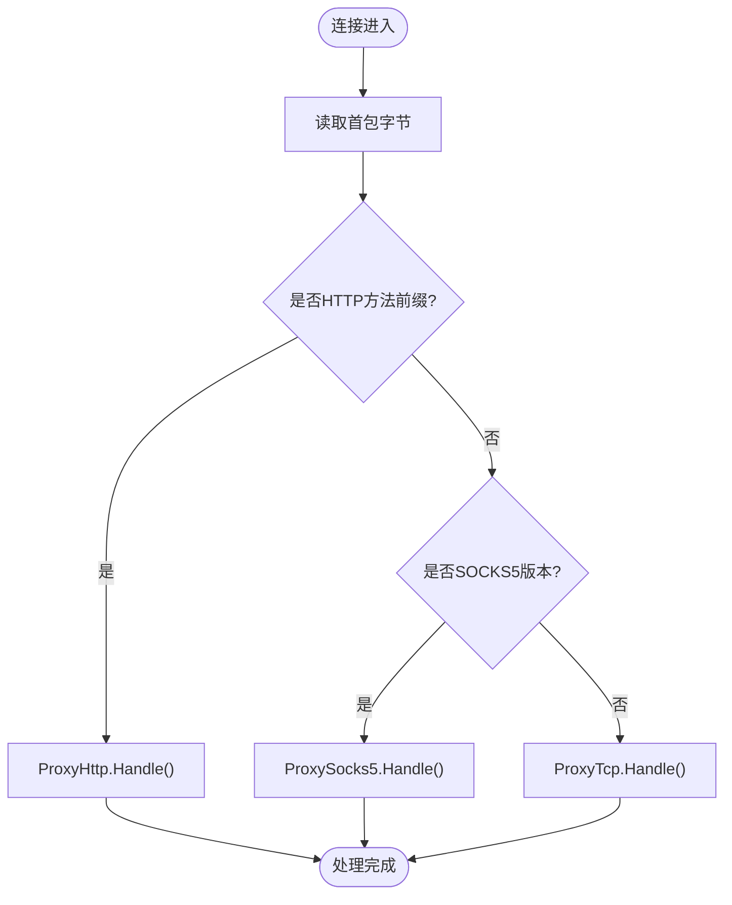
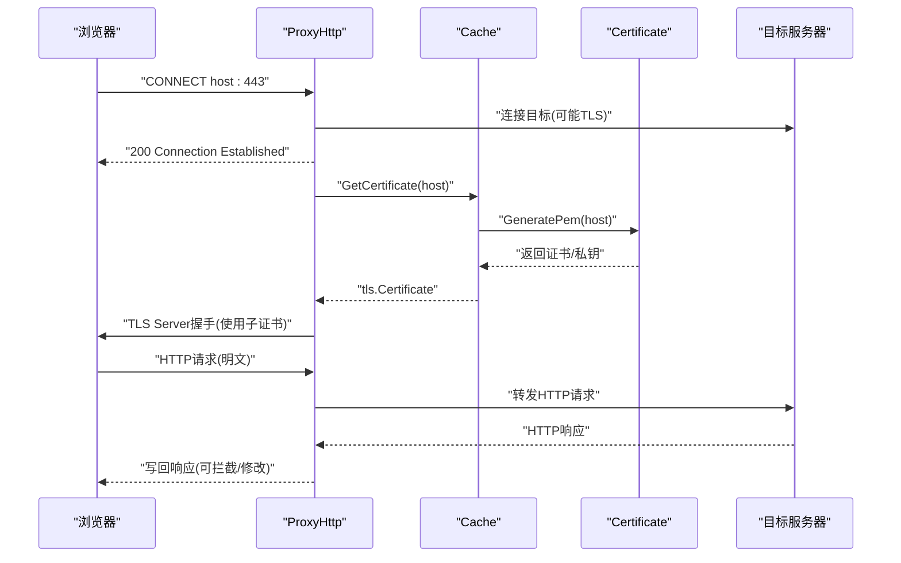
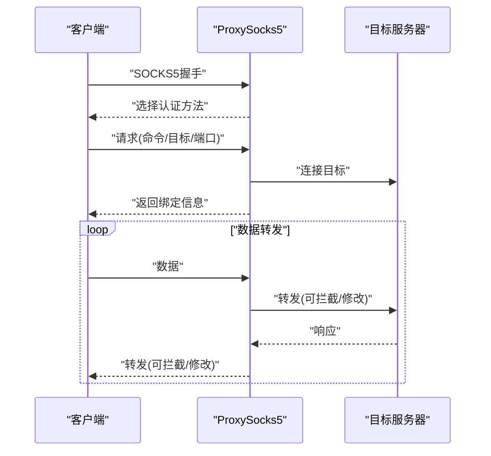
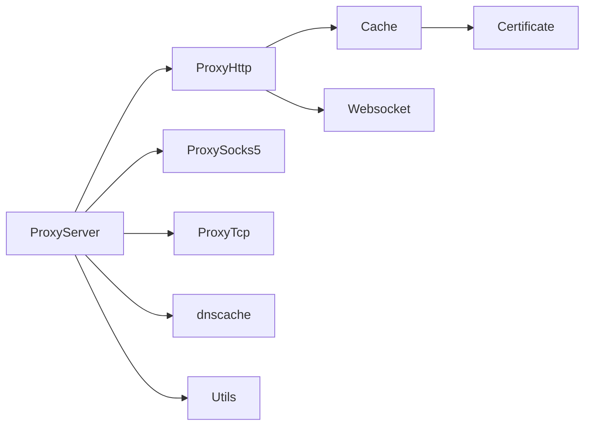

# HTTP/HTTPS 代理

<cite>
**本文引用的文件**
- [Main.go](file://Main.go)
- [README.md](file://README.md)
- [Contract/IServerProcesser.go](file://Contract/IServerProcesser.go)
- [Core/ProxyServer.go](file://Core/ProxyServer.go)
- [Core/ProxyHttp.go](file://Core/ProxyHttp.go)
- [Core/ProxySocks5.go](file://Core/ProxySocks5.go)
- [Core/ProxyTcp.go](file://Core/ProxyTcp.go)
- [Core/Certificate.go](file://Core/Certificate.go)
- [Core/Cache.go](file://Core/Cache.go)
- [Utils/Utils.go](file://Utils/Utils.go)
- [Utils/Windows.go](file://Utils/Windows.go)
- [Utils/Linux.go](file://Utils/Linux.go)
- [Utils/Macos.go](file://Utils/Macos.go)
- [Core/Websocket/Proxy.go](file://Core/Websocket/Proxy.go)
</cite>

## 目录
1. [简介](#简介)
2. [项目结构](#项目结构)
3. [核心组件](#核心组件)
4. [架构总览](#架构总览)
5. [详细组件分析](#详细组件分析)
6. [依赖分析](#依赖分析)
7. [性能考虑](#性能考虑)
8. [故障排除指南](#故障排除指南)
9. [结论](#结论)
10. [附录](#附录)

## 简介
本项目是一个多协议代理工具，支持 HTTP、HTTPS、WS/WSS、TCP、SOCKS5 的监听与代理。其核心能力包括：
- 中间人攻击（MITM）拦截 HTTPS 流量，通过根证书签发子证书完成 TLS 握手，实现透明代理。
- 提供事件钩子，允许在请求/响应阶段进行内容拦截与修改。
- 支持系统代理与证书安装（Windows 平台），便于将流量导入代理。
- 提供 DNS 缓存、并发证书生成与缓存、Nagle 算法控制等工程化特性。

## 项目结构
项目采用按功能域分层的组织方式，核心逻辑集中在 Core 目录，平台相关工具在 Utils 目录，入口程序在根目录。



图表来源
- [Main.go:1-124](file://Main.go#L1-L124)
- [Core/ProxyServer.go:1-213](file://Core/ProxyServer.go#L1-L213)
- [Core/ProxyHttp.go:1-491](file://Core/ProxyHttp.go#L1-L491)
- [Core/ProxySocks5.go:1-300](file://Core/ProxySocks5.go#L1-L300)
- [Core/ProxyTcp.go:1-112](file://Core/ProxyTcp.go#L1-L112)
- [Core/Certificate.go:1-188](file://Core/Certificate.go#L1-L188)
- [Core/Cache.go:1-79](file://Core/Cache.go#L1-L79)
- [Core/Websocket/Proxy.go:1-78](file://Core/Websocket/Proxy.go#L1-L78)
- [Utils/Windows.go:1-123](file://Utils/Windows.go#L1-L123)
- [Utils/Linux.go:1-17](file://Utils/Linux.go#L1-L17)
- [Utils/Macos.go:1-17](file://Utils/Macos.go#L1-L17)

章节来源
- [Main.go:1-124](file://Main.go#L1-L124)
- [README.md:1-163](file://README.md#L1-L163)

## 核心组件
- 代理服务器：负责监听端口、识别协议、分派到具体处理器。
- 协议处理器：
  - HTTP/HTTPS/WS：解析请求、转发、拦截与修改、处理压缩、升级协议。
  - SOCKS5：握手协商、目标解析、双向转发。
  - TCP：直连目标，必要时进行 TLS 握手。
- 证书体系：根证书生成与持久化、子证书按域名并发生成与缓存、平台安装与系统代理设置。
- 事件钩子：在请求/响应/流数据阶段注入自定义处理逻辑。

章节来源
- [Core/ProxyServer.go:48-213](file://Core/ProxyServer.go#L48-L213)
- [Core/ProxyHttp.go:29-491](file://Core/ProxyHttp.go#L29-L491)
- [Core/ProxySocks5.go:15-300](file://Core/ProxySocks5.go#L15-L300)
- [Core/ProxyTcp.go:15-112](file://Core/ProxyTcp.go#L15-L112)
- [Core/Certificate.go:20-188](file://Core/Certificate.go#L20-L188)
- [Core/Cache.go:20-79](file://Core/Cache.go#L20-L79)

## 架构总览
下图展示从客户端连接到目标服务器的完整链路，以及 MITM 证书生成与缓存的关键节点。



图表来源
- [Core/ProxyServer.go:176-203](file://Core/ProxyServer.go#L176-L203)
- [Core/ProxyHttp.go:44-286](file://Core/ProxyHttp.go#L44-L286)
- [Core/Cache.go:39-78](file://Core/Cache.go#L39-L78)
- [Core/Certificate.go:69-116](file://Core/Certificate.go#L69-L116)

## 详细组件分析

### 代理服务器与协议识别
- 监听与启动：解析端口、网卡、Nagle 参数，启动多协程监听循环。
- 协议识别：通过首包前缀判断 HTTP 方法或 SOCKS5 版本，否则作为 TCP。
- 分派处理：将连接委派给对应处理器的 Handle 入口。



图表来源
- [Core/ProxyServer.go:176-213](file://Core/ProxyServer.go#L176-L213)
- [Core/ProxyHttp.go:44-64](file://Core/ProxyHttp.go#L44-L64)

章节来源
- [Core/ProxyServer.go:123-213](file://Core/ProxyServer.go#L123-L213)

### HTTP/HTTPS/WS 处理器（MITM 关键）
- HTTP 请求：读取请求体、触发 OnHttpRequestEvent、构造新请求、Transport 转发、读取响应、触发 OnHttpResponseEvent、写回客户端。
- HTTPS CONNECT：建立到目标的 TCP/TLS 连接，向客户端返回“200 Connection Established”，随后以 MITM 方式建立 TLS Server 握手，再读取真实 HTTP 请求并处理。
- WS/WSS：在 TLS 握手失败时尝试解析原始帧，识别 Upgrade 请求后进行协议升级；升级后两端长连接双向转发。
- 压缩处理：自动识别 gzip 并解压响应体。
- 头部清理：移除 Keep-Alive、Transfer-Encoding、TE、Connection、Upgrade 等可能影响代理行为的头部。



图表来源
- [Core/ProxyHttp.go:205-286](file://Core/ProxyHttp.go#L205-L286)
- [Core/Cache.go:39-78](file://Core/Cache.go#L39-L78)
- [Core/Certificate.go:69-116](file://Core/Certificate.go#L69-L116)

章节来源
- [Core/ProxyHttp.go:67-132](file://Core/ProxyHttp.go#L67-L132)
- [Core/ProxyHttp.go:182-203](file://Core/ProxyHttp.go#L182-L203)
- [Core/ProxyHttp.go:241-286](file://Core/ProxyHttp.go#L241-L286)
- [Core/ProxyHttp.go:288-434](file://Core/ProxyHttp.go#L288-L434)

### SOCKS5 处理器
- 版本与认证：读取方法列表，默认无需认证，返回选择结果。
- 请求解析：读取命令、保留位、目标类型（IPv4/IPv6/域名）、端口。
- 连接目标：根据命令选择 TCP/UDP 或 Bind；必要时对 443 端口进行 TLS 握手。
- 双向转发：启动两个 goroutine 在客户端与目标之间互转数据，支持事件钩子。



图表来源
- [Core/ProxySocks5.go:54-240](file://Core/ProxySocks5.go#L54-L240)

章节来源
- [Core/ProxySocks5.go:15-300](file://Core/ProxySocks5.go#L15-L300)

### TCP 处理器
- 直连模式：当启用 --to 参数时，直接连接到指定目标地址。
- MITM 握手：若需要，使用缓存的证书进行 TLS 握手。
- 双向转发：与 SOCKS5 类似的双向转发逻辑，支持事件钩子。

章节来源
- [Core/ProxyTcp.go:23-112](file://Core/ProxyTcp.go#L23-L112)

### 证书生成与管理
- 根证书：首次运行时生成根证书与私钥，保存为本地文件；后续复用。
- 子证书：按域名并发生成，使用根证书签发，返回 x509+私钥对并封装为 tls.Certificate。
- 缓存策略：同一主机在同一时刻仅生成一次证书，其他并发等待；生成完成后缓存以便复用。
- 平台适配：Windows 支持安装根证书到系统信任存储、设置系统代理；Linux/MacOS 当前返回不支持错误。

```mermaid
classDiagram
class Certificate {
+RootKey
+RootCa
+RootCaStr
+RootKeyStr
+Init() error
+GenerateRootPemFile(host) (*pem.Block, *pem.Block, error)
+GeneratePem(host) ([]byte, []byte, error)
+GenerateKeyPair() (*rsa.PrivateKey, error)
}
class Storage {
-lock
-mapping
+GetCertificate(hostname, port) (interface{}, error)
}
class Utils {
+InstallCert(name) error
+SetSystemProxy(proxy) error
}
Storage --> Certificate : "生成/获取证书"
Utils ..> Certificate : "Windows平台集成"
```

图表来源
- [Core/Certificate.go:20-188](file://Core/Certificate.go#L20-L188)
- [Core/Cache.go:20-79](file://Core/Cache.go#L20-L79)
- [Utils/Windows.go:18-122](file://Utils/Windows.go#L18-L122)
- [Utils/Linux.go:8-16](file://Utils/Linux.go#L8-L16)
- [Utils/Macos.go:8-16](file://Utils/Macos.go#L8-L16)

章节来源
- [Core/Certificate.go:34-188](file://Core/Certificate.go#L34-L188)
- [Core/Cache.go:39-78](file://Core/Cache.go#L39-L78)
- [Utils/Windows.go:18-122](file://Utils/Windows.go#L18-L122)
- [Utils/Linux.go:8-16](file://Utils/Linux.go#L8-L16)
- [Utils/Macos.go:8-16](file://Utils/Macos.go#L8-L16)

### WebSocket 代理支持
- 升级流程：在 HTTP 层检测 Upgrade/Connection 头，执行协议升级。
- 代理拨号：支持 wss 时客户端侧跳过证书校验；支持通过代理发起 CONNECT。
- 双向转发：两端长连接，分别触发 OnWsRequestEvent/OnWsResponseEvent。

章节来源
- [Core/ProxyHttp.go:327-434](file://Core/ProxyHttp.go#L327-L434)
- [Core/Websocket/Proxy.go:29-77](file://Core/Websocket/Proxy.go#L29-L77)

## 依赖分析
- 组件内聚：各处理器职责清晰，通过统一的 ConnPeer 结构共享读写器与上下文。
- 外部依赖：HTTP 传输层、DNS 缓存、平台系统 API（Windows）。
- 并发模型：监听循环多协程 Accept，每个连接独立 goroutine 处理；证书生成使用 WaitGroup 控制并发一致性。



图表来源
- [Core/ProxyServer.go:68-77](file://Core/ProxyServer.go#L68-L77)
- [Core/ProxyHttp.go:244-255](file://Core/ProxyHttp.go#L244-L255)
- [Core/Cache.go:66-78](file://Core/Cache.go#L66-L78)
- [Core/Certificate.go:69-116](file://Core/Certificate.go#L69-L116)
- [Core/Websocket/Proxy.go:23-27](file://Core/Websocket/Proxy.go#L23-L27)

章节来源
- [Core/ProxyServer.go:1-213](file://Core/ProxyServer.go#L1-L213)
- [Core/ProxyHttp.go:1-491](file://Core/ProxyHttp.go#L1-L491)
- [Core/ProxySocks5.go:1-300](file://Core/ProxySocks5.go#L1-L300)
- [Core/ProxyTcp.go:1-112](file://Core/ProxyTcp.go#L1-L112)
- [Core/Cache.go:1-79](file://Core/Cache.go#L1-L79)
- [Core/Certificate.go:1-188](file://Core/Certificate.go#L1-L188)
- [Core/Websocket/Proxy.go:1-78](file://Core/Websocket/Proxy.go#L1-L78)

## 性能考虑
- Nagle 算法：可通过 --nagle 控制是否关闭 Nagle，减少小包延迟。
- KeepAlive：HTTP 传输层禁用 Keep-Alive，避免连接复用带来的复杂性。
- DNS 缓存：内置 dnscache，降低重复解析成本。
- 并发证书生成：同一主机并发仅生成一次证书，减少 CPU 与磁盘 IO。
- 压缩处理：自动识别 gzip 并解压，避免手动处理。
- 系统代理与证书安装：Windows 下可自动安装根证书与设置系统代理，减少手工配置成本。

章节来源
- [Core/ProxyHttp.go:185-190](file://Core/ProxyHttp.go#L185-L190)
- [Core/ProxyServer.go:71](file://Core/ProxyServer.go#L71)
- [Core/Cache.go:48-53](file://Core/Cache.go#L48-L53)
- [Utils/Windows.go:18-50](file://Utils/Windows.go#L18-L50)

## 故障排除指南
- 无法安装系统证书/设置代理（Windows）：检查管理员权限与证书文件是否存在。
- 证书安装失败（非 Windows）：当前平台不支持自动安装，请手动导入根证书至系统信任存储。
- TLS 握手失败：确认根证书已被系统信任；查看证书缓存是否命中；检查目标主机证书链。
- HTTP 响应异常：检查 OnHttpResponseEvent 是否正确设置 Content-Length；确认压缩处理逻辑。
- WebSocket 升级失败：确认 Upgrade/Connection 头是否正确传递；检查 OnWsRequestEvent/OnWsResponseEvent 是否阻断了必要的头部。
- SOCKS5 连接失败：检查目标地址与端口；确认 UDP/TCP/BIND 命令支持情况；查看 OnSocks5RequestEvent/OnSocks5ResponseEvent 是否导致数据截断。
- TCP 直连失败：确认 --to 参数格式与可达性；检查证书缓存与 TLS 握手。

章节来源
- [Utils/Windows.go:18-122](file://Utils/Windows.go#L18-L122)
- [Utils/Linux.go:8-16](file://Utils/Linux.go#L8-L16)
- [Utils/Macos.go:8-16](file://Utils/Macos.go#L8-L16)
- [Core/ProxyHttp.go:241-286](file://Core/ProxyHttp.go#L241-L286)
- [Core/ProxyHttp.go:117-130](file://Core/ProxyHttp.go#L117-L130)
- [Core/ProxySocks5.go:185-205](file://Core/ProxySocks5.go#L185-L205)
- [Core/ProxyTcp.go:40-57](file://Core/ProxyTcp.go#L40-L57)

## 结论
本项目通过清晰的协议分派与 MITM 证书体系，实现了对 HTTP/HTTPS/WS/WSS/TCP/SOCKS5 的统一代理能力。其事件钩子机制为内容拦截与修改提供了灵活扩展点；平台集成与缓存策略提升了可用性与性能。建议在生产环境中确保根证书可信、合理使用事件钩子，并结合 Nagle 与 DNS 缓存参数进行性能调优。

## 附录

### 配置选项说明
- --port：监听端口（支持多个端口，逗号分隔，需与 --network 数量一致）。
- --nagle：是否启用 Nagle 算法（默认开启）。
- --proxy：上层 TCP 代理地址（用于 SOCKS5/HTTP 转发）。
- --to：TCP 直连目标地址（用于 TCP 代理模式）。
- --network：强制绑定网卡 IP（与 --port 数量一致）。

章节来源
- [Main.go:24-46](file://Main.go#L24-L46)
- [README.md:148-163](file://README.md#L148-L163)

### 事件钩子一览
- OnHttpRequestEvent：拦截/修改 HTTP 请求。
- OnHttpResponseEvent：拦截/修改 HTTP 响应。
- OnSocks5RequestEvent/OnSocks5ResponseEvent：拦截/修改 SOCKS5 数据。
- OnWsRequestEvent/OnWsResponseEvent：拦截/修改 WebSocket 消息。
- OnTcpClientStreamEvent/OnTcpServerStreamEvent：拦截/修改 TCP 流。
- OnTcpConnectEvent/OnTcpCloseEvent：TCP 连接生命周期事件。

章节来源
- [Main.go:61-120](file://Main.go#L61-L120)
- [Core/ProxyServer.go:22-34](file://Core/ProxyServer.go#L22-L34)