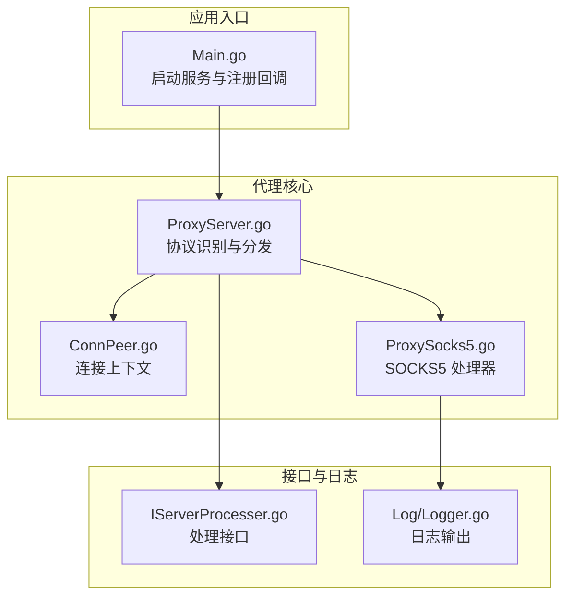
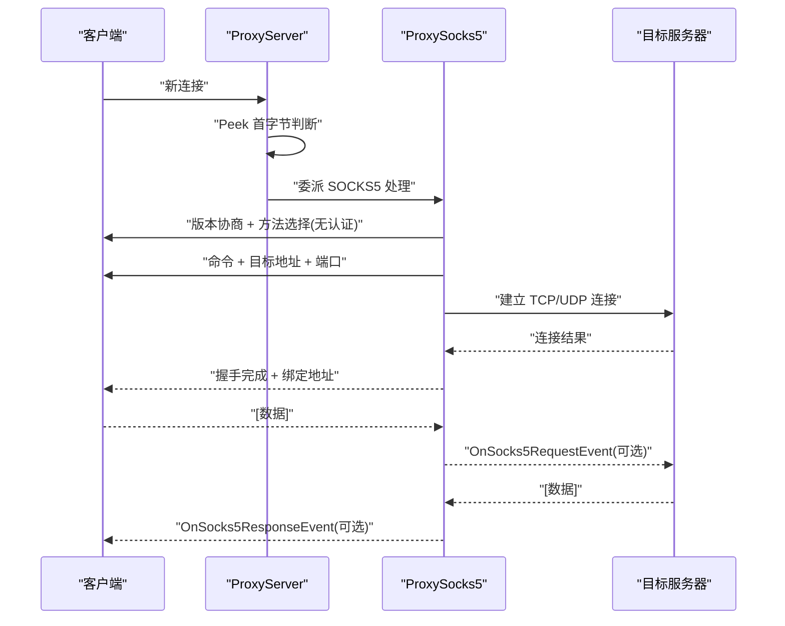
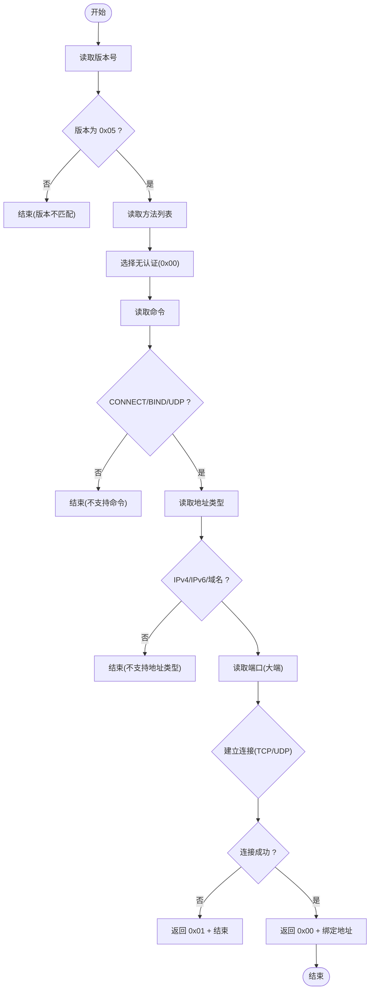
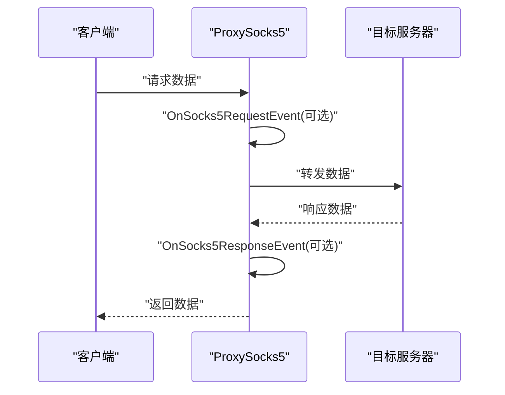
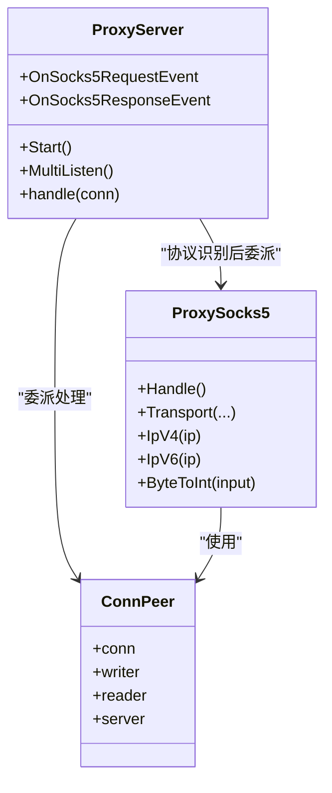

# SOCKS5 代理

<cite>
**本文引用的文件**
- [Core/ProxySocks5.go](file://Core/ProxySocks5.go)
- [Core/ProxySocks5_test.go](file://Core/ProxySocks5_test.go)
- [Core/ProxyServer.go](file://Core/ProxyServer.go)
- [Core/ConnPeer.go](file://Core/ConnPeer.go)
- [Contract/IServerProcesser.go](file://Contract/IServerProcesser.go)
- [Main.go](file://Main.go)
- [README.md](file://README.md)
- [Log/Logger.go](file://Log/Logger.go)
- [Core/Websocket/XnetProxy.go](file://Core/Websocket/XnetProxy.go)
- [CODE-DOC.md](file://CODE-DOC.md)
</cite>

## 目录
1. [简介](#简介)
2. [项目结构](#项目结构)
3. [核心组件](#核心组件)
4. [架构总览](#架构总览)
5. [详细组件分析](#详细组件分析)
6. [依赖关系分析](#依赖关系分析)
7. [性能与超时](#性能与超时)
8. [故障排查指南](#故障排查指南)
9. [结论](#结论)
10. [附录](#附录)

## 简介
本文件面向 SOCKS5 代理处理器的实现，系统性梳理其协议实现、握手流程、命令与地址类型支持、数据转发、事件回调扩展点、错误处理与性能特性，并给出配置示例与常见问题解决方案。该实现遵循 SOCKS5 协议基本规范，当前版本支持 CONNECT 命令与无认证模式，同时提供 UDP ASSOCIATE 的基础接入能力；BIND 命令未在当前实现中启用。

## 项目结构
- 核心代理层位于 Core 包，其中 ProxySocks5.go 实现 SOCKS5 处理器，ProxyServer.go 提供统一入口与协议识别，ConnPeer.go 定义通用连接上下文。
- 合同接口 Contract/IServerProcesser.go 定义统一处理接口，便于不同协议处理器实现。
- 日志模块 Log/Logger.go 提供统一日志输出。
- 示例与入口 Main.go 展示如何启动服务并注册事件回调。
- 文档 CODE-DOC.md 提供了握手与转发流程图等补充说明。

图表来源
- [Main.go:24-124](file://Main.go#L24-L124)
- [Core/ProxyServer.go:176-200](file://Core/ProxyServer.go#L176-L200)
- [Core/ConnPeer.go:8-14](file://Core/ConnPeer.go#L8-L14)
- [Core/ProxySocks5.go:15-52](file://Core/ProxySocks5.go#L15-L52)
- [Contract/IServerProcesser.go:3-8](file://Contract/IServerProcesser.go#L3-L8)
- [Log/Logger.go:17-20](file://Log/Logger.go#L17-L20)

章节来源
- [Main.go:24-124](file://Main.go#L24-L124)
- [Core/ProxyServer.go:176-200](file://Core/ProxyServer.go#L176-L200)
- [Core/ConnPeer.go:8-14](file://Core/ConnPeer.go#L8-L14)
- [Core/ProxySocks5.go:15-52](file://Core/ProxySocks5.go#L15-L52)
- [Contract/IServerProcesser.go:3-8](file://Contract/IServerProcesser.go#L3-L8)
- [Log/Logger.go:17-20](file://Log/Logger.go#L17-L20)

## 核心组件
- ProxySocks5：SOCKS5 协议处理核心，负责版本协商、认证方法选择（当前仅支持无认证）、命令解析、目标地址解析与连接建立确认，以及双向数据转发。
- ProxyServer：统一监听与协议识别，根据首字节判断是否为 SOCKS5 并委派至对应处理器。
- ConnPeer：封装底层连接、读写缓冲与所属服务器实例，作为各处理器的通用上下文。
- IServerProcesser：统一处理接口，用于协议分发与扩展。
- 日志 Logger：统一日志输出，便于调试与排障。

章节来源
- [Core/ProxySocks5.go:15-52](file://Core/ProxySocks5.go#L15-L52)
- [Core/ProxyServer.go:176-200](file://Core/ProxyServer.go#L176-L200)
- [Core/ConnPeer.go:8-14](file://Core/ConnPeer.go#L8-L14)
- [Contract/IServerProcesser.go:3-8](file://Contract/IServerProcesser.go#L3-L8)
- [Log/Logger.go:17-20](file://Log/Logger.go#L17-L20)

## 架构总览
SOCKS5 处理器在 ProxyServer 的统一调度下运行。当连接进入时，ProxyServer 通过 Peek 判断是否为 SOCKS5（首字节为 0x05），随后将连接交由 ProxySocks5 处理。ProxySocks5 完成握手后，根据命令类型建立 TCP 或 UDP 连接，并启动双向转发通道。

图表来源
- [Core/ProxyServer.go:176-200](file://Core/ProxyServer.go#L176-L200)
- [Core/ProxySocks5.go:54-240](file://Core/ProxySocks5.go#L54-L240)
- [Main.go:80-92](file://Main.go#L80-L92)

## 详细组件分析

### SOCKS5 握手与命令处理
- 版本协商：读取客户端版本号，要求为 0x05。
- 认证方法选择：当前实现仅支持无认证（0x00），方法列表读取但不进行实际认证。
- 命令解析：支持 CONNECT（0x01）、BIND（0x02）、UDP ASSOCIATE（0x03）。当前实现仅处理 CONNECT 与 UDP ASSOCIATE，BIND 未启用。
- 目标地址解析：支持 IPv4（0x01）、IPv6（0x04）、域名（0x03）。域名解析失败时回退为原始域名字符串。
- 端口处理：采用大端序读取 2 字节端口值。
- 连接建立：根据命令类型选择 TCP 或 UDP；若端口为 443，则使用 TLS 握手；否则普通 TCP 连接；超时时间为 30 秒。
- 握手确认：成功则返回 0x00，失败返回 0x01，并写入本地绑定地址与端口。

图表来源
- [Core/ProxySocks5.go:54-240](file://Core/ProxySocks5.go#L54-L240)

章节来源
- [Core/ProxySocks5.go:54-240](file://Core/ProxySocks5.go#L54-L240)

### 地址类型与端口处理
- IPv4：读取 4 字节地址。
- IPv6：读取 16 字节地址。
- 域名：读取长度字节与对应长度的字节序列。
- 端口：大端序 2 字节整数。
- 地址回显：根据远端地址类型选择 IPv4/IPv6/域名格式回显。

章节来源
- [Core/ProxySocks5.go:127-227](file://Core/ProxySocks5.go#L127-L227)

### 数据转发与事件回调
- 双向转发：使用两个 goroutine 分别从客户端与目标服务器读取数据，分别写入另一端。
- 事件回调：在写入前可触发 OnSocks5RequestEvent 或 OnSocks5ResponseEvent，允许用户拦截与修改数据。
- 错误处理：读写异常或长度不匹配时，通过通道返回错误并终止转发。

图表来源
- [Core/ProxySocks5.go:242-284](file://Core/ProxySocks5.go#L242-L284)
- [Main.go:80-92](file://Main.go#L80-L92)

章节来源
- [Core/ProxySocks5.go:242-284](file://Core/ProxySocks5.go#L242-L284)
- [Main.go:80-92](file://Main.go#L80-L92)

### 类型与常量定义
- 版本与命令：Version=0x05；CommandConn=0x01；CommandBind=0x02；CommandUdp=0x03。
- 地址类型：TargetIpv4=0x01；TargetIpv6=0x04；TargetDomain=0x03。
- 认证方法：GssApi=0x01；UsernamePassword=0x02；私有范围保留 0x80..0xFE；拒绝方法 0xFF。
- 角色标识：SocketServer="server"；SocketClient="client"。

章节来源
- [Core/ProxySocks5.go:23-48](file://Core/ProxySocks5.go#L23-L48)

### 测试覆盖
- 字节转端口：覆盖端口 0、1、80、443、8080、256、65535 等边界场景。
- IPv4/IPv6 判定：覆盖有效与无效输入，确保判定逻辑正确。

章节来源
- [Core/ProxySocks5_test.go:5-91](file://Core/ProxySocks5_test.go#L5-L91)

## 依赖关系分析
- ProxySocks5 依赖 ConnPeer 提供的连接与读写缓冲。
- ProxyServer 在协议识别阶段将连接委派给具体处理器（如 ProxySocks5）。
- 事件回调通过 ProxyServer 注入，SOCKS5 处理器在转发前触发相应回调。
- 日志模块统一输出，便于定位问题。

图表来源
- [Core/ProxyServer.go:48-77](file://Core/ProxyServer.go#L48-L77)
- [Core/ConnPeer.go:8-14](file://Core/ConnPeer.go#L8-L14)
- [Core/ProxySocks5.go:15-52](file://Core/ProxySocks5.go#L15-L52)

章节来源
- [Core/ProxyServer.go:48-77](file://Core/ProxyServer.go#L48-L77)
- [Core/ConnPeer.go:8-14](file://Core/ConnPeer.go#L8-L14)
- [Core/ProxySocks5.go:15-52](file://Core/ProxySocks5.go#L15-L52)

## 性能与超时
- 超时策略：目标服务器连接超时为 30 秒；读取缓冲大小为 10KB。
- TLS 优化：当目标端口为 443 时使用 TLS 握手，避免明文传输。
- 并发模型：双向转发使用两个 goroutine，提高吞吐能力。
- Nagle 算法：可通过启动参数控制是否启用（默认启用），影响小包延迟与带宽利用的平衡。

章节来源
- [Core/ProxySocks5.go:183-195](file://Core/ProxySocks5.go#L183-L195)
- [Main.go:25-30](file://Main.go#L25-L30)

## 故障排查指南
- 版本不匹配：若客户端版本非 0x05，握手直接失败。
- 不支持命令：仅支持 CONNECT 与 UDP ASSOCIATE，BIND 当前未启用。
- 地址类型不支持：仅支持 IPv4、IPv6、域名，其他类型将导致握手失败。
- DNS 解析失败：域名解析失败时回退为原始域名字符串，可能导致连接失败。
- 连接失败：目标服务器不可达或被拒绝时，返回 0x01 并记录错误。
- 读写错误：读取客户端数据或写入目标服务器失败时，会记录错误并终止转发。
- 事件回调异常：若回调返回长度不匹配或错误，将触发终止条件。

章节来源
- [Core/ProxySocks5.go:56-126](file://Core/ProxySocks5.go#L56-L126)
- [Core/ProxySocks5.go:183-232](file://Core/ProxySocks5.go#L183-L232)
- [Core/ProxySocks5.go:242-284](file://Core/ProxySocks5.go#L242-L284)

## 结论
该 SOCKS5 代理处理器实现了协议的核心握手与数据转发路径，支持 CONNECT 与 UDP ASSOCIATE 命令及多种地址类型，具备事件回调扩展点与 TLS 支持。当前版本未实现 BIND 命令与用户名密码认证，但在扩展上预留了清晰的接口与回调机制，适合进一步增强功能与性能。

## 附录

### 协议规范遵循与兼容性
- 版本与方法协商：遵循 SOCKS5 基本流程，当前仅支持无认证。
- 命令支持：CONNECT 与 UDP ASSOCIATE 已实现；BIND 未启用。
- 地址类型：IPv4、IPv6、域名均支持。
- 错误码：握手阶段返回 0x00 表示成功，0x01 表示失败；错误信息通过日志输出。
- 兼容性：与主流浏览器与工具链兼容，建议在需要认证或 BIND 功能时扩展实现。

章节来源
- [Core/ProxySocks5.go:23-48](file://Core/ProxySocks5.go#L23-L48)
- [Core/ProxySocks5.go:183-232](file://Core/ProxySocks5.go#L183-L232)

### 配置示例
- 启动参数
  - --port：监听端口，默认 9090。
  - --nagle：是否启用 Nagle 算法，默认 true。
  - --proxy：上层 TCP 代理（当前 SOCKS5 处理器未使用）。
  - --to：TCP 透传目标（当前 SOCKS5 处理器未使用）。
- 事件回调注册：在主程序中注册 OnSocks5RequestEvent 与 OnSocks5ResponseEvent，可在转发前后拦截与修改数据。

章节来源
- [README.md:151-163](file://README.md#L151-L163)
- [Main.go:80-92](file://Main.go#L80-L92)

### 常见问题与解决
- 无法连接目标服务器：检查目标地址与端口、DNS 解析、防火墙与超时设置。
- 握手失败：确认客户端版本为 0x05，且命令为 CONNECT 或 UDP ASSOCIATE。
- 数据转发异常：检查事件回调返回值与长度一致性，避免返回负值或长度不匹配。
- TLS 握手失败：确认目标端口为 443 且证书配置正确。

章节来源
- [Core/ProxySocks5.go:183-195](file://Core/ProxySocks5.go#L183-L195)
- [Core/ProxySocks5.go:242-284](file://Core/ProxySocks5.go#L242-L284)