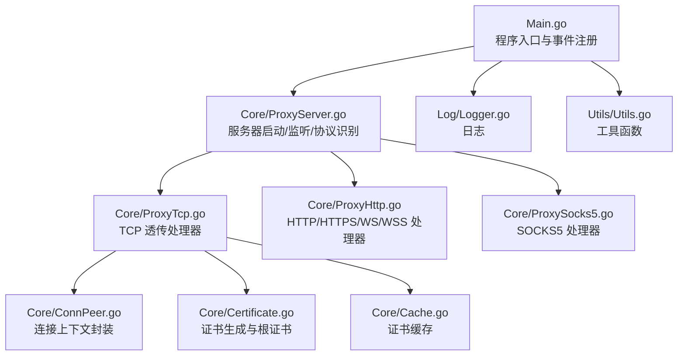
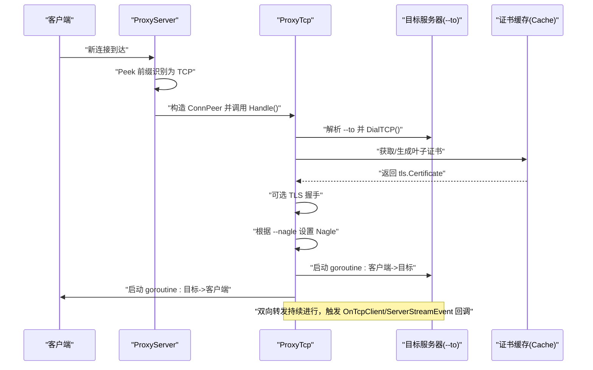
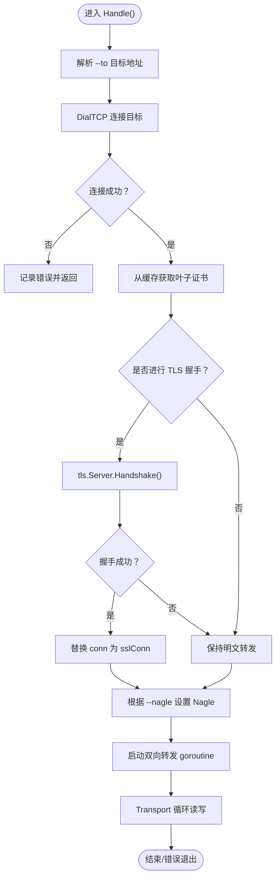
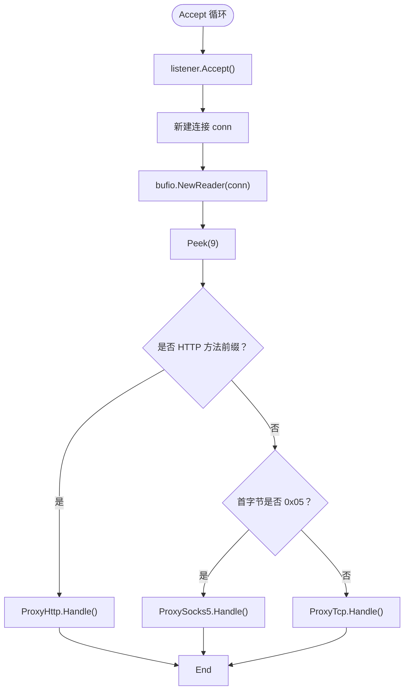
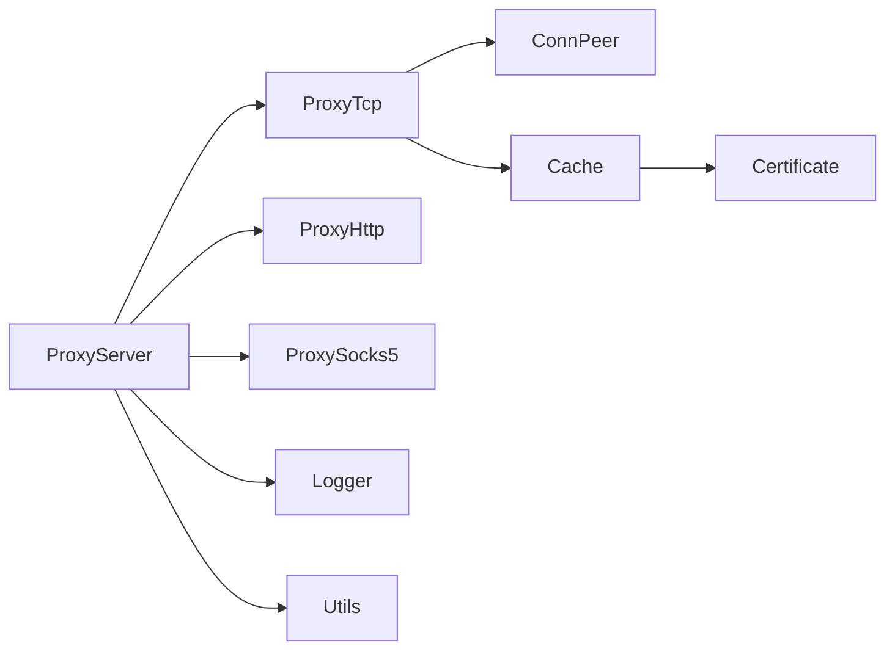

# TCP 透传代理

<cite>
**本文引用的文件**
- [Main.go](file://Main.go)
- [README.md](file://README.md)
- [CODE-DOC.md](file://CODE-DOC.md)
- [Core/ProxyServer.go](file://Core/ProxyServer.go)
- [Core/ProxyTcp.go](file://Core/ProxyTcp.go)
- [Core/ConnPeer.go](file://Core/ConnPeer.go)
- [Core/Certificate.go](file://Core/Certificate.go)
- [Core/Cache.go](file://Core/Cache.go)
- [Contract/IServerProcesser.go](file://Contract/IServerProcesser.go)
- [Log/Logger.go](file://Log/Logger.go)
- [Utils/Utils.go](file://Utils/Utils.go)
</cite>

## 目录
1. [简介](#简介)
2. [项目结构](#项目结构)
3. [核心组件](#核心组件)
4. [架构总览](#架构总览)
5. [详细组件分析](#详细组件分析)
6. [依赖关系分析](#依赖关系分析)
7. [性能考量](#性能考量)
8. [故障排查指南](#故障排查指南)
9. [结论](#结论)
10. [附录](#附录)

## 简介
本文件面向 TCP 透传代理处理器，系统性阐述其工作原理与实现细节，覆盖原始数据包转发、连接状态维护、流量控制、TLS 包装、粘包处理、缓冲区与内存优化、网络层优化（Nagle 控制、延迟优化）、以及防火墙穿透、端口映射与动态目标支持等主题。文档同时给出性能监控指标建议、故障排除方法与安全注意事项，帮助读者在生产环境中稳定、高效地使用该代理能力。

## 项目结构
该项目采用“入口程序 + 核心代理 + 协议处理器 + 证书与缓存 + 日志与工具”的分层组织方式。TCP 透传代理位于核心模块中，作为统一入口识别协议后分发至对应处理器。



图表来源
- [Main.go:24-124](file://Main.go#L24-L124)
- [Core/ProxyServer.go:176-203](file://Core/ProxyServer.go#L176-L203)
- [Core/ProxyTcp.go:15-66](file://Core/ProxyTcp.go#L15-L66)
- [Core/ConnPeer.go:8-13](file://Core/ConnPeer.go#L8-L13)
- [Core/Certificate.go:35-67](file://Core/Certificate.go#L35-L67)
- [Core/Cache.go:39-78](file://Core/Cache.go#L39-L78)
- [Log/Logger.go:17-19](file://Log/Logger.go#L17-L19)
- [Utils/Utils.go:13-61](file://Utils/Utils.go#L13-L61)

章节来源
- [Main.go:24-124](file://Main.go#L24-L124)
- [Core/ProxyServer.go:176-203](file://Core/ProxyServer.go#L176-L203)
- [Core/ProxyTcp.go:15-66](file://Core/ProxyTcp.go#L15-L66)
- [Core/ConnPeer.go:8-13](file://Core/ConnPeer.go#L8-L13)
- [Core/Certificate.go:35-67](file://Core/Certificate.go#L35-L67)
- [Core/Cache.go:39-78](file://Core/Cache.go#L39-L78)
- [Log/Logger.go:17-19](file://Log/Logger.go#L17-L19)
- [Utils/Utils.go:13-61](file://Utils/Utils.go#L13-L61)

## 核心组件
- 服务器核心（ProxyServer）：负责监听、多 Accept 并发、协议识别与分发、事件回调注册与触发。
- TCP 透传处理器（ProxyTcp）：针对纯 TCP 流量进行目标解析、可选 TLS 包装、双向转发与回调。
- 连接上下文（ConnPeer）：封装客户端连接、读写缓冲与服务器引用，供各处理器复用。
- 证书系统（Certificate + Cache）：根证书初始化、叶子证书动态生成与并发缓存。
- 日志与工具：标准日志输出、文件存在性检测、可用端口探测等辅助能力。

章节来源
- [Core/ProxyServer.go:48-66](file://Core/ProxyServer.go#L48-L66)
- [Core/ProxyTcp.go:15-66](file://Core/ProxyTcp.go#L15-L66)
- [Core/ConnPeer.go:8-13](file://Core/ConnPeer.go#L8-L13)
- [Core/Certificate.go:35-67](file://Core/Certificate.go#L35-L67)
- [Core/Cache.go:39-78](file://Core/Cache.go#L39-L78)
- [Log/Logger.go:17-19](file://Log/Logger.go#L17-L19)
- [Utils/Utils.go:13-61](file://Utils/Utils.go#L13-L61)

## 架构总览
TCP 透传代理在统一入口识别协议后，将纯 TCP 连接交由 ProxyTcp 处理。其核心流程包括：解析目标地址、建立到目标的 TCP 连接、可选 TLS 握手（中间人包装）、设置 Nagle 算法、启动双向转发 goroutine，并在转发过程中触发 TCP 客户端/服务端流事件回调。



图表来源
- [Core/ProxyServer.go:176-203](file://Core/ProxyServer.go#L176-L203)
- [Core/ProxyTcp.go:23-66](file://Core/ProxyTcp.go#L23-L66)
- [Core/Cache.go:39-78](file://Core/Cache.go#L39-L78)

## 详细组件分析

### TCP 透传处理器（ProxyTcp）
- 结构与职责
  - 继承连接上下文（ConnPeer），持有目标连接与目标端口信息。
  - 提供 Handle() 与 Transport() 两个关键方法，分别完成握手/转发与循环读写。
- 处理流程
  - 目标解析：使用 --to 参数解析目标地址。
  - 连接建立：通过 net.DialTCP 建立到目标的 TCP 连接。
  - TLS 包装：从缓存获取叶子证书，创建 tls.Server 并执行握手；握手成功后替换连接为 SSL 连接。
  - Nagle 控制：根据 --nagle 参数设置 TCP NoDelay（注意：--nagle=true 实际上是禁用 Nagle，即低延迟模式）。
  - 双向转发：启动两个 goroutine，分别处理客户端到目标与目标到客户端的数据流。
- 事件回调
  - OnTcpClientStreamEvent：客户端->服务端方向的数据回调。
  - OnTcpServerStreamEvent：服务端->客户端方向的数据回调。
- 错误处理
  - 目标解析失败、连接失败、握手失败、读写异常均会记录日志并终止转发。



图表来源
- [Core/ProxyTcp.go:23-112](file://Core/ProxyTcp.go#L23-L112)

章节来源
- [Core/ProxyTcp.go:15-112](file://Core/ProxyTcp.go#L15-L112)
- [Core/ProxyServer.go:62-65](file://Core/ProxyServer.go#L62-L65)

### 服务器核心（ProxyServer）
- 监听与并发
  - 多 Accept 并发：启动 5 个 goroutine 调用 Accept，提升高并发下的连接接收能力。
  - 单端口多网卡：支持 --port 逗号分隔多端口，配合 --network 为每个端口绑定不同出口网卡。
- 协议识别
  - Peek 前缀匹配：读取最多 9 字节，判断是否为 HTTP 方法前缀或 SOCKS5 版本，否则视为 TCP。
- 事件回调
  - 提供 TCP 连接/关闭、HTTP 请求/响应、WS 请求/响应、SOCKS5 请求/响应、TCP 客户端/服务端流事件回调注册点。
- DNS 缓存
  - 使用 viki-org/dnscache，TTL 5 分钟，降低重复解析成本。



图表来源
- [Core/ProxyServer.go:156-203](file://Core/ProxyServer.go#L156-L203)

章节来源
- [Core/ProxyServer.go:156-203](file://Core/ProxyServer.go#L156-L203)
- [Core/ProxyServer.go:48-66](file://Core/ProxyServer.go#L48-L66)

### 证书系统与 TLS 包装
- 根证书初始化
  - 若 ./cert.crt 不存在则生成根证书与私钥文件；若存在则直接读取解析。
- 叶子证书生成
  - 按目标主机名动态生成以目标域名为 CN 的子证书，支持 DNS 或 IP SAN。
- 证书缓存
  - 同域名并发仅生成一次，使用 WaitGroup 等待复用；不同域名互不阻塞。
- TLS 握手
  - 代理侧使用生成的叶子证书对客户端进行 TLS 握手，成功后替换连接为 SSL 连接，继续转发。

```mermaid
classDiagram
class Certificate {
+RootKey
+RootCa
+Init() error
+GeneratePem(host) ([]byte, []byte, error)
+GenerateRootPemFile(host) (*pem.Block, *pem.Block, error)
+GenerateKeyPair() (*rsa.PrivateKey, error)
}
class Storage {
+mapping map[string]*action
+GetCertificate(hostname, port) (interface{}, error)
}
class action {
+wg *sync.WaitGroup
+fn func() (interface{}, error)
+cert interface{}
+forget bool
+err error
}
Storage --> action : "并发控制"
Certificate --> Storage : "生成叶子证书"
```

图表来源
- [Core/Certificate.go:35-187](file://Core/Certificate.go#L35-L187)
- [Core/Cache.go:39-78](file://Core/Cache.go#L39-L78)

章节来源
- [Core/Certificate.go:35-187](file://Core/Certificate.go#L35-L187)
- [Core/Cache.go:39-78](file://Core/Cache.go#L39-L78)

### 事件回调与数据流
- 回调类型
  - TCP 连接/关闭、HTTP 请求/响应、WS 请求/响应、SOCKS5 请求/响应、TCP 客户端/服务端流事件。
- 回调语义
  - 回调返回值决定是否继续默认转发/写回；resolve 函数用于完成默认行为或自定义修改。
- 数据流
  - TCP 透传中，每次读取缓冲区数据后，按方向触发相应回调，再写入目标连接并校验写入长度。

章节来源
- [Core/ProxyServer.go:22-65](file://Core/ProxyServer.go#L22-L65)
- [Core/ProxyTcp.go:68-112](file://Core/ProxyTcp.go#L68-L112)

## 依赖关系分析
- 组件耦合
  - ProxyTcp 依赖 ConnPeer（嵌入式继承）、Cache（证书缓存）、Certificate（根证书）、日志与工具。
  - ProxyServer 作为调度者，依赖各协议处理器接口（IServerProcesser）与回调类型。
- 外部依赖
  - crypto/tls、crypto/x509、net/http、bufio、viki-org/dnscache 等标准库与第三方库。
- 潜在风险
  - 证书缓存无淘汰策略，长期运行可能累积大量证书对象；可通过外部重启或扩展缓存策略缓解。
  - Nagle 控制与 --nagle 的语义需明确，避免误解导致延迟/吞吐权衡偏差。



图表来源
- [Core/ProxyServer.go:176-203](file://Core/ProxyServer.go#L176-L203)
- [Core/ProxyTcp.go:15-66](file://Core/ProxyTcp.go#L15-L66)
- [Core/ConnPeer.go:8-13](file://Core/ConnPeer.go#L8-L13)
- [Core/Cache.go:39-78](file://Core/Cache.go#L39-L78)
- [Core/Certificate.go:35-67](file://Core/Certificate.go#L35-L67)
- [Log/Logger.go:17-19](file://Log/Logger.go#L17-L19)
- [Utils/Utils.go:13-61](file://Utils/Utils.go#L13-L61)

章节来源
- [Core/ProxyServer.go:176-203](file://Core/ProxyServer.go#L176-L203)
- [Core/ProxyTcp.go:15-66](file://Core/ProxyTcp.go#L15-L66)
- [Core/ConnPeer.go:8-13](file://Core/ConnPeer.go#L8-L13)
- [Core/Cache.go:39-78](file://Core/Cache.go#L39-L78)
- [Core/Certificate.go:35-67](file://Core/Certificate.go#L35-L67)
- [Log/Logger.go:17-19](file://Log/Logger.go#L17-L19)
- [Utils/Utils.go:13-61](file://Utils/Utils.go#L13-L61)

## 性能考量
- 缓冲区与粘包处理
  - 使用固定大小缓冲区（默认 4KB）进行循环读写，适合大多数 TCP 流量；对于长连接、小包密集场景可考虑动态调整缓冲大小。
  - 粘包处理：当前实现按读取到的缓冲长度写入目标连接，未显式拆分应用层边界；如需严格按帧处理，应在回调中自行实现应用层协议解析。
- 内存优化
  - 复用缓冲区与切片，避免频繁分配；注意在回调中谨慎复制大块数据。
  - 证书缓存无淘汰，建议结合业务场景评估重启周期或引入 LRU 等策略。
- 网络层优化
  - Nagle 算法：--nagle=true 实际上禁用 Nagle（低延迟模式），适合交互类应用；若追求吞吐，可设为 false。
  - TCP 参数：可在 DialTCP 前设置更细粒度的 TCP 选项（如 TCP_NODELAY、TCP_QUICKACK 等），当前实现主要通过 SetNoDelay 控制。
  - DNS 缓存：5 分钟 TTL 平衡准确性与性能，可根据目标域名变化频率调整。
- 并发与吞吐
  - 多 Accept 并发（5 个 goroutine）提升连接接收能力；每个连接独立 goroutine 处理，避免阻塞。
  - 多端口多网卡：通过 --port 与 --network 组合实现流量分流与出口绑定。

章节来源
- [Core/ProxyTcp.go:68-112](file://Core/ProxyTcp.go#L68-L112)
- [Core/ProxyServer.go:156-174](file://Core/ProxyServer.go#L156-L174)
- [Core/Cache.go:39-78](file://Core/Cache.go#L39-L78)

## 故障排查指南
- 常见问题定位
  - 目标解析失败：检查 --to 参数格式与可达性。
  - 连接失败：查看日志中的错误信息，确认网络连通与端口开放。
  - TLS 握手失败：确认客户端已安装根证书（./cert.crt），或在握手失败时利用工具函数读取最近一次 TLS 输入帧辅助诊断。
  - 回调异常：检查回调返回值与 resolve 调用是否正确，避免重复写回或遗漏写回。
- 日志与调试
  - 使用日志模块输出错误与关键事件，便于定位问题。
  - 工具函数可用于检测端口可用性与文件存在性，辅助环境准备。
- 安全注意事项
  - 仅在受控环境下启用 TLS 中间人，避免对不受信任的站点进行解密。
  - 根证书文件需妥善保管，避免泄露导致中间人攻击风险。
  - 回调中禁止执行不受信任的输入处理，防止注入与越权。

章节来源
- [Core/ProxyTcp.go:23-66](file://Core/ProxyTcp.go#L23-L66)
- [Core/ProxyServer.go:176-203](file://Core/ProxyServer.go#L176-L203)
- [Log/Logger.go:17-19](file://Log/Logger.go#L17-L19)
- [Utils/Utils.go:13-61](file://Utils/Utils.go#L13-L61)

## 结论
TCP 透传代理通过统一入口与清晰的处理器分层，实现了对纯 TCP 流量的高效转发与可选 TLS 包装。其并发模型、DNS 缓存与证书缓存设计提升了整体性能与可用性。结合回调机制，用户可在转发过程中进行拦截与修改。建议在生产环境中关注 Nagle 策略、缓冲区大小与证书缓存策略，并加强安全与可观测性建设。

## 附录

### 命令行参数与使用
- --port：监听端口，支持逗号分隔多端口。
- --to：TCP 透传目标地址（仅 TCP 生效）。
- --proxy：上级代理地址。
- --nagle：是否启用 Nagle（注意：true 实际上是禁用 Nagle，即低延迟模式）。
- --network：出口网卡 IP，与 --port 数量一致。

章节来源
- [README.md:148-163](file://README.md#L148-L163)
- [CODE-DOC.md:564-580](file://CODE-DOC.md#L564-L580)