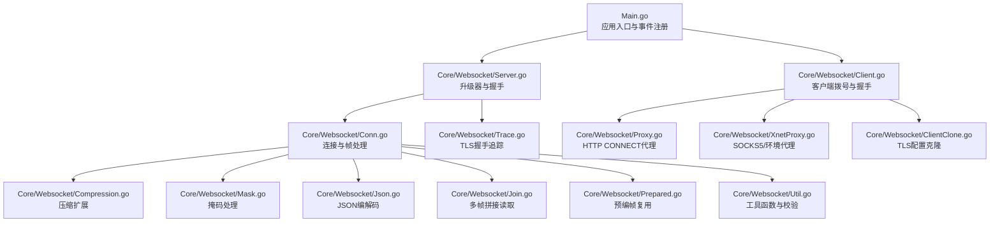
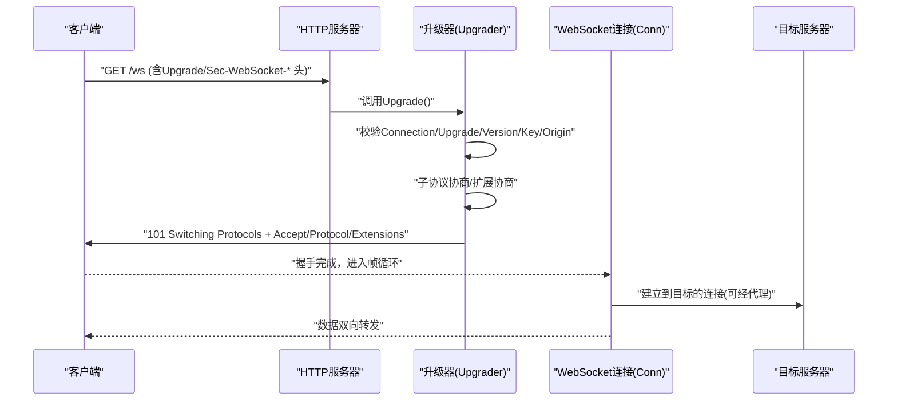
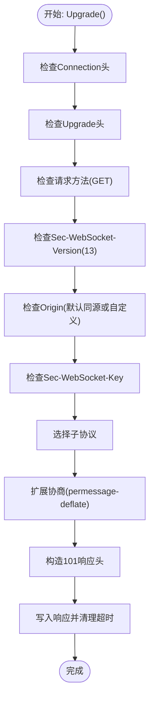
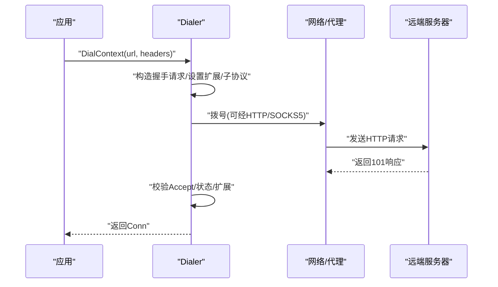
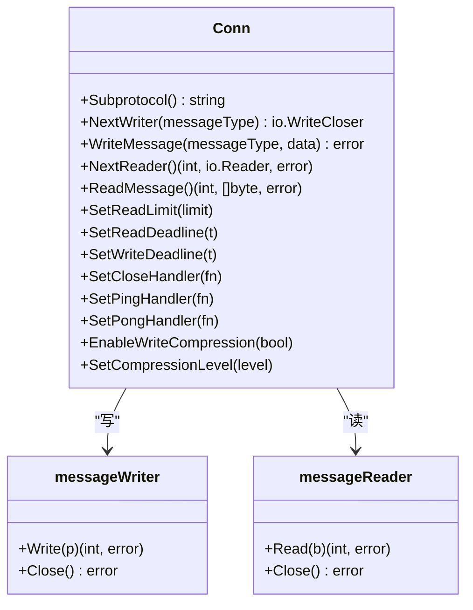
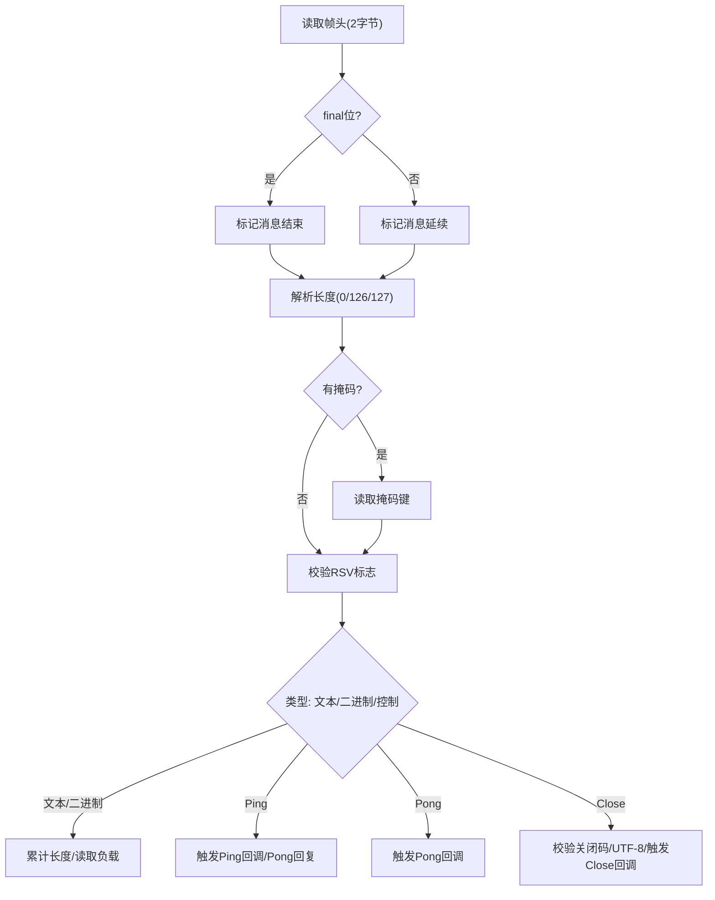
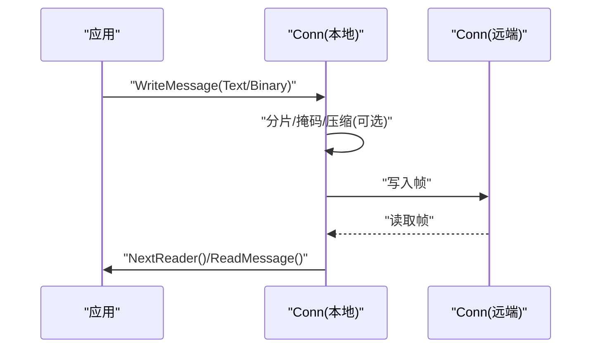
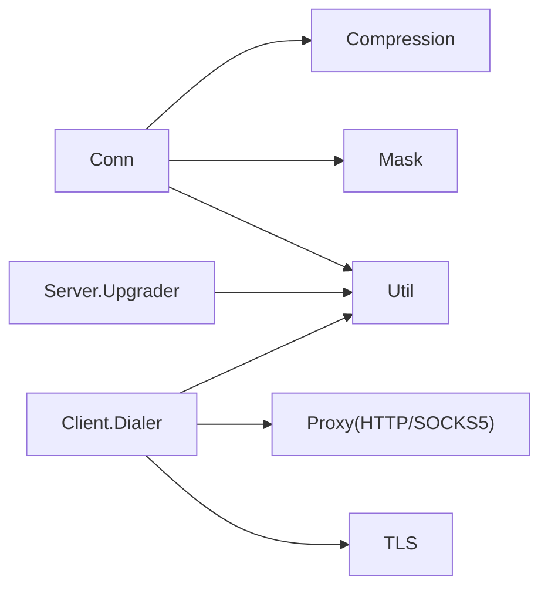

# WebSocket 代理

<cite>
**本文引用的文件**
- [Main.go](file://Main.go)
- [Proxy.go](file://Core/Websocket/Proxy.go)
- [Server.go](file://Core/Websocket/Server.go)
- [Conn.go](file://Core/Websocket/Conn.go)
- [Join.go](file://Core/Websocket/Join.go)
- [Json.go](file://Core/Websocket/Json.go)
- [Compression.go](file://Core/Websocket/Compression.go)
- [Mask.go](file://Core/Websocket/Mask.go)
- [Util.go](file://Core/Websocket/Util.go)
- [Trace.go](file://Core/Websocket/Trace.go)
- [Client.go](file://Core/Websocket/Client.go)
- [ClientClone.go](file://Core/Websocket/ClientClone.go)
- [Prepared.go](file://Core/Websocket/Prepared.go)
- [XnetProxy.go](file://Core/Websocket/XnetProxy.go)
</cite>

## 目录
1. [简介](#简介)
2. [项目结构](#项目结构)
3. [核心组件](#核心组件)
4. [架构总览](#架构总览)
5. [详细组件分析](#详细组件分析)
6. [依赖分析](#依赖分析)
7. [性能考量](#性能考量)
8. [故障排查指南](#故障排查指南)
9. [结论](#结论)
10. [附录](#附录)

## 简介
本文件面向 WebSocket 代理场景，系统性梳理代码库中 WebSocket 协议升级、握手完成、双向桥接、帧级处理、压缩扩展、子协议协商、认证与代理集成、性能优化与调试等关键能力。文档以“从入口到细节”的方式组织，既适合快速上手，也便于深入研究实现。

## 项目结构
本仓库采用按功能域分层的组织方式：顶层入口负责启动与事件注册；核心模块位于 Core 下，其中 Websocket 子目录集中实现 WebSocket 协议栈与代理能力；日志与工具位于 Log、Utils 等目录；Main.go 提供示例事件钩子，展示如何接入 HTTP/WS/TCP/SOCKS5 的抓包与重写。

**图表来源**
- [Main.go:1-124](file://Main.go#L1-L124)
- [Server.go:1-368](file://Core/Websocket/Server.go#L1-L368)
- [Client.go:1-396](file://Core/Websocket/Client.go#L1-L396)
- [Conn.go:1-1202](file://Core/Websocket/Conn.go#L1-L1202)
- [Compression.go:1-149](file://Core/Websocket/Compression.go#L1-L149)
- [Mask.go:1-55](file://Core/Websocket/Mask.go#L1-L55)
- [Json.go:1-61](file://Core/Websocket/Json.go#L1-L61)
- [Join.go:1-43](file://Core/Websocket/Join.go#L1-L43)
- [Prepared.go:1-103](file://Core/Websocket/Prepared.go#L1-L103)
- [Proxy.go:1-78](file://Core/Websocket/Proxy.go#L1-L78)
- [XnetProxy.go:1-474](file://Core/Websocket/XnetProxy.go#L1-L474)
- [Util.go:1-284](file://Core/Websocket/Util.go#L1-L284)
- [ClientClone.go:1-17](file://Core/Websocket/ClientClone.go#L1-L17)
- [Trace.go:1-20](file://Core/Websocket/Trace.go#L1-L20)

**章节来源**
- [Main.go:1-124](file://Main.go#L1-L124)

## 核心组件
- 升级器与握手
  - 服务端升级器负责校验请求头、选择子协议、协商扩展、生成 101 响应并完成握手。
  - 客户端拨号器负责构造握手请求、处理握手响应、协商扩展与压缩。
- 连接与帧处理
  - 统一的 Conn 抽象封装读写、掩码、压缩、控制帧处理、消息边界与错误语义。
- 代理与网络
  - 支持 HTTP CONNECT 代理与 SOCKS5 代理，兼容环境变量代理配置。
- 编解码与桥接
  - JSON 编解码辅助、多帧拼接读取、预编帧复用以提升吞吐。
- 工具与追踪
  - 握手校验、掩码加速、TLS 握手追踪、压缩池化。

**章节来源**
- [Server.go:25-267](file://Core/Websocket/Server.go#L25-L267)
- [Client.go:50-383](file://Core/Websocket/Client.go#L50-L383)
- [Conn.go:240-323](file://Core/Websocket/Conn.go#L240-L323)
- [Proxy.go:23-77](file://Core/Websocket/Proxy.go#L23-L77)
- [XnetProxy.go:160-238](file://Core/Websocket/XnetProxy.go#L160-L238)
- [Json.go:12-60](file://Core/Websocket/Json.go#L12-L60)
- [Join.go:12-42](file://Core/Websocket/Join.go#L12-L42)
- [Prepared.go:14-94](file://Core/Websocket/Prepared.go#L14-L94)
- [Compression.go:15-54](file://Core/Websocket/Compression.go#L15-L54)
- [Mask.go:11-54](file://Core/Websocket/Mask.go#L11-L54)
- [Util.go:17-283](file://Core/Websocket/Util.go#L17-L283)
- [Trace.go:10-19](file://Core/Websocket/Trace.go#L10-L19)

## 架构总览
WebSocket 代理的关键流程分为两类：
- 服务端代理：监听 HTTP，识别 WebSocket 升级请求，完成握手后建立双向桥接。
- 客户端代理：作为客户端发起 WebSocket 连接，支持通过 HTTP/SOCKS5 代理访问远端。

**图表来源**
- [Server.go:124-267](file://Core/Websocket/Server.go#L124-L267)
- [Client.go:149-383](file://Core/Websocket/Client.go#L149-L383)
- [Proxy.go:34-77](file://Core/Websocket/Proxy.go#L34-L77)
- [XnetProxy.go:214-238](file://Core/Websocket/XnetProxy.go#L214-L238)

## 详细组件分析

### 升级器与握手（服务端）
- 校验要点
  - Connection 必须包含 upgrade；Upgrade 必须为 websocket；方法必须是 GET；版本必须为 13；Origin 检查默认安全策略或自定义回调。
  - 检测扩展头是否被应用层注入（不支持），避免响应拆分风险。
- 子协议协商
  - 依据客户端请求与服务端配置，返回首个匹配的子协议。
- 扩展协商
  - 当启用压缩时，若客户端请求 permessage-deflate，服务端接受并设置 no context takeover。
- 握手响应
  - 计算 Accept 值、写入协议/扩展/自定义头部，清除超时限制，完成切换。

**图表来源**
- [Server.go:124-267](file://Core/Websocket/Server.go#L124-L267)
- [Util.go:19-24](file://Core/Websocket/Util.go#L19-L24)

**章节来源**
- [Server.go:25-267](file://Core/Websocket/Server.go#L25-L267)
- [Util.go:17-284](file://Core/Websocket/Util.go#L17-L284)

### 升级器与握手（客户端）
- 请求构建
  - 设置 Upgrade/Connection/Sec-WebSocket-Key/Version/Protocol/Extensions 等头部。
  - 支持 Cookie、子协议、压缩扩展、代理、TLS 配置。
- 握手验证
  - 校验 101 状态、Upgrade/Connection、Accept 值一致性。
- 扩展确认
  - 若协商 permessage-deflate，则要求 no context takeover 并启用压缩写/读器。
- 生命周期
  - 清除握手超时，返回已就绪的 Conn。

**图表来源**
- [Client.go:149-383](file://Core/Websocket/Client.go#L149-L383)
- [XnetProxy.go:214-238](file://Core/Websocket/XnetProxy.go#L214-L238)
- [Proxy.go:34-77](file://Core/Websocket/Proxy.go#L34-L77)

**章节来源**
- [Client.go:50-383](file://Core/Websocket/Client.go#L50-L383)
- [XnetProxy.go:160-238](file://Core/Websocket/XnetProxy.go#L160-L238)
- [Proxy.go:23-77](file://Core/Websocket/Proxy.go#L23-L77)
- [ClientClone.go:11-16](file://Core/Websocket/ClientClone.go#L11-L16)
- [Trace.go:10-19](file://Core/Websocket/Trace.go#L10-L19)

### 连接与帧处理（Conn）
- 结构与职责
  - 封装底层连接、读写缓冲、压缩写/读器、掩码、控制帧处理回调、读写超时与错误。
- 写路径
  - NextWriter/WriteMessage/WritePreparedMessage；支持压缩、掩码、分片帧、控制帧（Ping/Pong/Close）。
- 读路径
  - NextReader/ReadMessage；解析帧头、长度、掩码、RSV 标志；处理控制帧并触发回调；按消息边界返回 Reader。
- 错误与关闭
  - 关闭码与文本校验、异常关闭处理、读写超时与临时错误包装。

**图表来源**
- [Conn.go:240-323](file://Core/Websocket/Conn.go#L240-L323)
- [Conn.go:525-725](file://Core/Websocket/Conn.go#L525-L725)
- [Conn.go:959-1058](file://Core/Websocket/Conn.go#L959-L1058)

**章节来源**
- [Conn.go:240-323](file://Core/Websocket/Conn.go#L240-L323)
- [Conn.go:358-465](file://Core/Websocket/Conn.go#L358-L465)
- [Conn.go:467-523](file://Core/Websocket/Conn.go#L467-L523)
- [Conn.go:547-634](file://Core/Websocket/Conn.go#L547-L634)
- [Conn.go:785-952](file://Core/Websocket/Conn.go#L785-L952)
- [Conn.go:959-1058](file://Core/Websocket/Conn.go#L959-L1058)
- [Conn.go:1087-1161](file://Core/Websocket/Conn.go#L1087-L1161)

### 帧级处理逻辑
- 文本帧/二进制帧
  - 解析首尾标志、长度字段（0-125/126/127）、掩码键；按消息边界聚合；支持压缩读取。
- 控制帧（Ping/Pong/Close）
  - 校验长度与最终标志；Ping 默认回送 Pong；Close 触发关闭流程并返回 CloseError。
- 掩码与加速
  - 掩码字节逐字节或按机器字对齐加速处理；掩码位置游标维护。
- 读写边界
  - 分片帧按 final 标志合并；写入时根据缓冲区大小自动切片。

**图表来源**
- [Conn.go:803-952](file://Core/Websocket/Conn.go#L803-L952)
- [Mask.go:13-54](file://Core/Websocket/Mask.go#L13-L54)

**章节来源**
- [Conn.go:803-952](file://Core/Websocket/Conn.go#L803-L952)
- [Mask.go:13-54](file://Core/Websocket/Mask.go#L13-L54)

### 双向桥接机制
- 读写分离
  - 读路径：从底层连接读取帧，解析后通过 messageReader 返回应用；写路径：应用写入 messageWriter，按帧写出。
- 压缩与掩码
  - 读侧按 RSV1 标志启用解压；写侧按 RSV1 标志启用压缩；客户端侧写入时进行掩码。
- 跨进程/跨网络桥接
  - 通过 Conn 与外部目标建立连接，读写循环持续转发，保持消息边界与控制帧语义。

**图表来源**
- [Conn.go:525-725](file://Core/Websocket/Conn.go#L525-L725)
- [Conn.go:959-1058](file://Core/Websocket/Conn.go#L959-L1058)

**章节来源**
- [Conn.go:525-725](file://Core/Websocket/Conn.go#L525-L725)
- [Conn.go:959-1058](file://Core/Websocket/Conn.go#L959-L1058)

### JSON 数据格式处理与消息路由
- JSON 写入
  - 使用 NextWriter(TextMessage) + json.Encoder 写出，再 Close 完成整条消息。
- JSON 读取
  - 使用 NextReader 获取 Reader，json.Decoder 读取单值，EOF 视为意外结束。
- 路由建议
  - 在应用层基于消息类型/业务字段进行路由与重写，结合事件钩子实现。

**章节来源**
- [Json.go:12-60](file://Core/Websocket/Json.go#L12-L60)

### WebSocket 扩展支持、子协议协商与认证
- 子协议
  - 服务端通过 Upgrader.Subprotocols 与客户端请求协商；客户端通过 Dialer.Subprotocols 发起。
- 扩展
  - permessage-deflate（仅 no context takeover）；压缩写/读器按协商启用。
- 认证
  - HTTP 代理支持 Basic 认证头；SOCKS5 支持用户名/密码认证；TLS 握手可校验主机名。

**章节来源**
- [Server.go:48-54](file://Core/Websocket/Server.go#L48-L54)
- [Client.go:89-96](file://Core/Websocket/Client.go#L89-L96)
- [Client.go:227-229](file://Core/Websocket/Client.go#L227-L229)
- [Proxy.go:42-48](file://Core/Websocket/Proxy.go#L42-L48)
- [XnetProxy.go:383-402](file://Core/Websocket/XnetProxy.go#L383-L402)

### 与 HTTP 代理的集成
- HTTP CONNECT 代理
  - 通过 CONNECT 方法建立隧道，发送 Proxy-Authorization（如需），读取 200 响应后继续 WebSocket 握手。
- 环境代理
  - 支持 ALL_PROXY/NO_PROXY 环境变量，自动选择直连或代理；SOCKS5 代理可选用户名/密码。
- 应用集成
  - Main.go 中通过 OnWsRequestEvent/OnWsResponseEvent 对消息进行拦截与重写。

**章节来源**
- [Proxy.go:23-77](file://Core/Websocket/Proxy.go#L23-L77)
- [XnetProxy.go:173-196](file://Core/Websocket/XnetProxy.go#L173-L196)
- [XnetProxy.go:214-238](file://Core/Websocket/XnetProxy.go#L214-L238)
- [Main.go:94-106](file://Main.go#L94-L106)

## 依赖分析
- 组件内聚与耦合
  - Conn 为核心抽象，向上提供 Writer/Reader，向下依赖压缩、掩码、工具函数；与 Dialer/Upgrader 通过握手阶段耦合。
- 外部依赖
  - TLS、flate 压缩、SHA1/基64、HTTP 解析、bufio 缓冲。
- 循环依赖
  - 未见直接循环；压缩池与 Conn 通过接口解耦。

**图表来源**
- [Conn.go:240-323](file://Core/Websocket/Conn.go#L240-L323)
- [Compression.go:15-54](file://Core/Websocket/Compression.go#L15-L54)
- [Mask.go:13-54](file://Core/Websocket/Mask.go#L13-L54)
- [Util.go:19-24](file://Core/Websocket/Util.go#L19-L24)
- [Client.go:50-102](file://Core/Websocket/Client.go#L50-L102)
- [Proxy.go:23-77](file://Core/Websocket/Proxy.go#L23-L77)
- [XnetProxy.go:160-238](file://Core/Websocket/XnetProxy.go#L160-L238)

**章节来源**
- [Conn.go:240-323](file://Core/Websocket/Conn.go#L240-L323)
- [Compression.go:15-54](file://Core/Websocket/Compression.go#L15-L54)
- [Mask.go:13-54](file://Core/Websocket/Mask.go#L13-L54)
- [Util.go:19-24](file://Core/Websocket/Util.go#L19-L24)
- [Client.go:50-102](file://Core/Websocket/Client.go#L50-L102)
- [Proxy.go:23-77](file://Core/Websocket/Proxy.go#L23-L77)
- [XnetProxy.go:160-238](file://Core/Websocket/XnetProxy.go#L160-L238)

## 性能考量
- 缓冲与池化
  - 读写缓冲大小可配置；WriteBufferPool 复用写缓冲；压缩写/读器使用 sync.Pool。
- 写放大与分片
  - 大消息直接绕过缓冲一次性写出；分片帧按最大帧头+缓冲大小切分。
- 掩码加速
  - 按机器字对齐批量异或，减少循环次数。
- 压缩策略
  - permessage-deflate（no context takeover）降低带宽，但增加 CPU；可根据消息类型与大小权衡。
- 读写并发
  - 写通道使用互斥保护，避免并发写；读侧按帧流式处理，避免阻塞。

**章节来源**
- [Conn.go:378-402](file://Core/Websocket/Conn.go#L378-L402)
- [Conn.go:655-675](file://Core/Websocket/Conn.go#L655-L675)
- [Mask.go:13-54](file://Core/Websocket/Mask.go#L13-L54)
- [Compression.go:22-54](file://Core/Websocket/Compression.go#L22-L54)
- [Prepared.go:14-94](file://Core/Websocket/Prepared.go#L14-L94)

## 故障排查指南
- 握手失败
  - 检查 Connection/Upgrade/Version/Key/Origin 是否满足要求；确认 101 响应头与 Accept 值；查看自定义错误回调输出。
- 控制帧异常
  - Ping/Pong/Close 长度与 final 标志必须正确；非法关闭码/非 UTF-8 文本会触发协议错误并发送 Close。
- 读写超时
  - 设置 SetReadDeadline/SetWriteDeadline；临时错误会被包装为非临时错误以便区分。
- 代理问题
  - HTTP CONNECT 代理需正确设置 Proxy-Authorization；SOCKS5 需正确用户名/密码；环境变量 NO_PROXY 生效范围。
- TLS 问题
  - 主机名校验失败或握手错误；可通过 TLS 配置调整；使用 Trace 进行握手阶段观测。

**章节来源**
- [Server.go:76-85](file://Core/Websocket/Server.go#L76-L85)
- [Conn.go:954-957](file://Core/Websocket/Conn.go#L954-L957)
- [Client.go:350-361](file://Core/Websocket/Client.go#L350-L361)
- [Proxy.go:41-76](file://Core/Websocket/Proxy.go#L41-L76)
- [XnetProxy.go:344-473](file://Core/Websocket/XnetProxy.go#L344-L473)
- [Trace.go:10-19](file://Core/Websocket/Trace.go#L10-L19)

## 结论
该 WebSocket 代理实现以 Conn 为核心，围绕握手、帧处理、压缩与代理展开，具备良好的扩展性与性能特性。通过事件钩子与 JSON 辅助，可在不侵入核心逻辑的前提下实现消息路由与重写。生产部署建议关注握手校验、压缩策略、代理配置与 TLS 校验，并结合日志与 Trace 进行可观测性建设。

## 附录
- 入口与事件钩子
  - Main.go 展示了 HTTP/WS/TCP/SOCKS5 的事件注册方式，可用于抓包、修改与重放。
- 预编帧复用
  - PreparedMessage 适用于广播场景，减少重复压缩与序列化成本。

**章节来源**
- [Main.go:94-106](file://Main.go#L94-L106)
- [Prepared.go:14-94](file://Core/Websocket/Prepared.go#L14-L94)