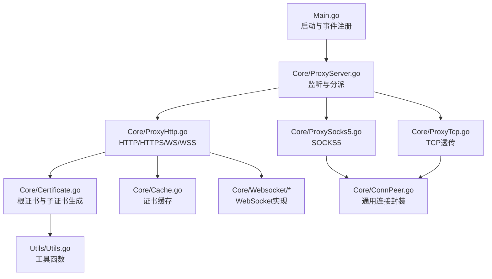
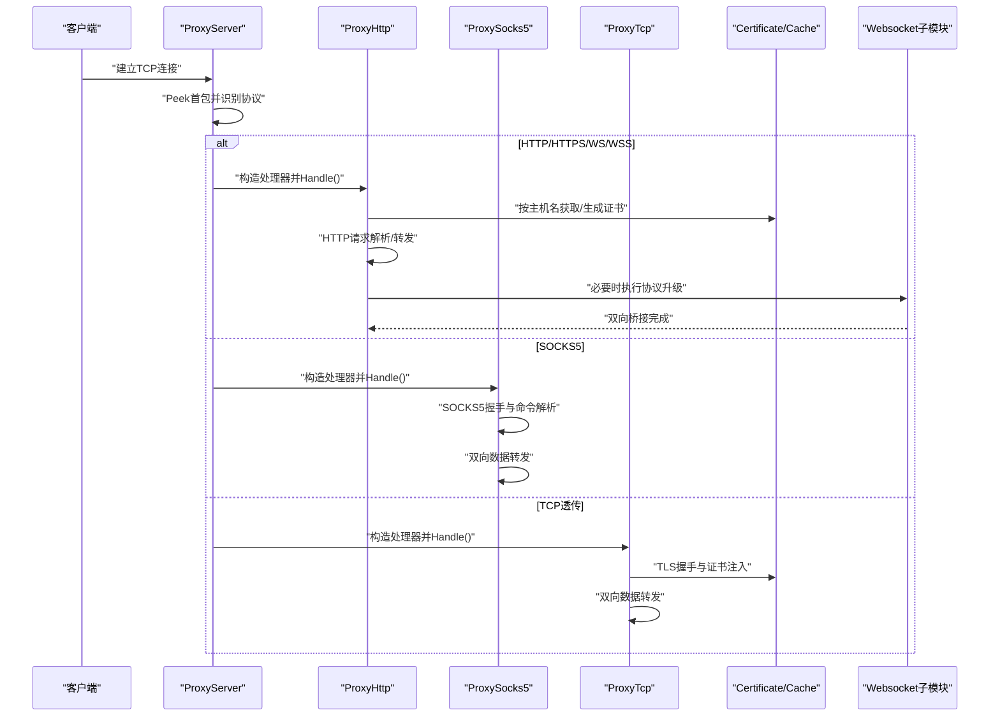
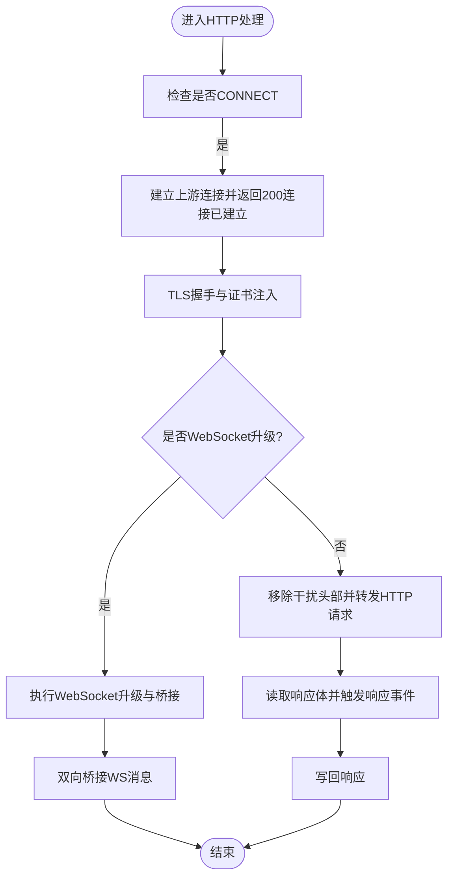
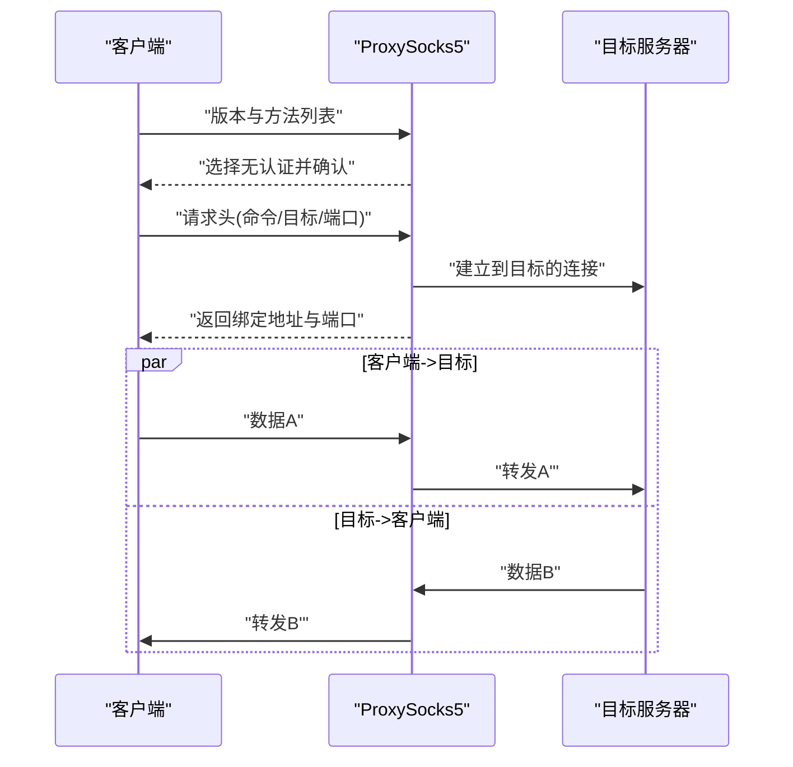
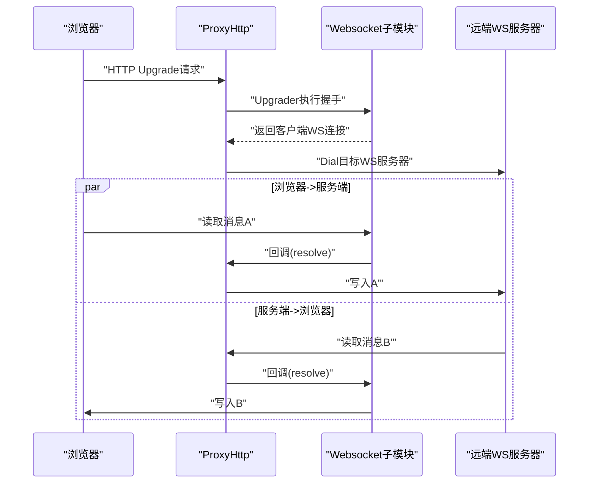
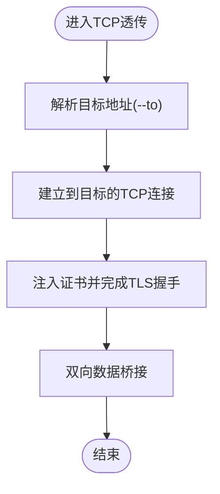
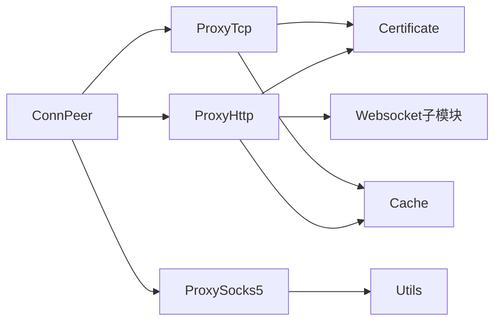

# 协议处理器

<cite>
**本文引用的文件**
- [Main.go](file://Main.go)
- [ProxyServer.go](file://Core/ProxyServer.go)
- [ProxyHttp.go](file://Core/ProxyHttp.go)
- [ProxySocks5.go](file://Core/ProxySocks5.go)
- [ProxyTcp.go](file://Core/ProxyTcp.go)
- [Certificate.go](file://Core/Certificate.go)
- [Cache.go](file://Core/Cache.go)
- [ConnPeer.go](file://Core/ConnPeer.go)
- [Websocket/Proxy.go](file://Core/Websocket/Proxy.go)
- [Websocket/Conn.go](file://Core/Websocket/Conn.go)
- [Websocket/Join.go](file://Core/Websocket/Join.go)
- [Websocket/Util.go](file://Core/Websocket/Util.go)
- [Utils.go](file://Utils/Utils.go)
- [README.md](file://README.md)
</cite>

## 目录
1. [简介](#简介)
2. [项目结构](#项目结构)
3. [核心组件](#核心组件)
4. [架构总览](#架构总览)
5. [详细组件分析](#详细组件分析)
6. [依赖分析](#依赖分析)
7. [性能考虑](#性能考虑)
8. [故障排查指南](#故障排查指南)
9. [结论](#结论)
10. [附录](#附录)

## 简介
本文件面向 shermie-proxy 的协议处理器，系统性梳理其支持的代理协议与实现机制，包括：
- HTTP/HTTPS 代理：中间人攻击（MITM）实现、证书管理、请求/响应拦截与处理
- SOCKS5：完整握手流程、命令解析、连接建立与双向数据转发
- WebSocket：协议升级、双向桥接、帧级处理与压缩扩展
- TCP 透传：基于 TLS 的双向桥接与数据转发

文档覆盖状态管理、错误处理、性能优化、配置项与最佳实践，并提供关键流程的时序图与数据流图。

## 项目结构
项目采用按功能域分层的组织方式，核心逻辑集中在 Core 目录，协议处理通过统一入口自动识别并分派至对应处理器。



**图表来源**
- [Main.go:24-124](file://Main.go#L24-L124)
- [ProxyServer.go:176-213](file://Core/ProxyServer.go#L176-L213)
- [ProxyHttp.go:29-64](file://Core/ProxyHttp.go#L29-L64)
- [ProxySocks5.go:15-52](file://Core/ProxySocks5.go#L15-L52)
- [ProxyTcp.go:15-22](file://Core/ProxyTcp.go#L15-L22)
- [Certificate.go:20-32](file://Core/Certificate.go#L20-L32)
- [Cache.go:20-30](file://Core/Cache.go#L20-L30)
- [ConnPeer.go:8-13](file://Core/ConnPeer.go#L8-L13)

**章节来源**
- [Main.go:24-124](file://Main.go#L24-L124)
- [ProxyServer.go:176-213](file://Core/ProxyServer.go#L176-L213)

## 核心组件
- 统一入口与分派：根据首包内容判断协议类型，自动选择 HTTP/HTTPS/WS/WSS、SOCKS5 或 TCP 透传处理器
- 证书体系：根证书生成与持久化、按主机名动态签发子证书、TLS 握手与 MITM
- 事件钩子：支持在请求/响应、WS、SOCKS5、TCP 流量中进行拦截与自定义修改
- 网络适配：DNS 缓存、可选上层代理、网卡绑定、Nagle 算法开关

**章节来源**
- [ProxyServer.go:48-66](file://Core/ProxyServer.go#L48-L66)
- [ProxyServer.go:176-213](file://Core/ProxyServer.go#L176-L213)
- [Certificate.go:34-67](file://Core/Certificate.go#L34-L67)
- [Cache.go:39-78](file://Core/Cache.go#L39-L78)

## 架构总览
下图展示从监听到协议处理的整体流程，以及证书与 WebSocket 子模块的集成点。



**图表来源**
- [ProxyServer.go:176-213](file://Core/ProxyServer.go#L176-L213)
- [ProxyHttp.go:44-64](file://Core/ProxyHttp.go#L44-L64)
- [ProxySocks5.go:54-240](file://Core/ProxySocks5.go#L54-L240)
- [ProxyTcp.go:23-66](file://Core/ProxyTcp.go#L23-L66)
- [Certificate.go:69-116](file://Core/Certificate.go#L69-L116)
- [Cache.go:39-78](file://Core/Cache.go#L39-L78)

## 详细组件分析

### HTTP/HTTPS 代理（含 MITM 与证书管理）
- 协议识别：通过首包前缀判断是否为 HTTP 方法或 CONNECT
- CONNECT 处理：建立到上游的 TCP/TLS 连接，返回“连接已建立”，随后进行 TLS 握手与 MITM
- 请求/响应拦截：读取请求体与响应体，支持事件回调进行修改后回写
- 头部清理：移除 Keep-Alive、Transfer-Encoding、Connection 等可能影响代理行为的头部
- 证书管理：按 Host:Port 生成子证书，缓存复用，避免重复生成
- WebSocket 升级：若检测到 Upgrade 或 Connection: Upgrade，则进入 WebSocket 双向桥接



**图表来源**
- [ProxyHttp.go:44-64](file://Core/ProxyHttp.go#L44-L64)
- [ProxyHttp.go:206-231](file://Core/ProxyHttp.go#L206-L231)
- [ProxyHttp.go:242-286](file://Core/ProxyHttp.go#L242-L286)
- [ProxyHttp.go:288-434](file://Core/ProxyHttp.go#L288-L434)
- [ProxyHttp.go:134-154](file://Core/ProxyHttp.go#L134-L154)
- [ProxyHttp.go:156-180](file://Core/ProxyHttp.go#L156-L180)

**章节来源**
- [ProxyHttp.go:44-132](file://Core/ProxyHttp.go#L44-L132)
- [ProxyHttp.go:134-203](file://Core/ProxyHttp.go#L134-L203)
- [ProxyHttp.go:205-286](file://Core/ProxyHttp.go#L205-L286)
- [ProxyHttp.go:288-434](file://Core/ProxyHttp.go#L288-L434)

### 证书与缓存（MITM 关键）
- 根证书：首次运行自动生成并持久化，后续直接加载
- 子证书：按主机名并发安全地生成，使用共享缓存避免重复
- TLS 握手：服务端侧注入证书，客户端透明完成握手

```mermaid
classDiagram
class Certificate {
+RootKey
+RootCa
+RootCaStr
+RootKeyStr
+Init() error
+GeneratePem(host) ([]byte, []byte, error)
+GenerateRootPemFile(host) (*pem.Block, *pem.Block, error)
}
class Storage {
+mapping map[string]*action
+GetCertificate(hostname,port) (interface{}, error)
}
class action {
+wg *sync.WaitGroup
+fn func() (interface{}, error)
+cert interface{}
+err error
}
Storage --> Certificate : "调用生成子证书"
Storage --> action : "并发控制"
```

**图表来源**
- [Certificate.go:20-67](file://Core/Certificate.go#L20-L67)
- [Certificate.go:69-116](file://Core/Certificate.go#L69-L116)
- [Cache.go:20-78](file://Core/Cache.go#L20-L78)

**章节来源**
- [Certificate.go:34-67](file://Core/Certificate.go#L34-L67)
- [Certificate.go:69-116](file://Core/Certificate.go#L69-L116)
- [Cache.go:39-78](file://Core/Cache.go#L39-L78)

### SOCKS5 协议（握手与数据转发）
- 版本与认证：读取版本号与方法列表，默认无需认证
- 命令解析：支持 CONNECT/BIND/UDP，解析目标地址类型（IPv4/IPv6/域名）
- 连接建立：按目标地址建立 TCP/UDP 连接，返回本地绑定地址
- 数据转发：双通道 goroutine 实现客户端与目标之间的双向转发，支持事件回调修改



**图表来源**
- [ProxySocks5.go:54-240](file://Core/ProxySocks5.go#L54-L240)
- [ProxySocks5.go:242-284](file://Core/ProxySocks5.go#L242-L284)

**章节来源**
- [ProxySocks5.go:54-240](file://Core/ProxySocks5.go#L54-L240)
- [ProxySocks5.go:242-284](file://Core/ProxySocks5.go#L242-L284)

### WebSocket 代理（升级、桥接与帧处理）
- 协议升级：基于标准 Upgrader 完成握手，支持子协议
- 双向桥接：客户端与服务端分别维护独立连接，两端消息互转
- 帧处理：底层基于 WebSocket 子模块实现，支持文本/二进制帧、控制帧、掩码与压缩
- 事件回调：可在消息读取/写入前后进行拦截与修改



**图表来源**
- [ProxyHttp.go:288-434](file://Core/ProxyHttp.go#L288-L434)
- [Websocket/Proxy.go:23-77](file://Core/Websocket/Proxy.go#L23-L77)
- [Websocket/Conn.go:240-323](file://Core/Websocket/Conn.go#L240-L323)

**章节来源**
- [ProxyHttp.go:288-434](file://Core/ProxyHttp.go#L288-L434)
- [Websocket/Proxy.go:23-77](file://Core/Websocket/Proxy.go#L23-L77)
- [Websocket/Conn.go:240-323](file://Core/Websocket/Conn.go#L240-L323)

### TCP 透传代理（TLS 桥接与转发）
- 目标解析：解析 --to 参数为目标地址
- TLS 握手：注入证书完成服务端 TLS 握手，确保客户端透明
- 双向转发：客户端与目标之间双向转发，支持事件回调修改



**图表来源**
- [ProxyTcp.go:23-66](file://Core/ProxyTcp.go#L23-L66)
- [ProxyTcp.go:68-111](file://Core/ProxyTcp.go#L68-L111)

**章节来源**
- [ProxyTcp.go:23-66](file://Core/ProxyTcp.go#L23-L66)
- [ProxyTcp.go:68-111](file://Core/ProxyTcp.go#L68-L111)

## 依赖分析
- 组件耦合：各协议处理器均依赖统一的 ConnPeer 封装，持有连接、读写器与服务器上下文
- 外部依赖：HTTP 传输、DNS 缓存、WebSocket 子模块、系统工具函数
- 并发模型：每个连接独立 goroutine 处理，协议内部多路复用 goroutine 实现双向转发



**图表来源**
- [ConnPeer.go:8-13](file://Core/ConnPeer.go#L8-L13)
- [ProxyHttp.go:29-37](file://Core/ProxyHttp.go#L29-L37)
- [ProxySocks5.go:15-19](file://Core/ProxySocks5.go#L15-L19)
- [ProxyTcp.go:15-19](file://Core/ProxyTcp.go#L15-L19)
- [Certificate.go:20-32](file://Core/Certificate.go#L20-L32)
- [Cache.go:20-30](file://Core/Cache.go#L20-L30)
- [Utils.go:13-22](file://Utils/Utils.go#L13-L22)

**章节来源**
- [ConnPeer.go:8-13](file://Core/ConnPeer.go#L8-L13)
- [ProxyHttp.go:29-37](file://Core/ProxyHttp.go#L29-L37)
- [ProxySocks5.go:15-19](file://Core/ProxySocks5.go#L15-L19)
- [ProxyTcp.go:15-19](file://Core/ProxyTcp.go#L15-L19)

## 性能考虑
- Nagle 算法：可通过命令行参数控制，建议在高延迟网络开启以减少小包
- DNS 缓存：内置 5 分钟 TTL，降低解析抖动与延迟
- 证书缓存：并发安全的子证书生成与缓存，避免重复签名开销
- 传输层优化：HTTP 传输禁用 Keep-Alive，减少半开连接；WebSocket 使用缓冲区与压缩扩展
- 并发模型：每连接独立 goroutine，避免阻塞其他连接

**章节来源**
- [ProxyServer.go:68-76](file://Core/ProxyServer.go#L68-L76)
- [ProxyHttp.go:183-203](file://Core/ProxyHttp.go#L183-L203)
- [Cache.go:39-78](file://Core/Cache.go#L39-L78)
- [Websocket/Conn.go:31-82](file://Core/Websocket/Conn.go#L31-L82)

## 故障排查指南
- 证书问题
  - 根证书缺失：首次运行会自动生成并保存；如需手动获取，可访问内置路径接口
  - MITM 失败：检查证书生成与缓存逻辑，确认主机名解析与握手超时
- HTTP/HTTPS
  - 请求无法转发：检查头部清理逻辑与上层代理配置
  - 响应解压：注意 gzip 响应体的读取与解压
- SOCKS5
  - 握手失败：核对版本号、方法列表与目标地址类型
  - 连接异常：关注错误码与返回的绑定地址
- WebSocket
  - 升级失败：确认 Upgrade/Connection 头与握手参数
  - 掩码与帧处理：底层实现已处理掩码与帧边界，如遇异常优先检查事件回调
- TCP 透传
  - TLS 握手失败：确认目标证书与客户端信任链
  - 双向转发：关注事件回调返回值与写入长度一致性

**章节来源**
- [Certificate.go:34-67](file://Core/Certificate.go#L34-L67)
- [ProxyHttp.go:134-154](file://Core/ProxyHttp.go#L134-L154)
- [ProxySocks5.go:54-240](file://Core/ProxySocks5.go#L54-L240)
- [Websocket/Conn.go:148-173](file://Core/Websocket/Conn.go#L148-L173)
- [ProxyTcp.go:23-66](file://Core/ProxyTcp.go#L23-L66)

## 结论
sheremie-proxy 通过统一入口与清晰的协议分派，实现了对 HTTP/HTTPS/WS/WSS、SOCKS5 与 TCP 透传的全面支持。其核心优势在于：
- 一体化协议识别与分派
- 完备的证书体系与 MITM 能力
- 丰富的事件钩子便于流量拦截与修改
- 良好的并发与性能特性

建议在生产环境中结合 DNS 缓存、证书缓存与 Nagle 策略进行调优，并通过事件回调实现业务定制。

## 附录

### 配置项与参数
- --port：监听端口（可同时监听多个端口）
- --nagle：是否启用 Nagle 算法（默认启用）
- --proxy：上层 TCP 代理地址
- --to：TCP 透传目标地址（仅 TCP 透传有效）
- --network：强制绑定网卡地址（与端口一一对应）

**章节来源**
- [Main.go:25-30](file://Main.go#L25-L30)
- [README.md:148-163](file://README.md#L148-L163)

### 事件回调一览
- HTTP 请求/响应事件：支持修改请求体与响应体
- SOCKS5 请求/响应事件：支持修改任意方向流量
- WebSocket 请求/响应事件：按消息类型回调
- TCP 客户端/服务端流事件：支持修改任意方向流量

**章节来源**
- [Main.go:61-120](file://Main.go#L61-L120)
- [ProxyServer.go:56-65](file://Core/ProxyServer.go#L56-L65)