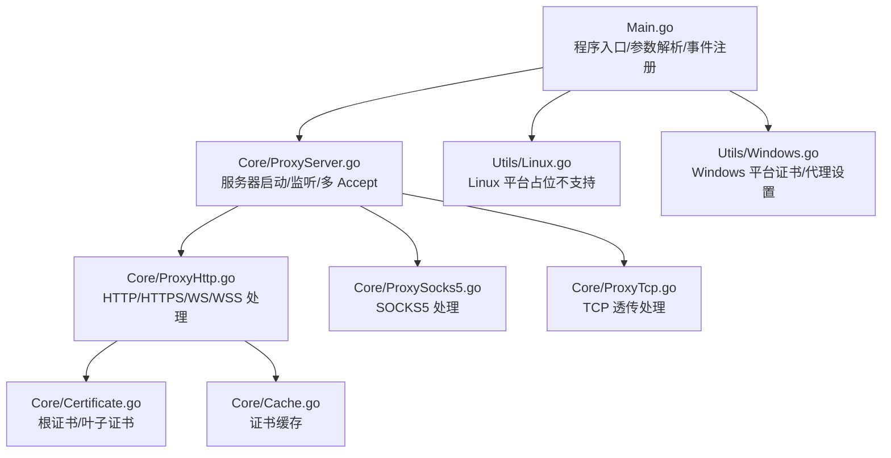
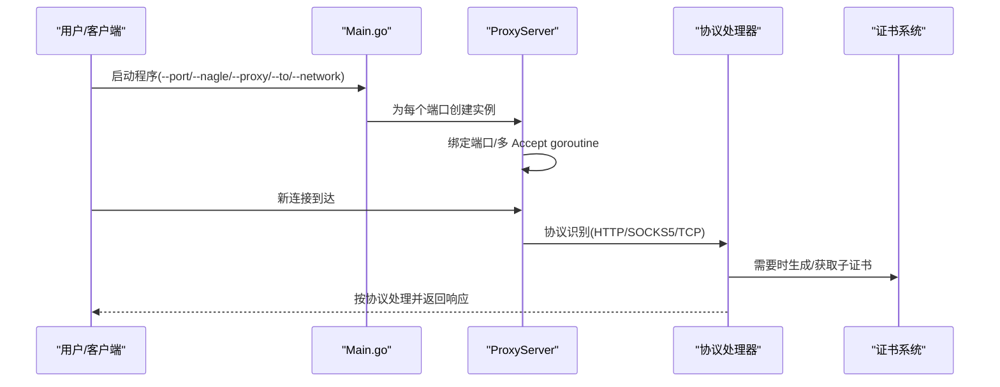
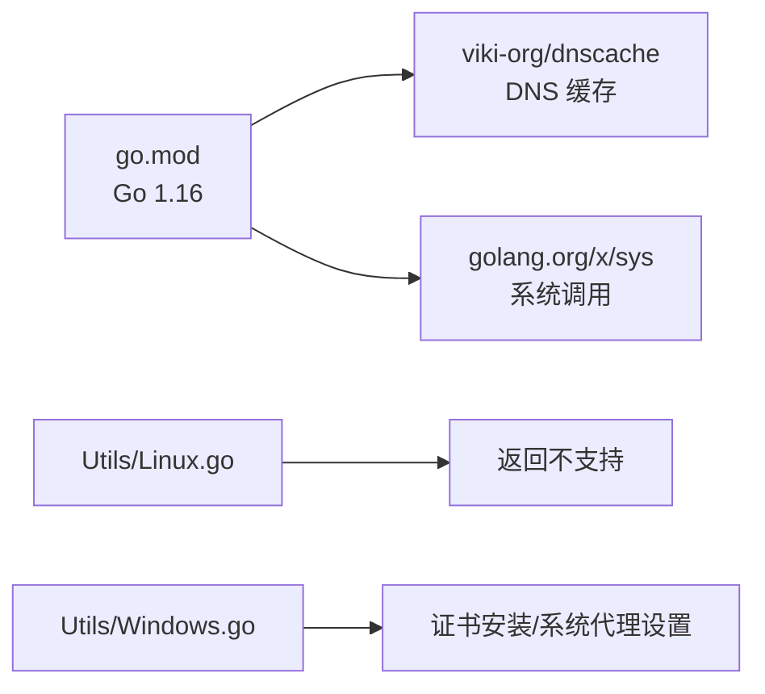

# Linux 平台

<cite>
**本文引用的文件**
- [Main.go](file://Main.go)
- [CODE-DOC.md](file://CODE-DOC.md)
- [README.md](file://README.md)
- [README-CN.md](file://README-CN.md)
- [Utils/Linux.go](file://Utils/Linux.go)
- [Utils/Windows.go](file://Utils/Windows.go)
- [Core/ProxyServer.go](file://Core/ProxyServer.go)
- [Core/ProxyHttp.go](file://Core/ProxyHttp.go)
- [Core/ProxySocks5.go](file://Core/ProxySocks5.go)
- [Core/ProxyTcp.go](file://Core/ProxyTcp.go)
- [Core/Cache.go](file://Core/Cache.go)
- [Core/Certificate.go](file://Core/Certificate.go)
- [go.mod](file://go.mod)
- [.gitignore](file://.gitignore)
</cite>

## 目录
1. [简介](#简介)
2. [项目结构](#项目结构)
3. [核心组件](#核心组件)
4. [架构总览](#架构总览)
5. [详细组件分析](#详细组件分析)
6. [依赖分析](#依赖分析)
7. [性能考虑](#性能考虑)
8. [故障排除指南](#故障排除指南)
9. [结论](#结论)
10. [附录](#附录)

## 简介
本章节面向 Linux 平台，系统性说明 shermie-proxy 在各类 Linux 发行版上的安装、配置与运行方式；解释 Linux 平台的权限与 root 使用场景；给出包管理器安装与依赖配置方法；阐述系统代理设置（环境变量与 systemd 服务）；提供网络接口绑定与防火墙配置；分析性能特征与优化建议，并覆盖 SELinux/AppArmor 安全策略与常见问题排查。

## 项目结构
- 程序入口与 CLI 参数解析位于主程序文件，负责初始化日志与根证书、解析端口/网卡/Nagle/上游代理等参数，并为每个端口启动独立 goroutine。
- 核心代理逻辑位于 Core 目录，按协议拆分处理器（HTTP/HTTPS/WS/WSS、SOCKS5、TCP 透传），统一由服务器入口分发。
- 平台适配位于 Utils 目录，Linux 平台当前仅返回“不支持”提示，Windows 提供证书安装与系统代理设置能力。
- 证书系统与 DNS 缓存位于 Core 目录，支撑 TLS 中间人与高性能拨号。

图表来源
- [Main.go:24-124](file://Main.go#L24-L124)
- [Core/ProxyServer.go:123-174](file://Core/ProxyServer.go#L123-L174)
- [Core/ProxyHttp.go:44-132](file://Core/ProxyHttp.go#L44-L132)
- [Core/ProxySocks5.go:15-52](file://Core/ProxySocks5.go#L15-L52)
- [Core/ProxyTcp.go:342-384](file://Core/ProxyTcp.go#L342-L384)
- [Core/Certificate.go:1-200](file://Core/Certificate.go#L1-L200)
- [Core/Cache.go:1-120](file://Core/Cache.go#L1-L120)
- [Utils/Linux.go:1-17](file://Utils/Linux.go#L1-L17)
- [Utils/Windows.go:18-50](file://Utils/Windows.go#L18-L50)

章节来源
- [Main.go:24-124](file://Main.go#L24-L124)
- [CODE-DOC.md:30-79](file://CODE-DOC.md#L30-L79)

## 核心组件
- 服务器启动与监听：解析端口、绑定地址、多 goroutine 并发 Accept，每个连接独立处理。
- 协议识别与分发：根据连接首字节识别 HTTP/CONNECT/WS 或 SOCKS5/TCP。
- 事件回调：支持 HTTP 请求/响应、WebSocket、SOCKS5、TCP 双向流的拦截与修改。
- 证书系统：根证书生成与缓存、动态子证书、TLS 中间人。
- 平台适配：Linux 当前不支持系统代理与证书安装，Windows 提供相应能力。

章节来源
- [Core/ProxyServer.go:123-174](file://Core/ProxyServer.go#L123-L174)
- [Core/ProxyServer.go:176-200](file://Core/ProxyServer.go#L176-L200)
- [Core/ProxyHttp.go:44-132](file://Core/ProxyHttp.go#L44-L132)
- [Core/ProxyHttp.go:182-200](file://Core/ProxyHttp.go#L182-L200)
- [Core/ProxySocks5.go:285-323](file://Core/ProxySocks5.go#L285-L323)
- [Core/ProxyTcp.go:349-363](file://Core/ProxyTcp.go#L349-L363)
- [Core/Certificate.go:459-472](file://Core/Certificate.go#L459-L472)
- [Core/Cache.go:511-551](file://Core/Cache.go#L511-L551)
- [Utils/Linux.go:8-16](file://Utils/Linux.go#L8-L16)
- [Utils/Windows.go:18-50](file://Utils/Windows.go#L18-L50)

## 架构总览
Shermie-Proxy 在 Linux 上的运行流程如下：主程序解析参数后，为每个端口启动独立的服务器实例；服务器启动监听与多 Accept goroutine；连接到达后按协议识别交由对应处理器；HTTP/HTTPS/WS/WSS 处理器支持 TLS 中间人与回调修改；SOCKS5/TCP 透传处理器负责双向转发；证书系统提供根证书与动态子证书缓存。

图表来源
- [Main.go:48-124](file://Main.go#L48-L124)
- [Core/ProxyServer.go:123-174](file://Core/ProxyServer.go#L123-L174)
- [Core/ProxyServer.go:176-200](file://Core/ProxyServer.go#L176-L200)
- [Core/ProxyHttp.go:182-200](file://Core/ProxyHttp.go#L182-L200)
- [Core/Certificate.go:459-472](file://Core/Certificate.go#L459-L472)

## 详细组件分析

### Linux 平台适配现状
- Linux 平台的证书安装与系统代理设置函数返回“不支持”，因此在 Linux 上需要手动安装根证书并自行配置系统代理。
- Windows 平台提供证书安装与系统代理设置能力，便于自动化配置。

章节来源
- [Utils/Linux.go:8-16](file://Utils/Linux.go#L8-L16)
- [Utils/Windows.go:18-50](file://Utils/Windows.go#L18-L50)
- [Core/ProxyServer.go:79-96](file://Core/ProxyServer.go#L79-L96)

### 服务器启动与多端口/多网卡
- 支持通过逗号分隔的端口参数同时监听多个端口，每个端口独立 goroutine。
- 支持通过网络参数绑定出口网卡 IP，多端口时需与端口数量一致。
- 默认以低延迟模式运行（Nagle 算法关闭），可通过参数调整。

章节来源
- [Main.go:25-46](file://Main.go#L25-L46)
- [Main.go:48-124](file://Main.go#L48-L124)
- [Core/ProxyServer.go:68-77](file://Core/ProxyServer.go#L68-L77)
- [CODE-DOC.md:560-580](file://CODE-DOC.md#L560-L580)

### 协议识别与分发
- 通过窥探连接首字节识别 HTTP 方法前缀或 SOCKS5 版本，未识别则按 TCP 处理。
- HTTP/HTTPS/WS/WSS 处理器支持 CONNECT 隧道、TLS 中间人、回调修改与 WebSocket 双向桥接。

章节来源
- [Core/ProxyServer.go:176-200](file://Core/ProxyServer.go#L176-L200)
- [Core/ProxyHttp.go:44-64](file://Core/ProxyHttp.go#L44-L64)
- [CODE-DOC.md:99-124](file://CODE-DOC.md#L99-L124)

### 证书系统与 TLS 中间人
- 根证书生成与缓存：首次运行生成根证书文件，后续复用。
- 动态子证书：针对目标域名生成叶子证书，支持 SAN 扩展。
- 证书缓存并发控制：同一域名并发等待首个生成结果，不同域名互不阻塞。

章节来源
- [Core/Certificate.go:459-472](file://Core/Certificate.go#L459-L472)
- [Core/Certificate.go:485-510](file://Core/Certificate.go#L485-L510)
- [Core/Cache.go:511-551](file://Core/Cache.go#L511-L551)

### HTTP/HTTPS/WS/WSS 处理细节
- HTTP 请求：读取请求体、触发请求回调、转发至目标、读取响应体、触发响应回调、写回客户端。
- HTTPS CONNECT：建立隧道、中间人 TLS 握手、识别后续 WS 升级或普通 HTTPS。
- WebSocket：升级后双向桥接，支持回调修改消息。

章节来源
- [Core/ProxyHttp.go:67-132](file://Core/ProxyHttp.go#L67-L132)
- [Core/ProxyHttp.go:182-200](file://Core/ProxyHttp.go#L182-L200)
- [Core/ProxyHttp.go:224-234](file://Core/ProxyHttp.go#L224-L234)

### SOCKS5 处理细节
- 握手流程：版本/认证方法协商、命令解析、目标地址解析、连接目标、回复连接结果、双向转发。
- UDP/端口 443 特殊处理：UDP 使用超时拨号，端口 443 使用 TLS 拨号。

章节来源
- [Core/ProxySocks5.go:285-323](file://Core/ProxySocks5.go#L285-L323)

### TCP 透传处理细节
- 解析目标地址（--to）、拨号目标、可选 TLS 握手、设置 Nagle 算法、双向转发。
- 支持回调修改 TCP 流数据。

章节来源
- [Core/ProxyTcp.go:349-363](file://Core/ProxyTcp.go#L349-L363)
- [Core/ProxyTcp.go:365-384](file://Core/ProxyTcp.go#L365-L384)

### 事件回调系统
- 支持 HTTP 请求/响应、WebSocket 请求/响应、SOCKS5 请求/响应、TCP 客户端/服务端流的回调。
- 回调提供 resolve 函数以完成默认行为或自定义修改。

章节来源
- [Main.go:61-120](file://Main.go#L61-L120)
- [CODE-DOC.md:388-451](file://CODE-DOC.md#L388-L451)

## 依赖分析
- 运行时依赖 Go 1.16，使用第三方库进行 DNS 缓存与系统调用。
- Linux 平台不支持系统代理与证书安装，需手动配置。

图表来源
- [go.mod:1-8](file://go.mod#L1-L8)
- [Utils/Linux.go:8-16](file://Utils/Linux.go#L8-L16)
- [Utils/Windows.go:18-50](file://Utils/Windows.go#L18-L50)

章节来源
- [go.mod:1-8](file://go.mod#L1-L8)
- [Utils/Linux.go:8-16](file://Utils/Linux.go#L8-L16)
- [Utils/Windows.go:18-50](file://Utils/Windows.go#L18-L50)

## 性能考虑
- 并发 Accept：服务器启动 5 个 goroutine 并发 Accept，提升高并发下的连接接受吞吐量。
- DNS 缓存：5 分钟 TTL 的 DNS 缓存减少重复解析开销。
- Nagle 算法：默认以低延迟模式运行（禁用 Nagle），可通过参数调整。
- 证书缓存：同一域名并发等待首个生成结果，避免重复的 RSA 密钥生成开销。

章节来源
- [Core/ProxyServer.go:156-174](file://Core/ProxyServer.go#L156-L174)
- [Core/ProxyHttp.go:260-271](file://Core/ProxyHttp.go#L260-L271)
- [CODE-DOC.md:704-727](file://CODE-DOC.md#L704-L727)
- [Core/Cache.go:511-551](file://Core/Cache.go#L511-L551)

## 故障排除指南
- 端口占用：使用工具检查端口占用情况，确保监听端口可用。
- 证书问题：Linux 需手动安装根证书；可通过访问内置的根证书下载接口获取证书文件。
- 系统代理：Linux 平台不支持自动系统代理设置，需手动配置环境变量或 systemd 服务。
- SELinux/AppArmor：若遇到策略限制导致连接失败，检查安全策略配置并适当放行。
- 防火墙：确认防火墙规则允许监听端口与上游代理访问。

章节来源
- [.gitignore:6-9](file://.gitignore#L6-L9)
- [Core/ProxyServer.go:79-96](file://Core/ProxyServer.go#L79-L96)
- [Core/ProxyHttp.go:80-94](file://Core/ProxyHttp.go#L80-L94)

## 结论
Shermie-Proxy 在 Linux 平台上提供了强大的多协议代理能力，但由于平台适配限制，需要手动完成证书安装与系统代理配置。通过合理的网络接口绑定、防火墙与安全策略配置，以及性能参数调优，可在生产环境中稳定运行。

## 附录

### Linux 平台安装与运行
- 安装与运行：使用 Go 工具链构建并运行程序，支持多端口与多网卡绑定。
- 证书安装：Linux 平台需手动安装根证书；可通过内置接口下载证书文件。
- 系统代理：Linux 平台不支持自动系统代理设置，需手动配置环境变量或 systemd 服务。

章节来源
- [README.md:32-35](file://README.md#L32-L35)
- [README-CN.md:31-34](file://README-CN.md#L31-L34)
- [Core/ProxyServer.go:79-96](file://Core/ProxyServer.go#L79-L96)
- [Core/ProxyHttp.go:80-94](file://Core/ProxyHttp.go#L80-L94)

### 系统代理设置（Linux）
- 环境变量：在 shell 配置中设置 HTTP/HTTPS 代理，适用于大多数命令行工具与 GUI 应用。
- systemd 服务：通过环境变量文件为服务进程注入代理配置，确保后台服务使用代理。
- 注意：Linux 平台不支持自动系统代理设置，需手动维护。

章节来源
- [CODE-DOC.md:583-602](file://CODE-DOC.md#L583-L602)
- [Utils/Linux.go:8-16](file://Utils/Linux.go#L8-L16)

### 网络接口绑定与防火墙
- 网络接口绑定：通过参数绑定出口网卡 IP，实现多网卡流量分流。
- 防火墙：开放监听端口与上游代理访问，必要时配置 NAT 与路由规则。

章节来源
- [CODE-DOC.md:560-580](file://CODE-DOC.md#L560-L580)
- [Core/ProxyHttp.go:453-456](file://Core/ProxyHttp.go#L453-L456)

### 权限与 root 使用场景
- 监听特权端口（1-1023）需要 root 权限；常规端口可使用非 root 用户运行。
- 证书安装与系统代理设置通常需要管理员权限；Linux 平台需手动完成。

章节来源
- [CODE-DOC.md:583-602](file://CODE-DOC.md#L583-L602)
- [Utils/Linux.go:8-16](file://Utils/Linux.go#L8-L16)

### 发行版特定配置要点
- Ubuntu/Debian：使用 apt 获取依赖，配置 systemd 服务与环境变量。
- CentOS/RHEL：使用 dnf/yum 获取依赖，配置 firewalld 与 SELinux。
- Arch Linux：使用 pacman 获取依赖，配置 iptables 或 firewalld。

章节来源
- [README.md:32-35](file://README.md#L32-L35)
- [README-CN.md:31-34](file://README-CN.md#L31-L34)

### 性能特征与优化建议
- 并发 Accept：保持默认 5 个 goroutine 并发 Accept。
- DNS 缓存：维持 5 分钟 TTL，平衡准确性与性能。
- Nagle 算法：默认低延迟模式，可根据业务需求调整。
- 内核参数与网络栈优化：根据实际负载调整文件描述符、队列长度与缓冲区大小。

章节来源
- [Core/ProxyServer.go:156-174](file://Core/ProxyServer.go#L156-L174)
- [Core/ProxyHttp.go:260-271](file://Core/ProxyHttp.go#L260-L271)
- [CODE-DOC.md:704-727](file://CODE-DOC.md#L704-L727)

### SELinux/AppArmor 安全策略
- SELinux：检查布尔值与策略规则，必要时放行端口与证书访问。
- AppArmor：编辑应用配置文件，允许访问证书文件与网络端口。

章节来源
- [CODE-DOC.md:583-602](file://CODE-DOC.md#L583-L602)
- [Utils/Linux.go:8-16](file://Utils/Linux.go#L8-L16)