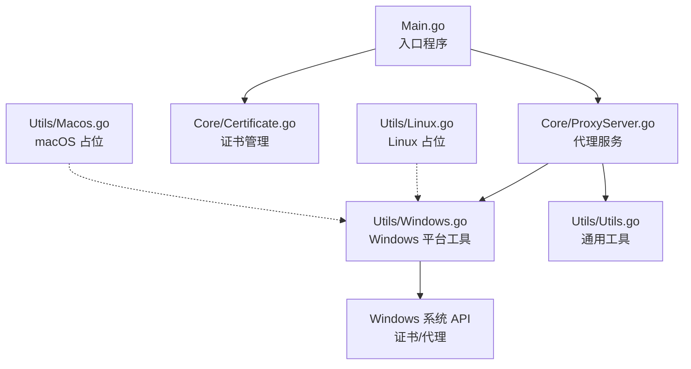
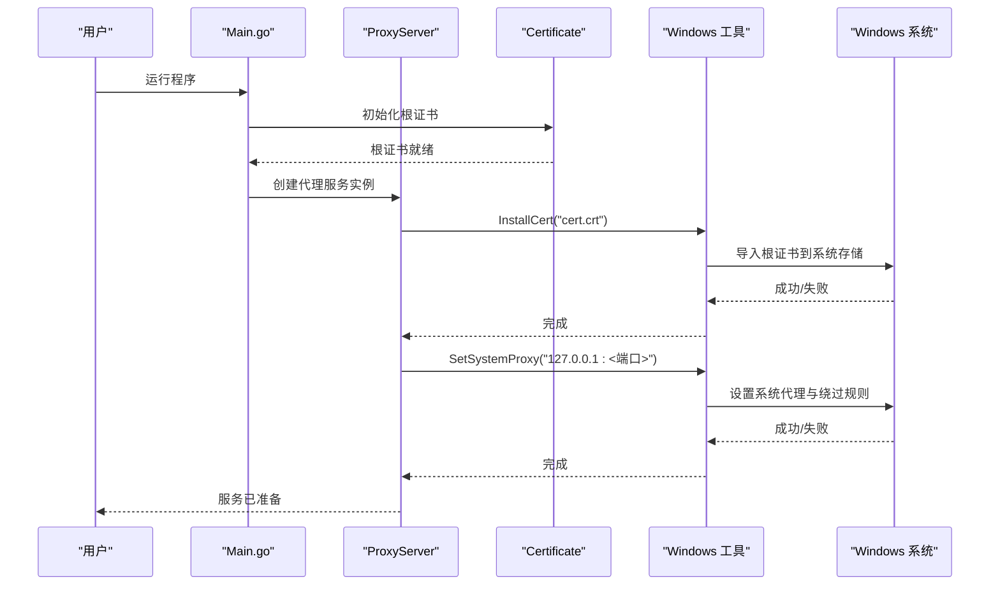
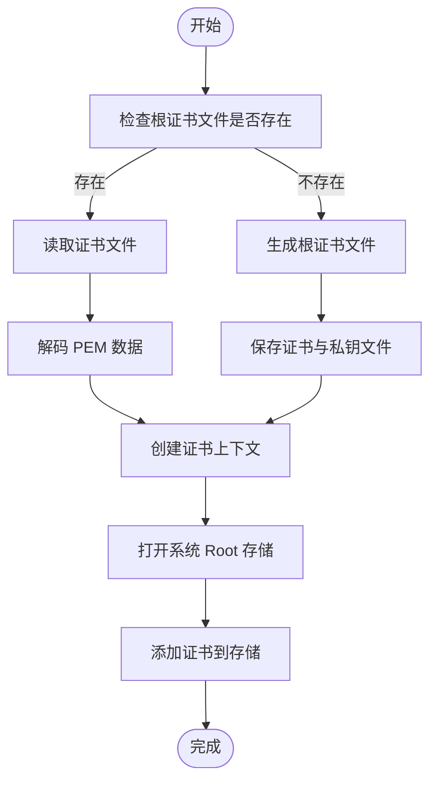
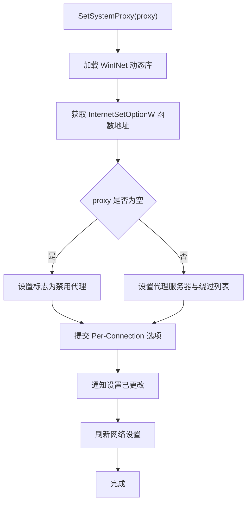
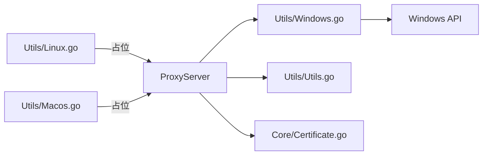

# Windows 平台

<cite>
**本文引用的文件**
- [Main.go](file://Main.go)
- [README-CN.md](file://README-CN.md)
- [README.md](file://README.md)
- [Core/ProxyServer.go](file://Core/ProxyServer.go)
- [Core/Certificate.go](file://Core/Certificate.go)
- [Utils/Windows.go](file://Utils/Windows.go)
- [Utils/Linux.go](file://Utils/Linux.go)
- [Utils/Macos.go](file://Utils/Macos.go)
- [Utils/Utils.go](file://Utils/Utils.go)
</cite>

## 目录
1. [简介](#简介)
2. [项目结构](#项目结构)
3. [核心组件](#核心组件)
4. [架构总览](#架构总览)
5. [组件详解](#组件详解)
6. [依赖关系分析](#依赖关系分析)
7. [性能与优化](#性能与优化)
8. [故障排除指南](#故障排除指南)
9. [结论](#结论)
10. [附录](#附录)

## 简介
本章节面向 Windows 用户，提供 shermie-proxy 在 Windows 平台上的完整安装、配置与运行指南。重点涵盖：
- Windows 平台的证书安装流程（根证书与中间证书的导入）
- Windows 系统代理设置（注册表与系统设置界面）
- Windows 网络接口绑定与权限要求
- Windows 环境变量与系统服务安装建议
- Windows 防火墙、杀毒软件兼容性与 UAC 权限处理
- 性能特征与优化建议（内存与网络 I/O）
- 常见问题排查与兼容性说明

## 项目结构
本项目采用模块化设计，核心逻辑集中在 Core 目录，平台特定实现位于 Utils 目录，入口程序位于根目录。Windows 平台支持通过构建标签与条件编译实现。

图示来源
- [Main.go:1-124](file://Main.go#L1-L124)
- [Core/ProxyServer.go:48-96](file://Core/ProxyServer.go#L48-L96)
- [Core/Certificate.go:1-188](file://Core/Certificate.go#L1-L188)
- [Utils/Windows.go:1-123](file://Utils/Windows.go#L1-L123)
- [Utils/Linux.go:1-17](file://Utils/Linux.go#L1-L17)
- [Utils/Macos.go:1-17](file://Utils/Macos.go#L1-L17)
- [Utils/Utils.go:1-62](file://Utils/Utils.go#L1-L62)

章节来源
- [Main.go:1-124](file://Main.go#L1-L124)
- [README-CN.md:1-167](file://README-CN.md#L1-L167)
- [README.md:1-163](file://README.md#L1-L163)

## 核心组件
- 入口程序：负责解析参数、初始化日志与根证书，并启动代理服务。
- 代理服务：封装监听端口、事件回调、网络接口绑定等能力；在 Windows 上自动安装证书与设置系统代理。
- 证书管理：生成/加载根证书与子证书，用于 HTTPS 拦截与改写。
- Windows 工具：封装证书安装与系统代理设置的 Windows API 调用。
- 通用工具：提供文件存在判断、可用端口探测等通用能力。

章节来源
- [Main.go:13-22](file://Main.go#L13-L22)
- [Core/ProxyServer.go:79-96](file://Core/ProxyServer.go#L79-L96)
- [Core/Certificate.go:34-67](file://Core/Certificate.go#L34-L67)
- [Utils/Windows.go:18-50](file://Utils/Windows.go#L18-L50)
- [Utils/Windows.go:52-122](file://Utils/Windows.go#L52-L122)
- [Utils/Utils.go:13-22](file://Utils/Utils.go#L13-L22)
- [Utils/Utils.go:34-48](file://Utils/Utils.go#L34-L48)

## 架构总览
下图展示 Windows 平台从启动到完成证书安装与系统代理设置的关键流程。

图示来源
- [Main.go:13-22](file://Main.go#L13-L22)
- [Core/ProxyServer.go:79-96](file://Core/ProxyServer.go#L79-L96)
- [Core/Certificate.go:34-67](file://Core/Certificate.go#L34-L67)
- [Utils/Windows.go:18-50](file://Utils/Windows.go#L18-L50)
- [Utils/Windows.go:52-122](file://Utils/Windows.go#L52-L122)

## 组件详解

### Windows 证书安装流程
- 自动安装：在 Windows 平台上，代理服务启动后会尝试读取当前目录下的根证书文件并将其安装到系统的“受信任的根证书颁发机构”存储中。
- 手动安装：若自动安装失败，可在命令行中执行证书安装脚本或通过系统证书管理界面手动导入。
- 中间证书：当需要为特定域名签发子证书时，系统会基于根证书生成并返回 PEM 内容，可按需导入浏览器或系统信任链。

图示来源
- [Core/Certificate.go:34-67](file://Core/Certificate.go#L34-L67)
- [Core/Certificate.go:119-177](file://Core/Certificate.go#L119-L177)
- [Utils/Windows.go:18-50](file://Utils/Windows.go#L18-L50)

章节来源
- [Core/Certificate.go:34-67](file://Core/Certificate.go#L34-L67)
- [Core/Certificate.go:119-177](file://Core/Certificate.go#L119-L177)
- [Utils/Windows.go:18-50](file://Utils/Windows.go#L18-L50)

### Windows 系统代理设置
- 自动设置：在 Windows 平台上，代理服务会通过 WinINet API 设置系统代理为本地回环地址与监听端口，并配置本地与局域网地址绕过规则。
- 手动设置：若自动设置失败，可通过系统设置界面或命令行工具进行配置。

图示来源
- [Utils/Windows.go:52-122](file://Utils/Windows.go#L52-L122)

章节来源
- [Utils/Windows.go:52-122](file://Utils/Windows.go#L52-L122)

### Windows 网络接口绑定与权限要求
- 接口绑定：程序支持通过命令行参数强制绑定到指定网络接口地址，便于多网卡场景选择特定出口。
- 权限要求：设置系统代理与导入证书通常需要管理员权限；否则会触发 UAC 提示或直接失败。

章节来源
- [Main.go:29](file://Main.go#L29)
- [Core/ProxyServer.go:79-96](file://Core/ProxyServer.go#L79-L96)

### Windows 环境变量与系统服务安装
- 环境变量：建议在系统环境变量中配置必要的路径与证书目录，确保程序可访问所需资源。
- 系统服务：可将程序注册为 Windows 服务，以便开机自启与后台运行。注意服务账户权限与证书访问权限。

章节来源
- [README-CN.md:31-34](file://README-CN.md#L31-L34)
- [README.md:32-35](file://README.md#L32-L35)

### Windows 防火墙、杀毒软件兼容性与 UAC 处理
- 防火墙：确保监听端口与回环地址放行，必要时添加例外规则。
- 杀毒软件：部分安全软件可能拦截证书安装或代理设置，建议将程序加入白名单。
- UAC：涉及系统级变更（证书安装、代理设置）时，UAC 会弹窗提示，需以管理员身份确认。

章节来源
- [Utils/Windows.go:18-50](file://Utils/Windows.go#L18-L50)
- [Utils/Windows.go:52-122](file://Utils/Windows.go#L52-L122)

## 依赖关系分析
- 平台特定实现：Windows 工具通过 golang.org/x/sys/windows 调用系统 API；Linux 与 macOS 对应文件返回“不支持”错误，体现条件编译策略。
- 代理服务依赖：在 Windows 上依赖 Utils 的证书安装与代理设置；在其他平台则提示手动操作。
- 通用工具：提供文件存在判断与端口探测等基础能力，被入口与证书模块复用。

图示来源
- [Core/ProxyServer.go:79-96](file://Core/ProxyServer.go#L79-L96)
- [Utils/Windows.go:1-123](file://Utils/Windows.go#L1-L123)
- [Utils/Linux.go:1-17](file://Utils/Linux.go#L1-L17)
- [Utils/Macos.go:1-17](file://Utils/Macos.go#L1-L17)
- [Utils/Utils.go:1-62](file://Utils/Utils.go#L1-L62)

章节来源
- [Core/ProxyServer.go:79-96](file://Core/ProxyServer.go#L79-L96)
- [Utils/Windows.go:1-123](file://Utils/Windows.go#L1-L123)
- [Utils/Linux.go:1-17](file://Utils/Linux.go#L1-L17)
- [Utils/Macos.go:1-17](file://Utils/Macos.go#L1-L17)
- [Utils/Utils.go:1-62](file://Utils/Utils.go#L1-L62)

## 性能与优化
- 内存管理
  - WebSocket 连接内部维护读写缓冲与压缩池，建议根据流量规模调整读写缓冲大小，避免频繁分配与 GC 压力。
  - 证书与 TLS 握手过程中会创建临时对象，建议在高并发场景下复用连接与会话。
- 网络 I/O
  - Nagle 算法可通过参数控制，默认启用有助于减少小包开销，但在低延迟场景可考虑关闭。
  - 多端口/多接口模式下，合理规划端口与接口映射，避免冲突与资源竞争。
- 平台特性
  - Windows 上的 WinINet 代理设置为系统级生效，建议在稳定网络环境下一次性配置，减少频繁刷新带来的抖动。

章节来源
- [Main.go:25-30](file://Main.go#L25-L30)
- [Core/Websocket/Conn.go:296-350](file://Core/Websocket/Conn.go#L296-L350)
- [Core/ProxyServer.go:68-77](file://Core/ProxyServer.go#L68-L77)

## 故障排除指南
- 无法安装证书
  - 确认以管理员身份运行；检查证书文件是否存在且格式正确；查看系统证书存储权限。
- 代理设置失败
  - 检查 WinINet 动态库加载与函数地址获取；确认未被安全软件拦截；尝试手动设置系统代理。
- 端口占用或不可用
  - 使用可用端口探测工具确认端口空闲；避免与系统服务或其他应用冲突。
- 多网卡绑定异常
  - 确认传入的接口地址有效且与网卡匹配；检查路由与防火墙策略。

章节来源
- [Utils/Windows.go:18-50](file://Utils/Windows.go#L18-L50)
- [Utils/Windows.go:52-122](file://Utils/Windows.go#L52-L122)
- [Utils/Utils.go:34-48](file://Utils/Utils.go#L34-L48)
- [Utils/Utils.go:51-61](file://Utils/Utils.go#L51-L61)

## 结论
sheremie-proxy 在 Windows 平台提供了完整的证书安装与系统代理设置自动化能力，结合多端口与多接口绑定，能够满足复杂网络环境下的代理需求。建议在生产环境中配合防火墙与安全软件策略，确保稳定性与安全性。

## 附录

### 常用参数与用法
- 端口：监听端口，默认 9090
- 上级代理：可选，用于转发上游代理
- TCP 目标：仅 TCP 代理时使用
- Nagle：是否启用 Nagle 算法
- 网络接口：强制绑定到指定接口地址

章节来源
- [README-CN.md:145-158](file://README-CN.md#L145-L158)
- [README.md:148-163](file://README.md#L148-L163)
- [Main.go:25-30](file://Main.go#L25-L30)