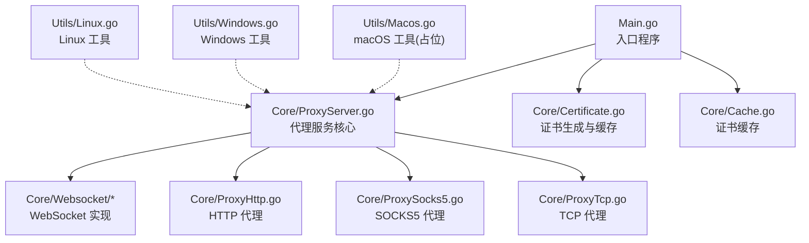
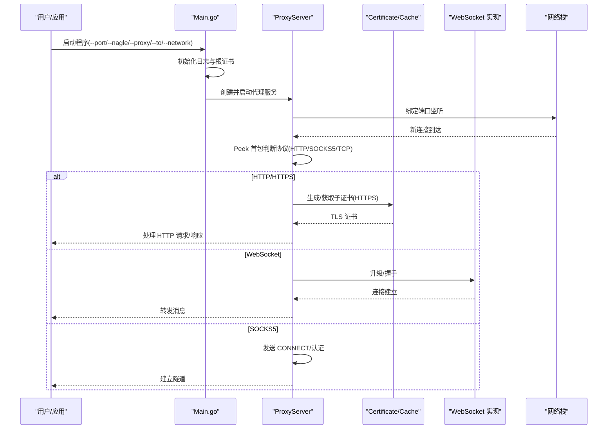
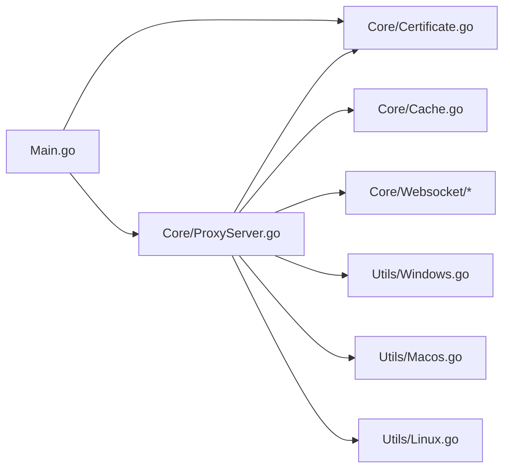

# macOS 平台

<cite>
**本文引用的文件**
- [Main.go](file://Main.go)
- [README.md](file://README.md)
- [README-CN.md](file://README-CN.md)
- [Utils/Macos.go](file://Utils/Macos.go)
- [Utils/Windows.go](file://Utils/Windows.go)
- [Utils/Linux.go](file://Utils/Linux.go)
- [Core/ProxyServer.go](file://Core/ProxyServer.go)
- [Core/Certificate.go](file://Core/Certificate.go)
- [Core/Cache.go](file://Core/Cache.go)
- [Core/Websocket/Client.go](file://Core/Websocket/Client.go)
- [Core/Websocket/XnetProxy.go](file://Core/Websocket/XnetProxy.go)
- [Core/Websocket/Proxy.go](file://Core/Websocket/Proxy.go)
- [Core/Websocket/Server.go](file://Core/Websocket/Server.go)
- [Core/Websocket/Conn.go](file://Core/Websocket/Conn.go)
- [Core/ProxySocks5_test.go](file://Core/ProxySocks5_test.go)
- [Core/Certificate_test.go](file://Core/Certificate_test.go)
- [Core/Cache_test.go](file://Core/Cache_test.go)
</cite>

## 目录
1. [简介](#简介)
2. [项目结构](#项目结构)
3. [核心组件](#核心组件)
4. [架构总览](#架构总览)
5. [详细组件分析](#详细组件分析)
6. [依赖关系分析](#依赖关系分析)
7. [性能考虑](#性能考虑)
8. [故障排除指南](#故障排除指南)
9. [结论](#结论)
10. [附录](#附录)

## 简介
本文件面向 macOS 平台用户，提供 shermie-proxy 的安装、配置与运行指南，并重点说明 macOS 上的证书管理、系统代理设置、沙盒限制、网络接口绑定与权限要求、以及针对 macOS Catalina 及以后版本的隐私权限与 Gatekeeper 设置。由于当前代码库未提供 macOS 原生的证书安装与系统代理设置实现，本文将基于现有代码行为与通用实践，给出可操作的替代方案与最佳实践。

## 项目结构
sheremie-proxy 采用模块化设计，核心逻辑集中在 Core 包中，工具层按平台区分（Windows/Linux/macOS），入口程序负责参数解析与服务启动。

图表来源
- [Main.go:1-124](file://Main.go#L1-L124)
- [Core/ProxyServer.go:1-213](file://Core/ProxyServer.go#L1-L213)
- [Core/Certificate.go:1-188](file://Core/Certificate.go#L1-L188)
- [Core/Cache.go:1-78](file://Core/Cache.go#L1-L78)
- [Utils/Macos.go:1-17](file://Utils/Macos.go#L1-L17)
- [Utils/Windows.go:1-123](file://Utils/Windows.go#L1-L123)
- [Utils/Linux.go:1-17](file://Utils/Linux.go#L1-L17)

章节来源
- [Main.go:1-124](file://Main.go#L1-L124)
- [README.md:1-163](file://README.md#L1-L163)

## 核心组件
- 入口与参数解析：解析端口、Nagle 算法开关、上游代理、目标 TCP 主机、网络接口等参数，支持多端口并发监听。
- 代理服务核心：根据首包识别协议类型（HTTP/CONNECT、SOCKS5、TCP），分派到对应处理器；内置 DNS 缓存与多线程监听。
- 证书系统：自动生成/加载根证书，按需生成子证书用于 HTTPS/TLS 握手；提供证书缓存以减少重复生成。
- 平台工具：Windows 提供证书安装与系统代理设置；Linux/macOS 当前为占位，返回“不支持”错误。

章节来源
- [Main.go:24-46](file://Main.go#L24-L46)
- [Core/ProxyServer.go:48-77](file://Core/ProxyServer.go#L48-L77)
- [Core/ProxyServer.go:123-137](file://Core/ProxyServer.go#L123-L137)
- [Core/Certificate.go:34-67](file://Core/Certificate.go#L34-L67)
- [Core/Cache.go:39-78](file://Core/Cache.go#L39-L78)
- [Utils/Windows.go:18-50](file://Utils/Windows.go#L18-L50)
- [Utils/Macos.go:8-16](file://Utils/Macos.go#L8-L16)
- [Utils/Linux.go:8-16](file://Utils/Linux.go#L8-L16)

## 架构总览
下图展示 macOS 平台下的运行流程：入口程序初始化日志与根证书，启动代理服务；服务根据首包识别协议，分派到相应处理器；HTTPS/TLS 场景通过证书缓存生成子证书完成握手；WebSocket 通过 CONNECT 或直接升级完成握手；SOCKS5 通过代理协议建立隧道。

图表来源
- [Main.go:13-22](file://Main.go#L13-L22)
- [Main.go:48-123](file://Main.go#L48-L123)
- [Core/ProxyServer.go:176-203](file://Core/ProxyServer.go#L176-L203)
- [Core/Certificate.go:69-116](file://Core/Certificate.go#L69-L116)
- [Core/Cache.go:39-78](file://Core/Cache.go#L39-L78)
- [Core/Websocket/Client.go:291-348](file://Core/Websocket/Client.go#L291-L348)
- [Core/Websocket/Proxy.go:50-77](file://Core/Websocket/Proxy.go#L50-L77)

## 详细组件分析

### 入口与参数解析（Main.go）
- 初始化日志与根证书，确保服务启动前具备必要的 TLS 能力。
- 支持多端口监听与网络接口绑定，端口与接口数量需一致。
- 注册各类事件回调（HTTP、WebSocket、SOCKS5、TCP）以便扩展。

章节来源
- [Main.go:13-22](file://Main.go#L13-L22)
- [Main.go:24-46](file://Main.go#L24-L46)
- [Main.go:48-123](file://Main.go#L48-L123)

### 代理服务核心（Core/ProxyServer.go）
- 协议识别：通过首包前缀判断 HTTP 方法或 SOCKS5 版本，否则按 TCP 处理。
- 多线程监听：内部启动多个 goroutine 接受连接，提升并发能力。
- 证书安装与系统代理：仅在 Windows 平台实现自动安装证书与设置系统代理；macOS/Linux 当前为占位，返回“不支持”。

章节来源
- [Core/ProxyServer.go:48-77](file://Core/ProxyServer.go#L48-L77)
- [Core/ProxyServer.go:156-174](file://Core/ProxyServer.go#L156-L174)
- [Core/ProxyServer.go:176-203](file://Core/ProxyServer.go#L176-L203)
- [Core/ProxyServer.go:79-96](file://Core/ProxyServer.go#L79-L96)

### 证书系统（Core/Certificate.go 与 Core/Cache.go）
- 根证书生成与加载：若本地不存在根证书文件，则生成并保存；否则从文件加载。
- 子证书生成：基于根证书为不同主机生成子证书，支持 IP 与 DNS 名称。
- 证书缓存：同一主机并发请求时，仅生成一次证书并复用，避免重复开销。

章节来源
- [Core/Certificate.go:34-67](file://Core/Certificate.go#L34-L67)
- [Core/Certificate.go:119-178](file://Core/Certificate.go#L119-L178)
- [Core/Certificate.go:69-116](file://Core/Certificate.go#L69-L116)
- [Core/Cache.go:39-78](file://Core/Cache.go#L39-L78)

### WebSocket 实现（Core/Websocket/*）
- 客户端握手：支持 HTTPS 场景下的 TLS 握手与 CONNECT 隧道。
- 代理隧道：SOCKS5 代理握手流程，支持认证与目标地址协商。
- 服务器端升级：WebSocket 升级参数与缓冲区配置。

章节来源
- [Core/Websocket/Client.go:291-348](file://Core/Websocket/Client.go#L291-L348)
- [Core/Websocket/XnetProxy.go:323-473](file://Core/Websocket/XnetProxy.go#L323-L473)
- [Core/Websocket/Proxy.go:50-77](file://Core/Websocket/Proxy.go#L50-L77)
- [Core/Websocket/Server.go:27-46](file://Core/Websocket/Server.go#L27-L46)
- [Core/Websocket/Conn.go:21-59](file://Core/Websocket/Conn.go#L21-L59)

### 平台工具（Utils/*）
- Windows：提供证书安装到系统存储与设置系统代理的能力。
- macOS/Linux：当前返回“不支持”错误，需用户手动完成证书安装与系统代理设置。

章节来源
- [Utils/Windows.go:18-50](file://Utils/Windows.go#L18-L50)
- [Utils/Windows.go:52-122](file://Utils/Windows.go#L52-L122)
- [Utils/Macos.go:8-16](file://Utils/Macos.go#L8-L16)
- [Utils/Linux.go:8-16](file://Utils/Linux.go#L8-L16)

## 依赖关系分析

图表来源
- [Main.go:9-11](file://Main.go#L9-L11)
- [Core/ProxyServer.go:13-16](file://Core/ProxyServer.go#L13-L16)
- [Core/Certificate.go:11](file://Core/Certificate.go#L11)
- [Core/Cache.go:4-8](file://Core/Cache.go#L4-L8)
- [Utils/Windows.go:6-14](file://Utils/Windows.go#L6-L14)
- [Utils/Macos.go:6](file://Utils/Macos.go#L6)
- [Utils/Linux.go:6](file://Utils/Linux.go#L6)

章节来源
- [Main.go:9-11](file://Main.go#L9-L11)
- [Core/ProxyServer.go:13-16](file://Core/ProxyServer.go#L13-L16)
- [Core/Certificate.go:11](file://Core/Certificate.go#L11)
- [Core/Cache.go:4-8](file://Core/Cache.go#L4-L8)
- [Utils/Windows.go:6-14](file://Utils/Windows.go#L6-L14)
- [Utils/Macos.go:6](file://Utils/Macos.go#L6)
- [Utils/Linux.go:6](file://Utils/Linux.go#L6)

## 性能考虑
- 多线程监听：服务内部启动多个 goroutine 接受连接，适合高并发场景。
- DNS 缓存：内置 DNS 缓存以减少重复解析开销。
- 证书缓存：同一主机并发请求共享证书，降低生成成本。
- Nagle 算法：可通过命令行参数控制，平衡延迟与吞吐。

章节来源
- [Core/ProxyServer.go:156-174](file://Core/ProxyServer.go#L156-L174)
- [Core/ProxyServer.go:69-76](file://Core/ProxyServer.go#L69-L76)
- [Core/Cache.go:39-78](file://Core/Cache.go#L39-L78)
- [Main.go:25-26](file://Main.go#L25-L26)

## 故障排除指南

### macOS 平台证书安装与信任
- 当前代码库未提供 macOS 原生证书安装实现，会返回“不支持”错误。
- 建议方案：
  - 手动将根证书导入 Keychain（系统钥匙串），并设为“始终信任”。
  - 在“系统偏好设置 > 安全性与隐私 > 通用”中允许不受信任的开发者。
  - 若使用沙盒应用，需在签名时将证书加入应用的代码签名链或通过系统偏好设置导入。

章节来源
- [Utils/Macos.go:8-16](file://Utils/Macos.go#L8-L16)

### 系统代理设置
- Windows 平台提供自动设置系统代理的功能；macOS/Linux 当前为占位。
- 建议方案：
  - 使用系统偏好设置中的“网络 > 高级 > 代理”手动配置代理。
  - 使用命令行工具（如 macOS 自带的 networksetup）进行代理设置与验证。

章节来源
- [Core/ProxyServer.go:79-96](file://Core/ProxyServer.go#L79-L96)
- [Utils/Windows.go:52-122](file://Utils/Windows.go#L52-L122)

### 沙盒限制与权限
- 沙盒应用需要明确的权限声明与签名策略，证书安装与系统代理设置可能受限。
- 建议：
  - 在开发阶段使用非沙盒构建进行调试。
  - 正式发布时，通过公证与权限清单满足沙盒要求。

章节来源
- [Utils/Macos.go:8-16](file://Utils/Macos.go#L8-L16)

### macOS Catalina 及以后版本隐私权限与 Gatekeeper
- 需要允许应用接收网络连接与访问证书存储。
- Gatekeeper 可能阻止未签名或不受信任的应用运行。
- 建议：
  - 在“系统偏好设置 > 安全性与隐私”中允许应用运行。
  - 如需从 App Store 之外来源安装，可在“通用”中允许。

章节来源
- [Utils/Macos.go:8-16](file://Utils/Macos.go#L8-L16)

### 网络接口绑定与权限要求
- 服务支持通过命令行参数绑定特定网络接口，但 macOS 默认权限可能限制非管理员端口绑定。
- 建议：
  - 使用管理员权限运行以绑定 1024 以下特权端口。
  - 使用非特权端口并在系统层面进行端口转发或代理路由。

章节来源
- [Main.go:29](file://Main.go#L29)
- [Core/ProxyServer.go:123-137](file://Core/ProxyServer.go#L123-L137)

### 常见问题
- 证书未被信任导致 HTTPS 握手失败：手动导入并设为“始终信任”。
- 系统代理未生效：检查系统代理设置或使用命令行工具验证。
- 连接超时或拒绝：确认防火墙规则与沙盒策略。

章节来源
- [Core/Websocket/Client.go:307-325](file://Core/Websocket/Client.go#L307-L325)
- [Core/Websocket/XnetProxy.go:344-473](file://Core/Websocket/XnetProxy.go#L344-L473)

## 结论
sheremie-proxy 在 macOS 平台上提供了强大的代理能力，但在证书安装与系统代理设置方面当前依赖用户手动完成。通过结合系统钥匙串、系统偏好设置与命令行工具，用户可以成功部署并运行代理服务。对于需要自动化部署的场景，建议在 macOS 上实现原生的证书安装与代理设置工具，或在 CI/CD 流程中集成相应的脚本。

## 附录

### macOS 平台安装与运行步骤
- 安装与运行
  - 使用 Go 获取依赖并运行：参考 [README.md:32-35](file://README.md#L32-L35) 与 [README.md:37-146](file://README.md#L37-L146)。
- 证书准备
  - 服务启动时会自动生成根证书文件（cert.crt/cert.key），请将其导入 macOS 钥匙串并设为“始终信任”。
- 系统代理设置
  - 使用系统偏好设置或命令行工具进行代理配置（Windows 平台提供自动设置，macOS/Linux 为占位）。
- 网络接口绑定
  - 通过命令行参数绑定特定网络接口，注意权限与防火墙设置。

章节来源
- [README.md:32-35](file://README.md#L32-L35)
- [README.md:37-146](file://README.md#L37-L146)
- [Core/Certificate.go:34-67](file://Core/Certificate.go#L34-L67)
- [Core/ProxyServer.go:79-96](file://Core/ProxyServer.go#L79-L96)
- [Main.go:29](file://Main.go#L29)