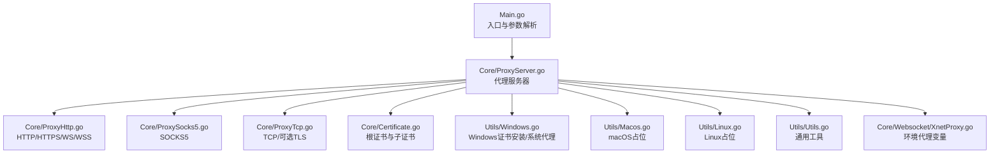
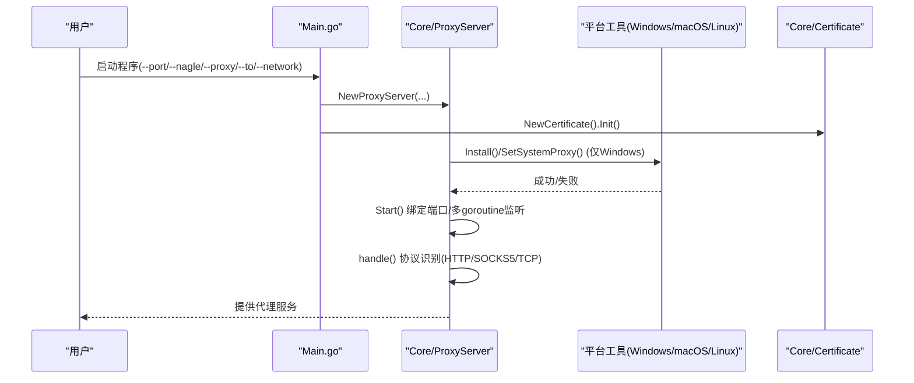
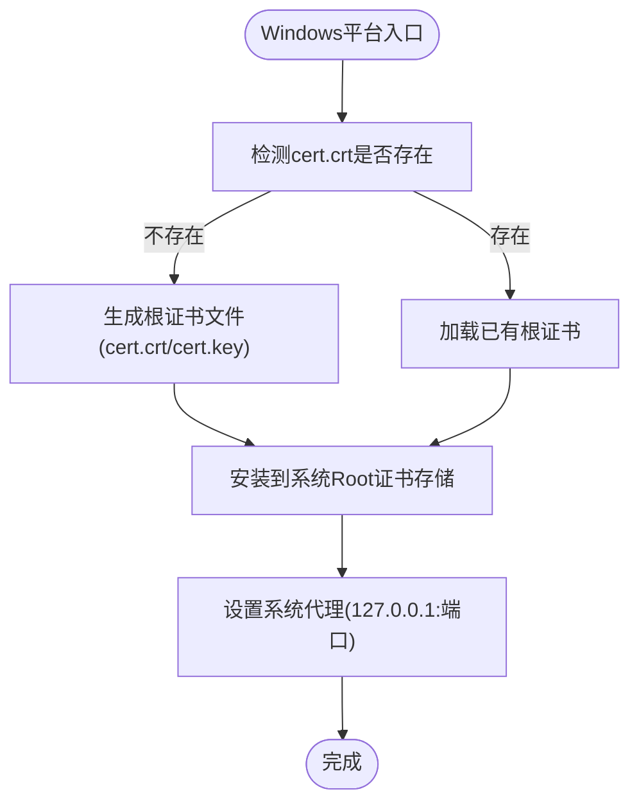
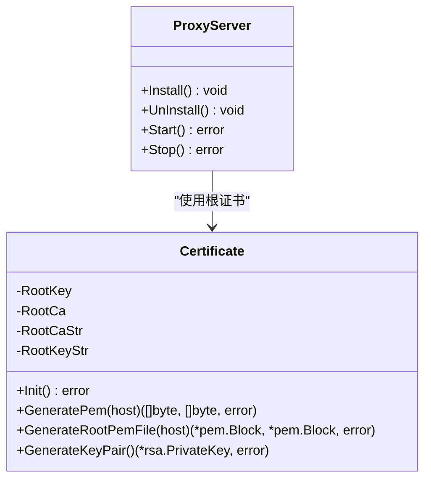
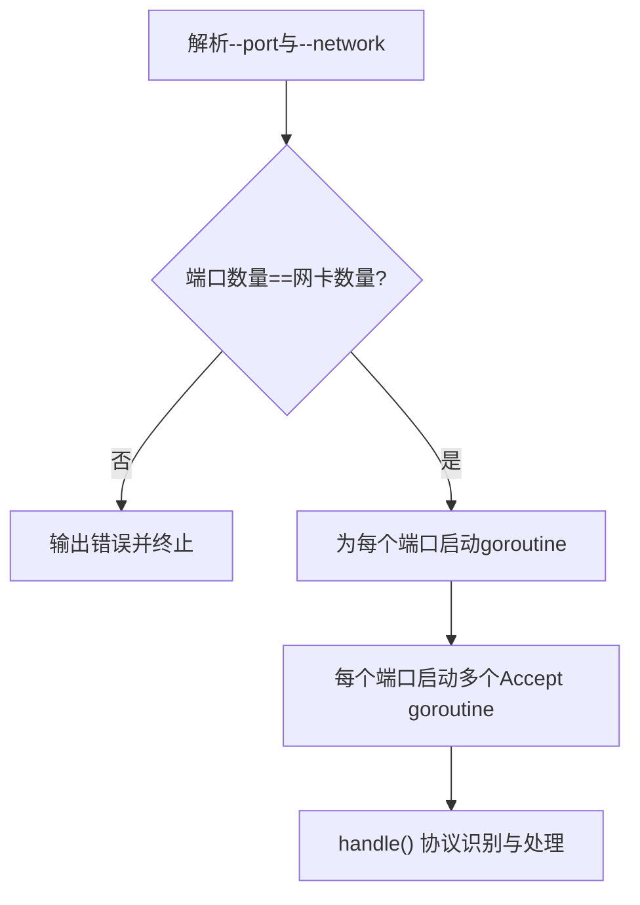
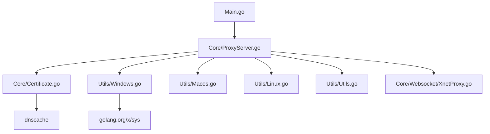

# 平台支持

<cite>
**本文引用的文件**
- [Main.go](file://Main.go)
- [README.md](file://README.md)
- [README-CN.md](file://README-CN.md)
- [CODE-DOC.md](file://CODE-DOC.md)
- [go.mod](file://go.mod)
- [go.sum](file://go.sum)
- [Core/ProxyServer.go](file://Core/ProxyServer.go)
- [Core/Certificate.go](file://Core/Certificate.go)
- [Core/ProxyTcp.go](file://Core/ProxyTcp.go)
- [Core/Websocket/XnetProxy.go](file://Core/Websocket/XnetProxy.go)
- [Utils/Windows.go](file://Utils/Windows.go)
- [Utils/Macos.go](file://Utils/Macos.go)
- [Utils/Linux.go](file://Utils/Linux.go)
- [Utils/Utils.go](file://Utils/Utils.go)
</cite>

## 目录
1. [简介](#简介)
2. [项目结构](#项目结构)
3. [核心组件](#核心组件)
4. [架构总览](#架构总览)
5. [详细组件分析](#详细组件分析)
6. [依赖分析](#依赖分析)
7. [性能考虑](#性能考虑)
8. [故障排除指南](#故障排除指南)
9. [结论](#结论)
10. [附录](#附录)

## 简介
本章节面向多平台支持的详细说明，聚焦于 shermie-proxy 在 Windows、macOS、Linux 三大平台上的行为差异、证书安装与系统代理设置、网络接口绑定、权限与部署要求、配置项与环境变量、故障排除与兼容性说明，并给出跨平台开发与测试的最佳实践。

## 项目结构
- 入口与控制流：入口位于主程序，负责初始化日志与根证书、解析命令行参数、按端口启动多个监听分支。
- 核心服务：代理服务器负责监听、协议识别、事件回调、以及在 Windows 平台上的证书安装与系统代理设置。
- 平台适配：通过构建标签区分 Windows/macOS/Linux，分别提供证书安装与系统代理设置能力。
- 证书体系：内置根证书生成与动态子证书颁发，用于 HTTPS MITM 与 WebSocket/TLS 透传。
- 网络与代理：支持多端口监听、按网卡绑定、上游代理、Nagle 算法开关、DNS 缓存等。

图表来源
- [Main.go:24-46](file://Main.go#L24-L46)
- [Core/ProxyServer.go:68-77](file://Core/ProxyServer.go#L68-L77)
- [Core/Certificate.go:27-32](file://Core/Certificate.go#L27-L32)
- [Utils/Windows.go:18-50](file://Utils/Windows.go#L18-L50)
- [Utils/Macos.go:8-16](file://Utils/Macos.go#L8-L16)
- [Utils/Linux.go:8-16](file://Utils/Linux.go#L8-L16)
- [Core/Websocket/XnetProxy.go:240-271](file://Core/Websocket/XnetProxy.go#L240-L271)

章节来源
- [Main.go:24-46](file://Main.go#L24-L46)
- [README.md:30-163](file://README.md#L30-L163)
- [README-CN.md:29-167](file://README-CN.md#L29-L167)

## 核心组件
- 代理服务器：负责监听端口、协议识别、事件回调、Windows 平台的证书安装与系统代理设置。
- 证书系统：根证书生成与持久化、动态子证书生成、全局证书缓存。
- 平台工具：Windows 平台证书安装与系统代理设置；macOS/Linux 平台返回“不支持”占位。
- 网络与代理：多端口监听、按网卡绑定、上游代理、Nagle 算法、DNS 缓存。

章节来源
- [Core/ProxyServer.go:48-96](file://Core/ProxyServer.go#L48-L96)
- [Core/Certificate.go:20-67](file://Core/Certificate.go#L20-L67)
- [Utils/Windows.go:18-50](file://Utils/Windows.go#L18-L50)
- [Utils/Macos.go:8-16](file://Utils/Macos.go#L8-L16)
- [Utils/Linux.go:8-16](file://Utils/Linux.go#L8-L16)

## 架构总览
下图展示从入口到平台适配与核心代理处理的关键交互路径。

图表来源
- [Main.go:24-46](file://Main.go#L24-L46)
- [Core/ProxyServer.go:79-96](file://Core/ProxyServer.go#L79-L96)
- [Core/ProxyServer.go:123-137](file://Core/ProxyServer.go#L123-L137)
- [Utils/Windows.go:18-50](file://Utils/Windows.go#L18-L50)
- [Core/Certificate.go:35-67](file://Core/Certificate.go#L35-L67)

## 详细组件分析

### Windows 平台支持与特殊处理
- 证书安装
  - 读取本地 PEM 证书文件，解码后创建证书上下文，写入系统 Root 证书存储区。
  - 适用于首次启动或需要重装根证书的场景。
- 系统代理设置
  - 动态加载 WinINet，调用 InternetSetOptionW 设置/清除系统代理。
  - 内置旁路规则，避免代理循环与内网地址走代理。
- 网络接口绑定
  - 通过 --network 指定出口网卡 IP，结合 --port 多端口实现多网卡分流。
- 性能与特性
  - 默认启用低延迟模式（Nagle 关闭），适合抓包与调试场景。
  - 多 goroutine 并发监听，提升吞吐。

图表来源
- [Core/Certificate.go:35-67](file://Core/Certificate.go#L35-L67)
- [Utils/Windows.go:18-50](file://Utils/Windows.go#L18-L50)
- [Core/ProxyServer.go:79-96](file://Core/ProxyServer.go#L79-L96)

章节来源
- [Utils/Windows.go:18-50](file://Utils/Windows.go#L18-L50)
- [Core/ProxyServer.go:79-96](file://Core/ProxyServer.go#L79-L96)
- [README.md:148-163](file://README.md#L148-L163)
- [README-CN.md:145-167](file://README-CN.md#L145-L167)

### macOS 平台支持与特殊处理
- 证书安装与系统代理设置
  - 两个平台方法均返回“不支持 macOS 系统”的错误提示。
- 系统集成方式
  - 由于不支持自动安装证书与系统代理，需用户手动导入根证书至系统钥匙串，并在系统设置中配置代理。
- 沙盒限制
  - 若在沙盒环境下运行，需确保应用具备相应权限以访问网络与证书存储。

章节来源
- [Utils/Macos.go:8-16](file://Utils/Macos.go#L8-L16)
- [Core/ProxyServer.go:95](file://Core/ProxyServer.go#L95)

### Linux 平台支持与特殊处理
- 证书安装与系统代理设置
  - 两个平台方法均返回“不支持 Linux 系统”的错误提示。
- 权限与部署
  - 需要 root 权限以绑定 1024 以下端口；建议使用非特权端口并在前置反向代理或 systemd socket activation 中转。
- 网络配置
  - 通过 --network 与 --port 多端口配合，实现多网卡绑定与流量分流。

章节来源
- [Utils/Linux.go:8-16](file://Utils/Linux.go#L8-L16)
- [Core/ProxyServer.go:95](file://Core/ProxyServer.go#L95)
- [README.md:148-163](file://README.md#L148-L163)
- [README-CN.md:145-167](file://README-CN.md#L145-L167)

### 证书管理与 TLS 中间人
- 根证书生成与持久化
  - 首次运行若不存在 cert.crt/cert.key，则生成并保存；否则加载已有根证书。
- 动态子证书
  - 对每个目标主机生成以目标域名为 CN 的子证书，用于 HTTPS MITM 与 WebSocket/TLS 透传。
- 证书缓存
  - 并发安全的证书缓存，避免重复生成，提升性能。

图表来源
- [Core/Certificate.go:20-67](file://Core/Certificate.go#L20-L67)
- [Core/ProxyServer.go:79-108](file://Core/ProxyServer.go#L79-L108)

章节来源
- [Core/Certificate.go:35-116](file://Core/Certificate.go#L35-L116)
- [Core/ProxyServer.go:79-108](file://Core/ProxyServer.go#L79-L108)

### 网络接口绑定与多端口监听
- 多端口与多网卡
  - --port 支持逗号分隔的多个端口；--network 对应相同数量的出口网卡 IP，实现按网卡绑定。
- 并发监听
  - 每个端口独立 goroutine，每个端口内部再启动多个 Accept goroutine，提升并发处理能力。

图表来源
- [Main.go:36-44](file://Main.go#L36-L44)
- [Core/ProxyServer.go:156-174](file://Core/ProxyServer.go#L156-L174)

章节来源
- [Main.go:36-44](file://Main.go#L36-L44)
- [Core/ProxyServer.go:156-174](file://Core/ProxyServer.go#L156-L174)

### 上游代理与环境变量
- 上游代理
  - 通过 --proxy 指定上级代理地址，用于 TCP/HTTP 流量转发。
- 环境变量
  - 程序内部使用环境变量 ALL_PROXY/NO_PROXY 控制代理行为，避免重复查询带来的性能损耗。

章节来源
- [README.md:148-163](file://README.md#L148-L163)
- [README-CN.md:145-167](file://README-CN.md#L145-L167)
- [Core/Websocket/XnetProxy.go:240-271](file://Core/Websocket/XnetProxy.go#L240-L271)

### 协议处理与事件钩子
- 协议识别
  - 通过窥探前若干字节识别 HTTP 方法、SOCKS5 握手或纯 TCP。
- 事件钩子
  - 支持 HTTP 请求/响应、WebSocket 请求/响应、SOCKS5 请求/响应、TCP 流事件，用户可拦截与修改数据。

章节来源
- [Core/ProxyServer.go:176-213](file://Core/ProxyServer.go#L176-L213)
- [README.md:30-163](file://README.md#L30-L163)
- [README-CN.md:29-167](file://README-CN.md#L29-L167)

## 依赖分析
- Go 版本与外部库
  - Go 1.16+，依赖 dnscache 用于 DNS 缓存，golang.org/x/sys 用于系统调用。
- 平台依赖
  - Windows 使用 golang.org/x/sys 与 WinINet API；macOS/Linux 平台方法返回“不支持”。

图表来源
- [go.mod:1-8](file://go.mod#L1-L8)
- [go.sum:1-4](file://go.sum#L1-L4)
- [Core/ProxyServer.go:68-77](file://Core/ProxyServer.go#L68-L77)

章节来源
- [go.mod:1-8](file://go.mod#L1-L8)
- [go.sum:1-4](file://go.sum#L1-L4)

## 性能考虑
- Nagle 算法
  - --nagle=true 实际上禁用 Nagle（低延迟模式），适合抓包与调试；若追求吞吐可设为 false。
- DNS 缓存
  - 使用 dnscache，TTL 固定为 5 分钟，减少 DNS 查询开销。
- 并发模型
  - 多端口多 goroutine 并发监听与处理，提升整体吞吐。
- 证书生成
  - 并发安全的证书缓存与 WaitGroup，避免重复生成，降低 CPU 开销。

章节来源
- [README.md:148-163](file://README.md#L148-L163)
- [README-CN.md:145-167](file://README-CN.md#L145-L167)
- [Core/ProxyServer.go:156-174](file://Core/ProxyServer.go#L156-L174)
- [CODE-DOC.md:700-720](file://CODE-DOC.md#L700-L720)

## 故障排除指南
- Windows
  - 证书安装失败：确认以管理员权限运行；检查 cert.crt 是否存在且可读。
  - 系统代理设置失败：检查 WinINet 可用性与旁路规则是否覆盖目标地址。
- macOS/Linux
  - 证书安装/系统代理设置报错：这两个平台方法返回“不支持”，需手动导入根证书与配置代理。
- 端口与网卡
  - 端口数量与网卡数量不一致：启动时报错，需修正参数。
  - 端口被占用：使用工具检测或更换端口。
- 上游代理
  - 无法访问目标：检查 --proxy 配置与网络连通性；确认 NO_PROXY 规则未误伤目标地址。
- 证书问题
  - HTTPS 访问异常：确认客户端信任根证书；检查动态子证书生成与缓存状态。

章节来源
- [Utils/Windows.go:18-50](file://Utils/Windows.go#L18-L50)
- [Utils/Macos.go:8-16](file://Utils/Macos.go#L8-L16)
- [Utils/Linux.go:8-16](file://Utils/Linux.go#L8-L16)
- [Main.go:36-44](file://Main.go#L36-L44)
- [Core/ProxyServer.go:123-137](file://Core/ProxyServer.go#L123-L137)

## 结论
sheremie-proxy 在 Windows 平台上提供了完整的证书安装与系统代理设置自动化能力；在 macOS/Linux 平台上则以“不支持”占位，要求用户手动完成证书与代理配置。通过多端口、多网卡绑定、上游代理、Nagle 算法与 DNS 缓存等机制，项目在不同平台上实现了灵活的部署与优化空间。建议在生产环境中结合平台特性与安全策略，谨慎选择证书安装方式与代理配置，并根据业务需求调整性能参数。

## 附录

### 平台相关配置项与环境变量
- 命令行参数
  - --port：监听端口（支持多端口逗号分隔）
  - --nagle：是否启用低延迟模式（默认 true）
  - --proxy：上级代理地址
  - --to：TCP 透传目标地址
  - --network：强制出口网卡 IP（与 --port 数量一致）
- 环境变量
  - ALL_PROXY/no_proxy：控制代理行为与旁路规则

章节来源
- [README.md:148-163](file://README.md#L148-L163)
- [README-CN.md:145-167](file://README-CN.md#L145-L167)
- [Core/Websocket/XnetProxy.go:240-271](file://Core/Websocket/XnetProxy.go#L240-L271)

### 跨平台开发与测试最佳实践
- 使用构建标签隔离平台差异，保持核心逻辑跨平台一致。
- 在 CI 中针对 Windows/macOS/Linux 分别运行单元测试与集成测试。
- 通过 Docker 或虚拟机模拟不同平台环境，验证证书与代理配置流程。
- 对证书生成与缓存逻辑进行并发压力测试，确保稳定性。