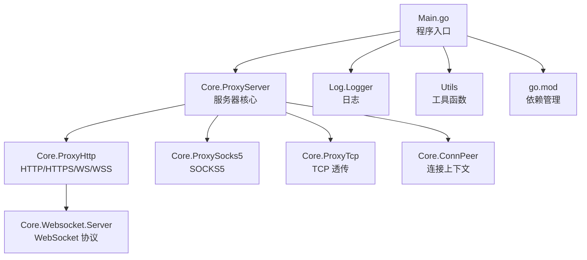
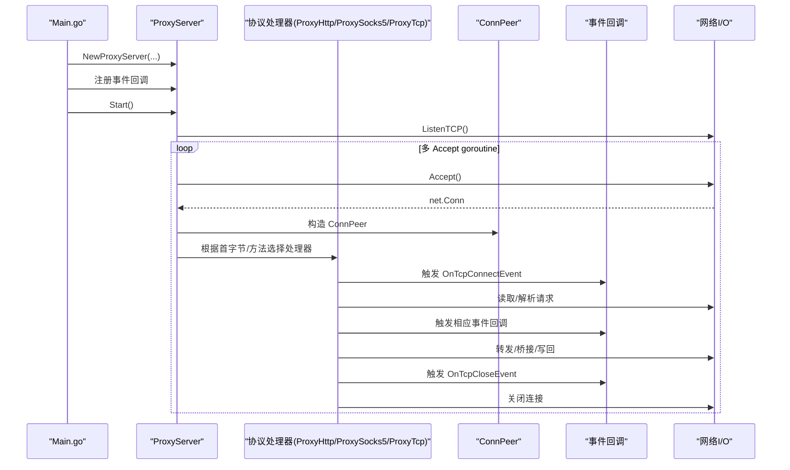
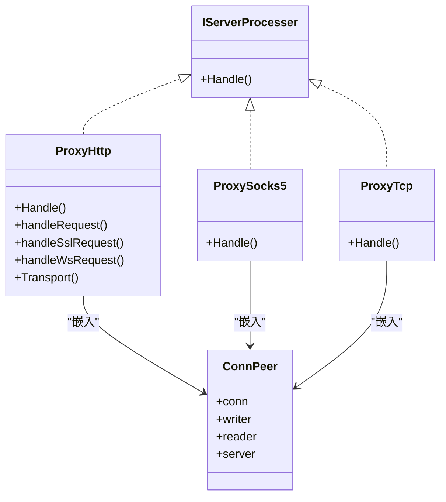
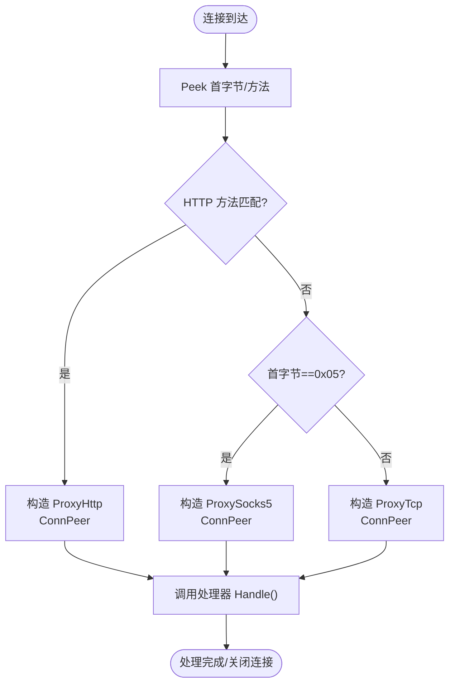
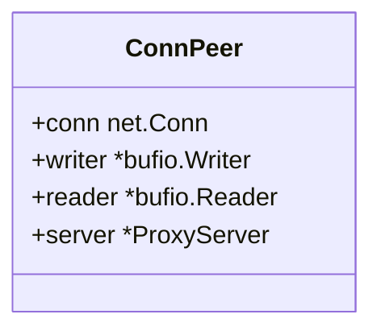
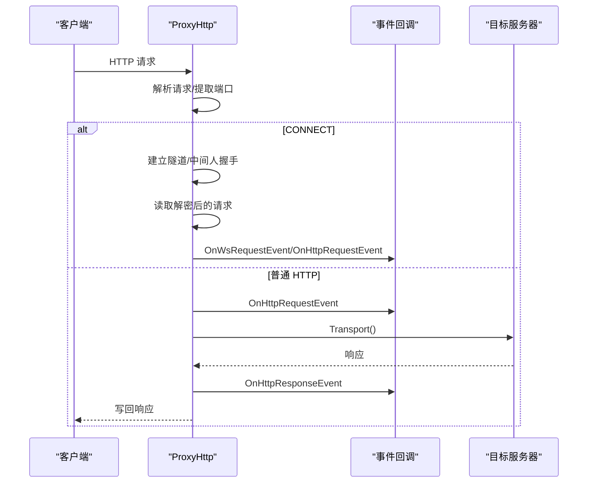
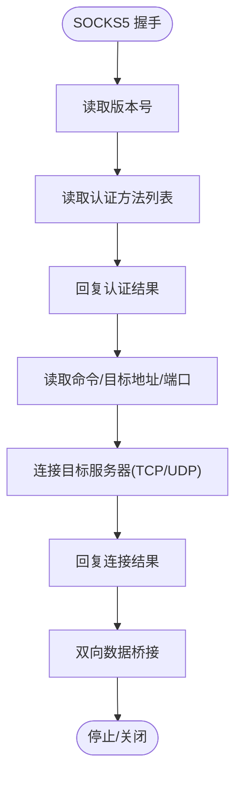
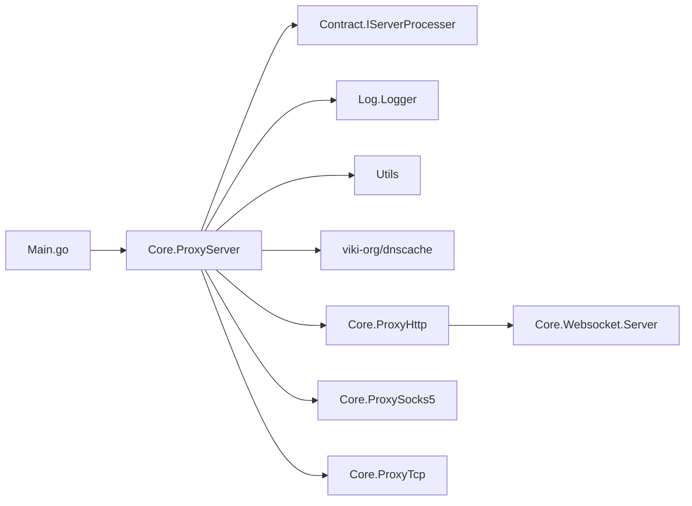

# 代码结构与组织

<cite>
**本文引用的文件**
- [Main.go](file://Main.go)
- [Contract/IServerProcesser.go](file://Contract/IServerProcesser.go)
- [Core/ProxyServer.go](file://Core/ProxyServer.go)
- [Core/ConnPeer.go](file://Core/ConnPeer.go)
- [Core/ProxyHttp.go](file://Core/ProxyHttp.go)
- [Core/ProxySocks5.go](file://Core/ProxySocks5.go)
- [Core/Websocket/Server.go](file://Core/Websocket/Server.go)
- [Utils/Utils.go](file://Utils/Utils.go)
- [Log/Logger.go](file://Log/Logger.go)
- [go.mod](file://go.mod)
- [README.md](file://README.md)
- [CODE-DOC.md](file://CODE-DOC.md)
</cite>

## 目录
1. [引言](#引言)
2. [项目结构](#项目结构)
3. [核心组件](#核心组件)
4. [架构总览](#架构总览)
5. [详细组件分析](#详细组件分析)
6. [依赖分析](#依赖分析)
7. [性能考虑](#性能考虑)
8. [故障排查指南](#故障排查指南)
9. [结论](#结论)
10. [附录](#附录)

## 引言
本文件面向开发者，系统性梳理 shermie-proxy 的代码结构与组织方式，重点解释：
- 目录结构的设计理念与模块职责分工
- 核心模块（Core）、接口定义（Contract）、工具函数（Utils）的组织方式
- IServerProcesser 接口的设计思想及其在系统中的作用
- ProxyServer 作为中央协调器的实现原理
- ConnPeer 如何封装连接上下文
- 模块间的依赖关系与数据流向
- go.mod 中的依赖管理最佳实践
- 命名约定与代码组织原则

## 项目结构
项目采用按“领域功能”划分的模块化组织方式，遵循“高内聚、低耦合”的设计原则：
- Core：核心代理逻辑与协议处理器
- Contract：接口契约定义
- Log：日志模块
- Utils：平台适配与通用工具
- Constant：常量定义（当前为空）
- Root：入口程序 Main.go、README、依赖清单等

图表来源
- [Main.go:1-124](file://Main.go#L1-L124)
- [Core/ProxyServer.go:1-213](file://Core/ProxyServer.go#L1-L213)
- [Core/ProxyHttp.go:1-491](file://Core/ProxyHttp.go#L1-L491)
- [Core/ProxySocks5.go:1-300](file://Core/ProxySocks5.go#L1-L300)
- [Core/Websocket/Server.go:1-368](file://Core/Websocket/Server.go#L1-L368)
- [Log/Logger.go:1-20](file://Log/Logger.go#L1-L20)
- [Utils/Utils.go:1-62](file://Utils/Utils.go#L1-L62)
- [go.mod:1-9](file://go.mod#L1-L9)

章节来源
- [Main.go:1-124](file://Main.go#L1-L124)
- [README.md:1-163](file://README.md#L1-L163)
- [CODE-DOC.md:30-80](file://CODE-DOC.md#L30-L80)

## 核心组件
- ProxyServer：服务器核心，负责监听、连接接受、协议识别与分发、事件回调注册与触发、证书安装/卸载等。
- ConnPeer：连接上下文封装，聚合 net.Conn、bufio.Reader/Writer 与所属服务器实例，作为各协议处理器的基座。
- ProxyHttp：HTTP/HTTPS/WS/WSS 处理器，负责请求解析、HTTPS 隧道、TLS 中间人、WebSocket 升级与桥接、HTTP 转发与响应读取。
- ProxySocks5：SOCKS5 处理器，负责握手、目标地址解析、连接建立、双向数据转发。
- ProxyTcp：TCP 透传处理器，负责目标地址解析、可选 TLS 握手、双向数据转发。
- IServerProcesser：协议处理器接口，统一抽象 Handle() 方法，使 ProxyServer 能以多态方式调度不同协议处理器。
- Logger：日志模块，提供全局日志句柄。
- Utils：平台适配（Windows 证书安装、系统代理设置）与通用工具（文件检测、端口检测、反射读取 TLS 内部数据）。

章节来源
- [Core/ProxyServer.go:1-213](file://Core/ProxyServer.go#L1-L213)
- [Core/ConnPeer.go:1-14](file://Core/ConnPeer.go#L1-L14)
- [Core/ProxyHttp.go:1-491](file://Core/ProxyHttp.go#L1-L491)
- [Core/ProxySocks5.go:1-300](file://Core/ProxySocks5.go#L1-L300)
- [Contract/IServerProcesser.go:1-8](file://Contract/IServerProcesser.go#L1-L8)
- [Log/Logger.go:1-20](file://Log/Logger.go#L1-L20)
- [Utils/Utils.go:1-62](file://Utils/Utils.go#L1-L62)

## 架构总览
Shermie-Proxy 采用“入口程序 + 中央协调器 + 多协议处理器 + 事件回调 + 平台工具”的分层架构。入口程序负责参数解析与事件回调注册；中央协调器负责监听、连接接受与协议识别；协议处理器负责具体协议的业务处理；事件回调提供可插拔的数据拦截与修改能力；平台工具负责跨平台适配与通用能力。

图表来源
- [Main.go:24-124](file://Main.go#L24-L124)
- [Core/ProxyServer.go:123-203](file://Core/ProxyServer.go#L123-L203)
- [Core/ConnPeer.go:8-13](file://Core/ConnPeer.go#L8-L13)
- [Core/ProxyHttp.go:44-132](file://Core/ProxyHttp.go#L44-L132)
- [Core/ProxySocks5.go:54-200](file://Core/ProxySocks5.go#L54-L200)

## 详细组件分析

### IServerProcesser 接口与协议处理器体系
- 设计思想：通过最小接口约束（Handle）统一不同协议处理器的行为，ProxyServer 仅依赖接口，不关心具体实现细节，实现“多态调度”。
- 在系统中的作用：ProxyServer 在连接到来时根据首字节/方法识别协议，构造对应处理器实例并调用其 Handle()，从而实现“协议无关”的处理流程。

图表来源
- [Contract/IServerProcesser.go:3-5](file://Contract/IServerProcesser.go#L3-L5)
- [Core/ProxyHttp.go:29-37](file://Core/ProxyHttp.go#L29-L37)
- [Core/ProxySocks5.go:15-19](file://Core/ProxySocks5.go#L15-L19)
- [Core/ProxyTcp.go:1-112](file://Core/ProxyTcp.go#L1-L112)
- [Core/ConnPeer.go:8-13](file://Core/ConnPeer.go#L8-L13)

章节来源
- [Contract/IServerProcesser.go:1-8](file://Contract/IServerProcesser.go#L1-L8)
- [Core/ProxyServer.go:176-203](file://Core/ProxyServer.go#L176-L203)

### ProxyServer：中央协调器
- 职责
  - 监听与启动：解析端口、绑定监听、多 goroutine 接受连接。
  - 协议识别：通过 Peek 读取首字节，结合 HTTP 方法前缀匹配，选择处理器。
  - 事件回调：对外暴露多种事件回调，供上层注册。
  - 证书管理：安装/卸载系统代理（Windows），打印 Logo。
  - 并发模型：多 Accept goroutine + 每连接一个 goroutine 处理。
- 关键实现要点
  - 多 Accept：MultiListen 启动固定数量 goroutine 并发 Accept。
  - 协议识别：handle() 中使用 isHttpMethod() 与首字节判断，构造 ConnPeer 并委派给具体处理器。
  - 事件触发：在连接生命周期的关键节点触发 OnTcpConnectEvent/OnTcpCloseEvent。

图表来源
- [Core/ProxyServer.go:176-213](file://Core/ProxyServer.go#L176-L213)
- [Core/ProxyHttp.go:44-64](file://Core/ProxyHttp.go#L44-L64)
- [Core/ProxySocks5.go:54-110](file://Core/ProxySocks5.go#L54-L110)

章节来源
- [Core/ProxyServer.go:123-203](file://Core/ProxyServer.go#L123-L203)

### ConnPeer：连接上下文封装
- 设计目的：将连接、读写器与服务器实例聚合，作为所有协议处理器的基座，避免重复传递参数，提升代码复用性。
- 字段与职责
  - conn：客户端连接
  - reader/writer：带缓冲的读写器
  - server：所属服务器实例，便于访问回调与配置

图表来源
- [Core/ConnPeer.go:8-13](file://Core/ConnPeer.go#L8-L13)

章节来源
- [Core/ConnPeer.go:1-14](file://Core/ConnPeer.go#L1-L14)

### HTTP/HTTPS/WS/WSS 处理器（ProxyHttp）
- 处理入口：Handle() 解析请求，区分 CONNECT 与普通 HTTP。
- HTTPS 隧道：handleSslRequest() 建立隧道，SslReceiveSend() 完成 TLS 中间人握手与后续处理。
- WebSocket：handleWsRequest() 使用 Upgrader.Upgrade() 升级后，启动双向 goroutine 桥接。
- HTTP 转发：handleRequest() 读取请求体，触发 OnHttpRequestEvent，调用 Transport() 转发，读取响应体并触发 OnHttpResponseEvent。
- DNS 缓存：DialContext() 使用 dnscache 库进行解析与拨号。
- 请求头清理：RemoveHeader() 移除 hop-by-hop 头，避免代理链问题。

图表来源
- [Core/ProxyHttp.go:44-132](file://Core/ProxyHttp.go#L44-L132)
- [Core/ProxyHttp.go:183-200](file://Core/ProxyHttp.go#L183-L200)
- [Core/Websocket/Server.go:124-200](file://Core/Websocket/Server.go#L124-L200)

章节来源
- [Core/ProxyHttp.go:1-491](file://Core/ProxyHttp.go#L1-L491)

### SOCKS5 处理器（ProxySocks5）
- 处理入口：Handle() 完成版本、方法、命令、目标地址解析与连接建立。
- 目标地址解析：支持 IPv4/IPv6/域名，端口使用大端解析。
- 连接建立：根据命令类型选择 TCP/UDP，必要时进行 TLS 握手。
- 双向转发：启动 goroutine 实现客户端与目标之间的数据转发，并触发 OnSocks5RequestEvent/OnSocks5ResponseEvent。

图表来源
- [Core/ProxySocks5.go:54-200](file://Core/ProxySocks5.go#L54-L200)

章节来源
- [Core/ProxySocks5.go:1-300](file://Core/ProxySocks5.go#L1-L300)

### TCP 透传处理器（ProxyTcp）
- 处理入口：Handle() 解析目标地址（来自 --to 参数），建立连接，可选 TLS 握手。
- 双向转发：Transport() 循环读取数据，根据角色触发 OnTcpClientStreamEvent/OnTcpServerStreamEvent，再写回目标连接。
- Nagle 控制：通过 --nagle 控制是否启用低延迟模式。

章节来源
- [Core/ProxyTcp.go:1-112](file://Core/ProxyTcp.go#L1-L112)

### 事件回调系统
- 回调类型：包含 HTTP 请求/响应、WebSocket 请求/响应、SOCKS5 请求/响应、TCP 连接/关闭、TCP 双向流等。
- Resolve 函数：每个回调均提供一个 resolve 函数，用户可在回调中修改数据后调用 resolve 完成默认行为，或直接返回以跳过默认处理。
- 使用模式：在 Main.go 的 ListenBranch() 中注册回调，实现对数据流的拦截与修改。

章节来源
- [Main.go:61-120](file://Main.go#L61-L120)
- [Core/ProxyServer.go:22-34](file://Core/ProxyServer.go#L22-L34)
- [CODE-DOC.md:392-451](file://CODE-DOC.md#L392-L451)

## 依赖分析
- 模块间依赖
  - Main.go 依赖 Core.ProxyServer、Log.Logger
  - Core.ProxyServer 依赖 Contract.IServerProcesser、Log.Logger、Utils、dnscache
  - 各协议处理器依赖 ConnPeer 与各自子模块（如 WebSocket）
  - Utils 提供平台适配与通用工具
- 外部依赖
  - viki-org/dnscache：DNS 缓存
  - golang.org/x/sys：Windows 系统调用（证书安装、代理设置）

图表来源
- [Main.go:9-10](file://Main.go#L9-L10)
- [Core/ProxyServer.go:13-16](file://Core/ProxyServer.go#L13-L16)
- [go.mod:6-8](file://go.mod#L6-L8)

章节来源
- [go.mod:1-9](file://go.mod#L1-L9)
- [CODE-DOC.md:65-78](file://CODE-DOC.md#L65-L78)

## 性能考虑
- 多 Accept 并发：MultiListen() 启动多个 goroutine 并发 Accept，缓解高并发下的连接接受瓶颈。
- DNS 缓存：使用 dnscache 库缓存解析结果，降低重复解析开销。
- Nagle 控制：通过 --nagle 控制是否启用低延迟模式，默认启用以降低延迟。
- 事件回调：回调中尽量避免阻塞操作，必要时在回调内部异步处理。
- TLS 中间人：证书生成采用并发安全的缓存策略，避免重复生成。

章节来源
- [Core/ProxyServer.go:156-174](file://Core/ProxyServer.go#L156-L174)
- [Core/ProxyHttp.go:261-271](file://Core/ProxyHttp.go#L261-L271)
- [CODE-DOC.md:692-727](file://CODE-DOC.md#L692-L727)

## 故障排查指南
- 无法启动或端口占用
  - 检查 --port 参数与 --network 数量是否一致
  - 使用 Utils.IsPortAvailable() 检查端口可用性
- 证书相关
  - 确认根证书生成与安装（Windows 平台可自动安装）
  - 通过 /tls 路径下载根证书
- 代理链与上游代理
  - 使用 --proxy 设置上级代理
  - 确认目标地址（--to）正确
- 日志定位
  - 使用 Log.Logger 输出关键信息，定位握手、转发、错误等环节

章节来源
- [Main.go:35-45](file://Main.go#L35-L45)
- [Utils/Utils.go:51-61](file://Utils/Utils.go#L51-L61)
- [Core/ProxyHttp.go:80-94](file://Core/ProxyHttp.go#L80-L94)
- [Log/Logger.go:17-19](file://Log/Logger.go#L17-L19)

## 结论
Shermie-Proxy 通过清晰的模块划分与接口抽象，实现了“统一入口、多协议处理器、事件回调可插拔”的代理架构。ProxyServer 作为中央协调器，借助 ConnPeer 封装连接上下文，配合 IServerProcesser 接口实现协议无关的处理流程。结合 DNS 缓存、多 Accept 并发与事件回调机制，系统在易用性与性能之间取得了良好平衡。建议开发者在扩展新协议时遵循现有模式：实现 IServerProcesser 接口、嵌入 ConnPeer、在 ProxyServer 中注册协议识别逻辑，并通过事件回调提供可观测性与可定制性。

## 附录

### 命名约定与代码组织原则
- 包名小写，模块职责明确：Core、Contract、Log、Utils、Constant
- 接口最小化：IServerProcesser 仅定义 Handle()，降低耦合
- 嵌入式组合：各处理器嵌入 ConnPeer，复用连接上下文
- 事件回调：统一以 OnXxxEvent 形式命名，resolve 函数提供默认行为
- 平台适配：通过 Utils.Windows/Mac/Linux 提供平台特定能力

章节来源
- [Contract/IServerProcesser.go:3-5](file://Contract/IServerProcesser.go#L3-L5)
- [Core/ConnPeer.go:8-13](file://Core/ConnPeer.go#L8-L13)
- [CODE-DOC.md:392-451](file://CODE-DOC.md#L392-L451)