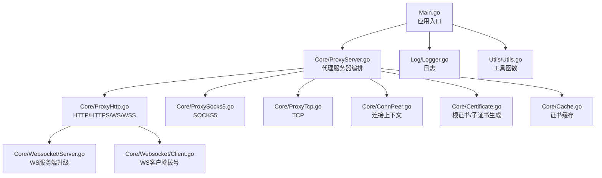
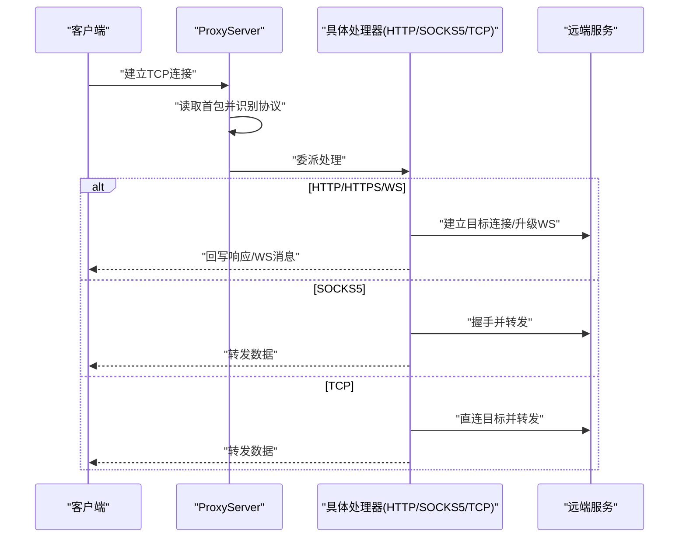
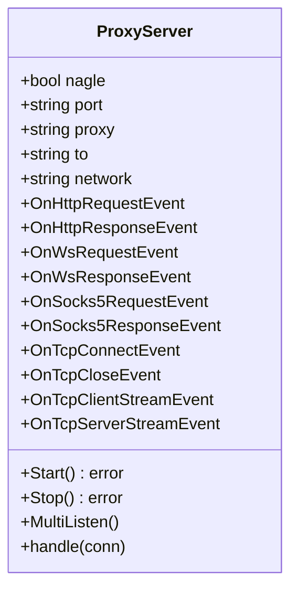
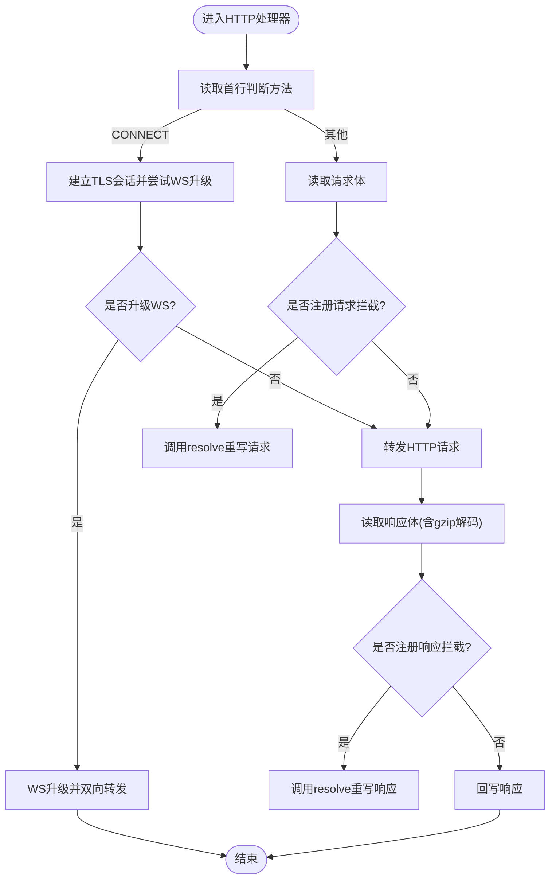
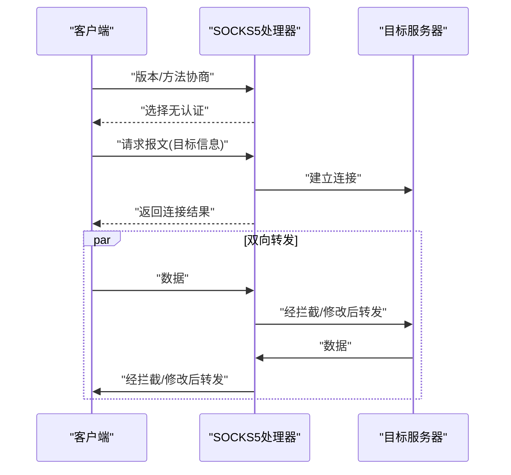
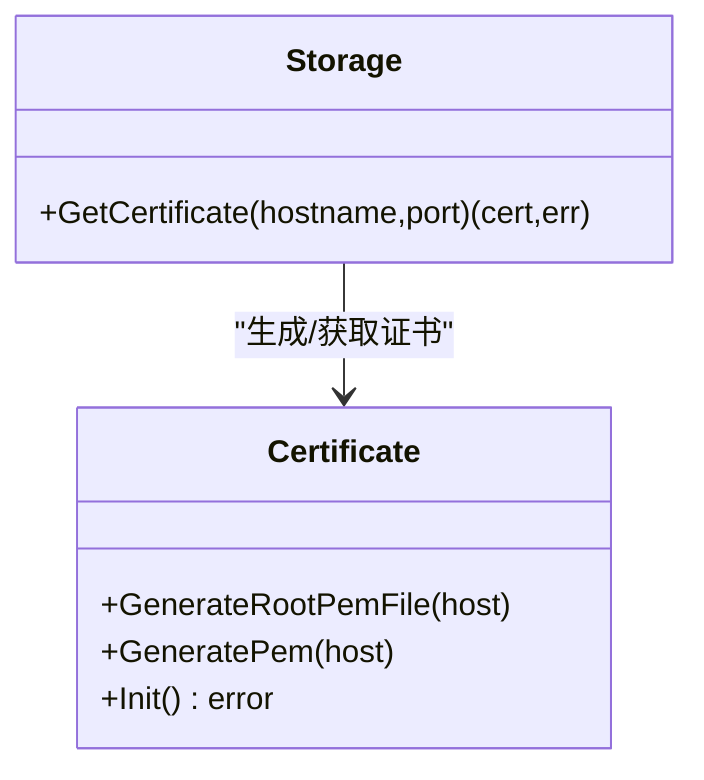
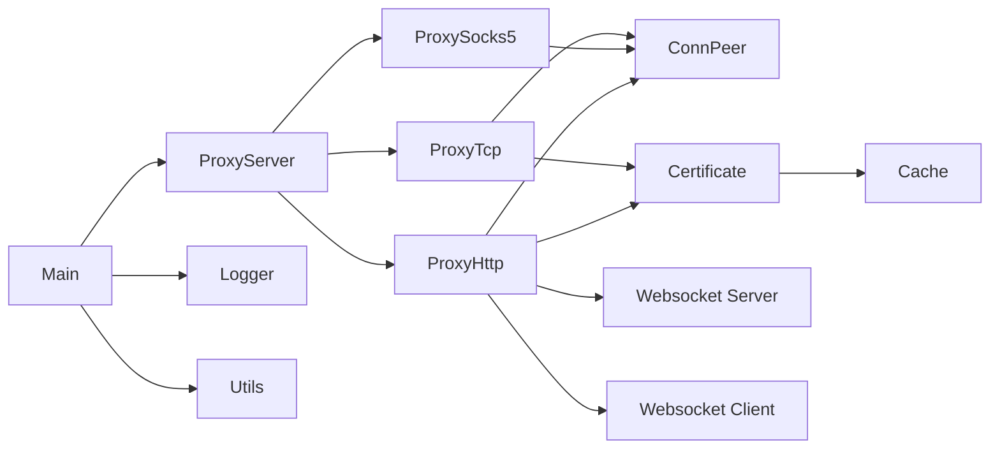

# 开发指南

<cite>
**本文引用的文件**
- [Main.go](file://Main.go)
- [README.md](file://README.md)
- [README-CN.md](file://README-CN.md)
- [go.mod](file://go.mod)
- [Contract/IServerProcesser.go](file://Contract/IServerProcesser.go)
- [Core/ProxyServer.go](file://Core/ProxyServer.go)
- [Core/ConnPeer.go](file://Core/ConnPeer.go)
- [Core/ProxyHttp.go](file://Core/ProxyHttp.go)
- [Core/ProxySocks5.go](file://Core/ProxySocks5.go)
- [Core/ProxyTcp.go](file://Core/ProxyTcp.go)
- [Core/Certificate.go](file://Core/Certificate.go)
- [Core/Cache.go](file://Core/Cache.go)
- [Core/Websocket/Server.go](file://Core/Websocket/Server.go)
- [Core/Websocket/Client.go](file://Core/Websocket/Client.go)
- [Log/Logger.go](file://Log/Logger.go)
- [Utils/Utils.go](file://Utils/Utils.go)
</cite>

## 目录
1. [简介](#简介)
2. [项目结构](#项目结构)
3. [核心组件](#核心组件)
4. [架构总览](#架构总览)
5. [详细组件分析](#详细组件分析)
6. [依赖分析](#依赖分析)
7. [性能考虑](#性能考虑)
8. [故障排查指南](#故障排查指南)
9. [结论](#结论)
10. [附录](#附录)

## 简介
本开发指南面向希望扩展或定制 shermie-proxy 的开发者，目标是帮助你快速理解项目结构、核心模块职责与交互关系，并提供添加新协议处理器的完整流程、调试技巧、测试策略、代码质量要求、开发环境搭建与构建流程，以及贡献代码的最佳实践。

## 项目结构
项目采用按功能域分层的组织方式：
- Contract：契约与接口定义（当前仅定义通用处理器接口）
- Core：核心业务逻辑与协议处理（HTTP/HTTPS/WS/WSS/TCP/SOCKS5）
- Log：日志模块
- Utils：平台与工具函数
- Root：入口程序与文档

**图表来源**
- [Main.go:1-124](file://Main.go#L1-L124)
- [Core/ProxyServer.go:1-213](file://Core/ProxyServer.go#L1-L213)
- [Core/ProxyHttp.go:1-491](file://Core/ProxyHttp.go#L1-L491)
- [Core/ProxySocks5.go:1-300](file://Core/ProxySocks5.go#L1-L300)
- [Core/ProxyTcp.go:1-112](file://Core/ProxyTcp.go#L1-L112)
- [Core/ConnPeer.go:1-14](file://Core/ConnPeer.go#L1-L14)
- [Core/Certificate.go:1-188](file://Core/Certificate.go#L1-L188)
- [Core/Cache.go:1-79](file://Core/Cache.go#L1-L79)
- [Core/Websocket/Server.go:1-368](file://Core/Websocket/Server.go#L1-L368)
- [Core/Websocket/Client.go:1-396](file://Core/Websocket/Client.go#L1-L396)
- [Log/Logger.go:1-20](file://Log/Logger.go#L1-L20)
- [Utils/Utils.go:1-62](file://Utils/Utils.go#L1-L62)

**章节来源**
- [Main.go:1-124](file://Main.go#L1-L124)
- [README.md:1-163](file://README.md#L1-L163)
- [README-CN.md:1-167](file://README-CN.md#L1-L167)

## 核心组件
- 入口与启动
  - 应用入口负责初始化日志与根证书，解析命令行参数，启动多监听分支，并注册各类事件回调。
  - 参考路径：[Main.go:24-124](file://Main.go#L24-L124)

- 代理服务器编排
  - 统一监听入口，根据首包特征自动识别协议，委派至对应处理器；提供事件钩子用于拦截与修改数据流。
  - 参考路径：[Core/ProxyServer.go:123-213](file://Core/ProxyServer.go#L123-L213)

- 协议处理器
  - HTTP/HTTPS/WS/WSS：读取请求、可选拦截、转发、回写响应；支持TLS与WS升级。
  - SOCKS5：握手、目标解析、双向转发、可选拦截。
  - TCP：直连目标主机，必要时做TLS伪装后转发。
  - 参考路径：
    - [Core/ProxyHttp.go:44-491](file://Core/ProxyHttp.go#L44-L491)
    - [Core/ProxySocks5.go:54-300](file://Core/ProxySocks5.go#L54-L300)
    - [Core/ProxyTcp.go:23-112](file://Core/ProxyTcp.go#L23-L112)

- 连接上下文
  - 统一封装底层连接、读写器与服务器引用，便于各处理器共享。
  - 参考路径：[Core/ConnPeer.go:8-14](file://Core/ConnPeer.go#L8-L14)

- 证书体系
  - 根证书生成与持久化、基于域名动态生成子证书、TLS握手与WS升级。
  - 参考路径：
    - [Core/Certificate.go:35-188](file://Core/Certificate.go#L35-L188)
    - [Core/Cache.go:39-79](file://Core/Cache.go#L39-L79)

- 日志与工具
  - 日志初始化与输出；常用工具如文件存在性判断、可用端口探测等。
  - 参考路径：
    - [Log/Logger.go:17-20](file://Log/Logger.go#L17-L20)
    - [Utils/Utils.go:13-62](file://Utils/Utils.go#L13-L62)

**章节来源**
- [Main.go:1-124](file://Main.go#L1-L124)
- [Core/ProxyServer.go:1-213](file://Core/ProxyServer.go#L1-L213)
- [Core/ProxyHttp.go:1-491](file://Core/ProxyHttp.go#L1-L491)
- [Core/ProxySocks5.go:1-300](file://Core/ProxySocks5.go#L1-L300)
- [Core/ProxyTcp.go:1-112](file://Core/ProxyTcp.go#L1-L112)
- [Core/ConnPeer.go:1-14](file://Core/ConnPeer.go#L1-L14)
- [Core/Certificate.go:1-188](file://Core/Certificate.go#L1-L188)
- [Core/Cache.go:1-79](file://Core/Cache.go#L1-L79)
- [Log/Logger.go:1-20](file://Log/Logger.go#L1-L20)
- [Utils/Utils.go:1-62](file://Utils/Utils.go#L1-L62)

## 架构总览
Shermie-Proxy 采用“统一入口 + 协议识别 + 多处理器委派”的架构。入口负责参数解析与事件注册；服务器根据首包特征选择处理器；处理器内部通过事件回调实现可插拔的数据拦截与修改；证书与缓存模块支撑TLS与WS场景。

**图表来源**
- [Core/ProxyServer.go:176-203](file://Core/ProxyServer.go#L176-L203)
- [Core/ProxyHttp.go:44-491](file://Core/ProxyHttp.go#L44-L491)
- [Core/ProxySocks5.go:54-300](file://Core/ProxySocks5.go#L54-L300)
- [Core/ProxyTcp.go:23-112](file://Core/ProxyTcp.go#L23-L112)

## 详细组件分析

### 组件：ProxyServer（代理服务器）
- 职责
  - 监听端口、多路监听、连接接受与分发
  - 协议识别与处理器委派
  - 提供事件回调钩子，供上层拦截与修改
- 关键点
  - 事件类型定义集中在结构体字段中，便于统一管理
  - 协议识别通过首包前缀判断，避免复杂状态机
  - 证书安装/卸载与系统代理设置（Windows）

**图表来源**
- [Core/ProxyServer.go:48-66](file://Core/ProxyServer.go#L48-L66)
- [Core/ProxyServer.go:123-213](file://Core/ProxyServer.go#L123-L213)

**章节来源**
- [Core/ProxyServer.go:1-213](file://Core/ProxyServer.go#L1-L213)

### 组件：ProxyHttp（HTTP/HTTPS/WS/WSS）
- 职责
  - 读取HTTP请求，支持CONNECT隧道、TLS与WS升级
  - 请求/响应拦截与重写，支持gzip解码
  - WS握手与双向转发，支持压缩扩展
- 关键点
  - 通过事件回调实现请求/响应拦截
  - WS升级使用内置Upgrader，支持子协议与压缩
  - DNS解析与本地网卡绑定

**图表来源**
- [Core/ProxyHttp.go:44-132](file://Core/ProxyHttp.go#L44-L132)
- [Core/ProxyHttp.go:205-286](file://Core/ProxyHttp.go#L205-L286)
- [Core/ProxyHttp.go:288-434](file://Core/ProxyHttp.go#L288-L434)

**章节来源**
- [Core/ProxyHttp.go:1-491](file://Core/ProxyHttp.go#L1-L491)
- [Core/Websocket/Server.go:116-267](file://Core/Websocket/Server.go#L116-L267)
- [Core/Websocket/Client.go:104-383](file://Core/Websocket/Client.go#L104-L383)

### 组件：ProxySocks5（SOCKS5）
- 职责
  - 完成SOCKS5握手与目标解析
  - 双向数据转发，支持UDP（部分命令）
  - 事件拦截与修改
- 关键点
  - 支持IPv4/IPv6/域名目标类型
  - 命令类型区分CONNECT/BIND/UDP
  - 并发通道控制与错误传播

**图表来源**
- [Core/ProxySocks5.go:54-240](file://Core/ProxySocks5.go#L54-L240)
- [Core/ProxySocks5.go:242-284](file://Core/ProxySocks5.go#L242-L284)

**章节来源**
- [Core/ProxySocks5.go:1-300](file://Core/ProxySocks5.go#L1-L300)

### 组件：ProxyTcp（TCP）
- 职责
  - 直连目标主机，必要时进行TLS伪装
  - 双向转发与事件拦截
- 关键点
  - 通过证书缓存生成临时证书
  - 读写缓冲与错误处理

**章节来源**
- [Core/ProxyTcp.go:1-112](file://Core/ProxyTcp.go#L1-L112)
- [Core/Cache.go:39-79](file://Core/Cache.go#L39-L79)

### 组件：证书与缓存
- Certificate
  - 生成/加载根证书，按域名生成子证书
- Cache
  - 域名级并发去重与缓存，避免重复生成证书

**图表来源**
- [Core/Certificate.go:35-188](file://Core/Certificate.go#L35-L188)
- [Core/Cache.go:39-79](file://Core/Cache.go#L39-L79)

**章节来源**
- [Core/Certificate.go:1-188](file://Core/Certificate.go#L1-L188)
- [Core/Cache.go:1-79](file://Core/Cache.go#L1-L79)

## 依赖分析
- 外部依赖
  - DNS缓存：用于域名解析与加速
  - 系统工具：Windows下证书安装与系统代理设置
- 内部模块耦合
  - ProxyServer 依赖各协议处理器与事件回调
  - 协议处理器依赖 ConnPeer、证书与缓存、WS升级/拨号
  - 工具与日志模块被广泛使用

**图表来源**
- [Core/ProxyServer.go:1-213](file://Core/ProxyServer.go#L1-L213)
- [Core/ProxyHttp.go:1-491](file://Core/ProxyHttp.go#L1-L491)
- [Core/ProxySocks5.go:1-300](file://Core/ProxySocks5.go#L1-L300)
- [Core/ProxyTcp.go:1-112](file://Core/ProxyTcp.go#L1-L112)
- [Core/Certificate.go:1-188](file://Core/Certificate.go#L1-L188)
- [Core/Cache.go:1-79](file://Core/Cache.go#L1-L79)
- [Core/Websocket/Server.go:1-368](file://Core/Websocket/Server.go#L1-L368)
- [Core/Websocket/Client.go:1-396](file://Core/Websocket/Client.go#L1-L396)
- [Main.go:1-124](file://Main.go#L1-L124)
- [Log/Logger.go:1-20](file://Log/Logger.go#L1-L20)
- [Utils/Utils.go:1-62](file://Utils/Utils.go#L1-L62)

**章节来源**
- [go.mod:1-9](file://go.mod#L1-L9)
- [Main.go:1-124](file://Main.go#L1-L124)

## 性能考虑
- 并发监听与处理
  - 服务器采用多协程监听与处理，提升吞吐
- Nagle算法
  - 可配置是否启用Nagle，平衡延迟与带宽
- 缓冲与I/O
  - 使用bufio Reader/Writer减少系统调用
- DNS缓存
  - 减少重复解析开销
- 证书缓存
  - 域名级并发去重，避免重复生成证书

[本节为通用建议，无需特定文件引用]

## 故障排查指南
- 无法启动或端口冲突
  - 检查端口占用与权限，使用工具函数检测可用端口
  - 参考路径：[Utils/Utils.go:33-62](file://Utils/Utils.go#L33-L62)
- 证书相关问题
  - 确认根证书生成与加载成功，检查证书文件是否存在
  - 参考路径：[Core/Certificate.go:35-67](file://Core/Certificate.go#L35-L67)
- TLS握手失败
  - 查看WS降级路径与错误帧捕获，确认证书与主机名匹配
  - 参考路径：[Core/ProxyHttp.go:242-286](file://Core/ProxyHttp.go#L242-L286)
- 数据拦截无效
  - 确认事件回调已注册且返回值符合预期（HTTP/WS/TCP/SOCKS5）
  - 参考路径：
    - [Main.go:61-120](file://Main.go#L61-L120)
    - [Core/ProxyHttp.go:95-131](file://Core/ProxyHttp.go#L95-L131)
    - [Core/ProxySocks5.go:242-284](file://Core/ProxySocks5.go#L242-L284)
    - [Core/ProxyTcp.go:68-111](file://Core/ProxyTcp.go#L68-L111)

**章节来源**
- [Utils/Utils.go:1-62](file://Utils/Utils.go#L1-L62)
- [Core/Certificate.go:1-188](file://Core/Certificate.go#L1-L188)
- [Core/ProxyHttp.go:1-491](file://Core/ProxyHttp.go#L1-L491)
- [Core/ProxySocks5.go:1-300](file://Core/ProxySocks5.go#L1-L300)
- [Core/ProxyTcp.go:1-112](file://Core/ProxyTcp.go#L1-L112)
- [Main.go:1-124](file://Main.go#L1-L124)

## 结论
Shermie-Proxy 通过清晰的模块划分与事件驱动的设计，提供了高度可扩展的代理框架。开发者可通过实现处理器接口、注册事件回调、利用证书与缓存机制，快速扩展新的协议或增强现有能力。建议在扩展过程中遵循统一的日志、错误处理与并发模型，确保系统的稳定性与一致性。

[本节为总结，无需特定文件引用]

## 附录

### 添加新协议处理器的完整流程
- 实现处理器接口
  - 当前接口定义位于 Contract/IServerProcesser.go，建议新增处理器实现该接口以便统一管理
  - 参考路径：[Contract/IServerProcesser.go:3-5](file://Contract/IServerProcesser.go#L3-L5)
- 在 ProxyServer 中注册
  - 在入口处根据首包特征或配置选择新处理器
  - 参考路径：[Core/ProxyServer.go:176-203](file://Core/ProxyServer.go#L176-L203)
- 注册事件回调
  - 参照现有事件类型，定义新的事件签名并在处理器中触发
  - 参考路径：
    - [Core/ProxyServer.go:22-34](file://Core/ProxyServer.go#L22-L34)
    - [Main.go:61-120](file://Main.go#L61-L120)
- 处理连接管理
  - 使用 ConnPeer 封装连接与读写器，确保资源释放与错误传播
  - 参考路径：[Core/ConnPeer.go:8-14](file://Core/ConnPeer.go#L8-L14)
- 测试与调试
  - 使用日志模块输出关键路径信息，结合工具函数进行端口与文件检查
  - 参考路径：
    - [Log/Logger.go:17-20](file://Log/Logger.go#L17-L20)
    - [Utils/Utils.go:13-62](file://Utils/Utils.go#L13-L62)

**章节来源**
- [Contract/IServerProcesser.go:1-8](file://Contract/IServerProcesser.go#L1-L8)
- [Core/ProxyServer.go:1-213](file://Core/ProxyServer.go#L1-L213)
- [Core/ConnPeer.go:1-14](file://Core/ConnPeer.go#L1-L14)
- [Main.go:1-124](file://Main.go#L1-L124)
- [Log/Logger.go:1-20](file://Log/Logger.go#L1-L20)
- [Utils/Utils.go:1-62](file://Utils/Utils.go#L1-L62)

### 开发环境搭建与构建
- 环境要求
  - Go 版本：见 go.mod
  - 参考路径：[go.mod:3](file://go.mod#L3)
- 依赖管理
  - 使用 go mod 管理依赖，确保外部库版本一致
  - 参考路径：[go.mod:5-8](file://go.mod#L5-L8)
- 构建与运行
  - 使用标准 go build/go run 进行构建与运行
  - 参考路径：[README.md:32-35](file://README.md#L32-L35)

**章节来源**
- [go.mod:1-9](file://go.mod#L1-L9)
- [README.md:1-163](file://README.md#L1-L163)

### 调试技巧与测试策略
- 调试技巧
  - 在入口注册各类事件回调，打印关键数据与状态
  - 使用工具函数检测端口可用性与文件存在性
  - 参考路径：
    - [Main.go:61-120](file://Main.go#L61-L120)
    - [Utils/Utils.go:33-62](file://Utils/Utils.go#L33-L62)
- 测试策略
  - 单元测试覆盖关键路径（证书生成、DNS解析、事件回调）
  - 集成测试覆盖多协议场景（HTTP/HTTPS/WS/SOCKS5/TCP）
  - 性能测试关注并发与延迟指标

**章节来源**
- [Main.go:1-124](file://Main.go#L1-L124)
- [Utils/Utils.go:1-62](file://Utils/Utils.go#L1-L62)

### 代码质量要求与最佳实践
- 编码规范
  - 保持模块职责单一，避免跨模块循环依赖
  - 统一日志格式与错误处理风格
- 可维护性
  - 事件回调命名与签名统一，文档化每个事件的语义与返回值约定
- 安全性
  - 证书生成与存储遵循最小权限原则，避免明文泄露
- 可扩展性
  - 新协议尽量复用现有工具与缓存机制，减少重复实现

[本节为通用建议，无需特定文件引用]