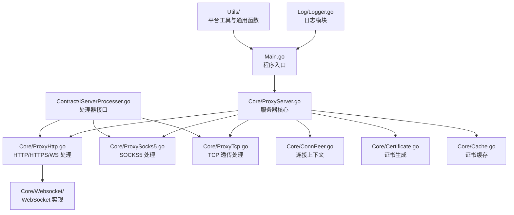
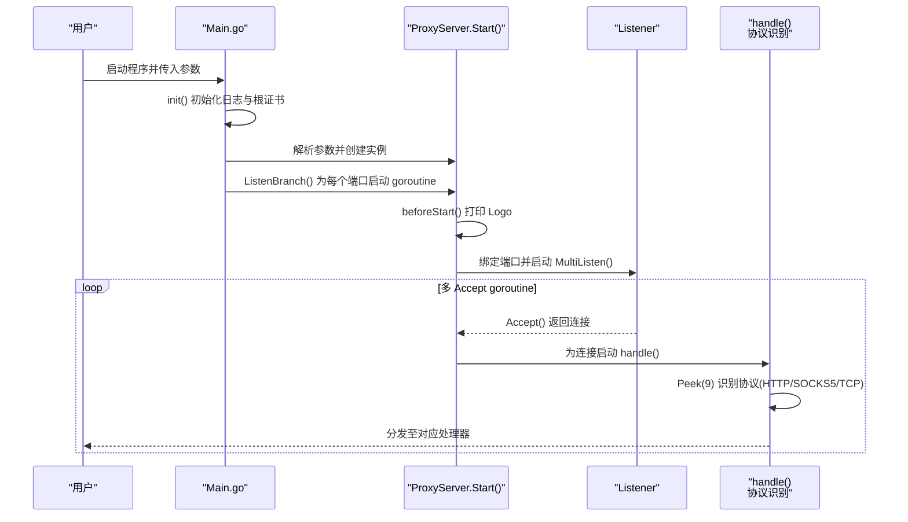
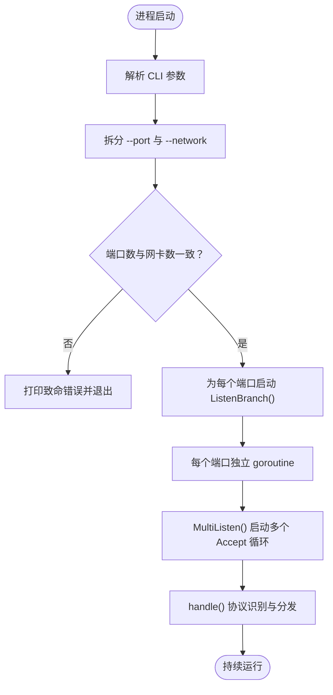
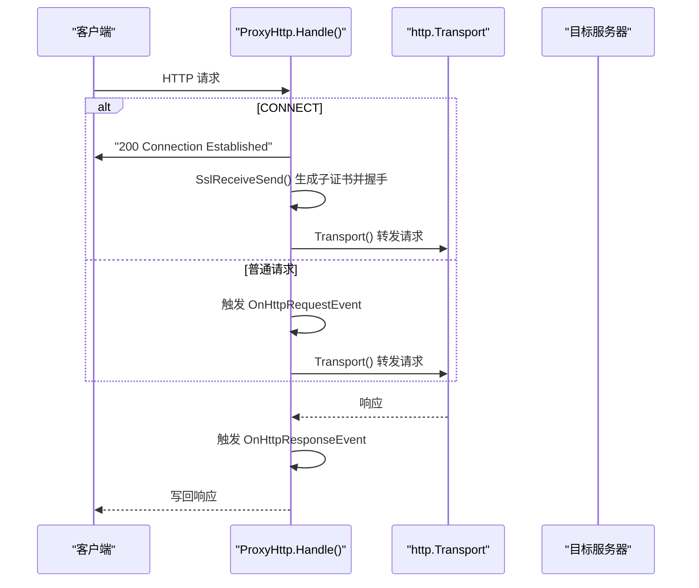
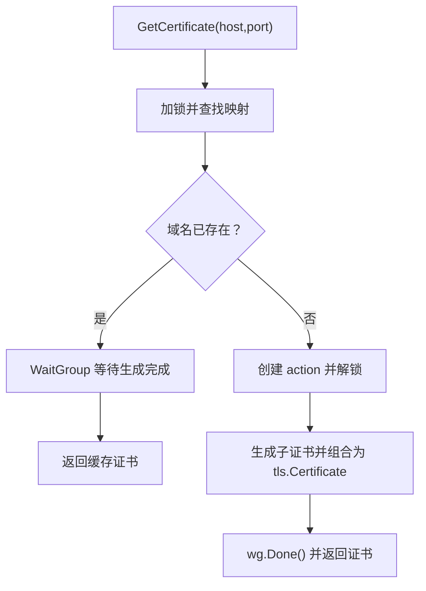
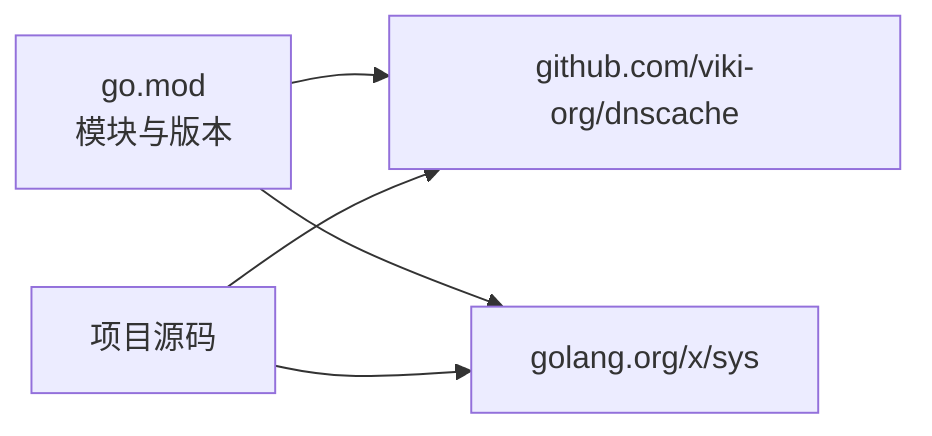

# 开发环境搭建

<cite>
**本文引用的文件**
- [go.mod](file://go.mod)
- [go.sum](file://go.sum)
- [Main.go](file://Main.go)
- [README.md](file://README.md)
- [.gitignore](file://.gitignore)
- [CODE-DOC.md](file://CODE-DOC.md)
- [Core/ProxyServer.go](file://Core/ProxyServer.go)
- [Core/ProxyHttp.go](file://Core/ProxyHttp.go)
- [Core/Cache_test.go](file://Core/Cache_test.go)
- [Utils/Utils_test.go](file://Utils/Utils_test.go)
</cite>

## 目录
1. [简介](#简介)
2. [项目结构](#项目结构)
3. [核心组件](#核心组件)
4. [架构总览](#架构总览)
5. [详细组件分析](#详细组件分析)
6. [依赖分析](#依赖分析)
7. [性能考虑](#性能考虑)
8. [故障排查指南](#故障排查指南)
9. [结论](#结论)
10. [附录](#附录)

## 简介
本指南面向希望在本地搭建并开发 Shermie-Proxy 的工程师，覆盖以下内容：
- Go 语言版本要求与环境准备
- 依赖安装与管理（go.mod/go.sum）
- 构建流程与运行方式
- IDE 配置建议（VS Code、GoLand）
- 代码格式化、静态分析与代码检查
- 版本控制工作流（提交规范与分支策略）
- 本地测试与验证方法

## 项目结构
该项目采用按功能模块组织的层次化结构，入口位于根目录，核心代理逻辑集中在 Core 目录，日志与工具分别位于 Log 与 Utils，常量与接口定义位于 Constant 与 Contract。

图表来源
- [Main.go:1-124](file://Main.go#L1-L124)
- [Core/ProxyServer.go:1-200](file://Core/ProxyServer.go#L1-L200)
- [Core/ProxyHttp.go:1-200](file://Core/ProxyHttp.go#L1-L200)

章节来源
- [Main.go:1-124](file://Main.go#L1-L124)
- [README.md:1-163](file://README.md#L1-L163)

## 核心组件
- 程序入口与 CLI 参数解析：Main.go 负责初始化日志与根证书，并解析 --port、--nagle、--proxy、--to、--network 等参数，随后为每个端口启动独立 goroutine 的服务实例。
- 服务器核心：Core/ProxyServer.go 提供监听、多 Accept goroutine、协议识别与分发、事件回调注册等能力。
- 协议处理器：HTTP/HTTPS/WS/WSS、SOCKS5、TCP 透传分别在 Core/ProxyHttp.go、Core/ProxySocks5.go、Core/ProxyTcp.go 中实现。
- 证书系统：Core/Certificate.go 与 Core/Cache.go 实现根证书生成与子证书缓存，支持并发安全与复用。
- 日志与工具：Log/Logger.go 提供统一日志；Utils/* 提供平台相关能力与通用工具函数。

章节来源
- [Main.go:24-124](file://Main.go#L24-L124)
- [Core/ProxyServer.go:48-137](file://Core/ProxyServer.go#L48-L137)
- [Core/ProxyHttp.go:29-132](file://Core/ProxyHttp.go#L29-L132)
- [CODE-DOC.md:30-79](file://CODE-DOC.md#L30-L79)

## 架构总览
下图展示从进程启动到连接处理的关键流程，包括 CLI 参数解析、服务器初始化、多端口监听与协议识别。

图表来源
- [Main.go:24-124](file://Main.go#L24-L124)
- [Core/ProxyServer.go:123-174](file://Core/ProxyServer.go#L123-L174)
- [Core/ProxyServer.go:176-200](file://Core/ProxyServer.go#L176-L200)

## 详细组件分析

### 组件一：服务器启动与参数解析
- CLI 参数
  - --port：监听端口，支持逗号分隔多端口，如 "9090,9091"
  - --nagle：是否启用 Nagle 算法（默认 true，实际底层调用 SetNoDelay(true)，表示低延迟模式）
  - --proxy：上级代理地址，格式 host:port
  - --to：TCP 透传目标地址（仅 TCP 协议生效）
  - --network：强制出口网卡 IP，多端口时需与 --port 数量一致
- 多端口与多网卡：每个端口独立 goroutine 启动，支持绑定不同出口网卡实现流量分流
- 协议识别：通过 Peek(9) 读取连接首字节，优先匹配 HTTP 方法前缀，其次识别 SOCKS5，否则按 TCP 处理

图表来源
- [Main.go:24-46](file://Main.go#L24-L46)
- [Main.go:48-124](file://Main.go#L48-L124)
- [Core/ProxyServer.go:156-174](file://Core/ProxyServer.go#L156-L174)
- [Core/ProxyServer.go:176-200](file://Core/ProxyServer.go#L176-L200)

章节来源
- [Main.go:24-124](file://Main.go#L24-L124)
- [README.md:148-163](file://README.md#L148-L163)
- [CODE-DOC.md:560-580](file://CODE-DOC.md#L560-L580)

### 组件二：HTTP/HTTPS/WS 处理器
- 请求入口：ProxyHttp.Handle() 读取请求，区分 CONNECT 与普通请求
- HTTPS 隧道：CONNECT 建立隧道后，执行 SslReceiveSend()，通过证书缓存生成子证书并与客户端完成 TLS 握手，再转发到目标服务器
- HTTP 转发：触发 OnHttpRequestEvent 回调（可修改请求体），使用 http.Transport.RoundTrip() 转发，读取响应体并触发 OnHttpResponseEvent（可修改响应体），最后写回客户端
- WebSocket：检测 Upgrade: websocket 后，分别升级客户端与目标 WS 连接，启动双向 goroutine 转发消息

图表来源
- [Core/ProxyHttp.go:44-132](file://Core/ProxyHttp.go#L44-L132)
- [Core/ProxyHttp.go:182-200](file://Core/ProxyHttp.go#L182-L200)

章节来源
- [Core/ProxyHttp.go:44-132](file://Core/ProxyHttp.go#L44-L132)
- [CODE-DOC.md:153-282](file://CODE-DOC.md#L153-L282)

### 组件三：证书系统与缓存
- 根证书：程序启动时生成或读取根证书（cert.crt/cert.key），作为中间人代理的信任基础
- 子证书：按目标域名动态生成子证书，使用 128 位随机序列号与 2 年有效期，支持 SAN 扩展
- 缓存：Storage 使用互斥锁与 WaitGroup 控制并发，同一域名仅生成一次证书，不同域名互不阻塞

图表来源
- [CODE-DOC.md:511-557](file://CODE-DOC.md#L511-L557)

章节来源
- [CODE-DOC.md:455-557](file://CODE-DOC.md#L455-L557)

## 依赖分析
- 模块与版本
  - 模块名：github.com/kxg3030/shermie-proxy
  - Go 版本：1.16
  - 依赖：
    - github.com/viki-org/dnscache：DNS 缓存（5 分钟 TTL）
    - golang.org/x/sys：系统调用（Windows 平台证书安装与代理设置）

图表来源
- [go.mod:1-9](file://go.mod#L1-L9)

章节来源
- [go.mod:1-9](file://go.mod#L1-L9)

## 性能考虑
- 多 Accept goroutine：默认启动 5 个 goroutine 并发接受连接，缓解高并发下的接受瓶颈
- Nagle 算法：--nagle 默认 true，底层调用 SetNoDelay(true)，即启用低延迟模式
- DNS 缓存：使用 viki-org/dnscache，TTL 5 分钟，减少重复解析开销
- 证书缓存：同一域名并发等待与复用，避免重复生成 RSA 密钥对

章节来源
- [Core/ProxyServer.go:156-174](file://Core/ProxyServer.go#L156-L174)
- [CODE-DOC.md:698-727](file://CODE-DOC.md#L698-L727)

## 故障排查指南
- 端口问题
  - 确认 --port 非 "0"，且 --port 与 --network 数量一致
  - 使用 Utils/Utils_test.go 中的端口检测函数辅助定位
- 证书问题
  - Windows 平台可调用 Install() 安装根证书并设置系统代理；其他平台需手动安装并从 /tls 下载证书
  - 若 TLS 握手失败，可借助反射工具读取内部数据进行诊断
- 日志定位
  - 日志统一由 Log/Logger.go 输出，关注连接建立、协议识别、转发过程中的错误信息

章节来源
- [Main.go:31-41](file://Main.go#L31-L41)
- [Core/ProxyServer.go:79-108](file://Core/ProxyServer.go#L79-L108)
- [Utils/Utils_test.go:40-89](file://Utils/Utils_test.go#L40-L89)

## 结论
本指南提供了从环境准备到本地验证的完整路径。遵循 Go 版本要求、正确安装依赖、理解构建与运行流程、配置 IDE、执行测试与验证，即可高效开展开发工作。

## 附录

### A. 开发环境搭建步骤
- 安装 Go
  - 版本要求：Go 1.16（见 go.mod）
- 克隆仓库并安装依赖
  - 使用 go mod tidy 自动下载与锁定依赖
- 构建与运行
  - 构建：go build -o shermie-proxy
  - 运行：./shermie-proxy --port 9090
  - 多端口示例：./shermie-proxy --port 9090,9091 --network 192.168.1.100,10.0.0.5
- 证书与代理
  - Windows：可调用 Install() 安装根证书并设置系统代理
  - 其他平台：访问 http://127.0.0.1/tls 下载证书并手动安装

章节来源
- [go.mod:3](file://go.mod#L3)
- [README.md:30-163](file://README.md#L30-L163)
- [Main.go:24-46](file://Main.go#L24-L46)
- [Core/ProxyServer.go:79-108](file://Core/ProxyServer.go#L79-L108)

### B. IDE 配置建议
- VS Code
  - 安装 Go 扩展，启用 gofmt/goimports 自动格式化
  - 配置 tasks.json 执行 go build、go test 等任务
  - 使用内置终端运行 ./shermie-proxy 并观察日志
- GoLand
  - 启用代码格式化与静态检查（go fmt、golint、go vet）
  - 配置运行配置，传入 --port、--proxy 等参数进行调试

（本节为通用建议，不直接分析具体文件）

### C. 代码格式化、静态分析与检查
- 格式化
  - 使用 gofmt 与 goimports，确保导入与格式一致
- 静态分析
  - golint：检查命名与注释风格
  - go vet：发现常见语法与逻辑问题
- 代码检查
  - gosec：敏感信息与安全问题扫描
  - staticcheck：更全面的静态检查

（本节为通用建议，不直接分析具体文件）

### D. 版本控制工作流
- 分支策略
  - 主分支：稳定发布
  - 开发分支：develop，合并功能分支
  - 功能分支：feature/*，修复分支：fix/*
- 提交规范
  - type(scope): subject
  - 示例：feat(Core): 添加证书缓存并发优化
- 提交前检查
  - 本地测试：go test ./...
  - 格式化：gofmt -w .
  - 静态检查：golint、go vet

章节来源
- [.gitignore:1-30](file://.gitignore#L1-L30)

### E. 本地测试与验证
- 单元测试
  - 证书缓存：TestGetCertificate_* 系列
  - 工具函数：TestFileExist、TestGetAvailablePort、TestIsPortAvailable
- 验证步骤
  - 运行 ./shermie-proxy --port 9090
  - 使用浏览器访问 http://127.0.0.1/tls 下载证书
  - 配置浏览器或系统代理指向 127.0.0.1:9090
  - 访问目标站点验证 HTTPS/WS/TCP 代理功能

章节来源
- [Core/Cache_test.go:24-173](file://Core/Cache_test.go#L24-L173)
- [Utils/Utils_test.go:10-89](file://Utils/Utils_test.go#L10-L89)
- [README.md:30-163](file://README.md#L30-L163)