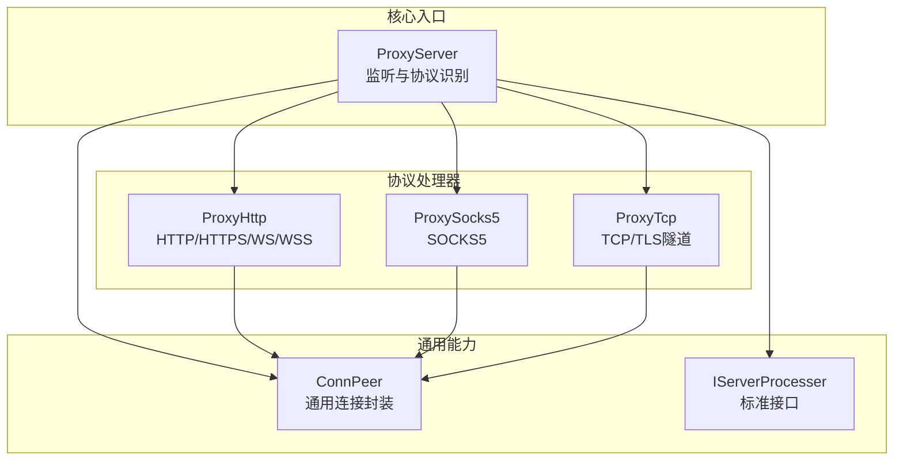
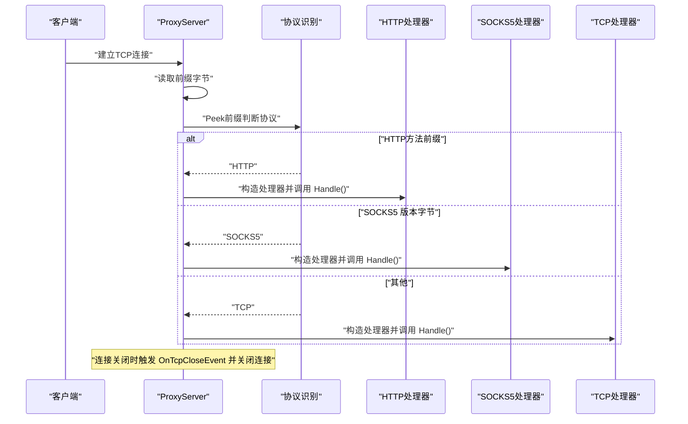
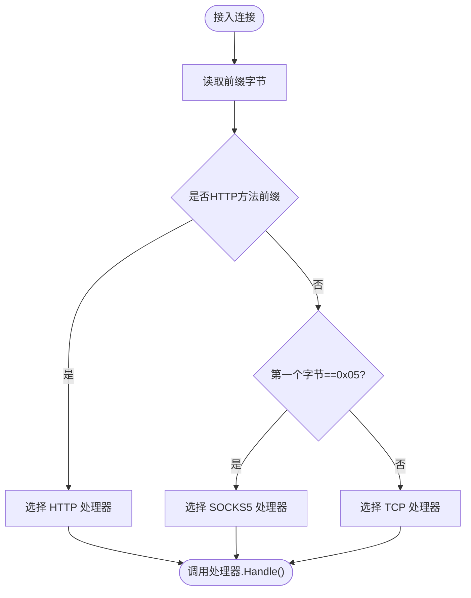
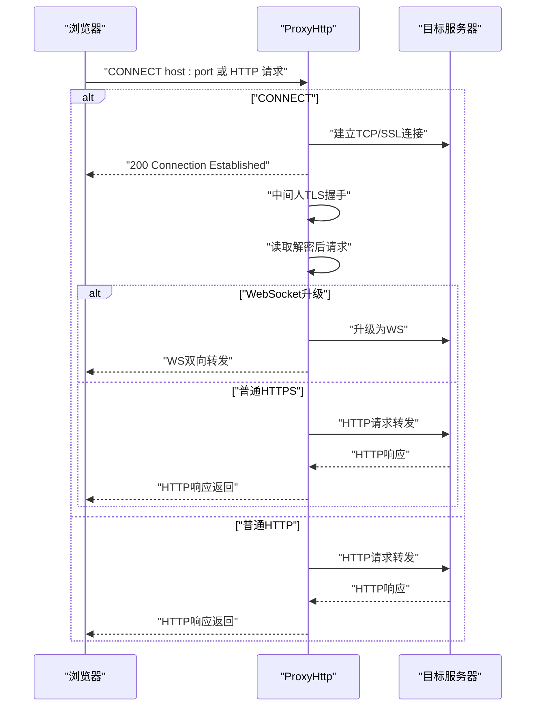
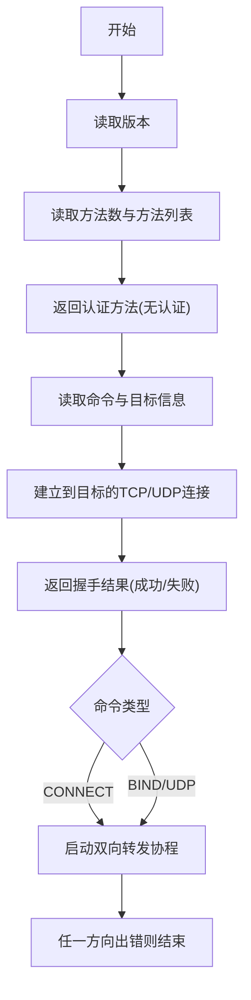
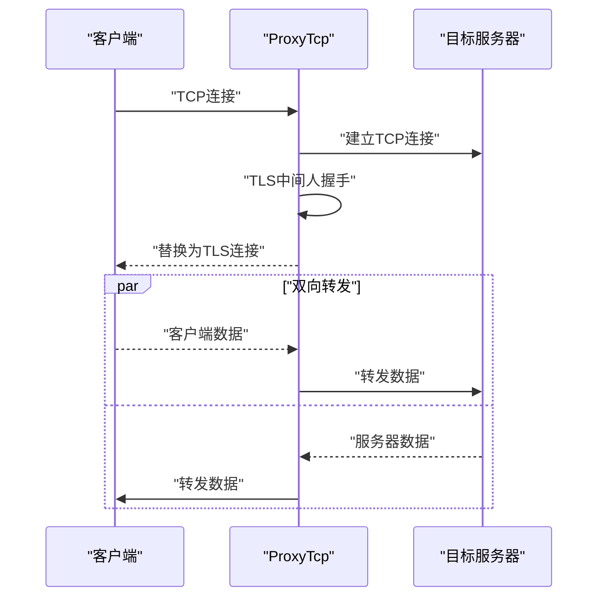
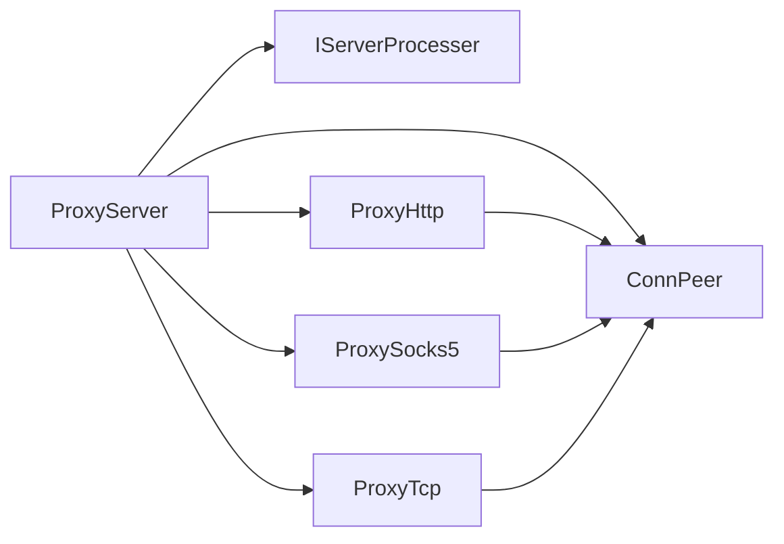

# 新协议开发

<cite>
**本文引用的文件**
- [Contract/IServerProcesser.go](file://Contract/IServerProcesser.go)
- [Core/ProxyServer.go](file://Core/ProxyServer.go)
- [Core/ConnPeer.go](file://Core/ConnPeer.go)
- [Core/ProxyHttp.go](file://Core/ProxyHttp.go)
- [Core/ProxySocks5.go](file://Core/ProxySocks5.go)
- [Core/ProxyTcp.go](file://Core/ProxyTcp.go)
- [Main.go](file://Main.go)
- [README.md](file://README.md)
- [CODE-DOC.md](file://CODE-DOC.md)
</cite>

## 目录
1. [简介](#简介)
2. [项目结构](#项目结构)
3. [核心组件](#核心组件)
4. [架构总览](#架构总览)
5. [详细组件分析](#详细组件分析)
6. [依赖分析](#依赖分析)
7. [性能考虑](#性能考虑)
8. [故障排查指南](#故障排查指南)
9. [结论](#结论)
10. [附录](#附录)

## 简介
本指南面向希望为代理服务器新增协议支持的开发者，围绕标准接口 IServerProcesser 的实现展开，结合现有 HTTP、SOCKS5、TCP 三种协议的实现模式，给出协议识别、握手流程、数据转发、异步处理、资源清理与测试调试的最佳实践。通过阅读本指南，您将能够：
- 明确如何实现 IServerProcesser 接口以接入新协议
- 掌握协议识别机制与握手流程处理
- 理解数据转发逻辑与事件回调的使用方式
- 学会正确处理异步操作、连接池与资源清理
- 了解测试方法与常见问题的排查思路

## 项目结构
该项目采用“接口 + 多协议处理器”的分层设计。核心入口负责监听与协议识别，具体协议由各自的处理器实现 IServerProcesser 接口。

图表来源
- [Core/ProxyServer.go:176-212](file://Core/ProxyServer.go#L176-L212)
- [Contract/IServerProcesser.go:3-5](file://Contract/IServerProcesser.go#L3-L5)
- [Core/ConnPeer.go:8-13](file://Core/ConnPeer.go#L8-L13)
- [Core/ProxyHttp.go:29-64](file://Core/ProxyHttp.go#L29-L64)
- [Core/ProxySocks5.go:15-54](file://Core/ProxySocks5.go#L15-L54)
- [Core/ProxyTcp.go:15-23](file://Core/ProxyTcp.go#L15-L23)

章节来源
- [Core/ProxyServer.go:176-212](file://Core/ProxyServer.go#L176-L212)
- [Contract/IServerProcesser.go:3-5](file://Contract/IServerProcesser.go#L3-L5)
- [Core/ConnPeer.go:8-13](file://Core/ConnPeer.go#L8-L13)

## 核心组件
- IServerProcesser 接口：定义统一的处理入口方法 Handle()，所有协议处理器均需实现该方法。
- ProxyServer：负责监听、协议识别、连接生命周期管理与事件回调注册。
- ConnPeer：封装底层网络连接、读写缓冲与父级服务上下文，供各协议处理器复用。
- 协议处理器：ProxyHttp、ProxySocks5、ProxyTcp 分别实现 HTTP/HTTPS/WS/WSS、SOCKS5、TCP/TLS 隧道的处理逻辑。

章节来源
- [Contract/IServerProcesser.go:3-5](file://Contract/IServerProcesser.go#L3-L5)
- [Core/ProxyServer.go:48-66](file://Core/ProxyServer.go#L48-L66)
- [Core/ConnPeer.go:8-13](file://Core/ConnPeer.go#L8-L13)
- [Core/ProxyHttp.go:29-64](file://Core/ProxyHttp.go#L29-L64)
- [Core/ProxySocks5.go:15-54](file://Core/ProxySocks5.go#L15-L54)
- [Core/ProxyTcp.go:15-23](file://Core/ProxyTcp.go#L15-L23)

## 架构总览
下图展示了从连接接入到协议分发、再到具体协议处理的整体流程。

图表来源
- [Core/ProxyServer.go:176-212](file://Core/ProxyServer.go#L176-L212)
- [Core/ProxyHttp.go:44-64](file://Core/ProxyHttp.go#L44-L64)
- [Core/ProxySocks5.go:54-90](file://Core/ProxySocks5.go#L54-L90)
- [Core/ProxyTcp.go:23-66](file://Core/ProxyTcp.go#L23-L66)

章节来源
- [Core/ProxyServer.go:176-212](file://Core/ProxyServer.go#L176-L212)

## 详细组件分析

### IServerProcesser 接口与实现规范
- 接口职责：定义统一的 Handle() 方法作为协议处理入口。
- 实现要求：
  - 在 Handle() 中完成协议识别、握手、数据转发与错误处理
  - 通过 ConnPeer 访问底层连接与服务上下文
  - 使用事件回调（如 OnXxxEvent）进行数据拦截与修改
  - 正确管理资源生命周期（连接关闭、通道退出）

章节来源
- [Contract/IServerProcesser.go:3-5](file://Contract/IServerProcesser.go#L3-L5)
- [Core/ConnPeer.go:8-13](file://Core/ConnPeer.go#L8-L13)

### 协议识别机制
- HTTP：通过 Peek 前缀判断是否为 HTTP 方法前缀集合之一
- SOCKS5：通过 Peek 第一个字节是否为版本号（0x05）
- 其他：默认按 TCP 处理

图表来源
- [Core/ProxyServer.go:176-212](file://Core/ProxyServer.go#L176-L212)
- [Core/ProxyServer.go:36-46](file://Core/ProxyServer.go#L36-L46)

章节来源
- [Core/ProxyServer.go:176-212](file://Core/ProxyServer.go#L176-L212)
- [Core/ProxyServer.go:36-46](file://Core/ProxyServer.go#L36-L46)

### HTTP/HTTPS/WS/WSS 处理器（ProxyHttp）
- 关键点
  - Handle()：解析请求、区分 CONNECT 与普通 HTTP；CONNECT 进入 TLS 隧道与 WebSocket 升级流程
  - handleSslRequest()：建立到目标的 TCP/SSL 连接，向客户端返回连接建立结果
  - SslReceiveSend()：中间人 TLS 握手、读取解密后的请求、判断是否升级为 WebSocket
  - handleWsRequest()：WebSocket 升级与双向转发
  - Transport()：基于 http.Transport 转发请求，移除 hop-by-hop 头，支持上游代理
  - DialContext()：DNS 缓存、IPv4 优先、网卡绑定、Nagle 控制
  - 事件回调：OnHttpRequestEvent、OnHttpResponseEvent、OnWsRequestEvent、OnWsResponseEvent

图表来源
- [Core/ProxyHttp.go:44-64](file://Core/ProxyHttp.go#L44-L64)
- [Core/ProxyHttp.go:206-231](file://Core/ProxyHttp.go#L206-L231)
- [Core/ProxyHttp.go:242-286](file://Core/ProxyHttp.go#L242-L286)
- [Core/ProxyHttp.go:288-434](file://Core/ProxyHttp.go#L288-L434)
- [Core/ProxyHttp.go:183-203](file://Core/ProxyHttp.go#L183-L203)
- [Core/ProxyHttp.go:436-468](file://Core/ProxyHttp.go#L436-L468)

章节来源
- [Core/ProxyHttp.go:29-64](file://Core/ProxyHttp.go#L29-L64)
- [Core/ProxyHttp.go:183-203](file://Core/ProxyHttp.go#L183-L203)
- [Core/ProxyHttp.go:242-286](file://Core/ProxyHttp.go#L242-L286)
- [Core/ProxyHttp.go:288-434](file://Core/ProxyHttp.go#L288-L434)
- [Core/ProxyHttp.go:436-468](file://Core/ProxyHttp.go#L436-L468)

### SOCKS5 处理器（ProxySocks5）
- 关键点
  - Handle()：读取版本、方法列表、协商认证、读取目标地址类型与端口、建立目标连接、返回握手结果
  - Transport()：双工转发，支持 OnSocks5RequestEvent 与 OnSocks5ResponseEvent 事件回调
  - 辅助方法：IPv4/IPv6 判断、字节转整型、UDP 支持

图表来源
- [Core/ProxySocks5.go:54-90](file://Core/ProxySocks5.go#L54-L90)
- [Core/ProxySocks5.go:95-126](file://Core/ProxySocks5.go#L95-L126)
- [Core/ProxySocks5.go:171-232](file://Core/ProxySocks5.go#L171-L232)
- [Core/ProxySocks5.go:242-284](file://Core/ProxySocks5.go#L242-L284)

章节来源
- [Core/ProxySocks5.go:15-54](file://Core/ProxySocks5.go#L15-L54)
- [Core/ProxySocks5.go:54-90](file://Core/ProxySocks5.go#L54-L90)
- [Core/ProxySocks5.go:95-126](file://Core/ProxySocks5.go#L95-L126)
- [Core/ProxySocks5.go:171-232](file://Core/ProxySocks5.go#L171-L232)
- [Core/ProxySocks5.go:242-284](file://Core/ProxySocks5.go#L242-L284)

### TCP 处理器（ProxyTcp）
- 关键点
  - Handle()：解析目标地址、建立 TCP 连接、执行 TLS 中间人握手、启动双向转发
  - Transport()：双工转发，支持 OnTcpServerStreamEvent 与 OnTcpClientStreamEvent 事件回调
  - 资源清理：defer 关闭目标连接

图表来源
- [Core/ProxyTcp.go:23-66](file://Core/ProxyTcp.go#L23-L66)
- [Core/ProxyTcp.go:68-111](file://Core/ProxyTcp.go#L68-L111)

章节来源
- [Core/ProxyTcp.go:15-23](file://Core/ProxyTcp.go#L15-L23)
- [Core/ProxyTcp.go:23-66](file://Core/ProxyTcp.go#L23-L66)
- [Core/ProxyTcp.go:68-111](file://Core/ProxyTcp.go#L68-L111)

### 事件回调与数据拦截
- HTTP：OnHttpRequestEvent、OnHttpResponseEvent
- SOCKS5：OnSocks5RequestEvent、OnSocks5ResponseEvent
- WebSocket：OnWsRequestEvent、OnWsResponseEvent
- TCP：OnTcpServerStreamEvent、OnTcpClientStreamEvent
- 使用方式：在 Main.go 中注册回调，处理器内部在合适时机调用 resolve 回调以写回数据或中断后续处理

章节来源
- [Core/ProxyServer.go:22-34](file://Core/ProxyServer.go#L22-L34)
- [Main.go:61-120](file://Main.go#L61-L120)

## 依赖分析
- 协议识别依赖于 ProxyServer 的 handle() 与 isHttpMethod()，以及对 ConnPeer 的封装
- 各协议处理器依赖 ConnPeer 提供的 reader、writer、conn 与 server 上下文
- HTTP 处理器依赖 http.Transport、TLS 与 WebSocket 升级能力
- SOCKS5 处理器依赖 net.Conn 与 TLS/UDP 拨号
- TCP 处理器依赖 TLS 中间人与双向转发

图表来源
- [Core/ProxyServer.go:176-212](file://Core/ProxyServer.go#L176-L212)
- [Contract/IServerProcesser.go:3-5](file://Contract/IServerProcesser.go#L3-L5)
- [Core/ConnPeer.go:8-13](file://Core/ConnPeer.go#L8-L13)
- [Core/ProxyHttp.go:29-64](file://Core/ProxyHttp.go#L29-L64)
- [Core/ProxySocks5.go:15-54](file://Core/ProxySocks5.go#L15-L54)
- [Core/ProxyTcp.go:15-23](file://Core/ProxyTcp.go#L15-L23)

章节来源
- [Core/ProxyServer.go:176-212](file://Core/ProxyServer.go#L176-L212)
- [Contract/IServerProcesser.go:3-5](file://Contract/IServerProcesser.go#L3-L5)
- [Core/ConnPeer.go:8-13](file://Core/ConnPeer.go#L8-L13)

## 性能考虑
- Nagle 算法控制：通过 DialContext/SetNoDelay 控制 TCP NoDelay，减少小包延迟
- DNS 缓存：使用 dnscache 缓存解析结果，降低解析开销
- 连接池：当前实现未显式维护连接池，建议在上游代理或目标连接处按需引入
- 异步转发：使用 goroutine 实现双向转发，注意通道与错误传播
- 超时控制：TLS 握手、HTTP 转发、WebSocket 握手均设置了相应超时

章节来源
- [Core/ProxyHttp.go:436-468](file://Core/ProxyHttp.go#L436-L468)
- [Core/ProxyServer.go:69-76](file://Core/ProxyServer.go#L69-L76)
- [Core/ProxyHttp.go:183-203](file://Core/ProxyHttp.go#L183-L203)
- [Core/ProxySocks5.go:182-195](file://Core/ProxySocks5.go#L182-L195)
- [Core/ProxyHttp.go:288-325](file://Core/ProxyHttp.go#L288-L325)

## 故障排查指南
- 协议识别失败
  - 检查 Peek 前缀与 isHttpMethod 的方法集合是否覆盖目标流量
  - 确认非 HTTP/非 SOCKS5 的流量被正确归类为 TCP
- TLS 握手异常
  - HTTP 中间人：检查证书生成与握手过程，必要时尝试解析原始 WebSocket 请求
  - TCP 中间人：确认证书可用且握手成功
- WebSocket 升级失败
  - 核对 Upgrade/Connection 头、Sec-WebSocket-* 头是否正确移除与透传
  - 检查握手超时与目标 WS 服务器可达性
- 数据转发异常
  - 核对事件回调返回值与写回长度，确保 readLen == writeLen
  - 关注 EOF 与非预期关闭错误，及时停止转发
- 资源清理
  - 确保连接关闭时触发 OnTcpCloseEvent 并关闭底层连接
  - SOCKS5/TCP 处理器在 defer 中关闭目标连接

章节来源
- [Core/ProxyServer.go:176-212](file://Core/ProxyServer.go#L176-L212)
- [Core/ProxyHttp.go:242-286](file://Core/ProxyHttp.go#L242-L286)
- [Core/ProxyHttp.go:288-434](file://Core/ProxyHttp.go#L288-L434)
- [Core/ProxySocks5.go:242-284](file://Core/ProxySocks5.go#L242-L284)
- [Core/ProxyTcp.go:68-111](file://Core/ProxyTcp.go#L68-L111)

## 结论
通过实现 IServerProcesser 接口并遵循现有协议处理器的设计模式，您可以快速为代理服务器添加新的协议支持。关键在于：
- 明确协议识别与握手流程
- 使用 ConnPeer 统一访问底层连接
- 通过事件回调实现数据拦截与修改
- 正确处理异步转发与资源清理
- 借助超时与错误处理保障稳定性

## 附录

### 新协议开发步骤清单
- 定义处理器结构体并嵌入 ConnPeer
- 实现 IServerProcesser 接口的 Handle() 方法
- 在 ProxyServer.handle() 中增加协议识别分支，返回对应处理器实例
- 在 Main.go 中注册必要的事件回调
- 编写单元测试与集成测试，覆盖握手、转发、错误场景
- 使用 README 中的参数说明进行本地验证

章节来源
- [Contract/IServerProcesser.go:3-5](file://Contract/IServerProcesser.go#L3-L5)
- [Core/ProxyServer.go:176-212](file://Core/ProxyServer.go#L176-L212)
- [Main.go:61-120](file://Main.go#L61-L120)
- [README.md:148-163](file://README.md#L148-L163)

### 参考实现与最佳实践
- HTTP：参考 [Core/ProxyHttp.go:44-64](file://Core/ProxyHttp.go#L44-L64)、[Core/ProxyHttp.go:183-203](file://Core/ProxyHttp.go#L183-L203)、[Core/ProxyHttp.go:242-286](file://Core/ProxyHttp.go#L242-L286)
- SOCKS5：参考 [Core/ProxySocks5.go:54-90](file://Core/ProxySocks5.go#L54-L90)、[Core/ProxySocks5.go:171-232](file://Core/ProxySocks5.go#L171-L232)
- TCP：参考 [Core/ProxyTcp.go:23-66](file://Core/ProxyTcp.go#L23-L66)、[Core/ProxyTcp.go:68-111](file://Core/ProxyTcp.go#L68-L111)

章节来源
- [Core/ProxyHttp.go:44-64](file://Core/ProxyHttp.go#L44-L64)
- [Core/ProxyHttp.go:183-203](file://Core/ProxyHttp.go#L183-L203)
- [Core/ProxyHttp.go:242-286](file://Core/ProxyHttp.go#L242-L286)
- [Core/ProxySocks5.go:54-90](file://Core/ProxySocks5.go#L54-L90)
- [Core/ProxySocks5.go:171-232](file://Core/ProxySocks5.go#L171-L232)
- [Core/ProxyTcp.go:23-66](file://Core/ProxyTcp.go#L23-L66)
- [Core/ProxyTcp.go:68-111](file://Core/ProxyTcp.go#L68-L111)