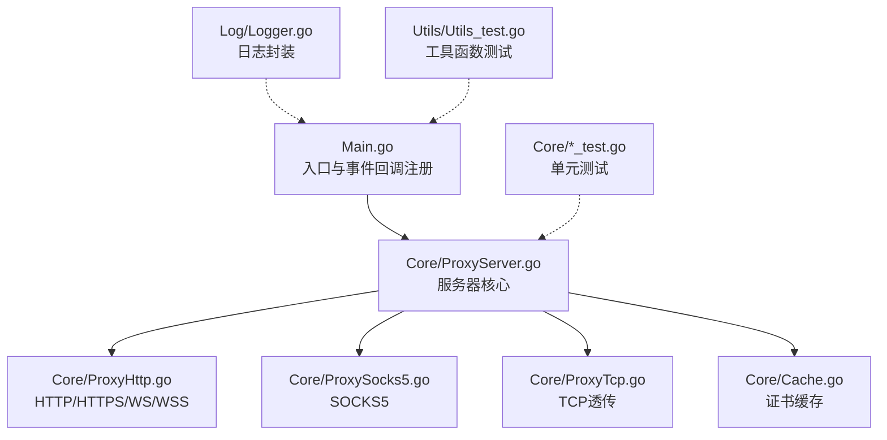
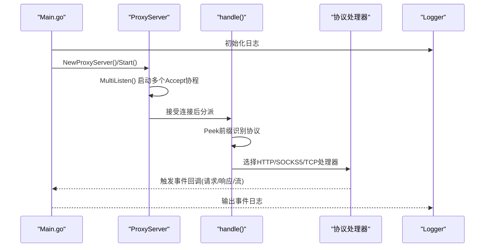
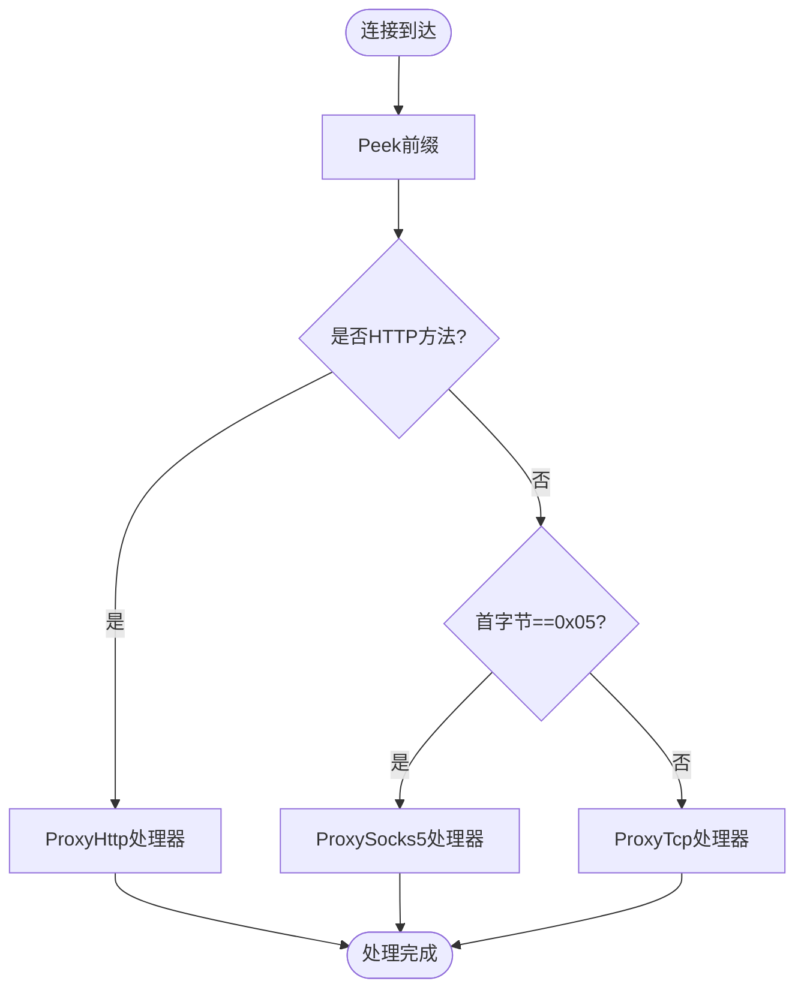
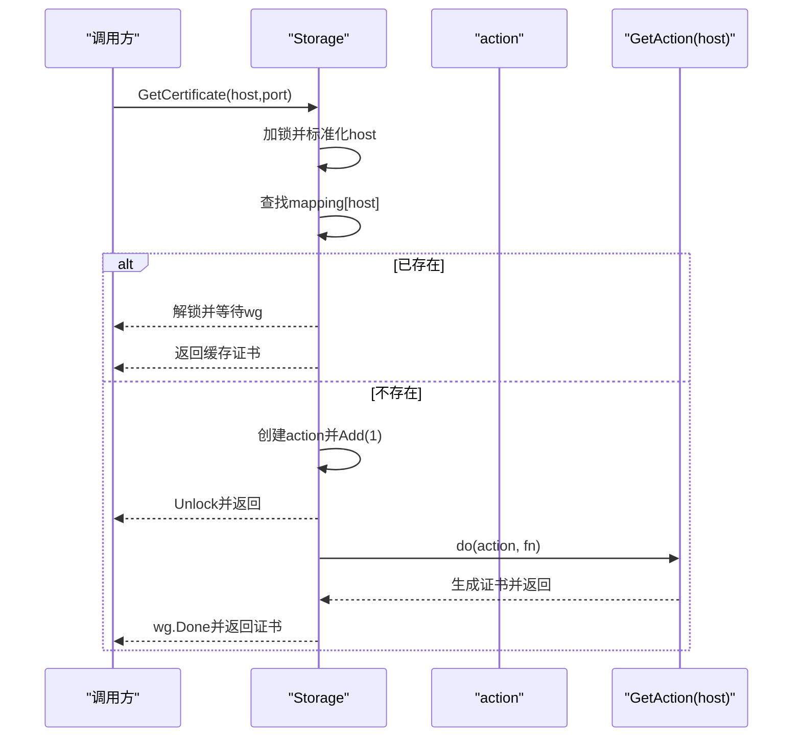
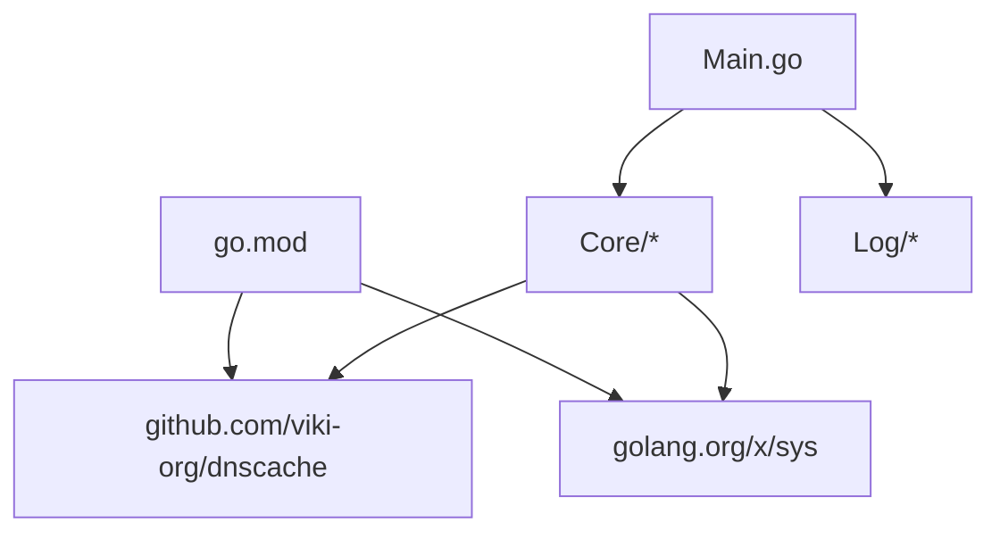

# 调试与测试

<cite>
**本文引用的文件**
- [Main.go](file://Main.go)
- [Logger.go](file://Log/Logger.go)
- [README.md](file://README.md)
- [README-CN.md](file://README-CN.md)
- [CODE-DOC.md](file://CODE-DOC.md)
- [ProxyServer.go](file://Core/ProxyServer.go)
- [Cache.go](file://Core/Cache.go)
- [Cache_test.go](file://Core/Cache_test.go)
- [ProxyHttp_test.go](file://Core/ProxyHttp_test.go)
- [ProxyServer_test.go](file://Core/ProxyServer_test.go)
- [ProxySocks5_test.go](file://Core/ProxySocks5_test.go)
- [Utils_test.go](file://Utils/Utils_test.go)
- [go.mod](file://go.mod)
</cite>

## 目录
1. [简介](#简介)
2. [项目结构](#项目结构)
3. [核心组件](#核心组件)
4. [架构总览](#架构总览)
5. [详细组件分析](#详细组件分析)
6. [依赖分析](#依赖分析)
7. [性能考虑](#性能考虑)
8. [故障排查指南](#故障排查指南)
9. [结论](#结论)
10. [附录](#附录)

## 简介
本文件面向 shermie-proxy 的调试与测试实践，覆盖日志系统使用、单元测试与集成测试策略、性能与压力测试方法、常见问题诊断以及测试覆盖率与持续集成建议。文档以仓库现有实现与测试文件为依据，提供可操作的指导与可视化图示。

## 项目结构
- 程序入口与事件回调注册：Main.go
- 日志模块：Log/Logger.go
- 核心代理逻辑：Core/ProxyServer.go、Core/Cache.go、Core/ProxyHttp.go、Core/ProxySocks5.go、Core/ProxyTcp.go
- 单元测试：Core/*_test.go、Utils/Utils_test.go
- 文档与说明：README.md、README-CN.md、CODE-DOC.md
- 依赖声明：go.mod

图表来源
- [Main.go:1-124](file://Main.go#L1-L124)
- [ProxyServer.go:1-200](file://Core/ProxyServer.go#L1-L200)
- [Logger.go:1-20](file://Log/Logger.go#L1-L20)

章节来源
- [Main.go:1-124](file://Main.go#L1-L124)
- [README.md:1-163](file://README.md#L1-L163)
- [README-CN.md:1-167](file://README-CN.md#L1-L167)
- [CODE-DOC.md:30-79](file://CODE-DOC.md#L30-L79)

## 核心组件
- 日志系统：统一的日志封装，初始化后通过全局变量输出时间戳与日期信息。
- 服务器核心：负责监听、多 Accept 并发、协议识别与分发、事件回调注册。
- 协议处理器：HTTP/HTTPS/WS/WSS、SOCKS5、TCP 透传。
- 证书缓存：并发安全的证书生成与缓存，避免重复生成。
- 工具函数：文件存在性、端口可用性、可用端口获取等。

章节来源
- [Logger.go:1-20](file://Log/Logger.go#L1-L20)
- [ProxyServer.go:48-77](file://Core/ProxyServer.go#L48-L77)
- [Cache.go:10-79](file://Core/Cache.go#L10-L79)

## 架构总览
下图展示从入口到核心处理的关键流程，以及日志与事件回调的交互位置。

图表来源
- [Main.go:24-124](file://Main.go#L24-L124)
- [ProxyServer.go:123-174](file://Core/ProxyServer.go#L123-L174)
- [ProxyServer.go:176-200](file://Core/ProxyServer.go#L176-L200)

## 详细组件分析

### 日志系统
- 初始化方式：在入口处调用日志初始化，设置标准日志输出格式（日期与时间）。
- 使用方式：通过全局日志变量输出信息；错误与异常通过 Fatal/Print 等方法输出。
- 建议：在开发与生产环境中可增加日志级别（如 Info/Warn/Error/Fatal），并支持输出到文件或结构化日志系统。

章节来源
- [Logger.go:17-19](file://Log/Logger.go#L17-L19)
- [Main.go:13-22](file://Main.go#L13-L22)
- [Main.go:61-106](file://Main.go#L61-L106)

### 服务器核心与协议识别
- 监听与并发：启动多个 Accept 协程提升连接接受吞吐量。
- 协议识别：通过 Peek 读取前缀，区分 HTTP 方法、SOCKS5 版本与其它协议。
- 事件回调：在请求/响应与流转发阶段提供回调钩子，便于拦截与修改。

图表来源
- [ProxyServer.go:176-200](file://Core/ProxyServer.go#L176-L200)

章节来源
- [ProxyServer.go:123-174](file://Core/ProxyServer.go#L123-L174)
- [ProxyServer.go:176-200](file://Core/ProxyServer.go#L176-L200)

### 证书缓存与并发控制
- 缓存结构：映射域名到动作对象，动作对象包含 WaitGroup 与生成函数。
- 并发策略：同一域名并发等待首个生成完成；不同域名并发互不影响。
- 生成流程：调用证书生成函数，组合为 tls.Certificate 返回。

图表来源
- [Cache.go:39-79](file://Core/Cache.go#L39-L79)

章节来源
- [Cache.go:10-79](file://Core/Cache.go#L10-L79)
- [Cache_test.go:24-173](file://Core/Cache_test.go#L24-L173)

### 单元测试策略与用例设计
- 测试组织：按功能模块拆分测试文件，如 HTTP 处理、SOCKS5 工具函数、工具函数等。
- 断言方法：使用标准库 testing 的断言与辅助函数，覆盖正常路径、边界条件与并发场景。
- 设计原则：
  - 每个测试聚焦单一行为，命名清晰描述期望。
  - 使用表驱动测试覆盖多种输入组合。
  - 并发测试使用 WaitGroup 等同步原语确保稳定性。
  - 使用临时目录与清理函数隔离测试环境。

章节来源
- [ProxyHttp_test.go:12-155](file://Core/ProxyHttp_test.go#L12-L155)
- [ProxyServer_test.go:5-79](file://Core/ProxyServer_test.go#L5-L79)
- [ProxySocks5_test.go:5-91](file://Core/ProxySocks5_test.go#L5-L91)
- [Utils_test.go:10-89](file://Utils/Utils_test.go#L10-L89)
- [Cache_test.go:10-173](file://Core/Cache_test.go#L10-L173)

### 集成测试策略
- 模拟客户端连接：通过 net.Listen/ListenTCP 本地监听，发起 TCP/HTTP/WS/SOCKS5 连接，验证事件回调与数据转发。
- 模拟服务器响应：在目标端口启动简单 HTTP/WS 服务，验证代理转发与回调修改。
- 网络异常模拟：断开连接、超时、非法数据包，验证错误处理与资源释放。
- 证书与中间人：HTTPS 场景下验证根证书安装、子证书生成与 TLS 握手失败回退。

章节来源
- [Main.go:61-106](file://Main.go#L61-L106)
- [ProxyServer.go:123-174](file://Core/ProxyServer.go#L123-L174)
- [CODE-DOC.md:455-557](file://CODE-DOC.md#L455-L557)

### 性能与压力测试
- 并发连接数：使用多个 goroutine 并发发起连接，观察 MultiListen 的吞吐表现。
- 内存与 CPU：结合 pprof 采集 CPU/内存 profile，定位热点与内存增长点。
- 压力指标：QPS、延迟分布、连接建立耗时、证书生成耗时（并发场景）。
- 建议工具：go test -bench、go pprof、系统监控工具（如 top/htop、iostat）。

章节来源
- [ProxyServer.go:156-174](file://Core/ProxyServer.go#L156-L174)
- [Cache.go:39-79](file://Core/Cache.go#L39-L79)

## 依赖分析
- go.mod 声明了 dnscache 与 x/sys 依赖，分别用于 DNS 缓存与系统调用。
- 项目内部模块间依赖清晰：入口依赖核心与日志；核心模块内部按协议拆分。

图表来源
- [go.mod:5-9](file://go.mod#L5-L9)
- [Main.go:3-11](file://Main.go#L3-L11)

章节来源
- [go.mod:1-9](file://go.mod#L1-L9)

## 性能考虑
- 多 Accept 并发：通过多个 goroutine 提升连接接受能力，适合高并发场景。
- Nagle 算法：默认启用低延迟模式（禁用 Nagle），可根据业务调整。
- DNS 缓存：固定 5 分钟 TTL，降低解析开销。
- 证书缓存：并发安全的证书生成与复用，避免重复计算。

章节来源
- [CODE-DOC.md:722-727](file://CODE-DOC.md#L722-L727)
- [CODE-DOC.md:698-703](file://CODE-DOC.md#L698-L703)
- [CODE-DOC.md:704-709](file://CODE-DOC.md#L704-L709)
- [CODE-DOC.md:710-715](file://CODE-DOC.md#L710-L715)

## 故障排查指南
- 启动失败与端口问题：检查端口参数与端口占用，必要时使用可用端口探测工具。
- 证书相关问题：确认根证书生成与安装，Windows 平台可使用系统代理设置；非 Windows 平台需手动安装证书并通过特殊路径下载。
- 协议识别异常：确认客户端发送数据满足协议格式，避免误判。
- 事件回调未触发：检查回调注册位置与返回值语义，确保返回 true/false 符合预期。
- 日志定位：利用日志输出定位连接建立、协议识别、事件回调触发等关键节点。

章节来源
- [Main.go:24-46](file://Main.go#L24-L46)
- [Main.go:61-106](file://Main.go#L61-L106)
- [ProxyServer.go:123-174](file://Core/ProxyServer.go#L123-L174)
- [CODE-DOC.md:560-580](file://CODE-DOC.md#L560-L580)

## 结论
本项目提供了清晰的入口、完善的日志与事件回调机制、并发安全的证书缓存与多协议处理能力。结合现有单元测试与建议的集成/性能测试策略，可有效保障代理服务的稳定性与可观测性。建议在持续集成中引入覆盖率统计与性能回归检查，以维持长期质量。

## 附录

### 日志系统使用指南
- 初始化：在应用启动时调用日志初始化，确保输出格式符合预期。
- 输出：在关键路径（连接建立、协议识别、事件回调）输出日志，便于问题定位。
- 级别与格式：建议扩展日志级别与结构化输出，便于生产环境收集与检索。

章节来源
- [Logger.go:17-19](file://Log/Logger.go#L17-L19)
- [Main.go:13-22](file://Main.go#L13-L22)

### 单元测试编写指南
- 表驱动测试：使用表格形式覆盖多种输入与期望输出。
- 并发测试：使用 WaitGroup 与 goroutine 并发调用，验证并发安全性。
- 环境隔离：使用临时目录与清理函数，避免测试相互影响。
- 断言风格：使用标准库断言，明确错误与边界条件。

章节来源
- [Cache_test.go:10-173](file://Core/Cache_test.go#L10-L173)
- [ProxyHttp_test.go:12-155](file://Core/ProxyHttp_test.go#L12-L155)
- [ProxyServer_test.go:5-79](file://Core/ProxyServer_test.go#L5-L79)
- [ProxySocks5_test.go:5-91](file://Core/ProxySocks5_test.go#L5-L91)
- [Utils_test.go:10-89](file://Utils/Utils_test.go#L10-L89)

### 集成测试实施要点
- 客户端连接：通过本地监听与连接，验证事件回调与数据转发。
- 服务器响应：在目标端口启动简单服务，验证代理转发与回调修改。
- 网络异常：断开、超时、非法数据包，验证错误处理与资源释放。
- 证书与中间人：HTTPS 场景验证根证书安装、子证书生成与回退逻辑。

章节来源
- [Main.go:61-106](file://Main.go#L61-L106)
- [CODE-DOC.md:455-557](file://CODE-DOC.md#L455-L557)

### 性能与压力测试方法
- 并发连接：使用多个 goroutine 发起连接，评估 MultiListen 吞吐。
- 内存与 CPU：结合 pprof 采集 CPU/内存 profile，定位热点。
- 指标：QPS、延迟分布、连接建立耗时、证书生成耗时（并发）。

章节来源
- [ProxyServer.go:156-174](file://Core/ProxyServer.go#L156-L174)
- [Cache.go:39-79](file://Core/Cache.go#L39-L79)

### 测试覆盖率与持续集成建议
- 覆盖率要求：建议对核心模块（协议处理、证书缓存、工具函数）达到较高覆盖率，并对关键路径进行回归测试。
- 持续集成：在 CI 中执行单元测试、集成测试与性能回归检查，结合覆盖率报告与性能指标阈值，确保质量门禁。

章节来源
- [go.mod:1-9](file://go.mod#L1-L9)