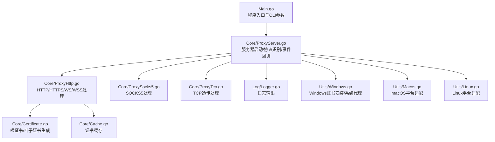
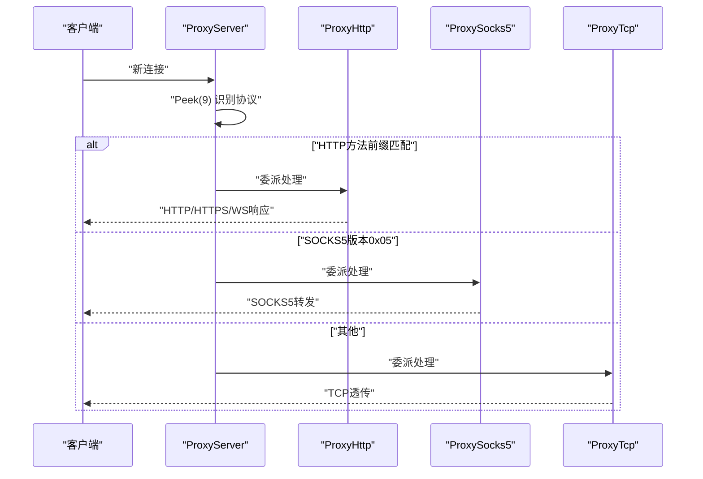
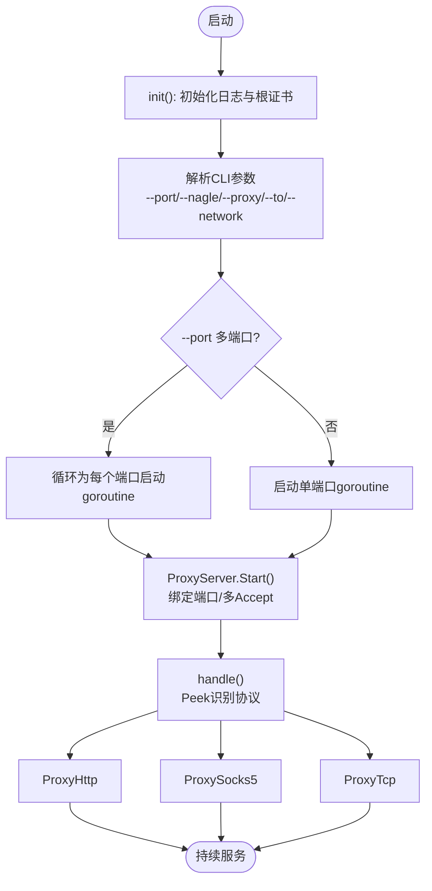
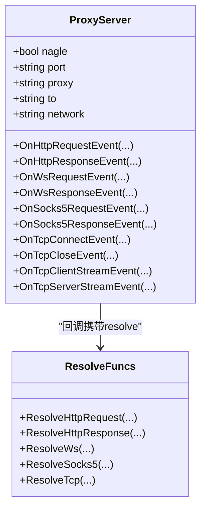
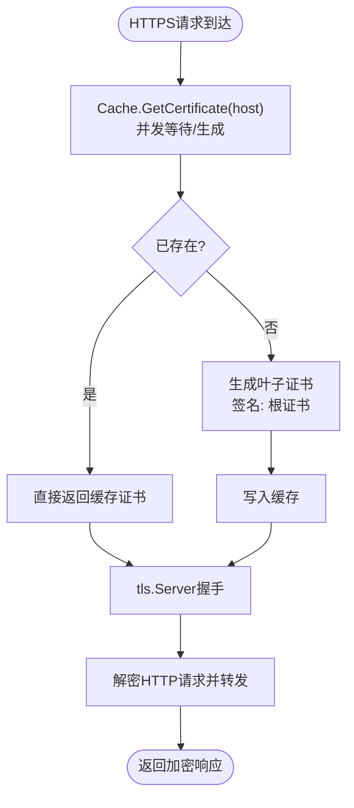
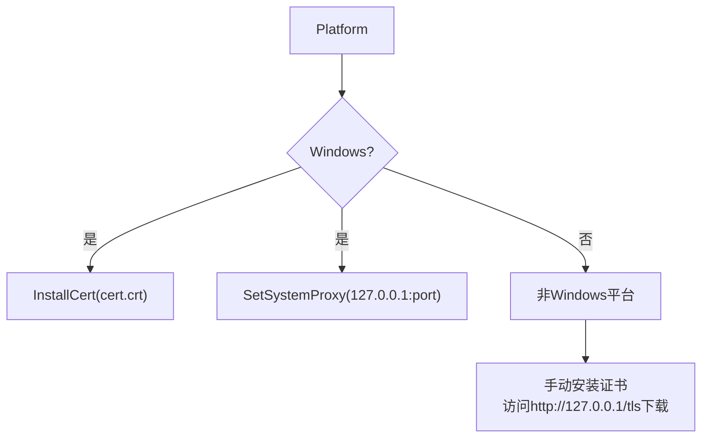
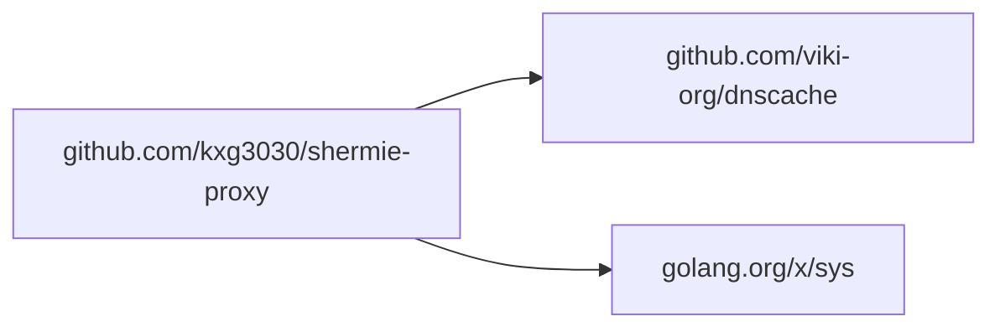

# 快速开始

<cite>
**本文引用的文件**
- [README.md](file://README.md)
- [README-CN.md](file://README-CN.md)
- [Main.go](file://Main.go)
- [go.mod](file://go.mod)
- [CODE-DOC.md](file://CODE-DOC.md)
- [Core/ProxyServer.go](file://Core/ProxyServer.go)
- [Utils/Windows.go](file://Utils/Windows.go)
- [Utils/Macos.go](file://Utils/Macos.go)
- [Utils/Linux.go](file://Utils/Linux.go)
</cite>

## 目录
1. [简介](#简介)
2. [项目结构](#项目结构)
3. [核心组件](#核心组件)
4. [架构总览](#架构总览)
5. [详细组件分析](#详细组件分析)
6. [依赖分析](#依赖分析)
7. [性能考虑](#性能考虑)
8. [故障排除指南](#故障排除指南)
9. [结论](#结论)
10. [附录](#附录)

## 简介
Shermie-Proxy 是一个基于 Go 的多功能代理服务器，支持在同一端口上自动识别并处理 HTTP、HTTPS、WebSocket（WS/WSS）、TCP 透传和 SOCKS5 协议。它提供事件回调机制，允许在请求/响应各阶段拦截和修改数据；内置 TLS 中间人能力，可对 HTTPS 流量进行解密与修改；支持多端口监听与多网卡绑定，以及通过上级代理进行链式代理。

## 项目结构
- 程序入口与 CLI 参数解析：Main.go
- 核心代理逻辑：Core/ProxyServer.go 以及各协议处理器（HTTP/HTTPS/WS/WSS、SOCKS5、TCP）
- 证书系统：Core/Certificate.go、Core/Cache.go
- 平台适配：Utils/Windows.go、Utils/Macos.go、Utils/Linux.go
- 日志模块：Log/Logger.go
- 接口契约：Contract/IServerProcesser.go
- 文档与说明：CODE-DOC.md、README.md、README-CN.md

图表来源
- [Main.go:1-124](file://Main.go#L1-L124)
- [Core/ProxyServer.go:1-200](file://Core/ProxyServer.go#L1-L200)
- [CODE-DOC.md:30-79](file://CODE-DOC.md#L30-L79)

章节来源
- [Main.go:1-124](file://Main.go#L1-L124)
- [CODE-DOC.md:30-79](file://CODE-DOC.md#L30-L79)

## 核心组件
- 服务器核心（ProxyServer）：负责监听端口、多 Accept 并发、协议识别与分发、事件回调注册、DNS 缓存、系统证书安装与系统代理设置（Windows）。
- 协议处理器：
  - ProxyHttp：HTTP/HTTPS/WS/WSS 处理，含 TLS 中间人、WebSocket 双向桥接、HTTP 转发器与 DNS 缓存拨号。
  - ProxySocks5：SOCKS5 握手与双向转发。
  - ProxyTcp：TCP 透传，支持固定目标（--to）与可选 TLS。
- 证书系统：根证书生成与持久化（cert.crt/cert.key），按域名动态生成叶子证书，并并发缓存。
- 平台适配：Windows 支持证书安装与系统代理设置；macOS/Linux 返回“不支持”提示。

章节来源
- [Core/ProxyServer.go:48-96](file://Core/ProxyServer.go#L48-L96)
- [CODE-DOC.md:151-452](file://CODE-DOC.md#L151-L452)

## 架构总览
Shermie-Proxy 采用“单端口多协议”的架构：每个连接到达后，先通过 Peek 读取前若干字节进行协议识别，再将连接委派给对应处理器。服务器启动时会打印 Logo，绑定监听端口，并启动多个 Accept goroutine 提升吞吐。Windows 平台可一键安装根证书并设置系统代理，其他平台需手动安装证书并通过代理客户端或系统代理指向本地端口。

图表来源
- [Core/ProxyServer.go:176-201](file://Core/ProxyServer.go#L176-L201)
- [CODE-DOC.md:101-124](file://CODE-DOC.md#L101-L124)

## 详细组件分析

### 服务器启动与协议识别
- 启动流程：init() 初始化日志与根证书；Main.main() 解析 CLI 参数；根据 --port 启动多个 goroutine，每个 goroutine 启动一个完整的 ProxyServer；主 goroutine select {} 保持运行。
- 协议识别：handle() 使用 bufio.Reader.Peek(9) 读取连接首字节，若匹配 HTTP 方法前缀则走 ProxyHttp，若首字节为 0x05 则走 ProxySocks5，否则走 ProxyTcp。
- 多 Accept 并发：MultiListen() 启动 5 个 goroutine 并发 Accept，提升高并发下的连接接受能力。

图表来源
- [Main.go:24-46](file://Main.go#L24-L46)
- [Core/ProxyServer.go:123-174](file://Core/ProxyServer.go#L123-L174)
- [Core/ProxyServer.go:176-201](file://Core/ProxyServer.go#L176-L201)

章节来源
- [Main.go:24-46](file://Main.go#L24-L46)
- [Core/ProxyServer.go:123-174](file://Core/ProxyServer.go#L123-L174)
- [Core/ProxyServer.go:176-201](file://Core/ProxyServer.go#L176-L201)

### 事件回调系统
- ProxyServer 暴露多种事件回调，可在请求/响应各阶段拦截与修改数据。回调均提供一个 resolve 函数，调用 resolve 完成默认行为；返回值决定是否继续默认处理。
- 常用回调：
  - HTTP 请求/响应：OnHttpRequestEvent、OnHttpResponseEvent
  - WebSocket 请求/响应：OnWsRequestEvent、OnWsResponseEvent
  - SOCKS5 请求/响应：OnSocks5RequestEvent、OnSocks5ResponseEvent
  - TCP 连接与流：OnTcpConnectEvent、OnTcpCloseEvent、OnTcpClientStreamEvent、OnTcpServerStreamEvent

图表来源
- [Core/ProxyServer.go:22-66](file://Core/ProxyServer.go#L22-L66)
- [CODE-DOC.md:394-451](file://CODE-DOC.md#L394-L451)

章节来源
- [Core/ProxyServer.go:22-66](file://Core/ProxyServer.go#L22-L66)
- [CODE-DOC.md:394-451](file://CODE-DOC.md#L394-L451)

### 证书系统与 TLS 中间人
- 根证书：首次运行会在工作目录生成 cert.crt/cert.key；Windows 平台可通过 Install() 安装至系统 Root 证书存储。
- 叶子证书：按域名动态生成，使用 128 位随机序列号与 2 年有效期，包含 SAN（DNS/IP）。
- 缓存：并发安全的证书缓存，同一域名并发请求仅生成一次证书，后续请求等待复用。

图表来源
- [CODE-DOC.md:455-557](file://CODE-DOC.md#L455-L557)
- [Core/ProxyServer.go:79-96](file://Core/ProxyServer.go#L79-L96)

章节来源
- [CODE-DOC.md:455-557](file://CODE-DOC.md#L455-L557)
- [Core/ProxyServer.go:79-96](file://Core/ProxyServer.go#L79-L96)

### 平台适配与系统代理
- Windows：支持 InstallCert() 安装根证书至系统 Root 存储，SetSystemProxy() 通过 WinInet 动态设置系统代理（含旁路规则）。
- macOS/Linux：InstallCert()/SetSystemProxy() 返回“不支持”，需手动安装证书并通过代理客户端或系统代理指向本地端口。

图表来源
- [Utils/Windows.go:18-50](file://Utils/Windows.go#L18-L50)
- [Utils/Windows.go:52-122](file://Utils/Windows.go#L52-L122)
- [Utils/Macos.go:8-16](file://Utils/Macos.go#L8-L16)
- [Utils/Linux.go:8-16](file://Utils/Linux.go#L8-L16)

章节来源
- [Utils/Windows.go:18-50](file://Utils/Windows.go#L18-L50)
- [Utils/Windows.go:52-122](file://Utils/Windows.go#L52-L122)
- [Utils/Macos.go:8-16](file://Utils/Macos.go#L8-L16)
- [Utils/Linux.go:8-16](file://Utils/Linux.go#L8-L16)

## 依赖分析
- 运行时要求：Go 1.16
- 第三方依赖：
  - viki-org/dnscache：DNS 缓存（5 分钟 TTL）
  - golang.org/x/sys：Windows 系统调用（证书安装、代理设置）

图表来源
- [go.mod:5-8](file://go.mod#L5-L8)

章节来源
- [go.mod:3-8](file://go.mod#L3-L8)

## 性能考虑
- 多 Accept 并发：MultiListen() 启动 5 个 goroutine 并发 Accept，缓解高并发下的连接接受瓶颈。
- Nagle 算法控制：--nagle true 表示启用 Nagle（底层 SetNoDelay(true) 实际上是禁用 Nagle，即低延迟模式）。默认值 true 意味着默认以低延迟模式运行。
- DNS 缓存：5 分钟 TTL，减少重复解析开销，提升 HTTPS/TLS 握手效率。
- 证书缓存：并发等待同一域名证书生成，避免重复的 RSA 密钥生成开销。

章节来源
- [Core/ProxyServer.go:156-174](file://Core/ProxyServer.go#L156-L174)
- [CODE-DOC.md:569-579](file://CODE-DOC.md#L569-L579)
- [CODE-DOC.md:698-703](file://CODE-DOC.md#L698-L703)
- [CODE-DOC.md:710-715](file://CODE-DOC.md#L710-L715)

## 故障排除指南
- 端口占用或无效
  - 确认 --port 非空且未被占用；可使用系统工具检查端口占用情况。
  - 多端口与多网卡：--port 与 --network 数量必须一致，否则会报错。
- 证书相关
  - Windows：可调用 Install() 安装根证书；访问 http://127.0.0.1/tls 下载根证书文件（非 Windows 平台亦可访问）。
  - macOS/Linux：返回“不支持”，需手动安装证书并设置系统代理。
- Nagle 算法与延迟
  - --nagle true 表示启用 Nagle（低延迟模式关闭），如需更高吞吐可调整为 false（底层 SetNoDelay(false)）。
- 上级代理
  - --proxy 指定上级代理 host:port；HTTP 转发器会使用该代理进行链式代理。
- TCP 透传
  - --to 指定目标服务器地址（仅 TCP 协议生效）；如目标为 443 端口，将尝试 TLS 握手。
- 平台差异
  - Windows：支持一键安装证书与系统代理设置。
  - macOS/Linux：不支持自动安装证书与系统代理，需手动配置。

章节来源
- [Main.go:30-45](file://Main.go#L30-L45)
- [Core/ProxyServer.go:79-108](file://Core/ProxyServer.go#L79-L108)
- [CODE-DOC.md:564-571](file://CODE-DOC.md#L564-L571)
- [CODE-DOC.md:579](file://CODE-DOC.md#L579)

## 结论
Shermie-Proxy 提供了“单端口多协议”的强大代理能力，结合事件回调与 TLS 中间人，适合开发调试、流量分析与协议测试场景。通过合理的 CLI 参数配置（端口、Nagle、上级代理、TCP 目标、网卡绑定）与平台适配，可在不同操作系统上快速部署与使用。

## 附录

### 快速开始：安装与编译
- 环境要求：Go 1.16+
- 获取源码与依赖
  - 使用 go mod 自动拉取依赖
- 编译二进制
  - go build -o shermie-proxy .
- 运行方式
  - 直接运行：go run Main.go --port 9090 --nagle=true
  - 或运行已编译二进制：./shermie-proxy --port 9090

章节来源
- [go.mod:3](file://go.mod#L3)
- [README.md:32-35](file://README.md#L32-L35)
- [README-CN.md:31-34](file://README-CN.md#L31-L34)

### 基本使用示例
- 启动服务器
  - ./shermie-proxy --port 9090
- 配置监听端口
  - ./shermie-proxy --port 9090,9091
- 设置代理参数
  - ./shermie-proxy --port 9090 --proxy 127.0.0.1:8080
- TCP 透传目标
  - ./shermie-proxy --port 9090 --to example.com:80
- 网卡绑定（多端口时一一对应）
  - ./shermie-proxy --port 9090,9091 --network 192.168.1.100,10.0.0.5
- Nagle 算法控制
  - ./shermie-proxy --port 9090 --nagle=false

章节来源
- [Main.go:24-29](file://Main.go#L24-L29)
- [CODE-DOC.md:564-571](file://CODE-DOC.md#L564-L571)

### 常见配置选项说明
- --port：监听端口，默认 9090；支持逗号分隔多端口
- --nagle：是否启用 Nagle 算法，默认 true（实际为低延迟模式）
- --proxy：上级代理地址，格式 host:port
- --to：TCP 透传目标地址（仅 TCP 生效）
- --network：强制使用的出口网卡 IP 地址；多端口时需与 --port 数量一致

章节来源
- [CODE-DOC.md:564-571](file://CODE-DOC.md#L564-L571)

### 不同平台差异
- Windows
  - 支持 InstallCert() 安装根证书至系统 Root 存储
  - 支持 SetSystemProxy() 通过 WinInet 动态设置系统代理
- macOS/Linux
  - 不支持自动安装证书与系统代理，需手动安装证书并通过代理客户端或系统代理指向本地端口

章节来源
- [Utils/Windows.go:18-50](file://Utils/Windows.go#L18-L50)
- [Utils/Windows.go:52-122](file://Utils/Windows.go#L52-L122)
- [Utils/Macos.go:8-16](file://Utils/Macos.go#L8-L16)
- [Utils/Linux.go:8-16](file://Utils/Linux.go#L8-L16)

### 常见问题解答
- 如何查看根证书？
  - 访问 http://127.0.0.1/tls 下载根证书文件
- 为什么 macOS/Linux 不支持自动安装证书与系统代理？
  - 平台限制，需手动安装证书并设置系统代理
- 多端口与多网卡如何正确配置？
  - --port 与 --network 数量必须一致，一一对应
- 为什么 HTTPS 无法访问？
  - 需要安装根证书并信任；Windows 可一键安装，其他平台需手动安装

章节来源
- [Core/ProxyServer.go:79-96](file://Core/ProxyServer.go#L79-L96)
- [Main.go:39-41](file://Main.go#L39-L41)
- [CODE-DOC.md:583-603](file://CODE-DOC.md#L583-L603)