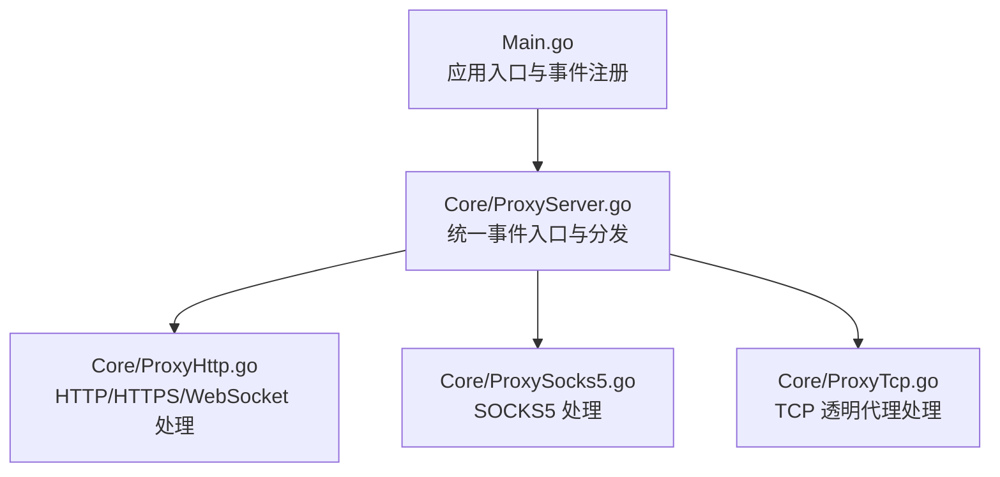
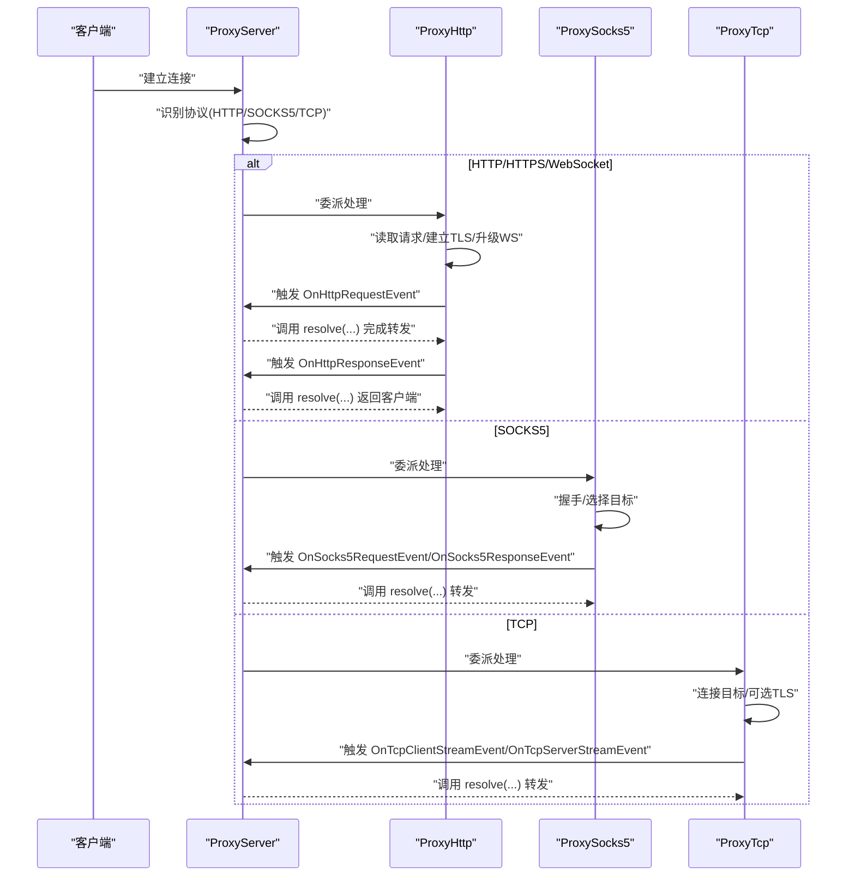
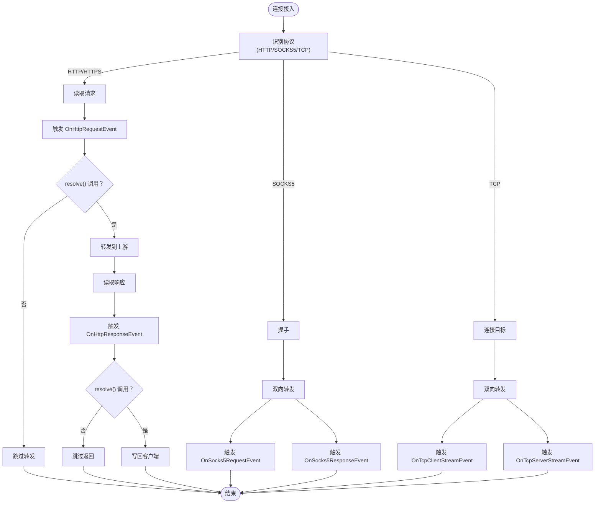
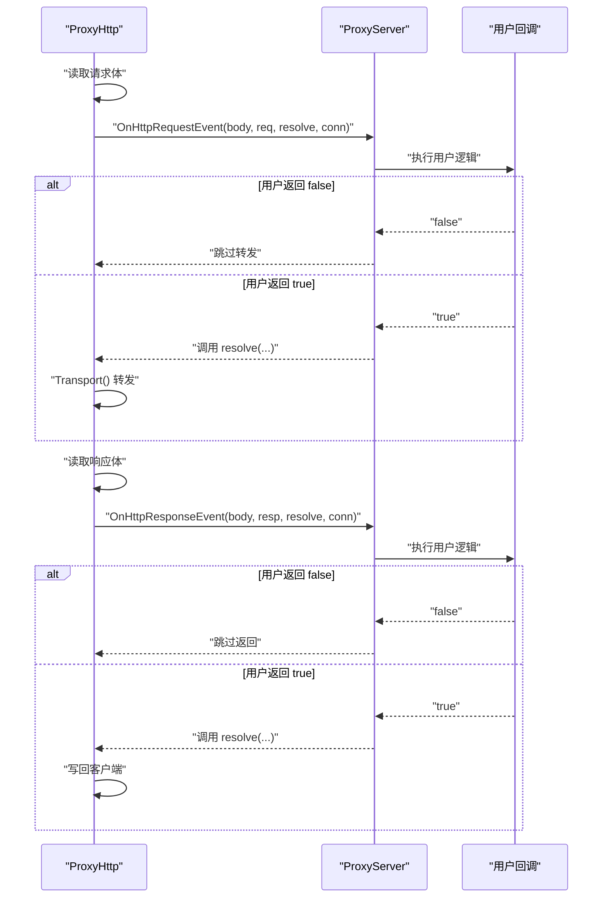
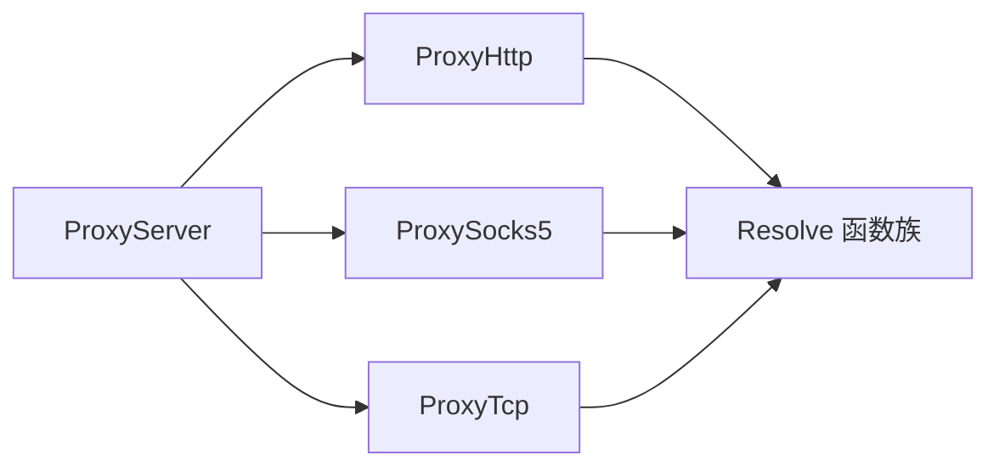

# 事件驱动架构

<cite>
**本文引用的文件**
- [Main.go](file://Main.go)
- [ProxyServer.go](file://Core/ProxyServer.go)
- [ProxyHttp.go](file://Core/ProxyHttp.go)
- [ProxySocks5.go](file://Core/ProxySocks5.go)
- [ProxyTcp.go](file://Core/ProxyTcp.go)
- [CODE-DOC.md](file://CODE-DOC.md)
- [README.md](file://README.md)
- [README-CN.md](file://README-CN.md)
</cite>

## 目录
1. [简介](#简介)
2. [项目结构](#项目结构)
3. [核心组件](#核心组件)
4. [架构总览](#架构总览)
5. [详细组件分析](#详细组件分析)
6. [依赖分析](#依赖分析)
7. [性能考虑](#性能考虑)
8. [故障排查指南](#故障排查指南)
9. [结论](#结论)
10. [附录](#附录)

## 简介
本文件系统性阐述 shermie-proxy 的事件驱动架构，重点说明代理服务器如何通过“事件回调”在数据流经各协议处理阶段时进行拦截、检查与修改。文档覆盖事件类型定义、触发机制、回调签名与返回值语义、事件在完整数据流中的位置与作用，并给出最佳实践与性能优化建议。同时提供可直接定位到源码的路径，便于读者对照实现。

## 项目结构
- 事件驱动的核心位于 Core 层，由 ProxyServer 统一管理各类事件回调；具体协议处理分别在 ProxyHttp、ProxySocks5、ProxyTcp 中触发相应事件。
- 应用入口在 Main.go，负责初始化证书、创建 ProxyServer 实例并注册各类事件回调，随后启动监听与处理循环。

**图表来源**
- [Main.go:48-123](file://Main.go#L48-L123)
- [ProxyServer.go:176-203](file://Core/ProxyServer.go#L176-L203)
- [ProxyHttp.go:44-132](file://Core/ProxyHttp.go#L44-L132)
- [ProxySocks5.go:54-240](file://Core/ProxySocks5.go#L54-L240)
- [ProxyTcp.go:23-112](file://Core/ProxyTcp.go#L23-L112)

**章节来源**
- [Main.go:24-123](file://Main.go#L24-L123)
- [ProxyServer.go:48-77](file://Core/ProxyServer.go#L48-L77)

## 核心组件
- 事件回调类型：在 ProxyServer 结构体中声明，涵盖 TCP 连接生命周期、HTTP 请求/响应、WebSocket、SOCKS5、以及 TCP 流量双向事件。
- Resolve 函数族：用于在回调中完成默认转发逻辑，允许用户在调用前后修改数据。
- 协议处理器：ProxyHttp、ProxySocks5、ProxyTcp 在各自处理流程的关键节点触发事件回调。

**章节来源**
- [ProxyServer.go:22-66](file://Core/ProxyServer.go#L22-L66)
- [CODE-DOC.md:392-416](file://CODE-DOC.md#L392-L416)

## 架构总览
事件驱动架构围绕 ProxyServer 展开：当新连接接入时，ProxyServer 识别协议并委派至对应处理器；处理器在关键节点调用事件回调，用户可在回调中修改数据或完全接管写回；最后通过 Resolve 函数完成默认转发。

**图表来源**
- [ProxyServer.go:176-203](file://Core/ProxyServer.go#L176-L203)
- [ProxyHttp.go:95-131](file://Core/ProxyHttp.go#L95-L131)
- [ProxySocks5.go:242-284](file://Core/ProxySocks5.go#L242-L284)
- [ProxyTcp.go:68-111](file://Core/ProxyTcp.go#L68-L111)

## 详细组件分析

### 事件类型与触发点
- TCP 连接事件
  - OnTcpConnectEvent：连接建立时触发
  - OnTcpCloseEvent：连接关闭时触发（defer 中）
- HTTP 事件
  - OnHttpRequestEvent：HTTP 请求到达、转发前
  - OnHttpResponseEvent：HTTP 响应到达、返回客户端前
- WebSocket 事件
  - OnWsRequestEvent：WS 客户端消息到达、转发前
  - OnWsResponseEvent：WS 服务端消息到达、返回客户端前
- SOCKS5 事件
  - OnSocks5RequestEvent：SOCKS5 客户端发送数据、转发前
  - OnSocks5ResponseEvent：SOCKS5 服务端返回数据、转发前
- TCP 流事件
  - OnTcpClientStreamEvent：客户端 -> 服务端方向
  - OnTcpServerStreamEvent：服务端 -> 客户端方向

事件触发与回调签名详见下表（仅列出关键字段与返回值语义）：

| 事件名 | 触发时机 | 参数与返回值语义 |
|---|---|---|
| OnTcpConnectEvent(conn) | 新 TCP 连接建立时 | 无返回值，仅通知 |
| OnTcpCloseEvent(conn) | TCP 连接关闭时（defer 中） | 无返回值，仅通知 |
| OnHttpRequestEvent(body, req, resolve, conn) | HTTP 请求到达，转发前 | 返回 true 继续转发，false 跳过默认转发 |
| OnHttpResponseEvent(body, resp, resolve, conn) | HTTP 响应到达，返回客户端前 | 返回 true 继续返回，false 跳过默认返回 |
| OnSocks5RequestEvent(data, resolve, conn) | SOCKS5 客户端发送数据 | 返回 (写入字节数, error)，由 resolve 执行默认转发 |
| OnSocks5ResponseEvent(data, resolve, conn) | SOCKS5 服务端返回数据 | 返回 (写入字节数, error)，由 resolve 执行默认转发 |
| OnWsRequestEvent(type, data, resolve, conn) | WebSocket 客户端消息 | 返回 error，nil 表示默认转发 |
| OnWsResponseEvent(type, data, resolve, conn) | WebSocket 服务端消息 | 返回 error，nil 表示默认转发 |
| OnTcpClientStreamEvent(data, resolve, conn) | TCP 客户端 -> 服务端 | 返回 (写入字节数, error)，由 resolve 执行默认转发 |
| OnTcpServerStreamEvent(data, resolve, conn) | TCP 服务端 -> 客户端 | 返回 (写入字节数, error)，由 resolve 执行默认转发 |

**章节来源**
- [CODE-DOC.md:418-431](file://CODE-DOC.md#L418-L431)
- [ProxyServer.go:22-66](file://Core/ProxyServer.go#L22-L66)

### 事件在数据流中的作用与完整事件链
- HTTP/HTTPS/WebSocket
  - 读取请求后触发 OnHttpRequestEvent，用户可修改请求体并通过 resolve 完成转发
  - 收到远端响应后触发 OnHttpResponseEvent，用户可修改响应体并通过 resolve 返回客户端
  - 若为 CONNECT 或 Upgrade，则进入 TLS/WS 握手与后续处理
- SOCKS5
  - 握手完成后，双向数据转发时分别触发 OnSocks5RequestEvent 与 OnSocks5ResponseEvent
- TCP
  - 建立目标连接后，双向数据转发时分别触发 OnTcpClientStreamEvent 与 OnTcpServerStreamEvent

**图表来源**
- [ProxyHttp.go:95-131](file://Core/ProxyHttp.go#L95-L131)
- [ProxySocks5.go:242-284](file://Core/ProxySocks5.go#L242-L284)
- [ProxyTcp.go:68-111](file://Core/ProxyTcp.go#L68-L111)

### 事件回调的签名与参数说明
- 回调函数均以闭包形式注册于 ProxyServer 实例上，参数包含：
  - message/body：当前读取到的原始数据
  - request/response：HTTP 请求/响应对象（如适用）
  - msgType：WebSocket 消息类型（如适用）
  - conn：当前网络连接对象
  - resolve：用于执行默认转发的回调函数
- 返回值语义：
  - 布尔型：HTTP 请求/响应事件返回 true/false 控制是否继续默认转发/返回
  - 整数+error：SOCKS5/TCP 流事件返回写入字节数与错误，resolve 默认写入目标连接
  - error：WebSocket 事件返回错误，nil 表示默认转发

**章节来源**
- [CODE-DOC.md:392-416](file://CODE-DOC.md#L392-L416)
- [ProxyServer.go:22-66](file://Core/ProxyServer.go#L22-L66)

### 事件触发与调用链（代码级）
- HTTP 请求事件
  - 在读取请求体后，构造 resolveRequest 并触发 OnHttpRequestEvent；若回调返回 false 则跳过
  - 转发后读取响应体，构造 resolveResponse 并触发 OnHttpResponseEvent；若回调返回 false 则跳过
- WebSocket 事件
  - 读取远端消息时触发 OnWsResponseEvent；读取客户端消息时触发 OnWsRequestEvent
- SOCKS5 事件
  - 读取客户端数据时触发 OnSocks5RequestEvent；读取服务端数据时触发 OnSocks5ResponseEvent
- TCP 事件
  - 读取客户端数据时触发 OnTcpClientStreamEvent；读取服务端数据时触发 OnTcpServerStreamEvent

**图表来源**
- [ProxyHttp.go:95-131](file://Core/ProxyHttp.go#L95-L131)

**章节来源**
- [ProxyHttp.go:95-131](file://Core/ProxyHttp.go#L95-L131)
- [ProxySocks5.go:242-284](file://Core/ProxySocks5.go#L242-L284)
- [ProxyTcp.go:68-111](file://Core/ProxyTcp.go#L68-L111)

### 事件注册与使用示例（路径定位）
- 在入口函数中创建 ProxyServer 并注册各类事件回调，随后启动服务
- 示例路径（仅提供路径，不展示具体代码内容）：
  - [Main.go:48-123](file://Main.go#L48-L123)
  - [README.md 示例:38-147](file://README.md#L38-L147)
  - [README-CN.md 示例:37-144](file://README-CN.md#L37-L144)

**章节来源**
- [Main.go:48-123](file://Main.go#L48-L123)
- [README.md:38-147](file://README.md#L38-L147)
- [README-CN.md:37-144](file://README-CN.md#L37-L144)

## 依赖分析
- ProxyServer 作为事件中枢，聚合所有事件回调并在 handle() 中根据首字节判定协议类型，委派至对应处理器
- 各协议处理器在内部调用 resolve 函数完成默认转发，用户回调通过返回值控制是否继续默认行为
- 事件回调与协议处理之间为松耦合设计，新增协议或事件类型只需在对应处理器中触发并调用 resolve

**图表来源**
- [ProxyServer.go:176-203](file://Core/ProxyServer.go#L176-L203)
- [ProxyHttp.go:95-131](file://Core/ProxyHttp.go#L95-L131)
- [ProxySocks5.go:242-284](file://Core/ProxySocks5.go#L242-L284)
- [ProxyTcp.go:68-111](file://Core/ProxyTcp.go#L68-L111)

**章节来源**
- [ProxyServer.go:176-203](file://Core/ProxyServer.go#L176-L203)

## 性能考虑
- 事件回调应在保证正确性的前提下尽量轻量化，避免在回调中执行阻塞或高延迟操作
- 对于大量 WebSocket 或 SOCKS5 流量，注意合理设置缓冲区大小与并发策略，避免频繁分配内存
- HTTP 响应体读取与压缩可能带来额外开销，必要时在回调中进行条件处理
- TCP 层的 Nagle 算法可通过启动参数控制，结合业务场景权衡延迟与吞吐

## 故障排查指南
- 回调未生效
  - 确认已在入口处注册事件回调，并确保回调未被覆盖
  - 参考：[Main.go:48-123](file://Main.go#L48-L123)
- HTTP 请求/响应事件返回 false 后无数据返回
  - 正确行为：返回 false 表示用户自行处理写回，需确保显式写回客户端
  - 参考：[CODE-DOC.md:433-451](file://CODE-DOC.md#L433-L451)
- WebSocket 事件报错
  - 检查回调返回值是否为 nil；非 nil 错误将导致停止转发
  - 参考：[ProxyHttp.go:397-430](file://Core/ProxyHttp.go#L397-L430)
- SOCKS5/TCP 事件写入异常
  - 检查 resolve 返回的写入字节数与错误；writeLen < 0 或 readLen != writeLen 会导致错误
  - 参考：[ProxySocks5.go:266-276](file://Core/ProxySocks5.go#L266-L276)、[ProxyTcp.go:91-101](file://Core/ProxyTcp.go#L91-L101)
- 协议识别错误
  - 首字节判定基于 HTTP 方法前缀或 SOCKS5 版本，确认客户端请求格式
  - 参考：[ProxyServer.go:205-212](file://Core/ProxyServer.go#L205-L212)

**章节来源**
- [CODE-DOC.md:433-451](file://CODE-DOC.md#L433-L451)
- [ProxyHttp.go:397-430](file://Core/ProxyHttp.go#L397-L430)
- [ProxySocks5.go:266-276](file://Core/ProxySocks5.go#L266-L276)
- [ProxyTcp.go:91-101](file://Core/ProxyTcp.go#L91-L101)
- [ProxyServer.go:205-212](file://Core/ProxyServer.go#L205-L212)

## 结论
sheremie-proxy 的事件驱动架构通过在关键数据流节点触发回调，实现了对多协议代理过程的灵活控制。用户既可拦截与修改数据，也可完全接管转发逻辑。遵循本文的事件类型、触发机制与最佳实践，可在保证性能与稳定性的同时，满足多样化的代理与调试需求。

## 附录
- 事件使用模式与示例（仅提供路径）
  - [CODE-DOC.md:433-451](file://CODE-DOC.md#L433-L451)
- 事件类型与 Resolve 函数签名
  - [CODE-DOC.md:392-416](file://CODE-DOC.md#L392-L416)
- 协议处理与事件触发要点
  - [ProxyHttp.go:95-131](file://Core/ProxyHttp.go#L95-L131)
  - [ProxySocks5.go:242-284](file://Core/ProxySocks5.go#L242-L284)
  - [ProxyTcp.go:68-111](file://Core/ProxyTcp.go#L68-L111)