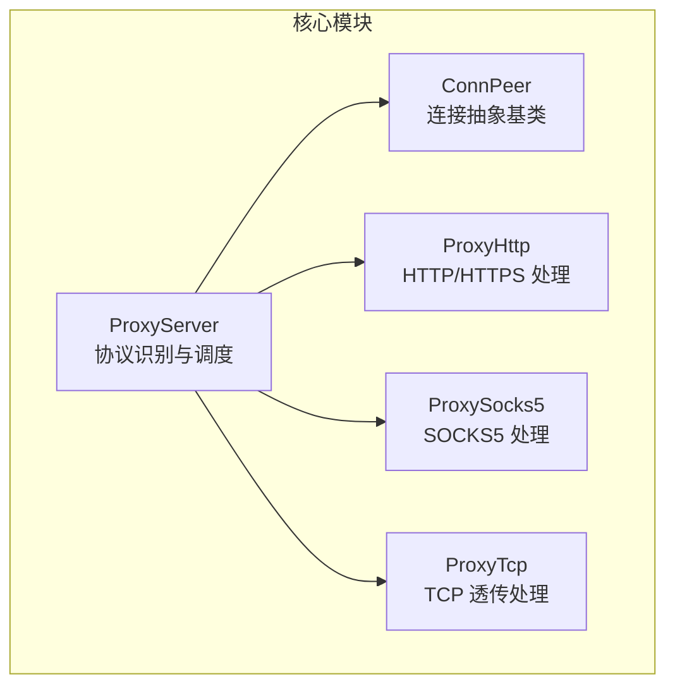
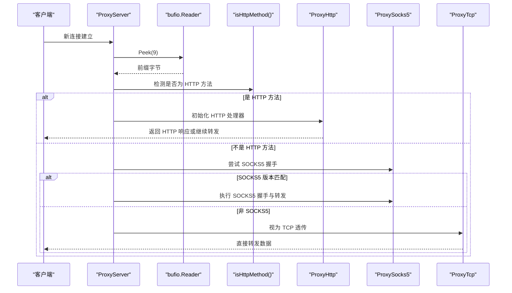
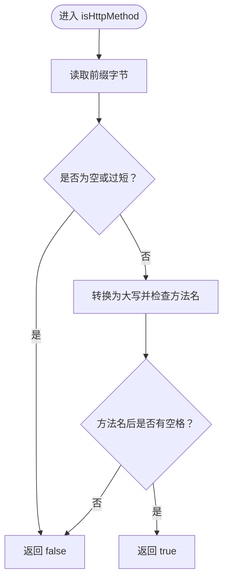
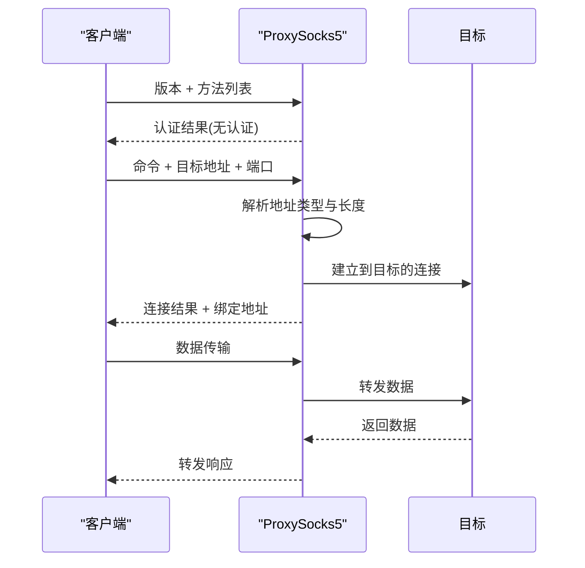
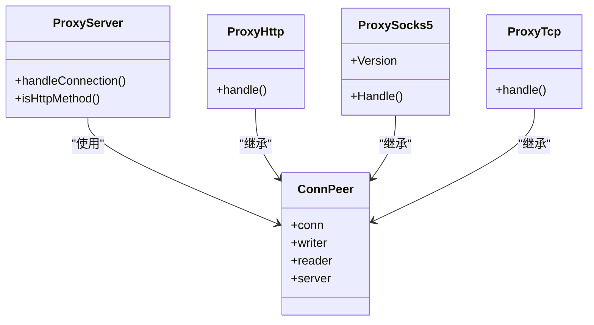

# 协议识别机制

<cite>
**本文档引用的文件**
- [Core/ProxyServer.go](file://Core/ProxyServer.go)
- [Core/ProxyServer_test.go](file://Core/ProxyServer_test.go)
- [Core/ProxySocks5.go](file://Core/ProxySocks5.go)
- [Core/ProxyHttp.go](file://Core/ProxyHttp.go)
- [Core/ProxyTcp.go](file://Core/ProxyTcp.go)
- [Core/ConnPeer.go](file://Core/ConnPeer.go)
- [CODE-DOC.md](file://CODE-DOC.md)
- [README.md](file://README.md)
</cite>

## 目录
1. [简介](#简介)
2. [项目结构](#项目结构)
3. [核心组件](#核心组件)
4. [架构总览](#架构总览)
5. [详细组件分析](#详细组件分析)
6. [依赖关系分析](#依赖关系分析)
7. [性能考虑](#性能考虑)
8. [故障排除指南](#故障排除指南)
9. [结论](#结论)

## 简介
本文件聚焦于 shermie-proxy 的协议识别机制，系统性阐述 isHttpMethod 函数的实现原理与 HTTP 方法检测算法，并说明如何通过数据包前缀判断连接类型，包括 HTTP 方法匹配、SOCKS5 版本检测与 TCP 透传识别。文档还解释了协议识别的优先级与处理顺序、混合环境一致性保障、性能优化策略与准确性保障措施，并给出具体识别示例与边界情况处理。

## 项目结构
项目采用按功能模块划分的目录结构，核心协议识别与处理集中在 Core 目录中：
- Core/ProxyServer.go：协议识别入口与调度逻辑
- Core/ProxyHttp.go：HTTP/HTTPS 协议处理
- Core/ProxySocks5.go：SOCKS5 协议处理
- Core/ProxyTcp.go：TCP 透传处理
- Core/ConnPeer.go：连接抽象基类
- Core/ProxyServer_test.go：协议识别单元测试
- CODE-DOC.md：整体设计文档，包含协议识别的设计决策
- README.md：项目说明与使用指南

**图表来源**
- [Core/ProxyServer.go](file://Core/ProxyServer.go)
- [Core/ConnPeer.go](file://Core/ConnPeer.go)
- [Core/ProxyHttp.go](file://Core/ProxyHttp.go)
- [Core/ProxySocks5.go](file://Core/ProxySocks5.go)
- [Core/ProxyTcp.go](file://Core/ProxyTcp.go)

**章节来源**
- [CODE-DOC.md](file://CODE-DOC.md)
- [README.md](file://README.md)

## 核心组件
本节聚焦协议识别的核心组件与职责：
- ProxyServer：负责连接接入、协议探测与分发
- ConnPeer：封装底层连接与缓冲读写器，作为各协议处理器的基类
- ProxyHttp：处理 HTTP/HTTPS 流量
- ProxySocks5：处理 SOCKS5 握手与转发
- ProxyTcp：处理 TCP 透传

**章节来源**
- [Core/ProxyServer.go](file://Core/ProxyServer.go)
- [Core/ConnPeer.go](file://Core/ConnPeer.go)
- [Core/ProxyHttp.go](file://Core/ProxyHttp.go)
- [Core/ProxySocks5.go](file://Core/ProxySocks5.go)
- [Core/ProxyTcp.go](file://Core/ProxyTcp.go)

## 架构总览
协议识别采用“窥探前缀 + 前缀匹配”的策略：在不消耗数据流的前提下读取连接首字节，结合 isHttpMethod 的 HTTP 方法前缀匹配、SOCKS5 版本检测与 TCP 透传识别，完成协议分流。

**图表来源**
- [Core/ProxyServer.go](file://Core/ProxyServer.go)
- [Core/ProxyServer_test.go](file://Core/ProxyServer_test.go)
- [Core/ProxySocks5.go](file://Core/ProxySocks5.go)

## 详细组件分析

### isHttpMethod 函数与 HTTP 方法检测算法
- 探测策略：使用 bufio.Reader.Peek(9) 获取连接前缀，避免消费数据流，确保后续协议处理仍可正确读取完整数据。
- 匹配规则：isHttpMethod 对输入字节序列执行严格的 HTTP 方法前缀匹配，要求方法名必须为大写且以空格结尾，以区分真实 HTTP 请求与仅包含方法名的片段。
- 支持的方法：GET、POST、PUT、DELETE、OPTIONS、HEAD、CONNECT、PATCH、TRACE 等标准方法。
- 边界处理：对小写方法、缺少尾部空格、过短输入、随机二进制等场景返回非 HTTP，避免误判。

**图表来源**
- [Core/ProxyServer.go](file://Core/ProxyServer.go)
- [Core/ProxyServer_test.go](file://Core/ProxyServer_test.go)

**章节来源**
- [Core/ProxyServer.go](file://Core/ProxyServer.go)
- [Core/ProxyServer_test.go](file://Core/ProxyServer_test.go)

### SOCKS5 版本检测与握手流程
- 版本识别：SOCKS5 握手以固定版本字节标识，ProxySocks5 使用常量 Version=0x5 进行版本检测。
- 握手步骤：客户端发送版本号与认证方法列表；服务端选择无认证并回复；随后客户端发送目标地址与端口请求；服务端连接目标并返回结果。
- 地址类型：支持 IPv4、IPv6 与域名三种目标地址类型，分别对应不同的长度与读取策略。
- 错误处理：对未知地址类型与连接失败进行错误分类与返回。

**图表来源**
- [Core/ProxySocks5.go](file://Core/ProxySocks5.go)

**章节来源**
- [Core/ProxySocks5.go](file://Core/ProxySocks5.go)

### TCP 透传识别与处理
- 识别条件：当既非 HTTP 方法又非 SOCKS5 版本时，默认视为 TCP 透传。
- 处理方式：直接建立到目标服务器(--to)的 TCP 连接，启动双向数据转发。
- TLS 支持：针对目标端口 443 自动触发 TLS 握手，实现 HTTPS 透传。
- UDP 支持：SOCKS5 协议中包含 UDP 相关命令，但 TCP 透传主要面向 TCP 流量。

**章节来源**
- [Core/ProxyTcp.go](file://Core/ProxyTcp.go)
- [Core/ProxySocks5.go](file://Core/ProxySocks5.go)

### 协议识别优先级与处理顺序
- 优先级：HTTP 方法检测 > SOCKS5 版本检测 > TCP 透传。
- 处理顺序：
  1) Peek 前缀字节
  2) isHttpMethod 判断是否为 HTTP 方法
  3) 若否，尝试 SOCKS5 握手
  4) 若仍否，视为 TCP 透传
- 混合环境一致性：通过严格前缀匹配与固定常量版本字节，确保在高并发与混合流量下保持一致的识别行为。

**章节来源**
- [Core/ProxyServer.go](file://Core/ProxyServer.go)
- [Core/ProxyServer_test.go](file://Core/ProxyServer_test.go)
- [Core/ProxySocks5.go](file://Core/ProxySocks5.go)

### 协议识别的性能优化策略
- 零拷贝与零移动：Peek 不消费数据，避免额外内存复制与缓冲区移动。
- 最小化探测范围：仅读取前缀字节，降低 CPU 与内存开销。
- 快速失败：HTTP 方法检测与 SOCKS5 版本检测均为 O(1) 或常数时间复杂度，快速分流。
- 并发友好：识别过程不阻塞后续读写，配合 goroutine 实现高并发处理。

**章节来源**
- [CODE-DOC.md](file://CODE-DOC.md)
- [Core/ProxyServer.go](file://Core/ProxyServer.go)

### 协议识别的准确性保障措施
- 单元测试覆盖：包含标准 HTTP 方法、非 HTTP 数据、随机二进制、空输入、过短输入、小写方法等边界用例。
- 明确的匹配规则：方法名必须为大写且以空格结尾，有效避免误判。
- 版本常量校验：SOCKS5 使用固定版本常量，确保识别稳定性。
- 错误分类与返回：对未知地址类型与连接失败进行明确错误信息返回，便于定位问题。

**章节来源**
- [Core/ProxyServer_test.go](file://Core/ProxyServer_test.go)
- [Core/ProxySocks5.go](file://Core/ProxySocks5.go)

### 具体识别示例与边界情况
- HTTP 示例：标准 GET/POST/PUT/DELETE/OPTIONS/HEAD/CONNECT/PATCH/TRACE 请求均被正确识别。
- 非 HTTP 示例：SOCKS5 版本字节、随机二进制、空输入、过短输入等均被识别为非 HTTP。
- 边界情况：方法名存在但缺少尾部空格、小写方法等均被拒绝为 HTTP。
- 混合环境：在高并发与混合流量下，通过严格前缀匹配与固定常量版本字节，确保识别一致性。

**章节来源**
- [Core/ProxyServer_test.go](file://Core/ProxyServer_test.go)

## 依赖关系分析
协议识别依赖于连接抽象与缓冲读写器，各协议处理器继承连接抽象以获得统一的读写能力。

**图表来源**
- [Core/ConnPeer.go](file://Core/ConnPeer.go)
- [Core/ProxyServer.go](file://Core/ProxyServer.go)
- [Core/ProxyHttp.go](file://Core/ProxyHttp.go)
- [Core/ProxySocks5.go](file://Core/ProxySocks5.go)
- [Core/ProxyTcp.go](file://Core/ProxyTcp.go)

**章节来源**
- [Core/ConnPeer.go](file://Core/ConnPeer.go)
- [Core/ProxyServer.go](file://Core/ProxyServer.go)

## 性能考虑
- 探测成本：Peek(9) 为常量时间操作，CPU 与内存开销极低。
- 分支预测友好：HTTP 方法检测与 SOCKS5 版本检测均为简单分支判断，有利于 CPU 分支预测。
- 并发扩展：识别完成后交由相应处理器处理，充分利用 goroutine 并发模型。
- 缓冲策略：通过 bufio.Reader/Writer 提供高效的缓冲读写，减少系统调用次数。

**章节来源**
- [CODE-DOC.md](file://CODE-DOC.md)
- [Core/ProxyServer.go](file://Core/ProxyServer.go)

## 故障排除指南
- 误判为 HTTP：检查输入是否满足“方法名大写 + 空格”规则，确认 isHttpMethod 的匹配逻辑。
- 误判为 SOCKS5：确认客户端是否发送了正确的版本字节与方法列表，检查地址类型解析。
- TCP 透传异常：检查 --to 目标地址与端口配置，确认网络连通性与 TLS 握手状态。
- 单元测试失败：参考测试用例中的边界场景，逐项排查输入数据格式与预期结果。

**章节来源**
- [Core/ProxyServer_test.go](file://Core/ProxyServer_test.go)
- [Core/ProxySocks5.go](file://Core/ProxySocks5.go)

## 结论
sheremie-proxy 的协议识别机制通过“窥探前缀 + 前缀匹配”的策略，实现了对 HTTP、SOCKS5 与 TCP 透传的高效、准确识别。isHttpMethod 函数以严格的大写方法名与空格校验为核心，结合 SOCKS5 版本常量与 TCP 默认分流，形成清晰的优先级与处理顺序。该机制在混合环境中具备良好的一致性与性能表现，配合完善的单元测试与错误处理，能够稳定支撑多协议代理场景。