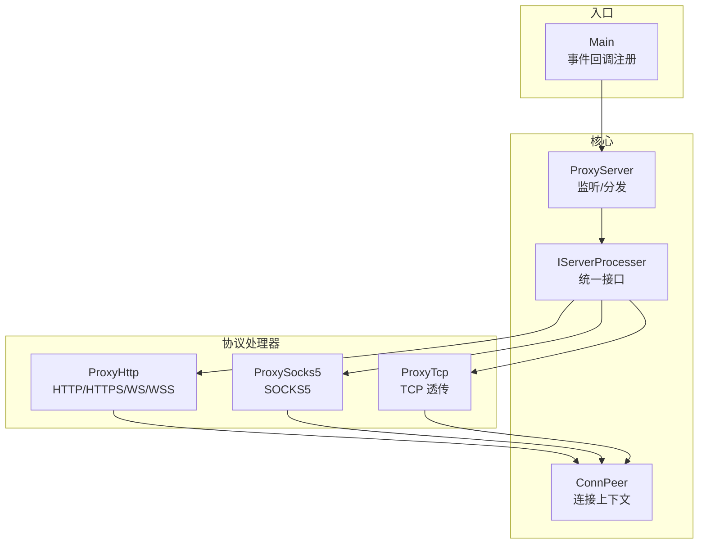
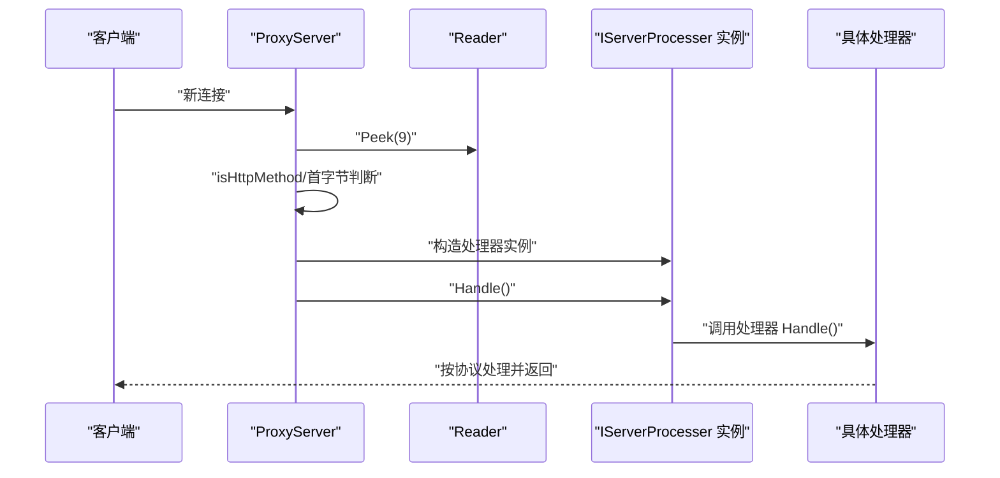
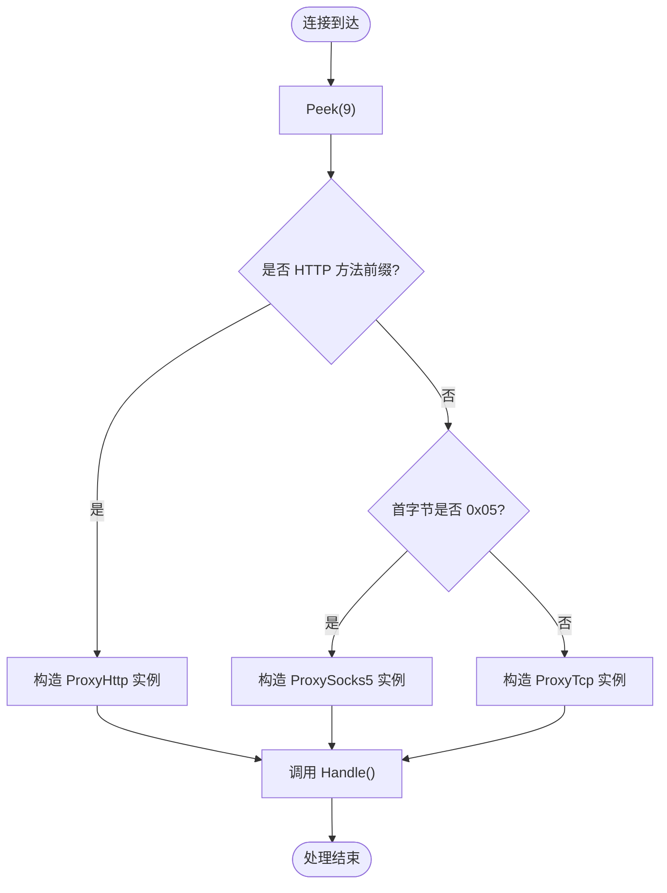
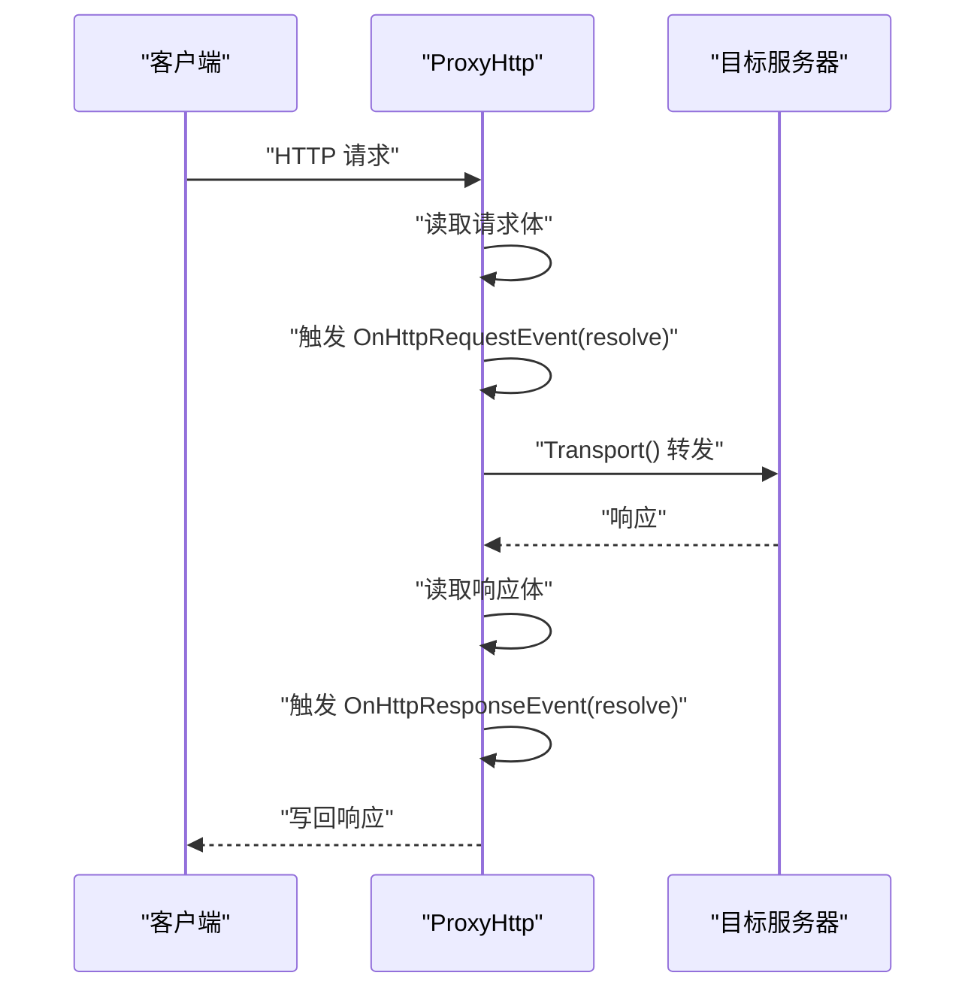
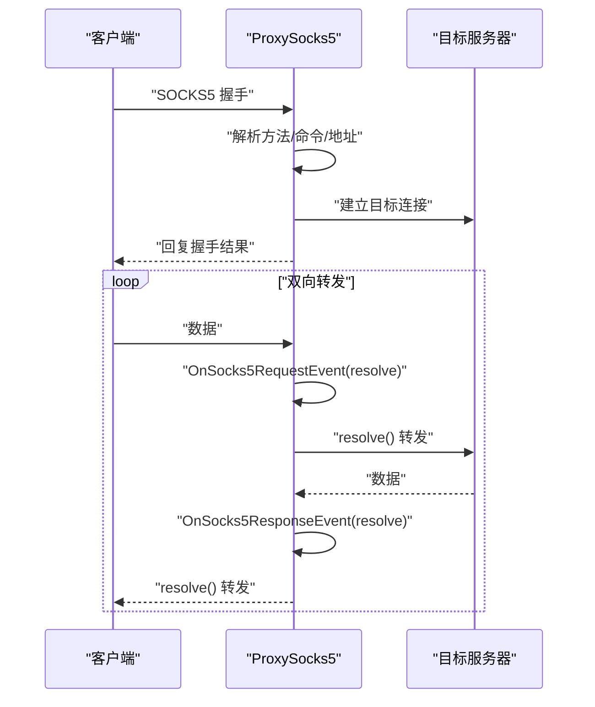
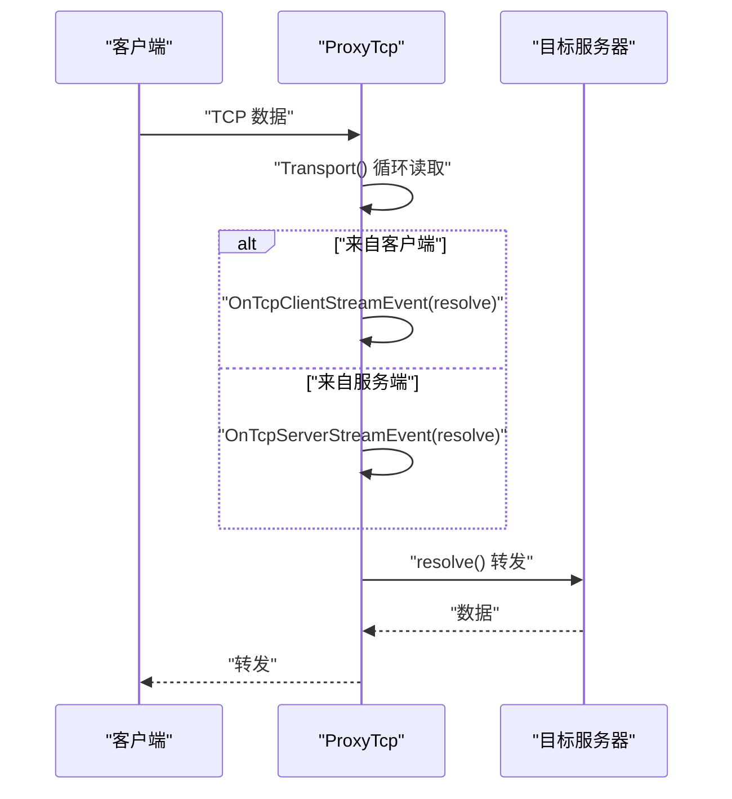
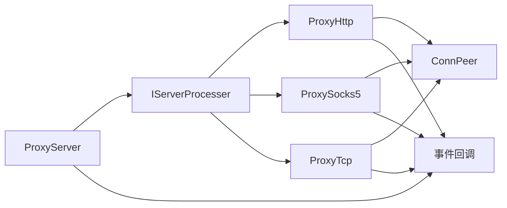

# 插件化架构

<cite>
**本文引用的文件**
- [IServerProcesser.go](file://Contract/IServerProcesser.go)
- [ProxyServer.go](file://Core/ProxyServer.go)
- [ProxyHttp.go](file://Core/ProxyHttp.go)
- [ProxySocks5.go](file://Core/ProxySocks5.go)
- [ProxyTcp.go](file://Core/ProxyTcp.go)
- [ConnPeer.go](file://Core/ConnPeer.go)
- [Main.go](file://Main.go)
- [README.md](file://README.md)
- [CODE-DOC.md](file://CODE-DOC.md)
</cite>

## 目录
1. [简介](#简介)
2. [项目结构](#项目结构)
3. [核心组件](#核心组件)
4. [架构总览](#架构总览)
5. [详细组件分析](#详细组件分析)
6. [依赖分析](#依赖分析)
7. [性能考量](#性能考量)
8. [故障排查指南](#故障排查指南)
9. [结论](#结论)
10. [附录](#附录)

## 简介
本文件面向 shermie-proxy 的插件化架构，系统性阐述 IServerProcesser 接口的设计理念与实现要求，解释 ProxyServer 如何依据连接特征动态选择处理器实例，并给出协议扩展的集成方式、开发规范、错误处理模式与性能优化建议。文档同时提供可直接参考的源码路径，帮助开发者快速实现新的协议处理器并融入现有体系。

## 项目结构
- Contract/IServerProcesser.go：定义统一的协议处理器接口，所有协议处理器均实现该接口的 Handle() 方法。
- Core/ProxyServer.go：服务器核心，负责监听、连接接受、协议识别与处理器分发。
- Core/ProxyHttp.go、Core/ProxySocks5.go、Core/ProxyTcp.go：三种内置协议处理器，分别处理 HTTP/HTTPS/WS/WSS、SOCKS5、TCP 透传。
- Core/ConnPeer.go：连接上下文基座，被各处理器嵌入以共享连接与读写器。
- Main.go：程序入口，演示事件回调注册与服务器启动流程。
- README.md、CODE-DOC.md：功能说明与架构文档，包含协议识别、事件回调、证书系统等背景知识。

图表来源
- [ProxyServer.go:176-203](file://Core/ProxyServer.go#L176-L203)
- [IServerProcesser.go:3-5](file://Contract/IServerProcesser.go#L3-L5)
- [ProxyHttp.go:29-37](file://Core/ProxyHttp.go#L29-L37)
- [ProxySocks5.go:15-19](file://Core/ProxySocks5.go#L15-L19)
- [ProxyTcp.go:15-19](file://Core/ProxyTcp.go#L15-L19)
- [ConnPeer.go:8-13](file://Core/ConnPeer.go#L8-L13)

章节来源
- [CODE-DOC.md:30-63](file://CODE-DOC.md#L30-L63)
- [README.md:19-30](file://README.md#L19-L30)

## 核心组件
- IServerProcesser 接口：定义单一方法 Handle()，作为所有协议处理器的统一入口。
- ProxyServer：负责监听、接受连接、协议识别与处理器实例化与调度。
- ConnPeer：嵌入到各处理器，提供共享的 net.Conn、bufio.Reader/Writer 与 ProxyServer 引用。
- 内置处理器：ProxyHttp、ProxySocks5、ProxyTcp，分别覆盖 HTTP/HTTPS/WS/WSS、SOCKS5、TCP 透传。
- 事件回调系统：在 ProxyServer 上注册，贯穿请求/响应/数据流的关键节点，允许用户拦截与修改。

章节来源
- [IServerProcesser.go:3-5](file://Contract/IServerProcesser.go#L3-L5)
- [ProxyServer.go:48-66](file://Core/ProxyServer.go#L48-L66)
- [ConnPeer.go:8-13](file://Core/ConnPeer.go#L8-L13)
- [CODE-DOC.md:138-147](file://CODE-DOC.md#L138-L147)

## 架构总览
ProxyServer 在连接建立后，通过窥探首字节进行协议识别，构造对应处理器实例并调用其 Handle()。处理器内部利用 ConnPeer 提供的 reader、writer 与 server 引用，完成协议解析、事件回调、数据转发与 TLS 中断等任务。

图表来源
- [ProxyServer.go:176-203](file://Core/ProxyServer.go#L176-L203)
- [ProxyServer.go:205-212](file://Core/ProxyServer.go#L205-L212)

章节来源
- [ProxyServer.go:176-212](file://Core/ProxyServer.go#L176-L212)
- [CODE-DOC.md:99-124](file://CODE-DOC.md#L99-L124)

## 详细组件分析

### IServerProcesser 接口与实现规范
- 设计理念
  - 单一职责：所有协议处理器通过统一接口暴露 Handle()，确保 ProxyServer 与处理器之间的解耦。
  - 易扩展：新增协议只需实现 IServerProcesser 并在 ProxyServer 的协议识别处接入。
- 实现要求
  - 必须在 Handle() 中完成协议解析、事件回调、数据转发与错误处理。
  - 建议在 Handle() 开始时读取必要的首字节或头部信息，以便决定后续处理分支。
  - 建议在 Handle() 结束时释放资源（如关闭连接），并遵循事件回调的返回语义（如 HTTP 事件的 true/false 控制是否继续默认写回）。
- 标准实现模式
  - 读取/解析：使用 ConnPeer.reader 读取必要数据，解析协议头或首字节。
  - 事件回调：在关键节点调用 ProxyServer 的回调，提供 resolve 函数以完成默认行为。
  - 转发/桥接：根据协议特性进行请求转发、隧道建立或双向数据桥接。
  - 错误处理：捕获并记录错误，必要时中断处理流程并关闭连接。

章节来源
- [IServerProcesser.go:3-5](file://Contract/IServerProcesser.go#L3-L5)
- [CODE-DOC.md:138-147](file://CODE-DOC.md#L138-L147)

### ProxyServer 的协议识别与分发
- 协议识别
  - Peek 前 9 字节，使用 isHttpMethod() 进行 HTTP 方法前缀匹配；若首字节为 0x05，则判定为 SOCKS5；否则视为 TCP。
- 处理器实例化
  - 将 ConnPeer（含 reader、writer、conn、server）注入对应处理器构造函数，形成独立处理上下文。
- 调度与生命周期
  - 调用 process.Handle() 后，处理器负责整个生命周期的处理与资源回收。
  - OnTcpConnectEvent/OnTcpCloseEvent 在连接建立与关闭时触发，便于统计与监控。

图表来源
- [ProxyServer.go:176-203](file://Core/ProxyServer.go#L176-L203)
- [ProxyServer.go:205-212](file://Core/ProxyServer.go#L205-L212)

章节来源
- [ProxyServer.go:176-212](file://Core/ProxyServer.go#L176-L212)
- [CODE-DOC.md:118-124](file://CODE-DOC.md#L118-L124)

### ProxyHttp：HTTP/HTTPS/WS/WSS 处理器
- 结构与职责
  - 嵌入 ConnPeer，维护 request/response、WebSocket Upgrader、目标连接、TLS 标记与端口信息。
- 处理流程
  - Handle()：解析请求，区分 CONNECT 与普通请求；CONNECT 走 HTTPS/WSS 隧道；普通请求走常规 HTTP 转发。
  - handleRequest()：读取请求体，触发 OnHttpRequestEvent，调用 Transport() 转发，读取响应体，触发 OnHttpResponseEvent，最终写回客户端。
  - handleSslRequest()：建立 CONNECT 隧道，SslReceiveSend() 完成 TLS 中断与后续协议判断（WS/HTTPS）。
  - WebSocket：handleWsRequest() 双向桥接，分别触发 OnWsRequestEvent/OnWsResponseEvent。
- 事件回调与 resolve
  - HTTP 请求/响应事件提供 resolve 函数，用户可在回调中修改请求体/响应体后调用 resolve 完成默认转发/写回。
  - 返回 false 可跳过默认行为，自行处理连接。

图表来源
- [ProxyHttp.go:44-132](file://Core/ProxyHttp.go#L44-L132)
- [ProxyHttp.go:95-130](file://Core/ProxyHttp.go#L95-L130)

章节来源
- [ProxyHttp.go:29-37](file://Core/ProxyHttp.go#L29-L37)
- [ProxyHttp.go:44-132](file://Core/ProxyHttp.go#L44-L132)
- [CODE-DOC.md:153-282](file://CODE-DOC.md#L153-L282)

### ProxySocks5：SOCKS5 处理器
- 结构与职责
  - 嵌入 ConnPeer，维护目标连接与端口信息。
- 处理流程
  - Handle()：读取版本号、认证方法、命令、目标地址类型与端口，建立目标连接，回复握手结果，随后启动双向数据转发。
  - 支持 UDP/TCP/BIND/UDP ASSOCIATE 等命令，端口 443 时采用 TLS 握手。
- 事件回调与 resolve
  - OnSocks5RequestEvent/OnSocks5ResponseEvent 提供 resolve 函数，用户可修改数据后调用 resolve 完成转发。

图表来源
- [ProxySocks5.go:54-200](file://Core/ProxySocks5.go#L54-L200)

章节来源
- [ProxySocks5.go:15-19](file://Core/ProxySocks5.go#L15-L19)
- [ProxySocks5.go:54-200](file://Core/ProxySocks5.go#L54-L200)
- [CODE-DOC.md:285-334](file://CODE-DOC.md#L285-L334)

### ProxyTcp：TCP 透传处理器
- 结构与职责
  - 嵌入 ConnPeer，维护目标连接与端口信息。
- 处理流程
  - Handle()：解析 --to 目标地址，建立目标连接，可选 TLS 握手，启动双向数据转发。
  - Transport()：循环读取 originConn，触发 OnTcpServerStreamEvent/OnTcpClientStreamEvent，调用 resolve 完成转发。
- 事件回调与 resolve
  - OnTcpServerStreamEvent/OnTcpClientStreamEvent 提供 resolve 函数，用户可修改数据后调用 resolve 完成转发。
  - 返回值用于校验写入长度一致性，异常时通过 channel 通知停止。

图表来源
- [ProxyTcp.go:23-112](file://Core/ProxyTcp.go#L23-L112)

章节来源
- [ProxyTcp.go:15-19](file://Core/ProxyTcp.go#L15-L19)
- [ProxyTcp.go:23-112](file://Core/ProxyTcp.go#L23-L112)
- [CODE-DOC.md:335-384](file://CODE-DOC.md#L335-L384)

### ConnPeer：连接上下文基座
- 设计要点
  - 通过 Go 嵌入机制，所有处理器共享 net.Conn、bufio.Reader/Writer 与 ProxyServer 引用。
  - 为处理器提供统一的读写与事件回调访问入口。
- 使用建议
  - 处理器内部通过 ConnPeer 访问 reader、writer 与 server，避免重复构造。
  - 在处理器构造时将 ConnPeer 注入，确保 Handle() 能够直接使用。

章节来源
- [ConnPeer.go:8-13](file://Core/ConnPeer.go#L8-L13)
- [CODE-DOC.md:125-137](file://CODE-DOC.md#L125-L137)

### 事件回调系统与集成点
- 回调类型
  - HTTP：OnHttpRequestEvent、OnHttpResponseEvent
  - SOCKS5：OnSocks5RequestEvent、OnSocks5ResponseEvent
  - WebSocket：OnWsRequestEvent、OnWsResponseEvent
  - TCP：OnTcpConnectEvent、OnTcpCloseEvent、OnTcpServerStreamEvent、OnTcpClientStreamEvent
- resolve 函数
  - 各类 resolve 函数用于完成默认转发/写回；用户可在回调中修改数据后调用 resolve。
- 返回语义
  - HTTP 事件：返回 true 继续默认处理，返回 false 跳过默认写回（常用于自定义写回）。
  - 其他事件：返回值用于校验写入长度或错误处理。

章节来源
- [ProxyServer.go:22-34](file://Core/ProxyServer.go#L22-L34)
- [CODE-DOC.md:392-452](file://CODE-DOC.md#L392-L452)

## 依赖分析
- ProxyServer 依赖 Contract/IServerProcesser 接口，通过接口实现与处理器解耦。
- 各处理器均嵌入 ConnPeer，共享连接与读写器。
- 事件回调在 ProxyServer 上注册，处理器在关键节点触发回调。
- 证书系统与 DNS 缓存为 HTTP/HTTPS 处理提供支撑。

图表来源
- [ProxyServer.go:176-203](file://Core/ProxyServer.go#L176-L203)
- [IServerProcesser.go:3-5](file://Contract/IServerProcesser.go#L3-L5)
- [ConnPeer.go:8-13](file://Core/ConnPeer.go#L8-L13)

章节来源
- [CODE-DOC.md:65-78](file://CODE-DOC.md#L65-L78)

## 性能考量
- 多 Accept 并发：ProxyServer.MultiListen() 启动 5 个 goroutine 并发接受连接，提升高并发下的连接接受吞吐量。
- DNS 缓存：使用 viki-org/dnscache，TTL 5 分钟，减少重复解析开销。
- Nagle 算法：通过 --nagle 控制 SetNoDelay，影响延迟与吞吐权衡，默认低延迟模式。
- 证书缓存：Cache.GetCertificate() 通过 Mutex 与 WaitGroup 控制并发证书生成，避免重复开销。
- 缓冲区大小：TCP 转发使用 4KB 缓冲区，兼顾内存占用与吞吐。

章节来源
- [ProxyServer.go:156-174](file://Core/ProxyServer.go#L156-L174)
- [CODE-DOC.md:698-727](file://CODE-DOC.md#L698-L727)

## 故障排查指南
- 协议识别失败
  - 检查连接首字节是否符合预期；确认 isHttpMethod() 与首字节判断逻辑。
  - 参考路径：[ProxyServer.go:176-212](file://Core/ProxyServer.go#L176-L212)
- HTTP 事件回调无效
  - 确认回调已在 Main.go 中注册；检查 resolve 调用与返回值语义。
  - 参考路径：[Main.go:61-120](file://Main.go#L61-L120)
- TLS 中断问题
  - 检查根证书生成与缓存；确认证书模板与 SAN 设置。
  - 参考路径：[CODE-DOC.md:455-557](file://CODE-DOC.md#L455-L557)
- TCP 转发异常
  - 检查 resolve 返回值与写入长度一致性；关注 Transport() 中的错误通道。
  - 参考路径：[ProxyTcp.go:68-112](file://Core/ProxyTcp.go#L68-L112)
- 日志定位
  - 使用 Log 包输出错误信息，结合回调日志定位问题。

章节来源
- [Main.go:61-120](file://Main.go#L61-L120)
- [ProxyTcp.go:68-112](file://Core/ProxyTcp.go#L68-L112)
- [CODE-DOC.md:455-557](file://CODE-DOC.md#L455-L557)

## 结论
sheremie-proxy 通过 IServerProcesser 接口与 ProxyServer 的协议识别机制，实现了高度解耦的插件化架构。新增协议处理器仅需实现 Handle() 并在 ProxyServer 的识别逻辑中接入，即可无缝融入现有事件回调与连接上下文体系。依托事件回调与 ConnPeer 基座，开发者可在不侵入核心逻辑的前提下，灵活拦截、修改与扩展各类协议的数据流。

## 附录

### 插件开发指南（新协议处理器）
- 实现步骤
  - 定义结构体并嵌入 ConnPeer，添加协议特有字段。
  - 实现 IServerProcesser 接口的 Handle() 方法，完成协议解析、事件回调与数据转发。
  - 在 ProxyServer 的协议识别处增加新协议的判断与实例化逻辑。
- 错误处理模式
  - 在 Handle() 中捕获并记录错误；必要时中断处理并关闭连接。
  - 对于 HTTP 事件，返回 false 可跳过默认写回，自行处理连接。
- 性能考虑
  - 使用 ConnPeer 的 reader、writer 避免重复构造。
  - 合理设置缓冲区大小与 Nagle 策略，平衡延迟与吞吐。
  - 利用 DNS 缓存与证书缓存减少重复开销。
- 最佳实践
  - 明确事件回调的 resolve 调用时机与返回值语义。
  - 在 Handle() 结束时释放资源，确保连接生命周期可控。
  - 参考现有处理器（ProxyHttp、ProxySocks5、ProxyTcp）的实现模式。

章节来源
- [IServerProcesser.go:3-5](file://Contract/IServerProcesser.go#L3-L5)
- [ProxyServer.go:176-212](file://Core/ProxyServer.go#L176-L212)
- [CODE-DOC.md:138-147](file://CODE-DOC.md#L138-L147)