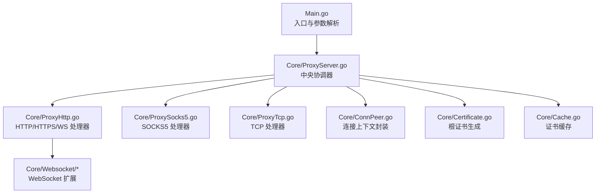
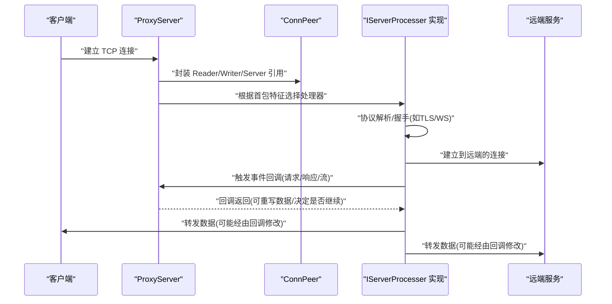
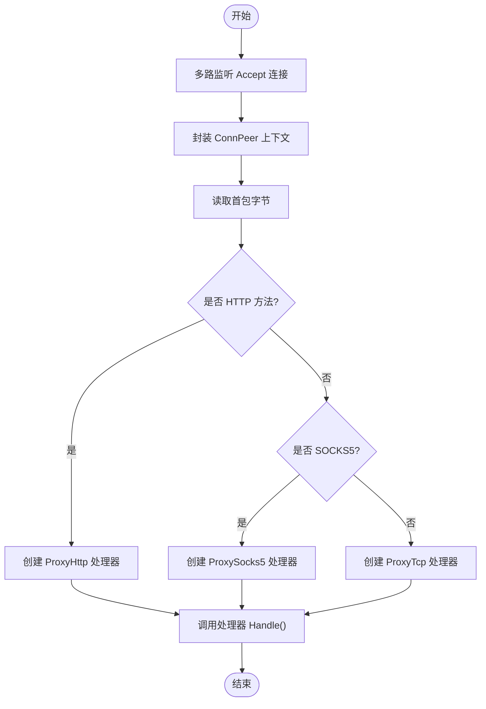
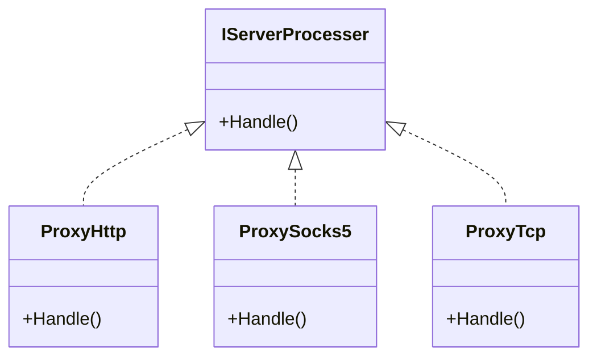
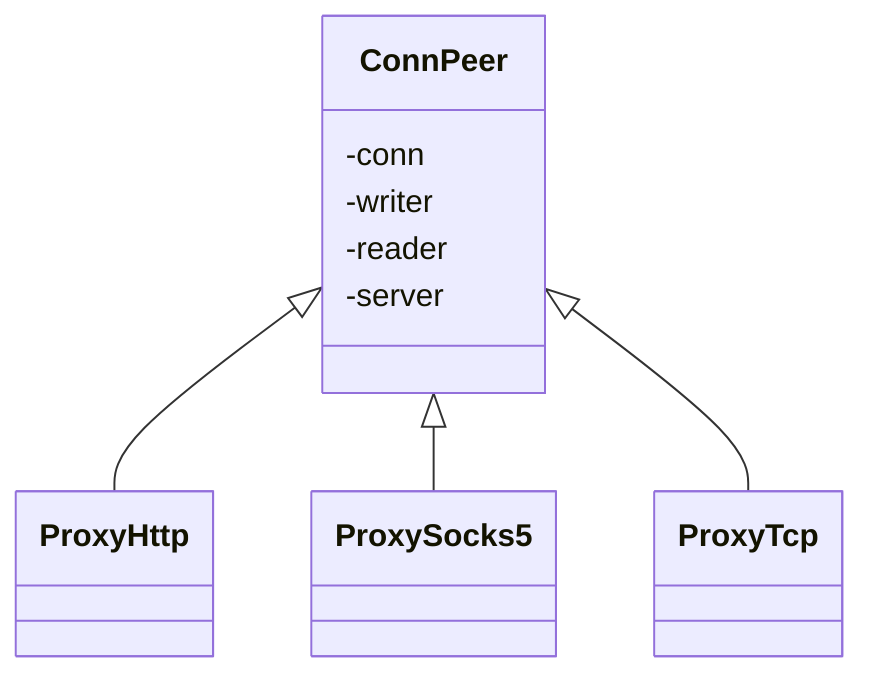
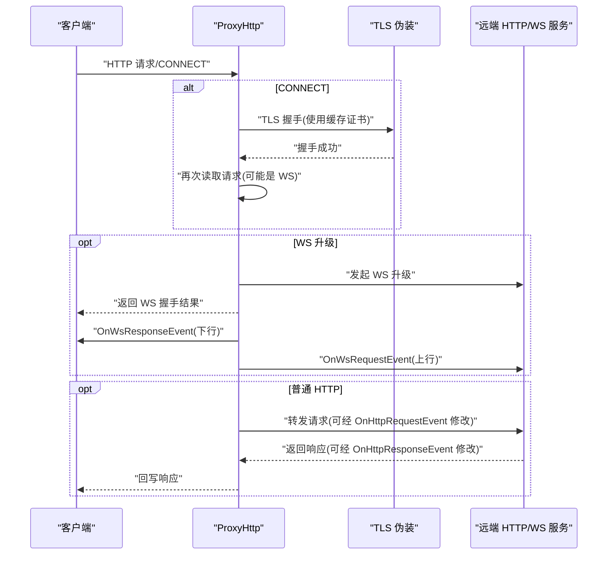
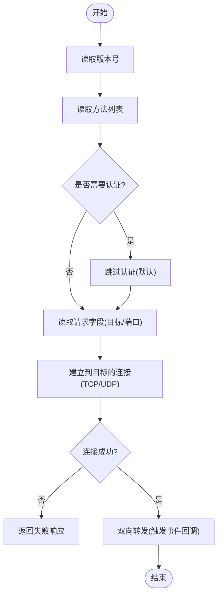
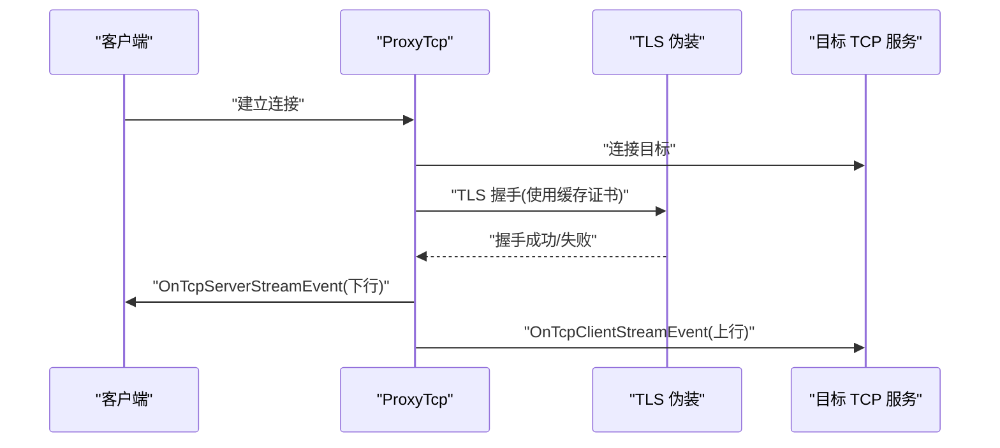
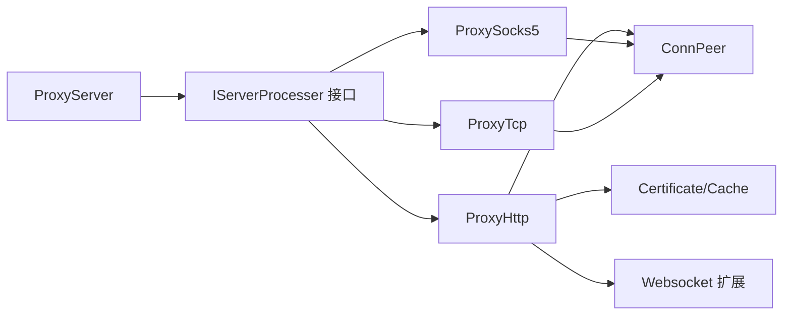
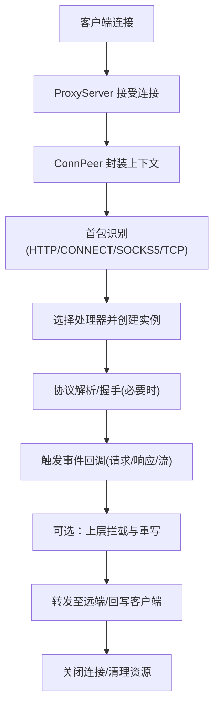

# 核心架构

<cite>
**本文引用的文件**
- [Main.go](file://Main.go)
- [ProxyServer.go](file://Core/ProxyServer.go)
- [IServerProcesser.go](file://Contract/IServerProcesser.go)
- [ConnPeer.go](file://Core/ConnPeer.go)
- [ProxyHttp.go](file://Core/ProxyHttp.go)
- [ProxySocks5.go](file://Core/ProxySocks5.go)
- [ProxyTcp.go](file://Core/ProxyTcp.go)
- [Certificate.go](file://Core/Certificate.go)
- [Cache.go](file://Core/Cache.go)
- [README.md](file://README.md)
- [Doc.go](file://Core/Websocket/Doc.go)
- [Proxy.go](file://Core/Websocket/Proxy.go)
</cite>

## 目录
1. [引言](#引言)
2. [项目结构](#项目结构)
3. [核心组件](#核心组件)
4. [架构总览](#架构总览)
5. [详细组件分析](#详细组件分析)
6. [依赖分析](#依赖分析)
7. [性能考量](#性能考量)
8. [故障排查指南](#故障排查指南)
9. [结论](#结论)
10. [附录](#附录)

## 引言
本架构文档面向 shermie-proxy 的核心设计与实现，重点阐述以下主题：
- 事件驱动架构模式：通过回调事件钩子（OnHttpRequestEvent、OnHttpResponseEvent 等）实现“连接接入—协议识别—事件分发—业务处理”的解耦流程。
- 插件化设计思想：IServerProcesser 接口抽象不同协议处理器（HTTP/HTTPS/WS/SOCKS5/TCP），ProxyServer 在运行期根据首包特征动态选择具体处理器，便于扩展新协议。
- 组件交互关系：ProxyServer 作为中央协调器，ConnPeer 封装连接上下文，各协议处理器基于 ConnPeer 完成读写与转发；证书缓存与根证书生成模块支撑 TLS/WS 场景。

## 项目结构
项目采用按功能域划分的层次化组织方式：
- Core：核心逻辑，包含 ProxyServer、各协议处理器、证书与缓存、Websocket 扩展等。
- Contract：契约层，定义 IServerProcesser 接口，约束协议处理器实现。
- Log：日志模块。
- Utils：平台工具与系统代理设置。
- Root：入口程序 Main.go，负责参数解析、服务启动与事件注册。



**图表来源**
- [Main.go:24-124](file://Main.go#L24-L124)
- [ProxyServer.go:123-213](file://Core/ProxyServer.go#L123-L213)
- [ProxyHttp.go:44-132](file://Core/ProxyHttp.go#L44-L132)
- [ProxySocks5.go:54-240](file://Core/ProxySocks5.go#L54-L240)
- [ProxyTcp.go:23-66](file://Core/ProxyTcp.go#L23-L66)
- [ConnPeer.go:8-14](file://Core/ConnPeer.go#L8-L14)
- [Certificate.go:35-67](file://Core/Certificate.go#L35-L67)
- [Cache.go:39-78](file://Core/Cache.go#L39-L78)

**章节来源**
- [Main.go:24-124](file://Main.go#L24-L124)
- [README.md:19-30](file://README.md#L19-L30)

## 核心组件
- ProxyServer：监听端口、接受连接、协议识别、事件分发、多路复用监听。
- IServerProcesser：协议处理器统一接口，所有协议处理器实现 Handle()。
- ConnPeer：封装底层 net.Conn、bufio.Reader/Writer 与 ProxyServer 引用，作为协议处理器的上下文载体。
- 协议处理器：
  - ProxyHttp：HTTP/HTTPS/WS 协议处理，含 TLS 握手、WS 升级、请求/响应拦截与重写。
  - ProxySocks5：SOCKS5 握手与双向转发，支持 UDP/TCP。
  - ProxyTcp：TCP 透明代理，支持 TLS 伪装与双向转发。
- 证书体系：Certificate 负责根证书生成与子证书签发；Cache 提供并发安全的证书缓存。
- Websocket 扩展：基于第三方库的 Upgrader/Dialer、代理 CONNECT 支持、压缩与追踪等。

**章节来源**
- [ProxyServer.go:48-77](file://Core/ProxyServer.go#L48-L77)
- [IServerProcesser.go:3-5](file://Contract/IServerProcesser.go#L3-L5)
- [ConnPeer.go:8-14](file://Core/ConnPeer.go#L8-L14)
- [ProxyHttp.go:29-42](file://Core/ProxyHttp.go#L29-L42)
- [ProxySocks5.go:15-22](file://Core/ProxySocks5.go#L15-L22)
- [ProxyTcp.go:15-22](file://Core/ProxyTcp.go#L15-L22)
- [Certificate.go:20-32](file://Core/Certificate.go#L20-L32)
- [Cache.go:20-30](file://Core/Cache.go#L20-L30)

## 架构总览
Shermie 采用“事件驱动 + 插件化处理器”的架构：
- 入口 Main.go 初始化日志与根证书后，创建并启动 ProxyServer。
- ProxyServer 多路监听 Accept，收到连接后通过 ConnPeer 封装上下文，并依据首包特征选择具体处理器（HTTP/CONNECT、SOCKS5、TCP）。
- 处理器内部完成协议解析、必要时进行 TLS/WS 升级，随后将数据流转发至远端，并在关键节点触发事件回调，允许上层进行数据拦截与修改。
- 证书与缓存模块贯穿 HTTPS/WS TLS 流程，确保代理场景下的证书链可用性。



**图表来源**
- [ProxyServer.go:176-203](file://Core/ProxyServer.go#L176-L203)
- [ProxyHttp.go:44-132](file://Core/ProxyHttp.go#L44-L132)
- [ProxySocks5.go:54-240](file://Core/ProxySocks5.go#L54-L240)
- [ProxyTcp.go:23-66](file://Core/ProxyTcp.go#L23-L66)

## 详细组件分析

### ProxyServer 中央协调器
职责与特性：
- 多路监听：启动多个 goroutine 并发 Accept，提升吞吐。
- 协议识别：读取首包字节，判断 HTTP 方法、SOCKS5 版本或默认 TCP。
- 事件分发：在连接生命周期关键节点触发 OnTcpConnectEvent/OnTcpCloseEvent 以及各类协议事件回调。
- 生命周期管理：Logo 展示、安装/卸载系统代理（Windows）、优雅停止。



**图表来源**
- [ProxyServer.go:156-203](file://Core/ProxyServer.go#L156-L203)
- [ProxyServer.go:205-212](file://Core/ProxyServer.go#L205-L212)

**章节来源**
- [ProxyServer.go:123-142](file://Core/ProxyServer.go#L123-L142)
- [ProxyServer.go:156-203](file://Core/ProxyServer.go#L156-L203)

### IServerProcesser 接口设计理念
- 统一抽象：所有协议处理器均实现 Handle()，屏蔽协议差异，便于在 ProxyServer 中统一调度。
- 易扩展：新增协议只需实现该接口并加入识别分支，无需改动核心调度逻辑。
- 低耦合：处理器仅依赖 ConnPeer 提供的 Reader/Writer 与基础连接能力。



**图表来源**
- [IServerProcesser.go:3-5](file://Contract/IServerProcesser.go#L3-L5)
- [ProxyHttp.go:44-64](file://Core/ProxyHttp.go#L44-L64)
- [ProxySocks5.go:54-110](file://Core/ProxySocks5.go#L54-L110)
- [ProxyTcp.go:23-40](file://Core/ProxyTcp.go#L23-L40)

**章节来源**
- [IServerProcesser.go:3-5](file://Contract/IServerProcesser.go#L3-L5)

### ConnPeer 连接上下文封装
- 职责：持有底层连接、读写缓冲与 ProxyServer 引用，为处理器提供统一的 I/O 通道与环境信息。
- 设计优势：避免处理器直接操作底层细节，降低复杂度；便于在处理器内部共享通用能力（如 DNS、网络策略）。



**图表来源**
- [ConnPeer.go:8-14](file://Core/ConnPeer.go#L8-L14)
- [ProxyHttp.go:29-37](file://Core/ProxyHttp.go#L29-L37)
- [ProxySocks5.go:15-19](file://Core/ProxySocks5.go#L15-L19)
- [ProxyTcp.go:15-19](file://Core/ProxyTcp.go#L15-L19)

**章节来源**
- [ConnPeer.go:8-14](file://Core/ConnPeer.go#L8-L14)

### HTTP/HTTPS/WS 处理器（ProxyHttp）
- 协议处理：
  - 普通 HTTP：读取请求、可选拦截与重写、转发、读取响应、可选拦截与重写、回写客户端。
  - HTTPS：CONNECT 握手成功后，基于根证书生成子证书进行 TLS 伪装，再进入 HTTP 请求处理。
  - WS/WSS：检测 Upgrade 头，执行协议升级，建立双工通道，分别触发 OnWsRequestEvent/OnWsResponseEvent。
- 关键机制：
  - Resolve* 回调：允许上层在事件中重写请求/响应体与头部。
  - DialContext：支持指定网卡、Nagle 控制、上游代理、DNS 缓存。
  - 证书链：通过 Cache 与 Certificate 动态生成并缓存证书，满足 TLS/WS 场景。



**图表来源**
- [ProxyHttp.go:44-132](file://Core/ProxyHttp.go#L44-L132)
- [ProxyHttp.go:206-286](file://Core/ProxyHttp.go#L206-L286)
- [ProxyHttp.go:288-434](file://Core/ProxyHttp.go#L288-L434)
- [ProxyHttp.go:436-468](file://Core/ProxyHttp.go#L436-L468)

**章节来源**
- [ProxyHttp.go:44-132](file://Core/ProxyHttp.go#L44-L132)
- [ProxyHttp.go:206-286](file://Core/ProxyHttp.go#L206-L286)
- [ProxyHttp.go:288-434](file://Core/ProxyHttp.go#L288-L434)
- [ProxyHttp.go:436-468](file://Core/ProxyHttp.go#L436-L468)

### SOCKS5 处理器（ProxySocks5）
- 协议处理：
  - 版本协商、方法选择、请求解析（目标类型：IPv4/IPv6/域名）、端口解析。
  - 建立到目标的 TCP/UDP 连接，握手成功后双向转发。
  - 触发 OnSocks5RequestEvent/OnSocks5ResponseEvent，允许上层拦截与修改。
- 错误处理：
  - 握手阶段与转发阶段均进行错误分类与日志输出，保证稳定性。



**图表来源**
- [ProxySocks5.go:54-240](file://Core/ProxySocks5.go#L54-L240)

**章节来源**
- [ProxySocks5.go:54-240](file://Core/ProxySocks5.go#L54-L240)

### TCP 处理器（ProxyTcp）
- 协议处理：
  - 通过配置目标地址建立 TCP 连接，若握手成功则替换底层连接为 TLS 伪装。
  - 双向转发，触发 OnTcpClientStreamEvent/OnTcpServerStreamEvent，允许上层拦截与修改。
- 参数控制：
  - 支持禁用 Nagle（nagle=false）以降低延迟。



**图表来源**
- [ProxyTcp.go:23-66](file://Core/ProxyTcp.go#L23-L66)

**章节来源**
- [ProxyTcp.go:23-66](file://Core/ProxyTcp.go#L23-L66)

### 证书与缓存（Certificate/Cache）
- Certificate：生成/加载根证书，为每个主机生成子证书（含序列号、有效期、用途等），并导出 PEM。
- Cache：并发安全的证书缓存，对同一主机的并发请求仅生成一次证书，避免重复开销。

```mermaid
classDiagram
class Certificate {
+Init() error
+GeneratePem(host) ([]byte, []byte, error)
+GenerateRootPemFile(host) (*pem.Block, *pem.Block, error)
}
class Storage {
+GetCertificate(hostname, port) (interface{}, error)
}
Storage --> Certificate : "生成/缓存证书"
```

**图表来源**
- [Certificate.go:35-67](file://Core/Certificate.go#L35-L67)
- [Certificate.go:69-116](file://Core/Certificate.go#L69-L116)
- [Cache.go:39-78](file://Core/Cache.go#L39-L78)

**章节来源**
- [Certificate.go:35-67](file://Core/Certificate.go#L35-L67)
- [Certificate.go:69-116](file://Core/Certificate.go#L69-L116)
- [Cache.go:39-78](file://Core/Cache.go#L39-L78)

### Websocket 扩展与代理
- 文档与规范：Doc.go 提供 WebSocket 协议与使用说明，涵盖消息类型、缓冲区、压缩、Origin 策略等。
- 代理支持：Proxy.go 实现 HTTP CONNECT 代理拨号，支持 Basic 认证头注入。
- 与核心集成：ProxyHttp 在 HTTPS/WS 场景下使用 Upgrader/Dialer 完成升级与连接。

**章节来源**
- [Doc.go:1-228](file://Core/Websocket/Doc.go#L1-L228)
- [Proxy.go:23-78](file://Core/Websocket/Proxy.go#L23-L78)
- [ProxyHttp.go:328-434](file://Core/ProxyHttp.go#L328-L434)

## 依赖分析
- 组件内聚与耦合：
  - ProxyServer 与各处理器之间通过 IServerProcesser 接口耦合，保持高内聚、低耦合。
  - ConnPeer 作为共享上下文，减少处理器对底层细节的感知。
- 外部依赖：
  - DNS 缓存：dnscache 用于解析与缓存域名 IP。
  - WebSocket 库：Upgrader/Dialer 用于协议升级与连接。
  - TLS：标准库 tls 与证书生成。
- 循环依赖：未发现循环导入；模块边界清晰。



**图表来源**
- [ProxyServer.go:48-77](file://Core/ProxyServer.go#L48-L77)
- [IServerProcesser.go:3-5](file://Contract/IServerProcesser.go#L3-L5)
- [ProxyHttp.go:29-42](file://Core/ProxyHttp.go#L29-L42)
- [ProxySocks5.go:15-22](file://Core/ProxySocks5.go#L15-L22)
- [ProxyTcp.go:15-22](file://Core/ProxyTcp.go#L15-L22)
- [ConnPeer.go:8-14](file://Core/ConnPeer.go#L8-L14)
- [Certificate.go:20-32](file://Core/Certificate.go#L20-L32)
- [Cache.go:20-30](file://Core/Cache.go#L20-L30)

**章节来源**
- [ProxyServer.go:48-77](file://Core/ProxyServer.go#L48-L77)
- [ProxyHttp.go:29-42](file://Core/ProxyHttp.go#L29-L42)
- [ProxySocks5.go:15-22](file://Core/ProxySocks5.go#L15-L22)
- [ProxyTcp.go:15-22](file://Core/ProxyTcp.go#L15-L22)

## 性能考量
- 并发模型：多路监听 Accept，每条连接独立 goroutine 处理，充分利用多核。
- Nagle 控制：可通过参数 nagle=false 关闭 Nagle，降低延迟，适合实时性要求高的场景。
- 缓冲与 I/O：处理器统一使用 bufio.Reader/Writer，减少系统调用次数。
- DNS 缓存：内置 dnscache，降低域名解析抖动与延迟。
- 证书缓存：并发安全的证书缓存，避免重复生成，显著降低 TLS 场景开销。
- WebSocket：支持压缩与 Upgrader/Dialer 的缓冲优化，减少帧头开销。

[本节为通用性能讨论，不直接分析具体文件]

## 故障排查指南
- 启动与证书
  - 若未初始化根证书，HTTPS/WS 场景会失败；需先调用初始化流程。
  - Windows 平台可尝试安装系统代理，非 Windows 需手动安装证书并设置代理。
- 连接与协议
  - HTTP/HTTPS：检查 OnHttpRequestEvent/OnHttpResponseEvent 是否正确重写请求/响应；确认上游代理与目标地址配置。
  - SOCKS5：确认目标地址类型与端口解析；关注握手阶段返回码。
  - TCP：确认目标地址解析与 TLS 握手；检查 Nagle 设置。
- 日志定位
  - 各处理器在关键路径均有日志输出，结合事件回调返回值定位问题（例如事件回调返回 false 表示上层已自行处理，无需继续）。

**章节来源**
- [ProxyServer.go:79-96](file://Core/ProxyServer.go#L79-L96)
- [ProxyHttp.go:108-131](file://Core/ProxyHttp.go#L108-L131)
- [ProxySocks5.go:196-240](file://Core/ProxySocks5.go#L196-L240)
- [ProxyTcp.go:54-66](file://Core/ProxyTcp.go#L54-L66)

## 结论
Shermie 通过“事件驱动 + 插件化处理器”的架构，实现了对 HTTP/HTTPS/WS/SOCKS5/TCP 的统一接入与灵活扩展。ProxyServer 作为中央协调器，承担协议识别与事件分发；IServerProcesser 与 ConnPeer 提供清晰的扩展点与上下文封装；证书与缓存模块保障 TLS/WS 场景的可用性与性能。该设计在可扩展性、可维护性与性能之间取得良好平衡，适合在代理与中间件场景中进一步演进。

[本节为总结性内容，不直接分析具体文件]

## 附录

### 数据流向与处理流程（端到端）


**图表来源**
- [ProxyServer.go:176-203](file://Core/ProxyServer.go#L176-L203)
- [ProxyHttp.go:44-132](file://Core/ProxyHttp.go#L44-L132)
- [ProxySocks5.go:54-240](file://Core/ProxySocks5.go#L54-L240)
- [ProxyTcp.go:23-66](file://Core/ProxyTcp.go#L23-L66)

### 扩展点与自定义接口
- 协议扩展：实现 IServerProcesser 接口并加入 ProxyServer 的识别分支。
- 事件扩展：利用现有事件回调（OnHttpRequestEvent、OnHttpResponseEvent、OnWsRequestEvent、OnWsResponseEvent、OnSocks5RequestEvent、OnSocks5ResponseEvent、OnTcpClientStreamEvent、OnTcpServerStreamEvent）进行数据拦截与修改。
- 系统集成：Main.go 展示了如何注册事件回调与启动服务，便于二次开发。

**章节来源**
- [IServerProcesser.go:3-5](file://Contract/IServerProcesser.go#L3-L5)
- [ProxyServer.go:22-34](file://Core/ProxyServer.go#L22-L34)
- [Main.go:53-123](file://Main.go#L53-L123)