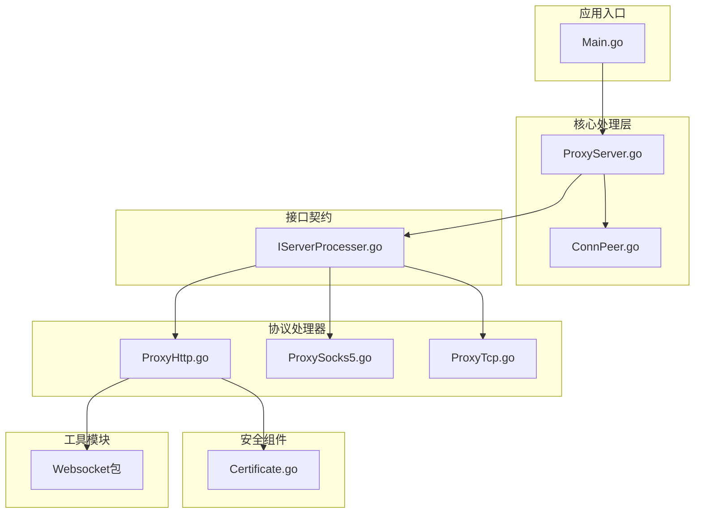
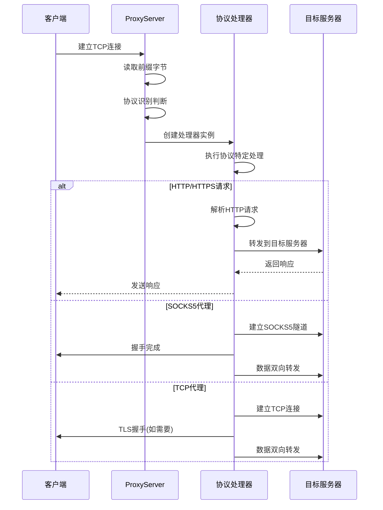
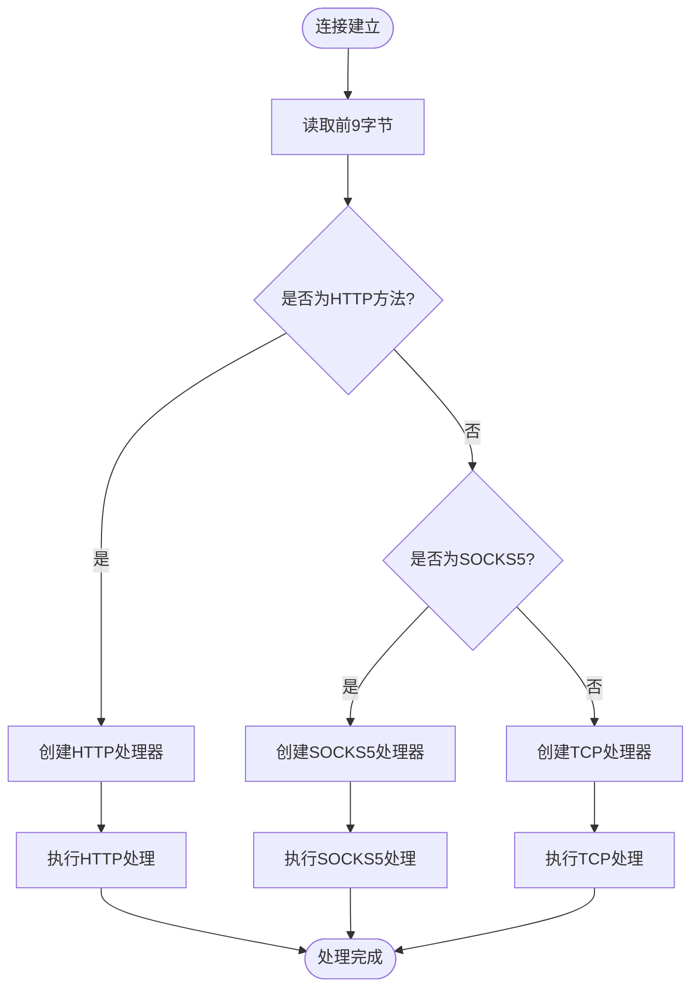
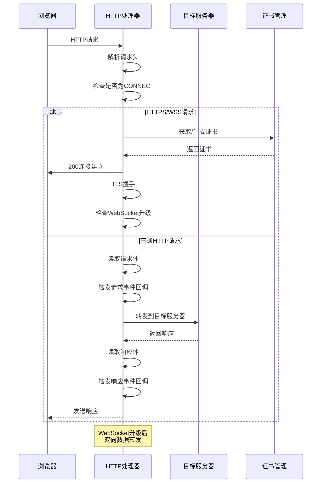
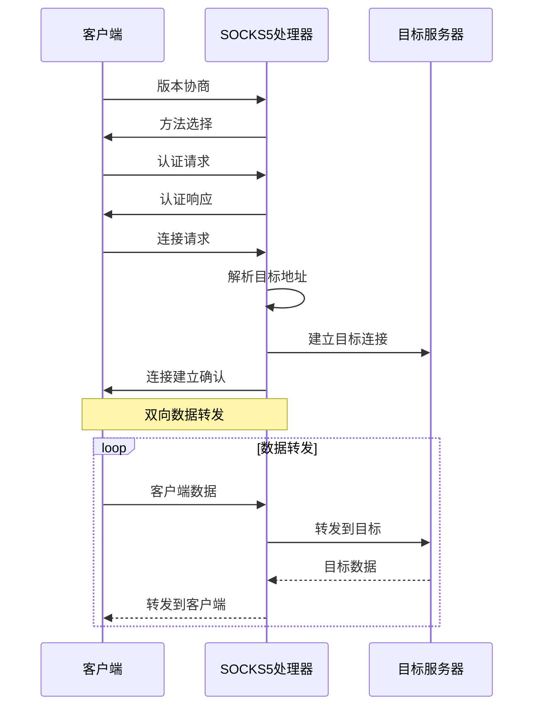
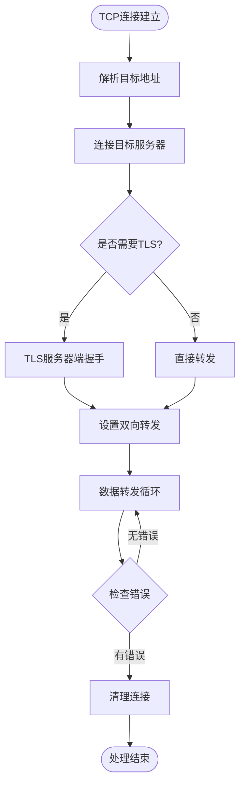
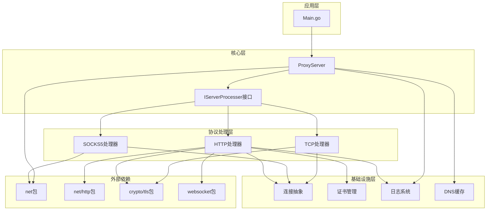

# 组件交互关系

<cite>
**本文档引用的文件**
- [Main.go](file://Main.go)
- [ProxyServer.go](file://Core/ProxyServer.go)
- [IServerProcesser.go](file://Contract/IServerProcesser.go)
- [ProxyHttp.go](file://Core/ProxyHttp.go)
- [ProxySocks5.go](file://Core/ProxySocks5.go)
- [ProxyTcp.go](file://Core/ProxyTcp.go)
- [ConnPeer.go](file://Core/ConnPeer.go)
- [Certificate.go](file://Core/Certificate.go)
- [README.md](file://README.md)
</cite>

## 目录
1. [简介](#简介)
2. [项目结构](#项目结构)
3. [核心组件](#核心组件)
4. [架构概览](#架构概览)
5. [详细组件分析](#详细组件分析)
6. [依赖关系分析](#依赖关系分析)
7. [性能考虑](#性能考虑)
8. [故障排除指南](#故障排除指南)
9. [结论](#结论)

## 简介

Shermie-Proxy 是一个功能强大的多协议代理服务器，支持 HTTP、HTTPS、WebSocket、TCP 和 SOCKS5 协议的数据接收和转发。该系统通过智能协议识别机制，能够自动检测传入连接的协议类型，并根据不同的协议进行相应的处理。系统提供了丰富的事件回调机制，允许开发者对数据流进行拦截和自定义修改。

## 项目结构

项目采用模块化设计，主要分为以下几个核心模块：



**图表来源**
- [Main.go:1-124](file://Main.go#L1-L124)
- [ProxyServer.go:1-213](file://Core/ProxyServer.go#L1-L213)
- [IServerProcesser.go:1-8](file://Contract/IServerProcesser.go#L1-L8)

**章节来源**
- [Main.go:1-124](file://Main.go#L1-L124)
- [README.md:19-30](file://README.md#L19-L30)

## 核心组件

### ProxyServer - 代理服务器核心

ProxyServer 是整个系统的中枢控制器，负责监听客户端连接、协议识别和分发到相应的处理器。

**核心职责：**
- 接受客户端连接并启动处理流程
- 协议识别（HTTP/HTTPS/WebSocket/SOCKS5/TCP）
- 事件回调管理
- 连接生命周期管理

**关键特性：**
- 多线程并发处理（5个监听goroutine）
- DNS缓存机制
- 系统代理设置支持
- 证书管理集成

### IServerProcesser - 处理器接口

定义了所有协议处理器的统一接口，确保不同协议的处理逻辑具有一致性。

**接口定义：**
```go
type IServerProcesser interface {
    Handle()
}
```

### ConnPeer - 连接抽象

为所有协议处理器提供统一的网络连接抽象，封装了底层的网络I/O操作。

**核心字段：**
- `conn`: 底层网络连接
- `reader`: 输入缓冲区
- `writer`: 输出缓冲区
- `server`: 关联的ProxyServer实例

**章节来源**
- [ProxyServer.go:48-66](file://Core/ProxyServer.go#L48-L66)
- [IServerProcesser.go:3-5](file://Contract/IServerProcesser.go#L3-L5)
- [ConnPeer.go:8-13](file://Core/ConnPeer.go#L8-L13)

## 架构概览

系统采用"策略模式 + 观察者模式"的混合架构设计，实现了高度的模块化和可扩展性。



**图表来源**
- [ProxyServer.go:176-203](file://Core/ProxyServer.go#L176-L203)
- [ProxyHttp.go:44-64](file://Core/ProxyHttp.go#L44-L64)
- [ProxySocks5.go:54-240](file://Core/ProxySocks5.go#L54-L240)
- [ProxyTcp.go:23-66](file://Core/ProxyTcp.go#L23-L66)

## 详细组件分析

### 协议识别与路由机制

系统通过读取连接的前缀字节来智能识别协议类型：



**图表来源**
- [ProxyServer.go:176-203](file://Core/ProxyServer.go#L176-L203)
- [ProxyServer.go:205-212](file://Core/ProxyServer.go#L205-L212)

### HTTP/HTTPS/WebSocket 处理流程

HTTP处理器是最复杂的组件，需要处理多种协议变体：



**图表来源**
- [ProxyHttp.go:44-132](file://Core/ProxyHttp.go#L44-L132)
- [ProxyHttp.go:206-286](file://Core/ProxyHttp.go#L206-L286)
- [ProxyHttp.go:328-434](file://Core/ProxyHttp.go#L328-L434)

### SOCKS5 代理处理流程

SOCKS5处理器实现完整的SOCKS5协议支持：



**图表来源**
- [ProxySocks5.go:54-240](file://Core/ProxySocks5.go#L54-L240)

### TCP 代理处理流程

TCP处理器提供简单的TCP连接转发功能：



**图表来源**
- [ProxyTcp.go:23-66](file://Core/ProxyTcp.go#L23-L66)

**章节来源**
- [ProxyHttp.go:1-491](file://Core/ProxyHttp.go#L1-L491)
- [ProxySocks5.go:1-300](file://Core/ProxySocks5.go#L1-L300)
- [ProxyTcp.go:1-112](file://Core/ProxyTcp.go#L1-L112)

## 依赖关系分析

系统采用清晰的分层依赖结构，确保模块间的松耦合：



**图表来源**
- [Main.go:3-11](file://Main.go#L3-L11)
- [ProxyServer.go:3-16](file://Core/ProxyServer.go#L3-L16)
- [ProxyHttp.go:3-22](file://Core/ProxyHttp.go#L3-L22)

### 组件解耦设计

系统通过以下机制实现组件解耦：

1. **接口隔离**: IServerProcesser接口定义了统一的处理规范
2. **依赖注入**: 通过构造函数注入依赖关系
3. **事件驱动**: 使用回调函数实现松散耦合的事件通知
4. **配置分离**: 通过标志参数控制行为

**章节来源**
- [IServerProcesser.go:3-5](file://Contract/IServerProcesser.go#L3-L5)
- [ProxyServer.go:68-77](file://Core/ProxyServer.go#L68-L77)

## 性能考虑

### 并发模型

系统采用多goroutine并发模型，每个监听器都有独立的处理goroutine：

- **监听器数量**: 默认5个并发监听器
- **连接处理**: 每个连接启动独立的处理goroutine
- **缓冲区优化**: 使用bufio进行I/O缓冲优化

### 缓存策略

- **DNS缓存**: 使用dnscache库缓存DNS查询结果，默认5分钟过期
- **证书缓存**: 动态生成和缓存TLS证书
- **连接池**: HTTP传输层使用连接池管理

### 网络优化

- **Nagle算法**: 可配置的Nagle算法开关
- **TCP选项**: 支持KeepAlive和超时设置
- **缓冲大小**: 可配置的读写缓冲区大小

## 故障排除指南

### 常见问题诊断

1. **连接超时问题**
   - 检查目标服务器可达性
   - 验证防火墙设置
   - 调整超时参数

2. **TLS证书问题**
   - 确认根证书正确安装
   - 检查证书有效期
   - 验证证书链完整性

3. **协议识别失败**
   - 检查客户端发送的协议头
   - 验证协议兼容性
   - 查看日志输出

### 日志分析

系统提供详细的日志输出，包括：
- 连接建立和断开信息
- 协议识别结果
- 错误处理信息
- 数据转发统计

**章节来源**
- [ProxyServer.go:110-121](file://Core/ProxyServer.go#L110-L121)
- [Certificate.go:35-67](file://Core/Certificate.go#L35-L67)

## 结论

Shermie-Proxy 通过精心设计的架构实现了多协议代理的核心功能。系统的主要优势包括：

1. **高度模块化**: 清晰的分层设计和接口定义
2. **强扩展性**: 通过事件回调机制支持灵活的功能扩展
3. **性能优化**: 多并发模型和缓存策略
4. **易用性**: 简单的配置和使用方式

该系统为开发者提供了一个强大而灵活的代理解决方案，既适合个人使用也适合企业级部署。通过理解组件间的交互关系和数据流向，开发者可以更好地利用系统的功能或进行二次开发。