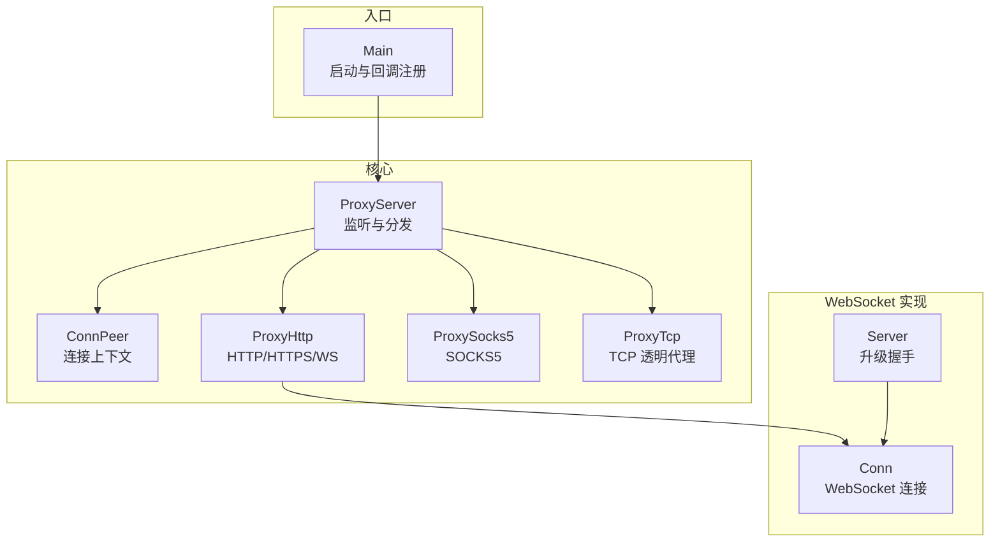
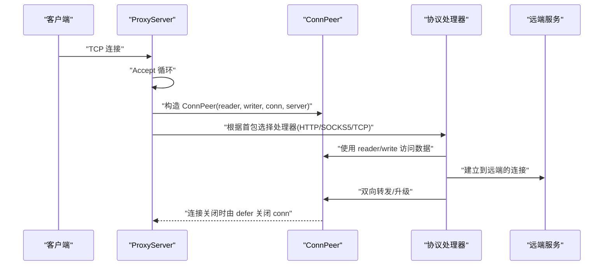
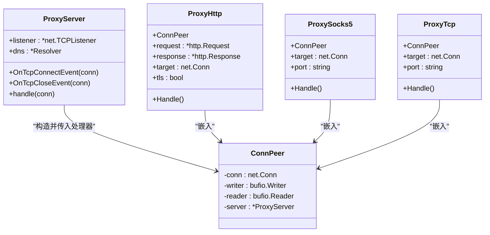
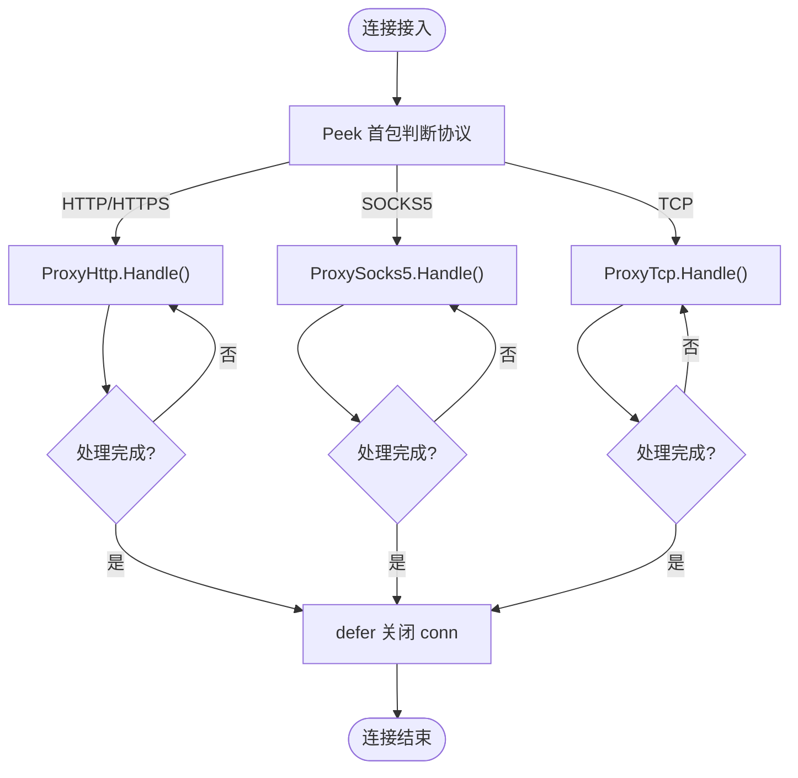
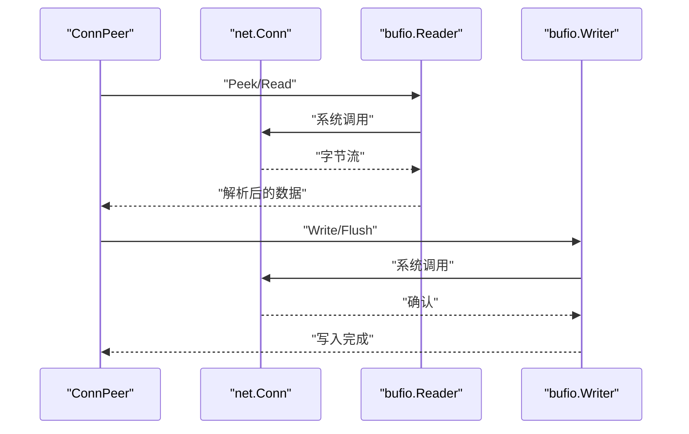
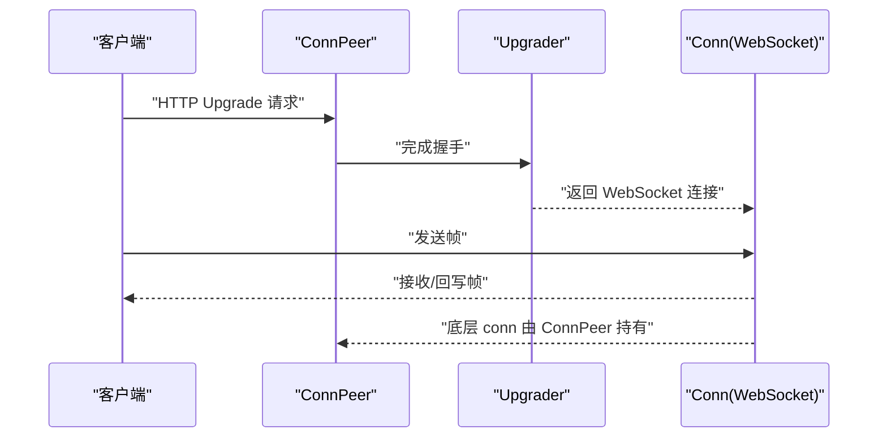
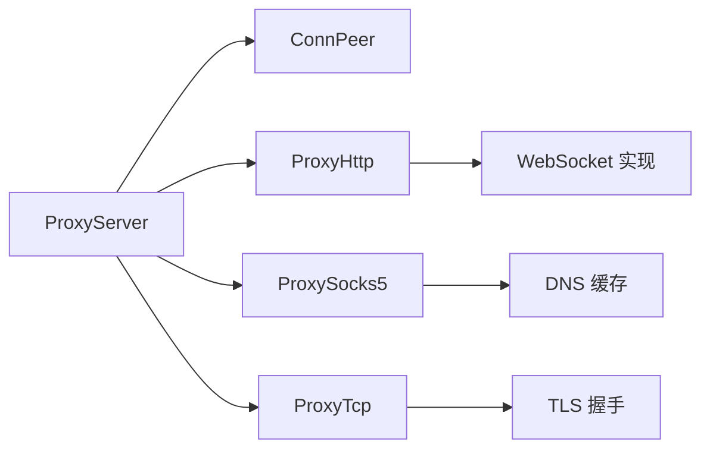

# 连接上下文管理

<cite>
**本文引用的文件**
- [Core/ConnPeer.go](file://Core/ConnPeer.go)
- [Core/ProxyServer.go](file://Core/ProxyServer.go)
- [Core/ProxyHttp.go](file://Core/ProxyHttp.go)
- [Core/ProxySocks5.go](file://Core/ProxySocks5.go)
- [Core/ProxyTcp.go](file://Core/ProxyTcp.go)
- [Main.go](file://Main.go)
- [Core/Websocket/Conn.go](file://Core/Websocket/Conn.go)
- [Core/Websocket/ConnWrite.go](file://Core/Websocket/ConnWrite.go)
- [Core/Websocket/Server.go](file://Core/Websocket/Server.go)
- [CODE-DOC.md](file://CODE-DOC.md)
</cite>

## 目录
1. [引言](#引言)
2. [项目结构](#项目结构)
3. [核心组件](#核心组件)
4. [架构总览](#架构总览)
5. [详细组件分析](#详细组件分析)
6. [依赖分析](#依赖分析)
7. [性能考虑](#性能考虑)
8. [故障排查指南](#故障排查指南)
9. [结论](#结论)
10. [附录](#附录)

## 引言
本文件聚焦于 shermie-proxy 的“连接上下文管理”，围绕 ConnPeer 结构体及其在 HTTP、SOCKS5、TCP、WebSocket 协议处理中的作用进行系统化说明。内容涵盖：
- ConnPeer 的设计目的与字段语义
- 连接生命周期管理（从接入到关闭）
- Reader/Writer 的双重封装设计及在不同协议中的应用
- 连接状态管理与错误处理最佳实践
- 连接池、超时控制与资源清理的实现要点

## 项目结构
与连接上下文管理直接相关的核心模块如下：
- Core/ConnPeer.go：定义通用连接上下文结构体
- Core/ProxyServer.go：监听与分发，构造 ConnPeer 并选择处理器
- Core/ProxyHttp.go：HTTP/HTTPS/WS 协议处理
- Core/ProxySocks5.go：SOCKS5 协议处理
- Core/ProxyTcp.go：TCP 透明代理与 TLS 握手
- Core/Websocket/*：WebSocket 协议实现（fork 自 gorilla/websocket）
- Main.go：启动入口与回调注册示例

图表来源
- [Core/ProxyServer.go:176-203](file://Core/ProxyServer.go#L176-L203)
- [Core/ConnPeer.go:8-13](file://Core/ConnPeer.go#L8-L13)
- [Core/ProxyHttp.go:29-64](file://Core/ProxyHttp.go#L29-L64)
- [Core/ProxySocks5.go:15-54](file://Core/ProxySocks5.go#L15-L54)
- [Core/ProxyTcp.go:15-23](file://Core/ProxyTcp.go#L15-L23)
- [Core/Websocket/Conn.go:240-282](file://Core/Websocket/Conn.go#L240-L282)
- [Core/Websocket/Server.go:214-267](file://Core/Websocket/Server.go#L214-L267)
- [Main.go:48-123](file://Main.go#L48-L123)

章节来源
- [Core/ProxyServer.go:176-203](file://Core/ProxyServer.go#L176-L203)
- [Core/ConnPeer.go:8-13](file://Core/ConnPeer.go#L8-L13)
- [Main.go:48-123](file://Main.go#L48-L123)

## 核心组件
- ConnPeer：统一承载一次接入连接的底层 net.Conn、读写缓冲区与所属服务器指针，作为各协议处理器的嵌入式基座。
- ProxyServer：负责监听、并发 Accept、构造 ConnPeer，并根据首包特征选择具体处理器。
- 协议处理器：
  - ProxyHttp：处理 HTTP/HTTPS CONNECT、普通 HTTP、WebSocket 升级
  - ProxySocks5：处理 SOCKS5 握手与转发
  - ProxyTcp：处理 TCP 透明代理与 TLS 握手

章节来源
- [Core/ConnPeer.go:8-13](file://Core/ConnPeer.go#L8-L13)
- [Core/ProxyServer.go:176-203](file://Core/ProxyServer.go#L176-L203)
- [Core/ProxyHttp.go:29-64](file://Core/ProxyHttp.go#L29-L64)
- [Core/ProxySocks5.go:15-54](file://Core/ProxySocks5.go#L15-L54)
- [Core/ProxyTcp.go:15-23](file://Core/ProxyTcp.go#L15-L23)

## 架构总览
下图展示从连接接入到协议处理的整体流程，以及 ConnPeer 在其中的角色。

图表来源
- [Core/ProxyServer.go:176-203](file://Core/ProxyServer.go#L176-L203)
- [Core/ProxyHttp.go:44-64](file://Core/ProxyHttp.go#L44-L64)
- [Core/ProxySocks5.go:54-94](file://Core/ProxySocks5.go#L54-L94)
- [Core/ProxyTcp.go:23-66](file://Core/ProxyTcp.go#L23-L66)

## 详细组件分析

### ConnPeer 结构体设计与字段语义
- 字段与职责
  - conn：底层网络连接对象，承载实际读写与生命周期
  - reader：基于 conn 的读缓冲区，用于高效读取首包与后续数据
  - writer：基于 conn 的写缓冲区，用于高效写回响应或转发
  - server：指向当前 ProxyServer，便于访问全局配置与事件回调
- 设计目的
  - 将“连接”与“读写缓冲”抽象为统一上下文，避免在每个处理器中重复构造
  - 通过嵌入方式，使 HTTP/SOCKS5/TCP/WS 处理器共享同一套基础能力
- 使用模式
  - 在 ProxyServer.handle 中创建 ConnPeer，并按协议类型嵌入到对应处理器
  - 处理器内部可直接使用 ConnPeer 的 reader/writer 进行协议解析与回写

图表来源
- [Core/ConnPeer.go:8-13](file://Core/ConnPeer.go#L8-L13)
- [Core/ProxyServer.go:176-203](file://Core/ProxyServer.go#L176-L203)
- [Core/ProxyHttp.go:29-37](file://Core/ProxyHttp.go#L29-L37)
- [Core/ProxySocks5.go:15-19](file://Core/ProxySocks5.go#L15-L19)
- [Core/ProxyTcp.go:15-19](file://Core/ProxyTcp.go#L15-L19)

章节来源
- [Core/ConnPeer.go:8-13](file://Core/ConnPeer.go#L8-L13)
- [Core/ProxyServer.go:176-203](file://Core/ProxyServer.go#L176-L203)

### 连接生命周期管理
- 接入阶段
  - ProxyServer.MultiListen 启动多个接受循环，Accept 到新连接后立即构造 ConnPeer
  - 通过 reader.Peek 识别协议类型，选择 HTTP/SOCKS5/TCP 处理器
- 处理阶段
  - 各处理器在 Handle 中完成协议解析、远端连接建立与数据转发
  - 通过 defer 在退出时统一关闭底层 conn，确保资源回收
- 关闭阶段
  - OnTcpCloseEvent 在 defer 中触发，便于上层统计与日志
  - WebSocket/HTTP/SSL/TCP 层面均遵循“读写异常即终止”的策略

图表来源
- [Core/ProxyServer.go:176-203](file://Core/ProxyServer.go#L176-L203)
- [Core/ProxyHttp.go:44-64](file://Core/ProxyHttp.go#L44-L64)
- [Core/ProxySocks5.go:54-94](file://Core/ProxySocks5.go#L54-L94)
- [Core/ProxyTcp.go:23-66](file://Core/ProxyTcp.go#L23-L66)

章节来源
- [Core/ProxyServer.go:176-203](file://Core/ProxyServer.go#L176-L203)
- [Core/ProxyHttp.go:44-64](file://Core/ProxyHttp.go#L44-L64)
- [Core/ProxySocks5.go:54-94](file://Core/ProxySocks5.go#L54-L94)
- [Core/ProxyTcp.go:23-66](file://Core/ProxyTcp.go#L23-L66)

### Reader/Writer 的双重封装设计
- 设计动机
  - 提升吞吐：减少系统调用次数，降低锁竞争
  - 易用性：统一读写接口，屏蔽底层协议差异
- 在不同协议中的应用
  - HTTP：使用 reader 解析首行与头部；使用 writer 回写响应
  - SOCKS5：使用 reader 顺序读取版本、方法、请求；使用 writer 写入响应
  - TCP：在 TLS 握身后，使用 reader/writer 在两条协程间双向转发
  - WebSocket：内部使用更复杂的帧级 Reader/Writer，但对外仍通过 ConnPeer 的 reader/writer 进行握手与首包处理

图表来源
- [Core/ProxyServer.go:187-188](file://Core/ProxyServer.go#L187-L188)
- [Core/ProxyHttp.go:44-64](file://Core/ProxyHttp.go#L44-L64)
- [Core/ProxySocks5.go:54-94](file://Core/ProxySocks5.go#L54-L94)
- [Core/ProxyTcp.go:68-111](file://Core/ProxyTcp.go#L68-L111)

章节来源
- [Core/ProxyServer.go:187-188](file://Core/ProxyServer.go#L187-L188)
- [Core/ProxyHttp.go:44-64](file://Core/ProxyHttp.go#L44-L64)
- [Core/ProxySocks5.go:54-94](file://Core/ProxySocks5.go#L54-L94)
- [Core/ProxyTcp.go:68-111](file://Core/ProxyTcp.go#L68-L111)

### 连接状态管理与错误处理最佳实践
- 状态管理
  - 通过 ConnPeer 统一持有 conn，避免在多处复制连接句柄
  - 在 ProxyServer.handle 中集中处理 OnTcpConnectEvent/OnTcpCloseEvent
- 错误处理
  - 读写失败即视为连接异常，及时 break/return 并关闭连接
  - 对于 HTTP/WS/SOCKS5，优先返回错误信息或空响应，避免半开状态
  - WebSocket 内部对写超时、并发写等进行保护，外部应避免跨 goroutine 并发写
- 最佳实践
  - 严格区分“读异常”和“写异常”，分别处理
  - 在协议升级前后切换 conn（如 TLS 握手成功后替换为 TLS 连接）
  - 使用 defer 统一关闭 conn，避免泄漏

章节来源
- [Core/ProxyServer.go:176-203](file://Core/ProxyServer.go#L176-L203)
- [Core/ProxyHttp.go:44-64](file://Core/ProxyHttp.go#L44-L64)
- [Core/ProxySocks5.go:54-94](file://Core/ProxySocks5.go#L54-L94)
- [Core/ProxyTcp.go:23-66](file://Core/ProxyTcp.go#L23-L66)
- [Core/Websocket/Conn.go:359-402](file://Core/Websocket/Conn.go#L359-L402)

### 超时控制与资源清理
- 超时控制
  - HTTP 传输层设置 TLS 握手与响应头超时
  - SOCKS5 目标连接设置 Dial 超时
  - WebSocket 写入路径支持 deadline 与定时器保护
  - ProxyServer 在 Accept 阶段对 net.Error 的 Timeout 进行特殊处理
- 资源清理
  - defer 关闭底层 conn
  - WebSocket 写缓冲池复用与回收
  - DNS 缓存（5 分钟 TTL）

章节来源
- [Core/ProxyHttp.go:183-200](file://Core/ProxyHttp.go#L183-L200)
- [Core/ProxySocks5.go:183-195](file://Core/ProxySocks5.go#L183-L195)
- [Core/Websocket/Conn.go:432-446](file://Core/Websocket/Conn.go#L432-L446)
- [Core/ProxyServer.go:162-168](file://Core/ProxyServer.go#L162-L168)
- [Core/Websocket/ConnWrite.go:11-15](file://Core/Websocket/ConnWrite.go#L11-L15)

### WebSocket 协议处理中的连接上下文
- 升级握手
  - 通过 Upgrader 完成 HTTP 到 WebSocket 的升级，随后使用 Conn 对象进行帧级读写
  - 握手阶段清除旧的 HTTP deadline，必要时设置握手超时
- 帧级读写
  - 使用内部 messageWriter/reader 管理帧边界与压缩
  - 写入路径支持 deadline 与并发写保护
- 与 ConnPeer 的关系
  - WebSocket 升级前仍可通过 ConnPeer 的 reader/writer 完成握手首包
  - 升级后由 Conn 承担帧级读写，但底层 conn 仍来自 ConnPeer

图表来源
- [Core/ProxyHttp.go:44-64](file://Core/ProxyHttp.go#L44-L64)
- [Core/Websocket/Server.go:214-267](file://Core/Websocket/Server.go#L214-L267)
- [Core/Websocket/Conn.go:240-282](file://Core/Websocket/Conn.go#L240-L282)

章节来源
- [Core/ProxyHttp.go:44-64](file://Core/ProxyHttp.go#L44-L64)
- [Core/Websocket/Server.go:214-267](file://Core/Websocket/Server.go#L214-L267)
- [Core/Websocket/Conn.go:240-282](file://Core/Websocket/Conn.go#L240-L282)

## 依赖分析
- 组件耦合
  - ProxyServer 仅依赖 ConnPeer 与协议处理器接口，低耦合高内聚
  - 协议处理器均嵌入 ConnPeer，形成“组合优于继承”的设计
- 外部依赖
  - DNS 缓存：提升域名解析性能与稳定性
  - WebSocket 实现：fork 自 gorilla/websocket，增强 deadline 与并发写保护
- 潜在风险
  - WebSocket 写入路径存在并发写保护，需避免外部并发写
  - SOCKS5 UDP 支持与 TCP 不同，需注意协议差异

图表来源
- [Core/ProxyServer.go:176-203](file://Core/ProxyServer.go#L176-L203)
- [Core/ProxyHttp.go:29-64](file://Core/ProxyHttp.go#L29-L64)
- [Core/ProxySocks5.go:15-54](file://Core/ProxySocks5.go#L15-L54)
- [Core/ProxyTcp.go:15-23](file://Core/ProxyTcp.go#L15-L23)
- [Core/Websocket/Conn.go:240-282](file://Core/Websocket/Conn.go#L240-L282)

章节来源
- [Core/ProxyServer.go:176-203](file://Core/ProxyServer.go#L176-L203)
- [Core/ProxyHttp.go:29-64](file://Core/ProxyHttp.go#L29-L64)
- [Core/ProxySocks5.go:15-54](file://Core/ProxySocks5.go#L15-L54)
- [Core/ProxyTcp.go:15-23](file://Core/ProxyTcp.go#L15-L23)
- [Core/Websocket/Conn.go:240-282](file://Core/Websocket/Conn.go#L240-L282)

## 性能考虑
- 读写缓冲
  - 使用 bufio.Reader/Writer 减少系统调用，建议结合业务流量调整缓冲大小
- 并发模型
  - ProxyServer 的 MultiListen 使用固定数量的接受 goroutine，避免过载
  - WebSocket 写入使用互斥通道保护，避免并发写导致的状态混乱
- 超时与背压
  - 为关键阶段设置合理超时，防止阻塞链路
  - 对于长连接场景，建议在上层实现连接池与健康检查

## 故障排查指南
- 常见问题定位
  - 无法建立远端连接：检查 Dial 超时、代理配置与 DNS 缓存
  - 握手失败：关注 TLS 配置、证书缓存与握手超时
  - 数据丢失或乱序：确认是否出现并发写或未正确处理 EOF
- 关键回调
  - OnTcpConnectEvent/OnTcpCloseEvent：用于统计与诊断
  - 协议事件回调：可在转发前后注入日志与断点
- 日志与可观测性
  - 启动入口已初始化日志，建议在回调中输出关键事件与错误栈

章节来源
- [Main.go:53-120](file://Main.go#L53-L120)
- [CODE-DOC.md:418-431](file://CODE-DOC.md#L418-L431)

## 结论
ConnPeer 作为连接上下文的核心载体，将底层连接与读写缓冲抽象为统一接口，配合 ProxyServer 的协议识别与处理器嵌入机制，实现了 HTTP/HTTPS/WS、SOCKS5、TCP 透明代理的统一接入与处理。通过合理的超时控制、错误处理与资源清理策略，系统在保证易用性的同时具备良好的稳定性与扩展性。

## 附录
- 启动与回调注册参考：Main.go
- 事件回调语义参考：CODE-DOC.md

章节来源
- [Main.go:48-123](file://Main.go#L48-L123)
- [CODE-DOC.md:418-431](file://CODE-DOC.md#L418-L431)