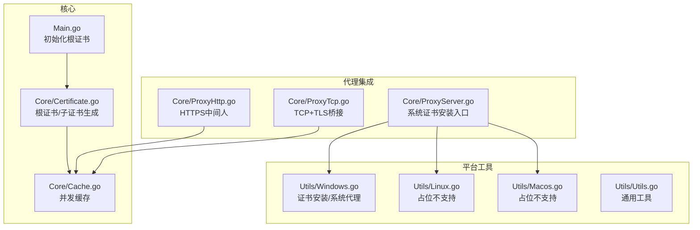
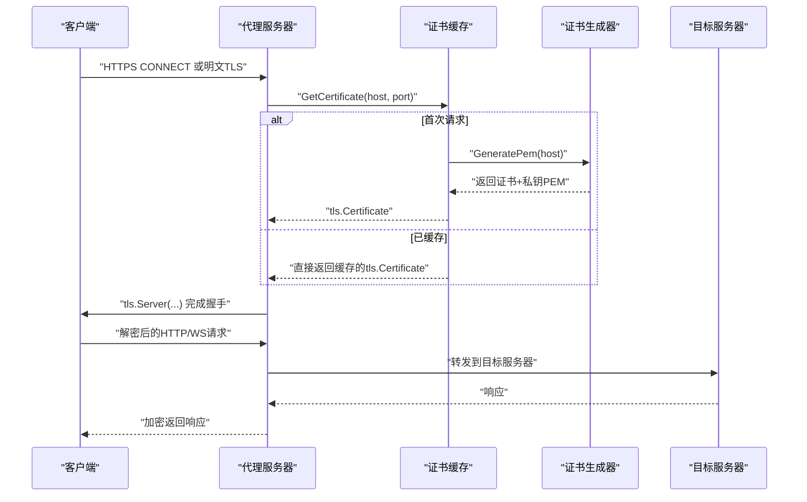
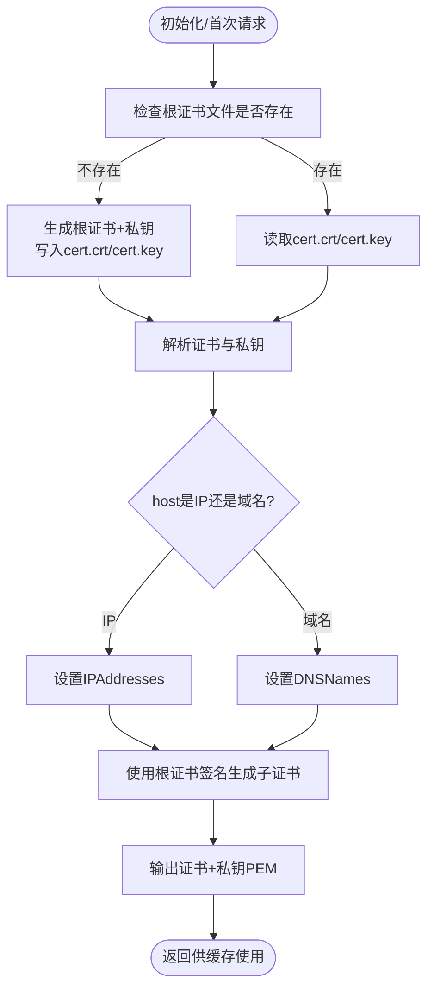
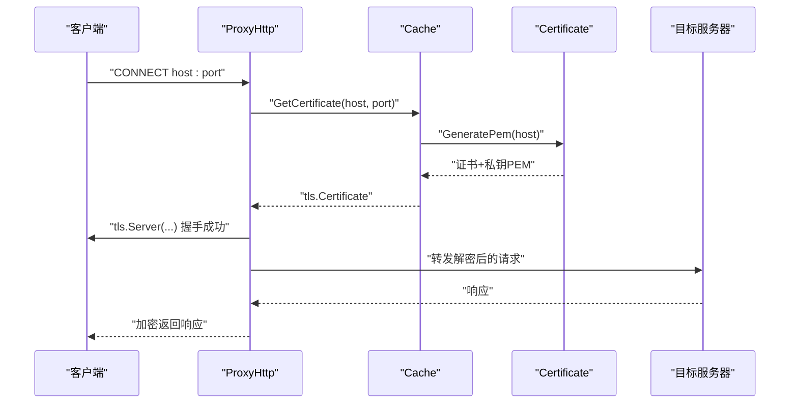
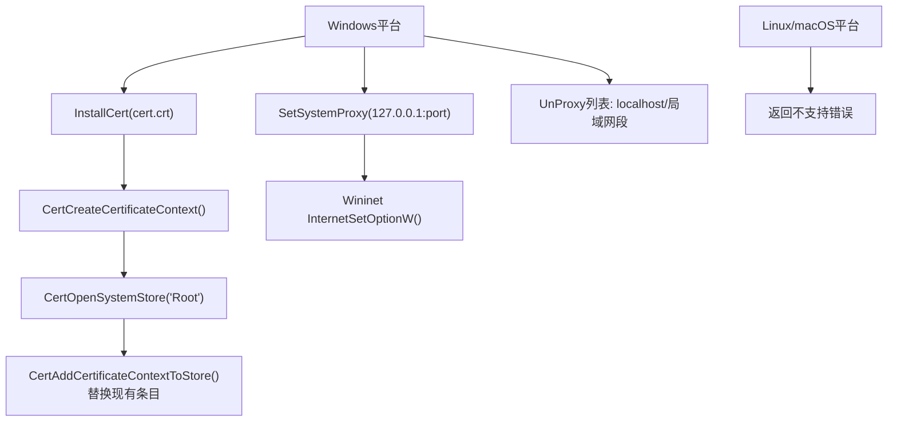
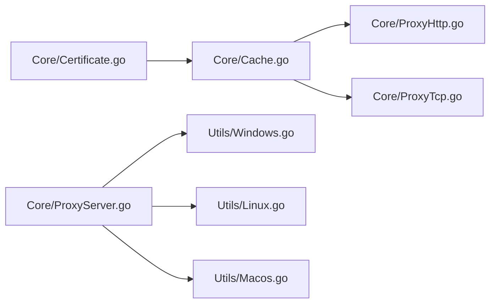

# 证书管理系统

<cite>
**本文档引用的文件**
- [Main.go](file://Main.go)
- [Core/Certificate.go](file://Core/Certificate.go)
- [Core/Cache.go](file://Core/Cache.go)
- [Core/ProxyHttp.go](file://Core/ProxyHttp.go)
- [Core/ProxyTcp.go](file://Core/ProxyTcp.go)
- [Core/ProxyServer.go](file://Core/ProxyServer.go)
- [Utils/Windows.go](file://Utils/Windows.go)
- [Utils/Linux.go](file://Utils/Linux.go)
- [Utils/Macos.go](file://Utils/Macos.go)
- [Utils/Utils.go](file://Utils/Utils.go)
- [Core/Certificate_test.go](file://Core/Certificate_test.go)
- [Core/Cache_test.go](file://Core/Cache_test.go)
- [README.md](file://README.md)
- [README-CN.md](file://README-CN.md)
- [CODE-DOC.md](file://CODE-DOC.md)
</cite>

## 目录
1. [简介](#简介)
2. [项目结构](#项目结构)
3. [核心组件](#核心组件)
4. [架构总览](#架构总览)
5. [详细组件分析](#详细组件分析)
6. [依赖关系分析](#依赖关系分析)
7. [性能考量](#性能考量)
8. [故障排除指南](#故障排除指南)
9. [结论](#结论)
10. [附录](#附录)

## 简介
本文件面向 shermie-proxy 的证书管理系统，深入解释根证书生成、子证书动态创建、证书格式与有效期管理、并发安全的证书缓存机制、跨平台安装与信任、配置选项、安全考虑与最佳实践，以及证书生命周期与中间人攻击功能的关系与实现原理。

## 项目结构
证书管理相关的关键模块与文件组织如下：
- 核心证书逻辑：Core/Certificate.go（根证书与子证书生成、持久化）
- 证书缓存与并发控制：Core/Cache.go（全局存储、并发去重、证书缓存）
- 代理集成：Core/ProxyHttp.go、Core/ProxyTcp.go（HTTPS/TLS中间人握手）
- 平台安装与系统代理：Utils/Windows.go、Utils/Linux.go、Utils/Macos.go
- 启动与初始化：Main.go（根证书初始化）
- 文档与示例：README.md、README-CN.md、CODE-DOC.md
- 测试：Core/Certificate_test.go、Core/Cache_test.go



**图表来源**
- [Main.go:13-22](file://Main.go#L13-L22)
- [Core/Certificate.go:35-67](file://Core/Certificate.go#L35-L67)
- [Core/Cache.go:10-78](file://Core/Cache.go#L10-L78)
- [Core/ProxyHttp.go:242-278](file://Core/ProxyHttp.go#L242-L278)
- [Core/ProxyTcp.go:41-57](file://Core/ProxyTcp.go#L41-L57)
- [Core/ProxyServer.go:79-96](file://Core/ProxyServer.go#L79-L96)
- [Utils/Windows.go:18-50](file://Utils/Windows.go#L18-L50)
- [Utils/Linux.go:8-11](file://Utils/Linux.go#L8-L11)
- [Utils/Macos.go:8-11](file://Utils/Macos.go#L8-L11)

**章节来源**
- [Main.go:13-22](file://Main.go#L13-L22)
- [README.md:19-30](file://README.md#L19-L30)
- [README-CN.md:18-29](file://README-CN.md#L18-L29)

## 核心组件
- 根证书与子证书生成器：负责生成/加载根证书，按需生成以目标域名为 CN 的子证书，设置序列号、有效期、SAN（DNS/IP）等字段。
- 证书缓存与并发控制：全局单例缓存，基于域名去重并发生成，避免重复的密钥生成与磁盘IO。
- 代理集成：在 HTTPS/TLS 握手阶段，通过缓存获取/生成子证书，完成中间人代理。
- 平台工具：Windows 上支持证书安装到系统受信根存储与系统代理设置；Linux/macOS 当前为占位，返回不支持错误。

**章节来源**
- [Core/Certificate.go:27-67](file://Core/Certificate.go#L27-L67)
- [Core/Cache.go:10-78](file://Core/Cache.go#L10-L78)
- [Core/ProxyHttp.go:242-278](file://Core/ProxyHttp.go#L242-L278)
- [Core/ProxyTcp.go:41-57](file://Core/ProxyTcp.go#L41-L57)
- [Utils/Windows.go:18-50](file://Utils/Windows.go#L18-L50)
- [Utils/Linux.go:8-11](file://Utils/Linux.go#L8-L11)
- [Utils/Macos.go:8-11](file://Utils/Macos.go#L8-L11)

## 架构总览
证书系统围绕“根证书 + 子证书 + 缓存 + 并发控制”的设计展开，贯穿代理的 TLS 中间人流程。



**图表来源**
- [Core/Cache.go:39-78](file://Core/Cache.go#L39-L78)
- [Core/Certificate.go:69-116](file://Core/Certificate.go#L69-L116)
- [Core/ProxyHttp.go:242-278](file://Core/ProxyHttp.go#L242-L278)
- [Core/ProxyTcp.go:41-57](file://Core/ProxyTcp.go#L41-L57)

## 详细组件分析

### 根证书与子证书生成
- 初始化流程：若本地不存在根证书文件，则生成根证书与私钥并写入 cert.crt/cert.key；否则从文件读取并解析。
- 根证书属性：包含国家、组织、部门、通用名、有效期、密钥用途（加密、签名、签发CA）、扩展用途（服务器认证）、基本约束（CA=true）等。
- 子证书生成：以目标主机名作为 CN，根据输入是 IP 或域名分别设置 IPAddresses 或 DNSNames；序列号使用 128 位随机数；有效期前后各一年；使用根证书对子证书进行签名。
- 密钥对生成：采用 RSA 2048 位密钥长度。



**图表来源**
- [Core/Certificate.go:35-67](file://Core/Certificate.go#L35-L67)
- [Core/Certificate.go:119-178](file://Core/Certificate.go#L119-L178)
- [Core/Certificate.go:69-116](file://Core/Certificate.go#L69-L116)

**章节来源**
- [Core/Certificate.go:35-67](file://Core/Certificate.go#L35-L67)
- [Core/Certificate.go:119-178](file://Core/Certificate.go#L119-L178)
- [Core/Certificate.go:69-116](file://Core/Certificate.go#L69-L116)
- [Core/Certificate_test.go:49-113](file://Core/Certificate_test.go#L49-L113)
- [Core/Certificate_test.go:115-139](file://Core/Certificate_test.go#L115-L139)

### 证书缓存与并发控制
- 全局单例：Cache 为全局存储实例，内部维护映射表与互斥锁。
- 并发策略：
  - 同一域名并发：通过 WaitGroup 等待首个生成完成，其余请求复用结果，避免重复生成。
  - 不同域名并发：串行创建 action，但实际生成在锁外并行执行，提升吞吐。
- 缓存策略：证书一旦生成即永久缓存，无淘汰策略；适合高并发短时间内的重复请求场景。
- 返回类型：将证书与私钥组合为 tls.Certificate，供代理握手使用。

```mermaid
classDiagram
class Storage {
-lock : Mutex
-mapping : map[string]*action
+GetCertificate(hostname, port) (interface{}, error)
}
class action {
-wg : WaitGroup
-fn : func()
+cert : interface{}
+err : error
}
class Certificate {
+RootKey : rsa.PrivateKey
+RootCa : x509.Certificate
+Init() error
+GeneratePem(host) ([]byte, []byte, error)
+GenerateRootPemFile(host) (*pem.Block, *pem.Block, error)
+GenerateKeyPair() (*rsa.PrivateKey, error)
}
Storage --> action : "管理并发动作"
Storage --> Certificate : "调用生成子证书"
```

**图表来源**
- [Core/Cache.go:20-78](file://Core/Cache.go#L20-L78)
- [Core/Certificate.go:20-32](file://Core/Certificate.go#L20-L32)

**章节来源**
- [Core/Cache.go:10-78](file://Core/Cache.go#L10-L78)
- [Core/Cache_test.go:24-114](file://Core/Cache_test.go#L24-L114)
- [CODE-DOC.md:531-558](file://CODE-DOC.md#L531-L558)

### 代理中的中间人握手
- HTTP(S)/WS(WSS)：在 CONNECT 隧道建立后，调用 Cache.GetCertificate 获取/生成子证书，使用 tls.Server 完成握手，然后读取解密后的请求并转发。
- TCP：在 TLS 握手阶段同样通过 Cache 获取证书，完成代理端的 TLS 会话。



**图表来源**
- [Core/ProxyHttp.go:242-278](file://Core/ProxyHttp.go#L242-L278)
- [Core/Cache.go:39-78](file://Core/Cache.go#L39-L78)
- [Core/Certificate.go:69-116](file://Core/Certificate.go#L69-L116)

**章节来源**
- [Core/ProxyHttp.go:242-278](file://Core/ProxyHttp.go#L242-L278)
- [Core/ProxyTcp.go:41-57](file://Core/ProxyTcp.go#L41-L57)

### 平台安装与信任机制
- Windows：
  - 证书安装：读取 cert.crt，创建证书上下文并添加到系统“受信任的根证书颁发机构”存储，替换现有同名条目。
  - 系统代理：通过 WinInet API 设置系统代理为 127.0.0.1:端口，同时设置代理绕过列表。
- Linux/macOS：
  - 当前返回“不支持”错误，需要用户手动安装证书并配置代理。



**图表来源**
- [Utils/Windows.go:18-50](file://Utils/Windows.go#L18-L50)
- [Utils/Windows.go:52-122](file://Utils/Windows.go#L52-L122)
- [Utils/Linux.go:8-11](file://Utils/Linux.go#L8-L11)
- [Utils/Macos.go:8-11](file://Utils/Macos.go#L8-L11)

**章节来源**
- [Utils/Windows.go:18-50](file://Utils/Windows.go#L18-L50)
- [Utils/Windows.go:52-122](file://Utils/Windows.go#L52-L122)
- [Core/ProxyServer.go:79-96](file://Core/ProxyServer.go#L79-L96)

### 配置选项与启动流程
- 启动初始化：应用启动时初始化日志与根证书，若初始化失败记录错误。
- 根证书文件：默认在当前工作目录生成 cert.crt/cert.key；如需更换路径可在初始化前切换目录。
- 代理参数：支持端口、Nagle算法、上级代理、目标TCP服务器等参数，详见 README。

**章节来源**
- [Main.go:13-22](file://Main.go#L13-L22)
- [README.md:148-163](file://README.md#L148-L163)
- [README-CN.md:145-158](file://README-CN.md#L145-L158)

## 依赖关系分析
- 模块耦合：
  - Core/Cache 依赖 Core/Certificate 进行证书生成。
  - Core/ProxyHttp/Core/ProxyTcp 依赖 Core/Cache 获取证书。
  - Core/ProxyServer 在 Windows 平台依赖 Utils/Windows 进行证书安装与代理设置。
- 外部依赖：
  - crypto/tls、crypto/x509 用于证书与TLS处理。
  - golang.org/x/sys/windows 用于 Windows 系统调用。
  - viki-org/dnscache 用于 DNS 缓存（与证书系统无直接耦合）。



**图表来源**
- [Core/Certificate.go:20-32](file://Core/Certificate.go#L20-L32)
- [Core/Cache.go:10-78](file://Core/Cache.go#L10-L78)
- [Core/ProxyHttp.go:242-278](file://Core/ProxyHttp.go#L242-L278)
- [Core/ProxyTcp.go:41-57](file://Core/ProxyTcp.go#L41-L57)
- [Core/ProxyServer.go:79-96](file://Core/ProxyServer.go#L79-L96)
- [Utils/Windows.go:18-50](file://Utils/Windows.go#L18-L50)
- [Utils/Linux.go:8-11](file://Utils/Linux.go#L8-L11)
- [Utils/Macos.go:8-11](file://Utils/Macos.go#L8-L11)

**章节来源**
- [CODE-DOC.md:16-27](file://CODE-DOC.md#L16-L27)

## 性能考量
- 并发优化：同一域名仅生成一次证书，其他请求通过 WaitGroup 等待，避免重复的 RSA 密钥生成与磁盘IO。
- 锁粒度：在创建 action 时加锁，实际生成在锁外执行，降低锁竞争。
- 缓存策略：永久缓存，适合高并发短时间内的重复请求；若长期运行且域名规模巨大，可考虑引入 LRU 淘汰策略以控制内存占用。
- 证书生成成本：RSA 2048 位密钥生成相对昂贵，通过缓存显著降低平均延迟。

**章节来源**
- [CODE-DOC.md:531-558](file://CODE-DOC.md#L531-L558)
- [Core/Cache.go:39-78](file://Core/Cache.go#L39-L78)

## 故障排除指南
- 根证书初始化失败
  - 检查当前目录是否有写权限，确认 cert.crt/cert.key 是否被占用。
  - 查看初始化日志输出，定位具体错误。
- 证书安装失败（Windows）
  - 确认以管理员权限运行程序。
  - 检查系统证书存储是否可写，确保 WinInet 动态库可用。
- 系统代理设置失败
  - 检查代理地址格式与端口是否正确，确认 UnProxy 列表是否覆盖目标域名。
- macOS/Linux 安装失败
  - 当前平台不支持自动安装，需手动将 cert.crt 添加到系统/浏览器信任存储。
- 证书不被信任
  - 确认客户端已安装根证书，且证书未过期。
  - 检查浏览器或系统代理设置是否指向代理端口。
- 并发生成异常
  - 若出现长时间阻塞，检查是否存在死锁或异常错误导致 WaitGroup 未 Done。

**章节来源**
- [Main.go:18-21](file://Main.go#L18-L21)
- [Utils/Windows.go:36-49](file://Utils/Windows.go#L36-L49)
- [Utils/Windows.go:74-122](file://Utils/Windows.go#L74-L122)
- [Core/ProxyServer.go:95](file://Core/ProxyServer.go#L95)

## 结论
sheremie-proxy 的证书系统通过“根证书 + 子证书 + 并发缓存”的设计，实现了高效的 HTTPS 中间人代理能力。根证书负责签发，子证书按需生成并缓存，Windows 平台提供便捷的证书安装与系统代理设置，Linux/macOS 则需要手动安装。整体架构在高并发场景下具备良好的性能与稳定性，建议结合业务需求评估是否引入缓存淘汰策略以控制长期运行的内存占用。

## 附录

### 证书格式与有效期
- 格式：PEM 编码的 CERTIFICATE 与 RSA PRIVATE KEY。
- 有效期：前一年至后一年，共两年。
- 密钥长度：RSA 2048。
- 序列号：128 位随机数。
- SAN：根据 host 类型设置 DNSNames 或 IPAddresses。

**章节来源**
- [Core/Certificate.go:122-142](file://Core/Certificate.go#L122-L142)
- [Core/Certificate.go:73-98](file://Core/Certificate.go#L73-L98)
- [Core/Certificate_test.go:68-113](file://Core/Certificate_test.go#L68-L113)

### 安全考虑与最佳实践
- 根证书保护：确保 cert.key 文件权限最小化，避免泄露根私钥。
- 证书更新策略：定期轮换根证书，通知客户端重新安装新根证书。
- 并发安全：当前实现已通过互斥锁与 WaitGroup 保障并发安全，建议在大规模部署中监控缓存命中率与内存使用。
- 平台差异：仅 Windows 提供自动化安装，其他平台需手动安装并验证信任链。
- 中间人风险：仅在可信网络与受控环境中启用，避免在生产环境滥用。

**章节来源**
- [CODE-DOC.md:531-558](file://CODE-DOC.md#L531-L558)
- [Utils/Windows.go:18-50](file://Utils/Windows.go#L18-L50)