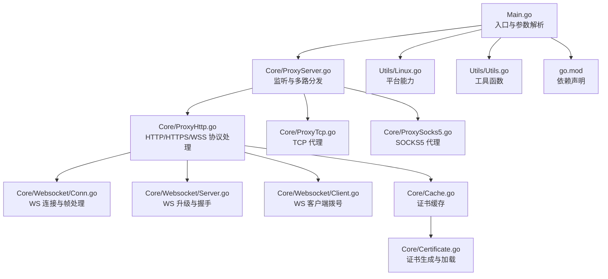
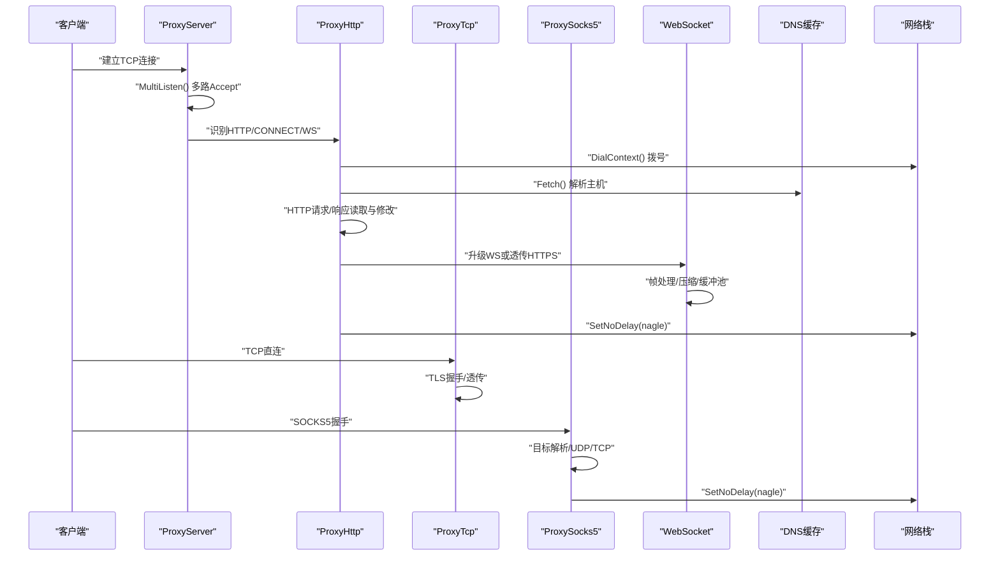
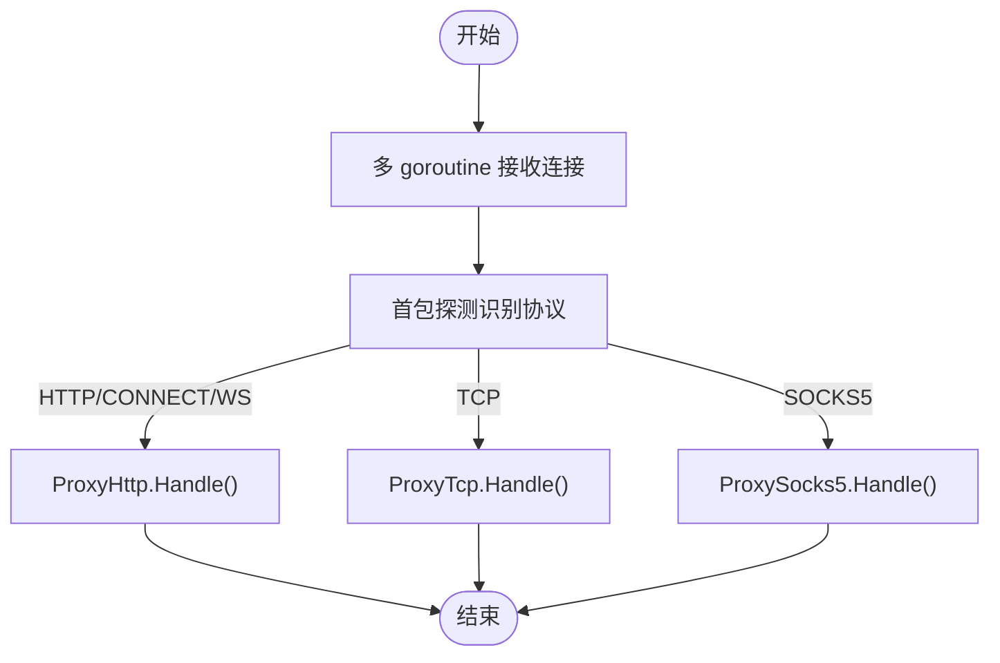
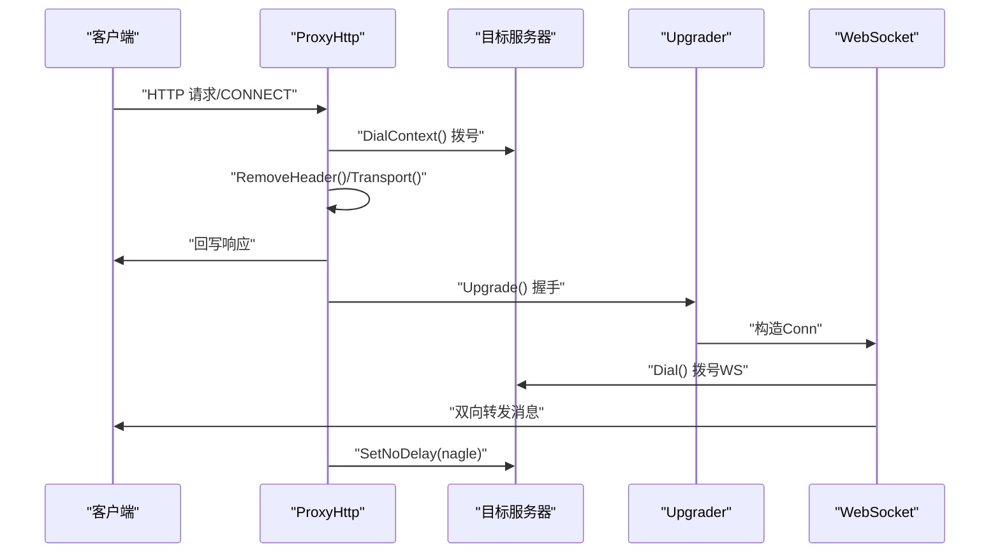
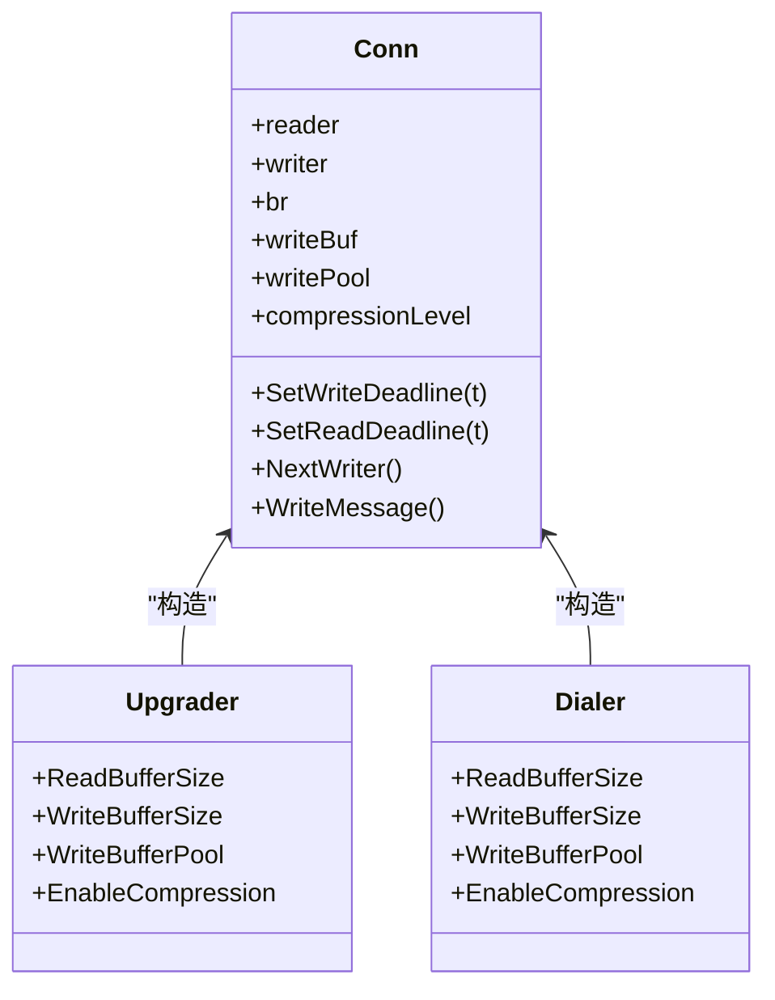
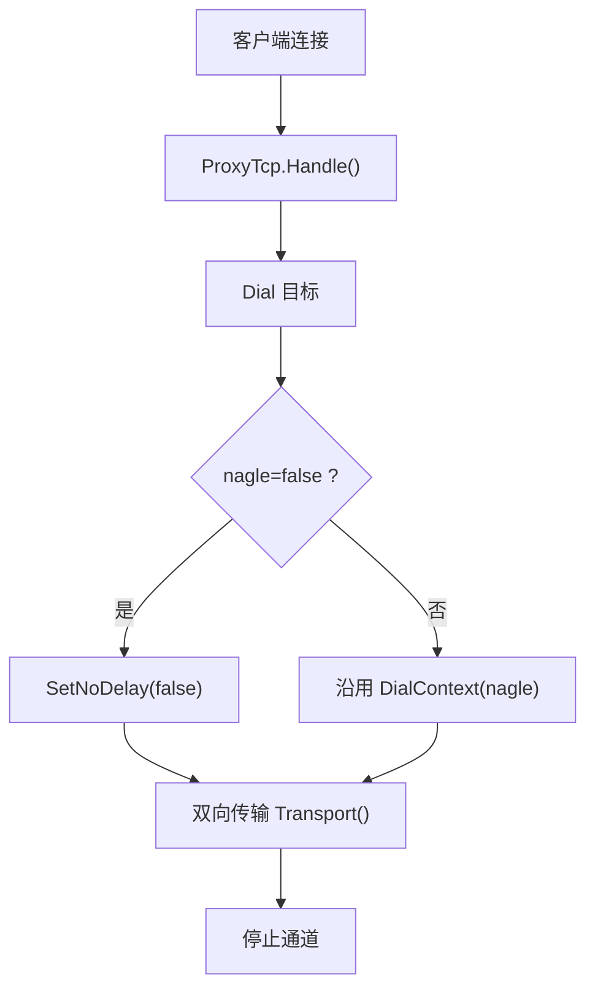
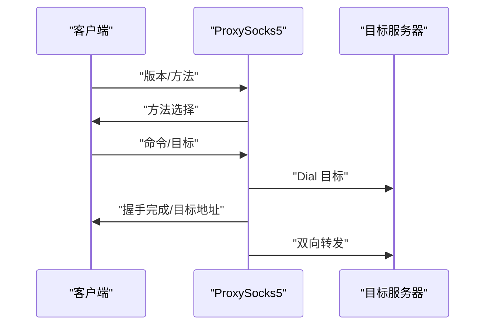
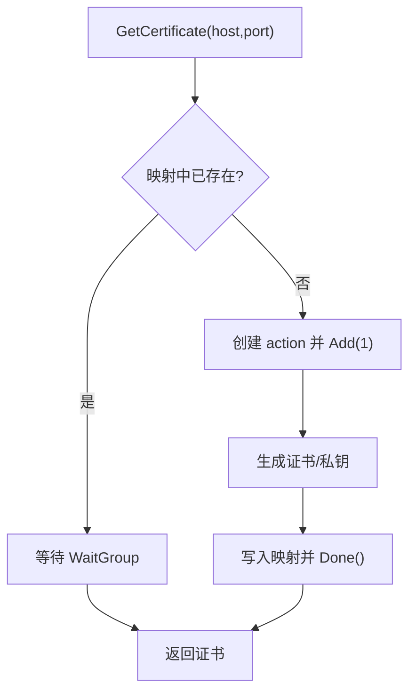
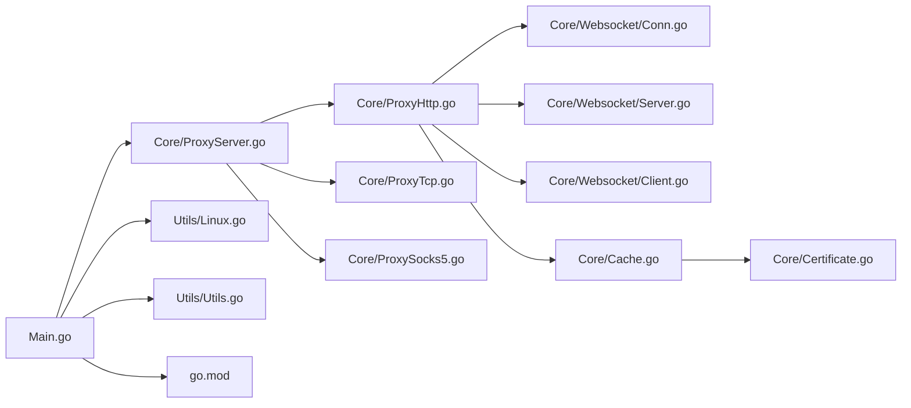

# 性能调优

<cite>
**本文引用的文件**
- [Main.go](file://Main.go)
- [README.md](file://README.md)
- [CODE-DOC.md](file://CODE-DOC.md)
- [Core/ProxyServer.go](file://Core/ProxyServer.go)
- [Core/ProxyHttp.go](file://Core/ProxyHttp.go)
- [Core/ProxyTcp.go](file://Core/ProxyTcp.go)
- [Core/ProxySocks5.go](file://Core/ProxySocks5.go)
- [Core/Websocket/Conn.go](file://Core/Websocket/Conn.go)
- [Core/Websocket/Server.go](file://Core/Websocket/Server.go)
- [Core/Websocket/Client.go](file://Core/Websocket/Client.go)
- [Core/Websocket/Doc.go](file://Core/Websocket/Doc.go)
- [Core/Cache.go](file://Core/Cache.go)
- [Core/Certificate.go](file://Core/Certificate.go)
- [Utils/Linux.go](file://Utils/Linux.go)
- [Utils/Utils.go](file://Utils/Utils.go)
- [go.mod](file://go.mod)
</cite>

## 目录
1. [简介](#简介)
2. [项目结构](#项目结构)
3. [核心组件](#核心组件)
4. [架构总览](#架构总览)
5. [详细组件分析](#详细组件分析)
6. [依赖分析](#依赖分析)
7. [性能考量与调优参数](#性能考量与调优参数)
8. [故障排查指南](#故障排查指南)
9. [结论](#结论)
10. [附录](#附录)

## 简介
本文件面向 shermie-proxy 的性能调优，聚焦于以下方面：
- Nagle 算法对延迟与吞吐的影响及配置方法
- 连接池与缓冲区大小、并发限制等关键参数的调优
- 不同负载场景（高并发、大数据传输、长连接）下的配置建议
- 系统资源监控指标与性能基准测试方法
- 网络优化建议（TCP 参数、DNS 缓存等）
- 内存管理与垃圾回收优化策略

## 项目结构
项目采用按功能模块划分的组织方式，核心代理逻辑集中在 Core 目录，网络协议适配位于 Core/Websocket 子目录，工具与证书生成位于 Utils 与 Core 下。

图示来源
- [Main.go:24-124](file://Main.go#L24-L124)
- [Core/ProxyServer.go:123-174](file://Core/ProxyServer.go#L123-L174)
- [Core/ProxyHttp.go:44-64](file://Core/ProxyHttp.go#L44-L64)
- [Core/ProxyTcp.go:23-66](file://Core/ProxyTcp.go#L23-L66)
- [Core/ProxySocks5.go:54-240](file://Core/ProxySocks5.go#L54-L240)
- [Core/Websocket/Conn.go:284-323](file://Core/Websocket/Conn.go#L284-L323)
- [Core/Websocket/Server.go:192-267](file://Core/Websocket/Server.go#L192-L267)
- [Core/Websocket/Client.go:291-348](file://Core/Websocket/Client.go#L291-L348)
- [Core/Cache.go:39-64](file://Core/Cache.go#L39-L64)
- [Core/Certificate.go:35-67](file://Core/Certificate.go#L35-L67)
- [Utils/Linux.go:8-16](file://Utils/Linux.go#L8-L16)
- [Utils/Utils.go:34-48](file://Utils/Utils.go#L34-L48)
- [go.mod:1-9](file://go.mod#L1-L9)

章节来源
- [Main.go:24-124](file://Main.go#L24-L124)
- [Core/ProxyServer.go:123-174](file://Core/ProxyServer.go#L123-L174)

## 核心组件
- 入口与参数解析：负责解析端口、Nagle 开关、上游代理、目标 TCP 地址、网卡绑定等参数，并启动多 goroutine 接受连接。
- 代理服务器：统一监听、多路分发、协议识别与处理。
- 协议处理器：
  - HTTP/HTTPS/WSS：读取请求、可拦截修改、转发、回写响应；支持 WS 升级与双向转发。
  - TCP：直接透传，支持 TLS 握手与可选 Nagle 控制。
  - SOCKS5：握手、目标解析、UDP/TCP 转发。
- WebSocket：基于 gorilla/websocket，含帧处理、压缩、缓冲池与读写超时控制。
- 证书与缓存：根证书初始化、动态生成子证书并缓存，避免重复生成。
- 工具与平台：跨平台系统代理与证书安装（Windows），端口探测、TLS 最后一帧提取等。

章节来源
- [Main.go:24-124](file://Main.go#L24-L124)
- [Core/ProxyServer.go:48-77](file://Core/ProxyServer.go#L48-L77)
- [Core/ProxyHttp.go:29-37](file://Core/ProxyHttp.go#L29-L37)
- [Core/ProxyTcp.go:15-19](file://Core/ProxyTcp.go#L15-L19)
- [Core/ProxySocks5.go:15-19](file://Core/ProxySocks5.go#L15-L19)
- [Core/Websocket/Conn.go:241-282](file://Core/Websocket/Conn.go#L241-L282)
- [Core/Cache.go:10-30](file://Core/Cache.go#L10-L30)
- [Core/Certificate.go:18-32](file://Core/Certificate.go#L18-L32)

## 架构总览
下图展示从监听到协议处理的关键交互路径，以及 Nagle 控制点与 DNS 缓存位置。

图示来源
- [Core/ProxyServer.go:156-174](file://Core/ProxyServer.go#L156-L174)
- [Core/ProxyHttp.go:436-468](file://Core/ProxyHttp.go#L436-L468)
- [Core/ProxyTcp.go:58-60](file://Core/ProxyTcp.go#L58-L60)
- [Core/ProxySocks5.go:234-284](file://Core/ProxySocks5.go#L234-L284)
- [Core/Websocket/Conn.go:378-402](file://Core/Websocket/Conn.go#L378-L402)

## 详细组件分析

### 组件A：代理服务器与多路监听
- 多 goroutine 并发 Accept 提升高并发下的连接接受吞吐。
- 协议识别通过首包探测，分流至 HTTP/HTTPS/WSS、TCP、SOCKS5 处理器。
- 事件回调允许在请求/响应/流数据阶段进行拦截与修改。

图示来源
- [Core/ProxyServer.go:156-203](file://Core/ProxyServer.go#L156-L203)
- [Core/ProxyHttp.go:44-64](file://Core/ProxyHttp.go#L44-L64)
- [Core/ProxyTcp.go:23-66](file://Core/ProxyTcp.go#L23-L66)
- [Core/ProxySocks5.go:54-240](file://Core/ProxySocks5.go#L54-L240)

章节来源
- [Core/ProxyServer.go:156-203](file://Core/ProxyServer.go#L156-L203)
- [CODE-DOC.md:722-729](file://CODE-DOC.md#L722-L729)

### 组件B：HTTP/HTTPS/WSS 处理与 Nagle 控制
- HTTP 请求/响应读取与修改，支持 gzip 解码。
- HTTPS CONNECT 流程：建立 TLS 会话，再根据后续请求决定是否升级 WS。
- WS 升级：使用 Upgrader 完成握手，随后双向转发消息。
- Nagle 控制：通过 DialContext 对远端连接设置 SetNoDelay(nagle)，nagle=true 实际上是禁用 Nagle（低延迟）。

图示来源
- [Core/ProxyHttp.go:67-132](file://Core/ProxyHttp.go#L67-L132)
- [Core/ProxyHttp.go:183-203](file://Core/ProxyHttp.go#L183-L203)
- [Core/ProxyHttp.go:205-286](file://Core/ProxyHttp.go#L205-L286)
- [Core/ProxyHttp.go:327-434](file://Core/ProxyHttp.go#L327-L434)
- [Core/ProxyHttp.go:436-468](file://Core/ProxyHttp.go#L436-L468)

章节来源
- [Core/ProxyHttp.go:183-203](file://Core/ProxyHttp.go#L183-L203)
- [Core/ProxyHttp.go:436-468](file://Core/ProxyHttp.go#L436-L468)

### 组件C：WebSocket 连接与缓冲区
- 连接对象包含读写缓冲、压缩、ping/pong、close 处理。
- 默认读写缓冲大小常量定义，支持通过 Upgrader/Dialer 调整。
- 文档明确缓冲区大小与内存/系统调用权衡，建议按消息分布选择合适大小或使用写缓冲池。

图示来源
- [Core/Websocket/Conn.go:241-323](file://Core/Websocket/Conn.go#L241-L323)
- [Core/Websocket/Server.go:192-267](file://Core/Websocket/Server.go#L192-L267)
- [Core/Websocket/Client.go:291-348](file://Core/Websocket/Client.go#L291-L348)
- [Core/Websocket/Doc.go:167-227](file://Core/Websocket/Doc.go#L167-L227)

章节来源
- [Core/Websocket/Conn.go:284-323](file://Core/Websocket/Conn.go#L284-L323)
- [Core/Websocket/Doc.go:167-227](file://Core/Websocket/Doc.go#L167-L227)

### 组件D：TCP 代理与 Nagle 控制
- 直接透传 TCP 数据，必要时进行 TLS 握手。
- Nagle 控制：当 nagle=false 时，显式设置 SetNoDelay(false)；否则遵循 DialContext 中的 nagle 设置。

图示来源
- [Core/ProxyTcp.go:23-66](file://Core/ProxyTcp.go#L23-L66)
- [Core/ProxyTcp.go:58-60](file://Core/ProxyTcp.go#L58-L60)

章节来源
- [Core/ProxyTcp.go:23-66](file://Core/ProxyTcp.go#L23-L66)

### 组件E：SOCKS5 代理
- 完整握手流程：版本、方法、命令、目标地址类型与端口解析。
- 支持 UDP/TCP，双向传输通道，错误通过通道返回。

图示来源
- [Core/ProxySocks5.go:54-240](file://Core/ProxySocks5.go#L54-L240)

章节来源
- [Core/ProxySocks5.go:54-240](file://Core/ProxySocks5.go#L54-L240)

### 组件F：证书缓存与生成
- 并发安全的证书存储，相同主机仅生成一次证书，避免重复开销。
- 动态生成子证书用于 TLS 会话，根证书可持久化或从文件加载。

图示来源
- [Core/Cache.go:39-64](file://Core/Cache.go#L39-L64)
- [Core/Certificate.go:69-116](file://Core/Certificate.go#L69-L116)

章节来源
- [Core/Cache.go:39-64](file://Core/Cache.go#L39-L64)
- [Core/Certificate.go:69-116](file://Core/Certificate.go#L69-L116)

## 依赖分析
- go.mod 显示依赖 dnscache 与 golang.org/x/sys。
- 证书生成依赖 crypto/* 与 x509。
- WebSocket 使用 gorilla/websocket（内部实现文件）。

图示来源
- [go.mod:5-8](file://go.mod#L5-L8)
- [Core/ProxyHttp.go:18-23](file://Core/ProxyHttp.go#L18-L23)

章节来源
- [go.mod:1-9](file://go.mod#L1-L9)

## 性能考量与调优参数

### Nagle 算法影响与配置
- Nagle 算法通过合并小包提升吞吐但增加延迟；禁用 Nagle（SetNoDelay(true)）可降低延迟。
- 在 shermie-proxy 中：
  - 默认 nagle=true，实际调用 SetNoDelay(true)，即启用低延迟模式。
  - HTTP/HTTPS/WSS 与 TCP/SOCKS5 的 DialContext 中均设置 SetNoDelay(nagle)。
- 调优建议：
  - 高延迟链路（广域网）且对延迟敏感：保持 nagle=true（默认）。
  - 局域网或低延迟链路且追求极致延迟：尝试 nagle=false，观察 RTT 与抖动变化。
  - 注意：nagle=false 可能导致更多的小包，CPU 与网络栈开销上升。

章节来源
- [README.md:160](file://README.md#L160)
- [CODE-DOC.md:566](file://CODE-DOC.md#L566)
- [CODE-DOC.md:578](file://CODE-DOC.md#L578)
- [Core/ProxyHttp.go:463-465](file://Core/ProxyHttp.go#L463-L465)
- [Core/ProxyTcp.go:58-60](file://Core/ProxyTcp.go#L58-L60)

### 连接池与缓冲区大小
- WebSocket 默认读写缓冲大小常量，可通过 Upgrader/Dialer 调整。
- 文档建议：
  - 将缓冲区限制在最大预期消息大小以内；若消息分布偏小，适当减小缓冲可显著节省内存。
  - 写缓冲池适合“少量写但大量连接”的场景，减少系统调用与帧头开销。
- 调优建议：
  - 小消息为主：读写缓冲设为消息上限或略小，启用写缓冲池。
  - 大消息/批量传输：增大缓冲减少系统调用次数，但注意内存占用。
  - 长连接：考虑复用连接生命周期内的缓冲，避免频繁分配。

章节来源
- [Core/Websocket/Doc.go:167-227](file://Core/Websocket/Doc.go#L167-L227)
- [Core/Websocket/Conn.go:36-41](file://Core/Websocket/Conn.go#L36-L41)
- [Core/Websocket/Conn.go:296-303](file://Core/Websocket/Conn.go#L296-L303)

### 并发限制与连接接受
- MultiListen 启动多个 goroutine 并发 Accept，提升高并发下的连接接受能力。
- 调优建议：
  - 根据 CPU 核心数与网络带宽适度增加 Accept goroutine 数量（例如 5~8）。
  - 结合系统文件描述符限制与内核队列参数，避免 accept 队列溢出。

章节来源
- [Core/ProxyServer.go:156-174](file://Core/ProxyServer.go#L156-L174)
- [CODE-DOC.md:722-729](file://CODE-DOC.md#L722-L729)

### DNS 缓存优化
- 使用 dnscache 缓存解析结果，默认 TTL 5 分钟，减少 DNS 查询开销。
- 调优建议：
  - 针对短生命周期域名（如 CDN）可缩短 TTL 或在业务侧缓存。
  - 与上游代理配合，避免重复解析。

章节来源
- [Core/ProxyServer.go:71](file://Core/ProxyServer.go#L71)
- [Core/ProxyHttp.go:439-447](file://Core/ProxyHttp.go#L439-L447)

### TCP 参数与系统优化
- 可调参数（系统层面）：
  - TCP_NODELAY：与 nagle 对应，禁用 Nagle。
  - TCP_QUICKACK：加速 ACK。
  - SO_RCVBUF/SO_SNDBUF：增大读写缓冲缓解突发流量。
  - backlog：listen 队列长度。
  - 文件描述符限制：ulimit -n。
- 建议：
  - 服务器端：根据带宽与延迟设定合适的 SO_RCVBUF/SO_SNDBUF。
  - 客户端：在高并发场景下适度增大 fd 限制与队列长度。

（本节为通用系统优化建议，不直接对应具体源码）

### 内存管理与 GC 优化
- 证书缓存避免重复生成，降低 CPU 与内存峰值。
- WebSocket 写缓冲池减少分配与拷贝。
- 调优建议：
  - 控制消息大小分布，避免超大消息导致缓冲膨胀。
  - 长连接场景下复用连接对象，减少频繁创建销毁。
  - 关注 GC 压力，必要时调整 GOGC 或使用更合适的缓冲策略。

章节来源
- [Core/Cache.go:39-64](file://Core/Cache.go#L39-L64)
- [Core/Websocket/Conn.go:492-501](file://Core/Websocket/Conn.go#L492-L501)

### 不同负载场景的配置建议
- 高并发短连接：
  - MultiListen 增加 Accept goroutine 数量。
  - nagle=true（默认）降低小包开销。
  - DNS TTL 适中，避免频繁解析。
- 大数据传输（长消息/大文件）：
  - WebSocket 缓冲区增大，启用写缓冲池。
  - TCP 侧适当增大 SO_RCVBUF/SO_SNDBUF。
- 长连接（WS/长TCP）：
  - 保持 Nagle 低延迟模式。
  - 合理设置读写超时与心跳（ping/pong）。
  - 使用缓冲池与连接复用。

（本节为通用场景建议，不直接对应具体源码）

### 监控指标与基准测试
- 监控指标建议：
  - QPS、连接数、并发 Accept goroutine 数、DNS 查询次数与命中率。
  - TCP 读写缓冲使用率、系统调用次数、上下文切换次数。
  - WebSocket 帧大小分布、压缩比、写缓冲池命中率。
  - 证书生成耗时与缓存命中率。
- 基准测试方法：
  - 使用 wrk/ab/vegeta 等工具对 HTTP/HTTPS/WS 接口进行压测。
  - 使用 iperf3 对 TCP 大包传输进行吞吐与延迟测试。
  - 针对 WS 场景，模拟不同消息大小分布与并发客户端数。

（本节为通用测试建议，不直接对应具体源码）

## 故障排查指南
- 连接超时/握手失败：
  - 检查 DialContext 超时与 KeepAlive 设置。
  - 确认 Nagle 配置与目标网络环境。
- WS 握手/读写异常：
  - 关注 WriteMessage/NextWriter 的错误与超时设置。
  - 检查 ping/pong 与压缩配置。
- 证书相关问题：
  - 确认根证书初始化与文件存在性。
  - 观察证书缓存命中情况，避免频繁生成。

章节来源
- [Core/ProxyHttp.go:448-452](file://Core/ProxyHttp.go#L448-L452)
- [Core/Websocket/Conn.go:378-402](file://Core/Websocket/Conn.go#L378-L402)
- [Core/Certificate.go:35-67](file://Core/Certificate.go#L35-L67)

## 结论
- Nagle 默认启用（低延迟）；在特定网络与业务场景下可按需调整。
- WebSocket 缓冲区与写缓冲池是优化重点，应结合消息分布与内存预算调优。
- 多 Accept goroutine 显著提升高并发连接接受能力。
- DNS 缓存与证书缓存有效降低开销，建议配合系统参数与业务策略综合优化。
- 建议以监控指标与基准测试驱动持续调优。

## 附录
- 参数速查
  - --port：监听端口
  - --to：TCP 代理目标地址（仅 TCP 代理）
  - --proxy：上游 TCP 代理
  - --nagle：是否启用 Nagle（默认 true，实际为低延迟模式）

章节来源
- [README.md:151-160](file://README.md#L151-L160)
- [Main.go:25-30](file://Main.go#L25-L30)