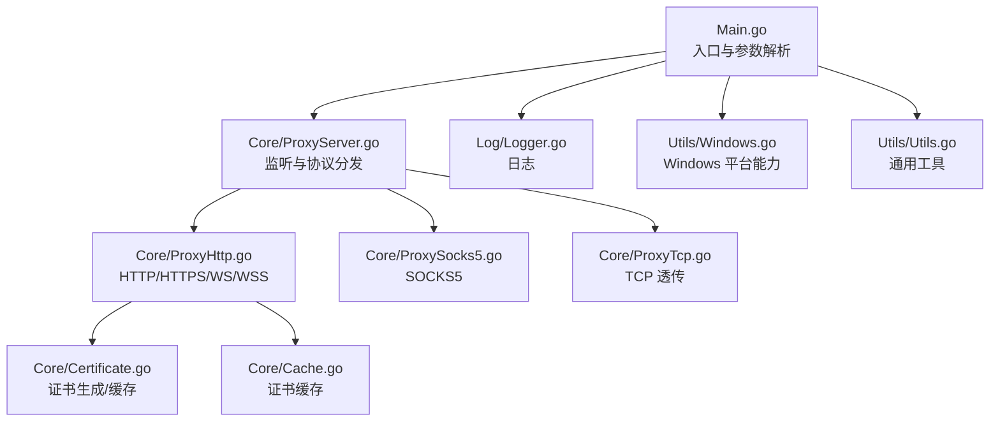
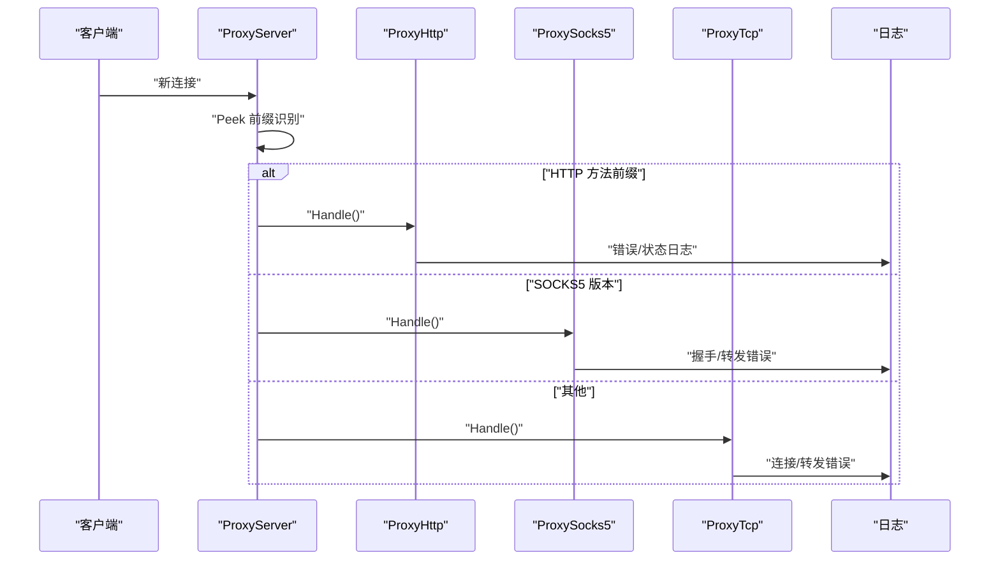
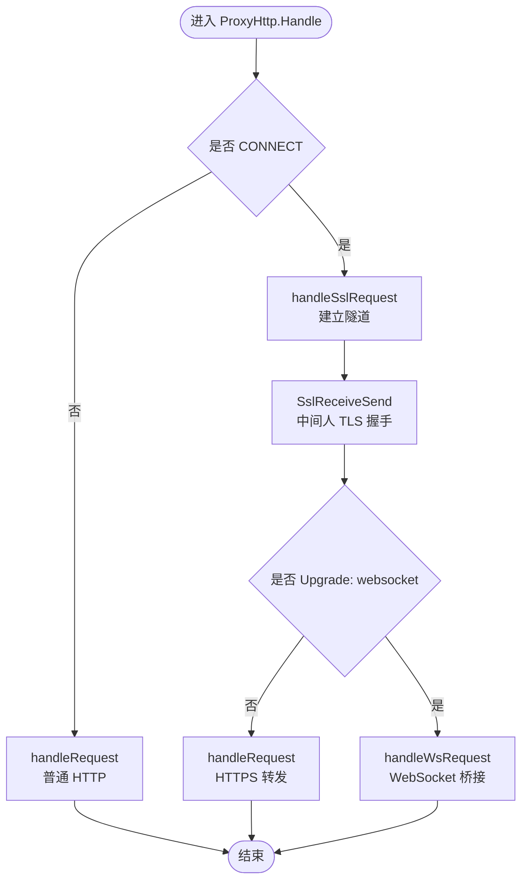
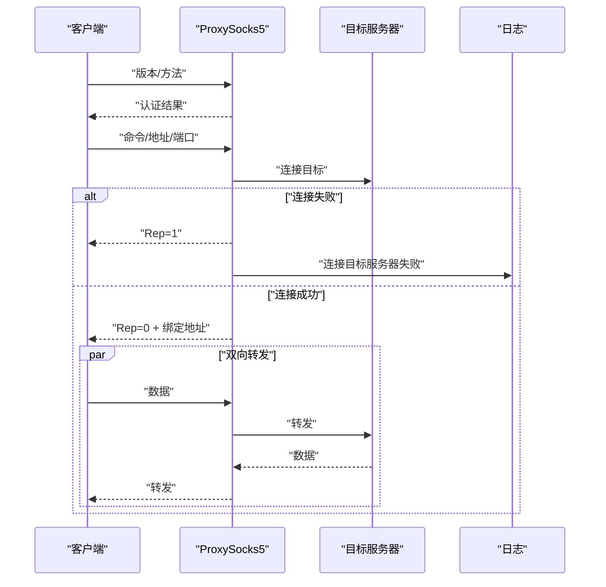
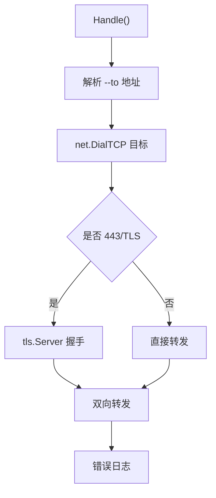
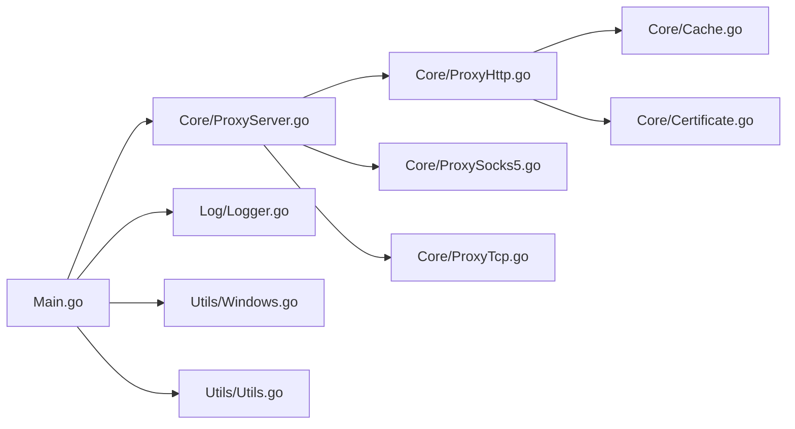

# 故障排除

<cite>
**本文引用的文件**
- [Main.go](file://Main.go)
- [README.md](file://README.md)
- [README-CN.md](file://README-CN.md)
- [CODE-DOC.md](file://CODE-DOC.md)
- [Log/Logger.go](file://Log/Logger.go)
- [Core/ProxyServer.go](file://Core/ProxyServer.go)
- [Core/ProxyHttp.go](file://Core/ProxyHttp.go)
- [Core/ProxySocks5.go](file://Core/ProxySocks5.go)
- [Core/ProxyTcp.go](file://Core/ProxyTcp.go)
- [Core/Certificate.go](file://Core/Certificate.go)
- [Core/Cache.go](file://Core/Cache.go)
- [Utils/Utils.go](file://Utils/Utils.go)
- [Utils/Windows.go](file://Utils/Windows.go)
</cite>

## 目录
1. [简介](#简介)
2. [项目结构](#项目结构)
3. [核心组件](#核心组件)
4. [架构总览](#架构总览)
5. [详细组件分析](#详细组件分析)
6. [依赖分析](#依赖分析)
7. [性能考虑](#性能考虑)
8. [故障排除指南](#故障排除指南)
9. [结论](#结论)
10. [附录](#附录)

## 简介
本故障排除文档面向使用 Shermie-Proxy 的工程师与运维人员，聚焦于常见问题的诊断与解决，涵盖连接失败、证书错误、性能问题、内存泄漏排查、平台差异处理、紧急应急与回滚策略、性能调优与资源优化，以及问题上报与反馈机制。文档结合代码实现与日志输出，帮助快速定位问题根因并给出可操作的修复步骤。

## 项目结构
Shermie-Proxy 采用“入口程序 + 核心代理 + 协议处理器 + 工具与平台适配”的分层组织方式。入口程序负责参数解析与事件回调注册；核心代理负责监听、协议识别与分发；协议处理器（HTTP/HTTPS/WS/WSS、SOCKS5、TCP）实现具体协议处理；工具模块提供跨平台能力与通用工具；日志模块统一输出。



**图表来源**
- [Main.go:24-124](file://Main.go#L24-L124)
- [Core/ProxyServer.go:123-213](file://Core/ProxyServer.go#L123-L213)
- [Core/ProxyHttp.go:44-491](file://Core/ProxyHttp.go#L44-L491)
- [Core/ProxySocks5.go:54-300](file://Core/ProxySocks5.go#L54-L300)
- [Core/ProxyTcp.go:23-112](file://Core/ProxyTcp.go#L23-L112)
- [Core/Certificate.go:35-188](file://Core/Certificate.go#L35-L188)
- [Core/Cache.go:39-79](file://Core/Cache.go#L39-L79)
- [Log/Logger.go:17-20](file://Log/Logger.go#L17-L20)
- [Utils/Windows.go:18-123](file://Utils/Windows.go#L18-L123)
- [Utils/Utils.go:13-62](file://Utils/Utils.go#L13-L62)

**章节来源**
- [Main.go:24-124](file://Main.go#L24-L124)
- [README.md:30-163](file://README.md#L30-L163)
- [README-CN.md:29-167](file://README-CN.md#L29-L167)

## 核心组件
- 入口与事件回调：解析 CLI 参数，注册各类事件回调（HTTP 请求/响应、WebSocket、SOCKS5、TCP），启动服务。
- 核心代理：监听端口、多 Accept 并发、协议识别（HTTP 方法前缀、SOCKS5 版本、其他为 TCP）、分发到对应处理器。
- 协议处理器：
  - HTTP/HTTPS/WS/WSS：解析请求、处理 CONNECT 建立隧道、中间人 TLS 握手、转发与回调、WebSocket 双向桥接。
  - SOCKS5：握手解析、目标连接、双向转发、回调。
  - TCP 透传：按 --to 目标连接、可选 TLS 握手、双向转发、回调。
- 证书系统：根证书初始化与持久化、动态生成叶子证书、并发安全缓存。
- 工具与平台：Windows 证书安装与系统代理设置、通用端口探测与 TLS 原始帧读取辅助。

**章节来源**
- [Main.go:48-124](file://Main.go#L48-L124)
- [Core/ProxyServer.go:123-213](file://Core/ProxyServer.go#L123-L213)
- [Core/ProxyHttp.go:44-491](file://Core/ProxyHttp.go#L44-L491)
- [Core/ProxySocks5.go:54-300](file://Core/ProxySocks5.go#L54-L300)
- [Core/ProxyTcp.go:23-112](file://Core/ProxyTcp.go#L23-L112)
- [Core/Certificate.go:35-188](file://Core/Certificate.go#L35-L188)
- [Core/Cache.go:39-79](file://Core/Cache.go#L39-L79)
- [Utils/Windows.go:18-123](file://Utils/Windows.go#L18-L123)
- [Utils/Utils.go:24-31](file://Utils/Utils.go#L24-L31)

## 架构总览
下图展示从连接接入到协议处理的关键路径，以及错误日志落点，便于定位问题阶段。



**图表来源**
- [Core/ProxyServer.go:176-213](file://Core/ProxyServer.go#L176-L213)
- [Core/ProxyHttp.go:44-132](file://Core/ProxyHttp.go#L44-L132)
- [Core/ProxySocks5.go:54-240](file://Core/ProxySocks5.go#L54-L240)
- [Core/ProxyTcp.go:23-66](file://Core/ProxyTcp.go#L23-L66)
- [Log/Logger.go:17-20](file://Log/Logger.go#L17-L20)

## 详细组件分析

### HTTP/HTTPS/WS/WSS 处理器（ProxyHttp）
- 关键流程：请求解析 → CONNECT 隧道建立 → 中间人 TLS 握手 → 升级 WebSocket 或转发 HTTPS。
- 常见问题与日志位置：
  - 读取请求失败：handleRequest → 读取请求错误。
  - 远程无响应/转发失败：handleRequest → 远程服务器无响应/转发失败。
  - TLS 握手失败：SslReceiveSend → 客户端TLS握手失败、读取TLS连接请求数据失败。
  - WebSocket 升级失败：handleWsRequest → 升级ws协议失败、连接ws服务器失败。
  - 请求头清理：RemoveHeader 移除 hop-by-hop 头，避免代理链异常。
- 性能相关：DNS 缓存（5 分钟 TTL）、Nagle 控制（--nagle）、Keep-Alive 禁用（短连接模型）。



**图表来源**
- [Core/ProxyHttp.go:44-286](file://Core/ProxyHttp.go#L44-L286)

**章节来源**
- [Core/ProxyHttp.go:44-491](file://Core/ProxyHttp.go#L44-L491)
- [CODE-DOC.md:153-282](file://CODE-DOC.md#L153-L282)

### SOCKS5 处理器（ProxySocks5）
- 关键流程：版本/方法解析 → 认证（无认证）→ 命令/地址/端口解析 → 目标连接 → 双向转发。
- 常见问题与日志位置：
  - 握手阶段错误：读取版本号/方法数量/命令/地址类型等失败。
  - 目标连接失败：连接目标服务器失败。
  - 转发阶段错误：读取/写入错误、写入长度不一致。
- 性能相关：UDP/443 特殊分支、Nagle 控制（通过上游 DialContext）。



**图表来源**
- [Core/ProxySocks5.go:54-240](file://Core/ProxySocks5.go#L54-L240)

**章节来源**
- [Core/ProxySocks5.go:54-300](file://Core/ProxySocks5.go#L54-L300)
- [CODE-DOC.md:285-334](file://CODE-DOC.md#L285-L334)

### TCP 透传处理器（ProxyTcp）
- 关键流程：解析 --to 目标 → 连接 → 可选 TLS 握手 → 双向转发。
- 常见问题与日志位置：
  - 目标地址解析失败：解析tcp代理目标地址错误。
  - 目标连接失败：连接tcp代理目标地址错误。
  - 转发阶段错误：tcp代理读取/写入错误、写入长度不一致。
- 性能相关：缓冲区大小（4KB）、Nagle 控制（--nagle）。



**图表来源**
- [Core/ProxyTcp.go:23-112](file://Core/ProxyTcp.go#L23-L112)

**章节来源**
- [Core/ProxyTcp.go:23-112](file://Core/ProxyTcp.go#L23-L112)
- [CODE-DOC.md:335-384](file://CODE-DOC.md#L335-L384)

### 证书系统与缓存（Certificate/Cache）
- 根证书初始化：若不存在则生成并持久化 cert.crt/cert.key；存在则读取解析。
- 动态子证书：按目标主机生成叶子证书，使用 WaitGroup + Mutex 并发安全缓存，避免重复生成。
- 常见问题与日志位置：
  - 获取证书失败：SslReceiveSend → 获取证书失败。
  - 证书生成失败：GeneratePem/GenerateRootPemFile → 错误包装。
  - 缓存命中/等待：GetCertificate → 同域名并发等待，不同域名互不阻塞。

```mermaid
classDiagram
class Certificate {
+Init() error
+GeneratePem(host) ([]byte, []byte, error)
+GenerateRootPemFile(host) (*pem.Block, *pem.Block, error)
+GenerateKeyPair() (*rsa.PrivateKey, error)
}
class Storage {
+GetCertificate(hostname, port) (interface{}, error)
}
class ProxyHttp {
+SslReceiveSend()
}
ProxyHttp --> Storage : "获取/生成子证书"
Storage --> Certificate : "调用生成"
```

**图表来源**
- [Core/Certificate.go:35-188](file://Core/Certificate.go#L35-L188)
- [Core/Cache.go:39-79](file://Core/Cache.go#L39-L79)
- [Core/ProxyHttp.go:242-286](file://Core/ProxyHttp.go#L242-L286)

**章节来源**
- [Core/Certificate.go:35-188](file://Core/Certificate.go#L35-L188)
- [Core/Cache.go:39-79](file://Core/Cache.go#L39-L79)
- [CODE-DOC.md:455-557](file://CODE-DOC.md#L455-L557)

## 依赖分析
- 入口 Main.go 依赖 Core/ProxyServer 与 Log/Logger，注册事件回调后启动服务。
- 核心代理依赖 dnscache（DNS 缓存）、日志模块。
- HTTP 处理器依赖 WebSocket fork、证书缓存与证书管理器。
- 平台工具依赖 golang.org/x/sys（Windows 系统调用）。



**图表来源**
- [Main.go:24-124](file://Main.go#L24-L124)
- [Core/ProxyServer.go:123-213](file://Core/ProxyServer.go#L123-L213)
- [Core/ProxyHttp.go:44-491](file://Core/ProxyHttp.go#L44-L491)
- [Core/ProxySocks5.go:54-300](file://Core/ProxySocks5.go#L54-L300)
- [Core/ProxyTcp.go:23-112](file://Core/ProxyTcp.go#L23-L112)
- [Core/Cache.go:39-79](file://Core/Cache.go#L39-L79)
- [Core/Certificate.go:35-188](file://Core/Certificate.go#L35-L188)
- [Utils/Windows.go:18-123](file://Utils/Windows.go#L18-L123)
- [Utils/Utils.go:13-62](file://Utils/Utils.go#L13-L62)

**章节来源**
- [Main.go:24-124](file://Main.go#L24-L124)
- [Core/ProxyServer.go:123-213](file://Core/ProxyServer.go#L123-L213)
- [go.sum:1-4](file://go.sum#L1-L4)

## 性能考虑
- 多 Accept 并发：MultiListen 启动 5 个 goroutine 并发 Accept，提升高并发下的连接接入能力。
- DNS 缓存：5 分钟 TTL，减少重复解析开销，DialContext 中使用 IPv4 优先与网卡绑定。
- Nagle 控制：--nagle 控制 SetNoDelay（true 表示禁用 Nagle，低延迟模式）。
- Keep-Alive：HTTP Transport 显式禁用 Keep-Alive，避免长连接带来的资源占用。
- 缓冲区：WebSocket/HTTP 转发使用 bufio Reader/Writer，TCP 转发使用 4KB 缓冲区。
- 证书缓存：并发 WaitGroup + Mutex，避免同域名重复生成证书。

**章节来源**
- [Core/ProxyServer.go:156-174](file://Core/ProxyServer.go#L156-L174)
- [Core/ProxyHttp.go:436-468](file://Core/ProxyHttp.go#L436-L468)
- [Core/ProxyTcp.go:68-111](file://Core/ProxyTcp.go#L68-L111)
- [Core/Cache.go:39-79](file://Core/Cache.go#L39-L79)
- [CODE-DOC.md:698-727](file://CODE-DOC.md#L698-L727)

## 故障排除指南

### 一、连接失败类问题
- 现象与定位
  - HTTP/HTTPS：handleRequest 中“远程服务器无响应/转发失败”。
  - HTTPS 隧道：handleSslRequest 中“连接目标服务器失败”、“返回连接状态失败”。
  - SOCKS5：握手阶段“读取版本号/方法数量/命令/地址类型”失败，或“连接目标服务器失败”。
  - TCP 透传：解析 --to 地址失败或“连接tcp代理目标地址错误”。
- 常见原因
  - 目标不可达/端口不通、DNS 解析失败、上游代理配置错误、Nagle/NAT/防火墙限制。
- 处理步骤
  - 使用工具函数探测端口可用性与获取可用端口，确认监听与出站可达。
  - 检查 --proxy 与 --to 配置是否正确，必要时临时禁用上游代理验证直连。
  - 查看日志中的“连接失败/握手失败/写入失败”定位阶段。
  - 如为 DNS 问题，确认 DNS 缓存是否生效，或临时绕过缓存直连 IP。
- 相关日志位置
  - [Core/ProxyHttp.go:108-120](file://Core/ProxyHttp.go#L108-L120)
  - [Core/ProxyHttp.go:205-231](file://Core/ProxyHttp.go#L205-L231)
  - [Core/ProxySocks5.go:54-240](file://Core/ProxySocks5.go#L54-L240)
  - [Core/ProxyTcp.go:23-66](file://Core/ProxyTcp.go#L23-L66)
  - [Utils/Utils.go:33-61](file://Utils/Utils.go#L33-L61)

**章节来源**
- [Core/ProxyHttp.go:108-120](file://Core/ProxyHttp.go#L108-L120)
- [Core/ProxyHttp.go:205-231](file://Core/ProxyHttp.go#L205-L231)
- [Core/ProxySocks5.go:54-240](file://Core/ProxySocks5.go#L54-L240)
- [Core/ProxyTcp.go:23-66](file://Core/ProxyTcp.go#L23-L66)
- [Utils/Utils.go:33-61](file://Utils/Utils.go#L33-L61)

### 二、证书错误类问题
- 现象与定位
  - 客户端 TLS 握手失败：SslReceiveSend 中“客户端TLS握手失败”。
  - 获取证书失败：SslReceiveSend 中“获取证书失败”。
  - WebSocket over TLS：客户端传输层忽略证书校验，若仍失败，检查握手与 Upgrade 头。
- 常见原因
  - 客户端未安装根证书（cert.crt），或安装后未信任。
  - 证书缓存异常或生成失败。
  - 服务器返回非预期的原始帧导致降级解析失败。
- 处理步骤
  - 在 Windows 平台使用系统代理安装根证书；非 Windows 平台需手动安装并信任。
  - 通过 “/tls” 路径下载根证书，确保客户端信任。
  - 清理证书缓存（重启服务会重新生成），或检查证书文件读写权限。
  - 使用工具函数读取 TLS 原始帧辅助定位握手失败原因。
- 相关日志位置
  - [Core/ProxyHttp.go:242-286](file://Core/ProxyHttp.go#L242-L286)
  - [Core/Cache.go:39-79](file://Core/Cache.go#L39-L79)
  - [Core/Certificate.go:35-188](file://Core/Certificate.go#L35-L188)
  - [Utils/Utils.go:24-31](file://Utils/Utils.go#L24-L31)
  - [Utils/Windows.go:18-50](file://Utils/Windows.go#L18-L50)

**章节来源**
- [Core/ProxyHttp.go:242-286](file://Core/ProxyHttp.go#L242-L286)
- [Core/Cache.go:39-79](file://Core/Cache.go#L39-L79)
- [Core/Certificate.go:35-188](file://Core/Certificate.go#L35-L188)
- [Utils/Utils.go:24-31](file://Utils/Utils.go#L24-L31)
- [Utils/Windows.go:18-50](file://Utils/Windows.go#L18-L50)

### 三、性能问题类问题
- 现象与定位
  - 连接接入慢：Accept 并发不足或系统资源紧张。
  - 转发吞吐低：缓冲区过小、Nagle 导致延迟、DNS 缓存未生效。
  - CPU/内存升高：大量并发证书生成、WebSocket 长连接未及时关闭。
- 处理步骤
  - 提升并发：使用多端口监听（--port 多值），配合不同网卡（--network）分流。
  - 调整 Nagle：根据业务需求调整 --nagle，低延迟场景建议启用（SetNoDelay=true）。
  - 优化 DNS：确认 DNS 缓存生效，必要时降低 TTL 或更换 DNS 服务器。
  - 限制长连接：HTTP 转发已禁用 Keep-Alive，确保下游应用不强制长连接。
- 相关实现
  - [Core/ProxyServer.go:156-174](file://Core/ProxyServer.go#L156-L174)
  - [Core/ProxyHttp.go:436-468](file://Core/ProxyHttp.go#L436-L468)
  - [Core/ProxyTcp.go:68-111](file://Core/ProxyTcp.go#L68-L111)
  - [CODE-DOC.md:698-727](file://CODE-DOC.md#L698-L727)

**章节来源**
- [Core/ProxyServer.go:156-174](file://Core/ProxyServer.go#L156-L174)
- [Core/ProxyHttp.go:436-468](file://Core/ProxyHttp.go#L436-L468)
- [Core/ProxyTcp.go:68-111](file://Core/ProxyTcp.go#L68-L111)
- [CODE-DOC.md:698-727](file://CODE-DOC.md#L698-L727)

### 四、内存泄漏与资源占用
- 现象与定位
  - WebSocket 长时间不关闭导致 goroutine/连接堆积。
  - HTTP/HTTPS 转发中响应体未完全读取导致连接资源未释放。
  - SOCKS5/ TCP 转发中异常中断未清理目标连接。
- 处理步骤
  - 确保回调中正确写回/写入，避免阻塞。
  - 检查关闭通道与 defer 逻辑，确保连接最终关闭。
  - 使用外部监控工具观察 goroutine 数量与内存增长趋势。
- 相关实现
  - [Core/ProxyHttp.go:396-434](file://Core/ProxyHttp.go#L396-L434)
  - [Core/ProxySocks5.go:233-284](file://Core/ProxySocks5.go#L233-L284)
  - [Core/ProxyTcp.go:61-111](file://Core/ProxyTcp.go#L61-L111)

**章节来源**
- [Core/ProxyHttp.go:396-434](file://Core/ProxyHttp.go#L396-L434)
- [Core/ProxySocks5.go:233-284](file://Core/ProxySocks5.go#L233-L284)
- [Core/ProxyTcp.go:61-111](file://Core/ProxyTcp.go#L61-L111)

### 五、平台差异与特殊问题
- Windows
  - 可自动安装根证书与设置系统代理；失败时查看动态库加载、函数地址获取与系统存储权限。
  - 旁路规则包含本地与私网地址，避免代理环路。
- macOS/Linux
  - 证书安装与系统代理设置返回“不支持”，需手动安装证书并配置系统代理。
- 相关实现
  - [Utils/Windows.go:18-123](file://Utils/Windows.go#L18-L123)
  - [Core/ProxyServer.go:79-108](file://Core/ProxyServer.go#L79-L108)

**章节来源**
- [Utils/Windows.go:18-123](file://Utils/Windows.go#L18-L123)
- [Core/ProxyServer.go:79-108](file://Core/ProxyServer.go#L79-L108)

### 六、调试工具与方法
- 日志
  - 使用统一日志模块输出错误与状态信息，便于定位阶段。
  - 参考：[Log/Logger.go:17-20](file://Log/Logger.go#L17-L20)
- 网络抓包
  - 使用抓包工具（如 Wireshark）捕获 HTTP/HTTPS/SOCKS5/TCP 流量，核对握手、头部与数据流向。
- 进程分析
  - 使用 pprof/Go 自带分析工具观察 CPU/内存热点，结合 goroutine/heap 分析。
- TLS 原始帧分析
  - 使用工具函数读取 TLS 原始输入帧，辅助定位握手失败或协议误判。
  - 参考：[Utils/Utils.go:24-31](file://Utils/Utils.go#L24-L31)

**章节来源**
- [Log/Logger.go:17-20](file://Log/Logger.go#L17-L20)
- [Utils/Utils.go:24-31](file://Utils/Utils.go#L24-L31)

### 七、紧急应急与回滚策略
- 立即措施
  - 临时停止上游代理（--proxy 置空），切换直连验证问题范围。
  - 降低并发（减少 --port 数量），释放系统资源。
  - 重启服务，清空证书缓存（重启后重新生成）。
- 回滚策略
  - 回退到上一个稳定版本镜像/二进制。
  - 恢复系统代理设置（Windows 可调用卸载函数），或手动恢复。
- 相关实现
  - [Main.go:24-46](file://Main.go#L24-L46)
  - [Core/ProxyServer.go:98-108](file://Core/ProxyServer.go#L98-L108)

**章节来源**
- [Main.go:24-46](file://Main.go#L24-L46)
- [Core/ProxyServer.go:98-108](file://Core/ProxyServer.go#L98-L108)

### 八、性能调优与资源优化
- 并发与连接
  - 使用多端口监听与多 Accept 并发，提升连接接入能力。
  - 控制 Nagle：根据业务延迟/吞吐需求调整 --nagle。
- DNS 与网络
  - 启用 DNS 缓存（5 分钟），必要时指定出口网卡（--network）。
- 证书与内存
  - 利用证书缓存避免重复生成；关注 goroutine 与连接数量，避免泄漏。
- 参考实现
  - [Core/ProxyServer.go:156-174](file://Core/ProxyServer.go#L156-L174)
  - [Core/ProxyHttp.go:436-468](file://Core/ProxyHttp.go#L436-L468)
  - [Core/Cache.go:39-79](file://Core/Cache.go#L39-L79)

**章节来源**
- [Core/ProxyServer.go:156-174](file://Core/ProxyServer.go#L156-L174)
- [Core/ProxyHttp.go:436-468](file://Core/ProxyHttp.go#L436-L468)
- [Core/Cache.go:39-79](file://Core/Cache.go#L39-L79)

### 九、问题报告与反馈机制
- 信息收集
  - 版本信息、平台、CLI 参数（--port/--proxy/--to/--nagle/--network）。
  - 日志片段（含错误关键字：连接失败、握手失败、获取证书失败等）。
  - 复现步骤与最小化配置。
- 提交渠道
  - 参考项目 README 中的社区与群组链接，提交 Issue 时附带上述信息。
- 参考
  - [README.md:151-163](file://README.md#L151-L163)
  - [README-CN.md:145-167](file://README-CN.md#L145-L167)

**章节来源**
- [README.md:151-163](file://README.md#L151-L163)
- [README-CN.md:145-167](file://README-CN.md#L145-L167)

## 结论
本故障排除文档基于代码实现与日志输出，提供了从连接失败、证书错误到性能问题、内存泄漏的系统化诊断思路与解决步骤，并针对不同平台给出了差异化处理建议。建议在日常运维中结合日志、抓包与分析工具，持续监控并发、DNS 与证书缓存等关键指标，以保障代理服务的稳定性与性能。

## 附录
- 常用 CLI 参数
  - --port：监听端口（支持多端口逗号分隔）
  - --proxy：上级代理地址
  - --to：TCP 透传目标地址
  - --nagle：是否启用 Nagle（低延迟模式）
  - --network：出口网卡 IP（与 --port 数量一致）
- 参考
  - [CODE-DOC.md:560-580](file://CODE-DOC.md#L560-L580)

**章节来源**
- [CODE-DOC.md:560-580](file://CODE-DOC.md#L560-L580)