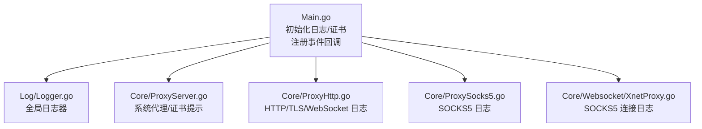
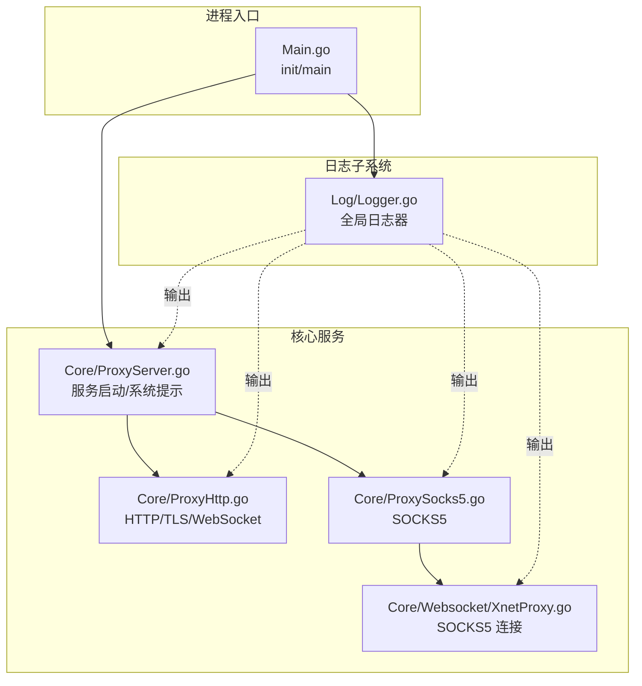
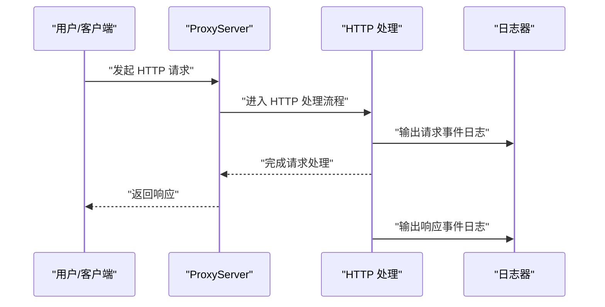
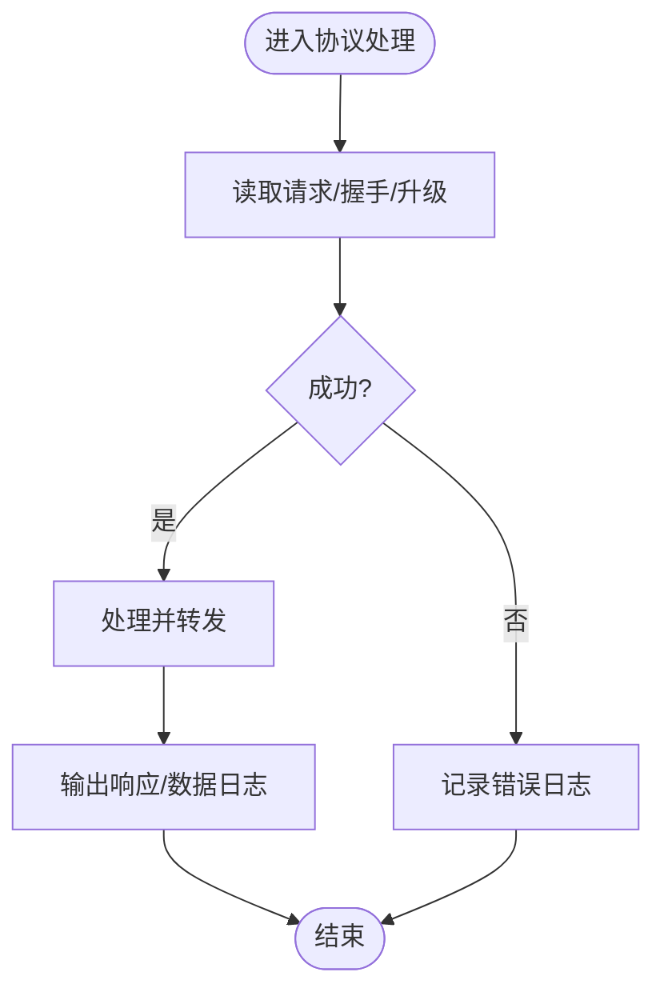
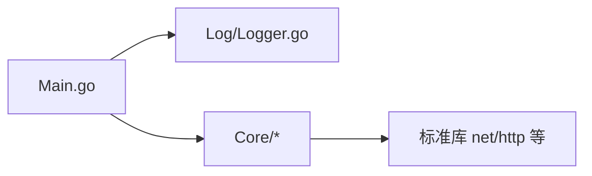

# 监控日志

<cite>
**本文引用的文件**
- [Main.go](file://Main.go)
- [Logger.go](file://Log/Logger.go)
- [ProxyHttp.go](file://Core/ProxyHttp.go)
- [ProxySocks5.go](file://Core/ProxySocks5.go)
- [XnetProxy.go](file://Core/Websocket/XnetProxy.go)
- [ProxyServer.go](file://Core/ProxyServer.go)
- [README-CN.md](file://README-CN.md)
- [README.md](file://README.md)
</cite>

## 目录
1. [简介](#简介)
2. [项目结构](#项目结构)
3. [核心组件](#核心组件)
4. [架构总览](#架构总览)
5. [详细组件分析](#详细组件分析)
6. [依赖分析](#依赖分析)
7. [性能考虑](#性能考虑)
8. [故障排查指南](#故障排查指南)
9. [结论](#结论)
10. [附录](#附录)

## 简介
本文件面向 shermie-proxy 的运维与开发人员，系统性梳理其日志体系与监控实践。当前代码库采用标准库日志模块作为基础日志设施，通过统一的全局日志器对外输出；同时在主程序中注册了多种网络事件回调，可在回调中进行自定义日志记录与行为控制。本文将从日志配置、输出格式、事件回调集成、异常与性能监控、以及日志聚合与告警建议等方面展开，帮助读者建立完善的监控日志方案。

## 项目结构
围绕日志系统的关键文件与职责如下：
- 日志基础设施：Log/Logger.go 提供全局日志器与初始化入口
- 主程序入口：Main.go 负责初始化日志与证书、启动服务、注册各类事件回调
- 核心业务日志点：Core 下各协议处理模块在关键路径打印日志
- 文档示例：README-CN.md 与 README.md 展示了日志使用与事件回调的典型场景

图表来源
- [Main.go:13-22](file://Main.go#L13-L22)
- [Logger.go:17-19](file://Log/Logger.go#L17-L19)
- [ProxyServer.go:82-162](file://Core/ProxyServer.go#L82-L162)
- [ProxyHttp.go:46-434](file://Core/ProxyHttp.go#L46-L434)
- [ProxySocks5.go:151-198](file://Core/ProxySocks5.go#L151-L198)
- [XnetProxy.go:438-473](file://Core/Websocket/XnetProxy.go#L438-L473)

章节来源
- [Main.go:13-22](file://Main.go#L13-L22)
- [Logger.go:17-19](file://Log/Logger.go#L17-L19)

## 核心组件
- 全局日志器
  - 初始化方式：在应用初始化阶段调用日志器初始化，设置输出目标为标准输出，并启用日期与时间前缀
  - 使用方式：通过全局日志器在各模块中输出运行信息、错误与调试信息
- 事件回调
  - 主程序在启动后注册多种网络事件回调，包括 HTTP 请求/响应、WebSocket 请求/响应、SOCKS5 请求/响应、TCP 客户端/服务端流等
  - 在回调中可直接使用全局日志器输出事件摘要或敏感数据（如 JSON 响应体），以便快速定位问题

章节来源
- [Logger.go:17-19](file://Log/Logger.go#L17-L19)
- [Main.go:53-123](file://Main.go#L53-L123)

## 架构总览
下图展示了日志在系统中的位置与流向：主程序负责初始化日志与证书，随后启动代理服务并在各协议处理路径中输出日志；同时通过事件回调扩展自定义日志记录能力。

图表来源
- [Main.go:13-22](file://Main.go#L13-L22)
- [Logger.go:17-19](file://Log/Logger.go#L17-L19)
- [ProxyServer.go:82-162](file://Core/ProxyServer.go#L82-L162)
- [ProxyHttp.go:46-434](file://Core/ProxyHttp.go#L46-L434)
- [ProxySocks5.go:151-198](file://Core/ProxySocks5.go#L151-L198)
- [XnetProxy.go:438-473](file://Core/Websocket/XnetProxy.go#L438-L473)

## 详细组件分析

### 日志器与初始化
- 初始化逻辑
  - 在应用初始化阶段调用日志器初始化，设置输出为标准输出，并启用日期与时间前缀
- 使用建议
  - 将该初始化放在应用启动早期，确保后续所有模块均可直接使用全局日志器
  - 如需扩展输出目标（如文件）或调整格式，可在日志器初始化处统一变更

章节来源
- [Logger.go:17-19](file://Log/Logger.go#L17-L19)
- [Main.go:13-22](file://Main.go#L13-L22)

### 事件回调与日志集成
- 回调类型
  - HTTP 请求/响应事件
  - WebSocket 请求/响应事件
  - SOCKS5 请求/响应事件
  - TCP 客户端/服务端流事件
- 日志实践
  - 在回调中使用全局日志器输出事件摘要（如远端地址、消息类型、消息长度等）
  - 对于 JSON 响应体等敏感数据，建议按 MIME 类型或大小限制输出，避免泄露
  - 回调中可对消息进行修改后再透传，便于审计与调试

图表来源
- [Main.go:61-78](file://Main.go#L61-L78)
- [ProxyHttp.go:46-113](file://Core/ProxyHttp.go#L46-L113)

章节来源
- [Main.go:53-123](file://Main.go#L53-L123)
- [ProxyHttp.go:46-113](file://Core/ProxyHttp.go#L46-L113)

### 协议层日志点
- HTTP/TLS/WebSocket
  - 关键路径包含读取请求、TLS 握手、协议升级、WS 数据收发等环节的日志输出
  - 出错时输出具体错误信息，便于快速定位问题
- SOCKS5
  - 包含地址解析、端口读取、目标连接建立、失败回退等日志输出
- XnetProxy（SOCKS5 连接）
  - 连接建立后的地址/端口丢弃与错误处理日志

图表来源
- [ProxyHttp.go:46-434](file://Core/ProxyHttp.go#L46-L434)
- [ProxySocks5.go:151-198](file://Core/ProxySocks5.go#L151-L198)
- [XnetProxy.go:438-473](file://Core/Websocket/XnetProxy.go#L438-L473)

章节来源
- [ProxyHttp.go:46-434](file://Core/ProxyHttp.go#L46-L434)
- [ProxySocks5.go:151-198](file://Core/ProxySocks5.go#L151-L198)
- [XnetProxy.go:438-473](file://Core/Websocket/XnetProxy.go#L438-L473)

### 系统提示与诊断日志
- 代理设置、证书安装、Logo 打印等信息通过日志输出，便于用户确认运行状态
- 非 Windows 平台会提示手动安装证书与代理设置方法

章节来源
- [ProxyServer.go:82-162](file://Core/ProxyServer.go#L82-L162)

## 依赖分析
- 模块耦合
  - 主程序依赖日志器与证书模块，再依赖核心代理服务
  - 核心服务在各协议处理模块中直接使用全局日志器
- 外部依赖
  - 日志器基于标准库日志模块
  - 证书生成与系统代理设置依赖平台工具集

图表来源
- [Main.go:9-10](file://Main.go#L9-L10)
- [Logger.go:3-6](file://Log/Logger.go#L3-L6)

章节来源
- [Main.go:9-10](file://Main.go#L9-L10)
- [Logger.go:3-6](file://Log/Logger.go#L3-L6)

## 性能考虑
- 日志量控制
  - 对大体量响应（如 JSON）按条件输出，避免频繁 IO
  - 在高频事件（如 WS 流）中减少不必要的字符串拼接与格式化
- 输出目标
  - 当前输出至标准输出；生产环境建议重定向至文件或对接集中式日志系统，避免 stdout 泄漏
- 错误日志
  - 错误路径尽量包含上下文信息（如远端地址、协议类型），但避免输出敏感数据

## 故障排查指南
- 常见问题定位
  - HTTP/TLS 握手失败：查看 TLS 握手与连接断开相关的日志
  - WebSocket 升级失败：关注协议升级与连接建立阶段的日志
  - SOCKS5 地址解析与端口读取失败：检查地址类型与端口解析日志
  - 系统代理/证书：根据平台提示确认证书安装与代理设置
- 排查步骤
  - 开启更细粒度日志（如仅输出 JSON 响应体或特定协议）
  - 结合事件回调输出关键字段（如远端地址、消息类型、长度）
  - 观察错误日志中的堆栈与上下文，定位具体模块

章节来源
- [ProxyHttp.go:46-434](file://Core/ProxyHttp.go#L46-L434)
- [ProxySocks5.go:151-198](file://Core/ProxySocks5.go#L151-L198)
- [ProxyServer.go:82-162](file://Core/ProxyServer.go#L82-L162)

## 结论
sheremie-proxy 的日志体系以标准库日志器为基础，配合主程序的事件回调机制，实现了对多协议流量的可观测性。通过在关键路径输出日志与在回调中扩展自定义记录，能够满足日常运维与问题排查的需求。建议在生产环境中进一步完善日志输出目标、格式化与轮转策略，并结合集中式日志与告警系统，形成闭环的监控与告警方案。

## 附录

### 日志级别与输出格式
- 当前实现
  - 输出目标：标准输出
  - 格式：启用日期与时间前缀
- 建议
  - 如需区分级别（info/warn/error），可在日志器初始化处增加前缀标识
  - 如需结构化日志（JSON），可替换为第三方日志库并在初始化处统一接入

章节来源
- [Logger.go:17-19](file://Log/Logger.go#L17-L19)

### 日志轮转策略
- 当前实现
  - 未内置轮转逻辑
- 建议
  - 使用系统工具（如 logrotate）对 stdout 重定向的文件进行轮转
  - 或在应用启动时将日志输出重定向到固定文件，再由外部工具管理轮转

### 自定义日志记录（事件回调）
- 在回调中直接使用全局日志器输出事件摘要
- 可按需对消息体进行条件输出（如仅 JSON 或小于阈值）

章节来源
- [Main.go:61-123](file://Main.go#L61-L123)

### 日志聚合、告警与可视化
- 日志聚合
  - 将应用输出重定向到文件，使用集中式日志系统收集
- 告警
  - 基于错误日志关键字（如“失败”、“错误”）触发告警
- 可视化
  - 统计事件回调中的关键指标（如每类协议的请求数、错误率、平均响应时间）

### 日志清理与归档
- 清理
  - 设置保留周期与最大文件数，定期清理过期日志
- 归档
  - 按日期归档压缩日志，降低存储压力