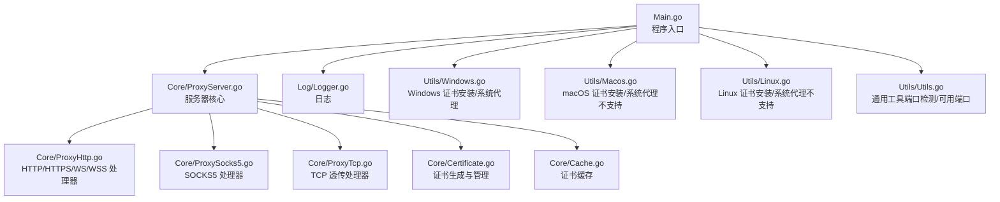
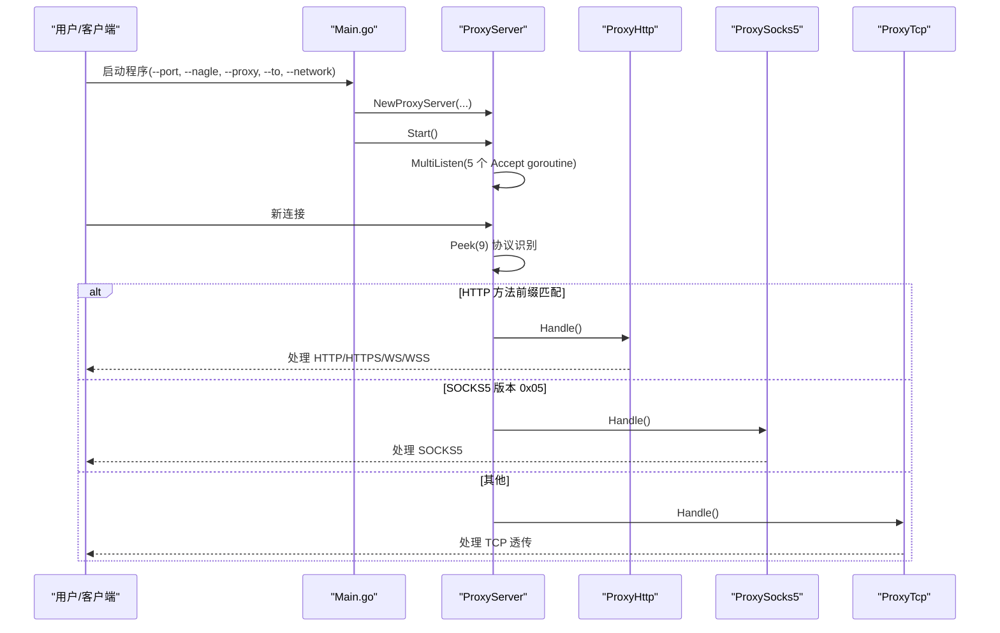

# 部署指南

<cite>
**本文引用的文件**
- [Main.go](file://Main.go)
- [README.md](file://README.md)
- [README-CN.md](file://README-CN.md)
- [go.mod](file://go.mod)
- [CODE-DOC.md](file://CODE-DOC.md)
- [Core/ProxyServer.go](file://Core/ProxyServer.go)
- [Core/ProxyHttp.go](file://Core/ProxyHttp.go)
- [Core/ProxySocks5.go](file://Core/ProxySocks5.go)
- [Core/Certificate.go](file://Core/Certificate.go)
- [Core/Cache.go](file://Core/Cache.go)
- [Utils/Utils.go](file://Utils/Utils.go)
- [Utils/Windows.go](file://Utils/Windows.go)
- [Utils/Macos.go](file://Utils/Macos.go)
- [Utils/Linux.go](file://Utils/Linux.go)
- [Log/Logger.go](file://Log/Logger.go)
</cite>

## 目录
1. [简介](#简介)
2. [项目结构](#项目结构)
3. [核心组件](#核心组件)
4. [架构总览](#架构总览)
5. [详细组件分析](#详细组件分析)
6. [依赖分析](#依赖分析)
7. [性能考虑](#性能考虑)
8. [故障排查指南](#故障排查指南)
9. [结论](#结论)
10. [附录](#附录)

## 简介
Shermie-Proxy 是一个支持 HTTP、HTTPS、WebSocket（WS/WSS）、TCP 透传与 SOCKS5 的统一代理入口。其核心特性包括：
- 协议自动识别：通过窥探连接首字节自动判断协议类型
- TLS 中间人代理：动态生成子证书实现 HTTPS 流量拦截与修改
- 事件回调机制：提供 10 类事件回调，允许在请求/响应各阶段拦截与修改数据
- 多端口多网卡：支持同时监听多个端口，每个端口可绑定不同出口网卡
- 上级代理链：支持通过命令行参数设置上级代理

## 项目结构
仓库采用按功能模块划分的组织方式，主要目录与职责如下：
- Main.go：程序入口，解析命令行参数，注册事件回调，启动代理服务
- Core/：核心代理逻辑，包含协议处理器、证书管理、缓存与连接上下文
- Contract/：接口定义（IServerProcesser）
- Log/：日志模块
- Utils/：平台适配与通用工具（Windows/macOS/Linux 证书安装与系统代理设置；通用工具函数）
- go.mod：Go 模块与依赖声明

图表来源
- [Main.go:1-124](file://Main.go#L1-L124)
- [Core/ProxyServer.go:1-213](file://Core/ProxyServer.go#L1-L213)
- [Core/ProxyHttp.go:1-200](file://Core/ProxyHttp.go#L1-L200)
- [Core/ProxySocks5.go:1-200](file://Core/ProxySocks5.go#L1-L200)
- [Core/Certificate.go:1-188](file://Core/Certificate.go#L1-L188)
- [Core/Cache.go](file://Core/Cache.go)
- [Utils/Windows.go:1-123](file://Utils/Windows.go#L1-L123)
- [Utils/Macos.go:1-17](file://Utils/Macos.go#L1-L17)
- [Utils/Linux.go:1-17](file://Utils/Linux.go#L1-L17)
- [Utils/Utils.go:1-62](file://Utils/Utils.go#L1-L62)
- [Log/Logger.go:1-20](file://Log/Logger.go#L1-L20)

章节来源
- [Main.go:1-124](file://Main.go#L1-L124)
- [CODE-DOC.md:30-79](file://CODE-DOC.md#L30-L79)

## 核心组件
- 命令行参数与入口
  - 端口配置：--port，默认 9090；支持逗号分隔多端口
  - Nagle 算法控制：--nagle，默认 true（表示禁用 Nagle，启用低延迟）
  - 上级代理设置：--proxy，格式 host:port
  - 目标主机设置：--to，仅 TCP 透传生效
  - 网卡绑定：--network，强制出口网卡 IP；多端口时需与 --port 数量一致
- 服务器启动与多端口监听
  - 解析参数后，按端口数量启动对应 goroutine，每个端口独立监听
  - 每个监听器启动 5 个并发 Accept goroutine，提升连接接受吞吐量
- 证书与 TLS
  - 启动时初始化根证书（./cert.crt 与 ./cert.key），若不存在则自动生成
  - HTTPS 流量通过中间人证书拦截，动态为每个目标域名生成子证书
- 平台适配
  - Windows：支持证书安装与系统代理设置
  - macOS/Linux：证书安装与系统代理设置返回“不支持”错误

章节来源
- [Main.go:24-46](file://Main.go#L24-L46)
- [Main.go:48-124](file://Main.go#L48-L124)
- [Core/ProxyServer.go:123-174](file://Core/ProxyServer.go#L123-L174)
- [Core/Certificate.go:34-67](file://Core/Certificate.go#L34-L67)
- [Utils/Windows.go:18-50](file://Utils/Windows.go#L18-L50)
- [Utils/Macos.go:8-16](file://Utils/Macos.go#L8-L16)
- [Utils/Linux.go:8-16](file://Utils/Linux.go#L8-L16)

## 架构总览
Shermie-Proxy 的启动与处理流程如下：
- 初始化日志与根证书
- 解析命令行参数
- 为每个端口启动独立 goroutine
- 每个端口启动 5 个并发 Accept goroutine
- 新连接到达后，协议识别（HTTP 方法前缀匹配、SOCKS5 版本、否则 TCP）
- 根据协议类型分发至对应处理器（HTTP/HTTPS/WS/WSS、SOCKS5、TCP）

图表来源
- [Main.go:24-46](file://Main.go#L24-L46)
- [Core/ProxyServer.go:156-203](file://Core/ProxyServer.go#L156-L203)
- [Core/ProxyHttp.go:44-64](file://Core/ProxyHttp.go#L44-L64)
- [Core/ProxySocks5.go:54-90](file://Core/ProxySocks5.go#L54-L90)
- [Core/ProxyTcp.go](file://Core/ProxyTcp.go)

## 详细组件分析

### 命令行参数与部署
- --port：监听端口，支持多端口（逗号分隔），每个端口独立监听
- --nagle：是否启用 Nagle 算法（默认 true，实际底层调用 SetNoDelay(true)，即低延迟模式）
- --proxy：上级代理地址（host:port），用于 HTTP 转发与 SOCKS5 连接
- --to：TCP 透传的目标地址（仅 TCP 协议生效）
- --network：强制出口网卡 IP，多端口时需与 --port 数量一致

部署要点
- 端口与网卡数量必须一致，否则会直接报错退出
- 多端口部署适合多网卡分流场景
- Nagle 控制影响网络延迟与吞吐，生产环境建议根据业务调整

章节来源
- [Main.go:25-30](file://Main.go#L25-L30)
- [Main.go:36-44](file://Main.go#L36-L44)
- [README.md:148-163](file://README.md#L148-L163)
- [README-CN.md:145-158](file://README-CN.md#L145-L158)
- [CODE-DOC.md:560-581](file://CODE-DOC.md#L560-L581)

### 服务器启动与多端口监听
- 每个端口启动一个 ListenBranch goroutine，内部创建 ProxyServer 实例
- MultiListen 启动 5 个并发 Accept goroutine，每个连接独立 goroutine 处理
- 事件回调在 ListenBranch 中注册，便于在请求/响应阶段进行拦截与修改

章节来源
- [Main.go:48-124](file://Main.go#L48-L124)
- [Core/ProxyServer.go:156-174](file://Core/ProxyServer.go#L156-L174)

### 协议识别与处理
- 协议识别：Peek(9) 读取连接首字节，HTTP 方法前缀匹配优先，否则判断 SOCKS5 版本，其余走 TCP
- HTTP/HTTPS/WS/WSS：CONNECT 建立隧道，动态生成子证书，支持事件回调与 gzip 解码
- SOCKS5：握手后根据命令类型与目标地址建立连接，支持 UDP/TCP
- TCP 透传：根据 --to 参数连接目标，可选 TLS 握手，支持事件回调

章节来源
- [Core/ProxyServer.go:176-213](file://Core/ProxyServer.go#L176-L213)
- [Core/ProxyHttp.go:44-132](file://Core/ProxyHttp.go#L44-L132)
- [Core/ProxySocks5.go:54-200](file://Core/ProxySocks5.go#L54-L200)

### 证书系统与 TLS 中间人
- 根证书：启动时初始化 ./cert.crt 与 ./cert.key，不存在则自动生成
- 子证书：为每个目标域名动态生成，使用根证书签名，支持 IP/DNS SAN
- 证书缓存：并发安全，同一域名仅生成一次，避免重复开销

章节来源
- [Core/Certificate.go:34-116](file://Core/Certificate.go#L34-L116)
- [Core/Cache.go](file://Core/Cache.go)
- [Core/ProxyHttp.go:80-94](file://Core/ProxyHttp.go#L80-L94)

### 平台适配与系统代理
- Windows：支持证书安装到系统 Root 存储区，并设置系统代理（旁路规则内置）
- macOS/Linux：证书安装与系统代理设置返回“不支持”，需手动安装证书与配置代理

章节来源
- [Utils/Windows.go:18-50](file://Utils/Windows.go#L18-L50)
- [Utils/Windows.go:52-122](file://Utils/Windows.go#L52-L122)
- [Utils/Macos.go:8-16](file://Utils/Macos.go#L8-L16)
- [Utils/Linux.go:8-16](file://Utils/Linux.go#L8-L16)

### 日志与运行信息
- 日志初始化：标准输出，包含日期与时间
- 启动日志：打印监听地址与启动 Logo

章节来源
- [Log/Logger.go:17-19](file://Log/Logger.go#L17-L19)
- [Core/ProxyServer.go:144-154](file://Core/ProxyServer.go#L144-L154)

## 依赖分析
- Go 运行时：1.16
- 第三方依赖：
  - viki-org/dnscache：DNS 缓存（5 分钟 TTL）
  - golang.org/x/sys：Windows 系统调用（证书安装与代理设置）
- 内部模块：
  - Core：协议处理、证书与缓存
  - Contract：接口定义
  - Log：日志
  - Utils：平台适配与通用工具

章节来源
- [go.mod:1-9](file://go.mod#L1-L9)
- [CODE-DOC.md:16-27](file://CODE-DOC.md#L16-L27)

## 性能考虑
- 多 Accept goroutine：每个监听器启动 5 个并发 Accept，提升高并发下的连接接受能力
- Nagle 控制：--nagle 默认 true（底层 SetNoDelay(true)），降低延迟，适合代理场景
- DNS 缓存：5 分钟 TTL，减少重复解析开销
- 证书缓存：并发安全，同一域名仅生成一次子证书，避免重复 RSA 密钥生成
- 事件回调：可在请求/响应阶段进行拦截与修改，注意避免阻塞与过度处理

章节来源
- [Core/ProxyServer.go:156-174](file://Core/ProxyServer.go#L156-L174)
- [CODE-DOC.md:698-720](file://CODE-DOC.md#L698-L720)

## 故障排查指南
常见问题与定位建议：
- 端口占用或数量不一致
  - 现象：启动时报错“端口数量和网卡数量必须一致”
  - 处理：确保 --port 与 --network 数量一致，且端口未被占用
- 证书相关
  - 现象：HTTPS 请求失败或浏览器提示证书不受信
  - 处理：确认 ./cert.crt 与 ./cert.key 存在；Windows 可尝试重新安装证书；macOS/Linux 需手动安装证书
- 上级代理
  - 现象：HTTP 转发失败
  - 处理：检查 --proxy 格式 host:port 是否正确
- 平台适配
  - 现象：Windows 无法设置系统代理或安装证书
  - 处理：确认具备管理员权限；必要时手动安装证书与配置代理

章节来源
- [Main.go:36-44](file://Main.go#L36-L44)
- [Core/Certificate.go:34-67](file://Core/Certificate.go#L34-L67)
- [Utils/Windows.go:18-50](file://Utils/Windows.go#L18-L50)
- [Utils/Windows.go:52-122](file://Utils/Windows.go#L52-L122)

## 结论
Shermie-Proxy 提供了统一的多协议代理入口，具备强大的事件回调扩展能力与 TLS 中间人拦截能力。通过命令行参数可灵活配置端口、Nagle 算法、上级代理与网卡绑定，满足多端口多网卡的部署需求。在 Windows 平台可借助内置工具实现证书安装与系统代理设置，在 macOS/Linux 平台需手动完成证书安装与代理配置。

## 附录

### 命令行参数参考
- --port：监听端口（支持多端口逗号分隔）
- --nagle：是否启用 Nagle 算法（默认 true，实际为低延迟模式）
- --proxy：上级代理地址（host:port）
- --to：TCP 透传目标地址（仅 TCP 生效）
- --network：强制出口网卡 IP（多端口时需与 --port 数量一致）

章节来源
- [Main.go:25-30](file://Main.go#L25-L30)
- [README.md:148-163](file://README.md#L148-L163)
- [README-CN.md:145-158](file://README-CN.md#L145-L158)
- [CODE-DOC.md:560-581](file://CODE-DOC.md#L560-L581)

### 单机部署与多实例部署差异
- 单机部署
  - 使用单一进程监听一个或多个端口，每个端口可绑定不同网卡
  - 适合小规模测试与开发环境
- 多实例部署
  - 启动多个进程，每个进程监听不同端口或绑定不同网卡
  - 适合高并发与多网卡分流场景
- 配置差异
  - 单机：--port 与 --network 数量一致
  - 多实例：每个实例独立配置端口与网卡，避免冲突

章节来源
- [Main.go:36-44](file://Main.go#L36-L44)
- [CODE-DOC.md:704-709](file://CODE-DOC.md#L704-L709)

### Docker 与 Kubernetes 部署建议
- Docker 镜像构建
  - 基于官方 Go 镜像构建二进制，复制二进制与证书文件（如需）
  - 暴露 --port 指定的端口
  - 使用 --network 绑定容器网络接口（如需）
- Kubernetes 部署
  - Deployment：副本数根据并发需求配置
  - Service：ClusterIP/NodePort/LoadBalancer 依据访问需求选择
  - ConfigMap：用于注入证书文件（如需）
  - Pod 安全策略：授予必要的系统代理设置权限（Windows 场景）
- 注意事项
  - 证书文件持久化与更新策略
  - 多实例横向扩展时的端口与网卡绑定一致性

[本节为概念性部署建议，不直接分析具体源文件，故不附“章节来源”]