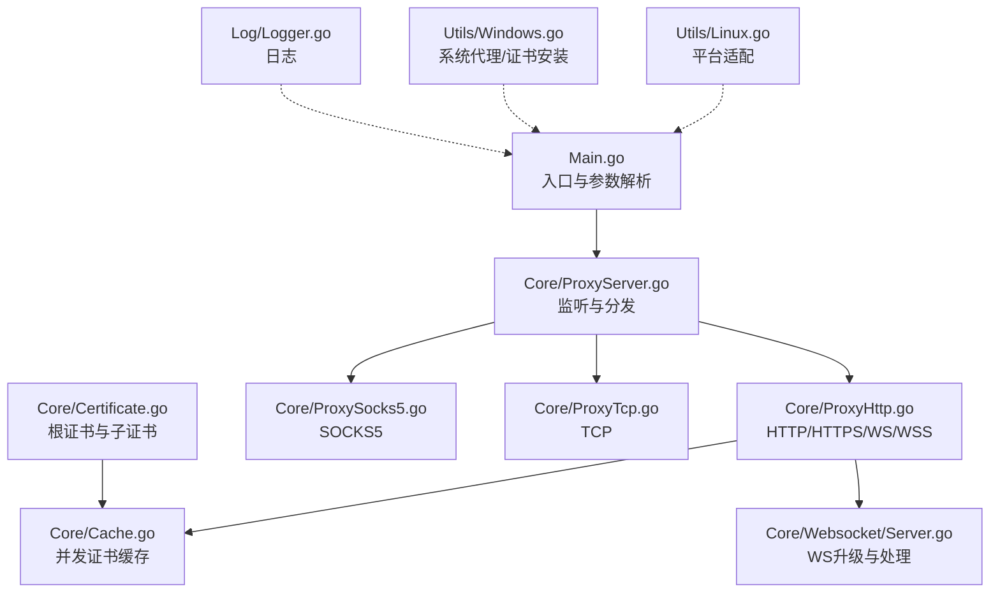
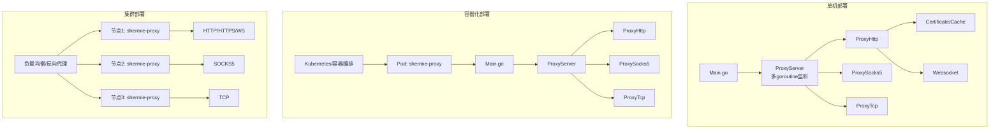
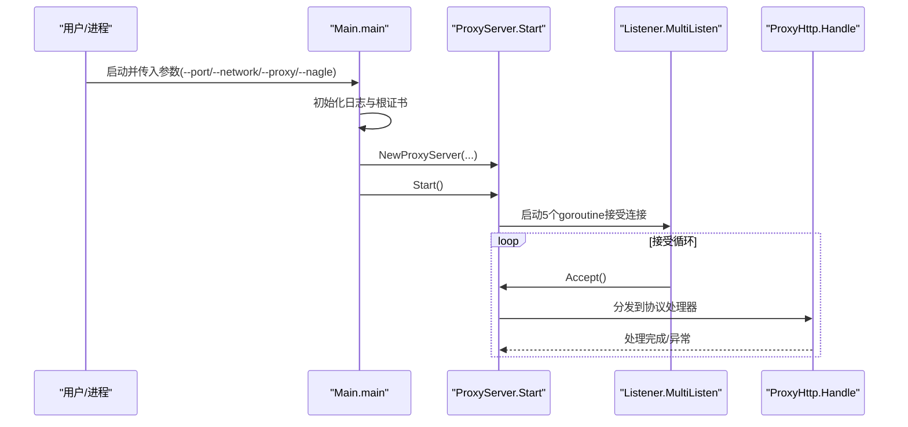
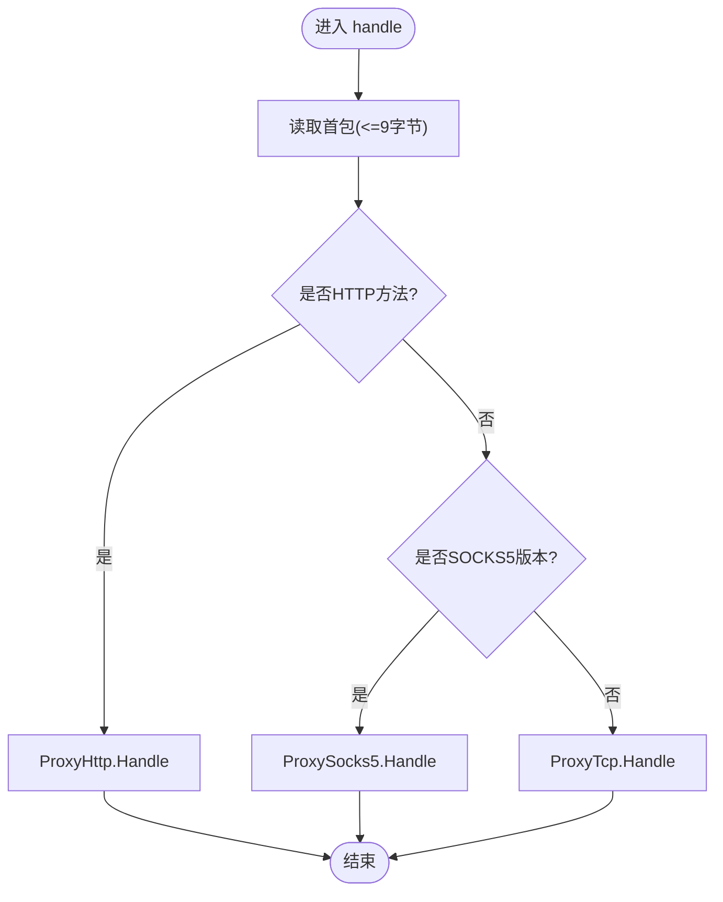
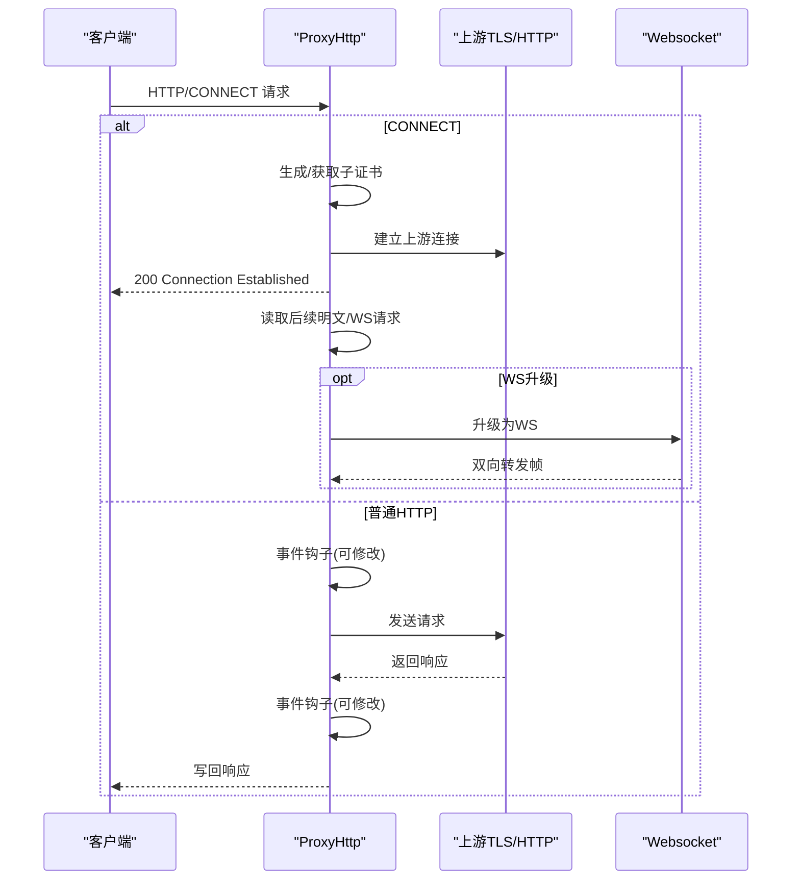
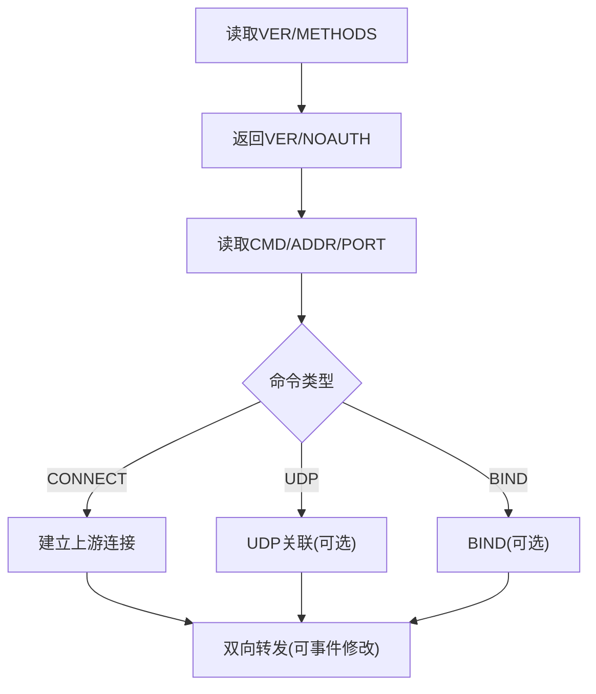
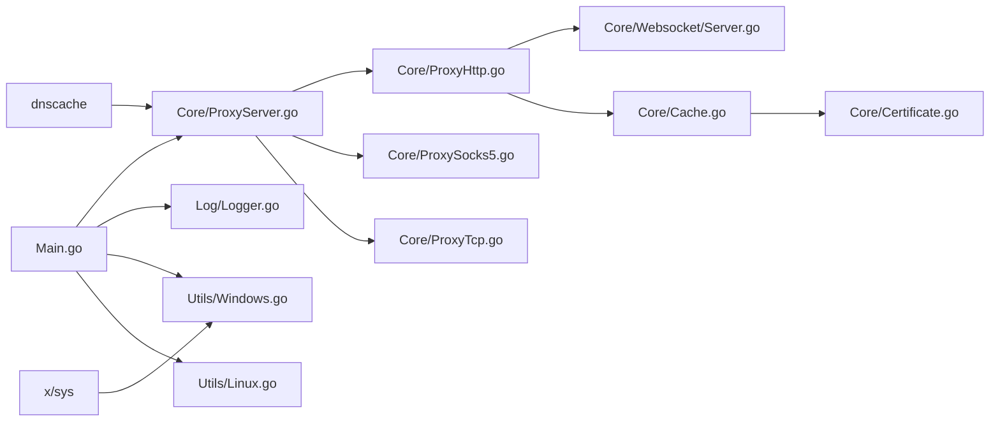

# 部署运维

<cite>
**本文引用的文件**
- [Main.go](file://Main.go)
- [README.md](file://README.md)
- [README-CN.md](file://README-CN.md)
- [go.mod](file://go.mod)
- [go.sum](file://go.sum)
- [Log/Logger.go](file://Log/Logger.go)
- [Core/ProxyServer.go](file://Core/ProxyServer.go)
- [Core/ProxyHttp.go](file://Core/ProxyHttp.go)
- [Core/ProxySocks5.go](file://Core/ProxySocks5.go)
- [Core/ProxyTcp.go](file://Core/ProxyTcp.go)
- [Core/Certificate.go](file://Core/Certificate.go)
- [Core/Cache.go](file://Core/Cache.go)
- [Core/Websocket/Server.go](file://Core/Websocket/Server.go)
- [Contract/IServerProcesser.go](file://Contract/IServerProcesser.go)
- [Utils/Utils.go](file://Utils/Utils.go)
- [Utils/Windows.go](file://Utils/Windows.go)
- [Utils/Linux.go](file://Utils/Linux.go)
- [CODE-DOC.md](file://CODE-DOC.md)
</cite>

## 目录
1. [简介](#简介)
2. [项目结构](#项目结构)
3. [核心组件](#核心组件)
4. [架构总览](#架构总览)
5. [详细组件分析](#详细组件分析)
6. [依赖分析](#依赖分析)
7. [性能考虑](#性能考虑)
8. [故障排查指南](#故障排查指南)
9. [结论](#结论)
10. [附录](#附录)

## 简介
本文件面向生产环境的部署与运维，围绕 shermie-proxy 的功能特性与实现细节，提供服务器配置、性能调优、监控与告警、日志管理、备份恢复、版本升级与安全加固等运维最佳实践，并覆盖单机、集群与容器化三种部署场景。

## 项目结构
- 入口程序负责初始化日志与根证书、解析命令行参数、按端口启动多个监听分支。
- 核心代理模块统一接入 HTTP/HTTPS/WS/WSS/TCP/SOCKS5，按首包特征自动识别协议并分派处理。
- 证书与缓存模块负责根证书生成与动态子证书缓存，保障 HTTPS 中间人能力。
- 日志模块提供基础输出能力；平台工具模块负责 Windows 系统代理与证书安装。
- 合同接口定义统一的处理入口，便于扩展与替换。



**图示来源**
- [Main.go:24-124](file://Main.go#L24-L124)
- [Core/ProxyServer.go:123-213](file://Core/ProxyServer.go#L123-L213)
- [Core/ProxyHttp.go:44-491](file://Core/ProxyHttp.go#L44-L491)
- [Core/ProxySocks5.go:54-300](file://Core/ProxySocks5.go#L54-L300)
- [Core/ProxyTcp.go:23-66](file://Core/ProxyTcp.go#L23-L66)
- [Core/Certificate.go:35-188](file://Core/Certificate.go#L35-L188)
- [Core/Cache.go:39-79](file://Core/Cache.go#L39-L79)
- [Core/Websocket/Server.go:124-368](file://Core/Websocket/Server.go#L124-L368)
- [Log/Logger.go:17-20](file://Log/Logger.go#L17-L20)
- [Utils/Windows.go:18-123](file://Utils/Windows.go#L18-L123)
- [Utils/Linux.go:8-17](file://Utils/Linux.go#L8-L17)

**章节来源**
- [Main.go:24-124](file://Main.go#L24-L124)
- [README.md:19-30](file://README.md#L19-L30)
- [README-CN.md:18-29](file://README-CN.md#L18-L29)

## 核心组件
- 入口与参数
  - 初始化日志与根证书。
  - 支持多端口监听与多网卡绑定，端口数量需与网卡数量一致。
  - 支持上层 TCP 代理与 Nagle 算法开关。
- 代理服务器
  - 统一监听、接受连接、协议识别与分发。
  - 提供事件钩子用于拦截与修改各类协议的请求/响应。
- 协议处理器
  - HTTP/HTTPS/WS/WSS：支持中间人 TLS、WS 升级与双向转发。
  - SOCKS5：无认证握手与 TCP/UDP 转发。
  - TCP：固定目标转发，支持 TLS 包裹。
- 证书与缓存
  - 自动生成/加载根证书，动态生成目标域分子证书。
  - 并发去重：同一主机仅生成一次证书，其他并发等待。
- 日志
  - 默认输出到标准输出，带日期时间前缀。
- 平台工具
  - Windows：安装根证书到系统存储、设置系统代理。
  - Linux：占位实现，提示不支持。

**章节来源**
- [Main.go:13-22](file://Main.go#L13-L22)
- [Main.go:25-46](file://Main.go#L25-L46)
- [Core/ProxyServer.go:68-142](file://Core/ProxyServer.go#L68-L142)
- [Core/ProxyHttp.go:44-132](file://Core/ProxyHttp.go#L44-L132)
- [Core/ProxySocks5.go:54-240](file://Core/ProxySocks5.go#L54-L240)
- [Core/ProxyTcp.go:23-66](file://Core/ProxyTcp.go#L23-L66)
- [Core/Certificate.go:35-116](file://Core/Certificate.go#L35-L116)
- [Core/Cache.go:39-79](file://Core/Cache.go#L39-L79)
- [Log/Logger.go:17-20](file://Log/Logger.go#L17-L20)
- [Utils/Windows.go:18-123](file://Utils/Windows.go#L18-L123)
- [Utils/Linux.go:8-17](file://Utils/Linux.go#L8-L17)

## 架构总览
下图展示生产环境典型部署形态：单机、多端口/多网卡、容器化与集群化。



**图示来源**
- [Main.go:24-124](file://Main.go#L24-L124)
- [Core/ProxyServer.go:156-174](file://Core/ProxyServer.go#L156-L174)
- [Core/ProxyHttp.go:44-491](file://Core/ProxyHttp.go#L44-L491)
- [Core/ProxySocks5.go:54-300](file://Core/ProxySocks5.go#L54-L300)
- [Core/ProxyTcp.go:23-66](file://Core/ProxyTcp.go#L23-L66)

## 详细组件分析

### 入口与参数解析（Main.go）
- 初始化顺序：日志 → 根证书 → 启动服务。
- 多端口/多网卡：支持逗号分隔的 --port 与 --network，数量必须一致；每个组合在独立 goroutine 中启动。
- 事件钩子：注册 HTTP/WS/SOCKS5/TCP 的请求/响应事件，可在回调中修改数据或直接接管连接。
- 启动后阻塞等待，优雅停机由停止流程触发。



**图示来源**
- [Main.go:24-124](file://Main.go#L24-L124)
- [Core/ProxyServer.go:123-174](file://Core/ProxyServer.go#L123-L174)
- [Core/ProxyHttp.go:44-64](file://Core/ProxyHttp.go#L44-L64)

**章节来源**
- [Main.go:13-22](file://Main.go#L13-L22)
- [Main.go:25-46](file://Main.go#L25-L46)
- [Main.go:48-124](file://Main.go#L48-L124)

### 代理服务器（Core/ProxyServer.go）
- 监听与并发：MultiListen 启动 5 个 goroutine 循环 Accept，提高并发接入能力。
- 协议识别：基于首包前缀判断 HTTP 方法、SOCKS5 版本或 TCP 数据，随后委派对应处理器。
- 事件回调：暴露 OnTcpConnect/Close、OnHttpRequest/Response、OnWsRequest/Response、OnSocks5Request/Response、OnTcpClient/ServerStream 等事件，便于审计与修改。
- DNS 缓存：内置 dnscache，默认 5 分钟 TTL，减少 DNS 查询抖动。



**图示来源**
- [Core/ProxyServer.go:176-213](file://Core/ProxyServer.go#L176-L213)
- [Core/ProxyHttp.go:44-64](file://Core/ProxyHttp.go#L44-L64)
- [Core/ProxySocks5.go:54-106](file://Core/ProxySocks5.go#L54-L106)
- [Core/ProxyTcp.go:23-23](file://Core/ProxyTcp.go#L23-L23)

**章节来源**
- [Core/ProxyServer.go:123-174](file://Core/ProxyServer.go#L123-L174)
- [Core/ProxyServer.go:176-213](file://Core/ProxyServer.go#L176-L213)

### HTTP/HTTPS/WS/WSS 处理（Core/ProxyHttp.go）
- HTTP 请求：读取请求、可选事件修改、转发至上游、读取响应、事件修改后回写。
- HTTPS 中间人：根据目标主机从缓存获取/生成子证书，终止客户端 TLS，再发起上游连接。
- WS 升级：检测 Upgrade/Connection 头，使用 Upgrader 升级，双向转发帧。
- 拨号策略：DNS 缓存 + 指定本地网卡 + 可选上层代理 + Nagle 控制。
- 响应处理：移除 Hop-by-Hop 头，处理 gzip 响应体。



**图示来源**
- [Core/ProxyHttp.go:44-132](file://Core/ProxyHttp.go#L44-L132)
- [Core/ProxyHttp.go:205-286](file://Core/ProxyHttp.go#L205-L286)
- [Core/ProxyHttp.go:288-434](file://Core/ProxyHttp.go#L288-L434)
- [Core/Websocket/Server.go:124-267](file://Core/Websocket/Server.go#L124-L267)

**章节来源**
- [Core/ProxyHttp.go:44-203](file://Core/ProxyHttp.go#L44-L203)
- [Core/ProxyHttp.go:205-286](file://Core/ProxyHttp.go#L205-L286)
- [Core/ProxyHttp.go:288-434](file://Core/ProxyHttp.go#L288-L434)
- [Core/Websocket/Server.go:124-267](file://Core/Websocket/Server.go#L124-L267)

### SOCKS5 处理（Core/ProxySocks5.go）
- 握手：读取版本、方法列表，返回无认证。
- 命令解析：支持 CONNECT/BIND/UDP，解析目标地址与端口。
- 转发：双向通道，支持事件钩子修改数据。
- TLS：当目标端口为 443 时建立 TLS 上游连接。



**图示来源**
- [Core/ProxySocks5.go:54-240](file://Core/ProxySocks5.go#L54-L240)

**章节来源**
- [Core/ProxySocks5.go:54-240](file://Core/ProxySocks5.go#L54-L240)

### TCP 处理（Core/ProxyTcp.go）
- 目标固定：通过 --to 指定上游 TCP 目标。
- TLS 包裹：对上游进行中间人 TLS，再与客户端双向转发。
- Nagle 控制：依据 --nagle 设置 TCP NoDelay。

**章节来源**
- [Core/ProxyTcp.go:23-66](file://Core/ProxyTcp.go#L23-L66)

### 证书与缓存（Core/Certificate.go、Core/Cache.go）
- 根证书：首次运行生成 cert.crt/cert.key，后续复用。
- 子证书：按目标主机动态生成，使用 128 位随机序列号与 2 年有效期。
- 并发去重：同一主机仅生成一次，其他并发等待，避免重复开销。

```mermaid
classDiagram
class Certificate {
+Init() error
+GenerateRootPemFile(host) (*pem.Block,*pem.Block,error)
+GeneratePem(host) ([]byte,[]byte,error)
-GenerateKeyPair() (*rsa.PrivateKey,error)
}
class Storage {
+GetCertificate(hostname,port) (interface{},error)
-do(action,fn)
}
Certificate <.. Storage : "生成子证书"
```

**图示来源**
- [Core/Certificate.go:35-188](file://Core/Certificate.go#L35-L188)
- [Core/Cache.go:39-79](file://Core/Cache.go#L39-L79)

**章节来源**
- [Core/Certificate.go:35-116](file://Core/Certificate.go#L35-L116)
- [Core/Cache.go:39-79](file://Core/Cache.go#L39-L79)

### 日志系统（Log/Logger.go）
- 默认输出到标准输出，包含日期与时间。
- 生产建议：结合系统日志采集（如 journald、rsyslog、Fluent Bit）集中收集与轮转。

**章节来源**
- [Log/Logger.go:17-20](file://Log/Logger.go#L17-L20)

### 平台工具（Utils/Windows.go、Utils/Linux.go）
- Windows：安装根证书到系统存储、设置系统代理（含绕过规则）。
- Linux：占位实现，提示不支持；需手动安装证书与配置代理。

**章节来源**
- [Utils/Windows.go:18-123](file://Utils/Windows.go#L18-L123)
- [Utils/Linux.go:8-17](file://Utils/Linux.go#L8-L17)

## 依赖分析
- 外部依赖
  - viki-org/dnscache：DNS 缓存，TTL 5 分钟。
  - golang.org/x/sys：Windows 平台系统调用。
- 内部模块耦合
  - Main 依赖 Core/ProxyServer 与 Log。
  - Core/ProxyServer 依赖 Contract/IServerProcesser 与 Utils。
  - Core/ProxyHttp 依赖 Websocket 与 Cache/Certificate。
  - Utils 与平台相关，Windows 实现依赖 golang.org/x/sys。



**图示来源**
- [go.mod:5-8](file://go.mod#L5-L8)
- [go.sum:1-4](file://go.sum#L1-L4)
- [Main.go:9-10](file://Main.go#L9-L10)
- [Core/ProxyServer.go:13-16](file://Core/ProxyServer.go#L13-L16)
- [Core/ProxyHttp.go:20-23](file://Core/ProxyHttp.go#L20-L23)
- [Utils/Windows.go:7-14](file://Utils/Windows.go#L7-L14)

**章节来源**
- [go.mod:5-8](file://go.mod#L5-L8)
- [go.sum:1-4](file://go.sum#L1-L4)

## 性能考虑
- 并发接入
  - MultiListen 启动 5 个 goroutine 接受连接，提升并发接入能力。
- DNS 缓存
  - 5 分钟 TTL，降低 DNS 查询抖动与延迟。
- Nagle 算法
  - --nagle 控制 TCP NoDelay，低延迟场景建议关闭（false）。
- 事件钩子
  - 在回调中尽量避免阻塞与深拷贝，必要时异步处理。
- 资源限制
  - 为进程设置合理的文件描述符上限与内存限制，避免 OOM。
- 上层代理
  - 当配置 --proxy 时，注意上游代理的延迟与稳定性。

**章节来源**
- [Core/ProxyServer.go:156-174](file://Core/ProxyServer.go#L156-L174)
- [Core/ProxyHttp.go:436-468](file://Core/ProxyHttp.go#L436-L468)
- [CODE-DOC.md:698-720](file://CODE-DOC.md#L698-L720)

## 故障排查指南
- 无法下载根证书
  - 访问 http://127.0.0.1/tls 下载证书；Windows 可通过系统代理安装流程自动导入。
- TLS 握手失败
  - 检查根证书是否安装、系统代理是否正确设置；查看日志中“客户端TLS握手失败”等信息。
- HTTPS 无法访问
  - 确认 --proxy 与 --network 配置正确；检查 DNS 解析与上游连通性。
- WebSocket 升级失败
  - 查看“升级ws协议失败”日志；确认客户端与服务端子协议协商。
- SOCKS5 连接失败
  - 检查目标地址与端口、UDP/CONNECT 命令支持情况。
- 端口占用
  - 使用工具检测端口占用，或使用动态端口探测。

**章节来源**
- [Core/ProxyHttp.go:80-94](file://Core/ProxyHttp.go#L80-L94)
- [Core/ProxyHttp.go:256-278](file://Core/ProxyHttp.go#L256-L278)
- [Core/ProxyHttp.go:342-377](file://Core/ProxyHttp.go#L342-L377)
- [Core/ProxySocks5.go:198-203](file://Core/ProxySocks5.go#L198-L203)
- [Utils/Windows.go:52-122](file://Utils/Windows.go#L52-L122)
- [Utils/Utils.go:34-61](file://Utils/Utils.go#L34-L61)

## 结论
sheremie-proxy 通过统一监听与协议识别，实现了对多协议的高效代理与可观测改造。生产部署建议结合系统日志采集、DNS 缓存与 Nagle 调优，配合证书与系统代理策略，确保稳定与可维护性。针对不同场景采用单机、容器化或集群化部署，并配套完善的监控与告警体系。

## 附录

### 部署场景与配置建议
- 单机部署
  - 使用 --port 指定监听端口；如需多网卡，使用 --network 指定出口 IP；--proxy 指向上层代理。
  - Windows：通过系统代理安装流程自动导入根证书与设置代理；Linux：手动安装证书并配置系统代理。
- 集群部署
  - 多副本部署于不同节点，结合负载均衡；每个节点保持一致的证书与配置。
- 容器化部署
  - 将证书文件随镜像或通过卷挂载；容器内监听端口映射至宿主机；使用健康检查与重启策略。

**章节来源**
- [Main.go:25-46](file://Main.go#L25-L46)
- [Utils/Windows.go:18-123](file://Utils/Windows.go#L18-L123)
- [Utils/Linux.go:8-17](file://Utils/Linux.go#L8-L17)

### 监控与告警
- 指标采集
  - 连接数、请求/响应速率、错误率、DNS 查询耗时、证书生成耗时。
- 日志采集
  - 将标准输出接入日志系统，按天轮转与压缩；对敏感字段脱敏。
- 告警策略
  - 连接失败率阈值、证书即将过期预警、DNS 异常告警、上游不可达告警。

**章节来源**
- [Log/Logger.go:17-20](file://Log/Logger.go#L17-L20)
- [Core/Cache.go:39-79](file://Core/Cache.go#L39-L79)

### 备份与恢复
- 备份
  - 定期备份根证书文件（cert.crt/cert.key）与运行配置。
- 恢复
  - 在新实例上恢复证书文件，确保系统代理与证书安装流程执行成功。

**章节来源**
- [Core/Certificate.go:35-67](file://Core/Certificate.go#L35-L67)

### 版本升级与安全加固
- 升级
  - 重建二进制并滚动更新；升级前后核对证书与系统代理状态。
- 安全
  - 仅在可信网络内启用系统代理安装；定期轮换根证书；限制事件钩子权限与作用域。

**章节来源**
- [Core/Certificate.go:35-67](file://Core/Certificate.go#L35-L67)
- [Utils/Windows.go:18-123](file://Utils/Windows.go#L18-L123)