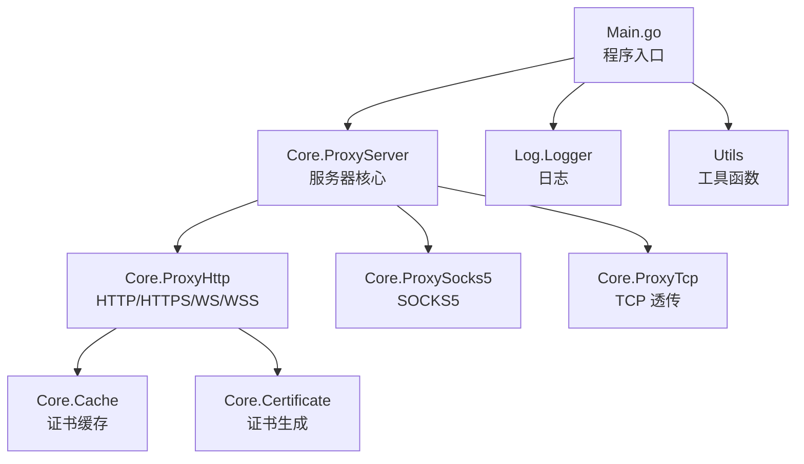
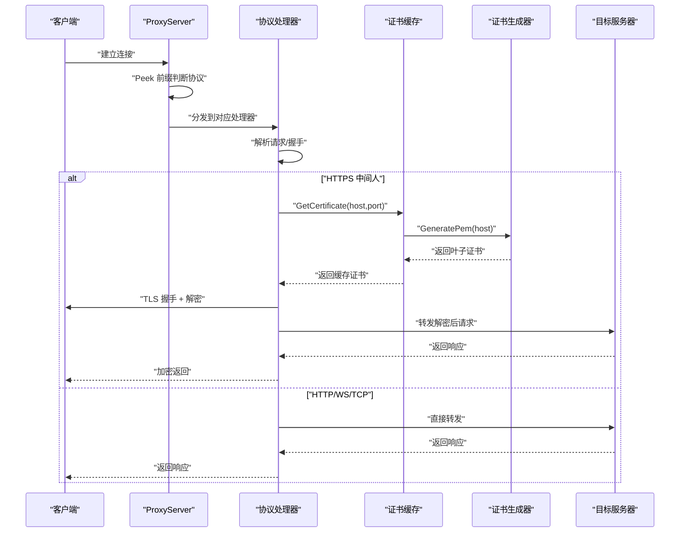
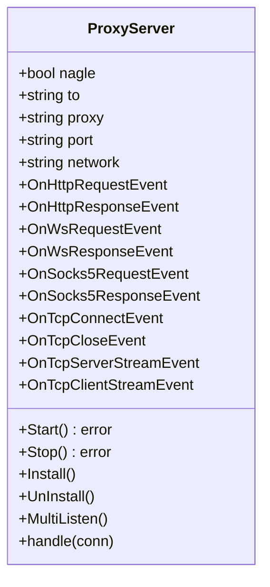
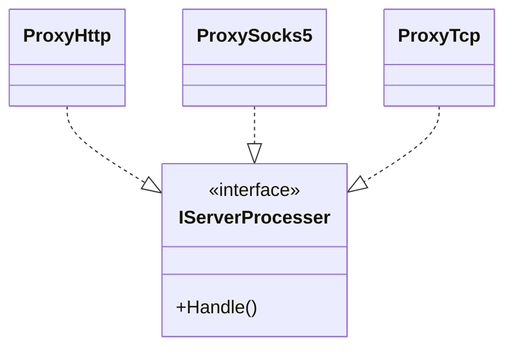
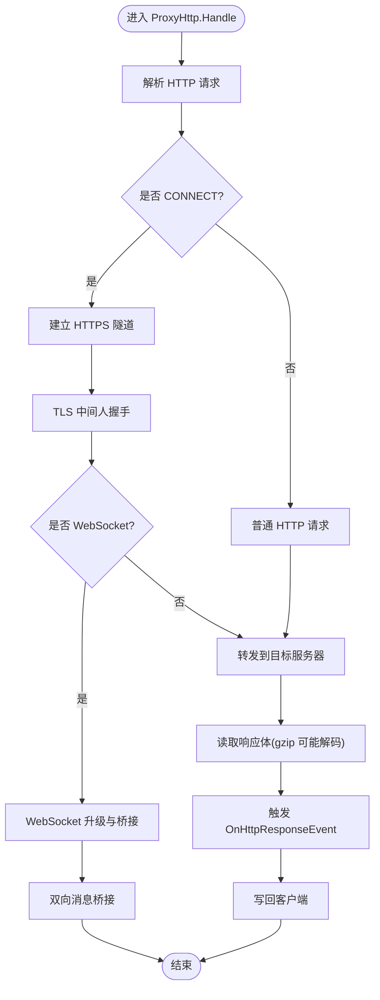
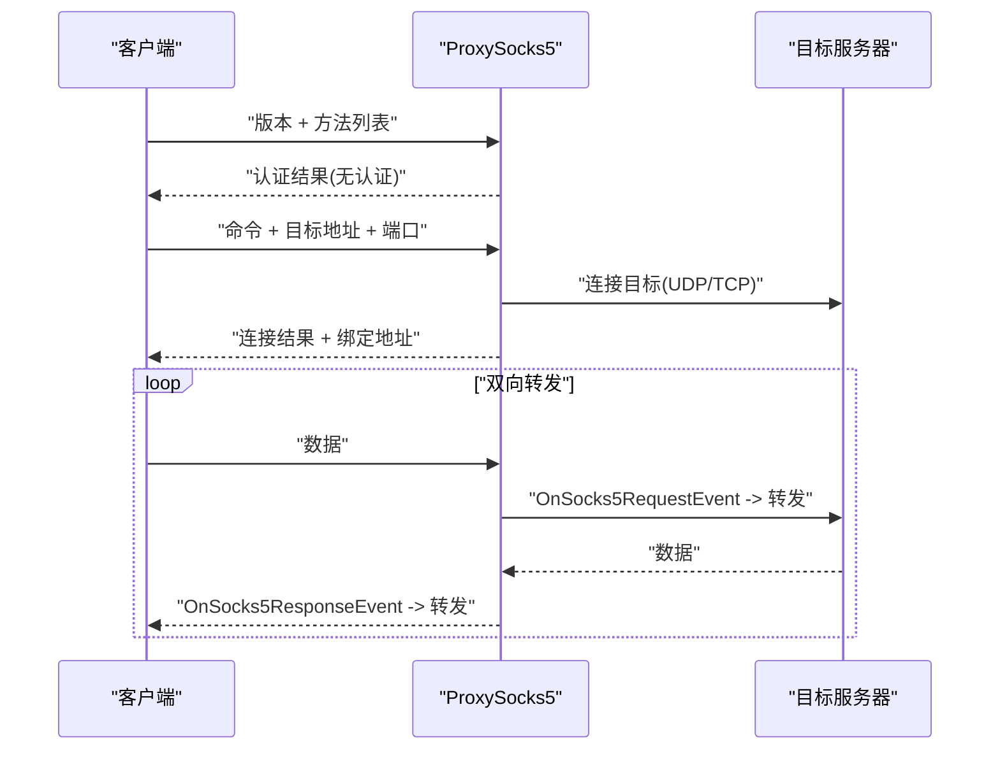
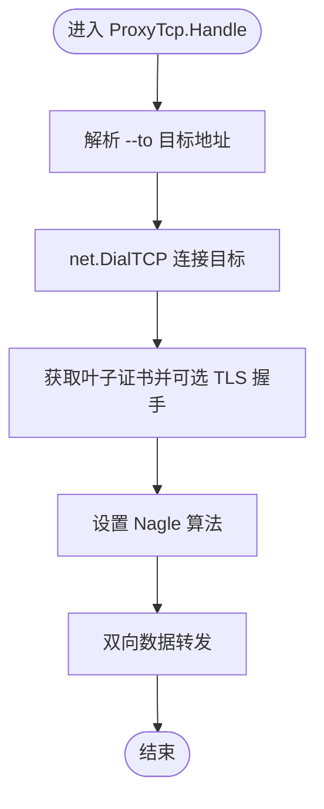
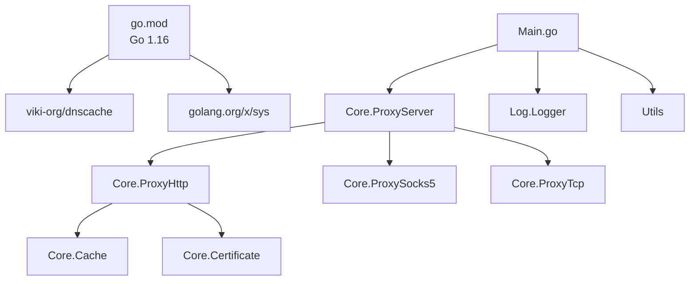

# 项目概述

<cite>
**本文档引用的文件**
- [Main.go](file://Main.go)
- [README.md](file://README.md)
- [README-CN.md](file://README-CN.md)
- [go.mod](file://go.mod)
- [Core/ProxyServer.go](file://Core/ProxyServer.go)
- [Core/ProxyHttp.go](file://Core/ProxyHttp.go)
- [Core/ProxySocks5.go](file://Core/ProxySocks5.go)
- [Core/ProxyTcp.go](file://Core/ProxyTcp.go)
- [Core/Certificate.go](file://Core/Certificate.go)
- [Core/Cache.go](file://Core/Cache.go)
- [Contract/IServerProcesser.go](file://Contract/IServerProcesser.go)
- [Utils/Utils.go](file://Utils/Utils.go)
- [CODE-DOC.md](file://CODE-DOC.md)
</cite>

## 目录
1. [简介](#简介)
2. [项目结构](#项目结构)
3. [核心组件](#核心组件)
4. [架构总览](#架构总览)
5. [详细组件分析](#详细组件分析)
6. [依赖分析](#依赖分析)
7. [性能考量](#性能考量)
8. [故障排查指南](#故障排查指南)
9. [结论](#结论)
10. [附录](#附录)

## 简介
Shermie-Proxy 是一个基于 Go 语言开发的多功能网络代理服务器，旨在提供统一的代理入口，支持 HTTP/HTTPS、WebSocket（WS/WSS）、TCP 透传以及 SOCKS5 协议。其核心设计理念包括：
- 协议自动识别：通过窥探连接首字节自动判断协议类型，无需预先配置端口协议
- 中间人能力：动态生成子证书进行 HTTPS 解密，实现对加密流量的拦截与修改
- 事件驱动与插件化：提供丰富的事件回调，允许在请求/响应各阶段进行拦截与自定义处理
- 跨平台支持：在 Windows 上提供证书安装与系统代理设置；macOS/Linux 平台提供提示信息
- 性能优化：内置 DNS 缓存、多 Accept 并发、Nagle 算法控制等

## 项目结构
项目采用按功能域划分的层次化组织方式，核心模块如下：
- Core：核心代理逻辑（协议处理器、证书管理、缓存、WebSocket 子包）
- Contract：接口契约（协议处理器接口）
- Log：日志模块
- Utils：平台适配与通用工具
- Constant：常量定义（当前为空）
- 根目录：入口程序 Main.go、README 文档、Go 模块定义



图表来源
- [Main.go:1-124](file://Main.go#L1-L124)
- [Core/ProxyServer.go:1-213](file://Core/ProxyServer.go#L1-L213)
- [Core/ProxyHttp.go:1-491](file://Core/ProxyHttp.go#L1-L491)
- [Core/ProxySocks5.go:1-300](file://Core/ProxySocks5.go#L1-L300)
- [Core/ProxyTcp.go:1-112](file://Core/ProxyTcp.go#L1-L112)
- [Core/Cache.go:1-79](file://Core/Cache.go#L1-L79)
- [Core/Certificate.go:1-188](file://Core/Certificate.go#L1-L188)

章节来源
- [CODE-DOC.md:30-79](file://CODE-DOC.md#L30-L79)

## 核心组件
- 服务器核心（ProxyServer）：负责监听端口、接受连接、协议识别与分发、事件回调注册、DNS 缓存、系统代理设置等
- 协议处理器（IServerProcesser 接口）：HTTP/HTTPS/WS/WSS（ProxyHttp）、SOCKS5（ProxySocks5）、TCP 透传（ProxyTcp）
- 证书系统（Certificate + Cache）：根证书生成与持久化、叶子证书动态生成与缓存
- 事件回调系统：在请求/响应各阶段提供可插拔的拦截与修改能力
- 平台适配（Utils）：Windows 证书安装与系统代理设置；通用工具函数（文件检测、端口检测、反射读取 TLS 内部数据）

章节来源
- [Core/ProxyServer.go:48-213](file://Core/ProxyServer.go#L48-L213)
- [Contract/IServerProcesser.go:1-8](file://Contract/IServerProcesser.go#L1-L8)
- [Core/Certificate.go:20-188](file://Core/Certificate.go#L20-L188)
- [Core/Cache.go:20-79](file://Core/Cache.go#L20-L79)
- [Utils/Utils.go:13-62](file://Utils/Utils.go#L13-L62)

## 架构总览
Shermie-Proxy 采用“事件驱动 + 插件化”的架构，核心流程如下：
- 程序启动：初始化日志与根证书，解析 CLI 参数，多端口多网卡启动
- 连接接受：多 goroutine 并发 Accept，每个连接独立 goroutine 处理
- 协议识别：Peek 前缀判断 HTTP 方法、SOCKS5 版本、否则视为 TCP
- 协议处理：根据识别结果交由对应处理器（HTTP/HTTPS/WS/WSS、SOCKS5、TCP 透传）
- 事件回调：在请求/响应各阶段触发回调，允许用户拦截与修改数据
- 证书管理：HTTPS 中间人时动态生成叶子证书并缓存



图表来源
- [Core/ProxyServer.go:176-203](file://Core/ProxyServer.go#L176-L203)
- [Core/ProxyHttp.go:44-64](file://Core/ProxyHttp.go#L44-L64)
- [Core/ProxyHttp.go:206-286](file://Core/ProxyHttp.go#L206-L286)
- [Core/Cache.go:39-79](file://Core/Cache.go#L39-L79)
- [Core/Certificate.go:69-116](file://Core/Certificate.go#L69-L116)

## 详细组件分析

### 服务器核心（ProxyServer）
- 职责：监听端口、并发接受连接、协议识别与分发、事件回调注册、DNS 缓存、系统代理设置
- 关键特性：
  - 多 Accept 并发：启动 5 个 goroutine 并发 Accept，提升高并发下的连接接受能力
  - 协议识别：Peek 前缀匹配 HTTP 方法、SOCKS5 版本、否则视为 TCP
  - DNS 缓存：使用第三方库实现 5 分钟 TTL 的 DNS 缓存
  - 系统代理设置：Windows 平台支持自动安装根证书与设置系统代理（可选）



图表来源
- [Core/ProxyServer.go:48-213](file://Core/ProxyServer.go#L48-L213)

章节来源
- [Core/ProxyServer.go:123-142](file://Core/ProxyServer.go#L123-L142)
- [Core/ProxyServer.go:156-174](file://Core/ProxyServer.go#L156-L174)
- [Core/ProxyServer.go:176-203](file://Core/ProxyServer.go#L176-L203)

### 协议处理器接口（IServerProcesser）
- IServerProcesser 定义了统一的处理入口方法 Handle()，所有协议处理器均实现该接口
- 通过接口实现多态，使服务器核心能够以统一方式调度不同协议处理器



图表来源
- [Contract/IServerProcesser.go:1-8](file://Contract/IServerProcesser.go#L1-L8)
- [Core/ProxyHttp.go:29-37](file://Core/ProxyHttp.go#L29-L37)
- [Core/ProxySocks5.go:15-19](file://Core/ProxySocks5.go#L15-L19)
- [Core/ProxyTcp.go:15-19](file://Core/ProxyTcp.go#L15-L19)

章节来源
- [Contract/IServerProcesser.go:1-8](file://Contract/IServerProcesser.go#L1-L8)

### HTTP/HTTPS/WS/WSS 处理器（ProxyHttp）
- 职责：处理 HTTP 请求、HTTPS CONNECT 隧道、WebSocket 升级与桥接、请求/响应体读取与修改、gzip 自动解码、Hop-by-hop 头清理
- 关键流程：
  - 请求解析：http.ReadRequest
  - HTTPS 隧道：CONNECT 方法 -> 连接目标服务器 -> 返回 200 连接建立 -> TLS 中间人握手
  - WebSocket：检测 Upgrade 头 -> Upgrader.Upgrade -> Dialer.Dial -> 双向桥接
  - 事件回调：OnHttpRequestEvent、OnHttpResponseEvent、OnWsRequestEvent、OnWsResponseEvent
  - 拨号策略：DialContext 使用 DNS 缓存、可选网卡绑定、Nagle 控制



图表来源
- [Core/ProxyHttp.go:44-64](file://Core/ProxyHttp.go#L44-L64)
- [Core/ProxyHttp.go:206-286](file://Core/ProxyHttp.go#L206-L286)
- [Core/ProxyHttp.go:328-434](file://Core/ProxyHttp.go#L328-L434)
- [Core/ProxyHttp.go:436-468](file://Core/ProxyHttp.go#L436-L468)

章节来源
- [Core/ProxyHttp.go:67-132](file://Core/ProxyHttp.go#L67-L132)
- [Core/ProxyHttp.go:134-154](file://Core/ProxyHttp.go#L134-L154)
- [Core/ProxyHttp.go:156-180](file://Core/ProxyHttp.go#L156-L180)
- [Core/ProxyHttp.go:182-203](file://Core/ProxyHttp.go#L182-L203)
- [Core/ProxyHttp.go:205-286](file://Core/ProxyHttp.go#L205-L286)
- [Core/ProxyHttp.go:328-434](file://Core/ProxyHttp.go#L328-L434)
- [Core/ProxyHttp.go:436-468](file://Core/ProxyHttp.go#L436-L468)

### SOCKS5 处理器（ProxySocks5）
- 职责：实现 SOCKS5 握手流程、目标地址解析、UDP/TCP 连接、双向数据转发、事件回调
- 关键流程：
  - 握手：读取版本、方法列表、回复认证结果
  - 请求：读取命令、目标地址（IPv4/IPv6/域名）、端口
  - 连接：根据命令类型连接目标（UDP/TCP），必要时进行 TLS 握手
  - 转发：双向 goroutine 转发数据，支持 OnSocks5RequestEvent/OnSocks5ResponseEvent



图表来源
- [Core/ProxySocks5.go:54-240](file://Core/ProxySocks5.go#L54-L240)
- [Core/ProxySocks5.go:242-284](file://Core/ProxySocks5.go#L242-L284)

章节来源
- [Core/ProxySocks5.go:54-240](file://Core/ProxySocks5.go#L54-L240)
- [Core/ProxySocks5.go:242-284](file://Core/ProxySocks5.go#L242-L284)

### TCP 透传处理器（ProxyTcp）
- 职责：TCP 透传代理，支持通过 --to 指定目标地址，可选 TLS 握手，双向数据转发，事件回调
- 关键流程：
  - 解析 --to 目标地址并连接
  - 获取叶子证书并可选进行 TLS 握手
  - 设置 Nagle 算法
  - 双向 goroutine 转发，支持 OnTcpClientStreamEvent/OnTcpServerStreamEvent



图表来源
- [Core/ProxyTcp.go:23-66](file://Core/ProxyTcp.go#L23-L66)
- [Core/ProxyTcp.go:68-112](file://Core/ProxyTcp.go#L68-L112)

章节来源
- [Core/ProxyTcp.go:23-66](file://Core/ProxyTcp.go#L23-L66)
- [Core/ProxyTcp.go:68-112](file://Core/ProxyTcp.go#L68-L112)

### 证书系统（Certificate + Cache）
- 根证书：首次运行自动生成 RSA 2048 位自签名根证书，保存为 cert.crt/cert.key，有效期约 2 年
- 叶子证书：针对每个 HTTPS 目标动态生成以目标域名为 CN 的子证书，支持 IP/DNS SAN
- 证书缓存：并发安全的缓存存储，同一域名仅生成一次，后续请求复用，避免重复开销

```mermaid
classDiagram
class Certificate {
+Init() error
+GenerateRootPemFile(host) (*pem.Block,*pem.Block,error)
+GeneratePem(host) ([]byte,[]byte,error)
+GenerateKeyPair() (*rsa.PrivateKey,error)
}
class Storage {
+GetCertificate(hostname,port) (interface{},error)
}
Certificate --> Storage : "生成叶子证书"
```

图表来源
- [Core/Certificate.go:20-188](file://Core/Certificate.go#L20-L188)
- [Core/Cache.go:20-79](file://Core/Cache.go#L20-L79)

章节来源
- [Core/Certificate.go:34-67](file://Core/Certificate.go#L34-L67)
- [Core/Certificate.go:69-116](file://Core/Certificate.go#L69-L116)
- [Core/Certificate.go:118-178](file://Core/Certificate.go#L118-L178)
- [Core/Cache.go:39-79](file://Core/Cache.go#L39-L79)

### 事件回调系统
- 回调类型覆盖：HTTP 请求/响应、WebSocket 请求/响应、SOCKS5 请求/响应、TCP 连接/关闭、TCP 双向流
- Resolve 函数：允许在回调中修改数据并继续默认处理，或完全自定义处理
- 使用模式：在主程序中注册回调，处理流程中触发回调，实现插件化扩展

章节来源
- [Core/ProxyServer.go:22-34](file://Core/ProxyServer.go#L22-L34)
- [Main.go:61-120](file://Main.go#L61-L120)

## 依赖分析
- Go 运行时：1.16+
- 第三方依赖：
  - viki-org/dnscache：DNS 缓存
  - golang.org/x/sys：Windows 系统调用（证书安装、代理设置）
- 内部模块：
  - Core：协议处理、证书管理、缓存
  - Contract：接口定义
  - Log：日志
  - Utils：平台适配与通用工具



图表来源
- [go.mod:1-9](file://go.mod#L1-L9)
- [Main.go:1-124](file://Main.go#L1-L124)
- [Core/ProxyServer.go:1-213](file://Core/ProxyServer.go#L1-L213)

章节来源
- [go.mod:1-9](file://go.mod#L1-L9)

## 性能考量
- 多 Accept 并发：服务器启动 5 个 goroutine 并发接受连接，缓解高并发下的 Accept 瓶颈
- DNS 缓存：5 分钟 TTL 的 DNS 缓存减少重复解析开销，提升解析性能
- Nagle 算法控制：通过 --nagle 控制是否启用 Nagle（默认启用，实际底层调用 SetNoDelay(true)，即低延迟模式）
- 证书缓存：并发安全的证书缓存，同一域名仅生成一次，避免重复的 RSA 密钥生成开销
- 事件回调：在回调中可直接修改数据并继续默认处理，减少额外拷贝与转换

章节来源
- [Core/ProxyServer.go:156-174](file://Core/ProxyServer.go#L156-L174)
- [Core/ProxyHttp.go:436-468](file://Core/ProxyHttp.go#L436-L468)
- [Core/Cache.go:39-79](file://Core/Cache.go#L39-L79)

## 故障排查指南
- 端口问题：确保 --port 非 0，且与 --network 数量一致；可使用 Utils 的端口检测工具辅助排查
- 证书问题：首次运行会生成根证书与私钥；若浏览器无法信任，可在 Windows 平台安装根证书或通过 /tls 路径下载证书
- HTTPS 中间人：若 TLS 握手失败，可通过反射读取 TLS 内部原始数据进行诊断
- 平台适配：Windows 支持自动安装证书与系统代理设置；macOS/Linux 平台需手动安装证书与设置代理
- 事件回调：若回调未生效，请确认回调注册位置与触发时机；注意回调返回值语义（如 HTTP 请求回调返回 false 可跳过转发）

章节来源
- [Main.go:30-45](file://Main.go#L30-L45)
- [Core/ProxyHttp.go:80-94](file://Core/ProxyHttp.go#L80-L94)
- [Utils/Utils.go:24-31](file://Utils/Utils.go#L24-L31)
- [README-CN.md:145-158](file://README-CN.md#L145-L158)

## 结论
Shermie-Proxy 通过“协议自动识别 + 事件驱动 + 插件化”的设计，实现了统一的多协议代理入口，并提供了强大的中间人能力与可观测性。其在性能方面通过 DNS 缓存、多 Accept 并发、证书缓存与 Nagle 控制等手段进行了优化；在可扩展性方面，丰富的事件回调使得用户能够在请求/响应各阶段进行拦截与修改。结合平台适配与清晰的模块划分，该项目适合在开发调试、测试环境与教学场景中广泛应用。

## 附录
- 技术栈与版本要求：Go 1.16，依赖 viki-org/dnscache 与 golang.org/x/sys
- CLI 参数：--port、--nagle、--proxy、--to、--network
- 平台支持：Windows（证书安装与系统代理设置）、macOS/Linux（提示信息）

章节来源
- [README.md:18-30](file://README.md#L18-L30)
- [README-CN.md:18-29](file://README-CN.md#L18-L29)
- [README.md:148-163](file://README.md#L148-L163)
- [README-CN.md:145-158](file://README-CN.md#L145-L158)