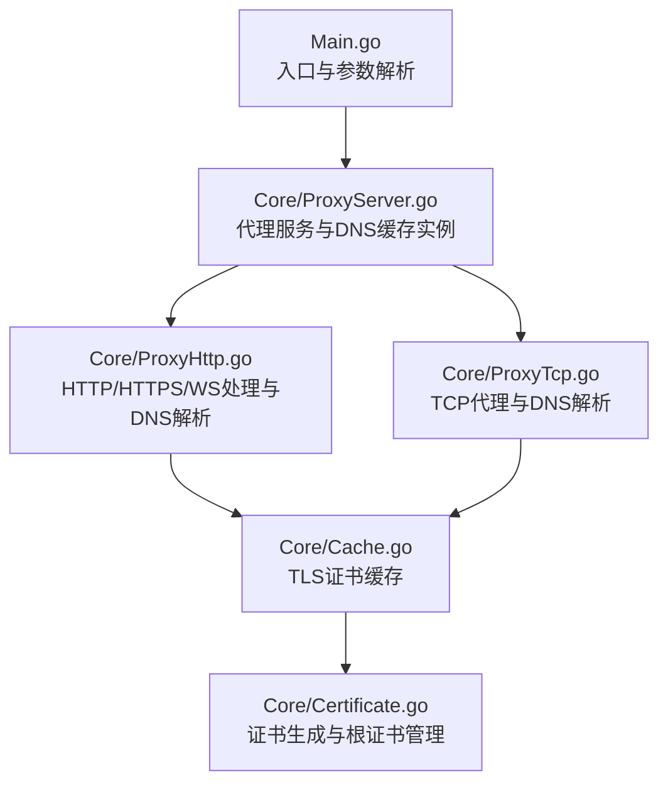
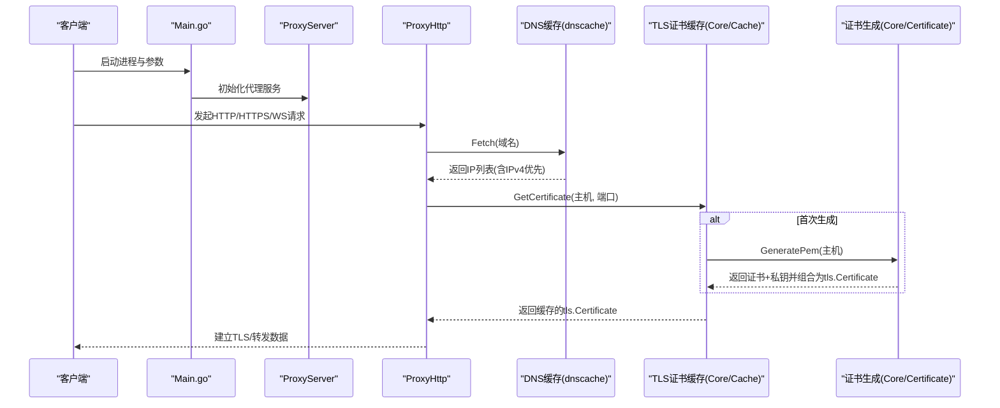
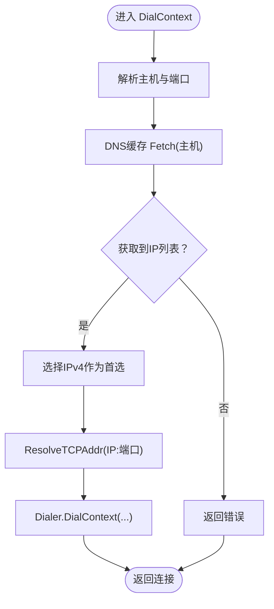
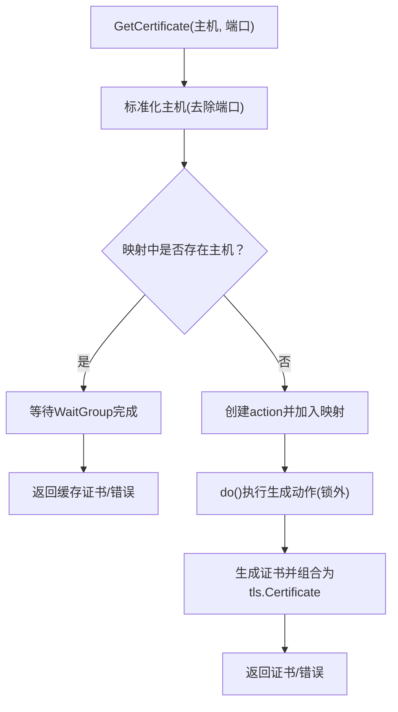
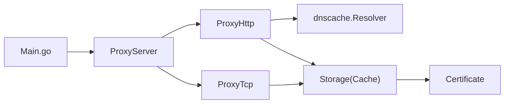

# DNS 缓存优化

<cite>
**本文引用的文件**
- [Main.go](file://Main.go)
- [README.md](file://README.md)
- [README-CN.md](file://README-CN.md)
- [go.mod](file://go.mod)
- [go.sum](file://go.sum)
- [Core/ProxyServer.go](file://Core/ProxyServer.go)
- [Core/ProxyHttp.go](file://Core/ProxyHttp.go)
- [Core/ProxyTcp.go](file://Core/ProxyTcp.go)
- [Core/Cache.go](file://Core/Cache.go)
- [Core/Cache_test.go](file://Core/Cache_test.go)
- [Core/Certificate.go](file://Core/Certificate.go)
- [Core/Websocket/ClientCloneLegacy.go](file://Core/Websocket/ClientCloneLegacy.go)
</cite>

## 目录
1. [简介](#简介)
2. [项目结构](#项目结构)
3. [核心组件](#核心组件)
4. [架构总览](#架构总览)
5. [组件详解](#组件详解)
6. [依赖关系分析](#依赖关系分析)
7. [性能考量](#性能考量)
8. [故障排除指南](#故障排除指南)
9. [结论](#结论)
10. [附录](#附录)

## 简介
本文件聚焦于 shermie-proxy 的 DNS 缓存优化能力与 TLS 证书缓存机制，解释其在代理链路中如何降低域名解析与证书生成的延迟，提升整体响应速度。项目通过引入第三方 DNS 缓存库实现域名解析结果的短期缓存；同时，TLS 证书生成采用按主机名的并发去重与缓存策略，避免重复生成，显著降低 CPU 与 I/O 开销。

## 项目结构
- 入口程序负责初始化日志、根证书与监听端口，启动多路监听与事件回调注册。
- 核心代理模块根据入站流量类型（HTTP/HTTPS/WS/SOCKS5/TCP）选择处理路径。
- DNS 缓存由独立的 Resolver 实例提供，贯穿 HTTP/TCP 等多协议的上游连接建立阶段。
- TLS 证书缓存通过内存存储按主机名缓存已生成的证书，支持并发安全的复用。



图表来源
- [Main.go:24-46](file://Main.go#L24-L46)
- [Core/ProxyServer.go:68-77](file://Core/ProxyServer.go#L68-L77)
- [Core/ProxyHttp.go:436-468](file://Core/ProxyHttp.go#L436-L468)
- [Core/ProxyTcp.go:23-66](file://Core/ProxyTcp.go#L23-L66)
- [Core/Cache.go:39-64](file://Core/Cache.go#L39-L64)
- [Core/Certificate.go:35-67](file://Core/Certificate.go#L35-L67)

章节来源
- [Main.go:24-46](file://Main.go#L24-L46)
- [README.md:148-163](file://README.md#L148-L163)
- [README-CN.md:145-158](file://README-CN.md#L145-L158)

## 核心组件
- DNS 缓存（Resolver）
  - 在代理服务初始化时创建，用于缓存域名解析结果，默认 TTL 为 5 分钟。
  - 在 HTTP/TCP 的 DialContext 中调用 Fetch 获取 IP 列表，优先选择 IPv4，随后进行 TCP 连接。
- TLS 证书缓存（Storage）
  - 以主机名为键，缓存已生成的 tls.Certificate。
  - 对同一主机名的并发请求进行去重：首个请求生成证书，其他请求等待完成。
  - 证书生成来自根证书，按主机名生成子证书并组合为 tls.Certificate。
- 证书生成（Certificate）
  - 提供根证书初始化与子证书生成逻辑，包含序列号、有效期、用途等字段。
  - 支持从文件加载根证书或自动生成并落盘。

章节来源
- [Core/ProxyServer.go:68-77](file://Core/ProxyServer.go#L68-L77)
- [Core/ProxyHttp.go:436-468](file://Core/ProxyHttp.go#L436-L468)
- [Core/Cache.go:39-64](file://Core/Cache.go#L39-L64)
- [Core/Certificate.go:35-67](file://Core/Certificate.go#L35-L67)

## 架构总览
下图展示了从入口到代理处理、DNS 解析与 TLS 证书缓存的关键交互：



图表来源
- [Main.go:24-46](file://Main.go#L24-L46)
- [Core/ProxyServer.go:68-77](file://Core/ProxyServer.go#L68-L77)
- [Core/ProxyHttp.go:436-468](file://Core/ProxyHttp.go#L436-L468)
- [Core/Cache.go:39-64](file://Core/Cache.go#L39-L64)
- [Core/Certificate.go:69-116](file://Core/Certificate.go#L69-L116)

## 组件详解

### DNS 缓存（Resolver）
- 初始化与配置
  - 在代理服务构造函数中创建 Resolver，并设置默认 TTL 为 5 分钟。
- 解析流程
  - 在 DialContext 中，先从 DNS 缓存获取 IP 列表，优先选择非 IPv6 地址，再解析 TCP 地址并建立连接。
  - 支持通过命令行参数指定本地网卡绑定，以及可选的上游代理。
- 缓存策略
  - 基于 dnscache 库的缓存，自动处理过期与刷新，无需手动淘汰。
  - 通过 Fetch 接口直接返回可用 IP，简化上层逻辑。



图表来源
- [Core/ProxyServer.go:68-77](file://Core/ProxyServer.go#L68-L77)
- [Core/ProxyHttp.go:436-468](file://Core/ProxyHttp.go#L436-L468)

章节来源
- [Core/ProxyServer.go:68-77](file://Core/ProxyServer.go#L68-L77)
- [Core/ProxyHttp.go:436-468](file://Core/ProxyHttp.go#L436-L468)

### TLS 证书缓存（Storage）
- 并发去重
  - 同一主机名的并发请求仅允许一个生成动作，其余请求通过 WaitGroup 等待完成。
  - 不同主机名的请求在锁内串行创建动作对象，但实际生成在锁外并行执行，减少阻塞。
- 缓存与复用
  - 生成后的证书以主机名为键缓存，后续请求直接返回，避免重复生成。
  - 证书生命周期与进程一致，未实现主动淘汰，适合长期运行的服务场景。
- 错误处理
  - 若证书生成失败，错误会传播至调用方，便于上层记录与降级处理。



图表来源
- [Core/Cache.go:39-64](file://Core/Cache.go#L39-L64)

章节来源
- [Core/Cache.go:39-64](file://Core/Cache.go#L39-L64)
- [Core/Cache_test.go:24-114](file://Core/Cache_test.go#L24-L114)

### 证书生成（Certificate）
- 根证书初始化
  - 支持从文件加载或自动生成根证书与私钥，并持久化到本地文件。
- 子证书生成
  - 以根证书为 Issuer，为目标主机生成带有随机序列号、有效期与用途的子证书。
  - 支持主机名或 IP 场景，分别填充 DNSNames 或 IPAddresses 字段。
- 与 TLS 缓存协作
  - 生成的证书经由 tls.X509KeyPair 组合为 tls.Certificate，供缓存复用。

```mermaid
classDiagram
class Certificate {
+Init() error
+GeneratePem(host) (cert, key, error)
+GenerateRootPemFile(host) (cert, key, error)
+GenerateKeyPair() (*rsa.PrivateKey, error)
}
class Storage {
+GetCertificate(hostname, port) (interface{}, error)
}
class Cache {
+GetCertificate(hostname, port) (interface{}, error)
}
Storage --> Certificate : "生成子证书"
Cache --> Storage : "封装缓存"
```

图表来源
- [Core/Certificate.go:35-67](file://Core/Certificate.go#L35-L67)
- [Core/Cache.go:39-64](file://Core/Cache.go#L39-L64)

章节来源
- [Core/Certificate.go:35-67](file://Core/Certificate.go#L35-L67)
- [Core/Certificate.go:69-116](file://Core/Certificate.go#L69-L116)

### 协议处理中的 DNS 与证书使用
- HTTP/HTTPS/WS
  - 在 SslReceiveSend 阶段调用 TLS 证书缓存，随后建立 TLS 握手并继续业务处理。
  - DialContext 中通过 DNS 缓存解析目标主机 IP，确保连接建立前的解析命中缓存。
- TCP
  - 在 Handle 中对远端主机进行证书缓存查询，若握手成功则替换连接为 TLS 通道。

章节来源
- [Core/ProxyHttp.go:243-286](file://Core/ProxyHttp.go#L243-L286)
- [Core/ProxyHttp.go:436-468](file://Core/ProxyHttp.go#L436-L468)
- [Core/ProxyTcp.go:23-66](file://Core/ProxyTcp.go#L23-L66)

## 依赖关系分析
- 外部依赖
  - dnscache：提供 DNS 查询与缓存能力，代理在 DialContext 中使用 Fetch 获取 IP。
  - golang.org/x/sys：系统相关工具，与当前 DNS/证书缓存无直接耦合。
- 内部依赖
  - Main 负责初始化日志与根证书，随后启动代理服务。
  - ProxyServer 持有 dnscache.Resolver 实例，供各协议处理模块共享。
  - ProxyHttp/ProxyTcp 在连接建立阶段分别使用 DNS 缓存与 TLS 证书缓存。
  - Cache 与 Certificate 形成证书生成与缓存闭环。



图表来源
- [Main.go:13-22](file://Main.go#L13-L22)
- [Core/ProxyServer.go:68-77](file://Core/ProxyServer.go#L68-L77)
- [Core/ProxyHttp.go:436-468](file://Core/ProxyHttp.go#L436-L468)
- [Core/ProxyTcp.go:23-66](file://Core/ProxyTcp.go#L23-L66)
- [Core/Cache.go:39-64](file://Core/Cache.go#L39-L64)
- [Core/Certificate.go:35-67](file://Core/Certificate.go#L35-L67)

章节来源
- [go.mod:5-8](file://go.mod#L5-L8)
- [go.sum:1-3](file://go.sum#L1-L3)
- [Main.go:13-22](file://Main.go#L13-L22)

## 性能考量
- DNS 缓存
  - 默认 TTL 5 分钟，平衡了准确性与性能。对于频繁访问的域名，可显著减少系统解析与网络往返。
  - Fetch 返回 IP 列表后优先选择 IPv4，有助于规避 IPv6 环境下的兼容性问题与潜在延迟。
- TLS 证书缓存
  - 并发去重避免重复生成，减少 CPU 与证书签名开销。
  - 证书复用减少握手前的证书生成与组合时间，尤其在高并发 HTTPS/WS 场景收益明显。
- 连接与网络
  - DialContext 中的 Dialer 支持超时、保活与网卡绑定，有助于稳定连接质量。
  - Nagle 算法开关可通过命令行参数控制，按需权衡吞吐与延迟。

章节来源
- [Core/ProxyServer.go:68-77](file://Core/ProxyServer.go#L68-L77)
- [Core/ProxyHttp.go:436-468](file://Core/ProxyHttp.go#L436-L468)
- [README.md:148-163](file://README.md#L148-L163)
- [README-CN.md:145-158](file://README-CN.md#L145-L158)

## 故障排除指南
- DNS 解析失败
  - 确认 DNS 缓存是否过期或未命中，检查 Fetch 返回的 IP 列表是否为空。
  - 如需绕过缓存验证，可临时缩短 TTL 或更换上游 DNS。
- TLS 证书生成异常
  - 检查根证书初始化是否成功，确认根证书与私钥文件存在且可读。
  - 若并发过高导致生成阻塞，观察 WaitGroup 等待是否过久，必要时调整并发策略。
- 连接不稳定
  - 检查 Dialer 超时与保活设置，确认网络接口绑定正确。
  - 关闭/开启 Nagle 算法以测试对延迟的影响。
- 日志定位
  - 使用入口日志初始化与事件回调日志，结合具体协议处理日志定位问题。

章节来源
- [Core/ProxyHttp.go:436-468](file://Core/ProxyHttp.go#L436-L468)
- [Core/ProxyTcp.go:23-66](file://Core/ProxyTcp.go#L23-L66)
- [Core/Cache.go:39-64](file://Core/Cache.go#L39-L64)
- [Core/Certificate.go:35-67](file://Core/Certificate.go#L35-L67)
- [Main.go:13-22](file://Main.go#L13-L22)

## 结论
sheremie-proxy 的 DNS 缓存与 TLS 证书缓存共同构成了高效的代理链路加速机制。前者通过短期缓存减少解析延迟，后者通过并发去重与复用降低证书生成成本。二者配合在高并发与低延迟场景下能取得显著的性能提升。建议在生产环境中结合业务特征合理设置 DNS TTL 与并发策略，并持续关注证书生命周期与系统资源占用。

## 附录

### 配置项与参数说明
- 代理服务监听端口
  - 参数：--port
  - 类型：字符串
  - 作用：指定代理服务监听端口，默认 9090
- 上级代理
  - 参数：--proxy
  - 类型：字符串
  - 作用：设置一级 TCP 代理地址
- 目标 TCP 服务器
  - 参数：--to
  - 类型：字符串
  - 作用：当启用 TCP 代理时，指定目标服务器的 IP 和端口
- Nagle 算法
  - 参数：--nagle
  - 类型：布尔
  - 作用：是否启用 Nagle 数据合并算法，默认 true

章节来源
- [README.md:148-163](file://README.md#L148-L163)
- [README-CN.md:145-158](file://README-CN.md#L145-L158)

### DNS 缓存配置与行为
- TTL 设置
  - 默认：5 分钟
  - 说明：Resolver 初始化时设置，影响 Fetch 的缓存有效期
- 解析策略
  - 优先返回 IPv4 地址，随后进行 TCP 连接
  - 支持指定本地网卡绑定与上游代理

章节来源
- [Core/ProxyServer.go:68-77](file://Core/ProxyServer.go#L68-L77)
- [Core/ProxyHttp.go:436-468](file://Core/ProxyHttp.go#L436-L468)

### TLS 证书缓存配置与行为
- 缓存策略
  - 按主机名缓存，进程内复用
  - 并发去重：同一主机名并发仅生成一次
- 证书生成
  - 以根证书为 Issuer，为目标主机生成子证书
  - 支持主机名与 IP 两种场景

章节来源
- [Core/Cache.go:39-64](file://Core/Cache.go#L39-L64)
- [Core/Certificate.go:69-116](file://Core/Certificate.go#L69-L116)