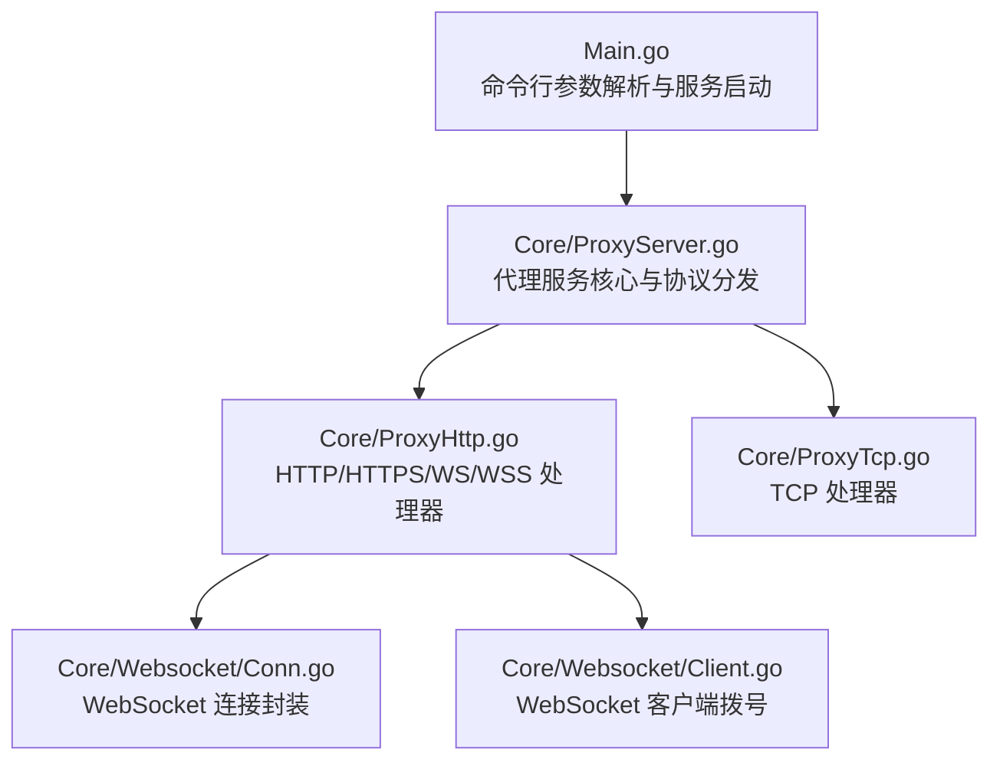
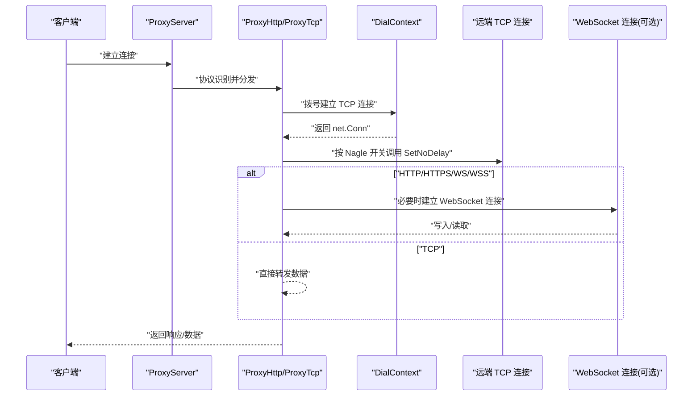
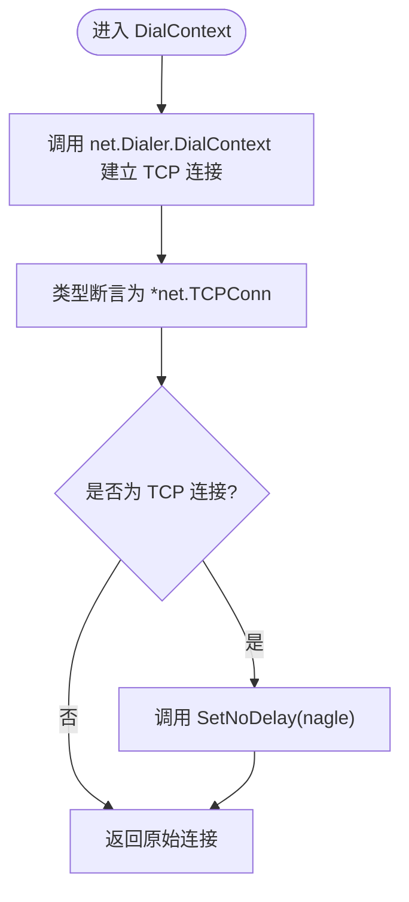
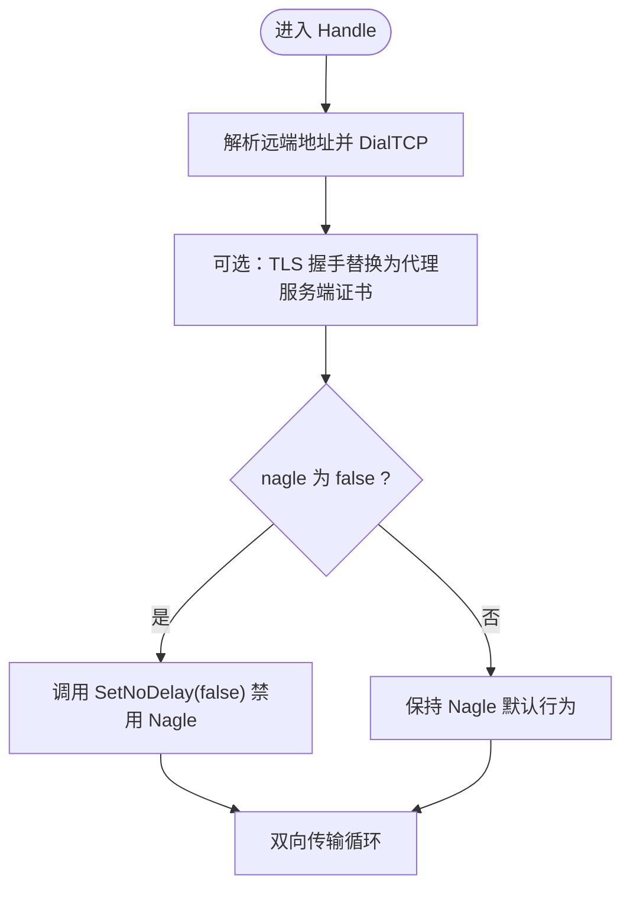
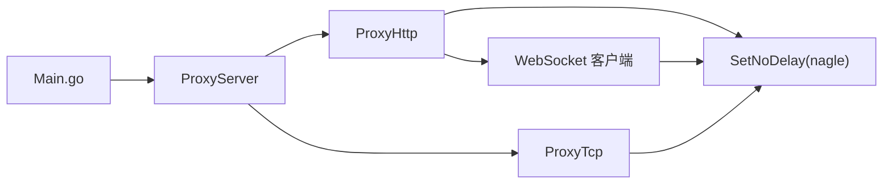

# Nagle 算法控制

<cite>
**本文引用的文件列表**
- [Main.go](file://Main.go)
- [README.md](file://README.md)
- [Core/ProxyServer.go](file://Core/ProxyServer.go)
- [Core/ProxyHttp.go](file://Core/ProxyHttp.go)
- [Core/ProxyTcp.go](file://Core/ProxyTcp.go)
- [Core/ConnPeer.go](file://Core/ConnPeer.go)
- [Core/Websocket/Conn.go](file://Core/Websocket/Conn.go)
- [Core/Websocket/Client.go](file://Core/Websocket/Client.go)
</cite>

## 目录
1. [简介](#简介)
2. [项目结构](#项目结构)
3. [核心组件](#核心组件)
4. [架构总览](#架构总览)
5. [详细组件分析](#详细组件分析)
6. [依赖关系分析](#依赖关系分析)
7. [性能考量](#性能考量)
8. [故障排查指南](#故障排查指南)
9. [结论](#结论)
10. [附录](#附录)

## 简介
本文件围绕 shermie-proxy 中的 Nagle 算法控制展开，系统性阐述 Nagle 算法在 TCP 通信中的作用与影响，并详细说明项目如何通过命令行参数与内部配置实现 Nagle 的启用与禁用。文档覆盖 Nagle 对延迟与吞吐量的影响、在代理场景下的权衡、适用与不适用场景（如实时通信、大数据传输）、配置方法、性能测试建议，以及对 WebSocket、HTTP 等协议的具体影响。

## 项目结构
sheremie-proxy 是一个支持 HTTP/HTTPS/WS/WSS/TCP/SOCKS5 的多协议代理服务，核心入口负责解析命令行参数、启动监听、识别协议并分发到对应处理器；HTTP/WS/TCP 等协议在建立远端连接时会根据全局开关决定是否应用 Nagle 算法。

图表来源
- [Main.go:24-124](file://Main.go#L24-L124)
- [Core/ProxyServer.go:176-203](file://Core/ProxyServer.go#L176-L203)
- [Core/ProxyHttp.go:436-468](file://Core/ProxyHttp.go#L436-L468)
- [Core/ProxyTcp.go:23-66](file://Core/ProxyTcp.go#L23-L66)
- [Core/Websocket/Conn.go:240-323](file://Core/Websocket/Conn.go#L240-L323)
- [Core/Websocket/Client.go:104-107](file://Core/Websocket/Client.go#L104-L107)

章节来源
- [Main.go:24-124](file://Main.go#L24-L124)
- [Core/ProxyServer.go:176-203](file://Core/ProxyServer.go#L176-L203)

## 核心组件
- 命令行参数与全局开关
  - 通过命令行参数控制 Nagle 开关，传递给代理服务实例，作为后续连接建立时的决策依据。
- 代理服务核心
  - 负责监听、协议识别、分发到具体处理器，并持有 Nagle 开关。
- HTTP/HTTPS/WS/WSS 处理器
  - 在建立远端 TCP 连接时，通过 DialContext 获取连接后，按 Nagle 开关调用 SetNoDelay。
- TCP 处理器
  - 建立远端 TCP 连接后，直接按 Nagle 开关调用 SetNoDelay。
- WebSocket 连接封装
  - 底层基于 net.Conn，其写入行为受上层 Nagle 控制影响。

章节来源
- [Main.go:25-30](file://Main.go#L25-L30)
- [Core/ProxyServer.go:48-77](file://Core/ProxyServer.go#L48-L77)
- [Core/ProxyHttp.go:436-468](file://Core/ProxyHttp.go#L436-L468)
- [Core/ProxyTcp.go:58-60](file://Core/ProxyTcp.go#L58-L60)
- [Core/Websocket/Conn.go:240-323](file://Core/Websocket/Conn.go#L240-L323)

## 架构总览
下图展示 Nagle 控制在代理链路中的位置与影响路径。

图表来源
- [Core/ProxyServer.go:176-203](file://Core/ProxyServer.go#L176-L203)
- [Core/ProxyHttp.go:436-468](file://Core/ProxyHttp.go#L436-L468)
- [Core/ProxyTcp.go:58-60](file://Core/ProxyTcp.go#L58-L60)
- [Core/Websocket/Client.go:104-107](file://Core/Websocket/Client.go#L104-L107)

## 详细组件分析

### 命令行参数与全局开关
- 参数定义
  - --nagle：布尔值，默认启用 Nagle 算法。
- 传递与使用
  - 入口函数解析参数后，将其传入代理服务构造函数，随后在各协议处理器中用于决定是否调用 SetNoDelay。

章节来源
- [Main.go:25-30](file://Main.go#L25-L30)
- [README.md:148-163](file://README.md#L148-L163)

### 代理服务核心（ProxyServer）
- 结构与职责
  - 维护 Nagle 开关、监听端口、DNS 缓存、网络接口等；负责协议识别与分发。
- 关键字段
  - nagle：全局 Nagle 开关。
  - dns：DNS 解析缓存。
  - network：本地绑定网卡。
- 协议分发
  - 根据首字节识别 HTTP 方法、SOCKS5 或 TCP 流。

章节来源
- [Core/ProxyServer.go:48-77](file://Core/ProxyServer.go#L48-L77)
- [Core/ProxyServer.go:176-203](file://Core/ProxyServer.go#L176-L203)

### HTTP/HTTPS/WS/WSS 处理器（ProxyHttp）
- 远端连接建立
  - 使用 DialContext 创建 TCP 连接，随后根据 Nagle 开关调用 SetNoDelay。
- WebSocket 协议
  - 在握手阶段通过 Dialer 建立底层 TCP 连接，再包装为 WebSocket 连接对象，写入行为受底层 Nagle 影响。

图表来源
- [Core/ProxyHttp.go:436-468](file://Core/ProxyHttp.go#L436-L468)

章节来源
- [Core/ProxyHttp.go:436-468](file://Core/ProxyHttp.go#L436-L468)
- [Core/Websocket/Client.go:104-107](file://Core/Websocket/Client.go#L104-L107)

### TCP 处理器（ProxyTcp）
- 远端连接建立
  - 直接使用 net.DialTCP 建立 TCP 连接。
- Nagle 控制
  - 当 nagle 为 false 时，显式调用 SetNoDelay(false)，即禁用 Nagle。

图表来源
- [Core/ProxyTcp.go:23-66](file://Core/ProxyTcp.go#L23-L66)

章节来源
- [Core/ProxyTcp.go:58-60](file://Core/ProxyTcp.go#L58-L60)

### WebSocket 连接封装（Websocket.Conn）
- 写入路径
  - WriteMessage/NextWriter 等写入方法最终通过底层 net.Conn 发送帧，写入时机受 Nagle 控制。
- 读取路径
  - 读取帧头与负载，解析消息边界，受网络层缓冲策略影响。

章节来源
- [Core/Websocket/Conn.go:240-323](file://Core/Websocket/Conn.go#L240-L323)
- [Core/Websocket/Conn.go:751-774](file://Core/Websocket/Conn.go#L751-L774)

## 依赖关系分析
- 全局依赖
  - Main.go 依赖 Core/ProxyServer 构造代理服务并传入 nagle 开关。
  - ProxyServer 依赖各协议处理器进行业务处理。
  - ProxyHttp/ProxyTcp 在建立远端连接时依赖 net.Dialer/NetDialContext 并调用 SetNoDelay。
  - WebSocket 客户端在握手阶段同样通过 DialContext 获取底层连接并受 Nagle 影响。

图表来源
- [Main.go:24-124](file://Main.go#L24-L124)
- [Core/ProxyServer.go:176-203](file://Core/ProxyServer.go#L176-L203)
- [Core/ProxyHttp.go:436-468](file://Core/ProxyHttp.go#L436-L468)
- [Core/ProxyTcp.go:58-60](file://Core/ProxyTcp.go#L58-L60)
- [Core/Websocket/Client.go:104-107](file://Core/Websocket/Client.go#L104-L107)

章节来源
- [Main.go:24-124](file://Main.go#L24-L124)
- [Core/ProxyServer.go:176-203](file://Core/ProxyServer.go#L176-L203)
- [Core/ProxyHttp.go:436-468](file://Core/ProxyHttp.go#L436-L468)
- [Core/ProxyTcp.go:58-60](file://Core/ProxyTcp.go#L58-L60)
- [Core/Websocket/Client.go:104-107](file://Core/Websocket/Client.go#L104-L107)

## 性能考量
- Nagle 算法的作用
  - 将小包合并，减少网络分片与报文开销，提升吞吐量；但可能增加首包延迟。
- 对延迟与吞吐量的影响
  - 启用 Nagle：适合大块数据传输，降低网络碎片，提高带宽利用率。
  - 禁用 Nagle：适合低延迟交互（如实时通信），减少等待时间，但可能降低吞吐量。
- 代理场景下的权衡
  - 高并发短连接：禁用 Nagle 更有利于快速响应。
  - 批量下载/上传：启用 Nagle 更有利于网络效率。
- WebSocket 场景
  - WebSocket 写入最终落到底层 TCP，Nagle 控制直接影响消息发送节奏与延迟。
- HTTP/HTTPS 场景
  - 请求/响应的发送节奏受 Nagle 影响，尤其在高频小包场景下差异明显。

[本节为通用性能讨论，无需特定文件来源]

## 故障排查指南
- Nagle 导致的高延迟
  - 现象：实时交互（如聊天、游戏）出现明显卡顿。
  - 排查：确认 --nagle=false 是否正确传入；检查代理链路中是否多次设置 Nagle。
- 吞吐量不足
  - 现象：大文件传输速度慢。
  - 排查：确认 --nagle=true 是否符合预期；检查网络设备与中间链路的 MTU/拥塞控制。
- WebSocket 写入异常
  - 现象：消息发送阻塞或超时。
  - 排查：确认底层 TCP 连接是否被正确设置 Nagle；检查 WebSocket 写入缓冲与压缩策略。
- TCP 代理异常
  - 现象：连接不稳定或数据丢失。
  - 排查：确认 ProxyTcp 中 SetNoDelay 的调用时机与参数；检查 TLS 握手与证书替换逻辑。

章节来源
- [Core/ProxyTcp.go:58-60](file://Core/ProxyTcp.go#L58-L60)
- [Core/ProxyHttp.go:436-468](file://Core/ProxyHttp.go#L436-L468)
- [Core/Websocket/Conn.go:240-323](file://Core/Websocket/Conn.go#L240-L323)

## 结论
sheremie-proxy 通过命令行参数统一控制 Nagle 算法，并在 HTTP/HTTPS/WS/WSS 与 TCP 代理路径中分别应用。对于实时性敏感的应用，建议禁用 Nagle；对于吞吐量优先的场景，建议启用 Nagle。实际部署中应结合业务特征与网络环境进行测试与调优。

[本节为总结性内容，无需特定文件来源]

## 附录

### 配置方法
- 启用 Nagle（默认）
  - 使用 --nagle=true 或省略该参数。
- 禁用 Nagle
  - 使用 --nagle=false。
- 示例
  - 启动命令示例：go run Main.go --port 9090 --nagle=false

章节来源
- [Main.go:25-30](file://Main.go#L25-L30)
- [README.md:148-163](file://README.md#L148-L163)

### 适用与不适用场景
- 适用场景
  - 实时通信（如 WebSocket 聊天、在线游戏、视频通话）：禁用 Nagle。
  - 低延迟要求的 API 交互：禁用 Nagle。
- 不适用场景
  - 大文件下载/上传：启用 Nagle。
  - 批量数据传输：启用 Nagle。
- 注意
  - 不同协议（HTTP/WS/TCP）的 Nagle 行为由同一开关控制，需统一评估。

[本节为通用场景建议，无需特定文件来源]

### 性能测试建议
- 指标
  - 首包延迟（P95/P99）、吞吐量（MB/s）、CPU/内存占用、连接数。
- 方法
  - 使用压测工具（如 wrk、vegeta、自研脚本）对比启用/禁用 Nagle 的差异。
  - 分别测试短包高频、长包低频、混合流量等场景。
- 协议维度
  - HTTP/HTTPS：关注请求-响应往返时间与批量下载速率。
  - WebSocket：关注消息发送延迟与并发连接下的稳定性。
  - TCP：关注小包交互延迟与大块数据传输效率。

[本节为通用测试建议，无需特定文件来源]