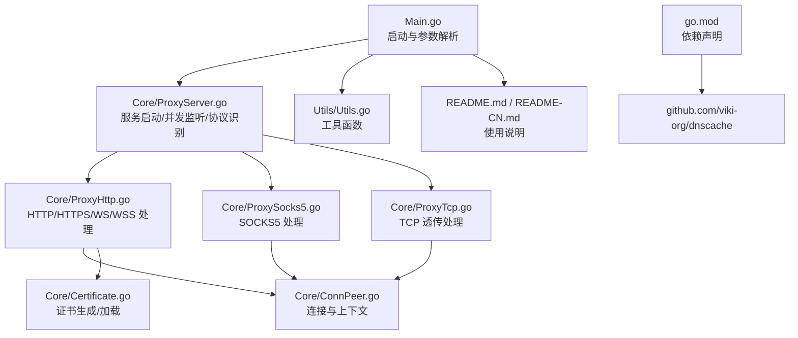
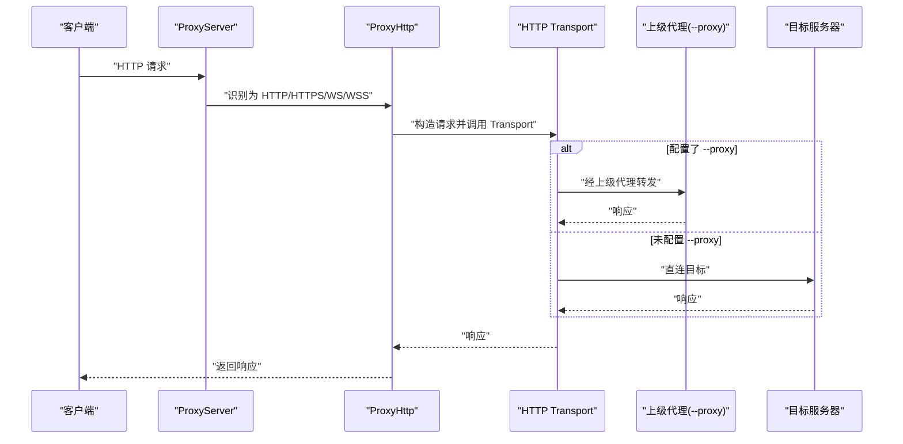
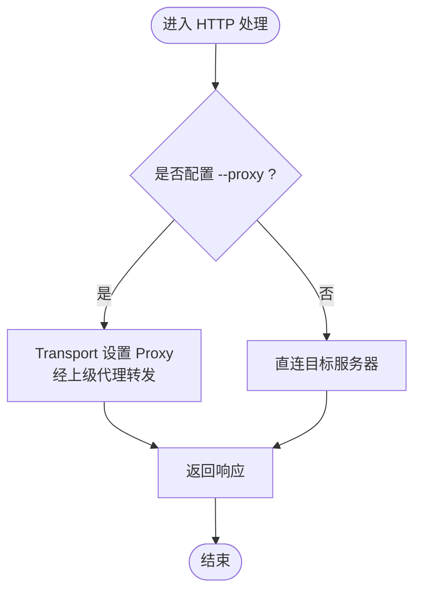
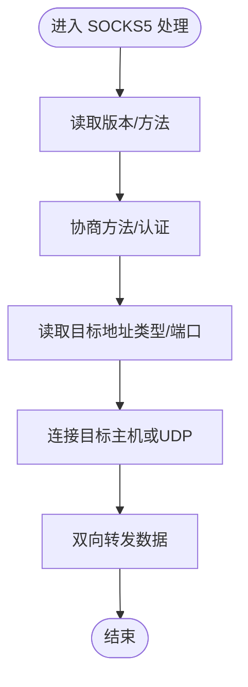
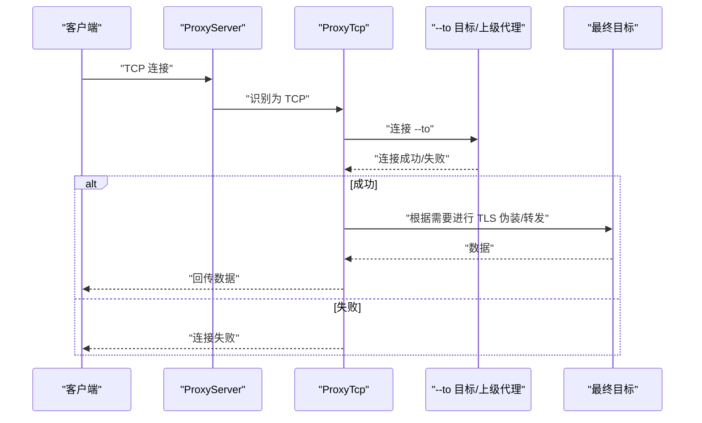
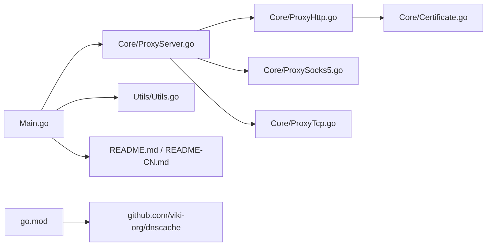

# 上级代理支持

<cite>
**本文引用的文件**
- [Main.go](file://Main.go)
- [README.md](file://README.md)
- [README-CN.md](file://README-CN.md)
- [go.mod](file://go.mod)
- [Core/ProxyServer.go](file://Core/ProxyServer.go)
- [Core/ProxyHttp.go](file://Core/ProxyHttp.go)
- [Core/ProxySocks5.go](file://Core/ProxySocks5.go)
- [Core/ProxyTcp.go](file://Core/ProxyTcp.go)
- [Core/ConnPeer.go](file://Core/ConnPeer.go)
- [Core/Certificate.go](file://Core/Certificate.go)
- [Utils/Utils.go](file://Utils/Utils.go)
- [Core/ProxyHttp_test.go](file://Core/ProxyHttp_test.go)
- [Core/ProxySocks5_test.go](file://Core/ProxySocks5_test.go)
- [Core/ProxyServer_test.go](file://Core/ProxyServer_test.go)
</cite>

## 目录
1. [简介](#简介)
2. [项目结构](#项目结构)
3. [核心组件](#核心组件)
4. [架构总览](#架构总览)
5. [详细组件分析](#详细组件分析)
6. [依赖关系分析](#依赖关系分析)
7. [性能与稳定性考量](#性能与稳定性考量)
8. [故障排查指南](#故障排查指南)
9. [结论](#结论)
10. [附录](#附录)

## 简介
本文件围绕“上级代理支持”主题，系统化梳理 Shermei-Proxy 在 HTTP、HTTPS、WebSocket、TCP、SOCKS5 等多协议场景下的上级代理（上一级 TCP 代理）配置与使用方式，解释代理链路建立过程、认证机制、性能与稳定性影响，并给出调试方法与常见问题解决方案。项目通过单一端口自动识别入站协议，支持在 HTTP/HTTPS/WS/WSS/TCP/SOCKS5 场景中按需启用上级代理，实现流量转发与透明代理能力。

## 项目结构
项目采用分层与按协议模块化的组织方式：
- 入口与运行时：Main.go、README、go.mod
- 核心服务：Core/ProxyServer.go（服务生命周期、协议识别、并发监听）
- 协议处理：Core/ProxyHttp.go、Core/ProxySocks5.go、Core/ProxyTcp.go
- 通用基类：Core/ConnPeer.go（封装连接与上下文）
- 证书与系统集成：Core/Certificate.go、Utils/Utils.go
- 测试：Core/*_test.go

图表来源
- [Main.go:24-124](file://Main.go#L24-L124)
- [Core/ProxyServer.go:123-213](file://Core/ProxyServer.go#L123-L213)
- [Core/ProxyHttp.go:44-203](file://Core/ProxyHttp.go#L44-L203)
- [Core/ProxySocks5.go:54-240](file://Core/ProxySocks5.go#L54-L240)
- [Core/ProxyTcp.go:23-66](file://Core/ProxyTcp.go#L23-L66)
- [Core/ConnPeer.go:8-14](file://Core/ConnPeer.go#L8-L14)
- [Core/Certificate.go:35-67](file://Core/Certificate.go#L35-L67)
- [Utils/Utils.go:13-62](file://Utils/Utils.go#L13-L62)
- [README.md:30-163](file://README.md#L30-L163)
- [go.mod:1-9](file://go.mod#L1-L9)

章节来源
- [Main.go:24-124](file://Main.go#L24-L124)
- [README.md:19-163](file://README.md#L19-L163)
- [go.mod:1-9](file://go.mod#L1-L9)

## 核心组件
- 服务入口与参数：Main.go 负责解析 --port、--nagle、--proxy、--to、--network 等参数，创建并启动 ProxyServer。
- 服务核心：Core/ProxyServer.go 提供服务生命周期管理、并发监听、协议识别（HTTP/CONNECT/WS、SOCKS5、TCP），以及事件回调注册点。
- 协议处理器：
  - HTTP/HTTPS/WS/WSS：Core/ProxyHttp.go，支持 TLS 握手、WS 升级、HTTP 请求/响应拦截与转发。
  - SOCKS5：Core/ProxySocks5.go，支持方法协商、目标地址解析、TCP/UDP 连接与双向转发。
  - TCP：Core/ProxyTcp.go，支持 TLS 伪装与双向转发。
- 通用基类：Core/ConnPeer.go 封装连接、读写器与服务上下文。
- 证书与系统集成：Core/Certificate.go 生成/加载根证书；Utils/Utils.go 提供文件存在判断、端口探测等工具。

章节来源
- [Main.go:24-124](file://Main.go#L24-L124)
- [Core/ProxyServer.go:48-213](file://Core/ProxyServer.go#L48-L213)
- [Core/ProxyHttp.go:29-203](file://Core/ProxyHttp.go#L29-L203)
- [Core/ProxySocks5.go:15-240](file://Core/ProxySocks5.go#L15-L240)
- [Core/ProxyTcp.go:15-66](file://Core/ProxyTcp.go#L15-L66)
- [Core/ConnPeer.go:8-14](file://Core/ConnPeer.go#L8-L14)
- [Core/Certificate.go:35-67](file://Core/Certificate.go#L35-L67)
- [Utils/Utils.go:13-62](file://Utils/Utils.go#L13-L62)

## 架构总览
Shermie-Proxy 的“上级代理”能力体现在以下路径：
- HTTP/HTTPS/WS/WSS：当配置了 --proxy 时，HTTP Transport 使用 DialContext 并设置 Proxy，将上游请求经由上级代理转发。
- HTTPS CONNECT：当请求为 CONNECT 时，若配置了 --proxy，则直接通过 TCP 连接到上级代理；否则直连目标主机。
- SOCKS5：当前实现为本地 SOCKS5 代理，不涉及上级代理链路（仅本地代理）。
- TCP：当配置了 --to 时，直接连接目标主机；若需要经上级代理，可将 --to 设为上级代理地址（取决于业务需求）。

图表来源
- [Core/ProxyHttp.go:183-203](file://Core/ProxyHttp.go#L183-L203)
- [Core/ProxyHttp.go:206-231](file://Core/ProxyHttp.go#L206-L231)
- [Core/ProxyServer.go:176-203](file://Core/ProxyServer.go#L176-L203)

## 详细组件分析

### HTTP/HTTPS/WS/WSS 上级代理（--proxy）
- 配置入口：Main.go 中解析 --proxy 参数并传递给 ProxyServer。
- 实现要点：
  - HTTP Transport 使用 DialContext 并设置 Proxy，从而将请求经上级代理转发。
  - HTTPS CONNECT 时，若配置了 --proxy，则通过 TCP 连接到上级代理；否则直连目标主机。
  - WS/WSS：在 TLS 握手后进行协议升级，必要时通过 DialContext 进行上游连接。
- 认证机制：
  - 当前实现未显式处理 HTTP 代理认证（如 Basic/Digest）。若上级代理需要认证，建议在部署环境或系统代理层配置凭据，或在上游网络策略中允许免认证访问。
- 事件拦截：
  - 支持 OnHttpRequestEvent/OnHttpResponseEvent 对请求/响应进行拦截与修改，适用于调试与中间件逻辑。

图表来源
- [Core/ProxyHttp.go:183-203](file://Core/ProxyHttp.go#L183-L203)
- [Core/ProxyHttp.go:206-231](file://Core/ProxyHttp.go#L206-L231)
- [Main.go:27](file://Main.go#L27)

章节来源
- [Main.go:24-124](file://Main.go#L24-L124)
- [Core/ProxyHttp.go:44-203](file://Core/ProxyHttp.go#L44-L203)
- [Core/ProxyHttp_test.go:12-68](file://Core/ProxyHttp_test.go#L12-L68)

### SOCKS5 上级代理（--proxy）
- 当前实现为本地 SOCKS5 代理，不涉及上级代理链路。SOCKS5 握手阶段直接连接目标主机或 UDP，不走 HTTP Proxy。
- 若需“上级代理”，可在业务侧将 --to 设为上级代理地址，但该模式更偏向 TCP 透传而非 SOCKS5 代理。

图表来源
- [Core/ProxySocks5.go:54-240](file://Core/ProxySocks5.go#L54-L240)

章节来源
- [Core/ProxySocks5.go:15-240](file://Core/ProxySocks5.go#L15-L240)
- [Core/ProxySocks5_test.go:5-91](file://Core/ProxySocks5_test.go#L5-L91)

### TCP 上级代理（--to）
- 当配置了 --to 时，TCP 代理会解析目标地址并直连；若需要经上级代理，可将 --to 设为上级代理地址。
- TLS 伪装：在 TCP 透传场景下，若目标为 HTTPS，会通过证书缓存生成证书并进行 TLS 握手，以便客户端信任。

图表来源
- [Core/ProxyTcp.go:23-66](file://Core/ProxyTcp.go#L23-L66)
- [Core/ProxyServer.go:176-203](file://Core/ProxyServer.go#L176-L203)

章节来源
- [Core/ProxyTcp.go:15-66](file://Core/ProxyTcp.go#L15-L66)

### 证书与系统集成
- 根证书初始化：首次运行会在工作目录生成 cert.crt/cert.key，并在 HTTP/HTTPS/WS/WSS 场景中用于 TLS 伪装与证书下发。
- 证书下发：/tls 路径可下载根证书，便于客户端信任。

章节来源
- [Core/Certificate.go:35-67](file://Core/Certificate.go#L35-L67)
- [Core/ProxyHttp.go:80-94](file://Core/ProxyHttp.go#L80-L94)

## 依赖关系分析
- go.mod 显式引入 github.com/viki-org/dnscache 作为 DNS 缓存解析器，用于加速域名解析并减少外部依赖。
- 项目未直接依赖标准库以外的代理实现（如 net/http.ProxyURL 的认证扩展），因此 HTTP 代理认证需在系统或网络层面解决。

图表来源
- [go.mod:1-9](file://go.mod#L1-L9)
- [Main.go:24-124](file://Main.go#L24-L124)
- [Core/ProxyServer.go:123-213](file://Core/ProxyServer.go#L123-L213)

章节来源
- [go.mod:1-9](file://go.mod#L1-L9)

## 性能与稳定性考量
- Nagle 算法：--nagle 控制 TCP NoDelay，默认启用，有助于减少小包数量；在高延迟网络下可考虑关闭以降低时延。
- DNS 缓存：内置 dnscache，提升域名解析效率，避免频繁 DNS 查询。
- 并发监听：MultiListen 启动多个 goroutine 接受连接，提高吞吐量。
- 超时控制：HTTP Transport 设置了 TLS 握手与响应超时，CONNECT 成功/失败返回固定报文，确保快速失败。
- 证书缓存：证书生成与缓存减少重复计算，提升 HTTPS/WS 场景性能。

章节来源
- [Core/ProxyServer.go:156-174](file://Core/ProxyServer.go#L156-L174)
- [Core/ProxyHttp.go:185-191](file://Core/ProxyHttp.go#L185-L191)
- [Core/ProxyHttp.go:206-231](file://Core/ProxyHttp.go#L206-L231)

## 故障排查指南
- 无法连接上级代理（HTTP/HTTPS）：
  - 检查 --proxy 地址格式与可达性；确认网络策略允许访问。
  - 若上级代理需要认证，建议在系统或网络层配置凭据。
- CONNECT 失败：
  - 查看返回的连接状态字符串，确认是否为 200 或 502；检查目标主机端口与防火墙。
- WebSocket 升级失败：
  - 关注 OnWsRequestEvent/OnWsResponseEvent 回调中的错误信息；确认目标 WS/WSS 地址与协议。
- SOCKS5 握手异常：
  - 检查方法协商与目标地址类型；确认端口解析正确。
- TCP 透传异常：
  - 确认 --to 地址与端口；若目标为 HTTPS，检查证书生成与缓存是否生效。
- 证书问题：
  - 通过 /tls 下载根证书并在客户端安装；确保系统时间准确。

章节来源
- [Core/ProxyHttp.go:108-131](file://Core/ProxyHttp.go#L108-L131)
- [Core/ProxyHttp.go:206-231](file://Core/ProxyHttp.go#L206-L231)
- [Core/ProxySocks5.go:54-240](file://Core/ProxySocks5.go#L54-L240)
- [Core/ProxyTcp.go:23-66](file://Core/ProxyTcp.go#L23-L66)
- [Core/Certificate.go:35-67](file://Core/Certificate.go#L35-L67)

## 结论
Shermie-Proxy 在 HTTP/HTTPS/WS/WSS 场景下通过 HTTP Transport 的 DialContext 与 Proxy 配置实现了对“上级代理”的支持；在 HTTPS CONNECT 场景下，可直接连接上级代理以实现透明转发。SOCKS5 与 TCP 场景当前为本地代理行为，若需“上级代理”，可通过将目标地址指向上级代理的方式实现。项目提供了完善的事件拦截、证书管理与并发监听能力，适合在开发调试与中间件场景中使用。对于 HTTP 代理认证与高级特性（如认证、负载均衡、故障转移），建议结合系统代理或网络策略实现。

## 附录

### 参数与配置清单
- --port：监听端口（默认 9090）
- --proxy：上级代理地址（HTTP/HTTPS 场景生效）
- --to：TCP 透传目标地址（HTTPS 场景下用于 TLS 伪装）
- --nagle：是否启用 Nagle 算法（默认 true）
- --network：绑定网卡 IP（可选）

章节来源
- [README.md:148-163](file://README.md#L148-L163)
- [README-CN.md:145-158](file://README-CN.md#L145-L158)
- [Main.go:25-30](file://Main.go#L25-L30)