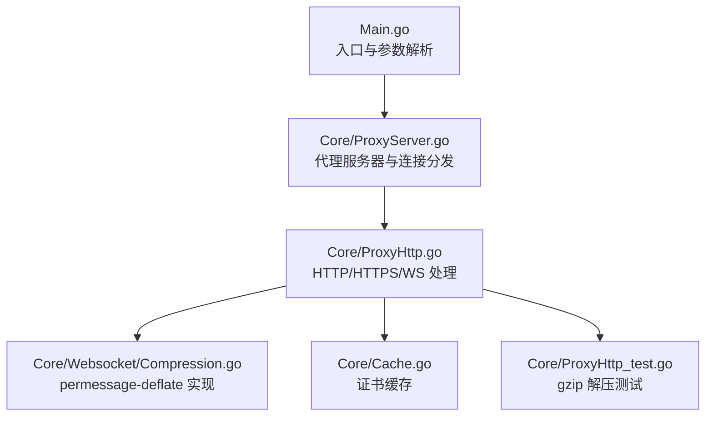
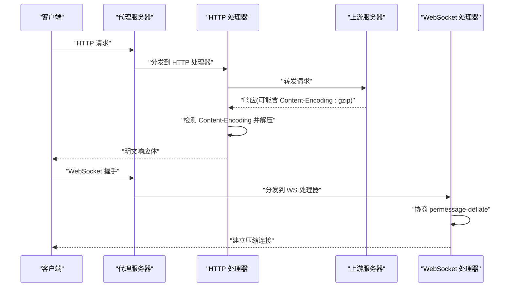
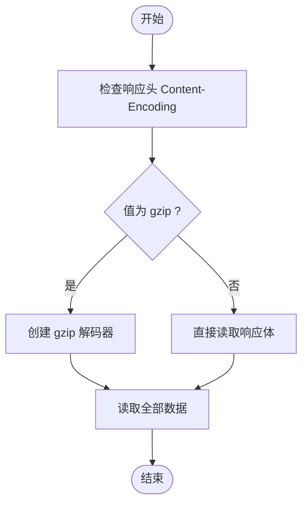
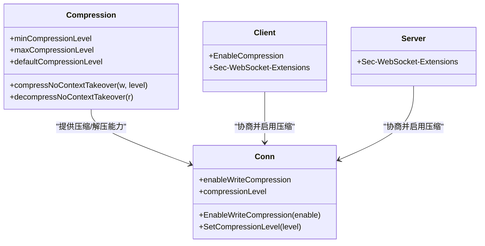
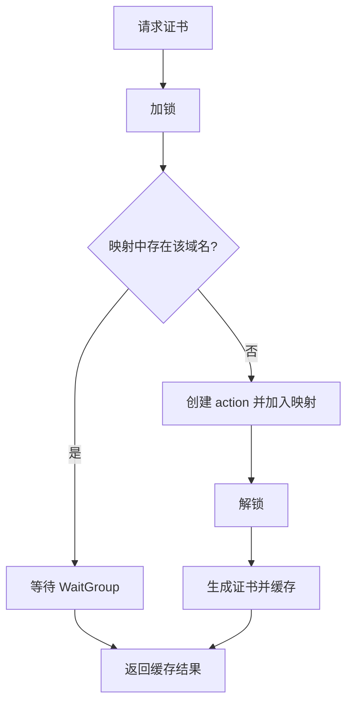
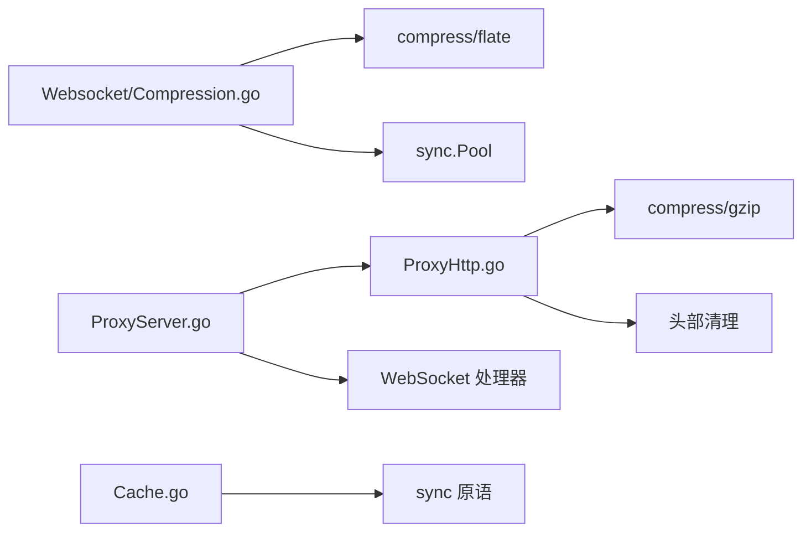

# 压缩传输优化

<cite>
**本文档引用的文件**
- [Main.go](file://Main.go)
- [README.md](file://README.md)
- [CODE-DOC.md](file://CODE-DOC.md)
- [Core/ProxyHttp.go](file://Core/ProxyHttp.go)
- [Core/ProxyHttp_test.go](file://Core/ProxyHttp_test.go)
- [Core/ProxyServer.go](file://Core/ProxyServer.go)
- [Core/Cache.go](file://Core/Cache.go)
- [Core/Websocket/Compression.go](file://Core/Websocket/Compression.go)
- [Core/Websocket/Client.go](file://Core/Websocket/Client.go)
- [Core/Websocket/Server.go](file://Core/Websocket/Server.go)
- [Core/Websocket/Conn.go](file://Core/Websocket/Conn.go)
</cite>

## 目录
1. [简介](#简介)
2. [项目结构](#项目结构)
3. [核心组件](#核心组件)
4. [架构总览](#架构总览)
5. [详细组件分析](#详细组件分析)
6. [依赖关系分析](#依赖关系分析)
7. [性能考量](#性能考量)
8. [故障排除指南](#故障排除指南)
9. [结论](#结论)
10. [附录](#附录)

## 简介
本文件聚焦于压缩传输优化功能，深入解释 HTTP 响应体的压缩处理机制，包括 gzip 压缩的支持与解压过程；详细说明 Content-Encoding 头部的处理逻辑与压缩算法选择；解释压缩传输对带宽节省与延迟的影响权衡；提供压缩级别的配置选项与性能优化建议；分析不同内容类型的压缩效果与适用场景；包含压缩传输的监控指标与故障排除方法；说明压缩功能与缓存系统的协同工作机制。

## 项目结构
该项目是一个多协议代理服务，支持 HTTP、HTTPS、WS/WSS、TCP、SOCKS5。压缩传输优化主要涉及 HTTP 层的 gzip 解压与 WebSocket 层的 permessage-deflate 压缩。核心模块包括：
- 入口与参数解析：Main.go
- HTTP 代理处理：Core/ProxyHttp.go
- WebSocket 压缩实现：Core/Websocket/Compression.go、Client.go、Server.go、Conn.go
- 证书缓存：Core/Cache.go
- 文档与示例：README.md、CODE-DOC.md

**图表来源**
- [Main.go:24-124](file://Main.go#L24-L124)
- [Core/ProxyServer.go:176-203](file://Core/ProxyServer.go#L176-L203)
- [Core/ProxyHttp.go:44-132](file://Core/ProxyHttp.go#L44-L132)
- [Core/Websocket/Compression.go:1-149](file://Core/Websocket/Compression.go#L1-L149)
- [Core/Cache.go:1-79](file://Core/Cache.go#L1-L79)
- [Core/ProxyHttp_test.go:1-155](file://Core/ProxyHttp_test.go#L1-L155)

**章节来源**
- [Main.go:24-124](file://Main.go#L24-L124)
- [Core/ProxyServer.go:176-203](file://Core/ProxyServer.go#L176-L203)

## 核心组件
- HTTP 压缩解压：在读取 HTTP 响应体时检测 Content-Encoding:gzip 并进行解压，确保上层业务拿到明文数据。
- WebSocket 压缩：基于 permessage-deflate，支持 server/client_no_context_takeover，使用 flate 编解码器池化优化性能。
- 证书缓存：为 HTTPS 中间人代理提供证书生成与缓存，减少重复开销。
- 事件钩子：允许在请求/响应阶段对数据进行拦截与修改，便于插入压缩策略或统计。

**章节来源**
- [Core/ProxyHttp.go:143-154](file://Core/ProxyHttp.go#L143-L154)
- [Core/Websocket/Compression.go:15-54](file://Core/Websocket/Compression.go#L15-L54)
- [Core/Cache.go:39-64](file://Core/Cache.go#L39-L64)

## 架构总览
压缩传输优化贯穿请求与响应路径：
- 客户端请求进入后，先读取请求体，再转发至上游。
- 上游返回响应时，若 Content-Encoding 为 gzip，则在本地解压后再交给业务处理。
- WebSocket 握手阶段协商 permessage-deflate，启用后对消息帧进行压缩。
- 证书缓存用于 HTTPS 中间人场景，提升 TLS 握手效率。

**图表来源**
- [Core/ProxyHttp.go:108-131](file://Core/ProxyHttp.go#L108-L131)
- [Core/ProxyHttp.go:143-154](file://Core/ProxyHttp.go#L143-L154)
- [Core/Websocket/Client.go:227-375](file://Core/Websocket/Client.go#L227-L375)
- [Core/Websocket/Server.go:229-231](file://Core/Websocket/Server.go#L229-L231)

## 详细组件分析

### HTTP 压缩解压组件
- gzip 解压逻辑：当响应头包含 Content-Encoding:gzip 时，使用 gzip.NewReader 对响应体进行解压，确保后续业务处理得到原始数据。
- 请求体读取：统一读取请求体为字节切片，便于事件钩子修改与重写。
- 头部清理：移除 hop-by-hop 头部，避免代理链中的连接状态混乱，包括 Connection、Transfer-Encoding、TE、Trailer、Upgrade、Proxy-Authorization、Proxy-Authenticate、Accept-Encoding 等。

**图表来源**
- [Core/ProxyHttp.go:143-154](file://Core/ProxyHttp.go#L143-L154)

**章节来源**
- [Core/ProxyHttp.go:143-154](file://Core/ProxyHttp.go#L143-L154)
- [Core/ProxyHttp.go:157-180](file://Core/ProxyHttp.go#L157-L180)
- [Core/ProxyHttp_test.go:88-131](file://Core/ProxyHttp_test.go#L88-L131)

### WebSocket 压缩组件
- permessage-deflate 协商：客户端与服务端握手时通过 Sec-WebSocket-Extensions 协商 permessage-deflate，并要求 server_no_context_takeover 与 client_no_context_takeover。
- 编解码器池化：使用 sync.Pool 复用 flate.Writer 与 flate.Reader，降低压缩/解压开销。
- 写入尾部标记：在压缩输出末尾添加特定标记，确保解码器正确识别帧边界。
- 压缩级别：支持压缩级别范围 [-2, 1, 2..BestCompression]，默认 1。

**图表来源**
- [Core/Websocket/Compression.go:15-54](file://Core/Websocket/Compression.go#L15-L54)
- [Core/Websocket/Conn.go:258-282](file://Core/Websocket/Conn.go#L258-L282)
- [Core/Websocket/Conn.go:1172-1186](file://Core/Websocket/Conn.go#L1172-L1186)
- [Core/Websocket/Client.go:227-375](file://Core/Websocket/Client.go#L227-L375)
- [Core/Websocket/Server.go:229-231](file://Core/Websocket/Server.go#L229-L231)

**章节来源**
- [Core/Websocket/Compression.go:15-54](file://Core/Websocket/Compression.go#L15-L54)
- [Core/Websocket/Conn.go:258-282](file://Core/Websocket/Conn.go#L258-L282)
- [Core/Websocket/Conn.go:1172-1186](file://Core/Websocket/Conn.go#L1172-L1186)
- [Core/Websocket/Client.go:227-375](file://Core/Websocket/Client.go#L227-L375)
- [Core/Websocket/Server.go:229-231](file://Core/Websocket/Server.go#L229-L231)

### 证书缓存组件
- 并发安全：使用 Mutex 与 WaitGroup 确保同一域名仅生成一次证书，其他并发请求等待完成。
- 缓存映射：按主机名索引 action，避免重复的密钥生成与证书构建。
- 用途：为 HTTPS 中间人代理提供动态子证书，提升 TLS 握手效率。

**图表来源**
- [Core/Cache.go:39-64](file://Core/Cache.go#L39-L64)

**章节来源**
- [Core/Cache.go:39-64](file://Core/Cache.go#L39-L64)

## 依赖关系分析
- HTTP 处理器依赖 gzip 包进行解压。
- WebSocket 压缩依赖 compress/flate 与 sync.Pool。
- 证书缓存依赖并发同步原语。
- 事件钩子允许在请求/响应阶段插入压缩策略或统计信息。

**图表来源**
- [Core/ProxyHttp.go:5-6](file://Core/ProxyHttp.go#L5-L6)
- [Core/Websocket/Compression.go:7-12](file://Core/Websocket/Compression.go#L7-L12)
- [Core/ProxyServer.go:176-203](file://Core/ProxyServer.go#L176-L203)
- [Core/Cache.go:4-8](file://Core/Cache.go#L4-L8)

**章节来源**
- [Core/ProxyHttp.go:5-6](file://Core/ProxyHttp.go#L5-L6)
- [Core/Websocket/Compression.go:7-12](file://Core/Websocket/Compression.go#L7-L12)
- [Core/ProxyServer.go:176-203](file://Core/ProxyServer.go#L176-L203)
- [Core/Cache.go:4-8](file://Core/Cache.go#L4-L8)

## 性能考量
- 带宽与延迟权衡
  - gzip 解压会增加 CPU 开销，但显著减少网络传输字节数，适合大文本、JSON、HTML 等可高压缩内容。
  - WebSocket permessage-deflate 在高频小消息场景收益明显，配合 no_context_takeover 可降低累积误差。
- 压缩级别配置
  - HTTP 层：当前实现自动解压 gzip，未暴露压缩级别配置；可在上游服务端或业务侧控制压缩级别。
  - WebSocket 层：支持压缩级别范围与默认级别，可通过 SetCompressionLevel 动态调整。
- 缓存与池化
  - gzip 解压器与 flate 编解码器池化有效降低 GC 压力与分配开销。
  - 证书缓存避免重复生成，提升 TLS 握手吞吐。
- 网络参数
  - Nagle 算法可通过 --nagle 控制，默认开启；关闭可降低小包延迟，但可能增加包数与 CPU 抖动。

**章节来源**
- [Core/Websocket/Compression.go:15-19](file://Core/Websocket/Compression.go#L15-L19)
- [Core/Websocket/Conn.go:1172-1186](file://Core/Websocket/Conn.go#L1172-L1186)
- [Main.go:25-30](file://Main.go#L25-L30)

## 故障排除指南
- gzip 解压异常
  - 现象：Content-Encoding 为 gzip 但数据不是合法 gzip 格式。
  - 处理：ReadResponseBody 返回空切片且不报错，属于容错行为；建议在上游确认 Content-Encoding 与实际数据一致性。
- WebSocket 压缩协商失败
  - 现象：握手后未启用压缩或报无效扩展。
  - 处理：检查客户端/服务端是否均声明 permessage-deflate 且包含 no_context_takeover；确认 EnableCompression 已启用。
- 头部冲突
  - 现象：代理链中出现连接状态混乱。
  - 处理：确保 RemoveHeader 清理 Connection、Transfer-Encoding、TE、Trailer、Upgrade、Proxy-Authorization、Proxy-Authenticate、Accept-Encoding 等 hop-by-hop 头部。
- 证书生成并发问题
  - 现象：高并发下证书生成重复或阻塞。
  - 处理：确认 Cache.GetCertificate 的并发控制逻辑正常运行，WaitGroup 与 Mutex 配置正确。

**章节来源**
- [Core/ProxyHttp_test.go:114-131](file://Core/ProxyHttp_test.go#L114-L131)
- [Core/Websocket/Client.go:363-375](file://Core/Websocket/Client.go#L363-L375)
- [Core/ProxyHttp.go:157-180](file://Core/ProxyHttp.go#L157-L180)
- [Core/Cache.go:39-64](file://Core/Cache.go#L39-L64)

## 结论
本项目在 HTTP 层实现了对 gzip 响应体的自动解压，在 WebSocket 层提供了 permessage-deflate 的高效压缩方案，并通过池化与缓存机制优化性能。通过合理的压缩级别与网络参数配置，可在带宽与延迟之间取得良好平衡。建议在业务侧结合内容类型与流量特征，针对性地启用压缩策略，并利用事件钩子进行监控与统计。

## 附录
- 监控指标建议
  - 压缩率：(原始大小 - 压缩后大小) / 原始大小
  - 解压耗时：gzip 解压时间分布
  - WebSocket 压缩命中率：启用 permessage-deflate 的消息比例
  - 证书生成耗时：单域名证书生成平均时间
- 配置与优化
  - HTTP 层：在上游服务端控制 Content-Encoding 与压缩级别
  - WebSocket 层：根据消息大小与频率调整压缩级别，必要时关闭压缩以降低 CPU
  - 网络层：根据业务特性调整 --nagle 与 TCP NoDelay