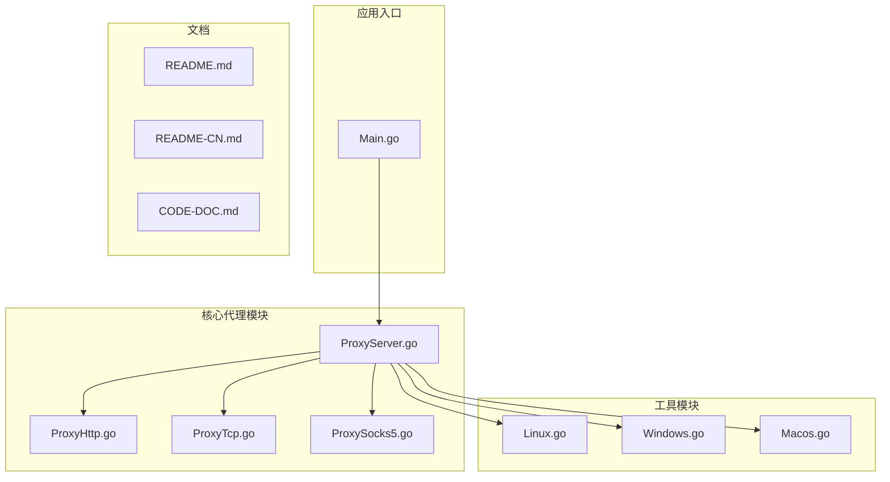
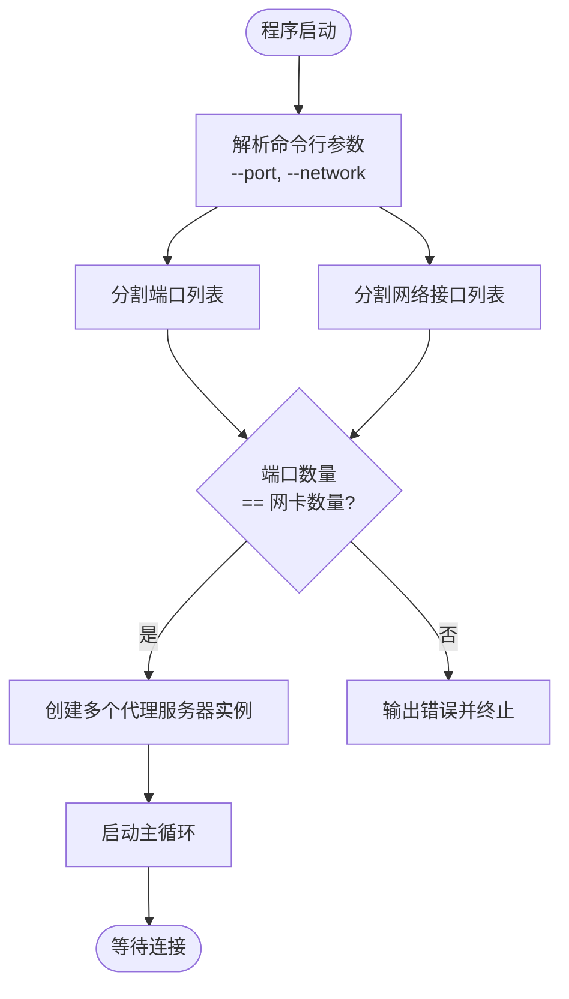
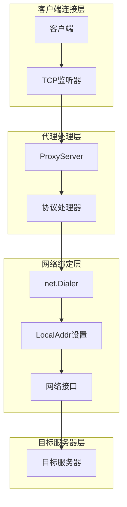
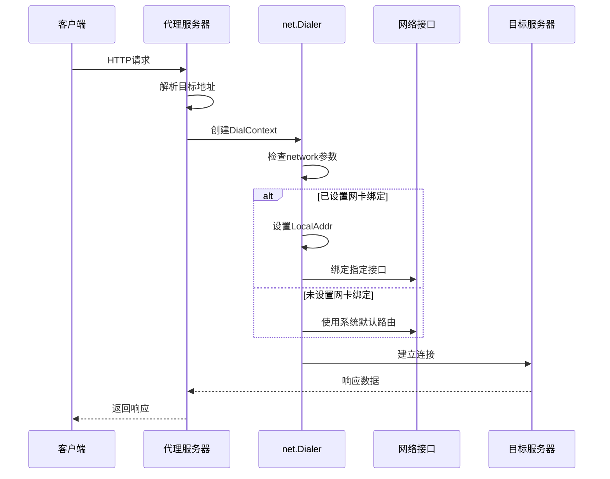
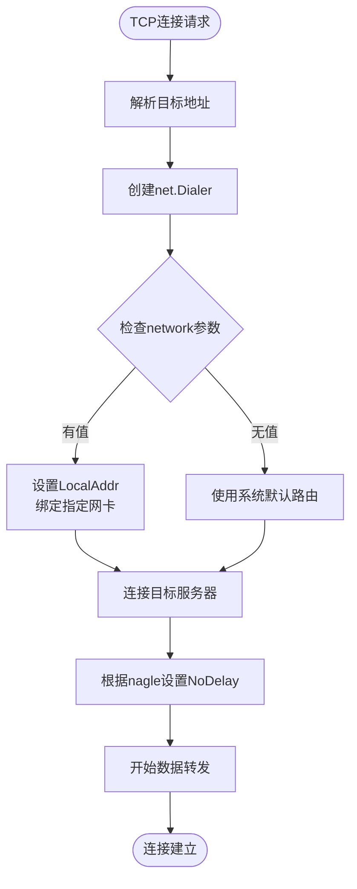
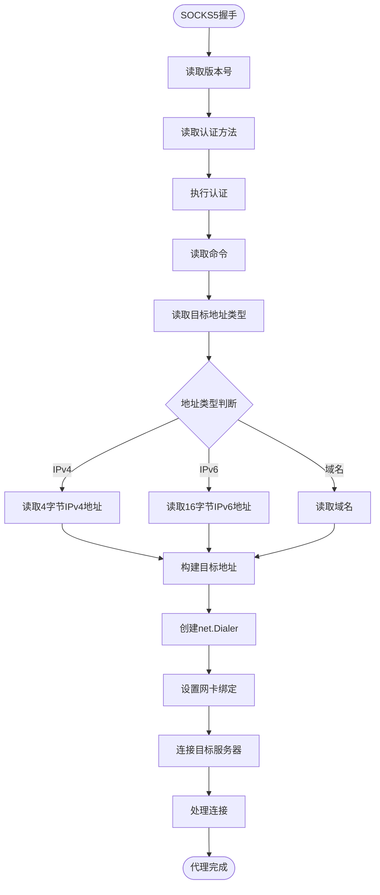
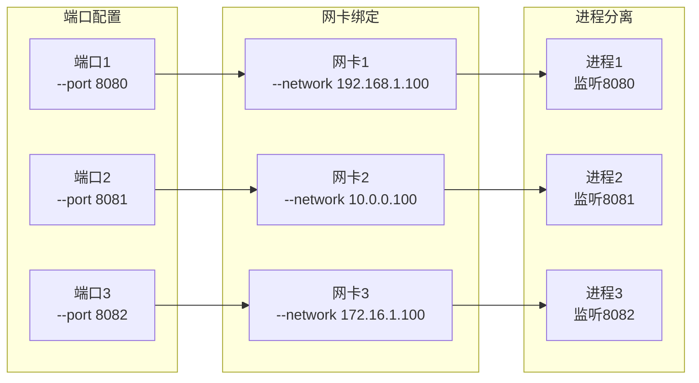
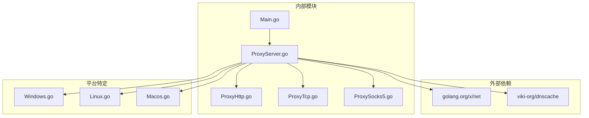

# 网卡绑定功能

<cite>
**本文档引用的文件**
- [Main.go](file://Main.go)
- [ProxyServer.go](file://Core/ProxyServer.go)
- [ProxyHttp.go](file://Core/ProxyHttp.go)
- [ProxyTcp.go](file://Core/ProxyTcp.go)
- [ProxySocks5.go](file://Core/ProxySocks5.go)
- [Linux.go](file://Utils/Linux.go)
- [Windows.go](file://Utils/Windows.go)
- [Macos.go](file://Utils/Macos.go)
- [README.md](file://README.md)
- [README-CN.md](file://README-CN.md)
- [CODE-DOC.md](file://CODE-DOC.md)
</cite>

## 目录
1. [简介](#简介)
2. [项目结构](#项目结构)
3. [核心组件](#核心组件)
4. [架构概览](#架构概览)
5. [详细组件分析](#详细组件分析)
6. [依赖关系分析](#依赖关系分析)
7. [性能考虑](#性能考虑)
8. [故障排除指南](#故障排除指南)
9. [结论](#结论)
10. [附录](#附录)

## 简介

本文档深入解析Shermie-Proxy项目中的网卡绑定功能，重点说明如何通过LocalAddr参数实现网络接口的选择性绑定。网卡绑定功能允许用户在多网卡环境中精确控制出站流量的网络接口，实现网络隔离、流量控制和性能优化。

该功能的核心实现基于Go语言net包的net.Dialer.LocalAddr字段，通过在HTTP、TCP和SOCKS5代理流程中设置本地绑定地址，实现对出站连接的网络接口选择。

## 项目结构

项目采用模块化设计，主要包含以下核心模块：



**图表来源**
- [Main.go:1-124](file://Main.go#L1-L124)
- [ProxyServer.go:1-213](file://Core/ProxyServer.go#L1-L213)

**章节来源**
- [Main.go:1-124](file://Main.go#L1-L124)
- [README.md:1-163](file://README.md#L1-L163)

## 核心组件

### 网卡绑定参数解析

程序通过命令行参数解析网卡绑定信息：



**图表来源**
- [Main.go:24-46](file://Main.go#L24-L46)

### 代理服务器核心结构

代理服务器维护网络接口绑定信息：

| 字段名 | 类型 | 描述 | 默认值 |
|--------|------|------|--------|
| network | string | 网络接口地址 | 空字符串 |
| listener | *net.TCPListener | TCP监听器 | nil |
| dns | *dnscache.Resolver | DNS解析器 | 新建实例 |
| OnXxxEvent | 函数类型 | 各种事件回调 | nil |

**章节来源**
- [ProxyServer.go:48-77](file://Core/ProxyServer.go#L48-L77)
- [Main.go:24-46](file://Main.go#L24-L46)

## 架构概览

网卡绑定功能在整个代理架构中的位置：



**图表来源**
- [ProxyHttp.go:436-468](file://Core/ProxyHttp.go#L436-L468)
- [ProxyTcp.go:23-66](file://Core/ProxyTcp.go#L23-L66)
- [ProxySocks5.go:54-240](file://Core/ProxySocks5.go#L54-L240)

## 详细组件分析

### HTTP代理中的网卡绑定

HTTP代理的网卡绑定实现位于DialContext函数中：



**图表来源**
- [ProxyHttp.go:436-468](file://Core/ProxyHttp.go#L436-L468)

#### 关键实现细节

1. **DNS解析与IP选择**：优先选择IPv4地址，确保兼容性
2. **网卡绑定设置**：通过`dialer.LocalAddr = &net.TCPAddr{IP: net.ParseIP(i.server.network)}`实现
3. **Nagle算法控制**：根据nagle参数设置TCP连接的NoDelay属性

**章节来源**
- [ProxyHttp.go:436-468](file://Core/ProxyHttp.go#L436-L468)

### TCP代理中的网卡绑定

TCP代理的网卡绑定相对简单，直接在DialTCP时使用nil作为本地地址：



**图表来源**
- [ProxyTcp.go:23-66](file://Core/ProxyTcp.go#L23-L66)

**章节来源**
- [ProxyTcp.go:23-66](file://Core/ProxyTcp.go#L23-L66)

### SOCKS5代理中的网卡绑定

SOCKS5代理的网卡绑定实现最为复杂，需要处理多种地址格式：



**图表来源**
- [ProxySocks5.go:54-240](file://Core/ProxySocks5.go#L54-L240)

**章节来源**
- [ProxySocks5.go:54-240](file://Core/ProxySocks5.go#L54-L240)

### 多端口网卡绑定配置

程序支持同时监听多个端口并为每个端口绑定不同的网络接口：



**图表来源**
- [Main.go:48-123](file://Main.go#L48-L123)

**章节来源**
- [Main.go:48-123](file://Main.go#L48-L123)
- [CODE-DOC.md:704-709](file://CODE-DOC.md#L704-L709)

## 依赖关系分析

网卡绑定功能的依赖关系图：



**图表来源**
- [ProxyServer.go:3-17](file://Core/ProxyServer.go#L3-L17)
- [Main.go:3-11](file://Main.go#L3-L11)

**章节来源**
- [ProxyServer.go:3-17](file://Core/ProxyServer.go#L3-L17)
- [Main.go:3-11](file://Main.go#L3-L11)

## 性能考虑

### 网卡绑定对性能的影响

1. **连接建立延迟**：网卡绑定会增加少量的路由查找时间
2. **内存占用**：每个代理服务器实例占用额外的内存资源
3. **CPU开销**：多端口监听会增加CPU使用率

### 最佳实践建议

1. **合理配置端口数量**：端口数量与网卡数量必须保持一致
2. **选择合适的网卡**：优先选择带宽充足、延迟较低的网卡
3. **监控网络状态**：定期检查各网卡的使用情况和健康状态

## 故障排除指南

### 常见问题及解决方案

#### 1. 网卡绑定失败

**症状**：程序启动时报错，无法绑定指定网卡

**可能原因**：
- 网卡地址不存在或不可用
- 权限不足
- 网卡处于禁用状态

**解决方法**：
1. 验证网卡地址格式正确性
2. 检查系统权限
3. 确认网卡状态正常

#### 2. 多端口配置错误

**症状**：程序启动失败，提示端口数量与网卡数量不匹配

**解决方法**：
```bash
# 正确的配置方式
./sheremie-proxy --port 8080,8081 --network 192.168.1.100,10.0.0.100

# 错误的配置方式
./sheremie-proxy --port 8080,8081 --network 192.168.1.100  # 缺少一个网卡配置
```

#### 3. 平台兼容性问题

**Windows系统**：
- 支持自动证书安装和系统代理设置
- 需要管理员权限

**Linux系统**：
- 不支持自动证书安装
- 需要手动配置证书

**macOS系统**：
- 不支持自动证书安装
- 需要手动配置证书

**章节来源**
- [Linux.go:8-16](file://Utils/Linux.go#L8-L16)
- [Windows.go:18-50](file://Utils/Windows.go#L18-L50)
- [Macos.go:8-16](file://Utils/Macos.go#L8-L16)

## 结论

网卡绑定功能为Shermie-Proxy提供了强大的网络控制能力，使用户能够在复杂的多网卡环境中精确控制出站流量的网络路径。通过LocalAddr参数的实现，系统实现了以下关键特性：

1. **精确的网络接口选择**：支持IPv4和IPv6地址绑定
2. **灵活的多网卡配置**：支持同时使用多个网络接口
3. **平台兼容性**：在不同操作系统上提供一致的功能体验
4. **性能优化**：通过DNS缓存和多连接处理提升整体性能

该功能特别适用于需要网络隔离、流量控制和性能优化的企业级应用场景。

## 附录

### 配置示例

#### 基本HTTP代理配置
```bash
# 监听单个端口，绑定指定网卡
./sheremie-proxy --port 9090 --network 192.168.1.100
```

#### 多端口多网卡配置
```bash
# 监听多个端口，每个端口绑定不同网卡
./sheremie-proxy --port 8080,8081,8082 --network 192.168.1.100,10.0.0.100,172.16.1.100
```

#### 高级配置选项
```bash
# 启用Nagle算法优化
./sheremie-proxy --port 9090 --network 192.168.1.100 --nagle true

# 配置上游代理
./sheremie-proxy --port 9090 --network 192.168.1.100 --proxy 127.0.0.1:8080
```

### 平台特定注意事项

#### Windows平台
- 自动证书安装和系统代理设置
- 需要管理员权限运行
- 支持完整的自动化配置

#### Linux平台
- 需要手动安装根证书
- 通过系统包管理器安装证书
- 支持手动配置网络接口

#### macOS平台
- 需要手动安装根证书
- 通过Keychain Access管理证书
- 支持手动配置网络接口