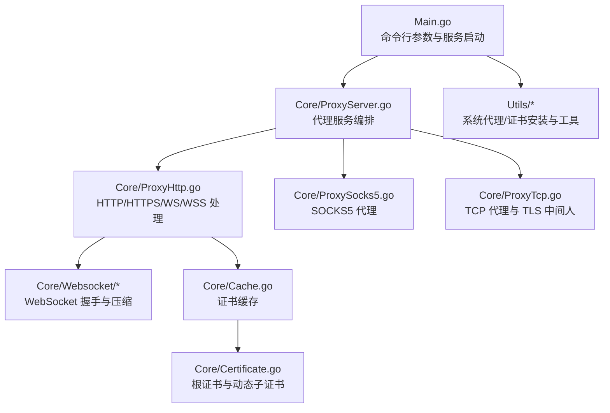
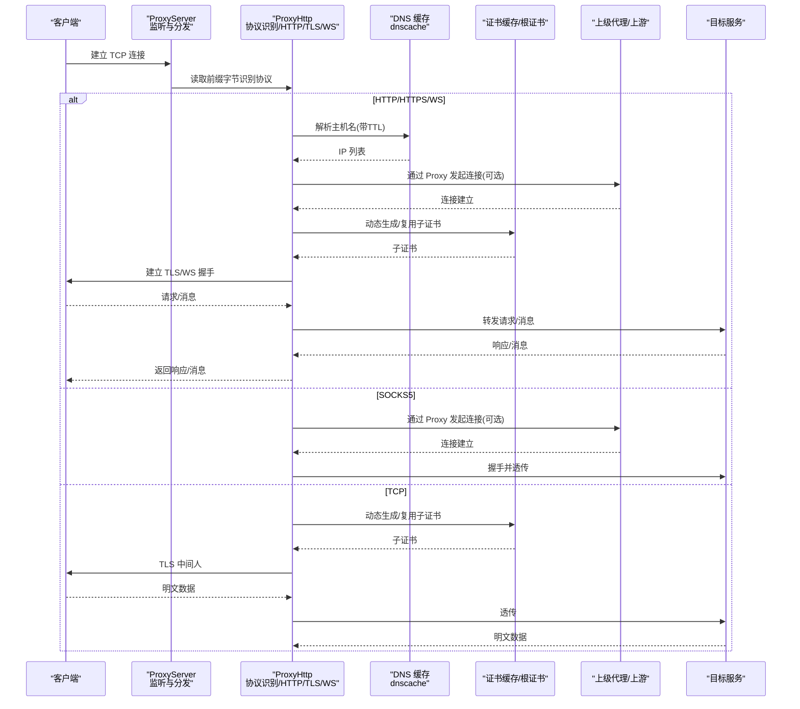
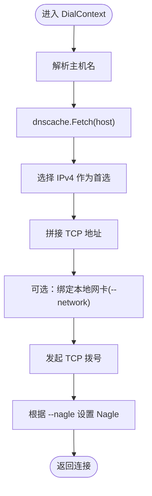
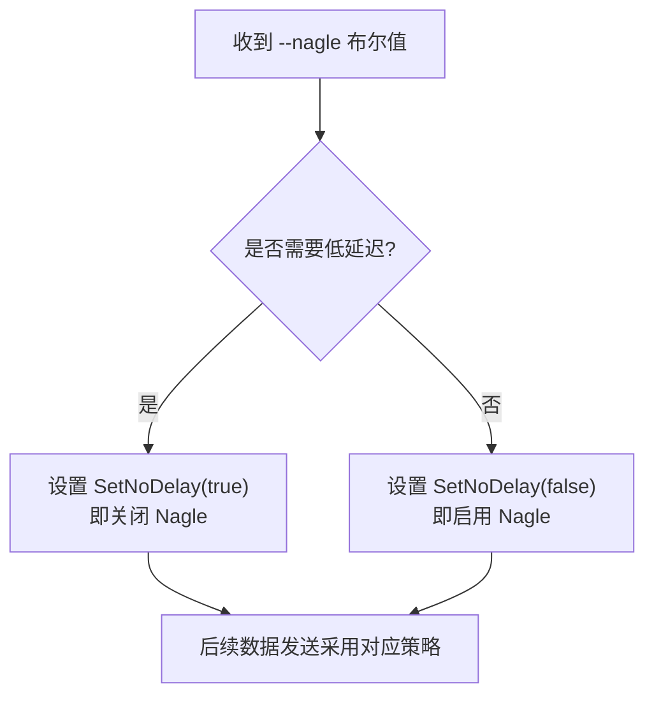
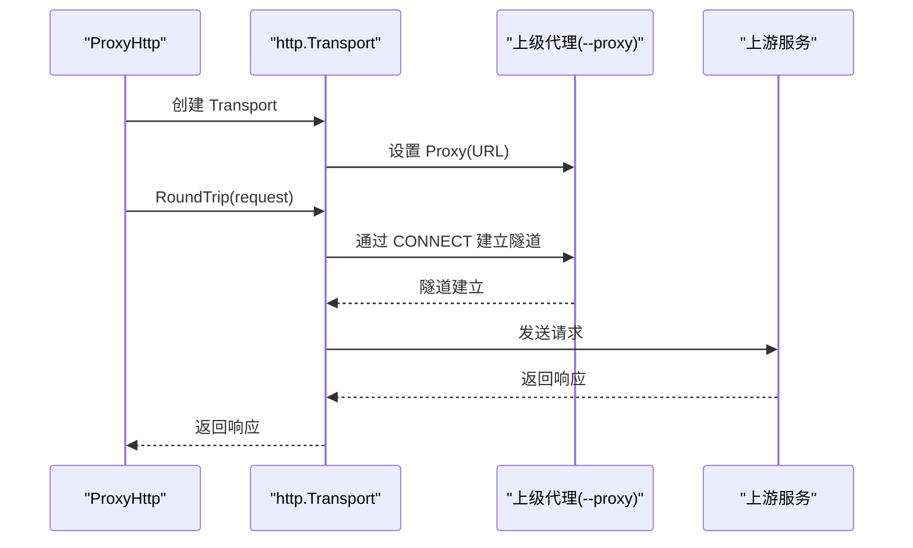
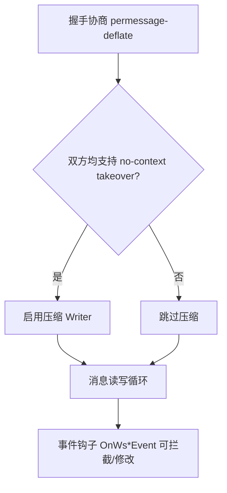
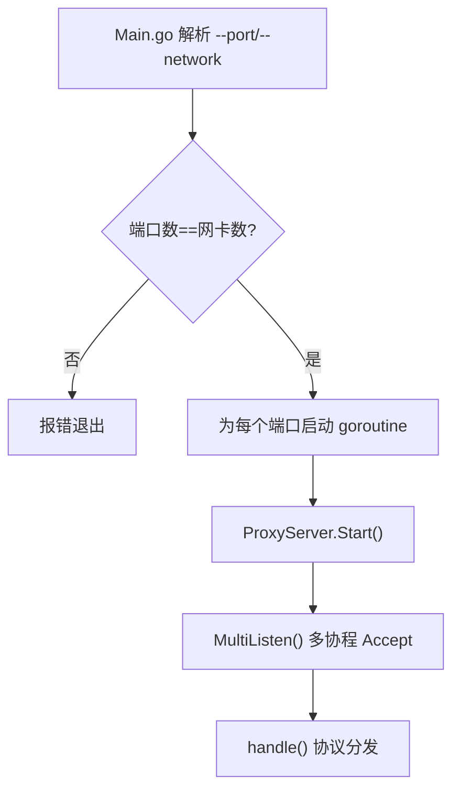
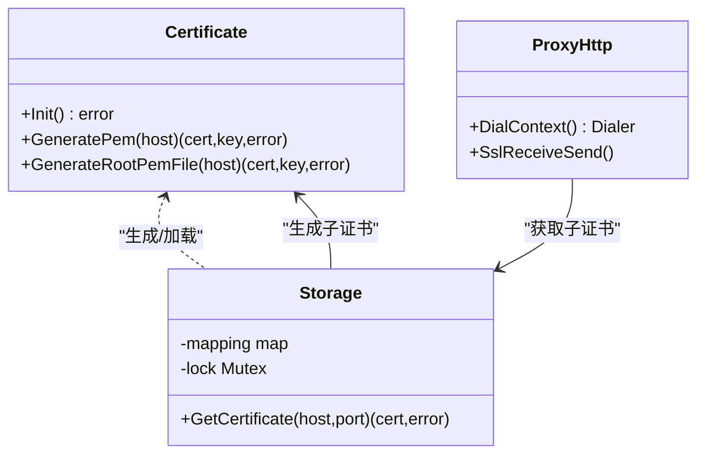
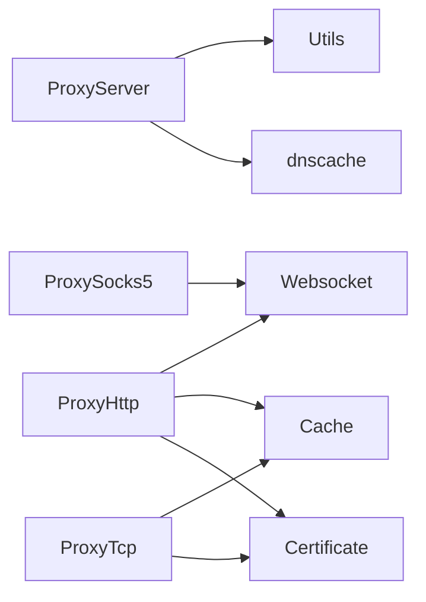

# 高级功能

<cite>
**本文引用的文件**
- [Main.go](file://Main.go)
- [README.md](file://README.md)
- [README-CN.md](file://README-CN.md)
- [Core/ProxyServer.go](file://Core/ProxyServer.go)
- [Core/ProxyHttp.go](file://Core/ProxyHttp.go)
- [Core/ProxySocks5.go](file://Core/ProxySocks5.go)
- [Core/ProxyTcp.go](file://Core/ProxyTcp.go)
- [Core/Cache.go](file://Core/Cache.go)
- [Core/Certificate.go](file://Core/Certificate.go)
- [Core/ConnPeer.go](file://Core/ConnPeer.go)
- [Core/Websocket/Proxy.go](file://Core/Websocket/Proxy.go)
- [Core/Websocket/Compression.go](file://Core/Websocket/Compression.go)
- [Core/Websocket/Server.go](file://Core/Websocket/Server.go)
- [Core/Websocket/Client.go](file://Core/Websocket/Client.go)
- [Utils/Linux.go](file://Utils/Linux.go)
- [Utils/Utils.go](file://Utils/Utils.go)
- [go.mod](file://go.mod)
- [go.sum](file://go.sum)
- [CODE-DOC.md](file://CODE-DOC.md)
</cite>

## 目录
1. [简介](#简介)
2. [项目结构](#项目结构)
3. [核心组件](#核心组件)
4. [架构总览](#架构总览)
5. [详细组件分析](#详细组件分析)
6. [依赖分析](#依赖分析)
7. [性能考量](#性能考量)
8. [故障排查指南](#故障排查指南)
9. [结论](#结论)
10. [附录](#附录)

## 简介
本文件聚焦于 shermie-proxy 的高级功能与优化特性，围绕以下主题展开：
- DNS 缓存优化机制与配置
- Nagle 算法控制与适用场景
- 上级代理支持与 TLS 包装
- WebSocket 压缩传输与握手流程
- 网卡绑定与多端口部署
- 证书中间人与动态子证书
- 事件钩子与数据拦截能力

目标是帮助读者基于仓库实现，理解并正确配置这些高级能力，以获得更优的性能与可观测性。

## 项目结构
Shermie-Proxy 采用按功能域划分的模块化组织方式，核心入口位于主程序，协议处理集中在 Core 子包，WebSocket 协议扩展位于 Core/Websocket，工具与证书生成位于 Utils 与 Core/Certificate。

**图表来源**
- [Main.go:24-124](file://Main.go#L24-L124)
- [Core/ProxyServer.go:68-213](file://Core/ProxyServer.go#L68-L213)
- [Core/ProxyHttp.go:29-491](file://Core/ProxyHttp.go#L29-L491)
- [Core/ProxySocks5.go:15-300](file://Core/ProxySocks5.go#L15-L300)
- [Core/ProxyTcp.go:15-112](file://Core/ProxyTcp.go#L15-L112)
- [Core/Cache.go:10-79](file://Core/Cache.go#L10-L79)
- [Core/Certificate.go:18-188](file://Core/Certificate.go#L18-L188)
- [Core/Websocket/Proxy.go:17-78](file://Core/Websocket/Proxy.go#L17-L78)
- [Core/Websocket/Compression.go:15-149](file://Core/Websocket/Compression.go#L15-L149)

**章节来源**
- [Main.go:24-124](file://Main.go#L24-L124)
- [README.md:19-28](file://README.md#L19-L28)
- [README-CN.md:18-28](file://README-CN.md#L18-L28)

## 核心组件
- 代理服务编排器：负责监听、协议识别、事件回调注册与并发处理。
- 协议处理器：
  - HTTP/HTTPS/WS/WSS：统一入口，自动识别 CONNECT/Upgrade 等特征，分别走 HTTP/TLS/WebSocket 路径。
  - SOCKS5：标准握手与数据转发，支持 UDP/TC P。
  - TCP：对目标进行 TLS 中间人，再透传数据。
- 证书与缓存：根证书生成与持久化，动态子证书生成与并发去重，DNS 缓存。
- WebSocket：握手、压缩协商、读写循环与事件钩子。
- 工具与系统集成：证书安装、系统代理设置、端口探测等。

**章节来源**
- [Core/ProxyServer.go:48-213](file://Core/ProxyServer.go#L48-L213)
- [Core/ProxyHttp.go:29-491](file://Core/ProxyHttp.go#L29-L491)
- [Core/ProxySocks5.go:15-300](file://Core/ProxySocks5.go#L15-L300)
- [Core/ProxyTcp.go:15-112](file://Core/ProxyTcp.go#L15-L112)
- [Core/Cache.go:10-79](file://Core/Cache.go#L10-L79)
- [Core/Certificate.go:18-188](file://Core/Certificate.go#L18-L188)
- [Core/Websocket/Proxy.go:17-78](file://Core/Websocket/Proxy.go#L17-L78)
- [Core/Websocket/Compression.go:15-149](file://Core/Websocket/Compression.go#L15-L149)

## 架构总览
下图展示从连接接入到协议处理、DNS 解析、证书生成与上游代理的整体流程。

**图表来源**
- [Core/ProxyServer.go:156-203](file://Core/ProxyServer.go#L156-L203)
- [Core/ProxyHttp.go:44-286](file://Core/ProxyHttp.go#L44-L286)
- [Core/ProxyHttp.go:436-468](file://Core/ProxyHttp.go#L436-L468)
- [Core/ProxySocks5.go:54-240](file://Core/ProxySocks5.go#L54-L240)
- [Core/ProxyTcp.go:23-66](file://Core/ProxyTcp.go#L23-L66)
- [Core/Cache.go:39-64](file://Core/Cache.go#L39-L64)
- [Core/Certificate.go:35-67](file://Core/Certificate.go#L35-L67)

## 详细组件分析

### DNS 缓存优化机制
- 实现要点
  - 使用第三方库 dnscache，初始化时设置固定 TTL（5 分钟）。
  - 在 DialContext 中调用 Fetch 获取 IP，并优先选择 IPv4，随后进行拨号。
  - 支持通过 --network 绑定本地出站网卡，实现多出口分流。
- 性能影响
  - 减少重复 DNS 查询，降低解析延迟与上游 DNS 压力。
  - 5 分钟 TTL 在准确性与性能间折中；对频繁变更的 DNS 环境可考虑缩短 TTL 或禁用缓存。
- 配置与管理
  - 通过构造函数传入 TTL；在 DialContext 中使用缓存结果。
  - 多端口模式下，每个端口可绑定不同本地网卡，实现按端口的出口路由。

**图表来源**
- [Core/ProxyHttp.go:436-468](file://Core/ProxyHttp.go#L436-L468)
- [Core/ProxyServer.go:68-77](file://Core/ProxyServer.go#L68-L77)

**章节来源**
- [Core/ProxyServer.go:68-77](file://Core/ProxyServer.go#L68-L77)
- [Core/ProxyHttp.go:436-468](file://Core/ProxyHttp.go#L436-L468)
- [go.mod:5-8](file://go.mod#L5-L8)
- [go.sum:1-4](file://go.sum#L1-L4)
- [CODE-DOC.md:698-702](file://CODE-DOC.md#L698-L702)

### Nagle 算法控制
- 实现要点
  - 通过 --nagle 控制，默认启用；在 TCP 拨号后根据布尔值设置 SetNoDelay。
  - HTTP/TLS/WebSocket 路径在 DialContext 中生效；TCP 代理路径在握手后根据布尔值决定是否关闭 Nagle。
- 适用场景
  - 启用 Nagle：减少小包数量，提升带宽利用率，适合吞吐敏感场景。
  - 关闭 Nagle：降低交互延迟，适合低时延交互类应用（如游戏、实时通信）。
- 注意事项
  - Nagle 与 TCP_NODELAY 是互斥的；布尔值语义与 SetNoDelay 相反。

**图表来源**
- [Main.go:26](file://Main.go#L26)
- [Core/ProxyHttp.go:461-466](file://Core/ProxyHttp.go#L461-L466)
- [Core/ProxyTcp.go:58-60](file://Core/ProxyTcp.go#L58-L60)

**章节来源**
- [Main.go:26](file://Main.go#L26)
- [Core/ProxyHttp.go:461-466](file://Core/ProxyHttp.go#L461-L466)
- [Core/ProxyTcp.go:58-60](file://Core/ProxyTcp.go#L58-L60)

### 上级代理支持与 TLS 包装
- 上级代理
  - HTTP 通道：通过 http.Transport.Proxy 设置为 --proxy。
  - WebSocket 通道：通过自定义 Dialer 的 Proxy 回调实现 CONNECT 握手，转发到上游代理。
- TLS 包装
  - HTTP CONNECT：建立到上游代理的 CONNECT 隧道，再进行 TLS 握手。
  - HTTPS 中间人：使用根证书生成动态子证书，对客户端透明。
  - TCP 代理：对目标进行 TLS 中间人，再透传明文数据。

**图表来源**
- [Core/ProxyHttp.go:183-203](file://Core/ProxyHttp.go#L183-L203)
- [Core/Websocket/Proxy.go:24-77](file://Core/Websocket/Proxy.go#L24-L77)

**章节来源**
- [Core/ProxyHttp.go:183-203](file://Core/ProxyHttp.go#L183-L203)
- [Core/Websocket/Proxy.go:24-77](file://Core/Websocket/Proxy.go#L24-L77)

### WebSocket 压缩传输
- 实现要点
  - 握手阶段协商 permessage-deflate，并要求 server_no_context_takeover 与 client_no_context_takeover。
  - 使用 flate Reader/Writer 池化，减少 GC 压力。
  - 通过事件钩子 OnWsRequestEvent/OnWsResponseEvent 可拦截与修改消息。
- 性能影响
  - 压缩可显著降低带宽占用，但会增加 CPU 开销；对文本密集型场景收益明显。
- 最佳实践
  - 对二进制帧谨慎启用压缩；对高频小消息可考虑关闭压缩。

**图表来源**
- [Core/Websocket/Server.go:214-267](file://Core/Websocket/Server.go#L214-L267)
- [Core/Websocket/Client.go:363-382](file://Core/Websocket/Client.go#L363-L382)
- [Core/Websocket/Compression.go:15-149](file://Core/Websocket/Compression.go#L15-L149)

**章节来源**
- [Core/Websocket/Server.go:214-267](file://Core/Websocket/Server.go#L214-L267)
- [Core/Websocket/Client.go:363-382](file://Core/Websocket/Client.go#L363-L382)
- [Core/Websocket/Compression.go:15-149](file://Core/Websocket/Compression.go#L15-L149)

### 网卡绑定与多端口部署
- 多端口
  - --port 支持逗号分隔，每个端口独立 goroutine 启动。
  - 端口数量与 --network 数量必须一致，否则报错。
- 网卡绑定
  - DialContext 中通过 LocalAddr 绑定本地出站 IP，实现按端口的出口路由。
- 适用场景
  - 多出口网卡、多地域分流、按端口隔离流量。

**图表来源**
- [Main.go:25-46](file://Main.go#L25-L46)
- [Core/ProxyServer.go:123-174](file://Core/ProxyServer.go#L123-L174)
- [Core/ProxyHttp.go:453-457](file://Core/ProxyHttp.go#L453-L457)

**章节来源**
- [Main.go:25-46](file://Main.go#L25-L46)
- [Core/ProxyServer.go:123-174](file://Core/ProxyServer.go#L123-L174)
- [Core/ProxyHttp.go:453-457](file://Core/ProxyHttp.go#L453-L457)

### 证书中间人与动态子证书
- 根证书
  - 首次运行生成根证书与私钥，保存为本地文件；后续直接加载。
  - 提供 /tls 接口下载根证书，便于客户端安装。
- 动态子证书
  - 以目标主机名为 CN 动态生成子证书，支持 DNS/IP SAN。
  - 通过并发存储与 WaitGroup，避免同一域名重复生成，降低 CPU 开销。
- 适用场景
  - HTTPS 流量抓包、安全审计、内网代理。

**图表来源**
- [Core/Certificate.go:35-116](file://Core/Certificate.go#L35-L116)
- [Core/Cache.go:39-78](file://Core/Cache.go#L39-L78)
- [Core/ProxyHttp.go:242-286](file://Core/ProxyHttp.go#L242-L286)

**章节来源**
- [Core/Certificate.go:35-116](file://Core/Certificate.go#L35-L116)
- [Core/Cache.go:39-78](file://Core/Cache.go#L39-L78)
- [Core/ProxyHttp.go:242-286](file://Core/ProxyHttp.go#L242-L286)
- [README.md:80-96](file://README.md#L80-L96)
- [README-CN.md:63-98](file://README-CN.md#L63-L98)

### 事件钩子与数据拦截
- HTTP
  - OnHttpRequestEvent：可修改请求体与头部，决定是否继续转发。
  - OnHttpResponseEvent：可修改响应体与头部，决定是否返回给客户端。
- WebSocket
  - OnWsRequestEvent/OnWsResponseEvent：可拦截与修改消息类型与内容。
- TCP/SOCKS5
  - OnTcpClientStreamEvent/OnTcpServerStreamEvent/OnSocks5RequestEvent/OnSocks5ResponseEvent：可拦截与修改原始字节流。
- 使用建议
  - 仅在必要时修改数据，避免破坏协议语义；返回值用于控制是否继续处理。

**章节来源**
- [Main.go:61-120](file://Main.go#L61-L120)
- [Core/ProxyHttp.go:95-131](file://Core/ProxyHttp.go#L95-L131)
- [Core/ProxyHttp.go:394-401](file://Core/ProxyHttp.go#L394-L401)
- [Core/ProxySocks5.go:242-284](file://Core/ProxySocks5.go#L242-L284)
- [Core/ProxyTcp.go:68-111](file://Core/ProxyTcp.go#L68-L111)

## 依赖分析
- 外部依赖
  - dnscache：DNS 缓存库，提供 TTL 与并发安全的查询接口。
  - golang.org/x/sys：跨平台系统调用支持。
- 内部依赖
  - Core/ProxyServer 依赖 Utils 与 dnscache。
  - Core/ProxyHttp 依赖 Core/Websocket 与 Core/Cache。
  - Core/ProxySocks5 依赖 Core/Websocket（通过 DialContext）。
  - Core/ProxyTcp 依赖 Core/Cache 与 Core/Certificate。

**图表来源**
- [Core/ProxyServer.go:13-16](file://Core/ProxyServer.go#L13-L16)
- [Core/ProxyHttp.go:20-23](file://Core/ProxyHttp.go#L20-L23)
- [Core/ProxySocks5.go:12](file://Core/ProxySocks5.go#L12)
- [Core/ProxyTcp.go:9](file://Core/ProxyTcp.go#L9)

**章节来源**
- [go.mod:5-8](file://go.mod#L5-L8)
- [go.sum:1-4](file://go.sum#L1-L4)

## 性能考量
- DNS 缓存
  - TTL 固定为 5 分钟，兼顾性能与准确性；对高变动环境可评估缩短 TTL。
- Nagle 控制
  - 默认启用 Nagle；对低时延交互建议关闭。
- 证书生成
  - 并发去重避免重复生成，显著降低 CPU；建议保持该策略。
- WebSocket 压缩
  - 文本密集场景收益明显；二进制帧谨慎启用。
- 多端口与多线程
  - 多 goroutine 接收与处理，提升并发能力；注意资源限制与端口占用。

[本节为通用指导，无需特定文件引用]

## 故障排查指南
- 系统代理与证书安装
  - Windows：可自动设置系统代理与安装证书；其他系统需手动安装根证书并通过 /tls 下载。
  - Linux：不支持自动安装与设置系统代理。
- 端口与网卡
  - --port 与 --network 数量不一致会直接报错；确保一一对应。
  - 可使用工具函数检测可用端口与端口占用情况。
- TLS 握手失败
  - 检查根证书是否被信任；确认动态子证书生成是否成功。
  - 对于 WebSocket，确认握手头字段与压缩协商是否满足要求。
- 上级代理
  - 确认 --proxy 地址可达；对于 WebSocket，检查 CONNECT 隧道是否建立成功。

**章节来源**
- [Utils/Linux.go:8-16](file://Utils/Linux.go#L8-L16)
- [Utils/Utils.go:34-61](file://Utils/Utils.go#L34-L61)
- [Core/ProxyHttp.go:242-286](file://Core/ProxyHttp.go#L242-L286)
- [Core/Websocket/Proxy.go:24-77](file://Core/Websocket/Proxy.go#L24-L77)

## 结论
Shermie-Proxy 在协议抽象、DNS 缓存、证书中间人、Nagle 控制、多端口与网卡绑定等方面提供了完善的高级能力。通过合理配置 --nagle、--proxy、--network 与事件钩子，可在性能与可观测性之间取得良好平衡。建议在生产环境中结合业务特点选择合适的参数组合，并持续监控 DNS/TLS/压缩等环节的性能表现。

[本节为总结，无需特定文件引用]

## 附录
- 命令行参数
  - --port：监听端口（支持多端口逗号分隔）
  - --to：TCP 代理目标地址
  - --proxy：上级代理地址
  - --nagle：是否启用 Nagle（布尔）
  - --network：本地出站网卡地址（与端口一一对应）

**章节来源**
- [README.md:151-160](file://README.md#L151-L160)
- [README-CN.md:148-157](file://README-CN.md#L148-L157)